- [ ] Library and info updates
- [ ] change date
- [ ] update title
- [ ] Feature story
- [ ] Update  for images
- [ ] Update ICYDNCI
- [ ] All images 550w max only
- [ ] Link "View this email in your browser."

News Sources

- [Adafruit Playground](https://adafruit-playground.com/)
- Twitter: [CircuitPython](https://twitter.com/search?q=circuitpython&src=typed_query&f=live), [MicroPython](https://twitter.com/search?q=micropython&src=typed_query&f=live) and [Python](https://twitter.com/search?q=python&src=typed_query)
- [Raspberry Pi News](https://www.raspberrypi.com/news/)
- Mastodon [CircuitPython](https://octodon.social/tags/CircuitPython) and [MicroPython](https://octodon.social/tags/MicroPython)
- [hackster.io CircuitPython](https://www.hackster.io/search?q=circuitpython&i=projects&sort_by=most_recent) and [MicroPython](https://www.hackster.io/search?q=micropython&i=projects&sort_by=most_recent)
- YouTube: [CircuitPython](https://www.youtube.com/results?search_query=circuitpython&sp=CAI%253D), [MicroPython](https://www.youtube.com/results?search_query=micropython&sp=CAI%253D)
- Instructables: [CircuitPython](https://www.instructables.com/search/?q=circuitpython&projects=all&sort=Newest), [MicroPython](https://www.instructables.com/search/?q=micropython&projects=all&sort=Newest), [Raspberry Pi Python](https://www.instructables.com/search/?q=raspberry+pi+python&projects=all&sort=Newest)
- [hackaday CircuitPython](https://hackaday.com/blog/?s=circuitpython) and [MicroPython](https://hackaday.com/blog/?s=micropython)
- [python.org](https://www.python.org/)
- [Python Insider - dev team blog](https://pythoninsider.blogspot.com/)
- Individuals: [Jeff Geerling](https://www.jeffgeerling.com/blog), [Yakroo](https://x.com/Yakroo5077)
- Tom's Hardware: [CircuitPython](https://www.tomshardware.com/search?searchTerm=circuitpython&articleType=all&sortBy=publishedDate) and [MicroPython](https://www.tomshardware.com/search?searchTerm=micropython&articleType=all&sortBy=publishedDate) and [Raspberry Pi](https://www.tomshardware.com/search?searchTerm=raspberry%20pi&articleType=all&sortBy=publishedDate)
- [hackaday.io newest projects MicroPython](https://hackaday.io/projects?tag=micropython&sort=date) and [CircuitPython](https://hackaday.io/projects?tag=circuitpython&sort=date)
- [Google News Python](https://news.google.com/topics/CAAqIQgKIhtDQkFTRGdvSUwyMHZNRFY2TVY4U0FtVnVLQUFQAQ?hl=en-US&gl=US&ceid=US%3Aen)
- hackaday.io - [CircuitPython](https://hackaday.io/search?term=circuitpython) and [MicroPython](https://hackaday.io/search?term=micropython)

View this email in your browser. **Warning: Flashing Imagery**

Welcome to the latest Python on Microcontrollers newsletter! *insert 2-3 sentences from editor (what's in overview, banter)* - *Anne Barela, Editor*

We're on [Discord](https://discord.gg/HYqvREz), [Twitter/X](https://twitter.com/search?q=circuitpython&src=typed_query&f=live), [BlueSky](https://bsky.app/profile/circuitpython.org) and for past newsletters - [view them all here](https://www.adafruitdaily.com/category/circuitpython/). If you're reading this on the web, [subscribe here](https://www.adafruitdaily.com/). Here's the news this week:

## Recent CircuitPython Video Upgrades

Adafruit has been working on graphical software upgrades for Raspberry Pi RP2040 and RP2350 microcontrollers. Mich of the work is to complement their upcoming Fruit Jam board but are also applicable to other HSTX capable boards such as the Feather RP2350 and Metro RP2350. ABove is using random colored lines in a screensaver-like display. HSTX based video is awesome in that it takes little CPU power and does not use PIO resources - [X](https://x.com/adafruit/status/1892308517090185435).

And Jeff Epler has been working on text only modes with color. Scan line data is generated ‘on the fly’, so no SRAM is required - [Adafruit Blog](https://blog.adafruit.com/2025/02/19/text-mode-hstx-dvi-output-on-the-fruit-jam/) and [YouTube](https://www.youtube.com/watch?v=wp6QghwhJ-Q).

[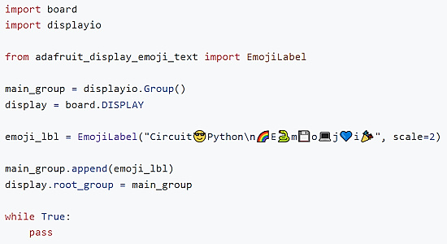](https://github.com/adafruit/Adafruit_CircuitPython_Display_Emoji_Text)

A new CircuitPython `Displayio` class is available for displaying text that contains emoji - [GitHub](https://github.com/adafruit/Adafruit_CircuitPython_Display_Emoji_Text).

## Choosing a Microcontroller

[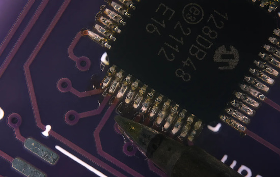](https://lcamtuf.substack.com/p/choosing-a-microcontroller)

RP2040, ESP32, AVR, CH32V003, STM32...? When it comes to hobby projects, there's plenty of choice and just as much zealotry. This article goes over what to focus on when chosing your next microcontroller - [lcamtuf's thing](https://lcamtuf.substack.com/p/choosing-a-microcontroller). Via [Hackaday](https://hackaday.com/2025/02/14/a-guide-to-making-the-right-microcontroller-choice/).

## KiCad 9.0.0 Final Released

The next major version of KiCad, the free circuit board design package, is out. Version 9 is packed with new features, improvements, and hundreds of bug fixes. Head to the [KiCad download page](https://www.kicad.org/download/) to get it - [KiCad Blog](https://www.kicad.org/blog/2025/02/Version-9.0.0-Released/) and [hackster.io](https://www.hackster.io/news/open-source-eda-star-kicad-hits-version-9-0-0-gains-a-wealth-of-new-features-46cea6be042e).

The latest version 8 bug fix release, 8.0.9, is also out - [KiCad](https://www.kicad.org/blog/2025/02/KiCad-8.0.9-Release/).

See the KiCad conference list in events later in this newsletter.

## The Raspberry Pi RP2040 May Officially be clocked at 200 MHz

[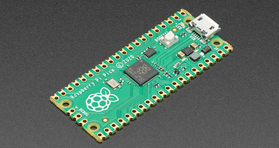](https://github.com/raspberrypi/pico-sdk/releases/tag/2.1.1)

Version 2.1.1 of the Raspberry Pi Microcontroller software development kit (SDK) allows the RP2040 microcontroller to be clocked from the default 125MHz to 200MHz. This does not void the warranty and provides for a performance boost. A bunch of other improvements come with this SDK release - [GitHub](https://github.com/raspberrypi/pico-sdk/releases/tag/2.1.1) and [CNX Software](https://www.cnx-software.com/2025/02/20/raspberry-pi-pico-sdk-2-1-1-release-adds-200mhz-clock-option-for-rp2040-various-waveshare-boards-new-code-samples/). Via [X](https://bsky.app/profile/alasdairallan.com/post/3lijqd5r2hs2m).

## GitHub for Beginners

GitHub has a whole series of articles and videos to help beginners to the code repository, such as [the top 12 Git commands every developer must know](https://github.blog/developer-skills/github/top-12-git-commands-every-developer-must-know/) - [GitHub Blog](https://github.blog/developer-skills/github/).

## The Raspberry Pi RP2350 is now available at JLCPCB

The new Raspberry Pi RP2350 microcontroller is now available via the Chinese circuit board company JLCPCB's fast-turn PCB assembly service. Raspberry Pi also has a helpful [reference design](https://datasheets.raspberrypi.com/rp2350/Minimal-KiCAD.zip) in KiCad format. This should help makers fabricate circuit boards with components already soldered on - [Raspberry Pi News](https://www.raspberrypi.com/news/rp2350-now-available-at-jlcpcb/).

## The 2024 Arduino Open Source Report is Out

Arduino has released a snapshot report of 2024 for the board maker including their ecosystem and statistics - [Arduino Blog](https://blog.arduino.cc/2025/02/19/the-2024-arduino-open-source-report-is-here/) and [Report](https://content.arduino.cc/assets/Arduino%20Open%20Source%20Report%202024.pdf) (PDF).

## An All Open Source European RISC-V 

[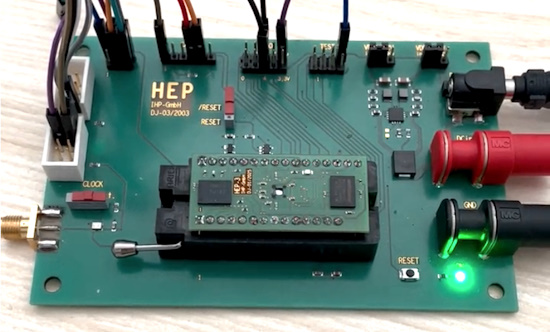](https://www.linkedin.com/posts/daniel-schultz-35a369198_semiconductors-eda-microcontrollers-ugcPost-7297167431351840768-g-d6/)

Europe’s first end-to-end open-source microcontroller, based on RISC-V, is up and running successfully, booting and executing code. - [LinkedIn](https://www.linkedin.com/posts/daniel-schultz-35a369198_semiconductors-eda-microcontrollers-ugcPost-7297167431351840768-g-d6/) and [GitHub](https://github.com/aesc-silicon/ElemRV).

## This Week's Python Streams

Python on Hardware is all about building a cooperative ecosphere which allows contributions to be valued and to grow knowledge. Below are the streams within the last week focusing on the community.

**CircuitPython Deep Dive Stream**

[Last Friday](https://youtube.com/live/dC4jqKFRKIM), Scott was gaming on Adafruit Fruit Jam.

You can see the latest video and past videos on the Adafruit YouTube channel under the Deep Dive playlist - [YouTube](https://www.youtube.com/playlist?list=PLjF7R1fz_OOXBHlu9msoXq2jQN4JpCk8A).

**CircuitPython Parsec**

John Park’s CircuitPython Parsec is off this week. Catch all the episodes in the [YouTube playlist](https://www.youtube.com/playlist?list=PLjF7R1fz_OOWFqZfqW9jlvQSIUmwn9lWr).

**The CircuitPython Show**

In the latest episode released February 24th and the second in a three part series, CircuitPython core developer Dan Halbert shares his advice and tips for building CircuitPython from source - [The CircuitPython Show](https://www.circuitpythonshow.com/@circuitpythonshow).

**CircuitPython Weekly Meeting**

CircuitPython Weekly Meeting for February 18, 2025 ([notes](https://github.com/adafruit/adafruit-circuitpython-weekly-meeting/blob/main/2025/2025-02-18.md)) [on YouTube](https://youtu.be/6ymag5FpG3c).

## Project of the Week: Raspberry Pi Map of Manhattan Shows Subway Train Status

A project from Reddit user Bicapitate allows you to track NYC subway trains in real-time on a 3D-printed map of the island. The map shows the actual location of the subway trains using a Raspberry Pi connected to RGB LED matrices which in turn connect to the map via fiber optics run using Python - [Reddit](https://www.reddit.com/r/nycrail/comments/1ir8hfh/i_made_this_map_of_manhattan_that_displays_the/), [Tom's Hardware](https://www.tomshardware.com/raspberry-pi/this-raspberry-pi-map-of-manhattan-shows-real-time-subway-train-status) and [Adafruit Blog](https://blog.adafruit.com/2025/02/19/a-raspberry-pi-map-of-manhattan-which-shows-subway-train-status/).

## Popular Last Week

What was the most popular, most clicked link, in [last week's newsletter](https://www.adafruitdaily.com/2025/02/17/python-on-microcontrollers-newsletter-comparing-python-micropython-and-circuitpython-pi-speed-and-more-circuitpython-python-micropython-thepsf-raspberry_pi/)? [Python, MicroPython, and CircuitPython: Similarities and Differences](https://www.digikey.com/en/maker/tutorials/2025/python-micropython-and-circuitpython-similarities-and-differences).

Did you know you can read past issues of this newsletter in the Adafruit Daily Archive? [Check it out](https://www.adafruitdaily.com/category/circuitpython/).

## New Notes from Adafruit Playground

[Adafruit Playground](https://adafruit-playground.com/) is a new place for the community to post their projects and other making tips/tricks/techniques. Ad-free, it's an easy way to publish your work in a safe space for free.

text - [Adafruit Playground](url).

[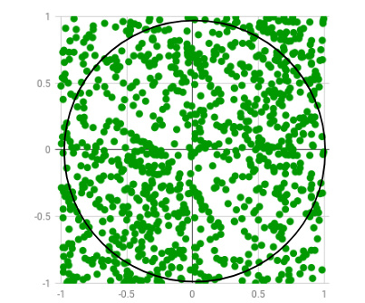](https://adafruit-playground.com/u/mrklingon/pages/piece-of-pi-with-a-neotrinkey)

Piece Of Pi with a NeoTrinkey - [Adafruit Playground](https://adafruit-playground.com/u/mrklingon/pages/piece-of-pi-with-a-neotrinkey).

[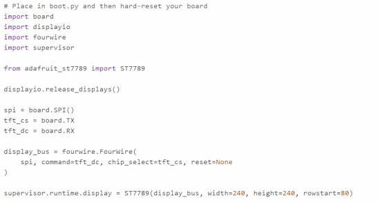](https://adafruit-playground.com/u/jepler/pages/supervisor-runtime-display-in-circuitpython-9-2-5)

supervisor.runtime.display in CircuitPython 9.2.5+ simplifies display specifying - [Adafruit Playground](https://adafruit-playground.com/u/jepler/pages/supervisor-runtime-display-in-circuitpython-9-2-5).

## News From Around the Web

[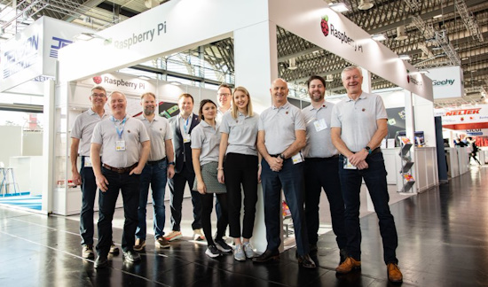](https://www.raspberrypi.com/news/meet-the-raspberry-pi-team/)

Meet the Raspberry Pi team as they travel the event circuit in March, April, and May - [Raspberry Pi News](https://www.raspberrypi.com/news/meet-the-raspberry-pi-team/).

[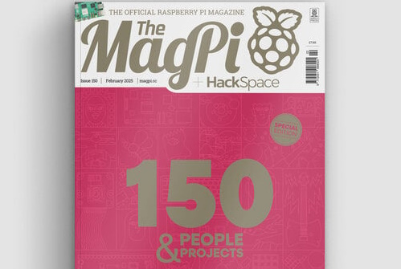](https://magpi.raspberrypi.com/issues/150)

... and speaking of Raspberry Pi, their official magazine, The MagPi, has published its 150th issue - [The MagPi](https://magpi.raspberrypi.com/issues/150).

[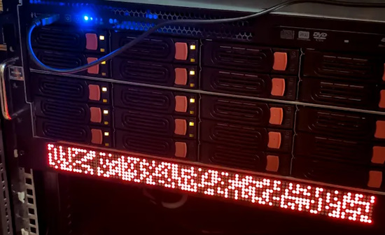](https://www.printables.com/model/1167457-1u-rack-mount-wopr-leds-enclosure)

A 1U rack mount WOPR LED enclosure using a Raspberry Pi Pico and MicroPython - [Printables](https://www.printables.com/model/1167457-1u-rack-mount-wopr-leds-enclosure). Via [Hackaday](https://hackaday.com/2025/02/19/add-a-little-wopr-to-your-server-rack/).

[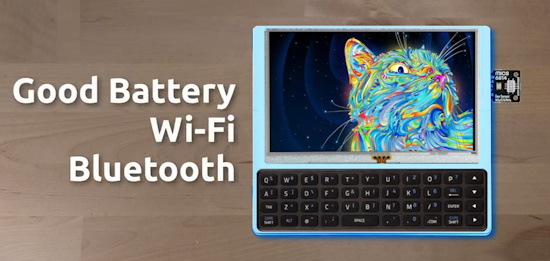](https://www.youtube.com/watch?v=rnwPmoWMGqk)

Abe's Projects looks to build the ideal mini computer / Cyberdeck using MicroPython and CircuitPython - [YouTube](https://www.youtube.com/watch?v=rnwPmoWMGqk).

[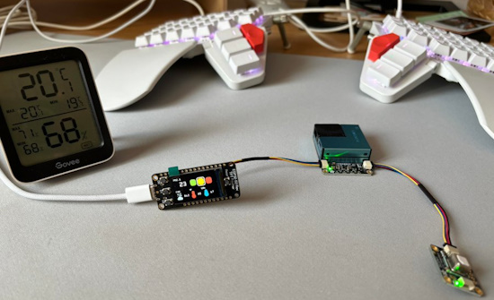](https://x.com/NickGnd/status/1891518672226677152)

An air quality index system with Adafruit Feather and CircuitPython - [X](https://x.com/NickGnd/status/1891518672226677152).

[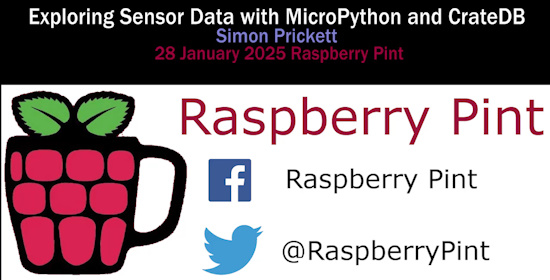](https://www.youtube.com/watch?v=c4CArvphNeM)

Simon Prickett - Exploring Sensor Data with Crate DB and MicroPython - [YouTube](https://www.youtube.com/watch?v=c4CArvphNeM).

Chess using a touch display using MicroPython - [GitHub](https://github.com/orgs/micropython/discussions/16791) and [GitHub](https://github.com/peterhinch/micropython-touch/blob/master/optional/chess/CHESS.md).

[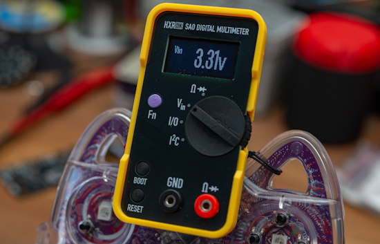](https://github.com/flummer/dmm-sao)

A SAO digital multimeter - [GitHub](https://github.com/flummer/dmm-sao) and [hackaday.io](https://hackaday.io/project/198892-sao-digital-multimeter).

Features (implemented):

- Measure supply input voltage (from the badge)
- GPIO info (read, digital + analog)
- LED/Diode test
- Continuity test
- Resistance measurement

Features (planned):

- I2C Tester
- GPIO info (write, digital/PWM)

[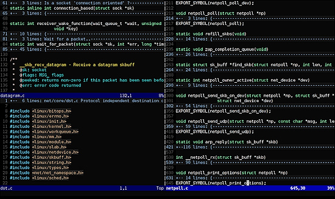](https://thenewstack.io/a-look-at-vim-a-text-editor-for-the-ages/)

A look at Vim, a text editor for the ages - [The New Stack](https://thenewstack.io/a-look-at-vim-a-text-editor-for-the-ages/).

[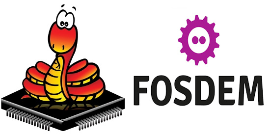](https://lwn.net/Articles/1009011/)

Jon Nordby's talk at FOSDEM on emlearn (which uses MicroPython) was covered by LWN - [LWN.net](https://lwn.net/Articles/1009011/).

[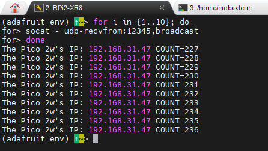](https://x.com/xialulee/status/1890005816465621092)

Broadcast a board's IP address so other devices can connect to it. "I experimented with CircuitPython. Programming sockets in CircuitPython is slightly different from programming in CPython, but the basic ideas are the same." - [X](https://x.com/xialulee/status/1890005816465621092).

[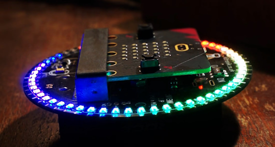](https://www.youtube.com/watch?v=aQs0GlJUX2I)

Clock, stopwatch and rainbow effect on Kitronik ZIP Halo HD in MicroPython - [YouTube](https://www.youtube.com/watch?v=aQs0GlJUX2I).

[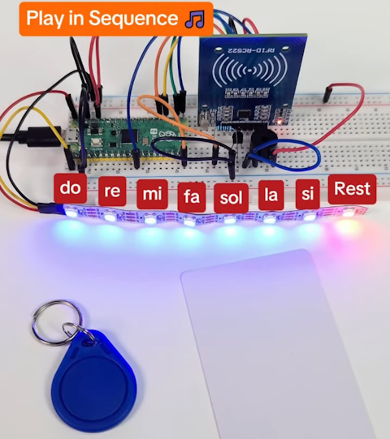](https://docs.sunfounder.com/projects/pico-2w-kit/en/latest/pyproject/py_rfid_music_player.html)

An RFID Music Player with MicroPython and Raspberry Pi Pico 2 W - [SunFounder](https://docs.sunfounder.com/projects/pico-2w-kit/en/latest/pyproject/py_rfid_music_player.html) and [YouTube](https://www.youtube.com/shorts/ZWiwS9e2tMw).

text - [site](url).

text - [site](url).

text - [site](url).

text - [site](url).

text - [site](url).

[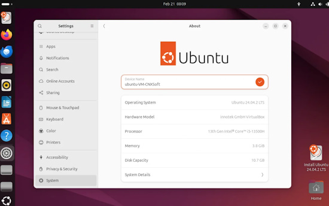](https://www.cnx-software.com/2025/02/21/ubuntu-24-04-2-linux-6-11-kernel-and-hardware-enablement-stack/)

Ubuntu 24.04.2 released with Linux 6.11 kernel and hardware enablement stack - [CNX Software](https://www.cnx-software.com/2025/02/21/ubuntu-24-04-2-linux-6-11-kernel-and-hardware-enablement-stack/).

## New

[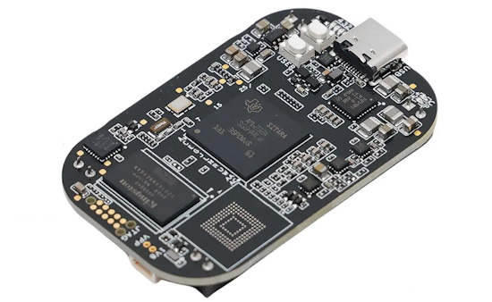](https://www.cnx-software.com/2025/02/18/pocketbeagle-2-sbc-combines-ti-am6232-soc-with-mspm0-mcu/)

Beagleboard has recently announced the PocketBeagle 2, a single board computer (SBC) built around TI’s AM6232 dual-core Cortex-A53 and Cortex-M7 SoC and an additional MSPM0L1105 Arm Cortex-M0+ microcontroller for ADC pins and board ID storage - [Product Page](https://www.beagleboard.org/boards/pocketbeagle-2). Via [CNX Software](https://www.cnx-software.com/2025/02/18/pocketbeagle-2-sbc-combines-ti-am6232-soc-with-mspm0-mcu/).

The Super Tiny RP2040/ESP32 Display Development Board with either a RP2040 or ESP32-S3. 0.85-inch TFT display (128×128). Compatible with MicroPython, CircuitPython, and Arduino - [Geeky Gadgets](https://www.geeky-gadgets.com/super-tiny-rp2040-esp32-board-display-for-iot-and-diy-projects/).

## New Boards Supported by CircuitPython

The number of supported microcontrollers and Single Board Computers (SBC) grows every week. This section outlines which boards have been included in CircuitPython or added to [CircuitPython.org](https://circuitpython.org/).

This week there were no new boards added.

*Note: For non-Adafruit boards, please use the support forums of the board manufacturer for assistance, as Adafruit does not have the hardware to assist in troubleshooting.*

Looking to add a new board to CircuitPython? It's highly encouraged! Adafruit has four guides to help you do so:

- [How to Add a New Board to CircuitPython](https://learn.adafruit.com/how-to-add-a-new-board-to-circuitpython/overview)
- [How to add a New Board to the circuitpython.org website](https://learn.adafruit.com/how-to-add-a-new-board-to-the-circuitpython-org-website)
- [Adding a Single Board Computer to PlatformDetect for Blinka](https://learn.adafruit.com/adding-a-single-board-computer-to-platformdetect-for-blinka)
- [Adding a Single Board Computer to Blinka](https://learn.adafruit.com/adding-a-single-board-computer-to-blinka)

## New Learn Guides

[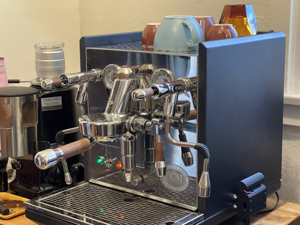](https://learn.adafruit.com/guides/latest)

The Adafruit Learning System has over 3,000 free guides for learning skills and building projects including using Python.

[Espresso Water Tank Meter](https://learn.adafruit.com/espresso-water-tank-meter) from [John Park](https://learn.adafruit.com/u/johnpark)

[Cartoon Character Clock](https://learn.adafruit.com/cartoon-character-clock/project-setup) from [Tim C](https://learn.adafruit.com/u/Foamyguy).

[Illuminated Butterfly Wall Art](https://learn.adafruit.com/illuminated-butterfly-wall-art) from [Ben Everard](https://learn.adafruit.com/u/benev)

## Updated Learn Guides

[Adafruit Feather RP2040 with USB Type A Host](https://learn.adafruit.com/adafruit-feather-rp2040-with-usb-type-a-host) - [CircuitPython USB Host Read Data](https://learn.adafruit.com/adafruit-feather-rp2040-with-usb-type-a-host/usb-host-read-data) by Tim.

## CircuitPython Libraries

The CircuitPython library numbers are continually increasing, while existing ones continue to be updated. Here we provide library numbers and updates!

To get the latest Adafruit libraries, download the [Adafruit CircuitPython Library Bundle](https://circuitpython.org/libraries). To get the latest community contributed libraries, download the [CircuitPython Community Bundle](https://circuitpython.org/libraries).

If you'd like to contribute to the CircuitPython project on the Python side of things, the libraries are a great place to start. Check out the [CircuitPython.org Contributing page](https://circuitpython.org/contributing). If you're interested in reviewing, check out Open Pull Requests. If you'd like to contribute code or documentation, check out Open Issues. We have a guide on [contributing to CircuitPython with Git and GitHub](https://learn.adafruit.com/contribute-to-circuitpython-with-git-and-github), and you can find us in the #help-with-circuitpython and #circuitpython-dev channels on the [Adafruit Discord](https://adafru.it/discord).

You can check out this [list of all the Adafruit CircuitPython libraries and drivers available](https://github.com/adafruit/Adafruit_CircuitPython_Bundle/blob/master/circuitpython_library_list.md). 

The current number of CircuitPython libraries is **507**!

**New Libraries**

Here's this week's new CircuitPython libraries:

  * [adafruit/Adafruit_CircuitPython_DACx578](https://github.com/adafruit/Adafruit_CircuitPython_DACx578)

**Updated Libraries**

Here's this week's updated CircuitPython libraries:

  * [adafruit/Adafruit_CircuitPython_ImageLoad](https://github.com/adafruit/Adafruit_CircuitPython_ImageLoad)
  * [adafruit/Adafruit_CircuitPython_RFM](https://github.com/adafruit/Adafruit_CircuitPython_RFM)
  * [FoamyGuy/CircuitPython_GameControls](https://github.com/FoamyGuy/CircuitPython_GameControls)
  * [jposada202020/CircuitPython_DISPLAY_HT16K33](https://github.com/jposada202020/CircuitPython_DISPLAY_HT16K33)
  * [jposada202020/CircuitPython_uplot](https://github.com/jposada202020/CircuitPython_uplot)
  * [jepler/Jepler_CircuitPython_udecimal](https://github.com/jepler/Jepler_CircuitPython_udecimal)

## What’s the CircuitPython team up to this week?

What is the team up to this week? Let’s check in:

**Dan**

I released NINA-FW 2.0.0+adafruit for AirLift coprocessors, and am now working on updating NINA-FW from ESP-IDF 3.3.1 to ESP-IDF 5.4. ESP-IDF changed internally from using Makefiles to using CMake, so first I'm working on getting the build working again.

**Tim**

I've been working mainly on guide pages for the Metro RP2350. Two other smaller things I've done are 1) write code and a new guide page for the Feather RP2040 USB Host that illustrates how to read data from a generic USB game pad. And 2) Hacked together a displayio class for displaying text that contains emoji. It grew out of ideas discussed on the recent deep dive, and is still in the very early stages.

**Jeff**

In the CircuitPython core, I arranged it so that the Feather RP2350 and Metro RP2350 would automatically configure a display if they detect a monitor plugged in at boot time.

As part of this work, all boards with `displayio` have the new property `supervisor.runtime.display`. This property holds the display configured by the core at boot time if there is one (just like `board.DISPLAY`). If you set up a display of your own, whether in **code.py** or **boot.py**, you can assign it to `supervisor.runtime.display` and the display will remain available on the next run of **code.py** until released by `displayio.release_displays()`.

**Scott**

This week I've been working on testing the Fruit Jam prototype. USB host hasn't been working very well so that's taken some time. I2S audio worked from the get go. I've added support for DVI at 720x400 which is surprisingly well supported by TVs. I'm also adding the ability to quadruple pixels so that the framebuffer is small (180x100) and fast to update.

**Liz**

This week I worked on a guide for the [DAC7578 breakout](https://learn.adafruit.com/adafruit-dac7578-8-x-channel-12-bit-i2c-dac). This DAC has 8 outputs up to 12-bits. I ported ladyada's Arduino library to CircuitPython and the guide has examples for both. The main demo I included for each page generates sine tones at different frequencies on each channel. I hooked up two channels to my oscilloscope to show off the demo..

## Upcoming Events

The next MicroPython Meetup in Melbourne, Australia will be on February 26th – [Meetup](https://www.meetup.com/micropython-meetup/events). You can see recordings of previous meetings on [YouTube](https://www.youtube.com/@MicroPythonOfficial). 

Embedded World 2025 will be held March 11 to 13, 2025 in Nuremberg, Germany. [Raspberry Pi](https://x.com/Raspberry_Pi/status/1889333638417768590) will be there - [Embedded World](https://www.embedded-world.de/en).

The community is coming back to Pittsburgh, Pennsylvania for PyCon US 2025 May 14 - May 22, 2025 - [us.pycon.org](https://us.pycon.org/2025/).

KiCad conferences (KiCon) to be held this year include 28 - 30 May 2025 in San Diego, California, 19 - 20 Sept 2024 in Bochum, Germany, and to be determined in Asia - [KiCad](https://kicon.kicad.org/).

Open Hardware Summit 2025 is being held May 30 @ 10am - May 31 @ 6pm GMT+1 in Edinburgh, Scotland - [Eventbrite](https://www.eventbrite.com/e/open-hardware-summit-2025-tickets-1067611086499).

**Send Your Events In**

If you know of virtual events or upcoming events, please let us know via email to cpnews(at)adafruit(dot)com.

## Latest Releases

CircuitPython's stable release is [9.2.4](https://github.com/adafruit/circuitpython/releases/latest). New to CircuitPython? Start with our [Welcome to CircuitPython Guide](https://learn.adafruit.com/welcome-to-circuitpython).

[20250221](https://github.com/adafruit/Adafruit_CircuitPython_Bundle/releases/latest) is the latest Adafruit CircuitPython library bundle.

[20250220](https://github.com/adafruit/CircuitPython_Community_Bundle/releases/latest) is the latest CircuitPython Community library bundle.

[v1.24.1](https://micropython.org/download) is the latest MicroPython release. Documentation for it is [here](http://docs.micropython.org/en/latest/pyboard/).

[3.13.2](https://www.python.org/downloads/) is the latest Python release. The latest pre-release version is [3.14.0a5](https://www.python.org/download/pre-releases/).

[4,202 Stars](https://github.com/adafruit/circuitpython/stargazers) Like CircuitPython? [Star it on GitHub!](https://github.com/adafruit/circuitpython)

## Call for Help -- Translating CircuitPython is now easier than ever

[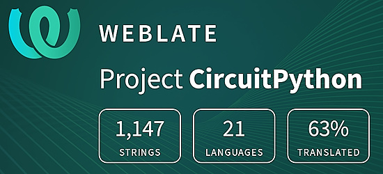](https://hosted.weblate.org/engage/circuitpython/)

One important feature of CircuitPython is translated control and error messages. With the help of fellow open source project [Weblate](https://weblate.org/), we're making it even easier to add or improve translations. 

Sign in with an existing account such as GitHub, Google or Facebook and start contributing through a simple web interface. No forks or pull requests needed! As always, if you run into trouble join us on [Discord](https://adafru.it/discord), we're here to help.

## 38,783 Thanks

The Adafruit Discord community, where we do all our CircuitPython development in the open, reached over 38,783 humans - thank you! Adafruit believes Discord offers a unique way for Python on hardware folks to connect. Join today at [https://adafru.it/discord](https://adafru.it/discord).

## ICYMI - In case you missed it

Python on hardware is the Adafruit Python video-newsletter-podcast! The news comes from the Python community, Discord, Adafruit communities and more and is broadcast on ASK an ENGINEER Wednesdays. The complete Python on Hardware weekly videocast [playlist is here](https://www.youtube.com/playlist?list=PLjF7R1fz_OOXRMjM7Sm0J2Xt6H81TdDev). The video podcast is on [iTunes](https://itunes.apple.com/us/podcast/python-on-hardware/id1451685192?mt=2), [YouTube](http://adafru.it/pohepisodes), [Instagram](https://www.instagram.com/adafruit/channel/)), and [XML](https://itunes.apple.com/us/podcast/python-on-hardware/id1451685192?mt=2).

[The weekly community chat on Adafruit Discord server CircuitPython channel - Audio / Podcast edition](https://itunes.apple.com/us/podcast/circuitpython-weekly-meeting/id1451685016) - Audio from the Discord chat space for CircuitPython, meetings are usually Mondays at 2pm ET, this is the audio version on [iTunes](https://itunes.apple.com/us/podcast/circuitpython-weekly-meeting/id1451685016), Pocket Casts, [Spotify](https://adafru.it/spotify), and [XML feed](https://adafruit-podcasts.s3.amazonaws.com/circuitpython_weekly_meeting/audio-podcast.xml).

## Contribute

The CircuitPython Weekly Newsletter is a CircuitPython community-run newsletter emailed every Monday. The complete [archives are here](https://www.adafruitdaily.com/category/circuitpython/). It highlights the latest CircuitPython related news from around the web including Python and MicroPython developments. To contribute, edit next week's draft [on GitHub](https://github.com/adafruit/circuitpython-weekly-newsletter/tree/gh-pages/_drafts) and [submit a pull request](https://help.github.com/articles/editing-files-in-your-repository/) with the changes. You may also tag your information on Twitter with #CircuitPython. 

Join the Adafruit [Discord](https://adafru.it/discord) or [post to the forum](https://forums.adafruit.com/viewforum.php?f=60) if you have questions.
