- [ ] Library and info updates
- [ ] change date
- [ ] update title
- [ ] Feature story
- [ ] Update  for images
- [ ] Update ICYDNCI
- [ ] All images 550w max only
- [ ] Link "View this email in your browser."

News Sources

- [Adafruit Playground](https://adafruit-playground.com/)
- Twitter: [CircuitPython](https://twitter.com/search?q=circuitpython&src=typed_query&f=live), [MicroPython](https://twitter.com/search?q=micropython&src=typed_query&f=live) and [Python](https://twitter.com/search?q=python&src=typed_query)
- [Raspberry Pi News](https://www.raspberrypi.com/news/)
- Mastodon [CircuitPython](https://octodon.social/tags/CircuitPython) and [MicroPython](https://octodon.social/tags/MicroPython)
- [hackster.io CircuitPython](https://www.hackster.io/search?q=circuitpython&i=projects&sort_by=most_recent) and [MicroPython](https://www.hackster.io/search?q=micropython&i=projects&sort_by=most_recent)
- YouTube: [CircuitPython](https://www.youtube.com/results?search_query=circuitpython&sp=CAI%253D), [MicroPython](https://www.youtube.com/results?search_query=micropython&sp=CAI%253D)
- Instructables: [CircuitPython](https://www.instructables.com/search/?q=circuitpython&projects=all&sort=Newest), [MicroPython](https://www.instructables.com/search/?q=micropython&projects=all&sort=Newest), [Raspberry Pi Python](https://www.instructables.com/search/?q=raspberry+pi+python&projects=all&sort=Newest)
- [hackaday CircuitPython](https://hackaday.com/blog/?s=circuitpython) and [MicroPython](https://hackaday.com/blog/?s=micropython)
- [python.org](https://www.python.org/)
- [Python Insider - dev team blog](https://pythoninsider.blogspot.com/)
- Individuals: [Jeff Geerling](https://www.jeffgeerling.com/blog), [Yakroo](https://x.com/Yakroo5077)
- Tom's Hardware: [CircuitPython](https://www.tomshardware.com/search?searchTerm=circuitpython&articleType=all&sortBy=publishedDate) and [MicroPython](https://www.tomshardware.com/search?searchTerm=micropython&articleType=all&sortBy=publishedDate) and [Raspberry Pi](https://www.tomshardware.com/search?searchTerm=raspberry%20pi&articleType=all&sortBy=publishedDate)
- [hackaday.io newest projects MicroPython](https://hackaday.io/projects?tag=micropython&sort=date) and [CircuitPython](https://hackaday.io/projects?tag=circuitpython&sort=date)
- [Google News Python](https://news.google.com/topics/CAAqIQgKIhtDQkFTRGdvSUwyMHZNRFY2TVY4U0FtVnVLQUFQAQ?hl=en-US&gl=US&ceid=US%3Aen)
- hackaday.io - [CircuitPython](https://hackaday.io/search?term=circuitpython) and [MicroPython](https://hackaday.io/search?term=micropython)

View this email in your browser. **Warning: Flashing Imagery**

Welcome to the latest Python on Microcontrollers newsletter! *insert 2-3 sentences from editor (what's in overview, banter)* - *Anne Barela, Editor*

We're on [Discord](https://discord.gg/HYqvREz), [Twitter/X](https://twitter.com/search?q=circuitpython&src=typed_query&f=live), [BlueSky](https://bsky.app/profile/circuitpython.org) and for past newsletters - [view them all here](https://www.adafruitdaily.com/category/circuitpython/). If you're reading this on the web, [subscribe here](https://www.adafruitdaily.com/). Here's the news this week:

## Resources for Learning Embedded Systems

[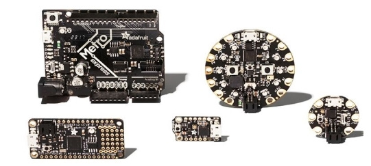](url)

When getting started working with embedded systems, there is a lack of information available to beginners. Embedded Artistry has gathered useful reference materials to get you started with programming and embedded systems development - [Embedded Artistry](https://embeddedartistry.com/beginners/).

## Claude 3.7 Sonnet and Claude Code

[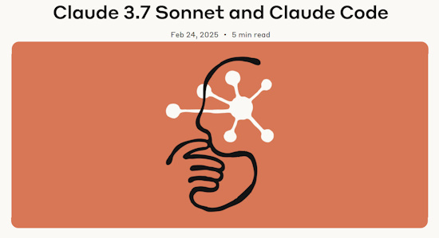](https://embeddedartistry.com/beginners/)

Claude 3.7 Sonnet is out and shows strong improvements in coding and front-end web development. Along with the model, Anthropic also introduced a command line tool for agentic coding, Claude Code. Claude Code is available as a limited research preview, and enables developers to delegate substantial engineering tasks to Claude directly from their terminal - [Anthropic](https://www.anthropic.com/news/claude-3-7-sonnet).

Examples:

* A [Reddit post](https://www.reddit.com/r/ClaudeAI/comments/1iyumpf/i_uploaded_a_27yearold_exe_file_to_claude_37_and/) detailing how someone took a 27-year-old visual basic EXE file, fed it to Claude 3.7, and watched as it reverse-engineered the program and rewrote it in Python.
* [Adafruit posts](https://x.com/adafruit/status/1895336439853822014) "We're vibin' with Claude 3.7 and writing uBlox drivers", implementing a complex protocol driver using Claude 3.7.

## The MagPi is now the Raspberry Pi Official Magazine

[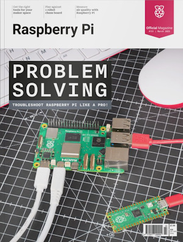](https://www.raspberrypi.com/news/introducing-raspberry-pi-official-magazine/)

The MagPi magazine, including HackSpace, has been reborn as the Raspberry Pi Official Magazine. They have a special offer currently, get three issues for ten UK Pounds. Issue 150 is now out - [Raspberry Pi News](https://www.raspberrypi.com/news/introducing-raspberry-pi-official-magazine/). Via [X](https://x.com/Raspberry_Pi/status/1895096799985127684).

## 4 Things the Raspberry Pi Does Better Than Any Other Single-Board Computer

[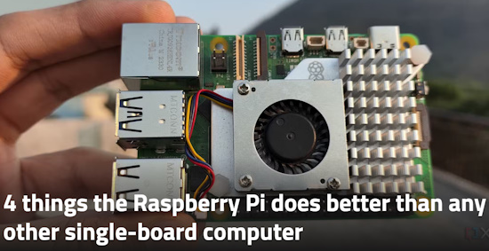](https://www.xda-developers.com/things-raspberry-pi-does-better-than-other-sbcs/)

While the modern Raspberry Pi series has several shortcomings that make it tempting to switch to competitors, the Raspberry Pi boards still pack plenty of quality-of-life facilities to enhance projects. XDA provides four reasons why the Raspberry Pi remains a superpower in the Single-Board Computer industry - [XDA](https://www.xda-developers.com/things-raspberry-pi-does-better-than-other-sbcs/).

## You Should Build a Robot 

Thinking about building a robot? You should! But don’t know where to start? In a PyCascades talk, Sage Elliot breaks down the barriers in building your own robotic project using MicroPython and microprocessors. You'll learn what a robot is, why building one is fun (maybe even useful), and how to get started with the essential components. The talk covers microprocessors as the "brain" of your robot, LEDs for visual feedback, actuators for adding movement, and sensors for touch and light - [YouTube](https://www.youtube.com/watch?v=UygK5W3txTM).

## Raspberry Pi Turns Thirteen

[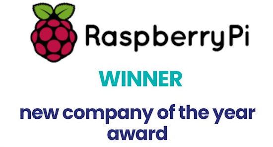](https://x.com/Raspberry_Pi/status/1895504492940218713)

Raspberry Pi sold first product on 29 February, 2012. On their 13th birthday (or as close as we can get when it isn't a leap year), and their first as a publicly listed company, they've been awarded new company of the year in the PLC Awards 2024 - [X](https://x.com/Raspberry_Pi/status/1895504492940218713).

## This Week's Python Streams

Python on Hardware is all about building a cooperative ecosphere which allows contributions to be valued and to grow knowledge. Below are the streams within the last week focusing on the community.

**CircuitPython Deep Dive Stream**

[Last Friday](https://youtube.com/live/knVABAt2F6Y), Scott did some Fruit Jamming.

You can see the latest video and past videos on the Adafruit YouTube channel under the Deep Dive playlist - [YouTube](https://www.youtube.com/playlist?list=PLjF7R1fz_OOXBHlu9msoXq2jQN4JpCk8A).

**CircuitPython Parsec**

John Park’s CircuitPython Parsec this week is on overclocking the RP2040 & RP2350 - [Adafruit Blog](https://blog.adafruit.com/2025/02/28/john-parks-circuitpython-parsec-overclocking-adafruit-circuitpython/) and [YouTube](https://youtu.be/vBAJ0AmmGn4).

Catch all the episodes in the [YouTube playlist](https://www.youtube.com/playlist?list=PLjF7R1fz_OOWFqZfqW9jlvQSIUmwn9lWr).

**The CircuitPython Show**

In the latest episode of The CircuitPython Show, host Paul Cutler interviews CircuitPython Core Developer Dan Halbert. They discuss building CircuitPython from source and Dan shares some tips and tricks to building it yourself - [The CircuitPython Show](https://www.circuitpythonshow.com).

**CircuitPython Weekly Meeting**

CircuitPython Weekly Meeting for February 24, 2025 ([notes](https://github.com/adafruit/adafruit-circuitpython-weekly-meeting/blob/main/2025/2025-02-24.md)) [on YouTube](https://youtu.be/C99n1FvCZHg).

## Project of the Week: A Weather Station Display

[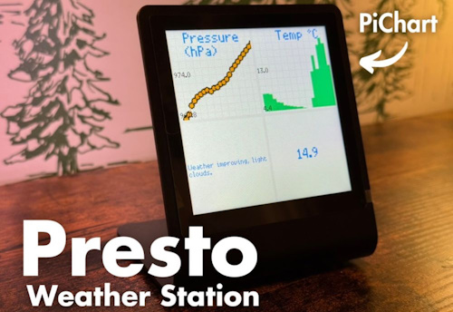](https://www.kevsrobots.com/blog/weather-station-display.html)

A weather station display using a Pimoroni Presto. It displays the current temperature, humidity, and pressure using an RP2350 processor running MicroPython, pushed to an InfluxDB database - [Kev's Robots](https://www.kevsrobots.com/blog/weather-station-display.html).

## Popular Last Week: Choosing a Microcontroller

What was the most popular, most clicked link, in [last week's newsletter](https://www.adafruitdaily.com/2025/02/24/python-on-microcontrollers-newsletter-choosing-a-microcontroller-circuitpython-video-and-much-more-circuitpython-python-micropython-thepsf-raspberry_pi/)? [Choosing a Microcontroller](https://lcamtuf.substack.com/p/choosing-a-microcontroller).

Did you know you can read past issues of this newsletter in the Adafruit Daily Archive? [Check it out](https://www.adafruitdaily.com/category/circuitpython/).

## Adafruit Playground

[Adafruit Playground](https://adafruit-playground.com/) is a new place for the community to post their projects and other making tips/tricks/techniques. Ad-free, it's an easy way to publish your work in a safe space for free.

## News From Around the Web

[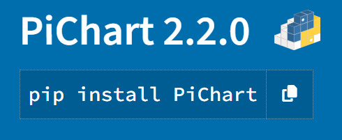](https://pypi.org/project/PiChart/)

PiChart - tiny dashboard charts for MicroPython by Kevin McAleer, MIT license - [PyPI](https://pypi.org/project/PiChart/).

[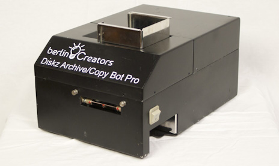](https://www.raspberrypi.com/news/this-floppy-disk-archiver-runs-on-a-raspberry-pi/)

A floppy disk archiver running on a Raspberry Pi with Python - [Raspberry Pi News](https://www.raspberrypi.com/news/this-floppy-disk-archiver-runs-on-a-raspberry-pi/l).

[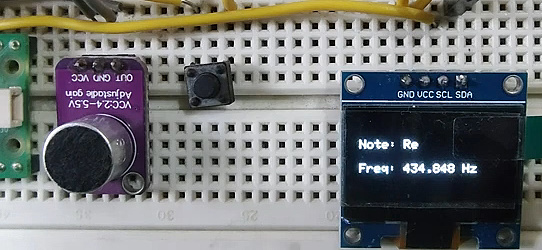](https://www.youtube.com/watch?v=u4khjD6jiP0)

Identifying flute notes using CircuitPython, FFT, and a microphone - [YouTube](https://www.youtube.com/watch?v=u4khjD6jiP0).

[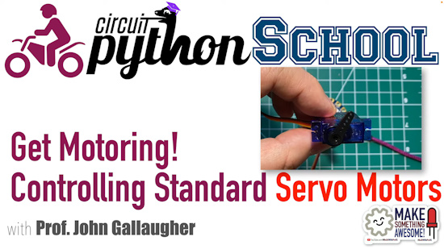](https://www.youtube.com/watch?v=NGfrvYKBbuk)

Motoring with servo motors (CircuitPython School) - [YouTube](https://www.youtube.com/watch?v=NGfrvYKBbuk).

[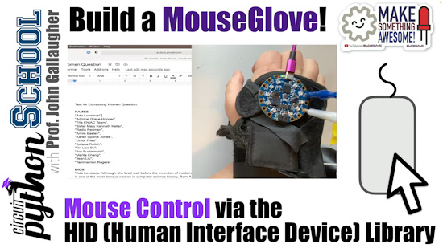](https://www.youtube.com/watch?v=pg_HhOIAg2Q)

Build a Mouse Glove! Controlling the Mouse with HID Libraries (CircuitPython School) - [YouTube](https://www.youtube.com/watch?v=pg_HhOIAg2Q).

Typing and keyboard control using the HID library (CircuitPython School) - [YouTube](https://www.youtube.com/watch?v=5VkYCk3spv8).

[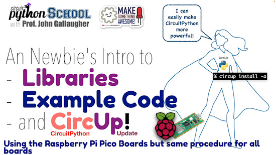](https://www.youtube.com/watch?v=_YhTUtE1Y7E)

CircuitPython Libraries, Example Code, & Using CircUp - [YouTube](https://www.youtube.com/watch?v=_YhTUtE1Y7E).

[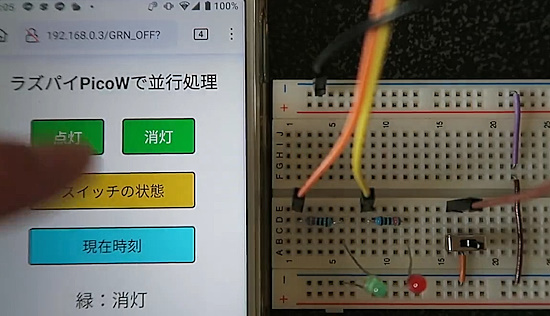](https://ushiken.net/micropython-concurrency)

Running a web server and parallel processing using Raspberry Pi Pico W and MicroPython - [ushiken](https://ushiken.net/micropython-concurrency) (Japanese).

[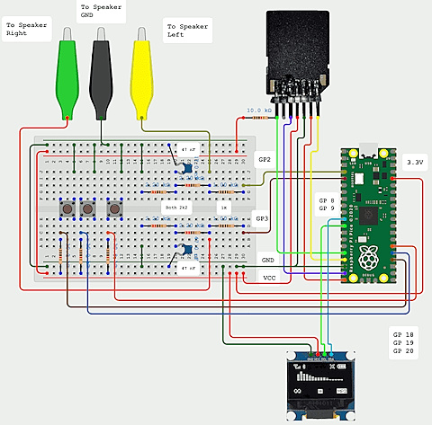](https://lucstechblog.blogspot.com/2025/02/raspberry-pi-pico-audio-player.html)

A Raspberry Pi Pico stereo audio player with MicroPython - [lucstechblog](https://lucstechblog.blogspot.com/2025/02/raspberry-pi-pico-audio-player.html).

[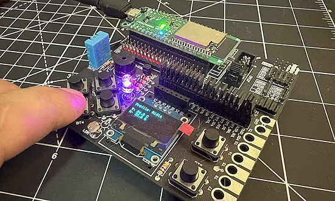](https://www.hackster.io/fabiosouza/diy-macropad-with-circuitpython-and-franzininho-wifi-lab01-ccdbde)

A DIY macropad with CircuitPython and Franzininho WiFi LAB01 - [hackster.io](https://www.hackster.io/fabiosouza/diy-macropad-with-circuitpython-and-franzininho-wifi-lab01-ccdbde).

[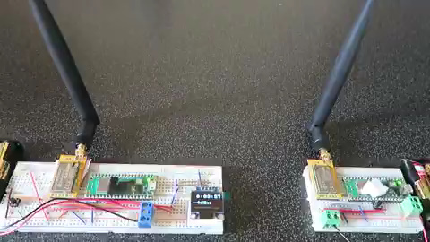]([url](https://ushiken.net/micropython-prvtlora))

Wireless communication (Private LoRa) using Raspberry Pi Pico W and MicroPython - [ushiken]([url](https://ushiken.net/micropython-prvtlora)) (Japanese).

[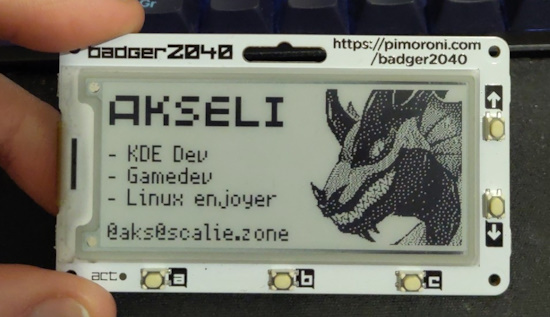](https://octodon.social/@aks@scalie.zone/114050720304612800)

A custom badge with Pimoroni Badger2040 and MicroPython - [Mastodon](https://octodon.social/@aks@scalie.zone/114050720304612800).

text - [site](url).

text - [site](url).

text - [site](url).

[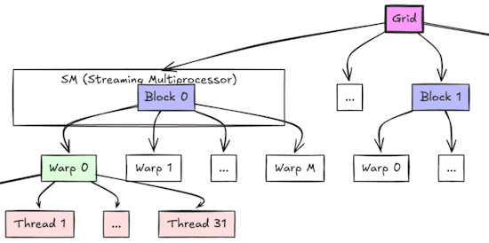](https://hackaday.com/2025/02/25/import-gpu-python-programming-with-cuda/)

Import GPU: Python programming with CUDA - [Hackaday](https://hackaday.com/2025/02/25/import-gpu-python-programming-with-cuda/).

## New

[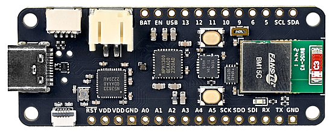](https://hackaday.io/project/202453-royalblue54l-feather)

RoyalBlue54L Feather is a Feather form factor board with Nordic’s nRF54L15 - [hackaday.io](https://hackaday.io/project/202453-royalblue54l-feather) and [CrowdSupply](https://www.crowdsupply.com/lords-boards/royalblue54l-feather).

[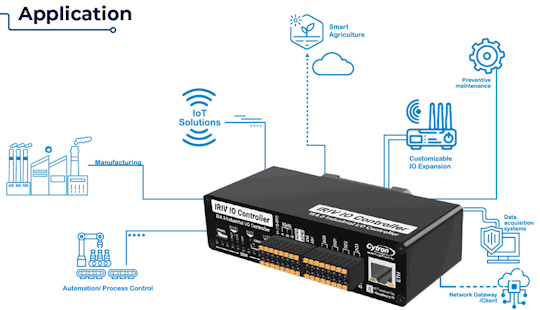](https://x.com/DmxProSales/status/1894442542713741637)

The IRIV IO Controller, an industrial-grade IO controller designed for lightweight automation solutions. It is powered by the new Raspberry Pi RP2350 MCU. They've developed an example in CircuitPython for the IRIV to read inputs and send over MQTT, plus subscribe to topics and update outputs - [X](https://x.com/DmxProSales/status/1894442542713741637), [GitHub](https://github.com/DMXCore/DmxCore100/tree/main/samples/Cytron-IRIV-IO) and [DMX Pro Sales](https://dmxprosales.com/products/cytron-iriv-io-controller).

[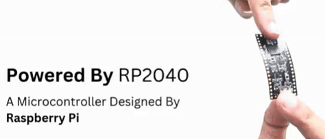](https://www.gadgetify.com/flexipi/)

FlexiPi Bendable is a flexible Raspberry Pi Pico programmable in MicroPython and C - [Gadgetify](https://www.gadgetify.com/flexipi/).

## New Boards Supported by CircuitPython

The number of supported microcontrollers and Single Board Computers (SBC) grows every week. This section outlines which boards have been included in CircuitPython or added to [CircuitPython.org](https://circuitpython.org/).

This week there was one new board added:

- [LOLIN S3 MINI PRO](https://circuitpython.org/board/lolin_s3_mini_pro/)

*Note: For non-Adafruit boards, please use the support forums of the board manufacturer for assistance, as Adafruit does not have the hardware to assist in troubleshooting.*

Looking to add a new board to CircuitPython? It's highly encouraged! Adafruit has four guides to help you do so:

- [How to Add a New Board to CircuitPython](https://learn.adafruit.com/how-to-add-a-new-board-to-circuitpython/overview)
- [How to add a New Board to the circuitpython.org website](https://learn.adafruit.com/how-to-add-a-new-board-to-the-circuitpython-org-website)
- [Adding a Single Board Computer to PlatformDetect for Blinka](https://learn.adafruit.com/adding-a-single-board-computer-to-platformdetect-for-blinka)
- [Adding a Single Board Computer to Blinka](https://learn.adafruit.com/adding-a-single-board-computer-to-blinka)

## New Learn Guides

[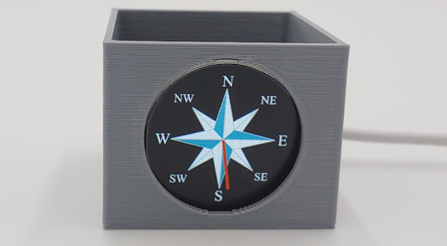](https://learn.adafruit.com/guides/latest)

The Adafruit Learning System has over 3,000 free guides for learning skills and building projects including using Python.

[QT Py S2 Round Display Compass](https://learn.adafruit.com/qt-py-s2-round-display-compass) from [Tim C](https://learn.adafruit.com/u/Foamyguy)

## CircuitPython Libraries

The CircuitPython library numbers are continually increasing, while existing ones continue to be updated. Here we provide library numbers and updates!

To get the latest Adafruit libraries, download the [Adafruit CircuitPython Library Bundle](https://circuitpython.org/libraries). To get the latest community contributed libraries, download the [CircuitPython Community Bundle](https://circuitpython.org/libraries).

If you'd like to contribute to the CircuitPython project on the Python side of things, the libraries are a great place to start. Check out the [CircuitPython.org Contributing page](https://circuitpython.org/contributing). If you're interested in reviewing, check out Open Pull Requests. If you'd like to contribute code or documentation, check out Open Issues. We have a guide on [contributing to CircuitPython with Git and GitHub](https://learn.adafruit.com/contribute-to-circuitpython-with-git-and-github), and you can find us in the #help-with-circuitpython and #circuitpython-dev channels on the [Adafruit Discord](https://adafru.it/discord).

You can check out this [list of all the Adafruit CircuitPython libraries and drivers available](https://github.com/adafruit/Adafruit_CircuitPython_Bundle/blob/master/circuitpython_library_list.md). 

The current number of CircuitPython libraries is **508**!

**New Libraries**

Here's this week's new CircuitPython libraries:

  * [adafruit/Adafruit_CircuitPython_Display_Emoji_Text](https://github.com/adafruit/Adafruit_CircuitPython_Display_Emoji_Text)

**Updated Libraries**

Here's this week's updated CircuitPython libraries:

  * [adafruit/Adafruit_CircuitPython_turtle](https://github.com/adafruit/Adafruit_CircuitPython_turtle)
  * [adafruit/Adafruit_CircuitPython_PortalBase](https://github.com/adafruit/Adafruit_CircuitPython_PortalBase)
  * [adafruit/Adafruit_CircuitPython_ImageLoad](https://github.com/adafruit/Adafruit_CircuitPython_ImageLoad)
  * [adafruit/Adafruit_CircuitPython_WSGI](https://github.com/adafruit/Adafruit_CircuitPython_WSGI)
  * [adafruit/Adafruit_CircuitPython_Qualia](https://github.com/adafruit/Adafruit_CircuitPython_Qualia)
  * [adafruit/Adafruit_CircuitPython_AdafruitIO](https://github.com/adafruit/Adafruit_CircuitPython_AdafruitIO)
  * [adafruit/Adafruit_CircuitPython_PyPortal](https://github.com/adafruit/Adafruit_CircuitPython_PyPortal)

## What’s the CircuitPython team up to this week?

What is the team up to this week? Let’s check in:

**Dan**

I'm making good progress on updating the NINA-FW firmware to use a recent version of ESP-IDF. NINA-FW used on the AirLift ESP32 co-processors. NINA-FW used to have its own modified copies of several Arduino libraries, but I am making it use the updated, standard versions found in the arduino-esp32 Board Support Package for Arduino IDE.

**Tim**

This week I published the initial version of the new display emoji text library, and made some improvements to it like allowing the text color to be set, and allowing the text to be updated. I've been working on a compass project guide for the 240x240 round displays recently added to the store, the guide went live today. I wrote code for a flight radar for the same display, I'll make it into a guide, but there are a few other things to work on before coming back to it. I've also started tinkering in the core to add inverted color functionality for TileGrid, while looking into this I figured out a one-liner statement that can be used to set the colors of the default display for the CircuitPython terminal.

**Jeff**

I've still been spending a lot of time working in Arduino, but I did a few Python items.

First, I worked with Scott and Thach on problems with Pico PIO USB on the Fruit Jam. My particular interest was chasing bugs that affected the RP2350 when it was overclocked. This could affect CircuitPython usage, but was most relevant in Arduino, where the DVI HSTX library always sets an overclock to 264MHz.

Second, I wrote a new example for `piomatter` on the Raspberry Ppi 5. This example uses a library called `pyvirtualdisplay` to run an X11 program in a virtual framebuffer and display the result on an LED panel. Tim will be documenting this in a new page in the guide for this library.

**Scott**

This week I've been deep in the USB weeds. The simplest bug I found was that I wasn't enabling power to the USB ports. 🤦 I also found a few cases where PIO USB isn't receiving correctly and the error recovery isn't quite good enough. I'm going to continue testing with a myriad of USB devices.

**Liz**

This week I've been working on a bigger than normal project- a terminal from the TV show Severance. A few of these projects have been popping up and I'm excited to share my version. I think Severance terminals might be the new Pip Boy. My version is written in Python with Blinka and runs on a Raspberry Pi 5. For the case, I imaged a portable version of the terminal that can also act as a fun Raspberry Pi case with the new touch screen display. The software is a fully playable version of the Macrodata Refinement program with a trackball mouse. I hope to wrap up the guide by next week.

## Upcoming Events

[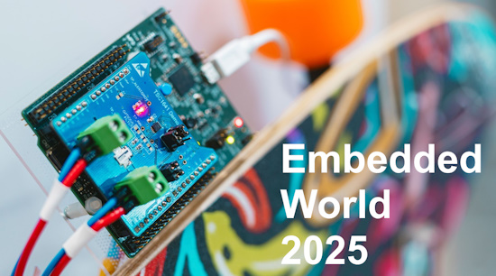](https://www.embedded-world.de/en)

Embedded World 2025 will be held March 11 to 13, 2025 in Nuremberg, Germany. [Raspberry Pi](https://x.com/Raspberry_Pi/status/1889333638417768590) will be there - [Embedded World](https://www.embedded-world.de/en).

The Hackaday Europe hardware conference returns on Saturday, March 15th in Berlin, Germany. Plus extra festivities on the 14th and 16th - [EventBright](https://www.eventbrite.com/e/hackaday-berlin-2025-tickets-1132877470009).

The next MicroPython Meetup in Melbourne will be on March 26th – [Meetup](https://www.meetup.com/micropython-meetup/events). You can see recordings of previous meetings on [YouTube](https://www.youtube.com/@MicroPythonOfficial). 

City of STEM and Maker Faire Los Angeles, California is being held April 12, 2025 - [MakerFaire](https://losangeles.makerfaire.com/).

The community is coming back to Pittsburgh, Pennsylvania for PyCon US 2025 May 14 - May 22, 2025 - [us.pycon.org](https://us.pycon.org/2025/).

KiCad conferences (KiCon) to be held this year include 28 - 30 May 2025 in San Diego, California, 19 - 20 Sept 2024 in Bochum, Germany, and to be determined in Asia - [KiCad](https://kicon.kicad.org/).

Open Hardware Summit 2025 is being held May 30 @ 10am - May 31 @ 6pm GMT+1 in Edinburgh, Scotland - [Eventbrite](https://www.eventbrite.com/e/open-hardware-summit-2025-tickets-1067611086499).

**Send Your Events In**

If you know of virtual events or upcoming events, please let us know via email to cpnews(at)adafruit(dot)com.

## Latest Releases

CircuitPython's stable release is [9.2.4](https://github.com/adafruit/circuitpython/releases/latest). New to CircuitPython? Start with our [Welcome to CircuitPython Guide](https://learn.adafruit.com/welcome-to-circuitpython).

[20250228](https://github.com/adafruit/Adafruit_CircuitPython_Bundle/releases/latest) is the latest Adafruit CircuitPython library bundle.

[20250220](https://github.com/adafruit/CircuitPython_Community_Bundle/releases/latest) is the latest CircuitPython Community library bundle.

[v1,24,1](https://micropython.org/download) is the latest MicroPython release. Documentation for it is [here](http://docs.micropython.org/en/latest/pyboard/).

[3.13.2](https://www.python.org/downloads/) is the latest Python release. The latest pre-release version is [3.14.0a5](https://www.python.org/download/pre-releases/).

[4,206 Stars](https://github.com/adafruit/circuitpython/stargazers) Like CircuitPython? [Star it on GitHub!](https://github.com/adafruit/circuitpython)

## Call for Help -- Translating CircuitPython is now easier than ever

[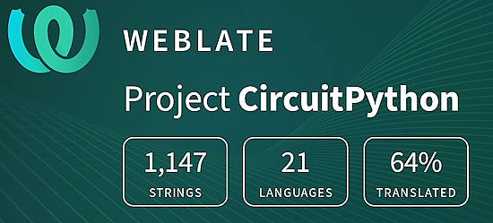](https://hosted.weblate.org/engage/circuitpython/)

One important feature of CircuitPython is translated control and error messages. With the help of fellow open source project [Weblate](https://weblate.org/), we're making it even easier to add or improve translations. 

Sign in with an existing account such as GitHub, Google or Facebook and start contributing through a simple web interface. No forks or pull requests needed! As always, if you run into trouble join us on [Discord](https://adafru.it/discord), we're here to help.

## 38,786 Thanks

The Adafruit Discord community, where we do all our CircuitPython development in the open, reached over 38,786 humans - thank you! Adafruit believes Discord offers a unique way for Python on hardware folks to connect. Join today at [https://adafru.it/discord](https://adafru.it/discord).

## ICYMI - In case you missed it

Python on hardware is the Adafruit Python video-newsletter-podcast! The news comes from the Python community, Discord, Adafruit communities and more and is broadcast on ASK an ENGINEER Wednesdays. The complete Python on Hardware weekly videocast [playlist is here](https://www.youtube.com/playlist?list=PLjF7R1fz_OOXRMjM7Sm0J2Xt6H81TdDev). The video podcast is on [iTunes](https://itunes.apple.com/us/podcast/python-on-hardware/id1451685192?mt=2), [YouTube](http://adafru.it/pohepisodes), [Instagram](https://www.instagram.com/adafruit/channel/)), and [XML](https://itunes.apple.com/us/podcast/python-on-hardware/id1451685192?mt=2).

[The weekly community chat on Adafruit Discord server CircuitPython channel - Audio / Podcast edition](https://itunes.apple.com/us/podcast/circuitpython-weekly-meeting/id1451685016) - Audio from the Discord chat space for CircuitPython, meetings are usually Mondays at 2pm ET, this is the audio version on [iTunes](https://itunes.apple.com/us/podcast/circuitpython-weekly-meeting/id1451685016), Pocket Casts, [Spotify](https://adafru.it/spotify), and [XML feed](https://adafruit-podcasts.s3.amazonaws.com/circuitpython_weekly_meeting/audio-podcast.xml).

## Contribute

The CircuitPython Weekly Newsletter is a CircuitPython community-run newsletter emailed every Monday. The complete [archives are here](https://www.adafruitdaily.com/category/circuitpython/). It highlights the latest CircuitPython related news from around the web including Python and MicroPython developments. To contribute, edit next week's draft [on GitHub](https://github.com/adafruit/circuitpython-weekly-newsletter/tree/gh-pages/_drafts) and [submit a pull request](https://help.github.com/articles/editing-files-in-your-repository/) with the changes. You may also tag your information on Twitter with #CircuitPython. 

Join the Adafruit [Discord](https://adafru.it/discord) or [post to the forum](https://forums.adafruit.com/viewforum.php?f=60) if you have questions.
