- [ ] Library and info updates
- [ ] change date
- [ ] update title
- [ ] Feature story
- [ ] Update  for images
- [ ] Update ICYDNCI
- [ ] All images 550w max only
- [ ] Link "View this email in your browser."

News Sources

- [Adafruit Playground](https://adafruit-playground.com/)
- Twitter: [CircuitPython](https://twitter.com/search?q=circuitpython&src=typed_query&f=live), [MicroPython](https://twitter.com/search?q=micropython&src=typed_query&f=live) and [Python](https://twitter.com/search?q=python&src=typed_query)
- [Raspberry Pi News](https://www.raspberrypi.com/news/)
- Mastodon [CircuitPython](https://octodon.social/tags/CircuitPython) and [MicroPython](https://octodon.social/tags/MicroPython)
- [hackster.io CircuitPython](https://www.hackster.io/search?q=circuitpython&i=projects&sort_by=most_recent) and [MicroPython](https://www.hackster.io/search?q=micropython&i=projects&sort_by=most_recent)
- YouTube: [CircuitPython](https://www.youtube.com/results?search_query=circuitpython&sp=CAI%253D), [MicroPython](https://www.youtube.com/results?search_query=micropython&sp=CAI%253D)
- Instructables: [CircuitPython](https://www.instructables.com/search/?q=circuitpython&projects=all&sort=Newest), [MicroPython](https://www.instructables.com/search/?q=micropython&projects=all&sort=Newest), [Raspberry Pi Python](https://www.instructables.com/search/?q=raspberry+pi+python&projects=all&sort=Newest)
- [hackaday CircuitPython](https://hackaday.com/blog/?s=circuitpython) and [MicroPython](https://hackaday.com/blog/?s=micropython)
- [python.org](https://www.python.org/)
- [Python Insider - dev team blog](https://pythoninsider.blogspot.com/)
- Individuals: [Jeff Geerling](https://www.jeffgeerling.com/blog), [Yakroo](https://x.com/Yakroo5077)
- Tom's Hardware: [CircuitPython](https://www.tomshardware.com/search?searchTerm=circuitpython&articleType=all&sortBy=publishedDate) and [MicroPython](https://www.tomshardware.com/search?searchTerm=micropython&articleType=all&sortBy=publishedDate) and [Raspberry Pi](https://www.tomshardware.com/search?searchTerm=raspberry%20pi&articleType=all&sortBy=publishedDate)
- [hackaday.io newest projects MicroPython](https://hackaday.io/projects?tag=micropython&sort=date) and [CircuitPython](https://hackaday.io/projects?tag=circuitpython&sort=date)
- [Google News Python](https://news.google.com/topics/CAAqIQgKIhtDQkFTRGdvSUwyMHZNRFY2TVY4U0FtVnVLQUFQAQ?hl=en-US&gl=US&ceid=US%3Aen)
- hackaday.io - [CircuitPython](https://hackaday.io/search?term=circuitpython) and [MicroPython](https://hackaday.io/search?term=micropython)

View this email in your browser. **Warning: Flashing Imagery**

Welcome to the latest Python on Microcontrollers newsletter! *insert 2-3 sentences from editor (what's in overview, banter)* - *Anne Barela, Editor*

We're on [Discord](https://discord.gg/HYqvREz), [Twitter/X](https://twitter.com/search?q=circuitpython&src=typed_query&f=live), [BlueSky](https://bsky.app/profile/circuitpython.org) and for past newsletters - [view them all here](https://www.adafruitdaily.com/category/circuitpython/). If you're reading this on the web, [subscribe here](https://www.adafruitdaily.com/). Here's the news this week:

## The Newsletter Hits 12,000 Subscribers

The Python on Microcontrollers Newsletter hit exactly 12,000 subscribers with the last issue published a week ago. The last 8 months have shown increased growth from previous milestones. Thank you to all of our subscribers! - [Adafruit Blog](https://blog.adafruit.com/2025/03/03/the-python-on-microcontrollers-newsletter-hits-12000-subscribers-python-circuitpython-micropython-adafruit/).

## Introduction to Zephyr

Professional Maker Shawn Hymel starts a video and tutorial series on the open source Zephyr real-time operating system. Zephyr is being used increasingly in more complex microcontroller projects and provides a common platform for services to programs running CircuitPython or MicroPython - [DigiKey](https://www.digikey.com/en/maker/tutorials/2025/introduction-to-zephyr-part-1-getting-started-installation-and-blink) and [YouTube](https://youtu.be/mTJ_vKlMS_4?feature=shared).

## Hacking Composite Video Support on the Raspberry Pi 5

[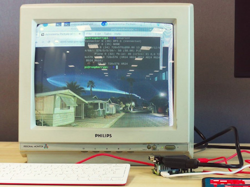](url)

The very first Raspberry Pi had a composite video output, and all models with a 40-pin header have a display parallel interface (DPI) output. With some external components, DPI can be converted to VGA or RGB/SCART video. Those analogue interfaces are still in demand for retro media and gaming. Now Nick Hollinghurst shows how DPI can output NTSC or PAL composite video through some additional hacks - [Raspberry Pi News](https://www.raspberrypi.com/news/how-we-added-interlaced-video-to-raspberry-pi-5/) and the code is on [GitHub](https://github.com/raspberrypi/utils/blob/master/piolib/examples/dpi_csync.c).

## A MicroPython Interpreter For Flipper Zero

Do you have a Flipper Zero? Have you ever wanted to use a high-level but powerful scripting language on it? There is now a MicroPython application for the Flipper, complete with a library for hardware and software feature support - [GitHub](https://ofabel.github.io/mp-flipper/) and [Hackaday](https://hackaday.com/2025/03/03/a-micropython-interpreter-for-flipper-zero/). Via [X](https://bsky.app/profile/hackaday-feed.bsky.social/post/3ljhxckvemb2y).

## Feature

text - [site](url).

## How to Create a Virtual Environment in Python

A Python virtual environment is an isolated workspace that allows developers to install and manage project-specific dependencies without interfering with the system-wide Python installation. This ensures that different projects can use different versions of packages and dependencies without conflict - [Techloy](https://www.techloy.com/how-to-create-a-virtual-environment-in-python/).

## AI Model Integration Into Development Platforms

As reported last week, AI / large language models have been increasingly used in coding. Here are two new examples this week to keep you abreast of the segment.

### GitHub Copilot is Now in the Espressif IDE

A lot of Python developers work with the Espressif intergrated development environment (ESP-IDF) also. Espressif and GitHub have announced the [Copilot4Eclipse](https://www.genuitec.com/products/copilot4eclipse/) plugin with the Espressif-IDE LSP C/C++ Editor, bringing Copilot’s AI-assisted code generation to the Eclipse IDE. [Last week](https://www.adafruitdaily.com/2025/03/03/python-on-microcontrollers-newsletter-learn-embedded-systems-claude-3-7-bye-bye-magpi-and-more-circuitpython-python-micropython-thepsf-raspberry_pi/), we mentioned Claude 3.7 Sonnet use for coding. Are we getting to the point where all development environments will have a large language model tie-in? - [Espressif](https://developer.espressif.com/blog/2025/02/github-copilot-in-espressif-ide/).

### Google Launches a Free Gemini-Powered Data Science Agent on Colab Python

A new, free, Gemini 2.0-powered AI assistant which automates data analysis is now available to users in select countries and languages. The assistant is through Google Colab, the company’s eight-year-old service for running Python code live online atop graphics processing units (GPUs) owned by the search giant and its own, in-house tensor processing units (TPUs) - [VentureBeat](https://venturebeat.com/ai/google-launches-free-gemini-powered-data-science-agent-on-its-colab-python-platform/).

> "This expansion aligns with Google’s ongoing efforts to integrate AI-driven coding and data science features into Colab, building on past updates... It also acts as a kind of advanced and belated rejoinder to OpenAI’s [ChatGPT advanced data analysis](https://mitsloanedtech.mit.edu/ai/tools/data-analysis/how-to-use-chatgpts-advanced-data-analysis-feature/) (previously [Code Interpreter](https://venturebeat.com/ai/code-interpreter-comes-to-all-chatgpt-plus-users-anyone-can-be-a-data-analyst-now/)), which is now built into ChatGPT when running GPT-4."

## This Week's Python Streams

Python on Hardware is all about building a cooperative ecosphere which allows contributions to be valued and to grow knowledge. Below are the streams within the last week focusing on the community.

**CircuitPython Deep Dive Stream**

[Last Friday](https://youtube.com/live/YcCRWQYirrw), Tim was introducing and working on the new Core Module TilePaletteMapper.

You can see the latest video and past videos on the Adafruit YouTube channel under the Deep Dive playlist - [YouTube](https://www.youtube.com/playlist?list=PLjF7R1fz_OOXBHlu9msoXq2jQN4JpCk8A).

**CircuitPython Parsec**

John Park’s CircuitPython Parsec this week is on SD Card Detect - [Adafruit Blog](https://blog.adafruit.com/2025/03/07/john-parks-circuitpython-parsec-sd-card-detect/) and [YouTube](https://youtu.be/Lo7nS3Vp0kg).

Catch all the episodes in the [YouTube playlist](https://www.youtube.com/playlist?list=PLjF7R1fz_OOWFqZfqW9jlvQSIUmwn9lWr).

**The CircuitPython Show**

Tod Kurt and Jan Goolsbey join the show and share their experience in writing drivers and libraries for the CircuitPython Community bundle - [The CircuitPython Show](https://www.circuitpythonshow.com/@circuitpythonshow).

**CircuitPython Weekly Meeting**

CircuitPython Weekly Meeting for March 3, 2025 ([notes](https://github.com/adafruit/adafruit-circuitpython-weekly-meeting/blob/main/2025/2025-03-03.md)) [on YouTube](https://youtu.be/Isb4pnyDZrQ).

## Project of the Week: Prop-Maker Lightsaber Remix

[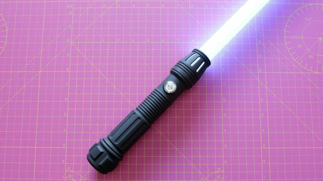](https://www.reddit.com/r/adafruit/comments/1j0xmcy/lightsaber_propmaker_rp2040_remix/)

GoulagmanFrYt [on Reddit](https://www.reddit.com/user/CaterpillarFar8343/) demonstrates the power of Open Source Software: "I recently did (the [Adafruit Light Saber project](https://learn.adafruit.com/lightsaber-rp2040/overview)). But I had problems with latency between movements and sounds and I wanted to improve the program. Not having too much knowledge in CircuitPython I improvised things and also used AI to finally get to make a program that works for me much better than the original. In addition, I have included a crackling animation when the lightsaber is moving." - [Reddit](https://www.reddit.com/r/adafruit/comments/1j0xmcy/lightsaber_propmaker_rp2040_remix/) and [code](https://pastebin.com/jDVD83SZ).

## Popular Last Week

What was the most popular, most clicked link, in [last week's newsletter](https://www.adafruitdaily.com/2025/03/03/python-on-microcontrollers-newsletter-learn-embedded-systems-claude-3-7-bye-bye-magpi-and-more-circuitpython-python-micropython-thepsf-raspberry_pi/)? [Resources for Learning Embedded Systems](https://embeddedartistry.com/beginners/).

Did you know you can read past issues of this newsletter in the Adafruit Daily Archive? [Check it out](https://www.adafruitdaily.com/category/circuitpython/).

## New Notes from Adafruit Playground

[Adafruit Playground](https://adafruit-playground.com/) is a new place for the community to post their projects and other making tips/tricks/techniques. Ad-free, it's an easy way to publish your work in a safe space for free.

[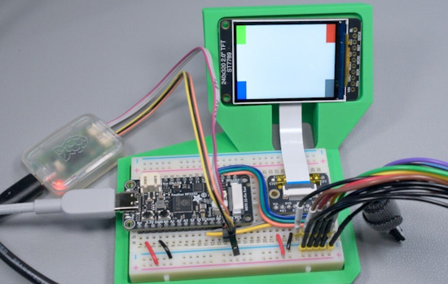](https://adafruit-playground.com/u/SamBlenny/pages/zephyr-quest-st7789-display-with-feather-rp2350)

Zephyr Quest: ST7789 Display with Feather RP2350 - [Adafruit Playground](https://adafruit-playground.com/u/SamBlenny/pages/zephyr-quest-st7789-display-with-feather-rp2350).

C3P0, Take the Wheel! - [Adafruit Playground](https://adafruit-playground.com/u/mrklingon/pages/c3p0-take-the-wheel).

## News From Around the Web

[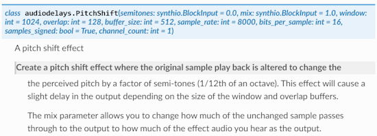](https://docs.circuitpython.org/en/latest/shared-bindings/audiodelays/index.html#audiodelays.PitchShift)

A new audio pitch shift effect was just merged into CircuitPython - [ReadTheDocs](https://docs.circuitpython.org/en/latest/shared-bindings/audiodelays/index.html#audiodelays.PitchShift). Via [X](https://x.com/coopersnout/status/1897013316217905579).

[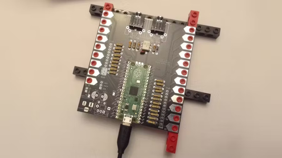](https://www.hackster.io/news/the-pico-touch-board-turns-a-raspberry-pi-pico-into-a-chunky-midi-marvel-for-touch-based-music-94c1fbb26adf)

The Pico Touch Board turns a Raspberry Pi Pico into a MIDI marvel for touch-based music - [hackster.io](https://www.hackster.io/news/the-pico-touch-board-turns-a-raspberry-pi-pico-into-a-chunky-midi-marvel-for-touch-based-music-94c1fbb26adf).

[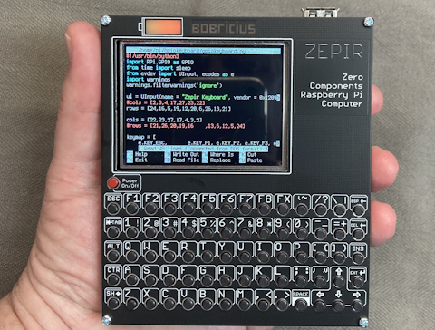](https://x.com/bobricius/status/1897775812188783061)

The new Zepir Raspberry Pi Zero 2 based handheld computer runs Python - [X](https://x.com/bobricius/status/1897775812188783061).

unittest: Python’s built-in safety net for developers - [TheNewStack](https://thenewstack.io/unittest-pythons-built-in-safety-net-for-developers/).

[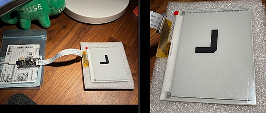](https://octodon.social/@pierrenick@hachyderm.io/114091243179721652)

A watch cursor clock display using an Adafruit ThinkInk Feather and Waveshare 4.2” eink display with CircuitPython - [Mastodon](https://octodon.social/@pierrenick@hachyderm.io/114091243179721652).

[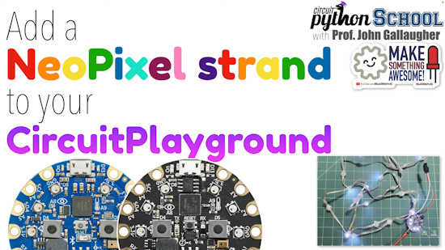](https://www.youtube.com/watch?v=ZczH0BvRjuo)

Connect LED Strand to CircuitPlayground (CircuitPython School) - [YouTube](https://www.youtube.com/watch?v=ZczH0BvRjuo).

[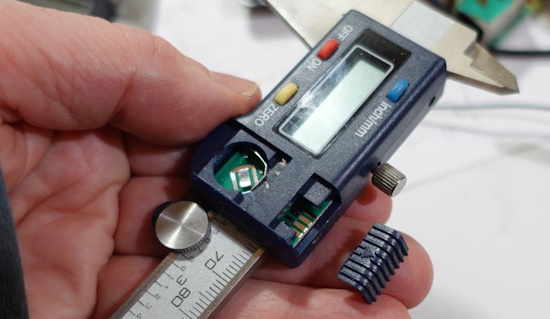](https://github.com/Matthias-Wandel/caliper-interface)

Interfacing cheap digital calipers to Raspberry Pi - [GitHub](https://github.com/Matthias-Wandel/caliper-interface). Via [Hackster.io](https://www.hackster.io/news/learn-how-to-read-cheap-digital-caliper-values-on-a-raspberry-pi-0a306bffc2f3).

[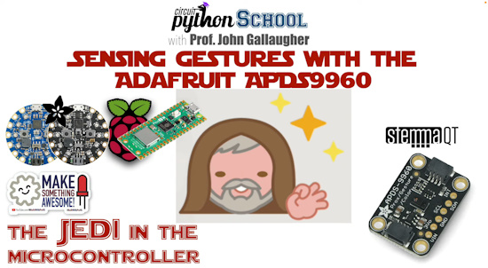](https://www.youtube.com/watch?v=HPWi2QNDJNw)

The Jedi in my microcontroller! Sensing gestures with the Adafruit APDS9960 (CircuitPython School) - [YouTube](https://www.youtube.com/watch?v=HPWi2QNDJNw).

Fr4nkFletcher on GitHub whipped up a fun Game of Life in CircuitPython over HDMI on the Waveshare RP2040 Pi Zero - [X](https://x.com/Fr4nkFletcher/status/1896235544629465417).

[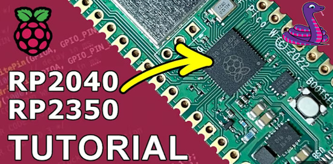](https://www.youtube.com/watch?v=r_zaDXqUSn8)

Starting with the RP2040 / RP2350 Pico, a programming tutorial for beginners: StepByStep CircuitPython - [YouTube](https://www.youtube.com/watch?v=r_zaDXqUSn8).

[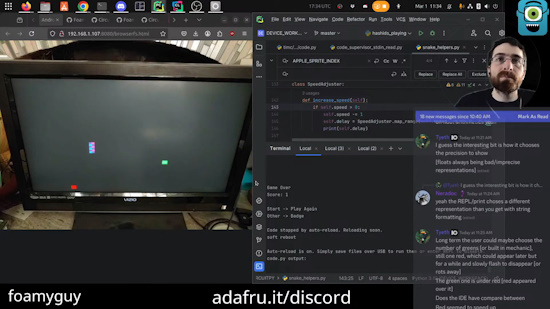](https://www.youtube.com/watch?v=XpPi_pflylc)

A CircuitPython snake game on the TV running on a Metro RP2350 - [YouTube](https://www.youtube.com/watch?v=XpPi_pflylc).

PSF Distinguished Service Award granted to Ewa Jodlowska - [Python Blog](https://pyfound.blogspot.com/2025/03/psf-dsa-ewa-jodlowska.html).

text - [site](url).

[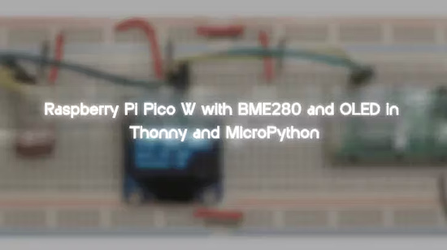](https://www.hackster.io/az-delivery/raspberry-pi-pico-w-with-bme280-and-oled-in-thonny-and-micro-9b8c6e)

Raspberry Pi Pico W with BME280 and OLED in Thonny and MicroPython - [hackster.io](https://www.hackster.io/az-delivery/raspberry-pi-pico-w-with-bme280-and-oled-in-thonny-and-micro-9b8c6e).

[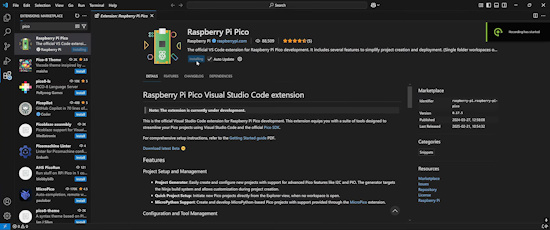](https://www.youtube.com/watch?v=yr3M7sMx11g)

Using VSCode to run MicroPython on a Raspberry Pi Pico - [YouTube](https://www.youtube.com/watch?v=yr3M7sMx11g).

text - [site](url).

[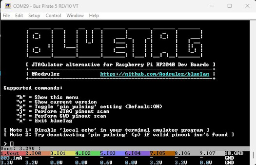](https://bsky.app/profile/buspirate.bsky.social/post/3ljpfzlgh4s2m)

Bus Pirate bluetag automates JTAG and SWD pin finding - [X](https://bsky.app/profile/buspirate.bsky.social/post/3ljpfzlgh4s2m).

text - [site](url).

[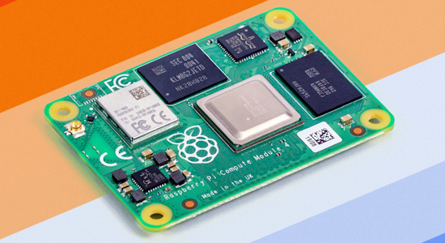](https://www.raspberrypi.com/news/new-extended-temperature-range-for-compute-module-4/)

New extended temperature range for Compute Module 4: -40°C to +85°C - [Raspberry Pi News](https://www.raspberrypi.com/news/new-extended-temperature-range-for-compute-module-4/).

## New

[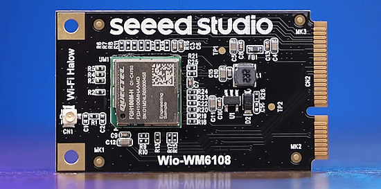](https://www.cnx-software.com/2025/03/07/seeed-studio-wi-fi-halow-mini-pcie-module-for-raspberry-pi-add-on-board-for-xiao-boards/)

Seeed Studio launches WiFi HaLow mini PCIe module for Raspberry Pi, add-on board for XIAO boards - [CNX](https://www.cnx-software.com/2025/03/07/seeed-studio-wi-fi-halow-mini-pcie-module-for-raspberry-pi-add-on-board-for-xiao-boards/).

STMicroelectronics launches the multi-protocol STM32WBA6 and the ultra-low-power STM32U3 - [hackster.io](https://www.hackster.io/news/stmicroelectronics-launches-the-multi-protocol-stm32wba6-and-ultra-low-power-stm32u3-756182655ed0) and [CNX](https://www.cnx-software.com/2025/03/06/stmicro-stm32wba6-2-4-ghz-wireless-mcu-gets-up-to-2mb-flash-512kb-sram-usb-otg-and-more/).

## New Boards Supported by CircuitPython

The number of supported microcontrollers and Single Board Computers (SBC) grows every week. This section outlines which boards have been included in CircuitPython or added to [CircuitPython.org](https://circuitpython.org/).

This week there were three new boards added:

- [SAO Digital Multimeter](https://circuitpython.org/board/hxr_sao_dmm/)
- [Spotpear ESP32C3 LCD 1.69 Touchscreen](https://circuitpython.org/board/spotpear_esp32c3_lcd_1_69/https://circuitpython.org/board/spotpear_esp32c3_lcd_1_69/)
- [Elecrow CrowPanel 4.2](https://circuitpython.org/board/elecrow_crowpanel_4_2_epaper/)

*Note: For non-Adafruit boards, please use the support forums of the board manufacturer for assistance, as Adafruit does not have the hardware to assist in troubleshooting.*

Looking to add a new board to CircuitPython? It's highly encouraged! Adafruit has four guides to help you do so:

- [How to Add a New Board to CircuitPython](https://learn.adafruit.com/how-to-add-a-new-board-to-circuitpython/overview)
- [How to add a New Board to the circuitpython.org website](https://learn.adafruit.com/how-to-add-a-new-board-to-the-circuitpython-org-website)
- [Adding a Single Board Computer to PlatformDetect for Blinka](https://learn.adafruit.com/adding-a-single-board-computer-to-platformdetect-for-blinka)
- [Adding a Single Board Computer to Blinka](https://learn.adafruit.com/adding-a-single-board-computer-to-blinka)

## New Learn Guides

The Adafruit Learning System has over 3,000 free guides for learning skills and building projects including using Python.

[Portable Macrodata Refinement Terminal](https://learn.adafruit.com/portable-macrodata-refinement-terminal) from [Liz Clark](https://learn.adafruit.com/u/BlitzCityDIY)

[https://learn.adafruit.com/breakout-game-on-metro-rp2350](https://learn.adafruit.com/breakout-game-on-metro-rp2350) from [Anne Barela](https://learn.adafruit.com/u/AnneBarela)

[No-Code Offline Data Logger with WipperSnapper](https://learn.adafruit.com/no-code-offline-data-logging-with-wippersnapper) from [Brent Rubell](https://learn.adafruit.com/u/brubell)

## CircuitPython Libraries

The CircuitPython library numbers are continually increasing, while existing ones continue to be updated. Here we provide library numbers and updates!

To get the latest Adafruit libraries, download the [Adafruit CircuitPython Library Bundle](https://circuitpython.org/libraries). To get the latest community contributed libraries, download the [CircuitPython Community Bundle](https://circuitpython.org/libraries).

If you'd like to contribute to the CircuitPython project on the Python side of things, the libraries are a great place to start. Check out the [CircuitPython.org Contributing page](https://circuitpython.org/contributing). If you're interested in reviewing, check out Open Pull Requests. If you'd like to contribute code or documentation, check out Open Issues. We have a guide on [contributing to CircuitPython with Git and GitHub](https://learn.adafruit.com/contribute-to-circuitpython-with-git-and-github), and you can find us in the #help-with-circuitpython and #circuitpython-dev channels on the [Adafruit Discord](https://adafru.it/discord).

You can check out this [list of all the Adafruit CircuitPython libraries and drivers available](https://github.com/adafruit/Adafruit_CircuitPython_Bundle/blob/master/circuitpython_library_list.md). 

The current number of CircuitPython libraries is **###**!

**New Libraries**

Here's this week's new CircuitPython libraries:

* [library](url)

**Updated Libraries**

Here's this week's updated CircuitPython libraries:

* [library](url)

## What’s the CircuitPython team up to this week?

What is the team up to this week? Let’s check in:

**Dan**

My update of the NINA-FW firmware for AirLift is now running and can do HTTP fetches and other operations. I need to add code to read the bundle of root certificates so it can do HTTPS. This version is running on ESP32 chips, as before, but I am also porting it to ESP32-C6, which is a modern and low-cost alternative.

**Tim**

This week I went back to working on the RPi5 with RGB Matrix panels. I expanded upon the xvfb example that Jeff wrote for PioMatter with a new version that reads data from the keyboard and passes it into the virtual X instance running the mirrored program. This allows interacting with mirrored apps and games that don't have their own built-in support for gamepads. I've also been working on a new module for the CircuitPython core that allows you to set up color mappings for tiles within a `TileGrid`. It's based on some feedback and discussions with Scott. Compared to my attempt last week, this is a more general approach that will be useful for inverted colors, but also allow for some other nifty things like mapping a 2bit Bitmap to a wider array of colors.

**Jeff**

Once again, my CircuitPython activity was limited over the past week. I was especially happy, though, to take a few minutes to review some PRs contributed by the community. @eightycc found and fixed a problem with `storage.erase_filesystem` on RP2350s when a HSTX display was active and @relic-se contributed a new pitch shift effect for real time audio processing.

**Scott**

This last week I've gotten USB host working well enough that I can work on my Chime Garden game and a menu system to select what program to run. I've still got to get the changes merged into the main CircuitPython branch and the underlying `PIO USB host` library. Getting these improvements in is my top priority before my vacation next week. With the remaining time, I'm adding a second "saves" partition so that CircuitPython can write files even when also connected to a host computer.

**Liz**

This week I published the [Portable Macrodata Refinement Terminal Learn Guide](https://learn.adafruit.com/portable-macrodata-refinement-terminal). I'm really proud of this project. I put a lot of work into the Python code and 3D design to channel the vibe of Severance. It's really satisfying to use with the trackball mouse, and I hope that it can be a useful example for folks looking to build their own.

## Upcoming Events

Embedded World 2025 will be held March 11 to 13, 2025 in Nuremberg, Germany. [Raspberry Pi](https://x.com/Raspberry_Pi/status/1889333638417768590) will be there - [Embedded World](https://www.embedded-world.de/en).

The next MicroPython Meetup in Melbourne will be on March 26th – [Meetup](https://www.meetup.com/micropython-meetup/events). You can see recordings of previous meetings on [YouTube](https://www.youtube.com/@MicroPythonOfficial). 

The community is coming back to Pittsburgh, Pennsylvania for PyCon US 2025 May 14 - May 22, 2025 - [us.pycon.org](https://us.pycon.org/2025/).

KiCad conferences (KiCon) to be held this year include 28 - 30 May 2025 in San Diego, California, 19 - 20 Sept 2024 in Bochum, Germany, and to be determined in Asia - [KiCad](https://kicon.kicad.org/).

Open Hardware Summit 2025 is being held May 30 @ 10am - May 31 @ 6pm GMT+1 in Edinburgh, Scotland - [Eventbrite](https://www.eventbrite.com/e/open-hardware-summit-2025-tickets-1067611086499).

**Send Your Events In**

If you know of virtual events or upcoming events, please let us know via email to cpnews(at)adafruit(dot)com.

## Latest Releases

CircuitPython's stable release is [#.#.#](https://github.com/adafruit/circuitpython/releases/latest) and its unstable release is [#.#.#-##.#](https://github.com/adafruit/circuitpython/releases). New to CircuitPython? Start with our [Welcome to CircuitPython Guide](https://learn.adafruit.com/welcome-to-circuitpython).

[2025####](https://github.com/adafruit/Adafruit_CircuitPython_Bundle/releases/latest) is the latest Adafruit CircuitPython library bundle.

[2025####](https://github.com/adafruit/CircuitPython_Community_Bundle/releases/latest) is the latest CircuitPython Community library bundle.

[v#.#.#](https://micropython.org/download) is the latest MicroPython release. Documentation for it is [here](http://docs.micropython.org/en/latest/pyboard/).

[#.#.#](https://www.python.org/downloads/) is the latest Python release. The latest pre-release version is [#.#.#](https://www.python.org/download/pre-releases/).

[#,### Stars](https://github.com/adafruit/circuitpython/stargazers) Like CircuitPython? [Star it on GitHub!](https://github.com/adafruit/circuitpython)

## Call for Help -- Translating CircuitPython is now easier than ever

[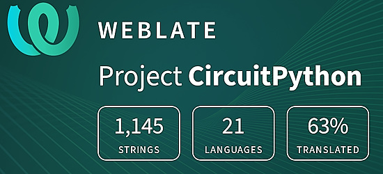](https://hosted.weblate.org/engage/circuitpython/)

One important feature of CircuitPython is translated control and error messages. With the help of fellow open source project [Weblate](https://weblate.org/), we're making it even easier to add or improve translations. 

Sign in with an existing account such as GitHub, Google or Facebook and start contributing through a simple web interface. No forks or pull requests needed! As always, if you run into trouble join us on [Discord](https://adafru.it/discord), we're here to help.

## NUMBER Thanks

The Adafruit Discord community, where we do all our CircuitPython development in the open, reached over NUMBER humans - thank you! Adafruit believes Discord offers a unique way for Python on hardware folks to connect. Join today at [https://adafru.it/discord](https://adafru.it/discord).

## ICYMI - In case you missed it

Python on hardware is the Adafruit Python video-newsletter-podcast! The news comes from the Python community, Discord, Adafruit communities and more and is broadcast on ASK an ENGINEER Wednesdays. The complete Python on Hardware weekly videocast [playlist is here](https://www.youtube.com/playlist?list=PLjF7R1fz_OOXRMjM7Sm0J2Xt6H81TdDev). The video podcast is on [iTunes](https://itunes.apple.com/us/podcast/python-on-hardware/id1451685192?mt=2), [YouTube](http://adafru.it/pohepisodes), [Instagram](https://www.instagram.com/adafruit/channel/)), and [XML](https://itunes.apple.com/us/podcast/python-on-hardware/id1451685192?mt=2).

[The weekly community chat on Adafruit Discord server CircuitPython channel - Audio / Podcast edition](https://itunes.apple.com/us/podcast/circuitpython-weekly-meeting/id1451685016) - Audio from the Discord chat space for CircuitPython, meetings are usually Mondays at 2pm ET, this is the audio version on [iTunes](https://itunes.apple.com/us/podcast/circuitpython-weekly-meeting/id1451685016), Pocket Casts, [Spotify](https://adafru.it/spotify), and [XML feed](https://adafruit-podcasts.s3.amazonaws.com/circuitpython_weekly_meeting/audio-podcast.xml).

## Contribute

The CircuitPython Weekly Newsletter is a CircuitPython community-run newsletter emailed every Monday. The complete [archives are here](https://www.adafruitdaily.com/category/circuitpython/). It highlights the latest CircuitPython related news from around the web including Python and MicroPython developments. To contribute, edit next week's draft [on GitHub](https://github.com/adafruit/circuitpython-weekly-newsletter/tree/gh-pages/_drafts) and [submit a pull request](https://help.github.com/articles/editing-files-in-your-repository/) with the changes. You may also tag your information on Twitter with #CircuitPython. 

Join the Adafruit [Discord](https://adafru.it/discord) or [post to the forum](https://forums.adafruit.com/viewforum.php?f=60) if you have questions.
