- [ ] Library and info updates
- [ ] change date
- [ ] update title
- [ ] Feature story
- [ ] Update  for images
- [ ] Update ICYDNCI
- [ ] All images 550w max only
- [ ] Link "View this email in your browser."

News Sources

- [Adafruit Playground](https://adafruit-playground.com/)
- Twitter: [CircuitPython](https://twitter.com/search?q=circuitpython&src=typed_query&f=live), [MicroPython](https://twitter.com/search?q=micropython&src=typed_query&f=live) and [Python](https://twitter.com/search?q=python&src=typed_query)
- [Raspberry Pi News](https://www.raspberrypi.com/news/)
- Mastodon [CircuitPython](https://octodon.social/tags/CircuitPython) and [MicroPython](https://octodon.social/tags/MicroPython)
- [hackster.io CircuitPython](https://www.hackster.io/search?q=circuitpython&i=projects&sort_by=most_recent) and [MicroPython](https://www.hackster.io/search?q=micropython&i=projects&sort_by=most_recent)
- YouTube: [CircuitPython](https://www.youtube.com/results?search_query=circuitpython&sp=CAI%253D), [MicroPython](https://www.youtube.com/results?search_query=micropython&sp=CAI%253D)
- Instructables: [CircuitPython](https://www.instructables.com/search/?q=circuitpython&projects=all&sort=Newest), [MicroPython](https://www.instructables.com/search/?q=micropython&projects=all&sort=Newest), [Raspberry Pi Python](https://www.instructables.com/search/?q=raspberry+pi+python&projects=all&sort=Newest)
- [hackaday CircuitPython](https://hackaday.com/blog/?s=circuitpython) and [MicroPython](https://hackaday.com/blog/?s=micropython)
- [python.org](https://www.python.org/)
- [Python Insider - dev team blog](https://pythoninsider.blogspot.com/)
- Individuals: [Jeff Geerling](https://www.jeffgeerling.com/blog), [Yakroo](https://x.com/Yakroo5077)
- Tom's Hardware: [CircuitPython](https://www.tomshardware.com/search?searchTerm=circuitpython&articleType=all&sortBy=publishedDate) and [MicroPython](https://www.tomshardware.com/search?searchTerm=micropython&articleType=all&sortBy=publishedDate) and [Raspberry Pi](https://www.tomshardware.com/search?searchTerm=raspberry%20pi&articleType=all&sortBy=publishedDate)
- [hackaday.io newest projects MicroPython](https://hackaday.io/projects?tag=micropython&sort=date) and [CircuitPython](https://hackaday.io/projects?tag=circuitpython&sort=date)
- [Google News Python](https://news.google.com/topics/CAAqIQgKIhtDQkFTRGdvSUwyMHZNRFY2TVY4U0FtVnVLQUFQAQ?hl=en-US&gl=US&ceid=US%3Aen)
- hackaday.io - [CircuitPython](https://hackaday.io/search?term=circuitpython) and [MicroPython](https://hackaday.io/search?term=micropython)

View this email in your browser. **Warning: Flashing Imagery**

Welcome to the latest Python on Microcontrollers newsletter! *insert 2-3 sentences from editor (what's in overview, banter)* - *Anne Barela, Editor*

We're on [Discord](https://discord.gg/HYqvREz), [Twitter/X](https://twitter.com/search?q=circuitpython&src=typed_query&f=live), [BlueSky](https://bsky.app/profile/circuitpython.org) and for past newsletters - [view them all here](https://www.adafruitdaily.com/category/circuitpython/). If you're reading this on the web, [subscribe here](https://www.adafruitdaily.com/). Here's the news this week:

## CircuitPython.Org to be Updated

[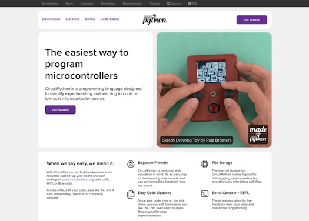](https://blog.adafruit.com/2025/03/11/coming-soon-a-new-circuitpython-org/)

CircuitPython.org with be updated soon with a fresh new look. CircuitPython has come a long way since the original landing page for [CircuitPython.org](https://circuitpython.org/) was created. The new design will focus on what is possible with CircuitPython. And there will be a new Made with CircuitPython badge that will show off the wide range of projects all created with CircuitPython. Each time the page is loaded, it will show off different projects throughout the page.

The new design will do a better job of explaining CircuitPython to those who are new to the language. It also does a better job of organizing the most used aspects of the site, like the individual board pages. This new design is already complete and is under review. So expect to see this update very soon! - [Adafruit Blog](https://blog.adafruit.com/2025/03/11/coming-soon-a-new-circuitpython-org/).

## The Espressif ESP32: Clearing the Air

[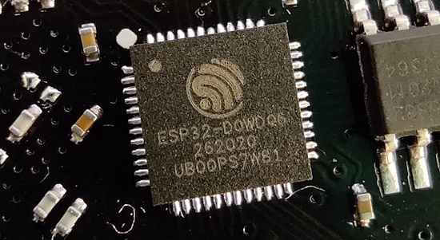](https://developer.espressif.com/blog/2025/03/esp32-bluetooth-clearing-the-air/)

Last week, it was widely reported via an initial [report by Tarlogic](https://www.tarlogic.com/news/hidden-feature-esp32-chip-infect-ot-devices/) that there were undocumented features of the original ESP32 microcontroller that could be maliciously used. Further review by experts and Espressif clarified that the functions were vendor-specific commands (VSCs) for internal testing (standard with Bluetooth chips) and could not be used remotely via the chip's radios  - [Espressif](https://developer.espressif.com/blog/2025/03/esp32-bluetooth-clearing-the-air/), the Espressif [initial response](https://www.espressif.com/en/news/Response_ESP32_Bluetooth) and [Hackaday](https://hackaday.com/2025/03/10/the-esp32-bluetooth-backdoor-that-wasnt/).

## Updates to the Adafruit_Blinka_Raspberry_Pi5_Piomatter Library

[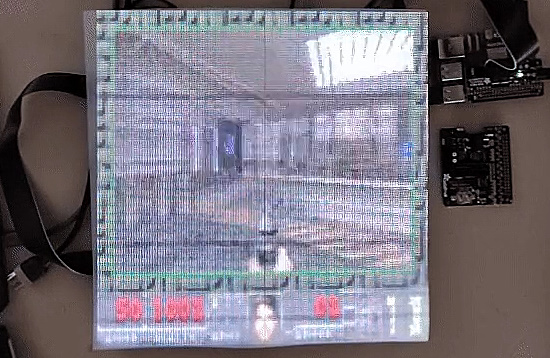](https://github.com/adafruit/Adafruit_Blinka_Raspberry_Pi5_Piomatter)

Jeff and Tim have been hard at work on the `Adafruit_Blinka_Raspberry_Pi5_Piomatter` library which allows driving HUB75 RGB Matrix panels from a Raspberry Pi 5. The Pi 5, with it's new RP1 chip, uses different techniques than previous Pis to do high speed input/output.

Support has been added for outputting data from up to 3 HUB75 ribbon cables, up from the previous limit of 1. This can increase the framerate for larger panels made from multiple matrices. A pair of new examples and learn guide pages were published this week which show two different methods for mirroring X11 graphical applications to the RGB matrices. One uses a virtual X server instance and supports game controllers but not standard mouse and keyboard input, the other requires running the X11 display system and mirrors a portion of the display to the panels with support for keyboard and mouse input - [GitHub](https://github.com/adafruit/Adafruit_Blinka_Raspberry_Pi5_Piomatter) and [Adafruit Learning System](https://learn.adafruit.com/rgb-matrix-panels-with-raspberry-pi-5).

## Adafruit Launches the Metro RP2350 — and Adds a High-End Variant with 8MB of PSRAM

[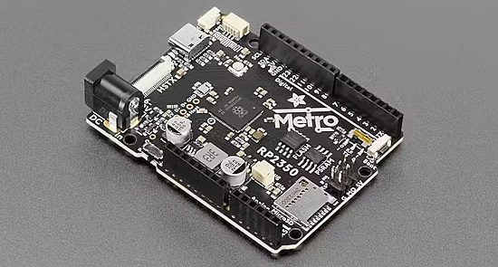](https://www.hackster.io/news/adafruit-launches-the-metro-rp2350-and-adds-a-high-end-variant-with-8mb-of-psram-08f3fb3913bb)

The Arduino UNO form factor Metro RP2350 board has finally hit the market, and is available with 16MB of QSPI flash and optional 8MB QSPI PSRAM - [hackster.io](https://www.hackster.io/news/adafruit-launches-the-metro-rp2350-and-adds-a-high-end-variant-with-8mb-of-psram-08f3fb3913bb).

The Adafruit team has been posting projects to the [Adafruit Learning System](https://learn.adafruit.com/guides/latest) which use the new Metro, featuring the lovely video available from the HSTX interface and USB Host input.

## Feature

text - [site](url).

## A 10x Faster TypeScript

[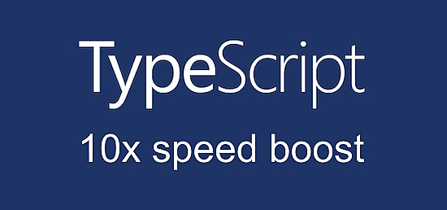](https://devblogs.microsoft.com/typescript/typescript-native-port/)

Microsoft has been working on a native port of the TypeScript compiler and tools, using the Go language. The native implementation will drastically improve editor startup, reduce most build times by 10x, and substantially reduce memory usage. By porting the current codebase, they expect to be able to preview a native implementation of `tsc` capable of command-line typechecking by mid-2025, with a feature-complete solution for project builds and a language service by the end of the year. - [Microsoft Dev Blogs](https://devblogs.microsoft.com/typescript/typescript-native-port/) and [YouTube](https://youtu.be/pNlq-EVld70).

## Texas Instruments Releases the World's Smallest Microcontroller

[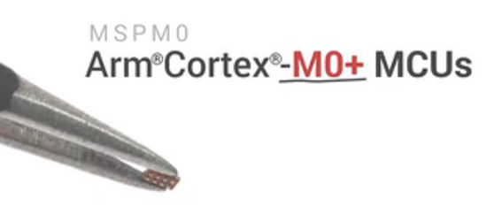](https://www.ti.com/product/MSPM0C1104)

The new MSPM0C1104 is being touted by TI as the world's smallest microcontroller at 1.3776 mm², featuring an Arm Cortex-M0+ - [TI](https://www.ti.com/about-ti/newsroom/news-releases/2025/2025-03-11-ti-introduces-the-world-s-smallest-mcu--enabling-innovation-in-the-tiniest-of-applications.html?HQS=evt-tsw-null-ew_2025_mspm0_small-twit-pr-null-ww_en_awr) and the [Product Page](https://www.ti.com/product/MSPM0C1104). Via [X](https://x.com/jwt0625/status/1899482260954571028).

## This Week's Python Streams

Python on Hardware is all about building a cooperative ecosphere which allows contributions to be valued and to grow knowledge. Below are the streams within the last week focusing on the community.

**CircuitPython Deep Dive Stream**

[Last Friday](link), Tim streamed work on {subject}.

You can see the latest video and past videos on the Adafruit YouTube channel under the Deep Dive playlist - [YouTube](https://www.youtube.com/playlist?list=PLjF7R1fz_OOXBHlu9msoXq2jQN4JpCk8A).

**CircuitPython Parsec**

John Park’s CircuitPython Parsec this week is on {subject} - [Adafruit Blog](link) and [YouTube](link).

Catch all the episodes in the [YouTube playlist](https://www.youtube.com/playlist?list=PLjF7R1fz_OOWFqZfqW9jlvQSIUmwn9lWr).

**The CircuitPython Show**

In the latest episode, Tod Kurt and Jan Goolsbey join the show and share their experience in writing drivers and libraries for the CircuitPython Community bundle - [The CircuitPython Show](https://www.circuitpythonshow.com/@circuitpythonshow).

**CircuitPython Weekly Meeting**

CircuitPython Weekly Meeting for March 10, 2025 ([notes](https://github.com/adafruit/adafruit-circuitpython-weekly-meeting/blob/main/2025/2025-03-10.md)) [on YouTube](https://youtu.be/eIp_QNIUGU8).

## Project of the Week: The Chicken Nugget Piano

Setting up touch sensors with Raspberry Pi Pico is easier than you’d think. In this project, Kevin McAleer uses the touch sensors to make a chicken nugget piano with the Pico programmed in CircuitPython - [Kev's Robots](https://www.kevsrobots.com/blog/chicken-nugget-piano.html).

## Popular Last Week

What was the most popular, most clicked link, in [last week's newsletter](https://www.adafruitdaily.com/2025/03/10/python-on-microcontrollers-newsletter-12000-subscribers-zephyr-micropython-on-flipper-zero-and-more-circuitpython-python-micropython-thepsf-raspberry_pi/)? [ntroduction to Zephyr Part 1: Getting Started - Installation and Blink](https://www.digikey.com/en/maker/tutorials/2025/introduction-to-zephyr-part-1-getting-started-installation-and-blink).

And now this week you can catch Introduction to Zephyr Part 2: CMake Tutorial - [YouTube](https://www.youtube.com/watch?v=HSWazjB63cU).

Did you know you can read past issues of this newsletter in the Adafruit Daily Archive? [Check it out](https://www.adafruitdaily.com/category/circuitpython/).

## New Notes from Adafruit Playground

[Adafruit Playground](https://adafruit-playground.com/) is a new place for the community to post their projects and other making tips/tricks/techniques. Ad-free, it's an easy way to publish your work in a safe space for free.

[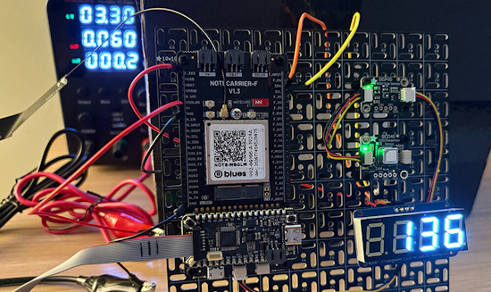](url)

text - [Adafruit Playground](url).

text - [Adafruit Playground](url).

text - [Adafruit Playground](url).

## News From Around the Web

text - [site](url).

[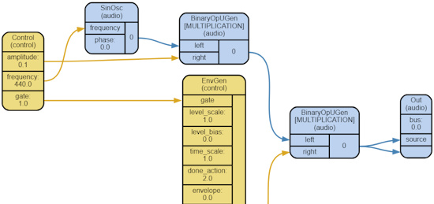](https://www.synthtopia.com/content/2025/02/13/creating-a-synth-in-python-with-less-than-100-lines-of-code/)

Creating a synth in Python with less than 100 lines of code - [Syntopia](https://www.synthtopia.com/content/2025/02/13/creating-a-synth-in-python-with-less-than-100-lines-of-code/), [Reddit](https://www.reddit.com/r/supriya_python/comments/1iog3oz/a_polyphonic_midi_synth_in_less_than_100_lines_of/) and [GitHub](https://github.com/dayunbao/supriya_demos/tree/main). Via the [Adafruit Blog](https://blog.adafruit.com/2025/03/10/creating-a-synth-in-python-musicmonday/).

[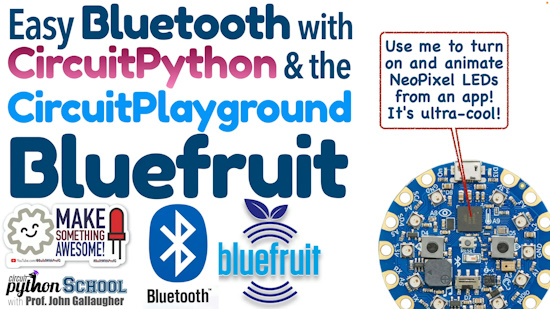](https://www.youtube.com/watch?v=AwD3sar--BY)

Turn on LEDs from an App! Bluetooth Control with a Circuit Playground BlueFruit (CircuitPython School) - [YouTube](https://www.youtube.com/watch?v=AwD3sar--BY).

[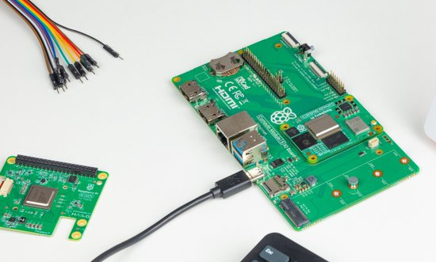](https://www.raspberrypi.com/news/raspberry-pi-wins-2024-europe-tsmc-trophy-for-embedded-computing-innovation/)

Raspberry Pi wins 2024 Europe TSMC Trophy for embedded computing innovation - [Raspberry Pi News](https://www.raspberrypi.com/news/raspberry-pi-wins-2024-europe-tsmc-trophy-for-embedded-computing-innovation/).

[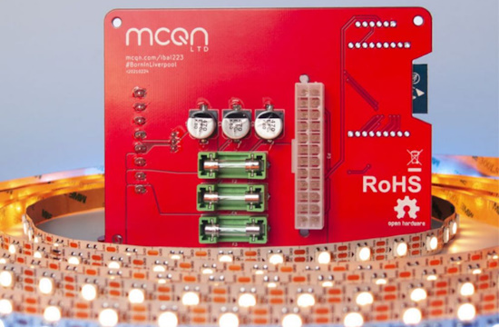](https://makezine.com/article/technology/open-source/open-source-hardware-certifications-for-february-2025/)

Open Source Hardware certifications for February 2025 - [Makezine](https://makezine.com/article/technology/open-source/open-source-hardware-certifications-for-february-2025/).

text - [site](url).

text - [site](url).

text - [site](url).

text - [site](url).

text - [site](url).

text - [site](url).

text - [site](url).

text - [site](url).

text - [site](url).

[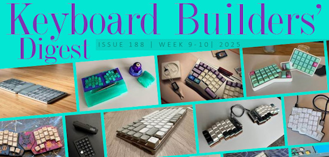](https://kbd.news/Behind-the-scenes-188-2616.html)

Keyboard Builders' Digest #188 - [kbd.news](https://kbd.news/Behind-the-scenes-188-2616.html).

text - [site](url).

text - [site](url).

[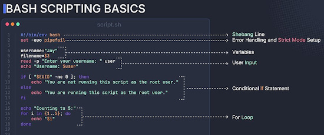](https://x.com/Avinashabroy/status/1898736627830170084)

A Bash scripting basics chart - [X](https://x.com/Avinashabroy/status/1898736627830170084).

## New

[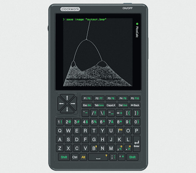](https://blog.adafruit.com/2025/03/12/the-clockwork-picocalc/)

The Clockwork PicoCalc is a flexible, programmable platform in a calculator form factor. It uses a Raspberry Pi Pico as the processing brains and can do emulation, run BASIC and LISP and more - [Clockwork](https://www.clockworkpi.com/product-page/picocalc) and the [Adafruit Blog](https://blog.adafruit.com/2025/03/12/the-clockwork-picocalc/).

## Coming Soon 

[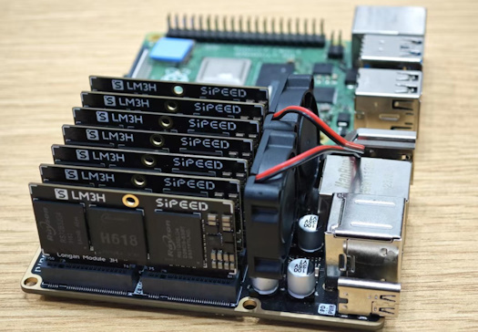](https://x.com/SipeedIO/status/1900178852367696326)

The Sipeed NanoCluster is being billed as the most affordable small clustered single board computer solution. "Compact & Affordable Cluster for Homelab Beginners" - [X](https://x.com/SipeedIO/status/1900178852367696326).

[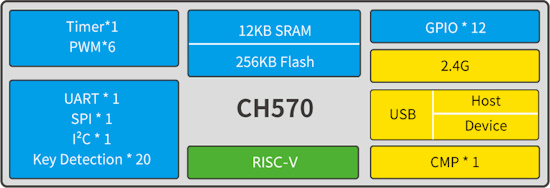](https://x.com/patrick_riscv/status/1898949553753378864)

CH57x is a RISC-V 32-bit SoC with 2.4GHz wireless and USB 2.0 (Host & Device). It’s an upgrade from the CH32V003, with more features at the same low price, about 10 cents - [X](https://x.com/patrick_riscv/status/1898949553753378864) and [Datasheet](https://www.wch-ic.com/downloads/CH572DS1_PDF.html).

## New Boards Supported by CircuitPython

The number of supported microcontrollers and Single Board Computers (SBC) grows every week. This section outlines which boards have been included in CircuitPython or added to [CircuitPython.org](https://circuitpython.org/).

This week there were (#/no) new boards added:

- [Board name](url)
- [Board name](url)
- [Board name](url)

*Note: For non-Adafruit boards, please use the support forums of the board manufacturer for assistance, as Adafruit does not have the hardware to assist in troubleshooting.*

Looking to add a new board to CircuitPython? It's highly encouraged! Adafruit has four guides to help you do so:

- [How to Add a New Board to CircuitPython](https://learn.adafruit.com/how-to-add-a-new-board-to-circuitpython/overview)
- [How to add a New Board to the circuitpython.org website](https://learn.adafruit.com/how-to-add-a-new-board-to-the-circuitpython-org-website)
- [Adding a Single Board Computer to PlatformDetect for Blinka](https://learn.adafruit.com/adding-a-single-board-computer-to-platformdetect-for-blinka)
- [Adding a Single Board Computer to Blinka](https://learn.adafruit.com/adding-a-single-board-computer-to-blinka)

## New Learn Guides

[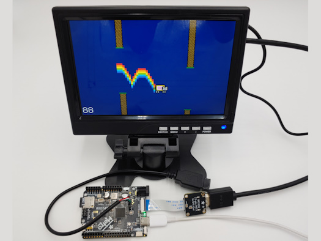](https://learn.adafruit.com/guides/latest)

The Adafruit Learning System has over 3,000 free guides for learning skills and building projects including using Python.

[title](url) from [name](url)

[title](url) from [name](url)

[title](url) from [name](url)

## Updated Learn Guides

[title](url)

## CircuitPython Libraries

The CircuitPython library numbers are continually increasing, while existing ones continue to be updated. Here we provide library numbers and updates!

To get the latest Adafruit libraries, download the [Adafruit CircuitPython Library Bundle](https://circuitpython.org/libraries). To get the latest community contributed libraries, download the [CircuitPython Community Bundle](https://circuitpython.org/libraries).

If you'd like to contribute to the CircuitPython project on the Python side of things, the libraries are a great place to start. Check out the [CircuitPython.org Contributing page](https://circuitpython.org/contributing). If you're interested in reviewing, check out Open Pull Requests. If you'd like to contribute code or documentation, check out Open Issues. We have a guide on [contributing to CircuitPython with Git and GitHub](https://learn.adafruit.com/contribute-to-circuitpython-with-git-and-github), and you can find us in the #help-with-circuitpython and #circuitpython-dev channels on the [Adafruit Discord](https://adafru.it/discord).

You can check out this [list of all the Adafruit CircuitPython libraries and drivers available](https://github.com/adafruit/Adafruit_CircuitPython_Bundle/blob/master/circuitpython_library_list.md). 

The current number of CircuitPython libraries is **###**!

**New Libraries**

Here's this week's new CircuitPython libraries:

* [library](url)

**Updated Libraries**

Here's this week's updated CircuitPython libraries:

* [library](url)

## What’s the CircuitPython team up to this week?

What is the team up to this week? Let’s check in:

**Tim**

I have been working on testing new features of the `PioMatter` library and wrote guide pages covering two new examples for it. I also wrapped up the guide for a flappy bird inspired game with Nyan Cat last week, and am working on another for a snake game now. Both run on the Metro RP2350 and output to DVI with the HSTX connector. I've also started working on mouse support with a visible cursor for CircuitPython programs. A basic example is now checked into the `tests` folder in the core repo.

**Jeff**

I continued with some more enhancements for `piomatter` which further improved frame rate by eliminating an unintended long wait after driving each row of LEDs & resolved a problem Tim encountered where some rows of LEDs would be brighter than they should have been.

**Scott**

Well, I was planning on being out this week on vacation but got a stomach bug two days before we were supposed to leave. So, we've postponed our travel for the moment. I've polished up support for a second SAVES partition on the Fruit Jam. I'm also looking into automounting SD cards and making them available (read-only) over USB as well.

**Liz**

This week I worked on a guide for the [Adafruit PCM510x I2S DACs](https://learn.adafruit.com/adafruit-pcm510x-i2s-dac). These I2S DACs have a line-out 1/8" jack and don't require a separate driver to configure. There is example code in the guide for Arduino and CircuitPython. I think they'll make a great option for CircuitPython `synthio` projects.

## Upcoming Events

Embedded World 2025 will be held March 11 to 13, 2025 in Nuremberg, Germany. [Raspberry Pi](https://x.com/Raspberry_Pi/status/1889333638417768590) will be there - [Embedded World](https://www.embedded-world.de/en).

The next MicroPython Meetup in Melbourne will be on March 26th – [Meetup](https://www.meetup.com/micropython-meetup/events). You can see recordings of previous meetings on [YouTube](https://www.youtube.com/@MicroPythonOfficial). 

The community is coming back to Pittsburgh, Pennsylvania for PyCon US 2025 May 14 - May 22, 2025 - [us.pycon.org](https://us.pycon.org/2025/).

KiCad conferences (KiCon) to be held this year include 28 - 30 May 2025 in San Diego, California, 19 - 20 Sept 2024 in Bochum, Germany, and to be determined in Asia - [KiCad](https://kicon.kicad.org/).

Open Hardware Summit 2025 is being held May 30 @ 10am - May 31 @ 6pm GMT+1 in Edinburgh, Scotland - [Eventbrite](https://www.eventbrite.com/e/open-hardware-summit-2025-tickets-1067611086499).

**Send Your Events In**

If you know of virtual events or upcoming events, please let us know via email to cpnews(at)adafruit(dot)com.

## Latest Releases

CircuitPython's stable release is [#.#.#](https://github.com/adafruit/circuitpython/releases/latest) and its unstable release is [#.#.#-##.#](https://github.com/adafruit/circuitpython/releases). New to CircuitPython? Start with our [Welcome to CircuitPython Guide](https://learn.adafruit.com/welcome-to-circuitpython).

[2025####](https://github.com/adafruit/Adafruit_CircuitPython_Bundle/releases/latest) is the latest Adafruit CircuitPython library bundle.

[2025####](https://github.com/adafruit/CircuitPython_Community_Bundle/releases/latest) is the latest CircuitPython Community library bundle.

[v#.#.#](https://micropython.org/download) is the latest MicroPython release. Documentation for it is [here](http://docs.micropython.org/en/latest/pyboard/).

[#.#.#](https://www.python.org/downloads/) is the latest Python release. The latest pre-release version is [#.#.#](https://www.python.org/download/pre-releases/).

[#,### Stars](https://github.com/adafruit/circuitpython/stargazers) Like CircuitPython? [Star it on GitHub!](https://github.com/adafruit/circuitpython)

## Call for Help -- Translating CircuitPython is now easier than ever

[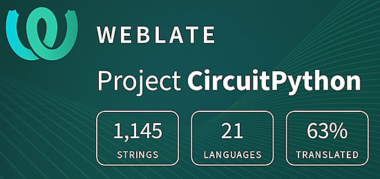](https://hosted.weblate.org/engage/circuitpython/)

One important feature of CircuitPython is translated control and error messages. With the help of fellow open source project [Weblate](https://weblate.org/), we're making it even easier to add or improve translations. 

Sign in with an existing account such as GitHub, Google or Facebook and start contributing through a simple web interface. No forks or pull requests needed! As always, if you run into trouble join us on [Discord](https://adafru.it/discord), we're here to help.

## NUMBER Thanks

The Adafruit Discord community, where we do all our CircuitPython development in the open, reached over NUMBER humans - thank you! Adafruit believes Discord offers a unique way for Python on hardware folks to connect. Join today at [https://adafru.it/discord](https://adafru.it/discord).

## ICYMI - In case you missed it

Python on hardware is the Adafruit Python video-newsletter-podcast! The news comes from the Python community, Discord, Adafruit communities and more and is broadcast on ASK an ENGINEER Wednesdays. The complete Python on Hardware weekly videocast [playlist is here](https://www.youtube.com/playlist?list=PLjF7R1fz_OOXRMjM7Sm0J2Xt6H81TdDev). The video podcast is on [iTunes](https://itunes.apple.com/us/podcast/python-on-hardware/id1451685192?mt=2), [YouTube](http://adafru.it/pohepisodes), [Instagram](https://www.instagram.com/adafruit/channel/)), and [XML](https://itunes.apple.com/us/podcast/python-on-hardware/id1451685192?mt=2).

[The weekly community chat on Adafruit Discord server CircuitPython channel - Audio / Podcast edition](https://itunes.apple.com/us/podcast/circuitpython-weekly-meeting/id1451685016) - Audio from the Discord chat space for CircuitPython, meetings are usually Mondays at 2pm ET, this is the audio version on [iTunes](https://itunes.apple.com/us/podcast/circuitpython-weekly-meeting/id1451685016), Pocket Casts, [Spotify](https://adafru.it/spotify), and [XML feed](https://adafruit-podcasts.s3.amazonaws.com/circuitpython_weekly_meeting/audio-podcast.xml).

## Contribute

The CircuitPython Weekly Newsletter is a CircuitPython community-run newsletter emailed every Monday. The complete [archives are here](https://www.adafruitdaily.com/category/circuitpython/). It highlights the latest CircuitPython related news from around the web including Python and MicroPython developments. To contribute, edit next week's draft [on GitHub](https://github.com/adafruit/circuitpython-weekly-newsletter/tree/gh-pages/_drafts) and [submit a pull request](https://help.github.com/articles/editing-files-in-your-repository/) with the changes. You may also tag your information on Twitter with #CircuitPython. 

Join the Adafruit [Discord](https://adafru.it/discord) or [post to the forum](https://forums.adafruit.com/viewforum.php?f=60) if you have questions.
