- [ ] Library and info updates
- [ ] change date
- [ ] update title
- [ ] Feature story
- [ ] Update  for images
- [ ] Update ICYDNCI
- [ ] All images 550w max only
- [ ] Link "View this email in your browser."

News Sources

- [Adafruit Playground](https://adafruit-playground.com/)
- Twitter: [CircuitPython](https://twitter.com/search?q=circuitpython&src=typed_query&f=live), [MicroPython](https://twitter.com/search?q=micropython&src=typed_query&f=live) and [Python](https://twitter.com/search?q=python&src=typed_query)
- [Raspberry Pi News](https://www.raspberrypi.com/news/)
- Mastodon [CircuitPython](https://octodon.social/tags/CircuitPython) and [MicroPython](https://octodon.social/tags/MicroPython)
- [hackster.io CircuitPython](https://www.hackster.io/search?q=circuitpython&i=projects&sort_by=most_recent) and [MicroPython](https://www.hackster.io/search?q=micropython&i=projects&sort_by=most_recent)
- YouTube: [CircuitPython](https://www.youtube.com/results?search_query=circuitpython&sp=CAI%253D), [MicroPython](https://www.youtube.com/results?search_query=micropython&sp=CAI%253D)
- Instructables: [CircuitPython](https://www.instructables.com/search/?q=circuitpython&projects=all&sort=Newest), [MicroPython](https://www.instructables.com/search/?q=micropython&projects=all&sort=Newest), [Raspberry Pi Python](https://www.instructables.com/search/?q=raspberry+pi+python&projects=all&sort=Newest)
- [hackaday CircuitPython](https://hackaday.com/blog/?s=circuitpython) and [MicroPython](https://hackaday.com/blog/?s=micropython)
- [python.org](https://www.python.org/)
- [Python Insider - dev team blog](https://pythoninsider.blogspot.com/)
- Individuals: [Jeff Geerling](https://www.jeffgeerling.com/blog), [Yakroo](https://x.com/Yakroo5077)
- Tom's Hardware: [CircuitPython](https://www.tomshardware.com/search?searchTerm=circuitpython&articleType=all&sortBy=publishedDate) and [MicroPython](https://www.tomshardware.com/search?searchTerm=micropython&articleType=all&sortBy=publishedDate) and [Raspberry Pi](https://www.tomshardware.com/search?searchTerm=raspberry%20pi&articleType=all&sortBy=publishedDate)
- [hackaday.io newest projects MicroPython](https://hackaday.io/projects?tag=micropython&sort=date) and [CircuitPython](https://hackaday.io/projects?tag=circuitpython&sort=date)
- [Google News Python](https://news.google.com/topics/CAAqIQgKIhtDQkFTRGdvSUwyMHZNRFY2TVY4U0FtVnVLQUFQAQ?hl=en-US&gl=US&ceid=US%3Aen)
- hackaday.io - [CircuitPython](https://hackaday.io/search?term=circuitpython) and [MicroPython](https://hackaday.io/search?term=micropython)

View this email in your browser. **Warning: Flashing Imagery**

Welcome to the latest Python on Microcontrollers newsletter! *insert 2-3 sentences from editor (what's in overview, banter)* - *Anne Barela, Editor*

We're on [Discord](https://discord.gg/HYqvREz), [Twitter/X](https://twitter.com/search?q=circuitpython&src=typed_query&f=live), [BlueSky](https://bsky.app/profile/circuitpython.org) and for past newsletters - [view them all here](https://www.adafruitdaily.com/category/circuitpython/). If you're reading this on the web, [subscribe here](https://www.adafruitdaily.com/). Here's the news this week:

## CircuitPython 9.2.5 Released

CircuitPython 9.2.5 is the latest bugfix revision of CircuitPython, and is a new stable release - [Adafruit Blog](https://blog.adafruit.com/2025/03/18/circuitpython-9-2-5-released/) and release notes - [GitHub](https://github.com/adafruit/circuitpython/releases/tag/9.2.5).

**Highlights of this release**
* Update frozen modules.
* Enable function attributes and reverse arithmetic operators on most boards.
* `displayio`:
  * Add `tilepalettemapper`.
  * add VT100 escape code support for scrolling and colors.
* `synthio` and `audiodelays` additions
* Add `audioio` on Espressif.
* Add `spitarget` on SAMx (enabled on most SAMx5x boards).
* Initial work on a Zephyr port.
* Bug fixes.

## Expansion of RP2350 Availability

[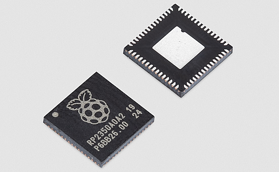](https://www.raspberrypi.com/news/rp2350-now-available-to-buy-a-high-performance-secure-microcontroller-for-your-next-project/)

Eben Upton has announced more widespread availability of their latest RP2350 microcontroller, through authorized resellers. Also the RP2354A and RP2354B variants are in the final stages of development and testing with early-access partners, to be widely available later in the year - [Raspberry Pi News](https://www.raspberrypi.com/news/rp2350-now-available-to-buy-a-high-performance-secure-microcontroller-for-your-next-project/) and [CNX Software](https://www.cnx-software.com/2025/03/18/buy-raspberry-pi-rp2350-mcu-rp2354a-and-rp2354b-variants/).

## The Value of Open Source Software

A 2024 paper noting the value of open source software. "We estimate the supply-side value of widely-used OSS is $4.15 billion, but that the demand-side value is much larger at $8.8 trillion" - [Harvard Business School](https://www.hbs.edu/ris/Publication%20Files/24-038_51f8444f-502c-4139-8bf2-56eb4b65c58a.pdf). Via [X](https://x.com/ClementDelangue/status/1901751361320206554).

## CircuitPython Pitch Shift Microphone Demonstration

ReLiC (Cooper Dalrymple) demonstrates the new [pitch shift](https://docs.circuitpython.org/en/latest/shared-bindings/audiodelays/index.html#audiodelays.PitchShift) microphone capability in CircuitPython 9.2.5 using a Pimoroni Pico Plus 2, PCM5102 I2S DAC, and ICS-43434 I2S MEMS microphone - [YouTube](https://www.youtube.com/watch?v=WQ_OikVhR20&t=13s) and code - [GitHub](https://gist.github.com/relic-se/51f40380a21a5bf844d493f2764d50f4).

## Feature

text - [site](url).

## Git 2.49 Released

Git 2.49 is here and filled with new features like faster packing, backfilling blobs in partial clones, and much more - [GitHub Blog](https://github.blog/open-source/git/highlights-from-git-2-49/). Via [BlueSky](https://bsky.app/profile/github.com/post/3lkekqcv6zk24).

## This Week's Python Streams

Python on Hardware is all about building a cooperative ecosphere which allows contributions to be valued and to grow knowledge. Below are the streams within the last week focusing on the community.

**CircuitPython Deep Dive Stream**

[Last Friday](link), Tim streamed work on {subject}.

You can see the latest video and past videos on the Adafruit YouTube channel under the Deep Dive playlist - [YouTube](https://www.youtube.com/playlist?list=PLjF7R1fz_OOXBHlu9msoXq2jQN4JpCk8A).

**CircuitPython Parsec**

John Park’s CircuitPython Parsec this week is on {subject} - [Adafruit Blog](link) and [YouTube](link).

Catch all the episodes in the [YouTube playlist](https://www.youtube.com/playlist?list=PLjF7R1fz_OOWFqZfqW9jlvQSIUmwn9lWr).

**The CircuitPython Show**

In the latest episode released March 24th, Liz Clark and Noe Ruiz join the show and share how they collaborate on projects and share some of their favorite collabs - [The CircuitPython Show](https://www.circuitpythonshow.com/@circuitpythonshow)

**CircuitPython Weekly Meeting**

CircuitPython Weekly Meeting for March 17th, 2025 ([notes](https://github.com/adafruit/adafruit-circuitpython-weekly-meeting/blob/main/2025/2025-03-17.md)) [on YouTube](https://youtu.be/AVjHZtDuZZI).

## Project of the Week: An E-ink Weather Dashboard with a Raspberry Pi

[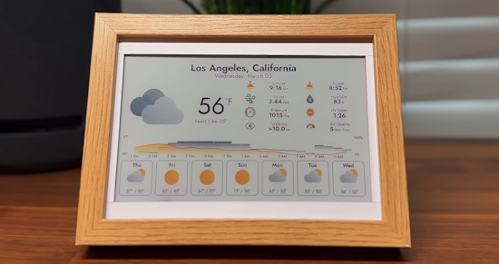](https://www.youtube.com/watch?v=65sda565l9Y)

An e-ink weather dashboard with a Raspberry Pi and Python on Pimoroni's Inky Impression display. This low-power weather dashboard displays real-time data from OpenWeatherMap and comes with a web UI to customize and schedule automatic updates - [YouTube](https://www.youtube.com/watch?v=65sda565l9Y) and [GitHub]().

## Popular Last Week

What was the most popular, most clicked link, in [last week's newsletter](https://www.adafruitdaily.com/2025/03/17/python-on-microcontrollers-newsletter-esp32-kerfuffle-software-updates-a-teensy-move-and-more-circuitpython-python-micropython-thepsf-raspberry_pi/)? [Texas Instruments Releases the World’s Smallest Microcontroller](https://www.ti.com/about-ti/newsroom/news-releases/2025/2025-03-11-ti-introduces-the-world-s-smallest-mcu--enabling-innovation-in-the-tiniest-of-applications.html).

Did you know you can read past issues of this newsletter in the Adafruit Daily Archive? [Check it out](https://www.adafruitdaily.com/category/circuitpython/).

## New Notes from Adafruit Playground

[Adafruit Playground](https://adafruit-playground.com/) is a new place for the community to post their projects and other making tips/tricks/techniques. Ad-free, it's an easy way to publish your work in a safe space for free.

[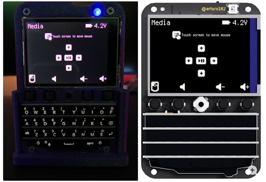](https://adafruit-playground.com/u/squid_jpg/pages/universal-ble-remote-with-keyboard-featherwing)

Universal BLE Remote with Keyboard FeatherWing - [Adafruit Playground](https://adafruit-playground.com/u/squid_jpg/pages/universal-ble-remote-with-keyboard-featherwing).

[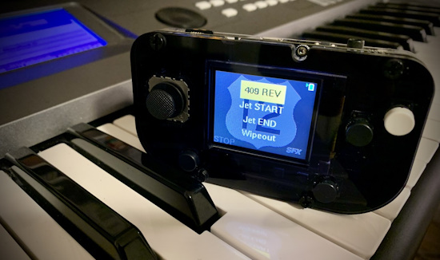](https://adafruit-playground.com/u/CGrover/pages/the-highway-12-band-sfx-machine)

The Highway 12 Band SFX Machine - [Adafruit Playground](https://adafruit-playground.com/u/CGrover/pages/the-highway-12-band-sfx-machine).

text - [Adafruit Playground](url).

## News From Around the Web

[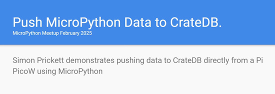](https://www.youtube.com/watch?v=77VCf7xKRNA)

Capturing sensor data on a Raspberry Pi Pico W with MicroPython and store it in an open source SQL database. A video from Simon Prickett's recent talk at the MicroPython meetup - [YouTube](https://www.youtube.com/watch?v=77VCf7xKRNA). Via [BlueSky](https://bsky.app/profile/simonprickett.dev/post/3lksicspwfk2k).

[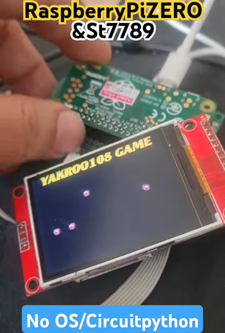](https://www.youtube.com/shorts/yIo4-BldpzQ)

A demonstration of bouncing balls on an LCD screen with a Raspberry Pi Zero running CiricuitPython bare metal (without Linux) - [YouTube](https://www.youtube.com/shorts/yIo4-BldpzQ). Via [X](https://x.com/Yakroo5077/status/1902307598961144081).

[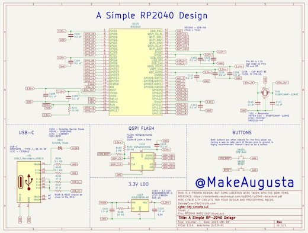](https://x.com/MakeAugusta/status/1900894845537055060)

A simple RP2040 design - [X](https://x.com/MakeAugusta/status/1900894845537055060).

[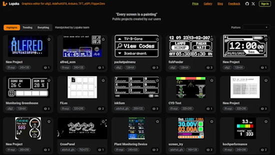](https://blog.adafruit.com/2025/03/17/lopaka-a-web-based-editor-for-coding-for-small-screens/)

Lopaka: a web-based editor for coding small screens - [Adafruit Blog](https://blog.adafruit.com/2025/03/17/lopaka-a-web-based-editor-for-coding-for-small-screens/) and [Website](https://lopaka.app/sandbox).

[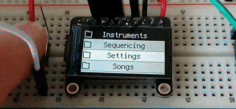](https://bsky.app/profile/mutex-instruments.bsky.social/post/3lknruifwic2d)

Mutex Instruments is working on a menu system with an Adafruit 1.14" 240x135 Color TFT Breakout LCD Display. This one will go on a sequencer module. It's made with CircuitPython - [X](https://bsky.app/profile/mutex-instruments.bsky.social/post/3lknruifwic2d).

[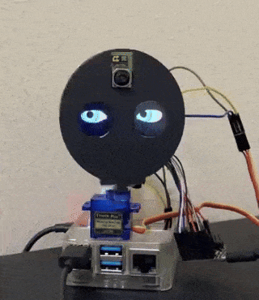](https://x.com/sozoraemon/status/1901587364180566020)

Using a Raspberry Pi and Python to control a servo for a robot - [X](https://x.com/sozoraemon/status/1901587364180566020).

[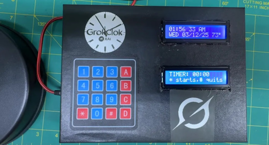](https://www.tomshardware.com/raspberry-pi/maker-builds-raspberry-pi-pico-smart-clock-with-lots-of-cool-features)

A Raspberry Pi Pico smart clock programmed in MicroPython - [Tom's Hardware](https://www.tomshardware.com/raspberry-pi/maker-builds-raspberry-pi-pico-smart-clock-with-lots-of-cool-features) and [YouTube](https://youtu.be/bRO0z1XkEDo).

Raspberry Pi and ChatGPT bring AI conversations to a retro rotary phone - [Tom's Hardware](url) and [Hackster.io](https://www.hackster.io/pollux-labs/retro-calling-chatgpt-on-your-rotary-phone-731b91).

text - [site](url).

text - [site](url).

text - [site](url).

text - [site](url).

text - [site](url).

text - [site](url).

text - [site](url).

text - [site](url).

text - [site](url).

## Coming Soon / New

text - [site](url).

text - [site](url).

## New Boards Supported by CircuitPython

The number of supported microcontrollers and Single Board Computers (SBC) grows every week. This section outlines which boards have been included in CircuitPython or added to [CircuitPython.org](https://circuitpython.org/).

This week there were (#/no) new boards added:

- [Board name](url)
- [Board name](url)
- [Board name](url)

*Note: For non-Adafruit boards, please use the support forums of the board manufacturer for assistance, as Adafruit does not have the hardware to assist in troubleshooting.*

Looking to add a new board to CircuitPython? It's highly encouraged! Adafruit has four guides to help you do so:

- [How to Add a New Board to CircuitPython](https://learn.adafruit.com/how-to-add-a-new-board-to-circuitpython/overview)
- [How to add a New Board to the circuitpython.org website](https://learn.adafruit.com/how-to-add-a-new-board-to-the-circuitpython-org-website)
- [Adding a Single Board Computer to PlatformDetect for Blinka](https://learn.adafruit.com/adding-a-single-board-computer-to-platformdetect-for-blinka)
- [Adding a Single Board Computer to Blinka](https://learn.adafruit.com/adding-a-single-board-computer-to-blinka)

## New Learn Guides

[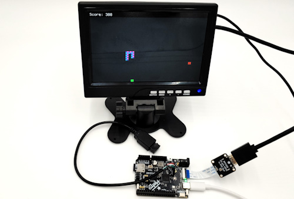](https://learn.adafruit.com/guides/latest)

The Adafruit Learning System has over 3,000 free guides for learning skills and building projects including using Python.

[Snake Game on Metro RP2350](https://learn.adafruit.com/snake-game-on-metro-rp2350) from [Tim C](https://learn.adafruit.com/u/Foamyguy)

[IOT Moon Phase Guide](https://learn.adafruit.com/moon-phase) from [Ruiz Brothers](https://learn.adafruit.com/u/pixil3d)

## Updated Learn Guides

[Adafruit BrainCraft HAT - Easy Machine Learning for Raspberry Pi](https://learn.adafruit.com/adafruit-braincraft-hat-easy-machine-learning-for-raspberry-pi)

## CircuitPython Libraries

The CircuitPython library numbers are continually increasing, while existing ones continue to be updated. Here we provide library numbers and updates!

To get the latest Adafruit libraries, download the [Adafruit CircuitPython Library Bundle](https://circuitpython.org/libraries). To get the latest community contributed libraries, download the [CircuitPython Community Bundle](https://circuitpython.org/libraries).

If you'd like to contribute to the CircuitPython project on the Python side of things, the libraries are a great place to start. Check out the [CircuitPython.org Contributing page](https://circuitpython.org/contributing). If you're interested in reviewing, check out Open Pull Requests. If you'd like to contribute code or documentation, check out Open Issues. We have a guide on [contributing to CircuitPython with Git and GitHub](https://learn.adafruit.com/contribute-to-circuitpython-with-git-and-github), and you can find us in the #help-with-circuitpython and #circuitpython-dev channels on the [Adafruit Discord](https://adafru.it/discord).

You can check out this [list of all the Adafruit CircuitPython libraries and drivers available](https://github.com/adafruit/Adafruit_CircuitPython_Bundle/blob/master/circuitpython_library_list.md). 

The current number of CircuitPython libraries is **###**!

**New Libraries**

Here's this week's new CircuitPython libraries:

* [library](url)

**Updated Libraries**

Here's this week's updated CircuitPython libraries:

* [library](url)

## What’s the CircuitPython team up to this week?

What is the team up to this week? Let’s check in:

**Dan**

text.

**Tim**

This week I've been working on code and guide pages for a memory game that uses HSTX and USB Host mouse on the Metro RP2350. I've also done reviewed and tested the latest changes to `piomatter`, and submitted a quick fix to an issue causing the serpentine arguments to be ignored in the CLI examples. I am also just beginning to work on some animation effects in `displayio` for a Fruit Jam logo visual animation.

**Jeff**

text.

**Scott**

This week I've been exploring [vibe coding](https://en.wikipedia.org/wiki/Vibe_coding) using Claude Code to modify code at my direction. I'm working on adding native font loading from the CIRCUITPY drive for the terminal. This allows us to support emoji and languages with many more characters than what we want to fit into the image itself. It was able to generate a new `lvfontio` module for me after I gave it the Bitmap Font Python library and the existing `fontio` module as context. Vibe coding is very interesting! It gets the typing code part of coding out of the way.

**Liz**

This week I worked on a guide for the new [TPS65131 Split Power Supply Boost Converter](https://learn.adafruit.com/adafruit-tps65131-split-power-supply-boost-converter) in the shop. This is a split power supply with one positive and one negative voltage rail. In the guide I demonstrated how to measure both the positive and negative outputs. I'm planning to do a project with it where I supply 5V from USB and power a Eurorack module, which needs +12V and -12V for its power supply.

I also wrote code for the [Moon Phase Clock](https://learn.adafruit.com/moon-phase). This required finding a new API to get moon phase data. I found the [FarmSense API](https://www.farmsense.net/) that supplies agricultural information and is free to use. This lets you retrieve the current moon phase as a string after supplying the Unix timestamp, which we can obtain easily with Adafruit IO.

## Upcoming Events

The next MicroPython Meetup in Melbourne will be on March 26th – [Meetup](https://www.meetup.com/micropython-meetup/events). You can see recordings of previous meetings on [YouTube](https://www.youtube.com/@MicroPythonOfficial). 

City of STEM and Maker Faire Los Angeles, California is being held April 12, 2025 - [MakerFaire](https://losangeles.makerfaire.com/).

The community is coming back to Pittsburgh, Pennsylvania for PyCon US 2025 May 14 - May 22, 2025 - [us.pycon.org](https://us.pycon.org/2025/).

KiCad conferences (KiCon) to be held this year include 28 - 30 May 2025 in San Diego, California, 19 - 20 Sept 2024 in Bochum, Germany, and to be determined in Asia - [KiCad](https://kicon.kicad.org/).

Open Hardware Summit 2025 is being held May 30 @ 10am - May 31 @ 6pm GMT+1 in Edinburgh, Scotland - [Eventbrite](https://www.eventbrite.com/e/open-hardware-summit-2025-tickets-1067611086499).

PyCon UK will be at CONTACT in Manchester from Friday 19th September to Monday 22nd September 2025 - [PyCon UK 2025](https://2025.pyconuk.org/).

**Send Your Events In**

If you know of virtual events or upcoming events, please let us know via email to cpnews(at)adafruit(dot)com.

## Latest Releases

CircuitPython's stable release is [#.#.#](https://github.com/adafruit/circuitpython/releases/latest) and its unstable release is [#.#.#-##.#](https://github.com/adafruit/circuitpython/releases). New to CircuitPython? Start with our [Welcome to CircuitPython Guide](https://learn.adafruit.com/welcome-to-circuitpython).

[2025####](https://github.com/adafruit/Adafruit_CircuitPython_Bundle/releases/latest) is the latest Adafruit CircuitPython library bundle.

[2025####](https://github.com/adafruit/CircuitPython_Community_Bundle/releases/latest) is the latest CircuitPython Community library bundle.

[v#.#.#](https://micropython.org/download) is the latest MicroPython release. Documentation for it is [here](http://docs.micropython.org/en/latest/pyboard/).

[#.#.#](https://www.python.org/downloads/) is the latest Python release. The latest pre-release version is [#.#.#](https://www.python.org/download/pre-releases/).

[#,### Stars](https://github.com/adafruit/circuitpython/stargazers) Like CircuitPython? [Star it on GitHub!](https://github.com/adafruit/circuitpython)

## Call for Help -- Translating CircuitPython is now easier than ever

[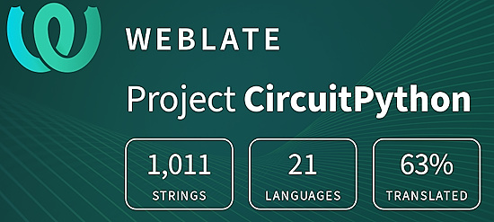](https://hosted.weblate.org/engage/circuitpython/)

One important feature of CircuitPython is translated control and error messages. With the help of fellow open source project [Weblate](https://weblate.org/), we're making it even easier to add or improve translations. 

Sign in with an existing account such as GitHub, Google or Facebook and start contributing through a simple web interface. No forks or pull requests needed! As always, if you run into trouble join us on [Discord](https://adafru.it/discord), we're here to help.

## NUMBER Thanks

The Adafruit Discord community, where we do all our CircuitPython development in the open, reached over NUMBER humans - thank you! Adafruit believes Discord offers a unique way for Python on hardware folks to connect. Join today at [https://adafru.it/discord](https://adafru.it/discord).

## ICYMI - In case you missed it

Python on hardware is the Adafruit Python video-newsletter-podcast! The news comes from the Python community, Discord, Adafruit communities and more and is broadcast on ASK an ENGINEER Wednesdays. The complete Python on Hardware weekly videocast [playlist is here](https://www.youtube.com/playlist?list=PLjF7R1fz_OOXRMjM7Sm0J2Xt6H81TdDev). The video podcast is on [iTunes](https://itunes.apple.com/us/podcast/python-on-hardware/id1451685192?mt=2), [YouTube](http://adafru.it/pohepisodes), [Instagram](https://www.instagram.com/adafruit/channel/)), and [XML](https://itunes.apple.com/us/podcast/python-on-hardware/id1451685192?mt=2).

[The weekly community chat on Adafruit Discord server CircuitPython channel - Audio / Podcast edition](https://itunes.apple.com/us/podcast/circuitpython-weekly-meeting/id1451685016) - Audio from the Discord chat space for CircuitPython, meetings are usually Mondays at 2pm ET, this is the audio version on [iTunes](https://itunes.apple.com/us/podcast/circuitpython-weekly-meeting/id1451685016), Pocket Casts, [Spotify](https://adafru.it/spotify), and [XML feed](https://adafruit-podcasts.s3.amazonaws.com/circuitpython_weekly_meeting/audio-podcast.xml).

## Contribute

The CircuitPython Weekly Newsletter is a CircuitPython community-run newsletter emailed every Monday. The complete [archives are here](https://www.adafruitdaily.com/category/circuitpython/). It highlights the latest CircuitPython related news from around the web including Python and MicroPython developments. To contribute, edit next week's draft [on GitHub](https://github.com/adafruit/circuitpython-weekly-newsletter/tree/gh-pages/_drafts) and [submit a pull request](https://help.github.com/articles/editing-files-in-your-repository/) with the changes. You may also tag your information on Twitter with #CircuitPython. 

Join the Adafruit [Discord](https://adafru.it/discord) or [post to the forum](https://forums.adafruit.com/viewforum.php?f=60) if you have questions.
