- [ ] Library and info updates
- [ ] change date
- [ ] update title
- [ ] Feature story
- [ ] Update  for images
- [ ] Update ICYDNCI
- [ ] All images 550w max only
- [ ] Link "View this email in your browser."

News Sources

- [Adafruit Playground](https://adafruit-playground.com/)
- Twitter: [CircuitPython](https://twitter.com/search?q=circuitpython&src=typed_query&f=live), [MicroPython](https://twitter.com/search?q=micropython&src=typed_query&f=live) and [Python](https://twitter.com/search?q=python&src=typed_query)
- [Raspberry Pi News](https://www.raspberrypi.com/news/)
- Mastodon [CircuitPython](https://octodon.social/tags/CircuitPython) and [MicroPython](https://octodon.social/tags/MicroPython)
- [hackster.io CircuitPython](https://www.hackster.io/search?q=circuitpython&i=projects&sort_by=most_recent) and [MicroPython](https://www.hackster.io/search?q=micropython&i=projects&sort_by=most_recent)
- YouTube: [CircuitPython](https://www.youtube.com/results?search_query=circuitpython&sp=CAI%253D), [MicroPython](https://www.youtube.com/results?search_query=micropython&sp=CAI%253D)
- Instructables: [CircuitPython](https://www.instructables.com/search/?q=circuitpython&projects=all&sort=Newest), [MicroPython](https://www.instructables.com/search/?q=micropython&projects=all&sort=Newest), [Raspberry Pi Python](https://www.instructables.com/search/?q=raspberry+pi+python&projects=all&sort=Newest)
- [hackaday CircuitPython](https://hackaday.com/blog/?s=circuitpython) and [MicroPython](https://hackaday.com/blog/?s=micropython)
- [python.org](https://www.python.org/)
- [Python Insider - dev team blog](https://pythoninsider.blogspot.com/)
- Individuals: [Jeff Geerling](https://www.jeffgeerling.com/blog), [Yakroo](https://x.com/Yakroo5077)
- Tom's Hardware: [CircuitPython](https://www.tomshardware.com/search?searchTerm=circuitpython&articleType=all&sortBy=publishedDate) and [MicroPython](https://www.tomshardware.com/search?searchTerm=micropython&articleType=all&sortBy=publishedDate) and [Raspberry Pi](https://www.tomshardware.com/search?searchTerm=raspberry%20pi&articleType=all&sortBy=publishedDate)
- [hackaday.io newest projects MicroPython](https://hackaday.io/projects?tag=micropython&sort=date) and [CircuitPython](https://hackaday.io/projects?tag=circuitpython&sort=date)
- [Google News Python](https://news.google.com/topics/CAAqIQgKIhtDQkFTRGdvSUwyMHZNRFY2TVY4U0FtVnVLQUFQAQ?hl=en-US&gl=US&ceid=US%3Aen)
- hackaday.io - [CircuitPython](https://hackaday.io/search?term=circuitpython) and [MicroPython](https://hackaday.io/search?term=micropython)

View this email in your browser. **Warning: Flashing Imagery**

Welcome to the latest Python on Microcontrollers newsletter! *insert 2-3 sentences from editor (what's in overview, banter)* - *Anne Barela, Editor*

We're on [Discord](https://discord.gg/HYqvREz), [Twitter/X](https://twitter.com/search?q=circuitpython&src=typed_query&f=live), [BlueSky](https://bsky.app/profile/circuitpython.org) and for past newsletters - [view them all here](https://www.adafruitdaily.com/category/circuitpython/). If you're reading this on the web, [subscribe here](https://www.adafruitdaily.com/). Here's the news this week:

## The CircuitPython.Org Website is Updated

[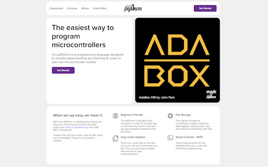](https://circuitpython.org/)

As posted previously, the CircuitPython.org website has been refreshed to better highlight the language and content - [circuitpython.org](https://circuitpython.org/).

## TIOBE Index for March 2025: Top 10 Most Popular Programming Languages

Python continues to be the #1 language worldwide, gaining over 8% from last month. Also of interest is rising popularity of Delphi/Object Pascal and Ada - [TechRepublic](https://www.techrepublic.com/article/tiobe-index-language-rankings/).

## Using AI to Program Microcontrollers

[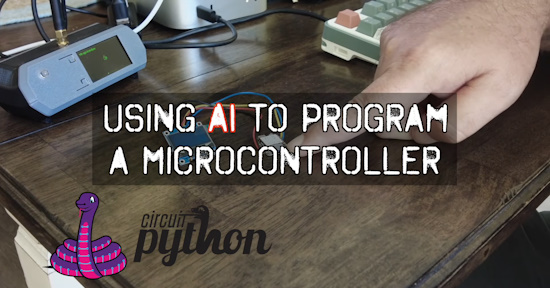](https://www.youtube.com/watch?v=HMS4ONOntC8)

Vivian Van Zyl on YouTube demonstrates using [Code Mate](https://marketplace.visualstudio.com/items?itemName=AyushSinghal.Code-Mate) to code CircuitPython for an ESP32-C6 and an SSD1306 OLED display - [YouTube](https://www.youtube.com/watch?v=HMS4ONOntC8).

*Newsletter note: the use of AI and Large Language Models (LLM) is a very fast paced, changing field. Adafruit has shown some videos with Ladyada coding with Claude Code recently. All code generally needs to be reviewed to ensure it is correct. And workflows used this week may be different next week due to tool changes. And then there is "The Next Great Thing" that will leave previous tutorials obsolete.*

## Introduction to CS and Programming Using Python From MIT

MIT Open CourseWare has an online class available via the internet: 6.100L Introduction to CS and Programming Using Python - [Website](https://ocw.mit.edu/courses/6-100l-introduction-to-cs-and-programming-using-python-fall-2022/) and videos - [YouTube Playlist](https://www.youtube.com/playlist?list=PLUl4u3cNGP62A-ynp6v6-LGBCzeH3VAQB). Via [X](https://x.com/MIT_CSAIL/status/1904201586835911140).

## CircuitPython 9.2.6 Released

CircuitPython 9.2.6 is the latest bugfix revision of CircuitPython, and is a new stable release - [Adafruit Blog](https://blog.adafruit.com/2025/03/22/circuitpython-9-2-6-released/) and release notes - [GitHub](https://github.com/adafruit/circuitpython/releases/tag/9.2.6).

**Highlights of this release**

- Fix `storage.remount("/", readonly=False)` regression.
- Fix RP2xxx WiFi mDNS limitations.

## Zephyr RTOS on Raspberry Pi Pico 2 Tutorials

[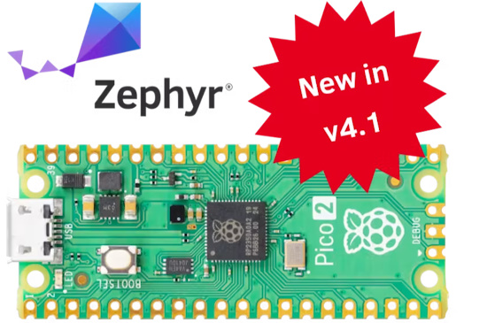](https://www.hackster.io/cdwilson/zephyr-rtos-on-raspberry-pi-pico-2-part-1-cf39f0)

Chris Wilson has started a new series of tutorials on hackster.io on using the Zephyr real-time operating system (RTOS) version 4.1 to program the Raspberry Pi Pico 2 - [hackster.io](https://www.hackster.io/cdwilson/zephyr-rtos-on-raspberry-pi-pico-2-part-1-cf39f0). Via [X](https://x.com/ZephyrIoT/status/1905613406586945954).

## Microsoft is Offering Free AI/ML Courses for Beginners

[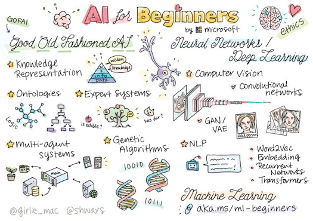](https://x.com/swapnakpanda/status/1904175658764542406)

Microsoft has created four free courses to introduce folks to artificial intelligence - [X](https://x.com/swapnakpanda/status/1904175658764542406).

* [Artificial Intelligence for Beginners - A Curriculum](https://microsoft.github.io/AI-For-Beginners/)
* [Generative AI for Beginners](https://microsoft.github.io/generative-ai-for-beginners/#/)
* [AI Agents for Beginners](https://github.com/microsoft/ai-agents-for-beginners)
* [Machine Learning for Beginners - A Curriculum](https://microsoft.github.io/ML-For-Beginners/#/)

## Raspberry Pi ASCII Camera

[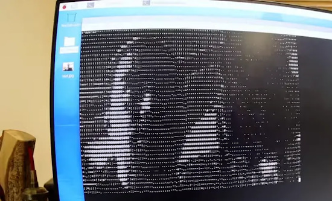](https://www.tomshardware.com/raspberry-pi/maker-builds-raspberry-pi-ascii-camera-turning-video-frames-into-text-based-imagery)

André Esser built a Raspberry Pi video to ASCII out project in three days for a Raspberry Pi Jam event - [Tom's Hardware](https://www.tomshardware.com/raspberry-pi/maker-builds-raspberry-pi-ascii-camera-turning-video-frames-into-text-based-imagery) and [YouTube](https://www.youtube.com/watch?v=i9Zj2qN0uJ8).

[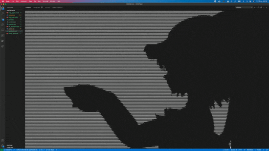](https://github.com/Esser50K/ASCIIPlayer)

The project uses the Python package ASCII Player - [GitHub](https://github.com/Esser50K/ASCIIPlayer).

## This Week's Python Streams

Python on Hardware is all about building a cooperative ecosphere which allows contributions to be valued and to grow knowledge. Below are the streams within the last week focusing on the community.

**CircuitPython Deep Dive Stream**

[Last Friday](https://www.youtube.com/watch?v=ItP-Fhl0GW8), Scott streamed work on Emoji Fonts in CircuitPython.

You can see the latest video and past videos on the Adafruit YouTube channel under the Deep Dive playlist - [YouTube](https://www.youtube.com/playlist?list=PLjF7R1fz_OOXBHlu9msoXq2jQN4JpCk8A).

**CircuitPython Parsec**

John Park’s CircuitPython Parsec this week is on {subject} - [Adafruit Blog](link) and [YouTube](link).

Catch all the episodes in the [YouTube playlist](https://www.youtube.com/playlist?list=PLjF7R1fz_OOWFqZfqW9jlvQSIUmwn9lWr).

**The CircuitPython Show**

The CircuitPython Show has returned after a one year hiatus! In the latest episode, host Paul Cutler interviews xxxx - [The CircuitPython Show](https://www.circuitpythonshow.com)

**CircuitPython Weekly Meeting**

CircuitPython Weekly Meeting for March 24, 2025 ([notes](https://github.com/adafruit/adafruit-circuitpython-weekly-meeting/blob/main/2025/2025-03-24.md)) [on YouTube](https://youtu.be/GZ-9BZDH08g).

## Project of the Week

[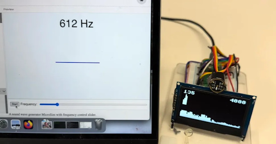](https://www.tomshardware.com/raspberry-pi/raspberry-pi-pico-2-fft-sound-spectrum-analyzer-visualizes-audio-via-oled-display)

Dan McCreary has built an audio spectrum analyzer using a Raspberry Pi Pico 2, an OLED display and MicroPython - [Tom's Hardware](https://www.tomshardware.com/raspberry-pi/raspberry-pi-pico-2-fft-sound-spectrum-analyzer-visualizes-audio-via-oled-display), [YouTube](https://youtu.be/mszrdmg-LGs) and [GitHub](https://dmccreary.github.io/learning-micropython/advanced-labs/30-spectrum-analyzer/).

## Popular Last Week

What was the most popular, most clicked link, in [last week's newsletter](https://www.adafruitdaily.com/2025/03/24/python-on-microcontrollers-newsletter-circuitpython-9-2-5-is-out-600-boards-open-source-software-and-more-circuitpython-python-micropython-thepsf-raspberry_pi/)? [E-ink Weather Dashboard with a Raspberry Pi](https://www.youtube.com/watch?v=65sda565l9Y).

Did you know you can read past issues of this newsletter in the Adafruit Daily Archive? [Check it out](https://www.adafruitdaily.com/category/circuitpython/).

## New Notes from Adafruit Playground

[Adafruit Playground](https://adafruit-playground.com/) is a new place for the community to post their projects and other making tips/tricks/techniques. Ad-free, it's an easy way to publish your work in a safe space for free.

[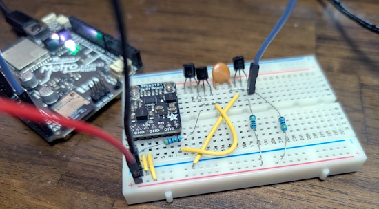](https://adafruit-playground.com/u/jepler/pages/circuitpython-avalanche-noise-rng-with-tps65131-npn-transistors)

CircuitPython "Avalanche Noise" random number generator (RNG) with TPS65131 & NPN transistors - [Adafruit Playground](https://adafruit-playground.com/u/jepler/pages/circuitpython-avalanche-noise-rng-with-tps65131-npn-transistors).

[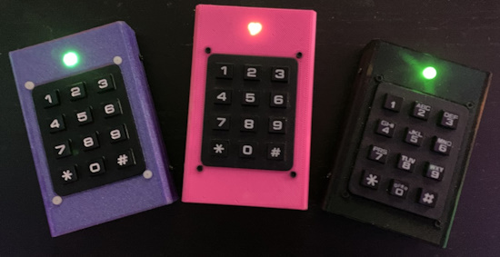](https://adafruit-playground.com/u/squid_jpg/pages/guide-build-a-wifi-matrix-keypad-remote)

Build a WiFi Matrix Keypad Remote - [Adafruit Playground](https://adafruit-playground.com/u/squid_jpg/pages/guide-build-a-wifi-matrix-keypad-remote).

[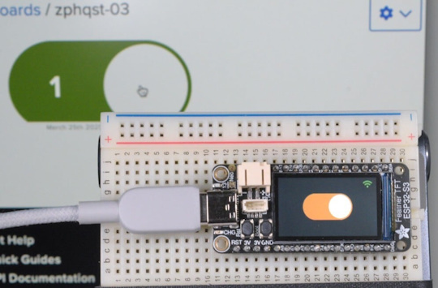](https://adafruit-playground.com/u/SamBlenny/pages/zephyr-quest-iot-toggle-switch-for-feather-tft)

Zephyr Quest: IoT Toggle Switch for Feather TFT - [Adafruit Playground](https://adafruit-playground.com/u/SamBlenny/pages/zephyr-quest-iot-toggle-switch-for-feather-tft).

## News From Around the Web

[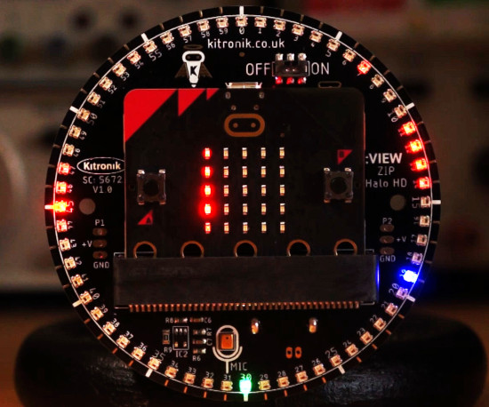](https://www.instructables.com/Making-an-Accurate-Stylish-Clock-With-the-Kitronik/)

An LED clock with many backgrounds using the Kitronik ZIP Halo HD and BBC micro:bit V2 in MicroPython featuring a drift-adjusted MCP7940N RTC and synchronisation with the MicroPython clock, includes a look at the current [issues with MicroPython on micro:bit timing](https://github.com/microbit-foundation/micropython-microbit-v2/issues/225) and use of [pyminify](https://pypi.org/project/python-minifier/) to squeeze code into a [small file system](https://github.com/microbit-foundation/micropython-microbit-v2/issues/226) - [Instructables](https://www.instructables.com/Making-an-Accurate-Stylish-Clock-With-the-Kitronik/).

[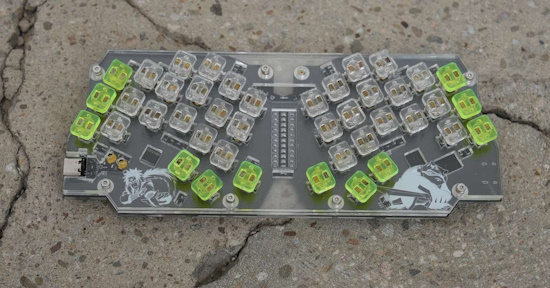](https://chrischrislolo.github.io/orthoLabLogs/keyboard-design-contest-00.html)

Keyboard design contest #00 results - [GitHub](https://chrischrislolo.github.io/orthoLabLogs/keyboard-design-contest-00.html).

Making an International Space Station tracker with Adafruit MagTag and CircuitPython - [BlueSky thread](https://bsky.app/profile/apendley.bsky.social/post/3llf3vz7ji22o).

[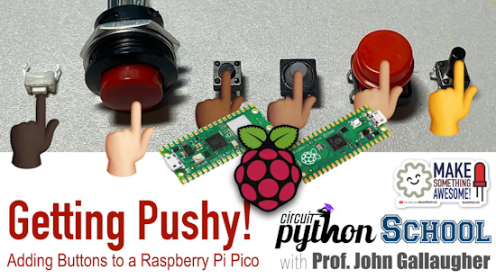](https://www.youtube.com/watch?v=UPLoJ-NpZQY)

An updated CircuitPython lesson on buttons using the Raspberry Pi Pico and CircuitPython. It demonstrates fluctuation, high impedance and the need for the internal resistor. It also shows the fluctuation is more prominent in Pico than Pico 2 - [YouTube](https://www.youtube.com/watch?v=UPLoJ-NpZQY). Via [BlueSky](https://bsky.app/profile/gallaugher.bsky.social/post/3lkxqobobtk2b).

[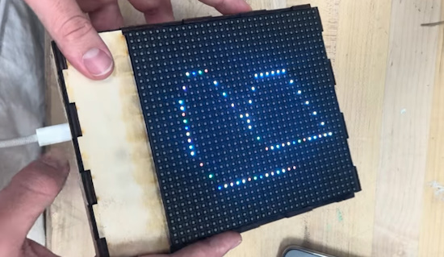](https://www.instructables.com/Tilt-a-Sketch/)

Alfonso created an interactive art piece. The Tilt-A-Sketch is modern twist on the classic Etch A Sketch, using the Adafruit Matrix Portal S3, an LED matrix panel and CircuitPython - [Instructables](https://www.instructables.com/Tilt-a-Sketch/). Via [BlueSky](https://bsky.app/profile/gallaugher.bsky.social/post/3ll2aaptxk22i).

[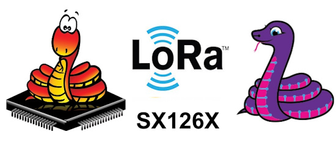](https://github.com/ehong-tl/micropySX126X)

A Semtech SX126x LoRa driver for Micropython and CircuitPython - [GitHub](https://github.com/ehong-tl/micropySX126X).

[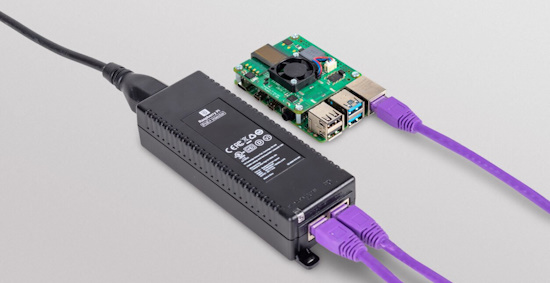](https://www.raspberrypi.com/news/raspberry-pi-poe-injector-on-sale-now-at-25/)

Raspberry Pi has released a small Power over Ethernet (PoE) injector for network power use. The promised PoE HAT is still in development - [Raspberry Pi News](https://www.raspberrypi.com/news/raspberry-pi-poe-injector-on-sale-now-at-25/).

[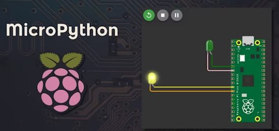](https://www.youtube.com/watch?v=VAY2_wBxFis)

How to practice MicroPython without a microcontroller: Wowki and Raspberry Pi Pico - [YouTube](https://www.youtube.com/watch?v=VAY2_wBxFis).

text - [site](url).

text - [site](url).

text - [site](url).

Scheme-it – Schematic drawing and block diagramming via the web - [DigiKey](https://www.digikey.com/en/schemeit/home). Via [X](https://x.com/digikey/status/1902052882834141581?s=03).

text - [site](url).

[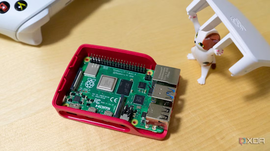](https://www.xda-developers.com/raspberry-pi-projects-convert-furniture-devices/)

3 Raspberry Pi projects that convert furniture into devices - [XDA](https://www.xda-developers.com/raspberry-pi-projects-convert-furniture-devices/).

[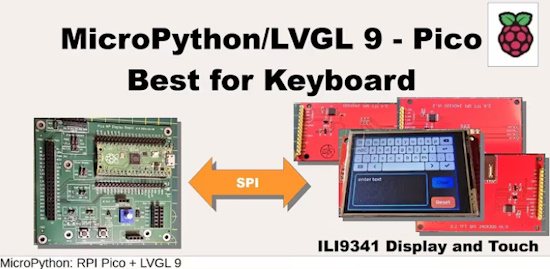](https://www.youtube.com/watch?v=PnHdcLq4VnY)

Raspberry Pi Pico and MicroPython LVGL: the best display for the keyboard widget - [YouTube](https://www.youtube.com/watch?v=PnHdcLq4VnY) and [GitHub](https://github.com/kwinter745321/PicoLVGL/tree/main/Videos/video26).

text - [site](url).

text - [site](url).

text - [site](url).

## New

[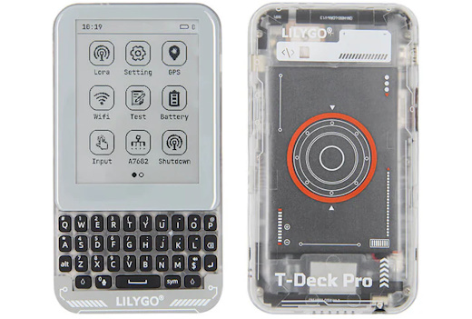](https://lilygo.cc/products/t-deck-pro?variant=45211147174069)

T-Deck Pro is an open-source dev board with a keyboard and touchscreen. It has 4G cellular + SX1262 LoRa and is based on an ESP32 - [LilyGo](https://lilygo.cc/products/t-deck-pro?variant=45211147174069).

[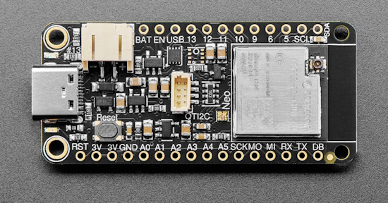](url)

text - [site](url).

## New Boards Supported by CircuitPython

The number of supported microcontrollers and Single Board Computers (SBC) grows every week. This section outlines which boards have been included in CircuitPython or added to [CircuitPython.org](https://circuitpython.org/).

This week there were (#/no) new boards added:

- [Board name](url)
- [Board name](url)
- [Board name](url)

*Note: For non-Adafruit boards, please use the support forums of the board manufacturer for assistance, as Adafruit does not have the hardware to assist in troubleshooting.*

Looking to add a new board to CircuitPython? It's highly encouraged! Adafruit has four guides to help you do so:

- [How to Add a New Board to CircuitPython](https://learn.adafruit.com/how-to-add-a-new-board-to-circuitpython/overview)
- [How to add a New Board to the circuitpython.org website](https://learn.adafruit.com/how-to-add-a-new-board-to-the-circuitpython-org-website)
- [Adding a Single Board Computer to PlatformDetect for Blinka](https://learn.adafruit.com/adding-a-single-board-computer-to-platformdetect-for-blinka)
- [Adding a Single Board Computer to Blinka](https://learn.adafruit.com/adding-a-single-board-computer-to-blinka)

## New Learn Guides

[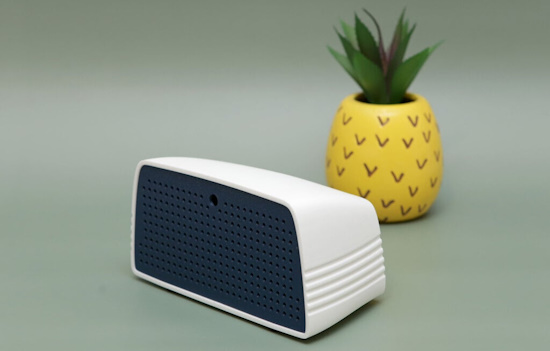](https://learn.adafruit.com/guides/latest)

The Adafruit Learning System has over 3,000 free guides for learning skills and building projects including using Python.

[Severance-style Bluetooth Speaker](https://learn.adafruit.com/bluetooth-speaker) from [Ruiz Brothers and Liz Clark](https://learn.adafruit.com/u/pixil3d)

[title](url) from [name](url)

[title](url) from [name](url)

## Updated Learn Guides

[title](url)

## CircuitPython Libraries

The CircuitPython library numbers are continually increasing, while existing ones continue to be updated. Here we provide library numbers and updates!

To get the latest Adafruit libraries, download the [Adafruit CircuitPython Library Bundle](https://circuitpython.org/libraries). To get the latest community contributed libraries, download the [CircuitPython Community Bundle](https://circuitpython.org/libraries).

If you'd like to contribute to the CircuitPython project on the Python side of things, the libraries are a great place to start. Check out the [CircuitPython.org Contributing page](https://circuitpython.org/contributing). If you're interested in reviewing, check out Open Pull Requests. If you'd like to contribute code or documentation, check out Open Issues. We have a guide on [contributing to CircuitPython with Git and GitHub](https://learn.adafruit.com/contribute-to-circuitpython-with-git-and-github), and you can find us in the #help-with-circuitpython and #circuitpython-dev channels on the [Adafruit Discord](https://adafru.it/discord).

You can check out this [list of all the Adafruit CircuitPython libraries and drivers available](https://github.com/adafruit/Adafruit_CircuitPython_Bundle/blob/master/circuitpython_library_list.md). 

The current number of CircuitPython libraries is **###**!

**New Libraries**

Here's this week's new CircuitPython libraries:

* [library](url)

**Updated Libraries**

Here's this week's updated CircuitPython libraries:

* [library](url)

## What’s the CircuitPython team up to this week?

What is the team up to this week? Let’s check in:

**Dan**

Early last week I released CircuitPython 9.2.6, mostly to fix a regression in 9.2.5. There are more recent bug fixes, so expect to see a 9.2.7 soon. We will also be starting on 10.0.0 alpha or beta releases soon.

**Tim**

This week I finished up the guide pages for the Memory game guide. I also wrote a new guide page covering the CircuitPython implementation of the Matrix rain effect. I've been working on the implementing the Fruit Jam animation shown on recent live streams in CircuitPython with `displayio` as well, it's looking very slick!

**Jeff**

It's a bittersweet update this week. I've wrapped up my time working for Adafruit, at least for now. I'm proud of what I've been able to contribute across hundreds of pull requests and I'm grateful to have met so many wonderful colleagues & community members.

Thank you so much to a range of people but in particular Scott, Dan, Kattni, PT & Limor for seeing potential in me and Adafruit for paying me to write open source software that enables creative people to do cool project. And thank you to Anne for editing the newsletter and always giving me a spot for updates. *(Ed: You will be missed, Jeff!)*

What's next for me? First, I'm going to take an extended trip. After that, I will see what projects catch my eye.

And if you're still reading all the way to the end, perhaps you want to stay in touch. I'm on [Mastodon](https://social.afront.org/@stylus). My wife & I will be posting vacation photos [online](https://metapixl.com/ijtravel).

**Scott**

text.

**Liz**

This week I worked on testing some emulators that Jeff had put together for the Metro RP2350 and the upcoming Fruit Jam board. I tested the CPM/Zork emulator and the GameBoy emulator from MCUME. I also worked the code for the [Lumon Bluetooth Speaker project](https://learn.adafruit.com/bluetooth-speaker). This was very simple, since there is an Arduino library that takes care of streaming audio over Bluetooth with I2S with ESP32. All I had to do was adjust the pins for the Feather ESP32 V2 and change the name of the Bluetooth device.

## Upcoming Events

City of STEM and Maker Faire Los Angeles, California is being held April 12, 2025 - [MakerFaire](https://losangeles.makerfaire.com/).

The next MicroPython Meetup in Melbourne will be on April 23rd – [Meetup](https://www.meetup.com/micropython-meetup/events). You can see recordings of previous meetings on [YouTube](https://www.youtube.com/@MicroPythonOfficial). 

The community is coming back to Pittsburgh, Pennsylvania for PyCon US 2025 May 14 - May 22, 2025 - [us.pycon.org](https://us.pycon.org/2025/).

KiCad conferences (KiCon) to be held this year include 28 - 30 May 2025 in San Diego, California, 19 - 20 Sept 2024 in Bochum, Germany, and to be determined in Asia - [KiCad](https://kicon.kicad.org/).

Open Hardware Summit 2025 is being held May 30 @ 10am - May 31 @ 6pm GMT+1 in Edinburgh, Scotland - [Eventbrite](https://www.eventbrite.com/e/open-hardware-summit-2025-tickets-1067611086499).

PyCon UK will be at CONTACT in Manchester from Friday 19th September to Monday 22nd September 2025 - [PyCon UK 2025](https://2025.pyconuk.org/).

**Send Your Events In**

If you know of virtual events or upcoming events, please let us know via email to cpnews(at)adafruit(dot)com.

## Latest Releases

CircuitPython's stable release is [#.#.#](https://github.com/adafruit/circuitpython/releases/latest) and its unstable release is [#.#.#-##.#](https://github.com/adafruit/circuitpython/releases). New to CircuitPython? Start with our [Welcome to CircuitPython Guide](https://learn.adafruit.com/welcome-to-circuitpython).

[2025####](https://github.com/adafruit/Adafruit_CircuitPython_Bundle/releases/latest) is the latest Adafruit CircuitPython library bundle.

[2025####](https://github.com/adafruit/CircuitPython_Community_Bundle/releases/latest) is the latest CircuitPython Community library bundle.

[v#.#.#](https://micropython.org/download) is the latest MicroPython release. Documentation for it is [here](http://docs.micropython.org/en/latest/pyboard/).

[#.#.#](https://www.python.org/downloads/) is the latest Python release. The latest pre-release version is [#.#.#](https://www.python.org/download/pre-releases/).

[#,### Stars](https://github.com/adafruit/circuitpython/stargazers) Like CircuitPython? [Star it on GitHub!](https://github.com/adafruit/circuitpython)

## Call for Help -- Translating CircuitPython is now easier than ever

[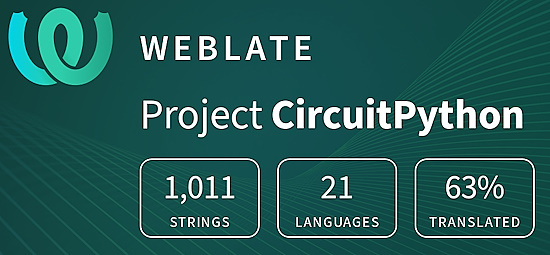](https://hosted.weblate.org/engage/circuitpython/)

One important feature of CircuitPython is translated control and error messages. With the help of fellow open source project [Weblate](https://weblate.org/), we're making it even easier to add or improve translations. 

Sign in with an existing account such as GitHub, Google or Facebook and start contributing through a simple web interface. No forks or pull requests needed! As always, if you run into trouble join us on [Discord](https://adafru.it/discord), we're here to help.

## NUMBER Thanks

The Adafruit Discord community, where we do all our CircuitPython development in the open, reached over NUMBER humans - thank you! Adafruit believes Discord offers a unique way for Python on hardware folks to connect. Join today at [https://adafru.it/discord](https://adafru.it/discord).

## ICYMI - In case you missed it

Python on hardware is the Adafruit Python video-newsletter-podcast! The news comes from the Python community, Discord, Adafruit communities and more and is broadcast on ASK an ENGINEER Wednesdays. The complete Python on Hardware weekly videocast [playlist is here](https://www.youtube.com/playlist?list=PLjF7R1fz_OOXRMjM7Sm0J2Xt6H81TdDev). The video podcast is on [iTunes](https://itunes.apple.com/us/podcast/python-on-hardware/id1451685192?mt=2), [YouTube](http://adafru.it/pohepisodes), [Instagram](https://www.instagram.com/adafruit/channel/)), and [XML](https://itunes.apple.com/us/podcast/python-on-hardware/id1451685192?mt=2).

[The weekly community chat on Adafruit Discord server CircuitPython channel - Audio / Podcast edition](https://itunes.apple.com/us/podcast/circuitpython-weekly-meeting/id1451685016) - Audio from the Discord chat space for CircuitPython, meetings are usually Mondays at 2pm ET, this is the audio version on [iTunes](https://itunes.apple.com/us/podcast/circuitpython-weekly-meeting/id1451685016), Pocket Casts, [Spotify](https://adafru.it/spotify), and [XML feed](https://adafruit-podcasts.s3.amazonaws.com/circuitpython_weekly_meeting/audio-podcast.xml).

## Contribute

The CircuitPython Weekly Newsletter is a CircuitPython community-run newsletter emailed every Monday. The complete [archives are here](https://www.adafruitdaily.com/category/circuitpython/). It highlights the latest CircuitPython related news from around the web including Python and MicroPython developments. To contribute, edit next week's draft [on GitHub](https://github.com/adafruit/circuitpython-weekly-newsletter/tree/gh-pages/_drafts) and [submit a pull request](https://help.github.com/articles/editing-files-in-your-repository/) with the changes. You may also tag your information on Twitter with #CircuitPython. 

Join the Adafruit [Discord](https://adafru.it/discord) or [post to the forum](https://forums.adafruit.com/viewforum.php?f=60) if you have questions.
