- [ ] Library and info updates
- [ ] change date
- [ ] update title
- [ ] Feature story
- [ ] Update  for images
- [ ] Update ICYDNCI
- [ ] All images 550w max only
- [ ] Link "View this email in your browser."

News Sources

- [Adafruit Playground](https://adafruit-playground.com/)
- Twitter: [CircuitPython](https://twitter.com/search?q=circuitpython&src=typed_query&f=live), [MicroPython](https://twitter.com/search?q=micropython&src=typed_query&f=live) and [Python](https://twitter.com/search?q=python&src=typed_query)
- [Raspberry Pi News](https://www.raspberrypi.com/news/)
- Mastodon [CircuitPython](https://octodon.social/tags/CircuitPython) and [MicroPython](https://octodon.social/tags/MicroPython)
- [hackster.io CircuitPython](https://www.hackster.io/search?q=circuitpython&i=projects&sort_by=most_recent) and [MicroPython](https://www.hackster.io/search?q=micropython&i=projects&sort_by=most_recent)
- YouTube: [CircuitPython](https://www.youtube.com/results?search_query=circuitpython&sp=CAI%253D), [MicroPython](https://www.youtube.com/results?search_query=micropython&sp=CAI%253D)
- Instructables: [CircuitPython](https://www.instructables.com/search/?q=circuitpython&projects=all&sort=Newest), [MicroPython](https://www.instructables.com/search/?q=micropython&projects=all&sort=Newest), [Raspberry Pi Python](https://www.instructables.com/search/?q=raspberry+pi+python&projects=all&sort=Newest)
- [hackaday CircuitPython](https://hackaday.com/blog/?s=circuitpython) and [MicroPython](https://hackaday.com/blog/?s=micropython)
- [python.org](https://www.python.org/)
- [Python Insider - dev team blog](https://pythoninsider.blogspot.com/)
- Individuals: [Jeff Geerling](https://www.jeffgeerling.com/blog), [Yakroo](https://x.com/Yakroo5077)
- Tom's Hardware: [CircuitPython](https://www.tomshardware.com/search?searchTerm=circuitpython&articleType=all&sortBy=publishedDate) and [MicroPython](https://www.tomshardware.com/search?searchTerm=micropython&articleType=all&sortBy=publishedDate) and [Raspberry Pi](https://www.tomshardware.com/search?searchTerm=raspberry%20pi&articleType=all&sortBy=publishedDate)
- [hackaday.io newest projects MicroPython](https://hackaday.io/projects?tag=micropython&sort=date) and [CircuitPython](https://hackaday.io/projects?tag=circuitpython&sort=date)
- [Google News Python](https://news.google.com/topics/CAAqIQgKIhtDQkFTRGdvSUwyMHZNRFY2TVY4U0FtVnVLQUFQAQ?hl=en-US&gl=US&ceid=US%3Aen)
- hackaday.io - [CircuitPython](https://hackaday.io/search?term=circuitpython) and [MicroPython](https://hackaday.io/search?term=micropython)

View this email in your browser. **Warning: Flashing Imagery**

Welcome to the latest Python on Microcontrollers newsletter! *insert 2-3 sentences from editor (what's in overview, banter)* - *Anne Barela, Editor*

We're on [Discord](https://discord.gg/HYqvREz), [Twitter/X](https://twitter.com/search?q=circuitpython&src=typed_query&f=live), [BlueSky](https://bsky.app/profile/circuitpython.org) and for past newsletters - [view them all here](https://www.adafruitdaily.com/category/circuitpython/). If you're reading this on the web, [subscribe here](https://www.adafruitdaily.com/). Here's the news this week:

## Headline

text - [site](url).

## CircuitPython 9.2.7 and CircuitPython 10.0.0-alpha.2 Released

New versions of CircuitPython are now out, but there is exciting changes in the works. CircuitPython 9.2.7 is the latest bugfix revision of CircuitPython and is a new stable release. The 9.2.x branch will be held to bug fixes only. The newly created 10.0.0 alpha branch contains new features and removes deprecated items - [Adafruit Blog](https://blog.adafruit.com/2025/04/01/circuitpython-9-2-7-released/) and release notes for [9.2.7](https://github.com/adafruit/circuitpython/releases/tag/9.2.7) and [10.0.0a2](https://github.com/adafruit/circuitpython/releases).

## Arm's 2025 Edge AI Developer Survey

Arm's 2025 Edge AI Developer Survey closes on Tuesday 8 April. If your work involves edge AI, this is an opportunity to contribute to some interesting research - [research.net](https://www.research.net/r/Edge-AI-Raspberry-Pi). Via [X](https://x.com/Raspberry_Pi/status/1908170897497747812).

## Feature

text - [site](url).

## How to Use the Warp AI-Enabled Terminal for Windows or Linux

[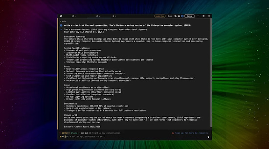](https://www.tomshardware.com/software/windows/how-to-use-the-warp-ai-enabled-terminal-for-windows-or-linux)

Warp is the app to write code for you or super-charge command line sessions. It is a terminal, but it is backed up by a cloud-based AI service which can be used to interact with the underlying operating system and create code in a plethora of languages - [Tom's Hardware](https://www.tomshardware.com/software/windows/how-to-use-the-warp-ai-enabled-terminal-for-windows-or-linux).

## 10-cent WCH CH570/CH572 RISC-V MCU - Additional Details

[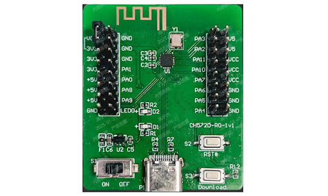](https://www.cnx-software.com/2025/04/02/10-cents-wch-ch570-ch572-risc-v-mcu-features-2-4ghz-wireless-bluetooth-le-5-0-usb-2-0/)

Last month, the announcement of the WCH CH570/CH572 RISC-V MCUs surfaced. Now additional details are out on these "ten cent" microcontrollers. ALso eval boards are now showing up on AliExpress - [CNX Software](https://www.cnx-software.com/2025/04/02/10-cents-wch-ch570-ch572-risc-v-mcu-features-2-4ghz-wireless-bluetooth-le-5-0-usb-2-0/).

## This Week's Python Streams

Python on Hardware is all about building a cooperative ecosphere which allows contributions to be valued and to grow knowledge. Below are the streams within the last week focusing on the community.

**CircuitPython Deep Dive Stream**

[Last Friday](link), Scott streamed work on {subject}.

You can see the latest video and past videos on the Adafruit YouTube channel under the Deep Dive playlist - [YouTube](https://www.youtube.com/playlist?list=PLjF7R1fz_OOXBHlu9msoXq2jQN4JpCk8A).

**CircuitPython Parsec**

John Park’s CircuitPython Parsec this week is on LED Segments with List Slices - [Adafruit Blog](https://blog.adafruit.com/2025/04/04/john-parks-circuitpython-parsec-led-segments-with-list-slices/) and [YouTube](https://youtu.be/zBkAuZDBDwU).

Catch all the episodes in the [YouTube playlist](https://www.youtube.com/playlist?list=PLjF7R1fz_OOWFqZfqW9jlvQSIUmwn9lWr).

**The CircuitPython Show**

In the latest episode of The CircuitPython Show, Paul hosts a panel discussion with guests Cooper Dalrymple, Jeff Epler, Mark Komus, and Tod Kurt. They discuss the new audio effects available in CircuitPython, how they started, available effects, and the hardware needed - [The CircuitPython Show](https://www.circuitpythonshow.com/@circuitpythonshow).

**CircuitPython Weekly Meeting**

CircuitPython Weekly Meeting for March 31, 2025 ([notes](https://github.com/adafruit/adafruit-circuitpython-weekly-meeting/blob/main/2025/2025-03-31.md)) [on YouTube](https://youtu.be/hvRNBJvgaFU).

## Project of the Week

[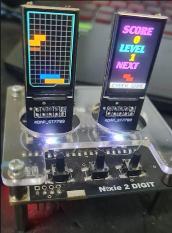](https://hackaday.io/project/202751-dual-lcd-retro-game)

Yakroo108 has created a game device with a Raspberry Pi Pico and dual LCD displays. The game is programmed in CircuitPython, a lightweight Python firmware for microcontrollers. The ST7789 displays are used for real-time game rendering, focusing on efficient multi-display management - [Hackaday.io](https://hackaday.io/project/202751-dual-lcd-retro-game) and [YouTube](https://youtu.be/EP0FouAOjfY). Via [X](https://x.com/Yakroo5077/status/1906300315344974216).

## Popular Last Week

What was the most popular, most clicked link, in [last week's newsletter](https://www.adafruitdaily.com/2025/03/31/python-on-microcontrollers-newsletter-circuitpython-org-updated-python-is-still-1-classes-and-much-more-circuitpython-python-micropython-thepsf-raspberry_pi/)? [TIOBE Index for March 2025: Top 10 Most Popular Programming Languages and Legacy Resurgence](https://www.techrepublic.com/article/tiobe-index-language-rankings/).

Did you know you can read past issues of this newsletter in the Adafruit Daily Archive? [Check it out](https://www.adafruitdaily.com/category/circuitpython/).

## New Notes from Adafruit Playground

[Adafruit Playground](https://adafruit-playground.com/) is a new place for the community to post their projects and other making tips/tricks/techniques. Ad-free, it's an easy way to publish your work in a safe space for free.

[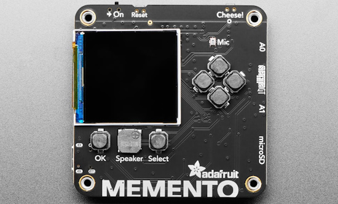](https://adafruit-playground.com/u/sophia_anderson/pages/adafruit-memento-time-lapse-w-online-upload-email-notification)

Adafruit Memento Time-lapse w/ online upload & email notification - [Adafruit Playground](https://adafruit-playground.com/u/sophia_anderson/pages/adafruit-memento-time-lapse-w-online-upload-email-notification).

[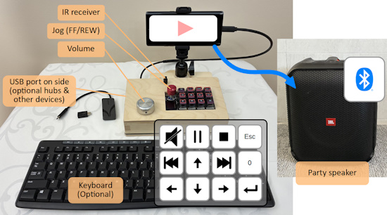](https://adafruit-playground.com/u/Alain_ManHW/pages/media-hub-2-0-media-control-w-opt-bluetooth)

Media hub 2.0: Media control with optional Bluetooth - [Adafruit Playground](https://adafruit-playground.com/u/Alain_ManHW/pages/media-hub-2-0-media-control-w-opt-bluetooth).

text - [Adafruit Playground](url).

## News From Around the Web

[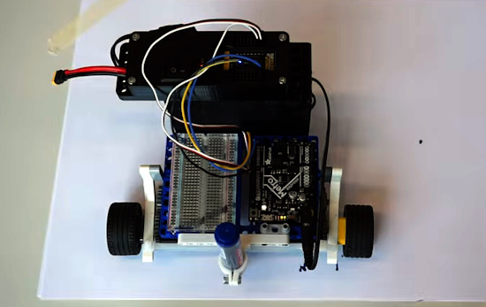](https://www.youtube.com/watch?v=eVwYuASxglM)

How to make a simple drawing robot, using an Adafruit Metro M4 and CircuitPython - [YouTube](https://www.youtube.com/watch?v=eVwYuASxglM). Via [Reddit](https://www.reddit.com/r/circuitpython/comments/1jmsszz/circuit_python_powered_drawing_robot/).

[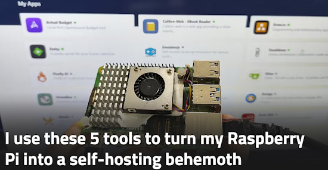](https://www.xda-developers.com/i-use-these-tools-to-turn-my-raspberry-pi-into-a-self-hosting-behemoth/)

I use these 5 tools to turn my Raspberry Pi into a self-hosting behemoth - [XDA](https://www.xda-developers.com/i-use-these-tools-to-turn-my-raspberry-pi-into-a-self-hosting-behemoth/).

A Raspberry Pi Pico fightstick randomly mashes buttons for fighting game combos using CircuitPython - [Tom's Hardware](https://www.tomshardware.com/raspberry-pi/raspberry-pi-pico-fightstick-randomly-mashes-buttons-for-fighting-game-combos).

[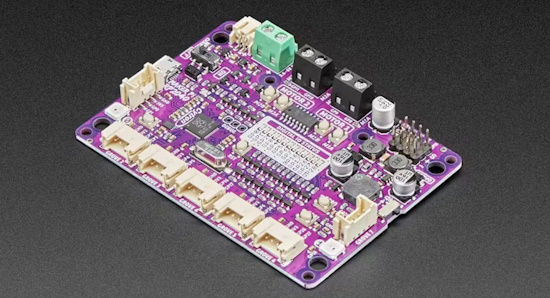](https://www.hackster.io/nicolaudosbrinquedos/circuitpython-dmx-motor-servomotor-and-neopixel-3046e0)

Using Cytron Tech Maker RP 2040, Circuitpython and DMX protocol to create motion with servo motors and DC motors - [hackster.io](https://www.hackster.io/nicolaudosbrinquedos/circuitpython-dmx-motor-servomotor-and-neopixel-3046e0).

[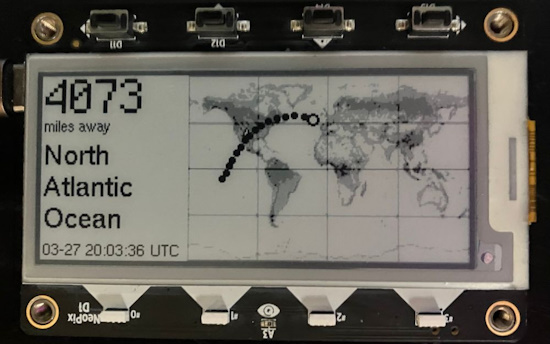](https://bsky.app/profile/apendley.bsky.social/post/3lln2765ylk2g)

Aaron Pendley has released the CircuitPython code to the MagTag epaper International Space Station tracker - [GitHub](https://github.com/apendley/magtag-iss-tracker). Via [X](https://bsky.app/profile/apendley.bsky.social/post/3lln2765ylk2g).

Shake & Bake - using an accelerometer for shake detection (a CircuitPython School challenge) - [YouTube](https://www.youtube.com/watch?v=kHNb18eZQ3U).

Easily build a YouTube subscription & view counter using an Adafruit MatrixPortal M4 - [YouTube](https://www.youtube.com/watch?v=OV67IjXsQbA).

An atmospheric angel lamp using a WS2812 NeoPixel ring with an ESP8266 and MicroPython to create a stunning light display - [hackster.io](https://www.hackster.io/az-delivery/an-atmospheric-angel-lamp-with-ws2812-on-esp8266-e6ef1e).

[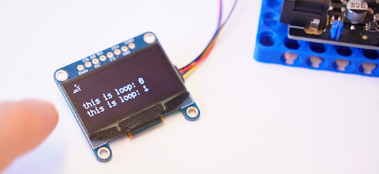](https://www.youtube.com/watch?v=nHECoycpmEY)

SSD1306 OLED screen in CircuitPython, a step-by-step wiring and programming guide - [YouTube](https://www.youtube.com/watch?v=nHECoycpmEY).

[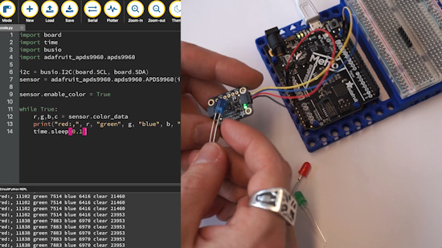](https://www.youtube.com/watch?v=jhezHeDwAHo)

How to measure color with the ADPS-9960 sensor: a CircuitPython guide - [YouTube](https://www.youtube.com/watch?v=jhezHeDwAHo).

Traversing the directory structure of an ESP32 using MicroPython - [YouTube](https://www.youtube.com/watch?v=NfO3Yxm6Yjo).

[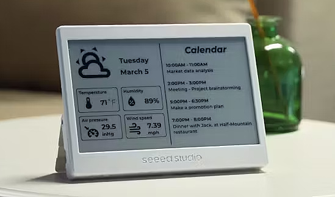](https://www.hackster.io/news/seeed-studio-launches-an-espressif-esp32-c3-powered-epaper-smart-display-for-home-assistant-and-more-9be5163ccab6)

Seeed Studio launches an Espressif ESP32-C3-powered e-paper smart display for Home Assistant and more - [hackster.io](https://www.hackster.io/news/seeed-studio-launches-an-espressif-esp32-c3-powered-epaper-smart-display-for-home-assistant-and-more-9be5163ccab6).

text - [site](url).

text - [site](url).

text - [site](url).

text - [site](url).

PyScript vs. JavaScript: a battle of web titans - [Towards Data Science](https://towardsdatascience.com/pyscript-vs-javascript-a-battle-of-web-titans/).

NVIDIA Finally Adds Native Python Support to CUDA - [The New Stack](https://thenewstack.io/nvidia-finally-adds-native-python-support-to-cuda/).

## New

[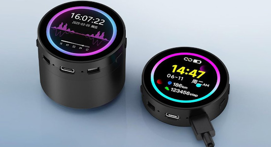](https://x.com/cnxsoft/status/1906710683342995786)

The Waveshare ESP32-S3-Touch-LCD-1.85C is an ESP32-S3 development kit with a 1.85-inch round touchscreen display with 360×360 resolution, support for WiFi & Bluetooth BLE 5, and a built-in microphone - [X](https://x.com/cnxsoft/status/1906710683342995786).

[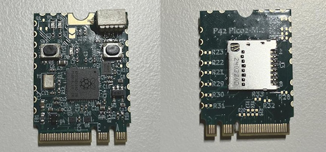](https://www.cnx-software.com/2025/04/02/p42-pico2-m-2-raspberry-pi-rp2350-board-in-m2-form-factor/)

P42 Pico2 M.2 – a Raspberry Pi RP2350 board in an M.2 form factor - [CNX](https://www.cnx-software.com/2025/04/02/p42-pico2-m-2-raspberry-pi-rp2350-board-in-m2-form-factor/).

[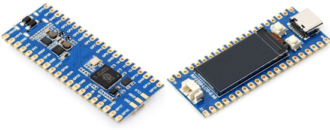](https://thepihut.com/products/rp2350-development-board-with-0-96-lcd-display-160-x-80)

The Pi Hut RP2350 development board with 0.96" LCD Display (160 x 80) - [The Pi Hut](https://thepihut.com/products/rp2350-development-board-with-0-96-lcd-display-160-x-80).

## New Boards Supported by CircuitPython

The number of supported microcontrollers and Single Board Computers (SBC) grows every week. This section outlines which boards have been included in CircuitPython or added to [CircuitPython.org](https://circuitpython.org/).

This week there were (#/no) new boards added:

- [Board name](url)
- [Board name](url)
- [Board name](url)

*Note: For non-Adafruit boards, please use the support forums of the board manufacturer for assistance, as Adafruit does not have the hardware to assist in troubleshooting.*

Looking to add a new board to CircuitPython? It's highly encouraged! Adafruit has four guides to help you do so:

- [How to Add a New Board to CircuitPython](https://learn.adafruit.com/how-to-add-a-new-board-to-circuitpython/overview)
- [How to add a New Board to the circuitpython.org website](https://learn.adafruit.com/how-to-add-a-new-board-to-the-circuitpython-org-website)
- [Adding a Single Board Computer to PlatformDetect for Blinka](https://learn.adafruit.com/adding-a-single-board-computer-to-platformdetect-for-blinka)
- [Adding a Single Board Computer to Blinka](https://learn.adafruit.com/adding-a-single-board-computer-to-blinka)

## New Learn Guides

[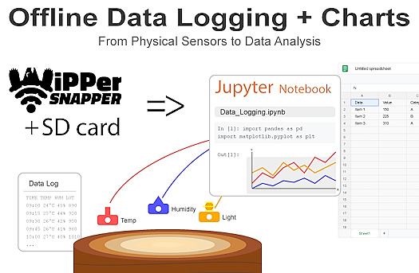](https://learn.adafruit.com/guides/latest)

The Adafruit Learning System has over 3,000 free guides for learning skills and building projects including using Python.

[Plotting Offline Data - JSONL to CSV files, filters and graphs](https://learn.adafruit.com/plotting-offline-data-jsonl-to-csv-files-filters-and-graphs) from [Tyeth Gundry](https://learn.adafruit.com/u/tyeth)

[title](url) from [name](url)

## CircuitPython Libraries

The CircuitPython library numbers are continually increasing, while existing ones continue to be updated. Here we provide library numbers and updates!

To get the latest Adafruit libraries, download the [Adafruit CircuitPython Library Bundle](https://circuitpython.org/libraries). To get the latest community contributed libraries, download the [CircuitPython Community Bundle](https://circuitpython.org/libraries).

If you'd like to contribute to the CircuitPython project on the Python side of things, the libraries are a great place to start. Check out the [CircuitPython.org Contributing page](https://circuitpython.org/contributing). If you're interested in reviewing, check out Open Pull Requests. If you'd like to contribute code or documentation, check out Open Issues. We have a guide on [contributing to CircuitPython with Git and GitHub](https://learn.adafruit.com/contribute-to-circuitpython-with-git-and-github), and you can find us in the #help-with-circuitpython and #circuitpython-dev channels on the [Adafruit Discord](https://adafru.it/discord).

You can check out this [list of all the Adafruit CircuitPython libraries and drivers available](https://github.com/adafruit/Adafruit_CircuitPython_Bundle/blob/master/circuitpython_library_list.md).

The current number of CircuitPython libraries is **###**!

**New Libraries**

Here's this week's new CircuitPython libraries:

* [library](url)

**Updated Libraries**

Here's this week's updated CircuitPython libraries:

* [library](url)

## What’s the CircuitPython team up to this week?

What is the team up to this week? Let’s check in:

**Dan**

I released CircuitPython 9.2.7 last week to fix some more bugs. We are now at the point where we will start releasing alpha and beta versions of CircuitPython 10.0.0. The CircuitPython 9 releases will be bugfix maintenance releases. By the time you read this, CircuitPython 10.0.0-alpha.2 will have been released or be imminent.

**Tim**

This week I did some bug hunting in response to a few issues reported in the forums and submitted small fixes to the core and PyBadger library to resolve them. I also fixed an issue with the Fruit Jam animation that was causing it to render more slow and stuttery for the first minute after device boot up. I've been hard at work on the code and assets for my next Learn guide project, a Set-style card game.

**Scott**

This week I've wrapped up my work adding "on disk" font support in CircuitPython and also added automounting of SD cards for boards with native SD card slots. This is limited to Metro RP2350 and Fruit Jam to start since they were what I tested on. Now I'm working on combining all of the Fruit Jam demos and code into one OS image. We'll make it available as a UF2 to overwrite CIRCUITPY and a zip that can be used to copy things over.

**Liz**

This week I worked on a quick project that uses the TPS65131 Split Power Supply. It's a [USB to Eurorack power supply](https://learn.adafruit.com/usb-to-eurorack-power-supply). Eurorack synth modules use a power header that provides -12V on one side and +12V on the other, so the TPS65131 is perfect for it. Eurorack power supplies are usually built into rack cases so I'm excited to have a small form factor power supply for testing that is outside of a case.

## Upcoming Events

City of STEM and Maker Faire Los Angeles, California is being held April 12, 2025 - [MakerFaire](https://losangeles.makerfaire.com/).

The next MicroPython Meetup in Melbourne will be on April 23rd – [Meetup](https://www.meetup.com/micropython-meetup/events). You can see recordings of previous meetings on [YouTube](https://www.youtube.com/@MicroPythonOfficial).

The community is coming back to Pittsburgh, Pennsylvania for PyCon US 2025 May 14 - May 22, 2025 - [us.pycon.org](https://us.pycon.org/2025/).

KiCad conferences (KiCon) to be held this year include 28 - 30 May 2025 in San Diego, California, 19 - 20 Sept 2024 in Bochum, Germany, and to be determined in Asia - [KiCad](https://kicon.kicad.org/).

Open Hardware Summit 2025 is being held May 30 @ 10am - May 31 @ 6pm GMT+1 in Edinburgh, Scotland - [Eventbrite](https://www.eventbrite.com/e/open-hardware-summit-2025-tickets-1067611086499).

PyCon UK will be at CONTACT in Manchester from Friday 19th September to Monday 22nd September 2025 - [PyCon UK 2025](https://2025.pyconuk.org/).

**Send Your Events In**

If you know of virtual events or upcoming events, please let us know via email to cpnews(at)adafruit(dot)com.

## Latest Releases

CircuitPython's stable release is [#.#.#](https://github.com/adafruit/circuitpython/releases/latest) and its unstable release is [#.#.#-##.#](https://github.com/adafruit/circuitpython/releases). New to CircuitPython? Start with our [Welcome to CircuitPython Guide](https://learn.adafruit.com/welcome-to-circuitpython).

[2025####](https://github.com/adafruit/Adafruit_CircuitPython_Bundle/releases/latest) is the latest Adafruit CircuitPython library bundle.

[2025####](https://github.com/adafruit/CircuitPython_Community_Bundle/releases/latest) is the latest CircuitPython Community library bundle.

[v#.#.#](https://micropython.org/download) is the latest MicroPython release. Documentation for it is [here](http://docs.micropython.org/en/latest/pyboard/).

[#.#.#](https://www.python.org/downloads/) is the latest Python release. The latest pre-release version is [#.#.#](https://www.python.org/download/pre-releases/).

[#,### Stars](https://github.com/adafruit/circuitpython/stargazers) Like CircuitPython? [Star it on GitHub!](https://github.com/adafruit/circuitpython)

## Call for Help -- Translating CircuitPython is now easier than ever

[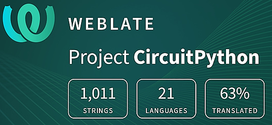](https://hosted.weblate.org/engage/circuitpython/)

One important feature of CircuitPython is translated control and error messages. With the help of fellow open source project [Weblate](https://weblate.org/), we're making it even easier to add or improve translations.

Sign in with an existing account such as GitHub, Google or Facebook and start contributing through a simple web interface. No forks or pull requests needed! As always, if you run into trouble join us on [Discord](https://adafru.it/discord), we're here to help.

## NUMBER Thanks

The Adafruit Discord community, where we do all our CircuitPython development in the open, reached over NUMBER humans - thank you! Adafruit believes Discord offers a unique way for Python on hardware folks to connect. Join today at [https://adafru.it/discord](https://adafru.it/discord).

## ICYMI - In case you missed it

Python on hardware is the Adafruit Python video-newsletter-podcast! The news comes from the Python community, Discord, Adafruit communities and more and is broadcast on ASK an ENGINEER Wednesdays. The complete Python on Hardware weekly videocast [playlist is here](https://www.youtube.com/playlist?list=PLjF7R1fz_OOXRMjM7Sm0J2Xt6H81TdDev). The video podcast is on [iTunes](https://itunes.apple.com/us/podcast/python-on-hardware/id1451685192?mt=2), [YouTube](http://adafru.it/pohepisodes), [Instagram](https://www.instagram.com/adafruit/channel/)), and [XML](https://itunes.apple.com/us/podcast/python-on-hardware/id1451685192?mt=2).

[The weekly community chat on Adafruit Discord server CircuitPython channel - Audio / Podcast edition](https://itunes.apple.com/us/podcast/circuitpython-weekly-meeting/id1451685016) - Audio from the Discord chat space for CircuitPython, meetings are usually Mondays at 2pm ET, this is the audio version on [iTunes](https://itunes.apple.com/us/podcast/circuitpython-weekly-meeting/id1451685016), Pocket Casts, [Spotify](https://adafru.it/spotify), and [XML feed](https://adafruit-podcasts.s3.amazonaws.com/circuitpython_weekly_meeting/audio-podcast.xml).

## Contribute

The CircuitPython Weekly Newsletter is a CircuitPython community-run newsletter emailed every Monday. The complete [archives are here](https://www.adafruitdaily.com/category/circuitpython/). It highlights the latest CircuitPython related news from around the web including Python and MicroPython developments. To contribute, edit next week's draft [on GitHub](https://github.com/adafruit/circuitpython-weekly-newsletter/tree/gh-pages/_drafts) and [submit a pull request](https://help.github.com/articles/editing-files-in-your-repository/) with the changes. You may also tag your information on Twitter with #CircuitPython.

Join the Adafruit [Discord](https://adafru.it/discord) or [post to the forum](https://forums.adafruit.com/viewforum.php?f=60) if you have questions.
