View this email in your browser. **Warning: Flashing Imagery**

Welcome to the latest Python on Microcontrollers newsletter! *insert 2-3 sentences from editor (what's in overview, banter)* - *Anne Barela, Editor*

We're on [Discord](https://discord.gg/HYqvREz), [Twitter/X](https://twitter.com/search?q=circuitpython&src=typed_query&f=live), [BlueSky](https://bsky.app/profile/circuitpython.org) and for past newsletters - [view them all here](https://www.adafruitdaily.com/category/circuitpython/). If you're reading this on the web, [subscribe here](https://www.adafruitdaily.com/). Here's the news this week:

## MicroPython’s New, Super Interesting Alif Ensemble Microcontrolle Port

[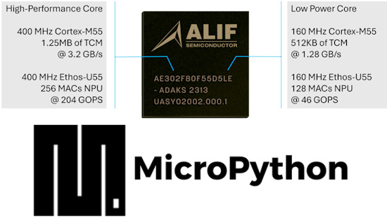](https://blog.adafruit.com/2025/04/09/micropythons-new-port-for-the-super-interesting-alif-ensemble-microcontroller/)

A few days ago, Adafruit’s Ladyada [had an interview](https://youtu.be/qlndua9yMVs) with [OpenMV](https://openmv.io/). OpenMV is releasing two new programmable AI camera modules on [Kickstarter](https://www.kickstarter.com/projects/openmv/openmv-n6-and-ae3-low-power-python-programmable-ai-cameras).

The MicroPython team has announced the [merging of support](https://github.com/micropython/micropython/pull/17050) for the [Alif](https://alifsemi.com/) Ensemble MCUs, used in OpenMV’s modules, on GitHub. The code allows MicroPython to run on Alif Express chips and the OpenMV AE3 camera board - [MicroPython GitHub](https://github.com/micropython/micropython/pull/17050). Via [Mastodon](https://fosstodon.org/@matt_trentini/114306593860376087) and the [Adafruit Blog](https://blog.adafruit.com/2025/04/09/micropythons-new-port-for-the-super-interesting-alif-ensemble-microcontroller/).

## The Python Lifecycle

[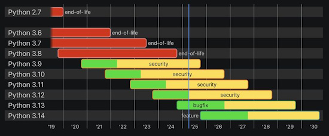](https://www.linkedin.com/posts/hugovk_python-cpython-release-activity-7315482854111555585-CbwC/)

Have you ever wondered where the Python version you're using is in it's lifecycle? The Python Developer's Guide keeps track for you to help decide when to upgrade your codebase - [Python Developer's Guide](https://devguide.python.org/versions/). Via [LinkedIn](https://www.linkedin.com/posts/hugovk_python-cpython-release-activity-7315482854111555585-CbwC/).

## Python 3.14.0a7, 3.13.3, 3.12.10, 3.11.12, 3.10.17 and 3.9.22 are Now Available

[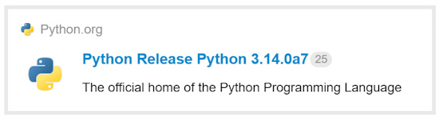](https://discuss.python.org/t/python-3-14-0a7-3-13-3-3-12-10-3-11-12-3-10-17-and-3-9-22-are-now-available/87580)

Not one, not two, not three, not four, not five, but six releases! Is this the most in a single day? 3.12-3.14 were regularly scheduled, and there were some security fixes to release in 3.9-3.11. This also marks the last bugfix release of 3.12 as it enters the security-only phase (see above) - [Python Discussion](https://discuss.python.org/t/python-3-14-0a7-3-13-3-3-12-10-3-11-12-3-10-17-and-3-9-22-are-now-available/87580).

## Linus Torvalds on the Popularity of Git

Linus Torvalds talks to It's FOSS on the popularity of Git vs. Linux - [X](https://x.com/itsfoss2/status/1909640151308906860).

## Raspberry Pi Profits Tumble By Half After Supply Shortages

[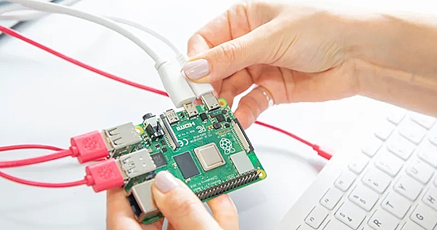](https://uk.finance.yahoo.com/news/raspberry-pi-profits-tumble-supply-081948393.html)

Raspberry Pi has revealed its profits tumbled by more-than-half in its first year as a publicly listed company after it was impacted by supply issues. But the microcomputer business saw shares lift in early trading as profits still surpassed industry forecasts - [Yahoo Finance](https://uk.finance.yahoo.com/news/raspberry-pi-profits-tumble-supply-081948393.html) and [Motley Fool UK](https://www.fool.co.uk/2025/04/02/10000-invested-in-raspberry-pi-shares-at-the-beginning-of-2025-is-now-worth/).

## Adafruit Debuts "Tariff Talk" to Provide the Latest on Industry Tariffs

Adafruit has started a segment on their Ask an Engineer weekly broadcast to discuss the tariffs unfolding worldwide and their effect on engineering/BOM and DIY project costs in the electronics industry - [Adafruit Blog](https://blog.adafruit.com/2025/04/10/tariff-talk-with-ladyada-april-10-2025-edition/) and [YouTube](https://www.youtube.com/watch?v=PQeJrAXsD0Y).

## OSHWA Hits 3,000 Open Source Hardware Certifications

[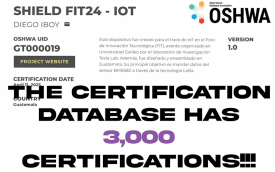](https://bsky.app/profile/oshwassociation.bsky.social/post/3lmka2ktavc22)

OSHWA announced Friday that, with UID GT000019 Shield Fit24, they have officially hit 3,000 certified open source hardware projects in their database - [BlueSky](https://bsky.app/profile/oshwassociation.bsky.social/post/3lmka2ktavc22) and [database](https://certification.oshwa.org/list.html).

807 of those (over a quarter) are from Adafruit - [OSHWA](https://certification.oshwa.org/list.html?q=adafruit).

## This Week's Python Streams

Python on Hardware is all about building a cooperative ecosphere which allows contributions to be valued and to grow knowledge. Below are the streams within the last week focusing on the community.

**CircuitPython Deep Dive Stream**

[Last Friday](https://youtube.com/live/D4_k6NP8puY), Scott streamed work on optimizing CircuitPython garbage collection.

You can see the latest video and past videos on the Adafruit YouTube channel under the Deep Dive playlist - [YouTube](https://www.youtube.com/playlist?list=PLjF7R1fz_OOXBHlu9msoXq2jQN4JpCk8A).

**CircuitPython Parsec**

John Park’s CircuitPython Parsec is off this week. Catch all the episodes in the [YouTube playlist](https://www.youtube.com/playlist?list=PLjF7R1fz_OOWFqZfqW9jlvQSIUmwn9lWr).

**The CircuitPython Show**

In the latest episode of The CircuitPython Show, Paul hosts a panel discussion with guests Cooper Dalrymple, Jeff Epler, Mark Komus, and Tod Kurt. They discuss the new audio effects available in CircuitPython, how they started, available effects, and the hardware needed - [The CircuitPython Show](https://www.circuitpythonshow.com/@circuitpythonshow)

**CircuitPython Weekly Meeting**

CircuitPython Weekly Meeting for April 7, 2025 ([notes](https://github.com/adafruit/adafruit-circuitpython-weekly-meeting/blob/main/2025/2025-04-07.md)) [on YouTube](https://youtu.be/OCrCnAvj2FU).

## Project of the Week: An Analog Synth with the Grand Central M4

[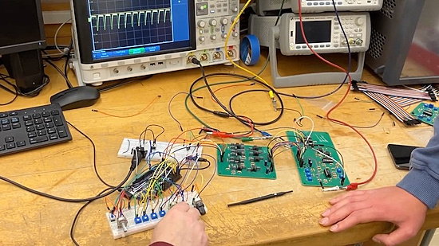](https://www.youtube.com/watch?v=seZxl1yBGKk)

An analog synthesizer controlled by Adafruit Grand Central M4 with a 3340 VCO and a 3320 VCF. Built by professor Aaron Lanterman and students in the senior design lab at Georgia Tech - [YouTube](https://www.youtube.com/watch?v=seZxl1yBGKk). Via [X](https://x.com/MicrochipMakes/status/1910691325332037916).

## Popular Last Week

What was the most popular, most clicked link, in [last week's newsletter](https://www.adafruitdaily.com/2025/04/07/python-on-microcontrollers-newsletter-no-chip-tariffs-circuitpython-10-another-esp32-p4-board-and-more-circuitpython-python-micropython-thepsf-raspberry_pi/)? [10-cent WCH CH570/CH572 RISC-V MCU features 2.4GHz wireless, Bluetooth LE 5.0, USB 2.0](https://www.cnx-software.com/2025/04/02/10-cents-wch-ch570-ch572-risc-v-mcu-features-2-4ghz-wireless-bluetooth-le-5-0-usb-2-0/).

Did you know you can read past issues of this newsletter in the Adafruit Daily Archive? [Check it out](https://www.adafruitdaily.com/category/circuitpython/).

## New Notes from Adafruit Playground

[Adafruit Playground](https://adafruit-playground.com/) is a new place for the community to post their projects and other making tips/tricks/techniques. Ad-free, it's an easy way to publish your work in a safe space for free.

[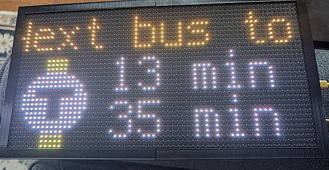](https://adafruit-playground.com/u/dufus2506/pages/boston-mbta-stop-prediction-sign)

Boston MBTA stop prediction sign - [Adafruit Playground](https://adafruit-playground.com/u/dufus2506/pages/boston-mbta-stop-prediction-sign).

## News From Around the Web

The BUSY Bar, from the makers of Flipper Zero, "a productivity multi-tool device with an LED pixel display. Focus timer with distraction blocking feature on your phone and PC. Fully customizable, open-source, and smart home ready." It has an open HTTP API, open-source SDK, Python / Go / JavaScript libs, MQTT, and no vendor lock-in - [BUSY Bar](https://busy.bar/). Via [X](https://x.com/flipper_zero/status/1910328715239645279).

[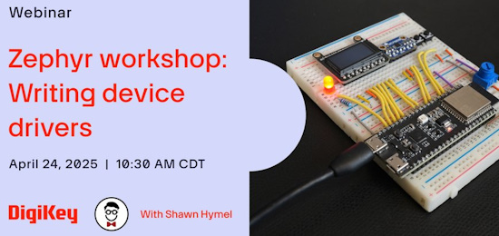](https://event.on24.com/wcc/r/4870160/B0654D058D6BC12D5A08B9607370682A?partnerref=dksocial)

Learn about writing Zephyr device drivers on April 24 with Shawn Hymel's workshop - [On24](https://event.on24.com/wcc/r/4870160/B0654D058D6BC12D5A08B9607370682A?partnerref=dksocial). Via [X](https://x.com/digikey/status/1909288586987389201).

> "Zephyr is a powerful real-time operating system (RTOS) and development framework built on the same open-source principles as Linux. It also inherits many of the same tools and concepts, such as Kconfig and the Devicetree, to help developers create truly portable code for various embedded platforms. Shawn will guide you through the process of writing an I2C temperature sensor device driver for Zephyr."

[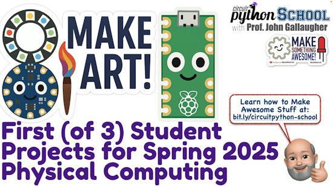](https://www.youtube.com/watch?v=u-Jj8-GV404)

Boston College Physical Computing student projects for Make Art Spring 2025 - [YouTube](https://www.youtube.com/watch?v=u-Jj8-GV404). Via [X](https://bsky.app/profile/gallaugher.bsky.social/post/3lme4dllsnk2z).

[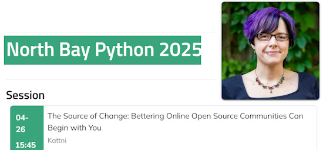](https://pretalx.northbaypython.org/nbpy-2025/talk/HTYFFA/)

CircuitPythonista Kattni Rembor will be speaking at [North Bay Python 2025](https://2025.northbaypython.org/) on April 26th in Petaluna, California. The talk is "The Source of Change: Bettering Online Open Source Communities Can Begin with You" - [North Bay Python](https://pretalx.northbaypython.org/nbpy-2025/talk/HTYFFA/), [X](https://bsky.app/profile/northbaypython.org/post/3lmfl7sxedz2t), and [Tickets](https://pretix.northbaypython.org/nbpy/nbpy-2025/). 

[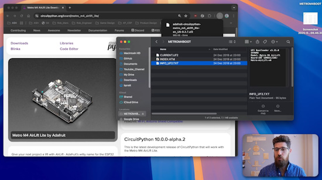](https://www.youtube.com/watch?v=7TyctYjKCgE)

Update Your CircuitPython device's bootloader: a complete guide - [YouTube](https://www.youtube.com/watch?v=7TyctYjKCgE).

Chicken Guardian - using object detection to identify and scare away predators, as well as to notify their presence with a siren. Uses a Raspberry Pi 4B and Python - [hackster.io](https://www.hackster.io/donutsorelse/chicken-guardian-scaring-off-predators-w-object-detection-59bbd4).

Using 64x64 sprites in a game, with player and wall collision detection in CircuitPython on a Raspberry Pi Pico 2 - [X](https://x.com/bobricius/status/1910616695158222961).

[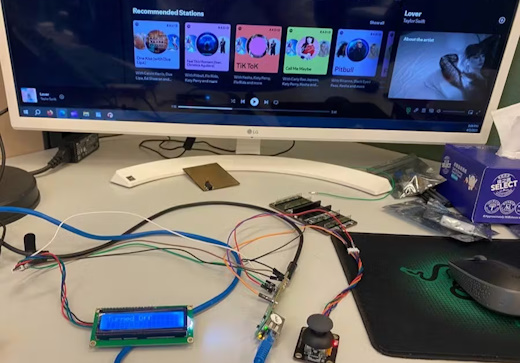](https://www.hackster.io/arnold-ho/spotify-name-displayer-with-circuitpython-and-w5100sevbpico2-b09248)

Spotify name displayer with CircuitPython and W5100SEVBPICO2 - [hackster.io](https://www.hackster.io/arnold-ho/spotify-name-displayer-with-circuitpython-and-w5100sevbpico2-b09248).

[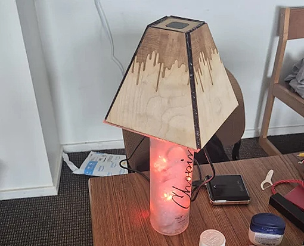](https://www.instructables.com/Tap-Lamp-With-Bluetooth/)

A touch controlled lamp using an Adafruit Circuit Playground Bluefruit and CircuitPython - [Instructables](https://www.instructables.com/Tap-Lamp-With-Bluetooth/).

[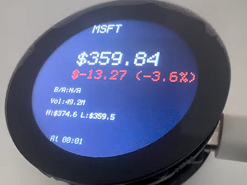](https://www.hackster.io/peter-machona/stockpulse-by-zanna-finance-2e3974)

Real-time stock information with a Xiao ESP32-S3, round LCD display and CircuitPython - [hackster.io](https://www.hackster.io/peter-machona/stockpulse-by-zanna-finance-2e3974) and [YouTube](https://youtu.be/m6xGBzeWDMY).

[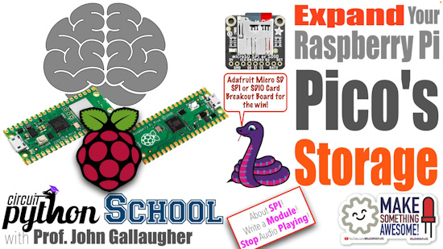](https://www.youtube.com/watch?v=Xmx_gg6WImE)

Expand Your Raspberry Pi Pico's storage by adding a microSD card reader (CircuitPython School) - [YouTube](https://www.youtube.com/watch?v=Xmx_gg6WImE).

[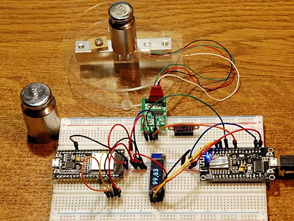](https://www.hackster.io/az-delivery/digital-scale-with-hx711-and-esp8266-esp32-in-micropython-16a6be)

A digital scale using a HX711 and ESP8266 / ESP32 in MicroPython - [hackster.io](https://www.hackster.io/az-delivery/digital-scale-with-hx711-and-esp8266-esp32-in-micropython-16a6be).

[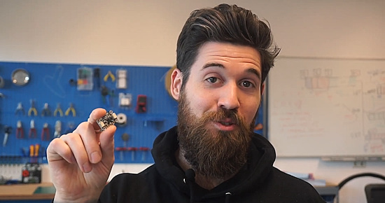](https://www.youtube.com/watch?v=ERC_cFBGCIc)

Robotics teacher Brogan M. Pratt presents Adafruit ADPS-9960 proximity mode: wiring and programming in CircuitPython - [YouTube](https://www.youtube.com/watch?v=ERC_cFBGCIc).

An ESP8266 smart watch programmed in MicroPython - [GitHub](https://github.com/aidevsurya/SmartWatchESP8266) and [YouTube](https://www.youtube.com/shorts/UHLhWEQcWJI).

[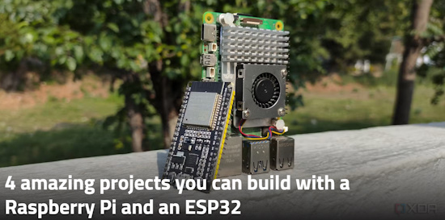](https://www.xda-developers.com/amazing-projects-you-can-build-with-a-raspberry-pi-and-an-esp32/)

4 amazing projects you can build with a Raspberry Pi and an ESP32 - [XDA](https://www.xda-developers.com/amazing-projects-you-can-build-with-a-raspberry-pi-and-an-esp32/).

A quick and dirty Python/MicroPython driver for the BH1750FVI ambient light I2C sensor - [GitHub](https://github.com/slabua/BH1750FVI-python). Via [X](https://x.com/slabua/status/1909200770626638219).

## New

The Pimoroni Presto has WiFi, Bluetooth, and a 4"-square screen. It's programmable with MicroPython and C++ - [hackster.io](https://www.hackster.io/news/pimoroni-puts-a-raspberry-pi-rp2350-on-your-desk-with-the-presto-smart-screen-0080072ccf97) and [YouTube](https://youtu.be/uRL9y_K3N9w).

[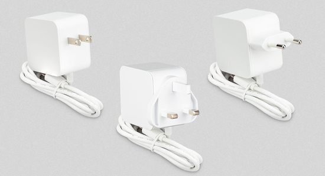](https://www.raspberrypi.com/news/raspberry-pi-45w-usb-c-power-supply-on-sale-now-at-15/)

New Raspberry Pi 45W USB-C power supply which includes a new 20V, 2.25A mode - [Raspberry Pi News](https://www.raspberrypi.com/news/raspberry-pi-45w-usb-c-power-supply-on-sale-now-at-15/).

## New Boards Supported by CircuitPython

The number of supported microcontrollers and Single Board Computers (SBC) grows every week. This section outlines which boards have been included in CircuitPython or added to [CircuitPython.org](https://circuitpython.org/).

This week there were (#/no) new boards added:

- [Board name](url)
- [Board name](url)
- [Board name](url)

*Note: For non-Adafruit boards, please use the support forums of the board manufacturer for assistance, as Adafruit does not have the hardware to assist in troubleshooting.*

Looking to add a new board to CircuitPython? It's highly encouraged! Adafruit has four guides to help you do so:

- [How to Add a New Board to CircuitPython](https://learn.adafruit.com/how-to-add-a-new-board-to-circuitpython/overview)
- [How to add a New Board to the circuitpython.org website](https://learn.adafruit.com/how-to-add-a-new-board-to-the-circuitpython-org-website)
- [Adding a Single Board Computer to PlatformDetect for Blinka](https://learn.adafruit.com/adding-a-single-board-computer-to-platformdetect-for-blinka)
- [Adding a Single Board Computer to Blinka](https://learn.adafruit.com/adding-a-single-board-computer-to-blinka)

## New Learn Guides

[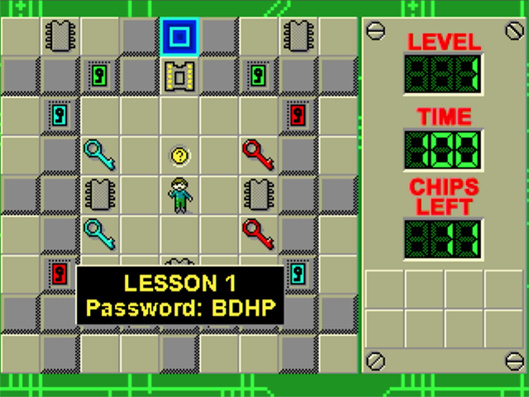](https://learn.adafruit.com/guides/latest)

The Adafruit Learning System has over 3,000 free guides for learning skills and building projects including using Python.

[Chip's Challenge on Metro RP2350](https://learn.adafruit.com/256-color-gaming-on-the-metro-rp2350) from [M. LeBlanc-Williams](https://learn.adafruit.com/u/MakerMelissa)

[Asteroid Tracker](https://learn.adafruit.com/asteroid-tracker) from [Ruiz Brothers](https://learn.adafruit.com/u/pixil3d) and [Liz Clark](https://learn.adafruit.com/u/BlitzCityDIY)

[No-Code, No-Solder Monitoring For Perfect Bread](https://learn.adafruit.com/no-code-no-solder-temperature-monitoring-with-wippersnapper-offline) from [Ben Everard](https://learn.adafruit.com/no-code-no-solder-temperature-monitoring-with-wippersnapper-offline)

## CircuitPython Libraries

The CircuitPython library numbers are continually increasing, while existing ones continue to be updated. Here we provide library numbers and updates!

To get the latest Adafruit libraries, download the [Adafruit CircuitPython Library Bundle](https://circuitpython.org/libraries). To get the latest community contributed libraries, download the [CircuitPython Community Bundle](https://circuitpython.org/libraries).

If you'd like to contribute to the CircuitPython project on the Python side of things, the libraries are a great place to start. Check out the [CircuitPython.org Contributing page](https://circuitpython.org/contributing). If you're interested in reviewing, check out Open Pull Requests. If you'd like to contribute code or documentation, check out Open Issues. We have a guide on [contributing to CircuitPython with Git and GitHub](https://learn.adafruit.com/contribute-to-circuitpython-with-git-and-github), and you can find us in the #help-with-circuitpython and #circuitpython-dev channels on the [Adafruit Discord](https://adafru.it/discord).

You can check out this [list of all the Adafruit CircuitPython libraries and drivers available](https://github.com/adafruit/Adafruit_CircuitPython_Bundle/blob/master/circuitpython_library_list.md). 

The current number of CircuitPython libraries is **###**!

**New Libraries**

Here's this week's new CircuitPython libraries:

* [library](url)

**Updated Libraries**

Here's this week's updated CircuitPython libraries:

* [library](url)

## What’s the CircuitPython team up to this week?

What is the team up to this week? Let’s check in:

**Dan**

I released CircuitPython 10.0.0-alpha.2 at the end of the week before last. Library bundles for 10.x are now being built, but note that the .mpy files for 9.x and 10.x are compatible.

I worked on an issue with the SAMD UF2 bootloader not showing up on recently updated Chromebooks, after years of working properly. Unfortunately I could not come up with a fix and have submitted a ChromeOS bug report.

**Tim**

I fixed a few infrastructure issues this week in the CST8XX library and `circuitpython-build-tools` utility. I did another batch of Learn guide page updates to change from `secrets.py` to `settings.toml` to match PRs submitted by Justin, a community member whose been graciously helping with the process of changing the code. I've begun working on the guide pages for my next Learn guide, which features a game called Match3 inspired by the Set card game.

**Scott**

At the end of last week, I was fixing up USB on the Fruit Jam. We'd had a couple small things that broke USB host. After getting that fixed up, I've been working to compile all of the Fruit Jam examples into an "OS" image that includes a launcher to switch between apps. I'm adding two features to make this work better. Lastly, I've been looking at the Fruit Jam animation to optimize its performance. I found a couple things and it's looking and sounding much better. The audio playback tickled a bug with DMAing out of PSRAM. So, I've tweaked how memory is allocated internally to avoid it.

## Upcoming Events

The next MicroPython Meetup in Melbourne will be on April 23rd – [Meetup](https://www.meetup.com/micropython-meetup/events). You can see recordings of previous meetings on [YouTube](https://www.youtube.com/@MicroPythonOfficial). 

The community is coming back to Pittsburgh, Pennsylvania for PyCon US 2025 May 14 - May 22, 2025 - [us.pycon.org](https://us.pycon.org/2025/).

KiCad conferences (KiCon) to be held this year include 28 - 30 May 2025 in San Diego, California, 19 - 20 Sept 2024 in Bochum, Germany, and to be determined in Asia - [KiCad](https://kicon.kicad.org/).

Open Hardware Summit 2025 is being held May 30 @ 10am - May 31 @ 6pm GMT+1 in Edinburgh, Scotland - [Eventbrite](https://www.eventbrite.com/e/open-hardware-summit-2025-tickets-1067611086499).

PyOhio 2025 will be held Saturday & Sunday July 26 & 27, 2025 at the Cleveland State University Student Center in Cleveland, Ohio - [PyOhio 2025](https://www.pyohio.org/2025/).

PyCon UK will be at CONTACT in Manchester from Friday 19th September to Monday 22nd September 2025 - [PyCon UK 2025](https://2025.pyconuk.org/).

**Send Your Events In**

If you know of virtual events or upcoming events, please let us know via email to cpnews(at)adafruit(dot)com.

## Latest Releases

CircuitPython's stable release is [#.#.#](https://github.com/adafruit/circuitpython/releases/latest) and its unstable release is [#.#.#-##.#](https://github.com/adafruit/circuitpython/releases). New to CircuitPython? Start with our [Welcome to CircuitPython Guide](https://learn.adafruit.com/welcome-to-circuitpython).

[2025####](https://github.com/adafruit/Adafruit_CircuitPython_Bundle/releases/latest) is the latest Adafruit CircuitPython library bundle.

[2025####](https://github.com/adafruit/CircuitPython_Community_Bundle/releases/latest) is the latest CircuitPython Community library bundle.

[v#.#.#](https://micropython.org/download) is the latest MicroPython release. Documentation for it is [here](http://docs.micropython.org/en/latest/pyboard/).

[#.#.#](https://www.python.org/downloads/) is the latest Python release. The latest pre-release version is [#.#.#](https://www.python.org/download/pre-releases/).

[#,### Stars](https://github.com/adafruit/circuitpython/stargazers) Like CircuitPython? [Star it on GitHub!](https://github.com/adafruit/circuitpython)

## Call for Help -- Translating CircuitPython is now easier than ever

[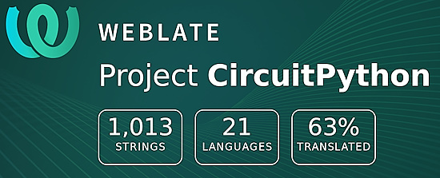](https://hosted.weblate.org/engage/circuitpython/)

One important feature of CircuitPython is translated control and error messages. With the help of fellow open source project [Weblate](https://weblate.org/), we're making it even easier to add or improve translations. 

Sign in with an existing account such as GitHub, Google or Facebook and start contributing through a simple web interface. No forks or pull requests needed! As always, if you run into trouble join us on [Discord](https://adafru.it/discord), we're here to help.

## 38,918 Thanks

The Adafruit Discord community, where we do all our CircuitPython development in the open, reached over 38,918 humans - thank you! Adafruit believes Discord offers a unique way for Python on hardware folks to connect. Join today at [https://adafru.it/discord](https://adafru.it/discord).

## ICYMI - In case you missed it

Python on hardware is the Adafruit Python video-newsletter-podcast! The news comes from the Python community, Discord, Adafruit communities and more and is broadcast on ASK an ENGINEER Wednesdays. The complete Python on Hardware weekly videocast [playlist is here](https://www.youtube.com/playlist?list=PLjF7R1fz_OOXRMjM7Sm0J2Xt6H81TdDev). The video podcast is on [iTunes](https://itunes.apple.com/us/podcast/python-on-hardware/id1451685192?mt=2), [YouTube](http://adafru.it/pohepisodes), [Instagram](https://www.instagram.com/adafruit/channel/)), and [XML](https://itunes.apple.com/us/podcast/python-on-hardware/id1451685192?mt=2).

[The weekly community chat on Adafruit Discord server CircuitPython channel - Audio / Podcast edition](https://itunes.apple.com/us/podcast/circuitpython-weekly-meeting/id1451685016) - Audio from the Discord chat space for CircuitPython, meetings are usually Mondays at 2pm ET, this is the audio version on [iTunes](https://itunes.apple.com/us/podcast/circuitpython-weekly-meeting/id1451685016), Pocket Casts, [Spotify](https://adafru.it/spotify), and [XML feed](https://adafruit-podcasts.s3.amazonaws.com/circuitpython_weekly_meeting/audio-podcast.xml).

## Contribute

The CircuitPython Weekly Newsletter is a CircuitPython community-run newsletter emailed every Monday. The complete [archives are here](https://www.adafruitdaily.com/category/circuitpython/). It highlights the latest CircuitPython related news from around the web including Python and MicroPython developments. To contribute, edit next week's draft [on GitHub](https://github.com/adafruit/circuitpython-weekly-newsletter/tree/gh-pages/_drafts) and [submit a pull request](https://help.github.com/articles/editing-files-in-your-repository/) with the changes. You may also tag your information on Twitter with #CircuitPython. 

Join the Adafruit [Discord](https://adafru.it/discord) or [post to the forum](https://forums.adafruit.com/viewforum.php?f=60) if you have questions.
