- [ ] Library and info updates
- [ ] change date
- [ ] update title
- [ ] Feature story
- [ ] Update  for images
- [ ] Update ICYDNCI
- [ ] All images 550w max only
- [ ] Link "View this email in your browser."

News Sources

- [Adafruit Playground](https://adafruit-playground.com/)
- Twitter: [CircuitPython](https://twitter.com/search?q=circuitpython&src=typed_query&f=live), [MicroPython](https://twitter.com/search?q=micropython&src=typed_query&f=live) and [Python](https://twitter.com/search?q=python&src=typed_query)
- [Raspberry Pi News](https://www.raspberrypi.com/news/)
- Mastodon [CircuitPython](https://octodon.social/tags/CircuitPython) and [MicroPython](https://octodon.social/tags/MicroPython)
- [hackster.io CircuitPython](https://www.hackster.io/search?q=circuitpython&i=projects&sort_by=most_recent) and [MicroPython](https://www.hackster.io/search?q=micropython&i=projects&sort_by=most_recent)
- YouTube: [CircuitPython](https://www.youtube.com/results?search_query=circuitpython&sp=CAI%253D), [MicroPython](https://www.youtube.com/results?search_query=micropython&sp=CAI%253D), [Prof Gallaugher](https://www.youtube.com/@BuildWithProfG/videos), [Teacher Brogan M. Pratt CircuitPython](https://www.youtube.com/playlist?list=PLRHdgFNRLyaN6eCw8b0yoHKDY9B4GiirU), [Teacher Brogan M. Pratt CircuitPython search](https://www.youtube.com/@BroganMPratt/search?query=circuitpython)
- Instructables: [CircuitPython](https://www.instructables.com/search/?q=circuitpython&projects=all&sort=Newest), [MicroPython](https://www.instructables.com/search/?q=micropython&projects=all&sort=Newest), [Raspberry Pi Python](https://www.instructables.com/search/?q=raspberry+pi+python&projects=all&sort=Newest)
- [hackaday CircuitPython](https://hackaday.com/blog/?s=circuitpython) and [MicroPython](https://hackaday.com/blog/?s=micropython)
- [python.org](https://www.python.org/)
- [Python Insider - dev team blog](https://pythoninsider.blogspot.com/)
- Individuals: [Jeff Geerling](https://www.jeffgeerling.com/blog), [Yakroo](https://x.com/Yakroo5077)
- Tom's Hardware: [CircuitPython](https://www.tomshardware.com/search?searchTerm=circuitpython&articleType=all&sortBy=publishedDate) and [MicroPython](https://www.tomshardware.com/search?searchTerm=micropython&articleType=all&sortBy=publishedDate) and [Raspberry Pi](https://www.tomshardware.com/search?searchTerm=raspberry%20pi&articleType=all&sortBy=publishedDate)
- [hackaday.io newest projects MicroPython](https://hackaday.io/projects?tag=micropython&sort=date) and [CircuitPython](https://hackaday.io/projects?tag=circuitpython&sort=date)
- [Google News Python](https://news.google.com/topics/CAAqIQgKIhtDQkFTRGdvSUwyMHZNRFY2TVY4U0FtVnVLQUFQAQ?hl=en-US&gl=US&ceid=US%3Aen)
- hackaday.io - [CircuitPython](https://hackaday.io/search?term=circuitpython) and [MicroPython](https://hackaday.io/search?term=micropython)

View this email in your browser. **Warning: Flashing Imagery**

Welcome to the latest Python on Microcontrollers newsletter! *insert 2-3 sentences from editor (what's in overview, banter)* - *Anne Barela, Editor*

We're on [Discord](https://discord.gg/HYqvREz), [Twitter/X](https://twitter.com/search?q=circuitpython&src=typed_query&f=live), [BlueSky](https://bsky.app/profile/circuitpython.org) and for past newsletters - [view them all here](https://www.adafruitdaily.com/category/circuitpython/). If you're reading this on the web, [subscribe here](https://www.adafruitdaily.com/). Here's the news this week:

## MicroPython v1.25.0 Released!

[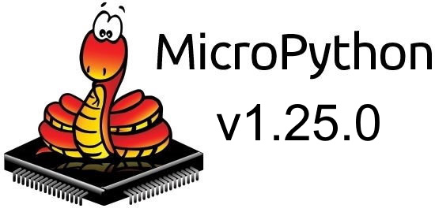](https://github.com/micropython/micropython/releases)

MicroPython v1.25.0 has been released after more than three years of development. Significant improvements include ROMFS, an Alif port, a RISC-V inline assembler, Datagram TLS (DTLS), mpremote recursive remove and much more. The ESP32 port now supports IDF v5.3 and v5.4, and support for versions below v5.2.0 has been dropped. The rp2 port sees the introduction of many new RP2350 boards, including the Pico 2 W, as well as support for PSRAM with size autodetection. WPA3 is now supported on the Pico W and Pico 2 W in both AP and STA modes - [GitHub](https://github.com/micropython/micropython/releases).

## Feature

text - [site](url).

## Interesting Books (for free)

One of the most popular items in the newsletter is when books related to programming and microcontrollers are made available for free by their authors or publishers. This week there are three, one very relevant, one handy, one reference. Many microcontrollers running Python use Arm Cortex-M chips (Raspberry Pi RP2xxx, Microchip SAMD, etc.). A book on these chips would seem useful. A book on C, which we must use at times rather than Python on embedded systems, looks good. The final one is a textbook for your reference shelf.

[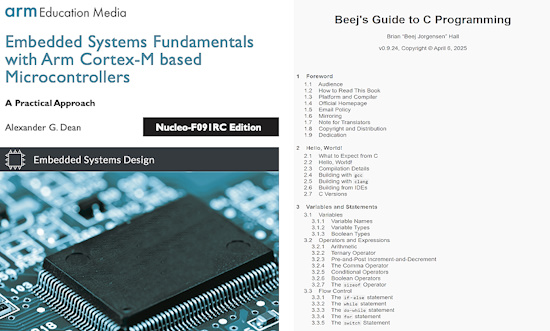](https://github.com/arm-university/Embedded-Systems-Fundamentals/)

*Embedded Systems Fundamentals with Arm Cortex-M based Microcontrollers* gives an understanding of the most important topics in embedded systems design using a coherent, compelling and hands-on approach - [GitHub](https://github.com/arm-university/Embedded-Systems-Fundamentals/) (PDF).

*Beej's Guide to C Programming* - "What we’ll try to do over the course of this guide is lead you from complete and utter sheer lost confusion on to the sort of enlightened bliss that can only be obtained through pure C programming" - [beej.us](https://beej.us/guide/bgc/html/split/index.html) (HTML).

*Mathematics for Computer Science* from MIT Press explains how to use mathematical models and methods to analyze problems that arise in computer science - [mit.edu](https://courses.csail.mit.edu/6.042/spring18/mcs.pdf) (PDF).

## Ubuntu 25.04 'Plucky Puffin' Is Out

[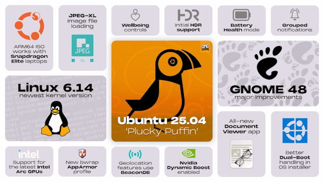](url)

Ubuntu 25.04 is the latest version of the Ubuntu operating system for desktop PCs and laptops  - [Ubuntu](https://ubuntu.com/download/desktop) and [Release Notes](https://discourse.ubuntu.com/t/plucky-puffin-release-notes/48687). Via [X](https://x.com/omgubuntu/status/1912795977959752148).

**Some of What's New**

- Linux Kernel 6.14 with support for the latest hardware
- GNOME 48 desktop environment with new Preserve battery mode and Wellbeing panel
- Papers as its default new PDF reader
- BeaconDB as its new geolocation provider
- Enhanced installer with improved encryption options and interaction with BitLocker Windows installations

## Building A Raspberry Pi Elevator

BorisDigital on YouTube has constructed an elevator control system for a 3 floor building using hydraulic lift. The system is controlled via a Raspberry Pi 4B and call panel boards run on a Raspberry Pi Pico 2 W. Programming is in Python and the buttons are from Adafruit - [YouTube](https://www.youtube.com/watch?v=eTpAalJFUlY). Via [hackster.io](https://www.hackster.io/news/love-elevators-you-can-simulate-an-elevator-control-system-with-a-raspberry-pi-ec605fd824c0).

## W6300 — WIZnet’s Fastest SPI Ethernet Chip Yet

[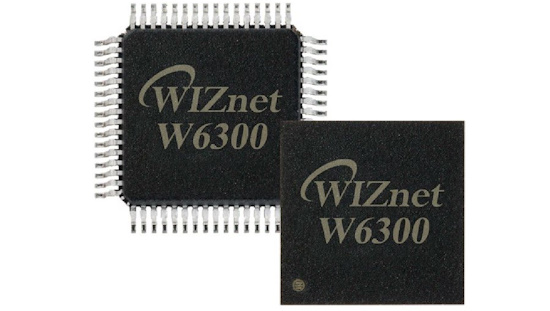](https://mailchi.mp/wiznet/wiznet-newsletter-april-2025)

WIZnet has launched the W6300 Ethernet chip. It has support for both IPv4 and IPv6, 90Mbps throughput, 8 sockets and runs on an 80 MHz QSPI bus - [WIZnet Newsletter](https://mailchi.mp/wiznet/wiznet-newsletter-april-2025). Via [X](https://x.com/cnxsoft/status/1911777560884920372).

## Introduction to Zephyr Part 7: Debugging with OpenOCD and GDB

Debugging embedded systems can be challenging, but it's essential for identifying and resolving issues in both software and hardware. In the latest tutorial, Shawn demonstrates how to debug an ESP32 running the Zephyr RTOS using OpenOCD and GDB - [YouTube](https://www.youtube.com/watch?v=XGTtMYa7IiM). Via [X](https://x.com/ShawnHymel/status/1912877059371909502).

## This Week's Python Streams

Python on Hardware is all about building a cooperative ecosphere which allows contributions to be valued and to grow knowledge. Below are the streams within the last week focusing on the community.

**CircuitPython Deep Dive Stream**

[Last Friday](link), Scott streamed work on {subject}.

You can see the latest video and past videos on the Adafruit YouTube channel under the Deep Dive playlist - [YouTube](https://www.youtube.com/playlist?list=PLjF7R1fz_OOXBHlu9msoXq2jQN4JpCk8A).

**CircuitPython Parsec**

John Park’s CircuitPython Parsec this week is on {subject} - [Adafruit Blog](link) and [YouTube](link).

Catch all the episodes in the [YouTube playlist](https://www.youtube.com/playlist?list=PLjF7R1fz_OOWFqZfqW9jlvQSIUmwn9lWr).

**The CircuitPython Show**

Tim Cocks, better known as foamyguy in the Adafruit community, joins the latest episode and shares his experiences in designing games for CircuitPython. Tim and Paul also discuss some recent games Tim has worked on - [The CircuitPython Show](https://www.circuitpythonshow.com/@circuitpythonshow).

**CircuitPython Weekly Meeting**

CircuitPython Weekly Meeting for April 14, 2025 ([notes](https://github.com/adafruit/adafruit-circuitpython-weekly-meeting/blob/main/2025/2025-04-14.md)) [on YouTube](https://youtu.be/p0AghPEIhkQ).

## Project of the Week: The MintyPiPico Gaming Devive - PCB Edition

MintyPiPico is a super tiny handheld clamshell device inspired by the Minty Pi Altoids tin video game, but it uses the RP2040 Zero, CircuitPython, and an even smaller Altoids Smalls tin. It has an almost instant power-on, and can play NES and Gameboy games - [Adafruit Blog](https://blog.adafruit.com/2025/04/15/the-mintypipico-tiny-video-game-rp2040-raspberrypi-circuitpython/), [hackster.io](https://www.hackster.io/MrRobotElectronics/mintypipico-tiny-video-game-pcb-version-d8e946) and [YouTube](https://youtu.be/_jK9sibcf8c).

## Popular Last Week

What was the most popular, most clicked link, in [last week's newsletter](https://www.adafruitdaily.com/2025/04/14/python-on-microcontrollers-newsletter-micropython-comes-to-alif-tariff-talk-python-lifecycle-and-much-more-circuitpython-python-micropython-thepsf-raspberry_pi/)? [BUSY Bar](https://busy.bar/).

Did you know you can read past issues of this newsletter in the Adafruit Daily Archive? [Check it out](https://www.adafruitdaily.com/category/circuitpython/).

## New Notes from Adafruit Playground

[Adafruit Playground](https://adafruit-playground.com/) is a new place for the community to post their projects and other making tips/tricks/techniques. Ad-free, it's an easy way to publish your work in a safe space for free.

text - [Adafruit Playground](url).

text - [Adafruit Playground](url).

text - [Adafruit Playground](url).

## News From Around the Web

[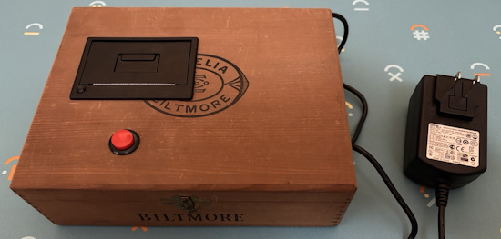](https://github.com/fatveg/pi-pico-ticket-game)

The Pi Pico Ticket Game uses a thermal printer, Raspberry Pi Pico, and MicroPython to automatically quiz users - [GitHub](https://github.com/fatveg/pi-pico-ticket-game). Via [Raspberry Pi Magazine](https://magazine.raspberrypi.com/articles/raspberry-pi-pico-ticket-game).

[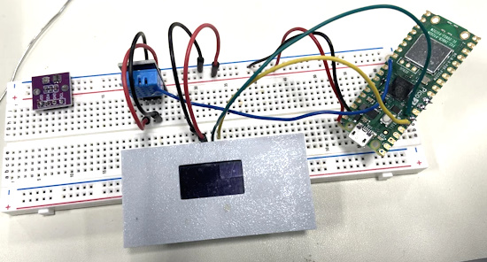](https://www.instructables.com/Pico-Thermostat-Display/)

A Raspberry Pi Pico thermostat with display, made with MicroPython - [Instructables](https://www.instructables.com/Pico-Thermostat-Display/).

7 reasons I regret not buying a Raspberry Pi sooner - [XDA](https://www.xda-developers.com/reasons-regret-not-buying-raspberry-pi-sooner/).

[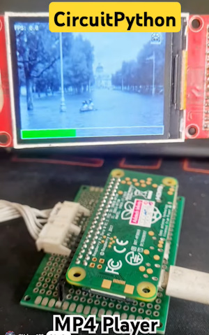](https://www.youtube.com/shorts/BUj7DpVeqVk)

An MP4 video player using a Raspberry Pi Zero W, an LCD screen and CircuitPython - [YouTube](https://www.youtube.com/shorts/BUj7DpVeqVk).

[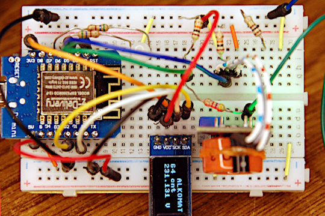](https://www.instructables.com/Alkomat-Alcohol-Tester-With-ESP8266-and-MQ-3-in-Mi/)

Alkomat, an alcohol tester with ESP8266 and a MQ-3 running MicroPython - [Instructables](https://www.instructables.com/Alkomat-Alcohol-Tester-With-ESP8266-and-MQ-3-in-Mi/).

text - [site](url).

text - [site](url).

[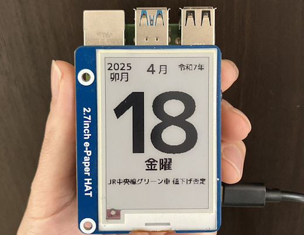](https://x.com/sozoraemon/status/1913191181401596044)

A "tear-off style" calendar made with Raspberry Pi, Python and an e-paper display - [X](https://x.com/sozoraemon/status/1913191181401596044).

text - [site](url).

text - [site](url).

text - [site](url).

text - [site](url).

text - [site](url).

7 “Useless” Python Standard Library functions you should know - [KDnuggets](https://www.kdnuggets.com/7-useless-python-standard-library-functions-you-should-know).

[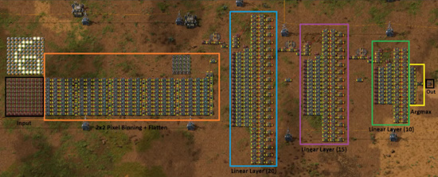](https://old.reddit.com/r/factorio/comments/1jzlin2/neural_network_in_factorio_handwritten_digit/)

Creating a neural network in Factorio to recognize handwritten digit recognition. trained in PyTorch - [Reddit](https://old.reddit.com/r/factorio/comments/1jzlin2/neural_network_in_factorio_handwritten_digit/).

text - [site](url).

text - [site](url).

text - [site](url).

## New

LILYGO launches the new T-Pico RP2350, with a Raspberry Pi RP2350A and an Espressif ESP32-C6 - [hackster.io](https://www.hackster.io/news/lilygo-launches-a-new-t-pico-now-featuring-the-raspberry-pi-rp2350a-and-espressif-esp32-c6-9490a0ccc6f5), [CNX Software](https://www.cnx-software.com/2025/04/11/t-pico-2350-is-a-fully-integrated-devkit-with-raspberry-pi-rp2350-esp32-c6-2-33-inch-color-touchscreen-display-and-hdmi-video-output/), and [GitHub](https://github.com/Xinyuan-LilyGO/Lilygo-T-Pico2).

[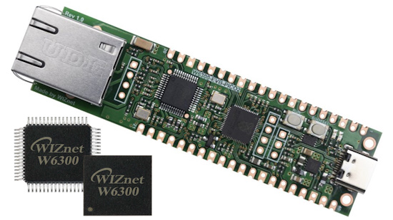](https://www.cnx-software.com/2025/04/14/w6300-evb-pico2-board-combines-rp2350-mcu-with-wiznet-w6300-qspi-ethernet-controller-for-80-mbps-speeds/)

W6300-EVB-Pico2 board combines RP2350 MCU with WIZnet W6300 QSPI Ethernet controller for 80+ Mbps data rate - [CNX Software](https://www.cnx-software.com/2025/04/14/w6300-evb-pico2-board-combines-rp2350-mcu-with-wiznet-w6300-qspi-ethernet-controller-for-80-mbps-speeds/). Via [X](https://x.com/cnxsoft/status/1911777560884920372).

text - [site](url).

## New Boards Supported by CircuitPython

The number of supported microcontrollers and Single Board Computers (SBC) grows every week. This section outlines which boards have been included in CircuitPython or added to [CircuitPython.org](https://circuitpython.org/).

This week there were (#/no) new boards added:

- [Board name](url)
- [Board name](url)
- [Board name](url)

*Note: For non-Adafruit boards, please use the support forums of the board manufacturer for assistance, as Adafruit does not have the hardware to assist in troubleshooting.*

Looking to add a new board to CircuitPython? It's highly encouraged! Adafruit has four guides to help you do so:

- [How to Add a New Board to CircuitPython](https://learn.adafruit.com/how-to-add-a-new-board-to-circuitpython/overview)
- [How to add a New Board to the circuitpython.org website](https://learn.adafruit.com/how-to-add-a-new-board-to-the-circuitpython-org-website)
- [Adding a Single Board Computer to PlatformDetect for Blinka](https://learn.adafruit.com/adding-a-single-board-computer-to-platformdetect-for-blinka)
- [Adding a Single Board Computer to Blinka](https://learn.adafruit.com/adding-a-single-board-computer-to-blinka)

## New Learn Guide

[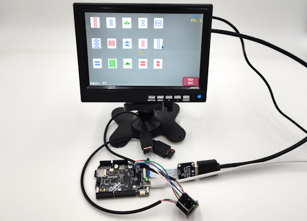](https://learn.adafruit.com/guides/latest)

The Adafruit Learning System has over 3,000 free guides for learning skills and building projects including using Python.

[Match3 Game on the Adafruit Metro RP2350](https://learn.adafruit.com/match3-game-on-metro-rp2350) from [Tim C](https://learn.adafruit.com/u/Foamyguy)

## CircuitPython Libraries

The CircuitPython library numbers are continually increasing, while existing ones continue to be updated. Here we provide library numbers and updates!

To get the latest Adafruit libraries, download the [Adafruit CircuitPython Library Bundle](https://circuitpython.org/libraries). To get the latest community contributed libraries, download the [CircuitPython Community Bundle](https://circuitpython.org/libraries).

If you'd like to contribute to the CircuitPython project on the Python side of things, the libraries are a great place to start. Check out the [CircuitPython.org Contributing page](https://circuitpython.org/contributing). If you're interested in reviewing, check out Open Pull Requests. If you'd like to contribute code or documentation, check out Open Issues. We have a guide on [contributing to CircuitPython with Git and GitHub](https://learn.adafruit.com/contribute-to-circuitpython-with-git-and-github), and you can find us in the #help-with-circuitpython and #circuitpython-dev channels on the [Adafruit Discord](https://adafru.it/discord).

You can check out this [list of all the Adafruit CircuitPython libraries and drivers available](https://github.com/adafruit/Adafruit_CircuitPython_Bundle/blob/master/circuitpython_library_list.md). 

The current number of CircuitPython libraries is **###**!

**New Libraries**

Here's this week's new CircuitPython libraries:

* [library](url)

**Updated Libraries**

Here's this week's updated CircuitPython libraries:

* [library](url)

## What’s the CircuitPython team up to this week?

What is the team up to this week? Let’s check in:

**Dan**

I fixed a problem with reversed I2S stereo channels on RP2xxxx boards, and also did some minor updates of asyncio support.

I'm also working on supporting WiFi power-saving modes on Espressif boards. I'm harmonizing existing similar support on Pico W into a single API.

Finally, I've been making the changes needed for a larger firmware partition on 4MB Espressif boards. This makes room for BLE support on these boards. Thach is updating the UF2 bootloader on ESP32-S2 and ESP32-S3 to change the partition table it provides. I will document how to do this upgrade on a single board, and then extend that to all other 4MB boards.

**Tim**

I wrapped up the Match3 game guide this week and it is now live. I've also been working on a guide that details the usage of the USB SNES-like controller that is in the Adafruit shop with CircuitPython and Arduino. I've also started working on a similar guide for the USB mouse that is in the shop as well. In my free time, I've been working on implementing `bitmaptools` for `Blinka_Displayio` and it's led me to take a closer look at the documentation and behavior of some of the functions in that module under core CircuitPython and I found a few issues that I submitted fixes for.

**Scott**

This week I've continued working on improving CircuitPython current working directory support to help the Fruit Jam launcher.

I've also greatly improved the garbage collection time by having memory opted into pointer collection. Pointer collection ensures memory isn't freed when in use. However, it requires scanning a whole allocation for other pointers into the heap. This is expensive on PSRAM and isn't necessary for many large allocations such as audio buffers and bitmaps. So, we improve collect times by storing whether an allocation needs to be scanned.

**Liz**

At the end of last week, I was out for a long weekend visiting my mother-in-law. It was a great trip and now I'm ready to get back to work. Before I left, I worked on code for the [Asteroid Tracker project](https://learn.adafruit.com/asteroid-tracker). This project uses a QT Py ESP32-S3 and a round display to show data from two NASA APIs that track close approach objects. To make the project more visually interesting, I made a small asteroid graphic and added code to have it fly diagonally across the screen every few seconds.

## Upcoming Events

The next MicroPython Meetup in Melbourne will be on April 23rd – [Meetup](https://www.meetup.com/micropython-meetup/events). You can see recordings of previous meetings on [YouTube](https://www.youtube.com/@MicroPythonOfficial). 

The community is coming back to Pittsburgh, Pennsylvania for PyCon US 2025 May 14 - May 22, 2025 - [us.pycon.org](https://us.pycon.org/2025/).

KiCad conferences (KiCon) to be held this year include 28 - 30 May 2025 in San Diego, California, 19 - 20 Sept 2024 in Bochum, Germany, and to be determined in Asia - [KiCad](https://kicon.kicad.org/).

Open Hardware Summit 2025 is being held May 30 @ 10am - May 31 @ 6pm GMT+1 in Edinburgh, Scotland - [Eventbrite](https://www.eventbrite.com/e/open-hardware-summit-2025-tickets-1067611086499).

PyOhio 2025 will be held Saturday & Sunday July 26 & 27, 2025 at the Cleveland State University Student Center in Cleveland, Ohio - [PyOhio 2025](https://www.pyohio.org/2025/).

PyCon UK will be at CONTACT in Manchester from Friday 19th September to Monday 22nd September 2025 - [PyCon UK 2025](https://2025.pyconuk.org/).

**Send Your Events In**

If you know of virtual events or upcoming events, please let us know via email to cpnews(at)adafruit(dot)com.

## Latest Releases

CircuitPython's stable release is [#.#.#](https://github.com/adafruit/circuitpython/releases/latest) and its unstable release is [#.#.#-##.#](https://github.com/adafruit/circuitpython/releases). New to CircuitPython? Start with our [Welcome to CircuitPython Guide](https://learn.adafruit.com/welcome-to-circuitpython).

[2025####](https://github.com/adafruit/Adafruit_CircuitPython_Bundle/releases/latest) is the latest Adafruit CircuitPython library bundle.

[2025####](https://github.com/adafruit/CircuitPython_Community_Bundle/releases/latest) is the latest CircuitPython Community library bundle.

[v#.#.#](https://micropython.org/download) is the latest MicroPython release. Documentation for it is [here](http://docs.micropython.org/en/latest/pyboard/).

[#.#.#](https://www.python.org/downloads/) is the latest Python release. The latest pre-release version is [#.#.#](https://www.python.org/download/pre-releases/).

[#,### Stars](https://github.com/adafruit/circuitpython/stargazers) Like CircuitPython? [Star it on GitHub!](https://github.com/adafruit/circuitpython)

## Call for Help -- Translating CircuitPython is now easier than ever

[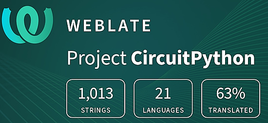](https://hosted.weblate.org/engage/circuitpython/)

One important feature of CircuitPython is translated control and error messages. With the help of fellow open source project [Weblate](https://weblate.org/), we're making it even easier to add or improve translations. 

Sign in with an existing account such as GitHub, Google or Facebook and start contributing through a simple web interface. No forks or pull requests needed! As always, if you run into trouble join us on [Discord](https://adafru.it/discord), we're here to help.

## NUMBER Thanks

The Adafruit Discord community, where we do all our CircuitPython development in the open, reached over NUMBER humans - thank you! Adafruit believes Discord offers a unique way for Python on hardware folks to connect. Join today at [https://adafru.it/discord](https://adafru.it/discord).

## ICYMI - In case you missed it

Python on hardware is the Adafruit Python video-newsletter-podcast! The news comes from the Python community, Discord, Adafruit communities and more and is broadcast on ASK an ENGINEER Wednesdays. The complete Python on Hardware weekly videocast [playlist is here](https://www.youtube.com/playlist?list=PLjF7R1fz_OOXRMjM7Sm0J2Xt6H81TdDev). The video podcast is on [iTunes](https://itunes.apple.com/us/podcast/python-on-hardware/id1451685192?mt=2), [YouTube](http://adafru.it/pohepisodes), [Instagram](https://www.instagram.com/adafruit/channel/)), and [XML](https://itunes.apple.com/us/podcast/python-on-hardware/id1451685192?mt=2).

[The weekly community chat on Adafruit Discord server CircuitPython channel - Audio / Podcast edition](https://itunes.apple.com/us/podcast/circuitpython-weekly-meeting/id1451685016) - Audio from the Discord chat space for CircuitPython, meetings are usually Mondays at 2pm ET, this is the audio version on [iTunes](https://itunes.apple.com/us/podcast/circuitpython-weekly-meeting/id1451685016), Pocket Casts, [Spotify](https://adafru.it/spotify), and [XML feed](https://adafruit-podcasts.s3.amazonaws.com/circuitpython_weekly_meeting/audio-podcast.xml).

## Contribute

The CircuitPython Weekly Newsletter is a CircuitPython community-run newsletter emailed every Monday. The complete [archives are here](https://www.adafruitdaily.com/category/circuitpython/). It highlights the latest CircuitPython related news from around the web including Python and MicroPython developments. To contribute, edit next week's draft [on GitHub](https://github.com/adafruit/circuitpython-weekly-newsletter/tree/gh-pages/_drafts) and [submit a pull request](https://help.github.com/articles/editing-files-in-your-repository/) with the changes. You may also tag your information on Twitter with #CircuitPython. 

Join the Adafruit [Discord](https://adafru.it/discord) or [post to the forum](https://forums.adafruit.com/viewforum.php?f=60) if you have questions.
