- [ ] Library and info updates
- [ ] change date
- [ ] update title
- [ ] Feature story
- [ ] Update  for images
- [ ] Update ICYDNCI
- [ ] All images 550w max only
- [ ] Link "View this email in your browser."

News Sources

- [Adafruit Playground](https://adafruit-playground.com/)
- Twitter: [CircuitPython](https://twitter.com/search?q=circuitpython&src=typed_query&f=live), [MicroPython](https://twitter.com/search?q=micropython&src=typed_query&f=live) and [Python](https://twitter.com/search?q=python&src=typed_query)
- [Raspberry Pi News](https://www.raspberrypi.com/news/)
- Mastodon [CircuitPython](https://octodon.social/tags/CircuitPython) and [MicroPython](https://octodon.social/tags/MicroPython)
- [hackster.io CircuitPython](https://www.hackster.io/search?q=circuitpython&i=projects&sort_by=most_recent) and [MicroPython](https://www.hackster.io/search?q=micropython&i=projects&sort_by=most_recent)
- YouTube: [CircuitPython](https://www.youtube.com/results?search_query=circuitpython&sp=CAI%253D), [MicroPython](https://www.youtube.com/results?search_query=micropython&sp=CAI%253D), [Prof Gallaugher](https://www.youtube.com/@BuildWithProfG/videos), [Teacher Brogan M. Pratt CircuitPython](https://www.youtube.com/playlist?list=PLRHdgFNRLyaN6eCw8b0yoHKDY9B4GiirU), [Teacher Brogan M. Pratt CircuitPython search](https://www.youtube.com/@BroganMPratt/search?query=circuitpython)
- Instructables: [CircuitPython](https://www.instructables.com/search/?q=circuitpython&projects=all&sort=Newest), [MicroPython](https://www.instructables.com/search/?q=micropython&projects=all&sort=Newest), [Raspberry Pi Python](https://www.instructables.com/search/?q=raspberry+pi+python&projects=all&sort=Newest)
- [hackaday CircuitPython](https://hackaday.com/blog/?s=circuitpython) and [MicroPython](https://hackaday.com/blog/?s=micropython)
- [python.org](https://www.python.org/)
- [Python Insider - dev team blog](https://pythoninsider.blogspot.com/)
- Individuals: [Jeff Geerling](https://www.jeffgeerling.com/blog), [Yakroo](https://x.com/Yakroo5077)
- Tom's Hardware: [CircuitPython](https://www.tomshardware.com/search?searchTerm=circuitpython&articleType=all&sortBy=publishedDate) and [MicroPython](https://www.tomshardware.com/search?searchTerm=micropython&articleType=all&sortBy=publishedDate) and [Raspberry Pi](https://www.tomshardware.com/search?searchTerm=raspberry%20pi&articleType=all&sortBy=publishedDate)
- [hackaday.io newest projects MicroPython](https://hackaday.io/projects?tag=micropython&sort=date) and [CircuitPython](https://hackaday.io/projects?tag=circuitpython&sort=date)
- [Google News Python](https://news.google.com/topics/CAAqIQgKIhtDQkFTRGdvSUwyMHZNRFY2TVY4U0FtVnVLQUFQAQ?hl=en-US&gl=US&ceid=US%3Aen)
- hackaday.io - [CircuitPython](https://hackaday.io/search?term=circuitpython) and [MicroPython](https://hackaday.io/search?term=micropython)

View this email in your browser. **Warning: Flashing Imagery**

Welcome to the latest Python on Microcontrollers newsletter! *insert 2-3 sentences from editor (what's in overview, banter)* - *Anne Barela, Editor*

We're on [Discord](https://discord.gg/HYqvREz), [Twitter/X](https://twitter.com/search?q=circuitpython&src=typed_query&f=live), [BlueSky](https://bsky.app/profile/circuitpython.org) and for past newsletters - [view them all here](https://www.adafruitdaily.com/category/circuitpython/). If you're reading this on the web, [subscribe here](https://www.adafruitdaily.com/). Here's the news this week:

## MicroPython Turns Twelve

April 29th is MicroPython’s 12th birthday! In 2013, Damien George released MicroPython and it has migrated to all kinds of equipment, on earth and beyond - [MicroPython](https://micropython.org/).

## SparkFun Goes All-In With Python and Hardware

SparkFun continues to embrace Python on Microcontrollers, starting a [how-to video series](https://www.youtube.com/watch?v=oq1fLK5vn-g) for MicroPython on YouTube. They've also established a dedicated GitHub repository for Python related content - [GitHub](https://github.com/sparkfun/sparkfun-python/tree/main) and [YouTube](https://www.youtube.com/watch?v=oq1fLK5vn-g).

## Claude Code: Best Practices for Agentic Coding

[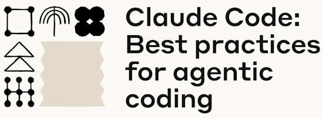](https://www.anthropic.com/engineering/claude-code-best-practices)

Claude Code is a command line tool for agentic (vibe) coding. Many programmers have been trying out AI/LLM tools to help in the coding or debugging process. This article covers tips and tricks that have proven effective for using one tool, Claude Code, across various codebases, languages, and environments - [Anthropic](https://www.anthropic.com/engineering/claude-code-best-practices).

## Casio Launches its Best fx-CG100 ClassWiz Graphing Calculator with MicroPython Programming in America

Casio US introduces the [fx-CG100 ClassWiz](https://www.casio.com/us/scientific-calculators/product.FX-CG100/), a powerful color-graphing calculator with MicroPython for app programming and 2,900 math functions. For teachers, the Casio ClassPad Workspace offers a free PC emulator of the fx-CG100 calculator for use in classroom presentations. Students can use the calculator on standardized tests, such as the ACT, AP, PAST, and SAT tests, by enabling the Exam Mode, which locks out custom apps and user-added data - [NotebookCheck](https://www.notebookcheck.net/Casio-launches-its-best-fx-CG100-ClassWiz-graphing-calculator-with-MicroPython-programming-in-America.1004479.0.html).

The TI-84 Plus CE Python calculators take it a step further by including the ability to collect data from external sensors and control devices, such as robots and flying drones - [TI](https://education.ti.com/en/products/calculators/graphing-calculators/ti-84-plus-ce-python/programming).

## Document Conversion Services Simplify Working With Data

One of the most difficult things with ingesting documents into a project is dealing with the varying formats data can be formatted in. PDF, DOCX, XLSX, HTML, etc., all require heavy duty processing which is difficult for limited systems. IBM and Microsoft have both launched services to convert such data to Markdown or JSON, both easier to parse by small systems.

[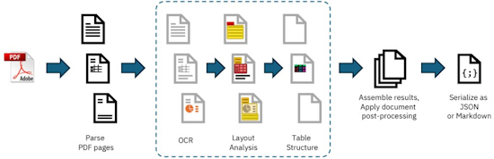](https://github.com/docling-project/docling)

Docling simplifies document processing, parsing diverse formats — including advanced PDF understanding — and providing seamless integrations with the gen AI ecosystem - [IBM](https://github.com/docling-project/docling) and an API for Docling - [GitHub](https://github.com/drmingler/docling-api).

MarkItDown is a lightweight Python utility for converting various files to Markdown for use with LLMs and related text analysis pipelines - [GitHub](https://github.com/microsoft/markitdown) and [InfoWorld](https://www.infoworld.com/article/3963991/markitdown-microsofts-open-source-tool-for-markdown-conversion.html).

If you'd like to see a comparison between Docling, Marker, and MarkItDown, there is a video - [YouTube](https://www.youtube.com/watch?v=KqPR2NIekjI).

## Free University Courses

A number of universities worldwide offer free or low cost courses oonline in varied topics. While free courses often do not offer a certificate, the study provides valuable experience. This issue lists some courses offered by two well known US universities. If you find good course material offered elsewhere, please send links to cpnews(at)adafruit(dot)com.

Below is a few of the many courses offered for free online at Harvard University, Massachussetts - [Harvard](https://pll.harvard.edu/catalog/free).

- [CS50's Introduction to Programming with Python](https://pll.harvard.edu/course/cs50s-introduction-programming-python)
- [CS50's Introduction to Artificial Intelligence with Python](https://pll.harvard.edu/course/cs50s-introduction-artificial-intelligence-python)
- [Machine Learning and AI with Python](https://pll.harvard.edu/course/machine-learning-and-ai-python)
- [Deploying TinyML](https://pll.harvard.edu/course/deploying-tinyml/2025-04)

Stanford has courses, often free, but some at a cost - [Stanford](https://online.stanford.edu/explore).

- [Machine Learning Specialization](https://www.coursera.org/specializations/machine-learning-introduction)
- [Machine Learning on Embedded Systems](https://ee292d.github.io/) and materials - [GitHub](https://github.com/ee292d/labs?tab=readme-ov-file#practical-ai-for-the-raspberry-pi)
- [Introduction to Internet of Things](https://online.stanford.edu/courses/xee100-introduction-internet-things)
- [Statistical Learning with Python](https://online.stanford.edu/courses/sohs-ystatslearningp-statistical-learning-python)

## Raspberry Pi HEVC Decoder Linux Driver Updated For Mainline Kernel Attempt

[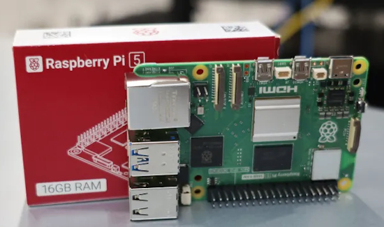](https://www.phoronix.com/news/Raspberry-Pi-HEVC-Decode-V3)

Raspberry Pi is getting closer to getting their H.265/HEVC video decoder driver into mainstream Linux - [Phoronix](https://www.phoronix.com/news/Raspberry-Pi-HEVC-Decode-V3).

## This Week's Python Streams

Python on Hardware is all about building a cooperative ecosphere which allows contributions to be valued and to grow knowledge. Below are the streams within the last week focusing on the community.

**CircuitPython Deep Dive Stream**

[Last Friday](link), Scott streamed work on {subject}.

You can see the latest video and past videos on the Adafruit YouTube channel under the Deep Dive playlist - [YouTube](https://www.youtube.com/playlist?list=PLjF7R1fz_OOXBHlu9msoXq2jQN4JpCk8A).

**CircuitPython Parsec**

John Park’s CircuitPython Parsec this week is on {subject} - [Adafruit Blog](link) and [YouTube](link).

Catch all the episodes in the [YouTube playlist](https://www.youtube.com/playlist?list=PLjF7R1fz_OOWFqZfqW9jlvQSIUmwn9lWr).

**The CircuitPython Show**

In the latest episode of The CircuitPython Show, Paul... - [The CircuitPython Show](https://www.circuitpythonshow.com/@circuitpythonshow)

**CircuitPython Weekly Meeting**

CircuitPython Weekly Meeting for April 21, 2025 ([notes](https://github.com/adafruit/adafruit-circuitpython-weekly-meeting/blob/main/2025/2025-04-21.md)) [on YouTube](https://youtu.be/LBEp1_ScOc0).

## Project of the Week: PiLiDAR: A DIY 360° 3D Panorama Scanner

[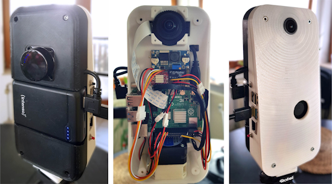](https://github.com/PiLiDAR/PiLiDAR)

PiLiDAR is a LIDAR scanning system for the Raspberry Pi, designed to work with LDRobot LIDAR modules like the LD06, LD19, and STL27L - [GitHub](https://github.com/PiLiDAR/PiLiDAR). Via [Hackaday](https://hackaday.com/2025/04/18/a-pi-based-lidar-scanner/).

## Popular Last Week

[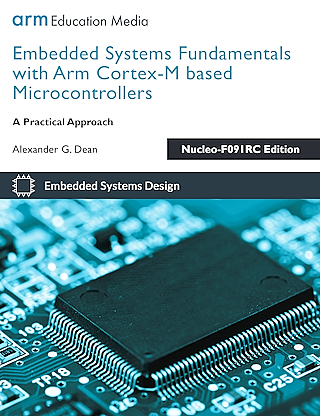](https://github.com/arm-university/Embedded-Systems-Fundamentals/)

As predicted, the free books linked to in last week's newsletter was very popular.

What was the most clicked link in [last week's newsletter](https://www.adafruitdaily.com/2025/04/21/python-on-microcontrollers-newsletter-micropython-v1-25-is-out-arduino-editor-with-ai-assist-free-books-and-more-circuitpython-python-micropython-thepsf-raspberry_pi/)? [Book: Embedded Systems Fundamentals with Arm Cortex-M based Microcontrollers](https://github.com/arm-university/Embedded-Systems-Fundamentals/).

Did you know you can read past issues of this newsletter in the Adafruit Daily Archive? [Check it out](https://www.adafruitdaily.com/category/circuitpython/).

## New Notes from Adafruit Playground

[Adafruit Playground](https://adafruit-playground.com/) is a new place for the community to post their projects and other making tips/tricks/techniques. Ad-free, it's an easy way to publish your work in a safe space for free.

[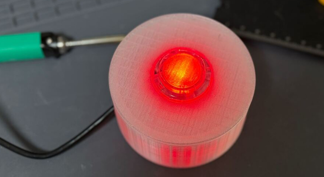](https://adafruit-playground.com/u/tcooper/pages/the-many-possibilities-of-adafruit-io-actions-and-an-arcade-button)

The Many Possibilities of Adafruit IO Actions and an Arcade Button - [Adafruit Playground](https://adafruit-playground.com/u/tcooper/pages/the-many-possibilities-of-adafruit-io-actions-and-an-arcade-button).

text - [Adafruit Playground](url).

## News From Around the Web

[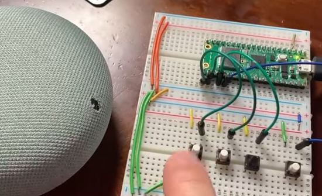](https://kakuwane.fc2.net/blog-entry-380.html)

Making a Google Home mini talk using a Raspberry Pi Pico W and MicroPython - [kakuwane.fc2.net](https://kakuwane.fc2.net/blog-entry-380.html) and [YouTube](https://www.youtube.com/watch?v=Ndemi523vQs) (Japanese).

Introduction to Zephyr Part 8: Multithreading - [YouTube](https://www.youtube.com/watch?v=3OSKV2jrAHM). Via [X](https://x.com/ShawnHymel/status/1915784816156610678).

[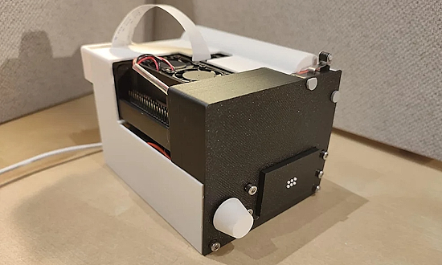](https://www.instructables.com/Braille-Vision-a-Real-time-Text-to-braille-Device/)

Braille Vision: a portable text-to-Braille device using a Raspberry Pi and Python - [Instructables](https://www.instructables.com/Braille-Vision-a-Real-time-Text-to-braille-Device/).

[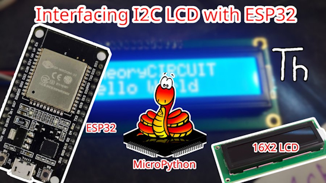](https://theorycircuit.com/esp32-projects/interfacing-i2c-lcd-with-esp32-using-micropython/)

Interfacing an I2C LCD with an ESP32 using MicroPython - [theoryCIRCUIT](https://theorycircuit.com/esp32-projects/interfacing-i2c-lcd-with-esp32-using-micropython/).

[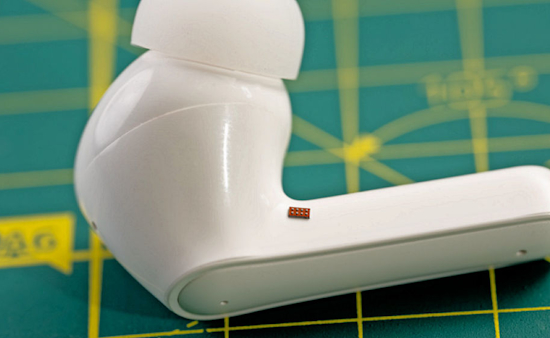](https://www.eejournal.com/article/ti-says-its-mspm0-is-the-worlds-most-teeny-tiny-32-bit-microcontroller-its-smaller-than-a-grain-of-white-rice-and-costs-16-cents/)

TI says its MSPM0 is the world’s most teeny, tiny 32-bit microcontroller. It’s smaller than a grain of white rice and costs 16 cents - [EE Journal](https://www.eejournal.com/article/ti-says-its-mspm0-is-the-worlds-most-teeny-tiny-32-bit-microcontroller-its-smaller-than-a-grain-of-white-rice-and-costs-16-cents/).

text - [site](url).

text - [site](url).

text - [site](url).

text - [site](url).

text - [site](url).

[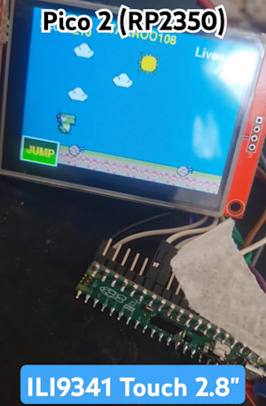](https://www.youtube.com/shorts/g1lPGt46HuU)

Using a Raspberry Pi Pico 2 (RP2350) with an ILI9341 touch 2.8" LCD display - [YouTube](https://www.youtube.com/shorts/g1lPGt46HuU).

[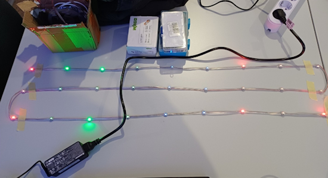](https://mastodon.social/@dr_muesli@woof.tech/114367119015947922)

The TIX Clock uses WS2812B (NeoPixel) LEDs controlled via a ESP32-S2 mini using MicroPython. The time is updated over WiFi from an NTP server during boot - [Mastodon](https://mastodon.social/@dr_muesli@woof.tech/114367119015947922).

[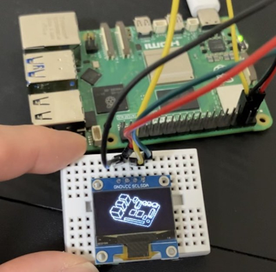](https://x.com/sozoraemon/status/1914979606102434168)

Displaying a Raspberry Pi on a small OLED display connected to a Raspberry Pi 5 using Python - [X](https://x.com/sozoraemon/status/1914979606102434168).

[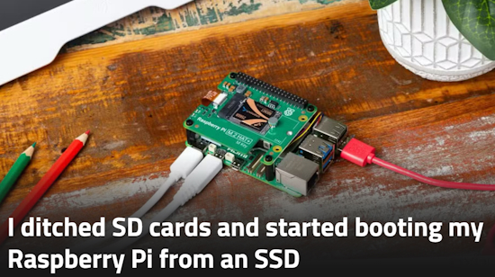](https://www.xda-developers.com/ditched-sd-cards-started-booting-raspberrypi-ssd/)

I ditched SD cards and started booting my Raspberry Pi from an SSD - [XDA](https://www.xda-developers.com/ditched-sd-cards-started-booting-raspberrypi-ssd/).

text - [site](url).

text - [site](url).

text - [site](url).

## New

[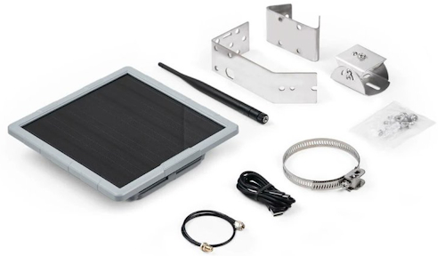](https://www.cnx-software.com/2025/04/24/sensecap-solar-node-p1-and-p1-pro-are-low-cost-outdoor-meshtastic-repeaters/)

SenseCAP Solar Node P1 and P1-Pro are low-cost outdoor Meshtastic repeaters. Both feature a solar panel, XIAO nRF52840 Plus and Wio-SX1262 modules, but the SenseCAP Solar Node P1-Pro adds GPS, GLONASS, and Galileo support with the XIAO L76K and four 18650 batteries for backup power - [CNX Software](https://www.cnx-software.com/2025/04/24/sensecap-solar-node-p1-and-p1-pro-are-low-cost-outdoor-meshtastic-repeaters/).

[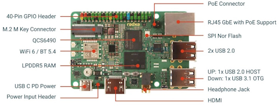](https://www.notebookcheck.net/Radxa-Dragon-Q6A-New-Raspberry-Pi-alternative-is-powered-by-Qualcomm-SoC.1001043.0.html)

Radxa is launching the Dragon Q6A, an SBC alternative to the Raspberry Pi. It offers a 40-pin GPIO header and is equipped with the Qualcomm QCS6490 SoC with four Cortex-A78, four Cortex-A55 cores and an Adreno 634L iGPU. The included NPU offers an AI performance of 12 TOPS, which makes it possible to run some AI models locally, such as object recognition for images - [NotebookCheck](https://www.notebookcheck.net/Radxa-Dragon-Q6A-New-Raspberry-Pi-alternative-is-powered-by-Qualcomm-SoC.1001043.0.html).

## New Boards Supported by CircuitPython

The number of supported microcontrollers and Single Board Computers (SBC) grows every week. This section outlines which boards have been included in CircuitPython or added to [CircuitPython.org](https://circuitpython.org/).

This week there were (#/no) new boards added:

- [Board name](url)
- [Board name](url)
- [Board name](url)

*Note: For non-Adafruit boards, please use the support forums of the board manufacturer for assistance, as Adafruit does not have the hardware to assist in troubleshooting.*

Looking to add a new board to CircuitPython? It's highly encouraged! Adafruit has four guides to help you do so:

- [How to Add a New Board to CircuitPython](https://learn.adafruit.com/how-to-add-a-new-board-to-circuitpython/overview)
- [How to add a New Board to the circuitpython.org website](https://learn.adafruit.com/how-to-add-a-new-board-to-the-circuitpython-org-website)
- [Adding a Single Board Computer to PlatformDetect for Blinka](https://learn.adafruit.com/adding-a-single-board-computer-to-platformdetect-for-blinka)
- [Adding a Single Board Computer to Blinka](https://learn.adafruit.com/adding-a-single-board-computer-to-blinka)

## New Learn Guides

The Adafruit Learning System has over 3,000 free guides for learning skills and building projects including using Python.

[USB Game Controller with SNES-like Layout](https://learn.adafruit.com/usb-game-controller-with-snes-like-layout) from [Tim C](https://learn.adafruit.com/u/Foamyguy)

[title](url) from [name](url)

## CircuitPython Libraries

The CircuitPython library numbers are continually increasing, while existing ones continue to be updated. Here we provide library numbers and updates!

To get the latest Adafruit libraries, download the [Adafruit CircuitPython Library Bundle](https://circuitpython.org/libraries). To get the latest community contributed libraries, download the [CircuitPython Community Bundle](https://circuitpython.org/libraries).

If you'd like to contribute to the CircuitPython project on the Python side of things, the libraries are a great place to start. Check out the [CircuitPython.org Contributing page](https://circuitpython.org/contributing). If you're interested in reviewing, check out Open Pull Requests. If you'd like to contribute code or documentation, check out Open Issues. We have a guide on [contributing to CircuitPython with Git and GitHub](https://learn.adafruit.com/contribute-to-circuitpython-with-git-and-github), and you can find us in the #help-with-circuitpython and #circuitpython-dev channels on the [Adafruit Discord](https://adafru.it/discord).

You can check out this [list of all the Adafruit CircuitPython libraries and drivers available](https://github.com/adafruit/Adafruit_CircuitPython_Bundle/blob/master/circuitpython_library_list.md). 

The current number of CircuitPython libraries is **###**!

**New Libraries**

Here's this week's new CircuitPython libraries:

* [library](url)

**Updated Libraries**

Here's this week's updated CircuitPython libraries:

* [library](url)

## What’s the CircuitPython team up to this week?

What is the team up to this week? Let’s check in:

**Dan**

I finished a new WiFi power management API that can be used on both CYW43 boards (like Pico W) and Espressif boards. Thanks to anecdata for testing.

Currently I'm debugging a TLS problem that showed up in the ESP-IDF v5.4.1 update that eightycc is working on.

**Tim**

I have been working on Adafruit Learning System guides for using the basic keyboard and mouse from the shop with USB Host on CircuitPython and Arduino. There is a guide for the USB SNES-like controller as well which went live this week. In between work on those, I made some changes in adabot to try to resolve an issue that causes one of the circuitpython.org actions tasks to get stalled out sometimes. 

**Scott**

This is the last week before I go into full-time Dad mode. Starting May 2nd. I'll be part time or off completely until my youngest goes to daycare. Most of the time I'll be hourly (aka work when they sleep.) I will take 8 weeks completely off though too.

So, I've been wrapping up my Fruit Jam inspired work. I updated `set_next_code_file` to take in a working directory and fixed os path resolution to work across volumes. I fixed audio playback so it doesn't play random memory when the buffer filling can't keep up. I also made audio buffers fill while doing explicit display refreshes.

Lastly, I'm working to get my improvements to GC collection times merged in. It is a big change with a huge potential reduction in GC collect times.

**Liz**

I've been working on CircuitPython code for a camera slider that uses two TMC2209 stepper motor drivers. This takes advantage of the UART control interface for the drivers. The project also has a TFT display, rotary encoder and end stop switches. The screen helps to display a menu system that you can navigate with the rotary encoder. This will all be documented in a guide with the Ruiz brothers in the coming weeks.

## Upcoming Events

The community is coming back to Pittsburgh, Pennsylvania for PyCon US 2025 May 14 - May 22, 2025 - [us.pycon.org](https://us.pycon.org/2025/).

The next MicroPython Meetup in Melbourne will be on May 28th – [Meetup](https://www.meetup.com/micropython-meetup/events). You can see recordings of previous meetings on [YouTube](https://www.youtube.com/@MicroPythonOfficial). 

KiCad conferences (KiCon) to be held this year include 28 - 30 May 2025 in San Diego, California, 19 - 20 Sept 2024 in Bochum, Germany, and to be determined in Asia - [KiCad](https://kicon.kicad.org/).

Open Hardware Summit 2025 is being held May 30 @ 10am - May 31 @ 6pm GMT+1 in Edinburgh, Scotland - [Eventbrite](https://www.eventbrite.com/e/open-hardware-summit-2025-tickets-1067611086499).

PyOhio 2025 will be held Saturday & Sunday July 26 & 27, 2025 at the Cleveland State University Student Center in Cleveland, Ohio - [PyOhio 2025](https://www.pyohio.org/2025/).

PyCon UK will be at CONTACT in Manchester from Friday 19th September to Monday 22nd September 2025 - [PyCon UK 2025](https://2025.pyconuk.org/).

**Send Your Events In**

If you know of virtual events or upcoming events, please let us know via email to cpnews(at)adafruit(dot)com.

## Latest Releases

CircuitPython's stable release is [#.#.#](https://github.com/adafruit/circuitpython/releases/latest) and its unstable release is [#.#.#-##.#](https://github.com/adafruit/circuitpython/releases). New to CircuitPython? Start with our [Welcome to CircuitPython Guide](https://learn.adafruit.com/welcome-to-circuitpython).

[2025####](https://github.com/adafruit/Adafruit_CircuitPython_Bundle/releases/latest) is the latest Adafruit CircuitPython library bundle.

[2025####](https://github.com/adafruit/CircuitPython_Community_Bundle/releases/latest) is the latest CircuitPython Community library bundle.

[v#.#.#](https://micropython.org/download) is the latest MicroPython release. Documentation for it is [here](http://docs.micropython.org/en/latest/pyboard/).

[#.#.#](https://www.python.org/downloads/) is the latest Python release. The latest pre-release version is [#.#.#](https://www.python.org/download/pre-releases/).

[#,### Stars](https://github.com/adafruit/circuitpython/stargazers) Like CircuitPython? [Star it on GitHub!](https://github.com/adafruit/circuitpython)

## Call for Help -- Translating CircuitPython is now easier than ever

[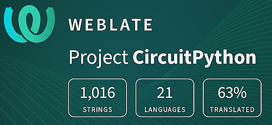](https://hosted.weblate.org/engage/circuitpython/)

One important feature of CircuitPython is translated control and error messages. With the help of fellow open source project [Weblate](https://weblate.org/), we're making it even easier to add or improve translations. 

Sign in with an existing account such as GitHub, Google or Facebook and start contributing through a simple web interface. No forks or pull requests needed! As always, if you run into trouble join us on [Discord](https://adafru.it/discord), we're here to help.

## NUMBER Thanks

The Adafruit Discord community, where we do all our CircuitPython development in the open, reached over NUMBER humans - thank you! Adafruit believes Discord offers a unique way for Python on hardware folks to connect. Join today at [https://adafru.it/discord](https://adafru.it/discord).

## ICYMI - In case you missed it

Python on hardware is the Adafruit Python video-newsletter-podcast! The news comes from the Python community, Discord, Adafruit communities and more and is broadcast on ASK an ENGINEER Wednesdays. The complete Python on Hardware weekly videocast [playlist is here](https://www.youtube.com/playlist?list=PLjF7R1fz_OOXRMjM7Sm0J2Xt6H81TdDev). The video podcast is on [iTunes](https://itunes.apple.com/us/podcast/python-on-hardware/id1451685192?mt=2), [YouTube](http://adafru.it/pohepisodes), [Instagram](https://www.instagram.com/adafruit/channel/)), and [XML](https://itunes.apple.com/us/podcast/python-on-hardware/id1451685192?mt=2).

[The weekly community chat on Adafruit Discord server CircuitPython channel - Audio / Podcast edition](https://itunes.apple.com/us/podcast/circuitpython-weekly-meeting/id1451685016) - Audio from the Discord chat space for CircuitPython, meetings are usually Mondays at 2pm ET, this is the audio version on [iTunes](https://itunes.apple.com/us/podcast/circuitpython-weekly-meeting/id1451685016), Pocket Casts, [Spotify](https://adafru.it/spotify), and [XML feed](https://adafruit-podcasts.s3.amazonaws.com/circuitpython_weekly_meeting/audio-podcast.xml).

## Contribute

The CircuitPython Weekly Newsletter is a CircuitPython community-run newsletter emailed every Monday. The complete [archives are here](https://www.adafruitdaily.com/category/circuitpython/). It highlights the latest CircuitPython related news from around the web including Python and MicroPython developments. To contribute, edit next week's draft [on GitHub](https://github.com/adafruit/circuitpython-weekly-newsletter/tree/gh-pages/_drafts) and [submit a pull request](https://help.github.com/articles/editing-files-in-your-repository/) with the changes. You may also tag your information on Twitter with #CircuitPython. 

Join the Adafruit [Discord](https://adafru.it/discord) or [post to the forum](https://forums.adafruit.com/viewforum.php?f=60) if you have questions.
