- [ ] Library and info updates
- [ ] change date
- [ ] update title
- [ ] Feature story
- [ ] Update  for images
- [ ] Update ICYDNCI
- [ ] All images 550w max only
- [ ] Link "View this email in your browser."

News Sources

- [Adafruit Playground](https://adafruit-playground.com/)
- Twitter: [CircuitPython](https://twitter.com/search?q=circuitpython&src=typed_query&f=live), [MicroPython](https://twitter.com/search?q=micropython&src=typed_query&f=live) and [Python](https://twitter.com/search?q=python&src=typed_query)
- [Raspberry Pi News](https://www.raspberrypi.com/news/)
- Mastodon [CircuitPython](https://mastodon.social/tags/CircuitPython) and [MicroPython](https://mastodon.social/tags/MicroPython)
- [hackster.io CircuitPython](https://www.hackster.io/search?q=circuitpython&i=projects&sort_by=most_recent) and [MicroPython](https://www.hackster.io/search?q=micropython&i=projects&sort_by=most_recent)
- YouTube: [CircuitPython](https://www.youtube.com/results?search_query=circuitpython&sp=CAI%253D), [MicroPython](https://www.youtube.com/results?search_query=micropython&sp=CAI%253D), [Prof Gallaugher](https://www.youtube.com/@BuildWithProfG/videos), [Teacher Brogan M. Pratt CircuitPython](https://www.youtube.com/playlist?list=PLRHdgFNRLyaN6eCw8b0yoHKDY9B4GiirU), [Teacher Brogan M. Pratt CircuitPython search](https://www.youtube.com/@BroganMPratt/search?query=circuitpython)
- Instructables: [CircuitPython](https://www.instructables.com/search/?q=circuitpython&projects=all&sort=Newest), [MicroPython](https://www.instructables.com/search/?q=micropython&projects=all&sort=Newest), [Raspberry Pi Python](https://www.instructables.com/search/?q=raspberry+pi+python&projects=all&sort=Newest)
- [hackaday CircuitPython](https://hackaday.com/blog/?s=circuitpython) and [MicroPython](https://hackaday.com/blog/?s=micropython)
- [python.org](https://www.python.org/)
- [Python Insider - dev team blog](https://pythoninsider.blogspot.com/)
- Individuals: [Jeff Geerling](https://www.jeffgeerling.com/blog), [Yakroo](https://x.com/Yakroo5077)
- Tom's Hardware: [CircuitPython](https://www.tomshardware.com/search?searchTerm=circuitpython&articleType=all&sortBy=publishedDate) and [MicroPython](https://www.tomshardware.com/search?searchTerm=micropython&articleType=all&sortBy=publishedDate) and [Raspberry Pi](https://www.tomshardware.com/search?searchTerm=raspberry%20pi&articleType=all&sortBy=publishedDate)
- [hackaday.io newest projects MicroPython](https://hackaday.io/projects?tag=micropython&sort=date) and [CircuitPython](https://hackaday.io/projects?tag=circuitpython&sort=date)
- [Google News Python](https://news.google.com/topics/CAAqIQgKIhtDQkFTRGdvSUwyMHZNRFY2TVY4U0FtVnVLQUFQAQ?hl=en-US&gl=US&ceid=US%3Aen)
- hackaday.io - [CircuitPython](https://hackaday.io/search?term=circuitpython) and [MicroPython](https://hackaday.io/search?term=micropython)

View this email in your browser. **Warning: Flashing Imagery**

Welcome to the latest Python on Microcontrollers newsletter! *insert 2-3 sentences from editor (what's in overview, banter)* - *Anne Barela, Editor*

We're on [Discord](https://discord.gg/HYqvREz), [Twitter/X](https://twitter.com/search?q=circuitpython&src=typed_query&f=live), [BlueSky](https://bsky.app/profile/circuitpython.org) and for past newsletters - [view them all here](https://www.adafruitdaily.com/category/circuitpython/). If you're reading this on the web, [subscribe here](https://www.adafruitdaily.com/). Here's the news this week:

## Improving Garbage Collection Time in CircuitPython

[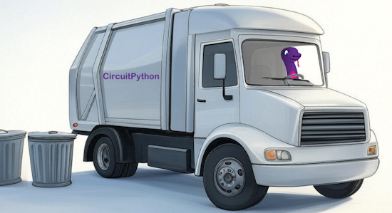](https://blog.adafruit.com/2025/04/28/improving-garbage-collection-time-in-circuitpython/)

Garbage collection is the process where in-use memory is reclaimed for reuse. The Python language doesn’t require the programmer to explicitly request and free memory instead it is tracked internally. However, the process to determine which memory is still in use can be slow and requires extra memory to track. CircuitPython developer Scott Shawcroft has developed an algorithm to quickly collect unused memory and return it to use, increasing speed and space - [Adafruit Blog](https://blog.adafruit.com/2025/04/28/improving-garbage-collection-time-in-circuitpython/).

## Raspberry Pi Cuts Product Returns by 50% by Changing Its Header Pin Soldering

[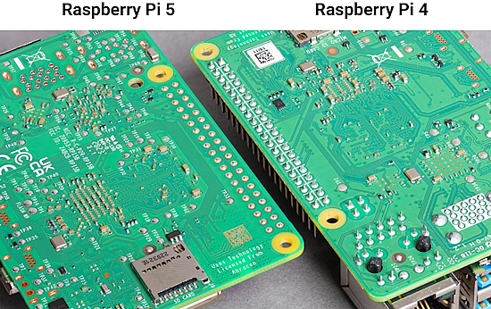](https://arstechnica.com/gadgets/2025/04/raspberry-pi-cuts-product-returns-by-50-by-changing-up-its-pin-soldering/)

Up to the Raspberry Pi 4, the pins of the IO header stick a bit out of the back of the board and are wave soldered. The process can cause some pin bridging. With Raspberry Pi 5, they are using connectors with shorter pins and using solder paste and going through a reflow oven with the rest of the parts. This reduces defect returns by half - [Ars Technica](https://arstechnica.com/gadgets/2025/04/raspberry-pi-cuts-product-returns-by-50-by-changing-up-its-pin-soldering/) and [YouTube](https://youtu.be/obYHpjzhyAw).

## The Espressif Systems ESP32-C5 RISC-V MCU is Now in Mass Production

[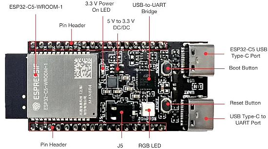](https://www.cnx-software.com/2025/04/30/esp32-c5-mass-production-esp32-c5-devkitc-1-board/)

Espressif Systems has just started mass production of the ESP32-C5 RISC-V wireless microcontroller with dual-band (2.4/5 GHz) WiFi 6, Bluetooth LE, and 802.15.4 (Zigbee, Thread) connectivity - [CNX Software](https://www.cnx-software.com/2025/04/30/esp32-c5-mass-production-esp32-c5-devkitc-1-board/), [hackster.io](https://www.hackster.io/news/espressif-s-dual-band-esp32-c5-finally-lands-on-the-15-esp32-c5-devkitc-1-development-board-549233d8db52), and [Espressif](https://docs.espressif.com/projects/esp-dev-kits/en/latest/esp32c5/esp32-c5-devkitc-1/user_guide.html). Via [X](https://x.com/cnxsoft/status/1917569833413271885).

## Feature

text - [site](url).

## PyXL Runs Python Directly on an FPGA Without a Bytecode Interpreter

[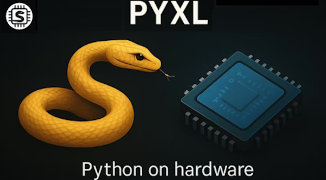](https://www.runpyxl.com/gpio)

PyXL is a custom hardware processor that executes Python directly — no interpreter, no JIT, and no tricks. It takes regular Python code and runs it in silicon. A custom toolchain compiles a .py file into CPython ByteCode, translates it to a custom assembly, and produces a binary that runs on a pipelined processor built from scratch - [runpyxl.com](https://www.runpyxl.com/gpio), [YouTube](https://vimeo.com/1074893425/722d28efd8) and [hackster.io](https://www.hackster.io/news/pyxl-promises-orders-of-magnitude-faster-embedded-python-using-a-python-native-custom-processor-c0e01ddc30eb).

> "A GPIO roundtrip takes 480ns on PyXL vs. ~15,000ns on PyBoard (MicroPython)."

## Talk: The Source of Change: Bettering Online Open Source Communities Can Begin with You

CircuitPythonista Kattni traveled to the North Bay PyCon for the talk *The Source of Change: Bettering Online Open Source Communities Can Begin with You* - [YouTube](https://www.youtube.com/watch?v=nvRgeJQ3v5U).

> "Creating a safe and welcoming environment for open source development begins with you. Discover how you can affect positive change in your own project space and the spaces of others within the open source community through practical and achievable actions. You will gain a better understanding of the problem, and the changes necessary to begin addressing it."

## Free Book: Competitive Programming in Python

[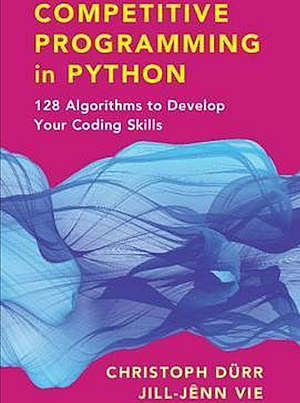](https://ia804600.us.archive.org/14/items/competitive-programming/Competitive%20Programming.pdf)

A book I found this week is Competitive Programming in Python: 128 Algorithms to Develop Your Coding Skills located in the Internet Archive. While Python provides a great deal of functionality and libraries augment that, there are methods you will need that are not provided in a handy way. That is where books like this which help with algorithms are a great resource - [Internet Archive](https://ia804600.us.archive.org/14/items/competitive-programming/Competitive%20Programming.pdf) (PDF).

## This Week's Python Streams

Python on Hardware is all about building a cooperative ecosphere which allows contributions to be valued and to grow knowledge. Below are the streams within the last week focusing on the community.

**CircuitPython Deep Dive Stream**

[Last Friday](link), Tim streamed work on {subject}.

You can see the latest video and past videos on the Adafruit YouTube channel under the Deep Dive playlist - [YouTube](https://www.youtube.com/playlist?list=PLjF7R1fz_OOXBHlu9msoXq2jQN4JpCk8A).

**CircuitPython Parsec**

John Park’s CircuitPython Parsec this week is on {subject} - [Adafruit Blog](link) and [YouTube](link).

Catch all the episodes in the [YouTube playlist](https://www.youtube.com/playlist?list=PLjF7R1fz_OOWFqZfqW9jlvQSIUmwn9lWr).

**The CircuitPython Show**

In the latest episode of The CircuitPython Show, Paul welcomes Cooper Dalrymple, who was a recent guest on the Audio Effects panel discussion. Cooper shares how he got started with electronics, his music background, what’s next for CircuitPython’s audio effects, and more - [The CircuitPython Show](https://www.circuitpythonshow.com/@circuitpythonshow).

**CircuitPython Weekly Meeting**

CircuitPython Weekly Meeting for April 28, 2025 ([notes](https://github.com/adafruit/adafruit-circuitpython-weekly-meeting/blob/main/2025/2025-04-28.md)) [on YouTube](https://youtu.be/z_1sC5MkQPY).

## Project of the Week

text - [site](url).

## Popular Last Week

[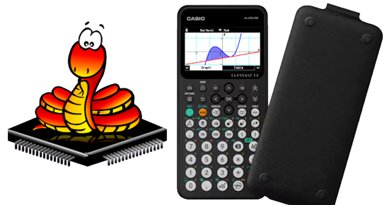](https://www.casio.com/us/scientific-calculators/product.FX-CG100/)

What was the most popular, most clicked link, in [last week's newsletter](https://www.adafruitdaily.com/2025/04/28/python-on-microcontrollers-newsletter-micropython-turns-12-sparkfun-%e2%9d%a4%ef%b8%8f-micropython-free-courses-and-more-circuitpython-python-micropython-thepsf-raspberry_pi/)? [Casio Launches its Best fx-CG100 ClassWiz Graphing Calculator with MicroPython Programming](https://www.casio.com/us/scientific-calculators/product.FX-CG100/).

Did you know you can read past issues of this newsletter in the Adafruit Daily Archive? [Check it out](https://www.adafruitdaily.com/category/circuitpython/).

## New Notes from Adafruit Playground

[Adafruit Playground](https://adafruit-playground.com/) is a new place for the community to post their projects and other making tips/tricks/techniques. Ad-free, it's an easy way to publish your work in a safe space for free.

text - [Adafruit Playground](url).

text - [Adafruit Playground](url).

text - [Adafruit Playground](url).

## News From Around the Web

After last week's online courses from Harvard and Stanford, we received word of courses from MITx Online. We highlighted MIT four years ago. Check out their online catalog - [site](https://mitxonline.mit.edu/).

[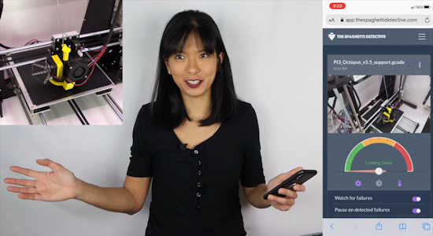](https://www.youtube.com/watch?v=vdL--4LzgFU)

Vibe coding Python Games with Gemini on Raspberry Pi 5 - [YouTube](https://www.youtube.com/watch?v=vdL--4LzgFU). Via [X](https://x.com/Raspberry_Pi/status/1917892355455111316?s=03).

The Python Software Foundation names a new Deputy Executive Director - [Python Blog](https://pyfound.blogspot.com/2025/04/congrats-loren.html).

[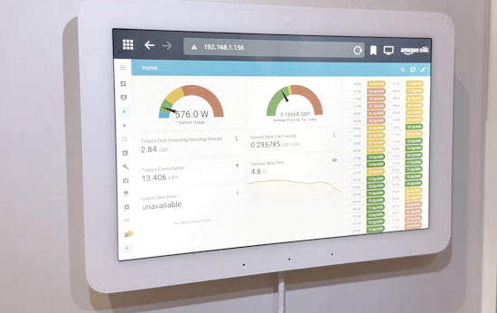](https://www.howtogeek.com/raspberry-pi-projects-i-would-do-if-i-had-the-time/)

5 Raspberry Pi projects I'd totally do if I had the time - [How-To Geek](https://www.howtogeek.com/raspberry-pi-projects-i-would-do-if-i-had-the-time/).

Introduction to Zephyr Part 9: Interrupts, Timers, and Counters - [YouTube](https://www.youtube.com/watch?v=nidpvkzVYGU).

[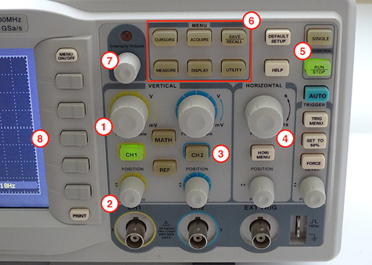](https://www.digikey.com/en/maker/tutorials/2024/how-to-use-an-oscilloscope)

Maker Tutorial - How To Use an Oscilloscope - [maker.io](https://www.digikey.com/en/maker/tutorials/2024/how-to-use-an-oscilloscope).

text - [site](url).

text - [site](url).

text - [site](url).

text - [site](url).

text - [site](url).

text - [site](url).

text - [site](url).

text - [site](url).

text - [site](url).

text - [site](url).

[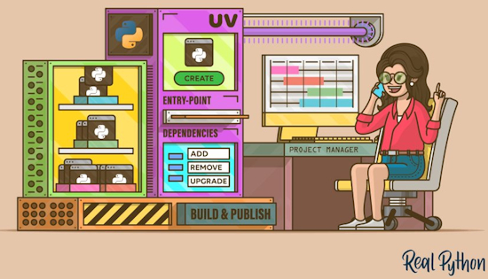](https://realpython.com/python-uv/)

Managing Python Projects With uv: An all-in-one solution - [Real Python](https://realpython.com/python-uv/).

text - [site](url).

## New

[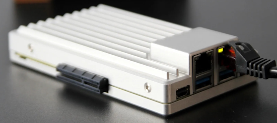](https://www.notebookcheck.net/ZimaBoard-2-0-in-pre-release-testing-Now-an-even-more-powerful-and-versatile-Raspberry-Pi-rival.1006382.0.html)

ZimaBoard 2.0 in pre-release testing: now an even more powerful and versatile Raspberry Pi rival. It features an Intel N150: 4 cores up to 3.6 GHz, 8-16GB RAM, 32GB eMMC, 2x SATA 3, 2x GbE 2.5 - [Notebook Check](https://www.notebookcheck.net/ZimaBoard-2-0-in-pre-release-testing-Now-an-even-more-powerful-and-versatile-Raspberry-Pi-rival.1006382.0.html).

text - [site](url).

## New Boards Supported by CircuitPython

The number of supported microcontrollers and Single Board Computers (SBC) grows every week. This section outlines which boards have been included in CircuitPython or added to [CircuitPython.org](https://circuitpython.org/).

This week there were (#/no) new boards added:

- [Board name](url)
- [Board name](url)
- [Board name](url)

*Note: For non-Adafruit boards, please use the support forums of the board manufacturer for assistance, as Adafruit does not have the hardware to assist in troubleshooting.*

Looking to add a new board to CircuitPython? It's highly encouraged! Adafruit has four guides to help you do so:

- [How to Add a New Board to CircuitPython](https://learn.adafruit.com/how-to-add-a-new-board-to-circuitpython/overview)
- [How to add a New Board to the circuitpython.org website](https://learn.adafruit.com/how-to-add-a-new-board-to-the-circuitpython-org-website)
- [Adding a Single Board Computer to PlatformDetect for Blinka](https://learn.adafruit.com/adding-a-single-board-computer-to-platformdetect-for-blinka)
- [Adding a Single Board Computer to Blinka](https://learn.adafruit.com/adding-a-single-board-computer-to-blinka)

## New Learn Guides

The Adafruit Learning System has over 3,000 free guides for learning skills and building projects including using Python.

[title](url) from [name](url)

[title](url) from [name](url)

[title](url) from [name](url)

## Updated Learn Guides

[title](url)

## CircuitPython Libraries

The CircuitPython library numbers are continually increasing, while existing ones continue to be updated. Here we provide library numbers and updates!

To get the latest Adafruit libraries, download the [Adafruit CircuitPython Library Bundle](https://circuitpython.org/libraries). To get the latest community contributed libraries, download the [CircuitPython Community Bundle](https://circuitpython.org/libraries).

If you'd like to contribute to the CircuitPython project on the Python side of things, the libraries are a great place to start. Check out the [CircuitPython.org Contributing page](https://circuitpython.org/contributing). If you're interested in reviewing, check out Open Pull Requests. If you'd like to contribute code or documentation, check out Open Issues. We have a guide on [contributing to CircuitPython with Git and GitHub](https://learn.adafruit.com/contribute-to-circuitpython-with-git-and-github), and you can find us in the #help-with-circuitpython and #circuitpython-dev channels on the [Adafruit Discord](https://adafru.it/discord).

You can check out this [list of all the Adafruit CircuitPython libraries and drivers available](https://github.com/adafruit/Adafruit_CircuitPython_Bundle/blob/master/circuitpython_library_list.md). 

The current number of CircuitPython libraries is **###**!

**New Libraries**

Here's this week's new CircuitPython libraries:

* [library](url)

**Updated Libraries**

Here's this week's updated CircuitPython libraries:

* [library](url)

## What’s the CircuitPython team up to this week?

What is the team up to this week? Let’s check in:

**Dan**

I fixed a problem that prevent TLS from working in the ESP-IDF v5.4.1 upgrade pull request. The format of the root certificate bundle changed, but we were using code that assumed the old format.

With eightycc, I've been looking at problem on ESP32-C3 and ESP32-C6 boards that causes a hard crash when you raise an exception while using REPL raw mode or paste mode.

**Tim**

This week I've been working on the Fruit Jam OS and Launcher. I've added functionality to download project bundles from Learn, migrated the launcher to use the new `adafruit_pathlib` library, made some fixes to get it running under the latest versions, and worked on the keyboard navigation between the grid of apps and the page arrow buttons. Seperately I've also been working on moving the libraries that were in the CircuitPython.org bundle over to the Community bundle and updating their infrastructure files in the process. While working on that, I uncovered a few issues with community bundle, adabot, and cookiecutter that I've submitted fixes for.

**Scott**

This last week I wrapped up my big projects before switching to full-time dad mode. I merged in the [selective garbage collection optimization](https://github.com/adafruit/circuitpython/pull/10264) and [blogged about it](https://blog.adafruit.com/2025/04/28/improving-garbage-collection-time-in-circuitpython/). I'm very excited to hear how it improves (hopefully) CircuitPython for folks. I also merged in a [fix for audio playback stopping](https://github.com/adafruit/circuitpython/pull/10299). I'm happy with how we've improved CircuitPython for the Fruit Jam.

**Liz**

This week I continued refining the camera slider project. Noe created some icons that I added to the display to indicate the different stages of setup for shots. I was able to create a very reliable function to move the stepper motor that pans the camera. Noe and I have done some test shots and things are looking really good. Most importantly, it is basically silent which is a huge upgrade from previous slider builds.

## Upcoming Events

The community is coming back to Pittsburgh, Pennsylvania for PyCon US 2025 May 14 - May 22, 2025 - [us.pycon.org](https://us.pycon.org/2025/).

The next MicroPython Meetup in Melbourne will be on May 28th – [Meetup](https://www.meetup.com/micropython-meetup/events). You can see recordings of previous meetings on [YouTube](https://www.youtube.com/@MicroPythonOfficial). 

KiCad conferences (KiCon) to be held this year include 28 - 30 May 2025 in San Diego, California, 19 - 20 Sept 2024 in Bochum, Germany, and to be determined in Asia - [KiCad](https://kicon.kicad.org/).

Open Hardware Summit 2025 is being held May 30 @ 10am - May 31 @ 6pm GMT+1 in Edinburgh, Scotland - [Eventbrite](https://www.eventbrite.com/e/open-hardware-summit-2025-tickets-1067611086499).

PyOhio 2025 will be held Saturday & Sunday July 26 & 27, 2025 at the Cleveland State University Student Center in Cleveland, Ohio - [PyOhio 2025](https://www.pyohio.org/2025/).

HOPE_16 is a welcoming place for hackers of all types: makers, artists, educators, experimenters, tinkerers, and more! If you're interested in playing with technology, coming up with new ideas, learning from others, and sharing your knowledge, then this is the place for you. August 15-17, 2025 at St. John's University Queens, New York City US - [HOPE](https://hope.net/).

PyCon UK will be at CONTACT in Manchester from Friday 19th September to Monday 22nd September 2025 - [PyCon UK 2025](https://2025.pyconuk.org/).

Maker Faire Bay Area 2025 will be Sep 26 – 28, 2025 10:00 AM in Vallejo, California - United States - [Bay Area Maker Faire](https://bayarea.makerfaire.com/).

**Send Your Events In**

If you know of virtual events or upcoming events, please let us know via email to cpnews(at)adafruit(dot)com.

## Latest Releases

CircuitPython's stable release is [#.#.#](https://github.com/adafruit/circuitpython/releases/latest) and its unstable release is [#.#.#-##.#](https://github.com/adafruit/circuitpython/releases). New to CircuitPython? Start with our [Welcome to CircuitPython Guide](https://learn.adafruit.com/welcome-to-circuitpython).

[2025####](https://github.com/adafruit/Adafruit_CircuitPython_Bundle/releases/latest) is the latest Adafruit CircuitPython library bundle.

[2025####](https://github.com/adafruit/CircuitPython_Community_Bundle/releases/latest) is the latest CircuitPython Community library bundle.

[v#.#.#](https://micropython.org/download) is the latest MicroPython release. Documentation for it is [here](http://docs.micropython.org/en/latest/pyboard/).

[#.#.#](https://www.python.org/downloads/) is the latest Python release. The latest pre-release version is [#.#.#](https://www.python.org/download/pre-releases/).

[#,### Stars](https://github.com/adafruit/circuitpython/stargazers) Like CircuitPython? [Star it on GitHub!](https://github.com/adafruit/circuitpython)

## Call for Help -- Translating CircuitPython is now easier than ever

[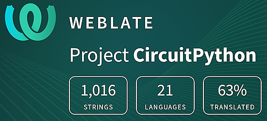](https://hosted.weblate.org/engage/circuitpython/)

One important feature of CircuitPython is translated control and error messages. With the help of fellow open source project [Weblate](https://weblate.org/), we're making it even easier to add or improve translations. 

Sign in with an existing account such as GitHub, Google or Facebook and start contributing through a simple web interface. No forks or pull requests needed! As always, if you run into trouble join us on [Discord](https://adafru.it/discord), we're here to help.

## 38,913 Thanks

The Adafruit Discord community, where we do all our CircuitPython development in the open, reached over 38,913 humans - thank you! Adafruit believes Discord offers a unique way for Python on hardware folks to connect. Join today at [https://adafru.it/discord](https://adafru.it/discord).

## ICYMI - In case you missed it

Python on hardware is the Adafruit Python video-newsletter-podcast! The news comes from the Python community, Discord, Adafruit communities and more and is broadcast on ASK an ENGINEER Wednesdays. The complete Python on Hardware weekly videocast [playlist is here](https://www.youtube.com/playlist?list=PLjF7R1fz_OOXRMjM7Sm0J2Xt6H81TdDev). The video podcast is on [iTunes](https://itunes.apple.com/us/podcast/python-on-hardware/id1451685192?mt=2), [YouTube](http://adafru.it/pohepisodes), [Instagram](https://www.instagram.com/adafruit/channel/)), and [XML](https://itunes.apple.com/us/podcast/python-on-hardware/id1451685192?mt=2).

[The weekly community chat on Adafruit Discord server CircuitPython channel - Audio / Podcast edition](https://itunes.apple.com/us/podcast/circuitpython-weekly-meeting/id1451685016) - Audio from the Discord chat space for CircuitPython, meetings are usually Mondays at 2pm ET, this is the audio version on [iTunes](https://itunes.apple.com/us/podcast/circuitpython-weekly-meeting/id1451685016), Pocket Casts, [Spotify](https://adafru.it/spotify), and [XML feed](https://adafruit-podcasts.s3.amazonaws.com/circuitpython_weekly_meeting/audio-podcast.xml).

## Contribute

The CircuitPython Weekly Newsletter is a CircuitPython community-run newsletter emailed every Monday. The complete [archives are here](https://www.adafruitdaily.com/category/circuitpython/). It highlights the latest CircuitPython related news from around the web including Python and MicroPython developments. To contribute, edit next week's draft [on GitHub](https://github.com/adafruit/circuitpython-weekly-newsletter/tree/gh-pages/_drafts) and [submit a pull request](https://help.github.com/articles/editing-files-in-your-repository/) with the changes. You may also tag your information on Twitter with #CircuitPython. 

Join the Adafruit [Discord](https://adafru.it/discord) or [post to the forum](https://forums.adafruit.com/viewforum.php?f=60) if you have questions.
