View this email in your browser. **Warning: Flashing Imagery**

Welcome to the latest Python on Microcontrollers newsletter! White smoke in Brooklyn as CircuitPython announces a new beta version of CircuitPython 10. Tie-ins with recent events include more on the effects of tariffs. SparkFun continues to ramp up their embrace of MicroPython and some new software releases from Raspberry Pi. It's a rather busy week - here's wishing you a good one - *Anne Barela, Editor*

We're on [Discord](https://discord.gg/HYqvREz), [Twitter/X](https://twitter.com/search?q=circuitpython&src=typed_query&f=live), [BlueSky](https://bsky.app/profile/circuitpython.org) and for past newsletters - [view them all here](https://www.adafruitdaily.com/category/circuitpython/). If you're reading this on the web, please [subscribe here](https://www.adafruitdaily.com/). Here's the news this week:

## A New Raspberry Pi OS Release

[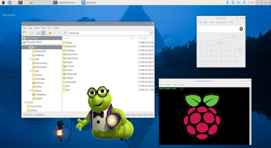](https://www.raspberrypi.com/news/a-new-raspberry-pi-os-release/)

Raspberry Pi just published a new version of Raspberry Pi OS — their recommended (and free) operating system for all Raspberry Pi computers — and it’s now available for download. This is likely the final release of Raspberry Pi OS which is based on Debian *bookworm*, before Debian *trixie* is released this summer - [Raspberry Pi News](https://www.raspberrypi.com/news/a-new-raspberry-pi-os-release/). Via [X](https://x.com/Raspberry_Pi/status/1920134984901300574).

**Some New Features**

- Auto login options
- New Printers application
- Better touchscreen handling
- Version 0.8.1 of the labwc Wayland window manager
- Squeekboard virtual keyboard allows multiple displays

## CircuitPython 10.0.0-alpha.4 Released

[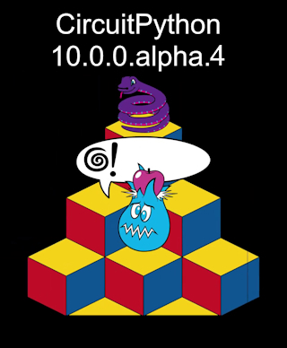](https://github.com/adafruit/circuitpython/releases/tag/10.0.0-alpha.4)

CircuitPython 10.0.0-alpha.4 is an alpha release for 10.0.0. Further features, changes, and bug fixes will be added before the final release of 10.0.0. This release is nearly the same as 10.0.0-alpha.3 but has a bug fix that breaks finalisers and results in "in use" errors. (Finalisers will usually release the resources.) It also fixes crashes on ESP32-CX RISC-V boards - [GitHub](https://github.com/adafruit/circuitpython/releases/tag/10.0.0-alpha.4).

**Highlights of this release**

- A number of new audio effects.
- Improved garbage collection times
- ESP-IDF update to 5.4.1
- Improved audio playback on RP2

## Adafruit Highlights Tariff Impacts

Adafruit was hit with a $36k tariff for a recent order and [they were transparent with the amount of the bill](https://blog.adafruit.com/2025/05/08/high-tariffs-become-real-with-our-first-36k-bill/). The media was prompt in picking up on the story and others are speaking up noting their own tariff bills and worries - [Adafruit Blog](https://blog.adafruit.com/2025/05/09/630572/).

## The SparkFun Inventor’s Kit Goes MicroPython

[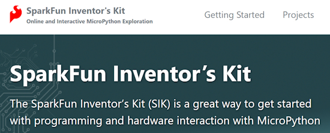](https://sparkfun.fun/)

The SparkFun Inventor's Kit is SparkFun's ecosystem to show what can be done with a package of electronic parts centereed around one of their microcontroller boards. Their latest iteration focuses on their RedBoard IoT - RP2350 (or simply as the “RedBoard”) and using MicroPython for programming. The site appears incomplete, but it looks like it'll be a nice environment for folks to learn to use MicroPython - [sparkfun.fun](https://sparkfun.fun/).

SparkFun article: Why MicroPython Matters - [SparkFun News](https://news.sparkfun.com/13770).

## Python 3.14 Reaches Beta With New Tail-Call Interpreter For Better Performance

Python 3.14 reaches its first beta with a new tail-call interpreter for better performance - [Phoronix](https://www.phoronix.com/news/Python-3.14-Beta-1).

> "A new type of interpreter has been added to CPython. It uses tail calls between small C functions that implement individual Python opcodes, rather than one large C case statement. For certain newer compilers, this interpreter provides significantly better performance. Preliminary numbers on our machines suggest anywhere up to 30% faster Python code, and a geometric mean of 3-5% faster on pyperformance depending on platform and architecture."

The best new features and fixes in Python 3.14 - [InfoWorld](https://www.infoworld.com/article/3975624/the-best-new-features-and-fixes-in-python-3-14.html).

## Raspberry Pi Connect Exits Beta

The Raspberry Pi Connect service, designed to provide secure yet simple remote access to users' single-board computers, is out with it's first non-beta release. It comes with better-behaved sleep functionality to boost power efficiency, and lower-bandwidth "heartbeat" packets - [hackster.io](https://www.hackster.io/news/raspberry-pi-connect-leaves-beta-gains-increased-efficiency-for-secure-remote-connectivity-c6a580addf3c).

## 2025 Pet Hacks Challenge

Naturally we like to share our hacks with our pets. Whether it’s a robot ball-thrower, a hamster wheel that’s integrated into your smart home system, or even just an automatic feeder for when you’re not home. Hackaday.io and DigiKey want to see what kind of projects your animal friends have inspired you to pull off. 
The top three entrants will receive a $150 gift certificate courtesy of DigiKey - [hackaday.io](https://hackaday.io/contest/202866-2025-pet-hacks-challenge).

## This Week's Python Streams

Python on Hardware is all about building a cooperative ecosphere which allows contributions to be valued and to grow knowledge. Below are the streams within the last week focusing on the community.

**CircuitPython Deep Dive Stream**

[Last Friday](https://youtube.com/live/kRhsFVKiWFw), Tim streamed work on Fruit Jam OS and Apps.

You can see the latest video and past videos on the Adafruit YouTube channel under the Deep Dive playlist - [YouTube](https://www.youtube.com/playlist?list=PLjF7R1fz_OOXBHlu9msoXq2jQN4JpCk8A).

**CircuitPython Parsec**

John Park’s CircuitPython Parsec this week is on Seesaw Button Bitmask - [Adafruit Blog](https://blog.adafruit.com/2025/05/09/john-parks-circuitpython-parsec-seesaw-button-bitmask/) and [YouTube](https://youtu.be/hyspIr4q0Kg).

Catch all the episodes in the [YouTube playlist](https://www.youtube.com/playlist?list=PLjF7R1fz_OOWFqZfqW9jlvQSIUmwn9lWr).

**The CircuitPython Show**

In the latest episode of The CircuitPython Show, Paul welcomed Cooper Dalrymple, who was a recent guest on the Audio Effects panel discussion. Cooper shared how he got started with electronics, his music background, what’s next for CircuitPython’s audio effects, and more - [The CircuitPython Show](https://www.circuitpythonshow.com/@circuitpythonshow).

**CircuitPython Weekly Meeting**

CircuitPython Weekly Meeting for May 5, 2025 ([notes](https://github.com/adafruit/adafruit-circuitpython-weekly-meeting/blob/main/2025/2025-05-05.md)) [on YouTube](https://youtu.be/2hFkvHjS_Yk).

## Project of the Week: Self-Charging MicroPython Robot

[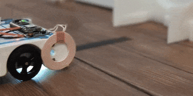](https://www.hackster.io/roni-bandini/building-a-self-charging-alvik-6daed7)

Inspired by vintage robot tortoises, Alvik now finds its 3D printed dock & recharges autonomously when battery is low, using MicroPython - [hackster.io](https://www.hackster.io/roni-bandini/building-a-self-charging-alvik-6daed7). Via [X](https://x.com/RoniBandini/status/1919869688948953511).

## Popular Last Week

[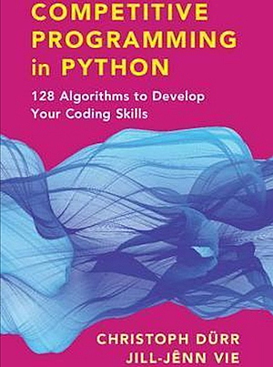](https://ia804600.us.archive.org/14/items/competitive-programming/Competitive%20Programming.pdf)

What was the most popular, most clicked link, in [last week's newsletter](https://www.adafruitdaily.com/2025/05/05/python-on-microcontrollers-newsletter-circuitpython-improvements-raspberry-pi-quality-pyxl-and-much-more-circuitpython-python-micropython-thepsf-raspberry_pi/)? [Free Book: Competitive Programming in Python](https://ia804600.us.archive.org/14/items/competitive-programming/Competitive%20Programming.pdf).

Did you know you can read past issues of this newsletter in the Adafruit Daily Archive? [Check it out](https://www.adafruitdaily.com/category/circuitpython/).

## New Notes from Adafruit Playground

[Adafruit Playground](https://adafruit-playground.com/) is a new place for the community to post their projects and other making tips/tricks/techniques. Ad-free, it's an easy way to publish your work in a safe space for free.

[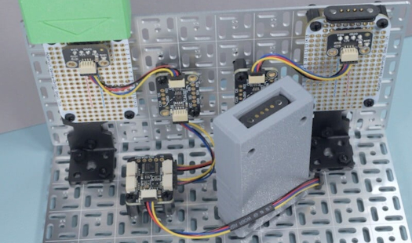](https://adafruit-playground.com/u/SamBlenny/pages/i2c-fram-memory-carts)

I2C FRAM Memory Carts - [Adafruit Playground](https://adafruit-playground.com/u/SamBlenny/pages/i2c-fram-memory-carts).

## News From Around the Web

[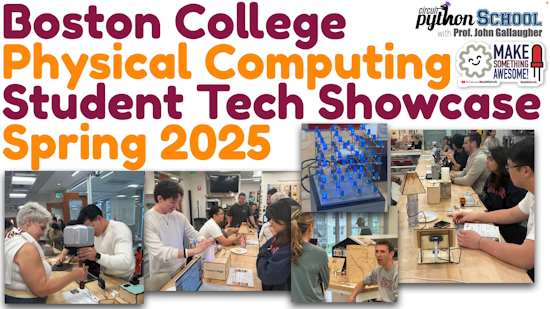](https://www.youtube.com/watch?v=u4VNf-bi6Xw)

The Boston College Physical Computing & CircuitPython Student Showcase, Spring 2025 - [YouTube](https://www.youtube.com/watch?v=u4VNf-bi6Xw). Via [Mastodon](https://mastodon.social/@gallaugher@mastodon.world/114475050884230517).

[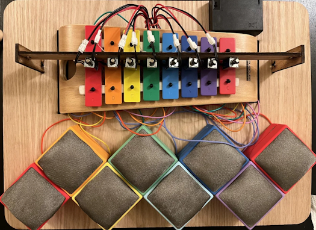](https://blog.adafruit.com/2025/05/06/capacitive-touch-xylophone-music-raspberrypi/)

A capacitive touch xylophone with CircuitPython and Raspberry Pi Pico - [Adafruit Blog](https://blog.adafruit.com/2025/05/06/capacitive-touch-xylophone-music-raspberrypi/), [Instructables](https://www.instructables.com/Capacitive-Touch-Xylophone/) and [YouTube]()https://youtu.be/l7NkIqXB7LE.

[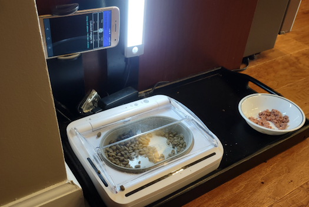](https://hackaday.io/project/194359-cat-bowl-monitor)

A smart cat bowl that uses facial recognition using Google CoLab in Python - [hackaday.io](https://hackaday.io/project/194359-cat-bowl-monitor).

[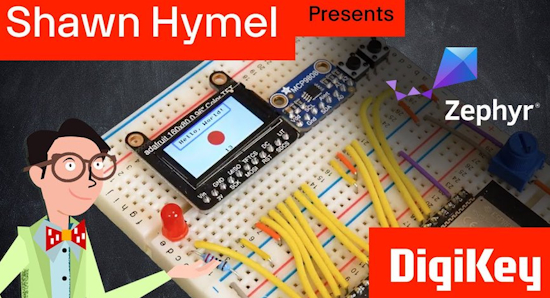](https://www.youtube.com/watch?v=Kfgln6RdoYc)

An introduction to Zephyr Part 10: Graphics with LVGL and display drivers - [YouTube](https://www.youtube.com/watch?v=Kfgln6RdoYc).

[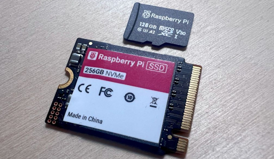](https://bret.dk/raspberry-pi-microsd-card-performance-across-the-pi-family/)

Raspberry Pi microSD card performance across the Pi family - [bret.dk](https://bret.dk/raspberry-pi-microsd-card-performance-across-the-pi-family/).

[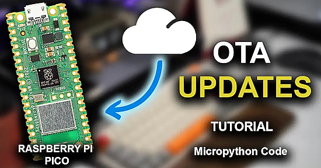](https://electrocredible.com/raspberry-pi-pico-ota-update-micropython/)

A Raspberry Pi Pico W over-the-air (OTA) update guide with MicroPython - [Electrocredible](https://electrocredible.com/raspberry-pi-pico-ota-update-micropython/).

[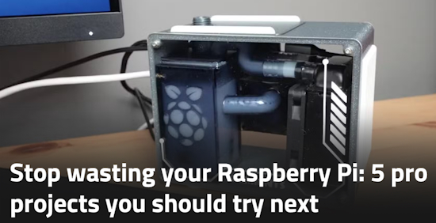](https://www.xda-developers.com/stop-wasting-raspberry-pi-pro-projects/)

Stop wasting your Raspberry Pi: 5 pro projects you should try next - [XDA](https://www.xda-developers.com/stop-wasting-raspberry-pi-pro-projects/).

This Raspberry Pi + Python project recreates your favorite 90s TV channels, down to the timeslots - [XDA](https://www.xda-developers.com/raspberry-pi-project-recreates-favorite-90s-tv-channels/), [GitHub](https://github.com/shane-mason/FieldStation42) and [YouTube](https://youtu.be/CDW1wokbRiQ).

[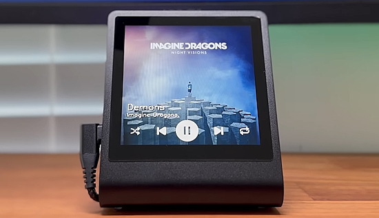](https://www.youtube.com/watch?v=iOz5XUVkFkY)

A Spotify music player with the RP2350 powered Presto and MicroPython - [YouTube](https://www.youtube.com/watch?v=iOz5XUVkFkY). Via [X](https://x.com/pimoroni/status/1920601318508335304).

[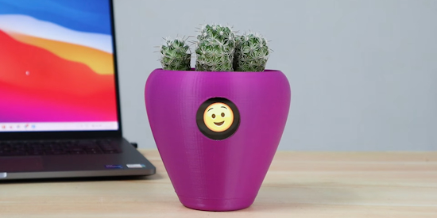](https://hackaday.io/project/186729-fyt-turn-your-plant-into-pet/details)

Fytó - The smart planter that turns plants into pets with Raspberry Pi and Python - [hackaday.io](https://hackaday.io/project/186729-fyt-turn-your-plant-into-pet/details) and [YouTube](https://youtu.be/zNNZdUzXV7M?feature=shared).

Two embeddeed.fm interviews with women who make beautiful art, mainly with smart LEDs:

An interview with CircuitPythonista and LED artist Debra GeekMomProjects Ansell - [embedded.fm](https://embedded.fm/episodes/494).

An interview with LED artist Janet Hansen - [embedded.fm](https://embedded.fm/episodes/499).

[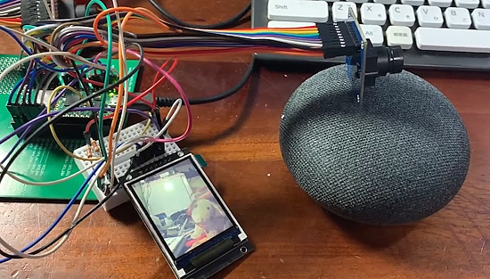](https://philkitty.blog.fc2.com/blog-entry-391.html)

OV7670 camera images displayed in real time on ST7789 TFT LCD with CircuitPython - [Relax Release](https://philkitty.blog.fc2.com/blog-entry-391.html) and [YouTube](https://youtu.be/O2wfpz8kJTw) (Japanese). Via [X](https://x.com/sakurakku/status/1920260248373506122).

[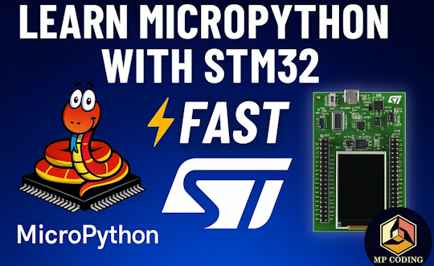](https://madhawapolkotuwa.medium.com/getting-started-with-micropython-on-stm32f4-discovery-stm32f429i-disco-3330d7a697f4)

Getting started with MicroPython on STM32F4 Discovery - [Medium](https://madhawapolkotuwa.medium.com/getting-started-with-micropython-on-stm32f4-discovery-stm32f429i-disco-3330d7a697f4) and [YouTube](https://youtu.be/yHrwD_o-vhE).

[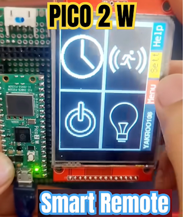](https://www.youtube.com/shorts/KX_Y98zW1zc)

A Raspberry Pi Pico 2 W smart remote with an ILI9341 touch display running CircuitPython - [YouTube](https://www.youtube.com/shorts/KX_Y98zW1zc). Via [X](https://x.com/Yakroo5077/status/1918876473684824265?s=03).

[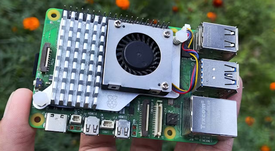](https://www.xda-developers.com/i-regret-working-on-these-4-raspberry-pi-projects/)

I regret working on these 4 Raspberry Pi projects - [XDA](https://www.xda-developers.com/i-regret-working-on-these-4-raspberry-pi-projects/).

Learn calculus by coding in Python - [freeCodeCamp](https://www.freecodecamp.org/news/learn-college-calculus-and-implement-with-python/) and [YouTube](https://youtu.be/VDFRpjQVaME).

[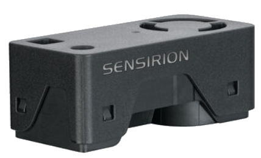](https://sites.google.com/site/beebox68k/atapi)

An Atari ST like case for a Raspberry Pi 5 computer - [Beeebox68k](https://sites.google.com/site/beebox68k/atapi).

## New

[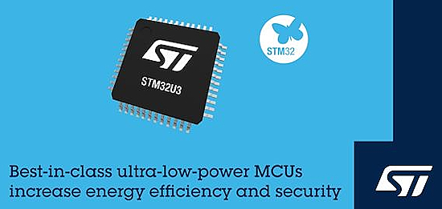](https://www.globenewswire.com/news-release/2025/03/04/3036607/0/en/stmicroelectronics-reveals-stm32u3-microcontrollers-extending-ultra-low-power-innovation-for-remote-smart-and-sustainable-applications.html)

STMicroelectronics reveals STM32U3 microcontrollers extending ultra-low power innovation for remote, smart and sustainable applications - [GlobeNewswire](https://www.globenewswire.com/news-release/2025/03/04/3036607/0/en/stmicroelectronics-reveals-stm32u3-microcontrollers-extending-ultra-low-power-innovation-for-remote-smart-and-sustainable-applications.html).

The Lattepanda Mu is an ultra-compact x86 single-board computer (SBC) powered by the Intel N100 with 8GB RAM, with the Lite Carrier Board, and it can run Windows 11 - [YouTube](https://www.youtube.com/watch?v=KpMRRJoCo58). Via [X](https://x.com/LattePandaCN/status/1919655573789769851?s=03).

## New Boards Supported by CircuitPython

The number of supported microcontrollers and Single Board Computers (SBC) grows every week. This section outlines which boards have been included in CircuitPython or added to [CircuitPython.org](https://circuitpython.org/).

This week there were no new boards added.

*Note: For non-Adafruit boards, please use the support forums of the board manufacturer for assistance, as Adafruit does not have the hardware to assist in troubleshooting.*

Looking to add a new board to CircuitPython? It's highly encouraged! Adafruit has four guides to help you do so:

- [How to Add a New Board to CircuitPython](https://learn.adafruit.com/how-to-add-a-new-board-to-circuitpython/overview)
- [How to add a New Board to the circuitpython.org website](https://learn.adafruit.com/how-to-add-a-new-board-to-the-circuitpython-org-website)
- [Adding a Single Board Computer to PlatformDetect for Blinka](https://learn.adafruit.com/adding-a-single-board-computer-to-platformdetect-for-blinka)
- [Adding a Single Board Computer to Blinka](https://learn.adafruit.com/adding-a-single-board-computer-to-blinka)

## New Learn Guides

The [Adafruit Learning System](https://learn.adafruit.com/) has over 3,000 free guides for learning skills and building projects including using Python.

## CircuitPython Libraries

The CircuitPython library numbers are continually increasing, while existing ones continue to be updated. Here we provide library numbers and updates!

To get the latest Adafruit libraries, download the [Adafruit CircuitPython Library Bundle](https://circuitpython.org/libraries). To get the latest community contributed libraries, download the [CircuitPython Community Bundle](https://circuitpython.org/libraries).

If you'd like to contribute to the CircuitPython project on the Python side of things, the libraries are a great place to start. Check out the [CircuitPython.org Contributing page](https://circuitpython.org/contributing). If you're interested in reviewing, check out Open Pull Requests. If you'd like to contribute code or documentation, check out Open Issues. We have a guide on [contributing to CircuitPython with Git and GitHub](https://learn.adafruit.com/contribute-to-circuitpython-with-git-and-github), and you can find us in the #help-with-circuitpython and #circuitpython-dev channels on the [Adafruit Discord](https://adafru.it/discord).

You can check out this [list of all the Adafruit CircuitPython libraries and drivers available](https://github.com/adafruit/Adafruit_CircuitPython_Bundle/blob/master/circuitpython_library_list.md). 

The current number of CircuitPython libraries is **523**!

**New Libraries**

Here's this week's new CircuitPython libraries:

  * [adafruit/Adafruit_CircuitPython_FruitJam](https://github.com/adafruit/Adafruit_CircuitPython_FruitJam)
  * [adafruit/Adafruit_CircuitPython_USB_Host_Mouse](https://github.com/adafruit/Adafruit_CircuitPython_USB_Host_Mouse)
  * [circuitpython/CircuitPython_Org_DisplayIO_Effects](https://github.com/circuitpython/CircuitPython_Org_DisplayIO_Effects)

**Updated Libraries**

Here's this week's updated CircuitPython libraries:

  * [2bndy5/CircuitPython_nRF24L01](https://github.com/2bndy5/CircuitPython_nRF24L01)

## What’s the CircuitPython team up to this week?

What is the team up to this week? Let’s check in:

**Tim**

I've been working on the Fruit Jam OS Launcher and Editor a lot this week. It's coming along very nicely, it can complete the full development cycle of opening a code file, editing it, saving the changes, running it, then going right back to the editor to make further changes. I've done some much needed UI improvements to add all of the available hotkeys visibly. I've made it possible to save files in /saves/ and /sd/ directories even when the rest of the storage is mounted as readonly. 

There is also now optional support for a USB mouse that you can use to click in the text file to move the cursor and start typing somewhere else. In the process of working on this I've spun off a few new libraries adafruit_argv_file and adafruit_usb_host_mouse that contain reusable bits of functionality that is used by the launcher, editor, and boot script, but can also be used by other 3rd party programs to allow them to accept arguments via a file, or interact with a USB mouse at a higher level.

**Scott**

This week I'm working part-time. I released 10.0.0-alpha.4 after folks found an issue with my garbage collection (GC) optimization change in 10.0.0-alpha.3. So, give alpha.4 a try!

**Liz**

This week I wrapped up documenting the code and circuit for the [2-axis camera slider](https://learn.adafruit.com/motorized-camera-slider-2-axis). This project uses CircuitPython and UART to control two TMC2209 stepper motor drivers. It's been really fun to use, and I hope folks are able to use the guide to build their own. Next up I've started working on a robotic toy piano instrument. This uses solenoid motors to play the keys. The hardest part of this project is the CAD, but I've got it in a good spot now and I can start documenting.

## Upcoming Events

The community is coming back to Pittsburgh, Pennsylvania for PyCon US 2025 May 14 - May 22, 2025 - [us.pycon.org](https://us.pycon.org/2025/).

The next MicroPython Meetup in Melbourne will be on May 28th – [Meetup](https://www.meetup.com/micropython-meetup/events). You can see recordings of previous meetings on [YouTube](https://www.youtube.com/@MicroPythonOfficial). 

KiCad conferences (KiCon) to be held this year include 28 - 30 May 2025 in San Diego, California, 19 - 20 Sept 2024 in Bochum, Germany, and to be determined in Asia - [KiCad](https://kicon.kicad.org/).

Open Hardware Summit 2025 is being held May 30 @ 10am - May 31 @ 6pm GMT+1 in Edinburgh, Scotland - [Eventbrite](https://www.eventbrite.com/e/open-hardware-summit-2025-tickets-1067611086499).

PyOhio 2025 will be held Saturday & Sunday July 26 & 27, 2025 at the Cleveland State University Student Center in Cleveland, Ohio - [PyOhio 2025](https://www.pyohio.org/2025/).

PyCon UK will be at CONTACT in Manchester from Friday 19th September to Monday 22nd September 2025 - [PyCon UK 2025](https://2025.pyconuk.org/).

**Send Your Events In**

If you know of virtual events or upcoming events, please let us know via email to cpnews(at)adafruit(dot)com.

## Latest Releases

CircuitPython's stable release is [9.2.7](https://github.com/adafruit/circuitpython/releases/latest) and its unstable release is [10.0.0-alpha.4](https://github.com/adafruit/circuitpython/releases). New to CircuitPython? Start with our [Welcome to CircuitPython Guide](https://learn.adafruit.com/welcome-to-circuitpython).

[20250509](https://github.com/adafruit/Adafruit_CircuitPython_Bundle/releases/latest) is the latest Adafruit CircuitPython library bundle.

[20250509](https://github.com/adafruit/CircuitPython_Community_Bundle/releases/latest) is the latest CircuitPython Community library bundle.

[v1.25.0](https://micropython.org/download) is the latest MicroPython release. Documentation for it is [here](http://docs.micropython.org/en/latest/pyboard/).

[3.13.3](https://www.python.org/downloads/) is the latest Python release. The latest pre-release version is [3.14.0b1](https://www.python.org/download/pre-releases/).

[4,261 Stars](https://github.com/adafruit/circuitpython/stargazers) Like CircuitPython? [Star it on GitHub!](https://github.com/adafruit/circuitpython)

## Call for Help -- Translating CircuitPython is now easier than ever

[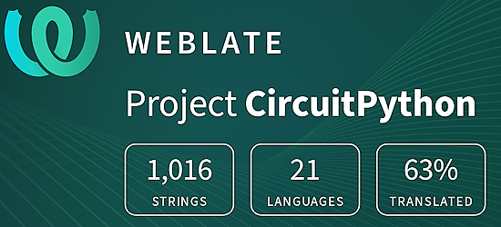](https://hosted.weblate.org/engage/circuitpython/)

One important feature of CircuitPython is translated control and error messages. With the help of fellow open source project [Weblate](https://weblate.org/), we're making it even easier to add or improve translations. 

Sign in with an existing account such as GitHub, Google or Facebook and start contributing through a simple web interface. No forks or pull requests needed! As always, if you run into trouble join us on [Discord](https://adafru.it/discord), we're here to help.

## 38,929 Thanks

The Adafruit Discord community, where we do all our CircuitPython development in the open, reached over 38,929 humans - thank you! Adafruit believes Discord offers a unique way for Python on hardware folks to connect. Join today at [https://adafru.it/discord](https://adafru.it/discord).

## ICYMI - In case you missed it

Python on hardware is the Adafruit Python video-newsletter-podcast! The news comes from the Python community, Discord, Adafruit communities and more and is broadcast on ASK an ENGINEER Wednesdays. The complete Python on Hardware weekly videocast [playlist is here](https://www.youtube.com/playlist?list=PLjF7R1fz_OOXRMjM7Sm0J2Xt6H81TdDev). The video podcast is on [iTunes](https://itunes.apple.com/us/podcast/python-on-hardware/id1451685192?mt=2), [YouTube](http://adafru.it/pohepisodes), [Instagram](https://www.instagram.com/adafruit/channel/)), and [XML](https://itunes.apple.com/us/podcast/python-on-hardware/id1451685192?mt=2).

[The weekly community chat on Adafruit Discord server CircuitPython channel - Audio / Podcast edition](https://itunes.apple.com/us/podcast/circuitpython-weekly-meeting/id1451685016) - Audio from the Discord chat space for CircuitPython, meetings are usually Mondays at 2pm ET, this is the audio version on [iTunes](https://itunes.apple.com/us/podcast/circuitpython-weekly-meeting/id1451685016), Pocket Casts, [Spotify](https://adafru.it/spotify), and [XML feed](https://adafruit-podcasts.s3.amazonaws.com/circuitpython_weekly_meeting/audio-podcast.xml).

## Contribute

The CircuitPython Weekly Newsletter is a CircuitPython community-run newsletter emailed every Monday. The complete [archives are here](https://www.adafruitdaily.com/category/circuitpython/). It highlights the latest CircuitPython related news from around the web including Python and MicroPython developments. To contribute, edit next week's draft [on GitHub](https://github.com/adafruit/circuitpython-weekly-newsletter/tree/gh-pages/_drafts) and [submit a pull request](https://help.github.com/articles/editing-files-in-your-repository/) with the changes. You may also tag your information on Twitter with #CircuitPython. 

Join the Adafruit [Discord](https://adafru.it/discord) or [post to the forum](https://forums.adafruit.com/viewforum.php?f=60) if you have questions.
