View this email in your browser. **Warning: Flashing Imagery**

Welcome to the latest Python on Microcontrollers newsletter! To no surprise, Python makes impressive gains in popularity this month. Some interesting new software has come out, new versions, of Visual Studio, VS Code, and Arduino Lab for MicroPython. And another alpha of CircuitPython shows new additions. FInally some interesting tidbits on Raspberry Pi boards. All this and some of the best Around the World projects and information of the year. Grab a tasty drink and happy reading. - *Anne Barela, Editor*

We're on [Discord](https://discord.gg/HYqvREz), [Twitter/X](https://twitter.com/search?q=circuitpython&src=typed_query&f=live), [BlueSky](https://bsky.app/profile/circuitpython.org) and for past newsletters - [view them all here](https://www.adafruitdaily.com/category/circuitpython/). If you're reading this on the web, please [subscribe here](https://www.adafruitdaily.com/). Here's the news this week:

## Python popularity climbs to highest ever – Tiobe

Python continues to soar in the Tiobe index of programming language popularity, rising 2.2% to a 25.35% share in May 2025. It’s the highest Tiobe rating for any language since 2001, when Java topped the chart. Python’s popularity increased roughly 2.2 percentage points in the past month - [InfoWorld](https://www.infoworld.com/article/3981643/python-popularity-climbs-to-highest-ever-tiobe.html).

## Agent Mode Arrives in Visual Studio and There is a New Visual Studio Code Version

Agent mode is now available in public preview for Visual Studio 17.14. Agent mode in Visual Studio allows defining tasks using natural language, with Copilot autonomously planning, editing a codebase, invoking tools, and iterating to resolve issues. Unlike Copilot Chat or Edits, agent mode using OpenAI’s GPT-4.1 doesn’t stop at one suggestion or file edit but works iteratively until the task is complete - [Microsoft](https://devblogs.microsoft.com/visualstudio/agent-mode-has-arrived-in-preview-for-visual-studio/?hide_banner=true) and [YouTube](https://www.youtube.com/watch?v=oPFecZHBCkg).

The latest version of VS Code delivers several Copilot enhancements - [GitHub Blog](https://github.blog/changelog/2025-05-08-github-copilot-in-vs-code-april-release-v1-100/) and [InfoWorld](https://www.infoworld.com/article/3982310/visual-studio-code-beefs-up-ai-coding-features.html).

**New:**

* Prompt caching and other enhancements now leads to faster agent edits, especially in large files.
* Prompt and instructions files customizes Copilot’s behavior with reusable prompts and coding guidelines.
* Select and attach UI elements in Copilot Chat with the built-in Simple Browser.

## New Version of Arduino Lab for MicroPython

[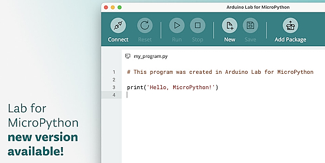](https://labs.arduino.cc/en/labs/micropython)

MicroPython Package Installer v0.20.0 has been released and is simpler to manage, with easy installs from Arduino’s index, micropython-lib, or a custom URL - [Arduino Labs](https://labs.arduino.cc/en/labs/micropython). Via the Arduino Newsletter.

**New features:**

* New Package Installer button
* Refreshed toolbar design
* Improved menu actions & shortcuts
* Bug fixes for better performance

## Booting the RP2350 from UART

[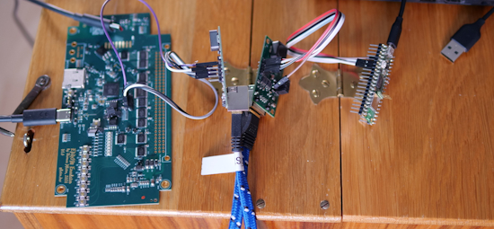](https://pfister.dev/blog/2025/rp2350-uart-bl.html)

The RP2350 has a few advantages over its predecessor. One of which is the ability to load firmware remotely via UART - [Thomas Pfister](https://pfister.dev/blog/2025/rp2350-uart-bl.html), [Codeberg](https://codeberg.org/retsifp/rp2350_uart) and [YouTube](https://youtu.be/eno0hiFSr18). Via [Hackaday](https://hackaday.com/2025/05/11/exploring-the-rp2350s-uart-bootloader/).

## CircuitPython 10.0.0-alpha.5 Released

CircuitPython 10.0.0-alpha.5 is an alpha release for 10.0.0. Further features, changes, and bug fixes will be added before a final release - [Adafruit Blog](https://blog.adafruit.com/2025/05/15/circuitpython-10-0-0-alpha-5-released/) and [Release Notes](https://github.com/adafruit/circuitpython/releases/tag/10.0.0-alpha.5).

**Highlights of this release**

* Add stability fixes for Espressif port builds.
* Add fixes for direct connecting USB devices to PIO USB host.
* Improve accuracy of `time.sleep()` and similar functions.
* Add `MixerVoice.end()`.
* Change partition layout for Adafruit Feather ESP32-S3 4MB Flash 2MB PSRAM board, allowing BLE and other features to be enabled.

## A "Currently Undocumented" Raspberry Pi Feature for Secure A/B Updates

[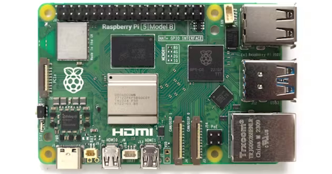](https://www.hackster.io/news/olivier-benjamin-finds-a-currently-undocumented-raspberry-pi-feature-for-secure-a-b-updates-0df38de1c9e6)

Embedded engineering firm Bootlin has published a write-up of a project that required A/B-capable secure over-the-air (OTA) updates to a Raspberry Pi 5 target — and how they achieved it using the Robust Auto-Update Controller (RAUC) and the stock Raspberry Pi firmware, thanks to a somewhat-hidden new feature - [hackster.io](https://www.hackster.io/news/olivier-benjamin-finds-a-currently-undocumented-raspberry-pi-feature-for-secure-a-b-updates-0df38de1c9e6).

## This Week's Python Streams

Python on Hardware is all about building a cooperative ecosphere which allows contributions to be valued and to grow knowledge. Below are the streams within the last week focusing on the community.

**CircuitPython Deep Dive Stream**

[Last Friday](https://youtube.com/live/JbnzGoYteJk), Tim streamed work on the new Sparkle Motion Stick setup and writing examples.

You can see the latest video and past videos on the Adafruit YouTube channel under the Deep Dive playlist - [YouTube](https://www.youtube.com/playlist?list=PLjF7R1fz_OOXBHlu9msoXq2jQN4JpCk8A).

**CircuitPython Parsec**

John Park’s CircuitPython Parsec this week is on Seesaw Analog Read - [Adafruit Blog](https://blog.adafruit.com/2025/05/16/john-parks-circuitpython-parsec-seesaw-analog-read/) and [YouTube](https://youtu.be/7hb6j-cR6Mc).

Catch all the episodes in the [YouTube playlist](https://www.youtube.com/playlist?list=PLjF7R1fz_OOWFqZfqW9jlvQSIUmwn9lWr).

**The CircuitPython Show**

In the latest episode of The CircuitPython Show, Paul welcomes Justin Myers. Justin shares how he started with computers and electronics and how he developed `connectionmanager` to make networking easier in CircuitPython - [The CircuitPython Show](https://www.circuitpythonshow.com/@circuitpythonshow).

**CircuitPython Weekly Meeting**

CircuitPython Weekly Meeting for May 12, 2025 ([notes](https://github.com/adafruit/adafruit-circuitpython-weekly-meeting/blob/main/2025/2025-05-12.md)) [on YouTube](https://youtu.be/GWRaM4E6SEM).

## Project of the Week: Leet AI

[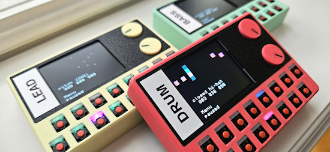](https://github.com/vonkonow/LeetAI)

Leet AI is a pocket-sized synthesizer concept that explores what happens when many simple instruments work together—like a miniature electronic orchestra. Leet AI embraces a modular philosophy: multiple open-source, affordable units, each with a specific voice, combining to create something greater than the sum of their parts. Built with CircuitPython on an ESP32-S2 and a 1.8” 160x128 TFT color screen - [Project Page](https://vonkonow.com/leetai/), [GitHub](https://github.com/vonkonow/LeetAI) and [YouTube](https://www.youtube.com/watch?v=MnzYHhDXu_o). Via [Reddit](https://www.reddit.com/r/circuitpython/comments/1kibt9o/circuitpython_esp32s2_ai_modular_synth_with_live/).

## Popular Last Week

What was the most popular, most clicked link, in [last week's newsletter](https://www.adafruitdaily.com/2025/05/12/python-on-microcontrollers-newsletter-raspberry-pi-os-connect-updates-circuitpython-beta-4-and-more-circuitpython-python-micropython-thepsf-raspberry_pi/)? [High tariffs become ‘real’ with our first $36K bill](https://blog.adafruit.com/2025/05/08/high-tariffs-become-real-with-our-first-36k-bill/).

Did you know you can read past issues of this newsletter in the Adafruit Daily Archive? [Check it out](https://www.adafruitdaily.com/category/circuitpython/).

## Write Your Own Notes on Adafruit Playground

[Adafruit Playground](https://adafruit-playground.com/) is a new place for the community to post their projects and other making tips/tricks/techniques. Ad-free, it's an easy way to publish your work in a safe space for free.

## News From Around the Web

ESP-NOW-MIDI is an Arduino and CircuitPython library for sending and receiving MIDI messages via the ESP-NOW protocol. A typical setup requires two ESP-NOW capable boards, where the board connected to your computer needs to be MIDI-capable - [GitHub](https://github.com/thomasgeissl/ESP-NOW-MIDI).

What programing framework should someone use for microcontrollers? Shawn Hymel talks about it in a short video - [X](https://x.com/digikey/status/1922560100931154430).

[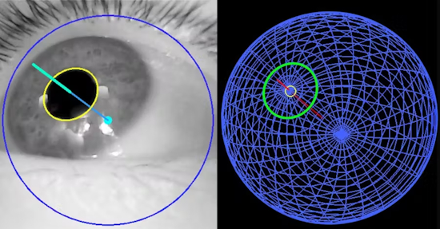](https://www.hackster.io/news/ar-and-vr-researcher-jason-orlosky-gets-gaze-tracking-working-in-python-for-under-20-f8de7b7de5e9)

Gaze-tracking in Python for under $20 - [hackster.io](https://www.hackster.io/news/ar-and-vr-researcher-jason-orlosky-gets-gaze-tracking-working-in-python-for-under-20-f8de7b7de5e9).

Introduction to Zephyr Part 11: WiFi and IoT - [site](https://www.youtube.com/watch?v=0ONIU4JRnHE). Via [X](https://x.com/ShawnHymel/status/1923106003232461116).

[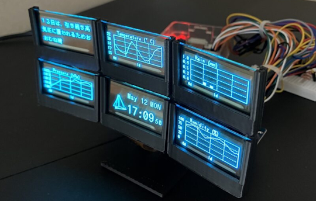](https://sozorablog.com/pi-transparent-oled/)

Using transparent OLED displays with Raspberry Pi and Python - [sozorablog](https://sozorablog.com/pi-transparent-oled/) (Japanese). Via [X](https://x.com/sozoraemon/status/1922972572393537772?s=03).

[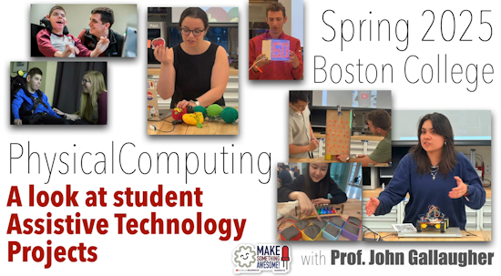](https://www.youtube.com/watch?v=VKkg03EOk0Q)

Boston College assistive tech projects, Spring 2025, many use CircuitPython - [YouTube](https://www.youtube.com/watch?v=VKkg03EOk0Q). Via [Mastodon](https://mastodon.social/@gallaugher@mastodon.world/114479957323300896).

[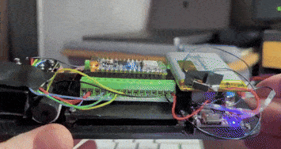](https://x.com/CosminDolha/status/1921575105496293533)

A CircuitPython joystick test on Arduino Nano esp 32 S3 with an Adafruit Sharp Memory Display - [X](https://x.com/CosminDolha/status/1921575105496293533).

An article on the ROMFS file system now in MicroPython v1.25 - [elektroda.pl](https://www.elektroda.pl/rtvforum/topic4122191.html) (Polish).

[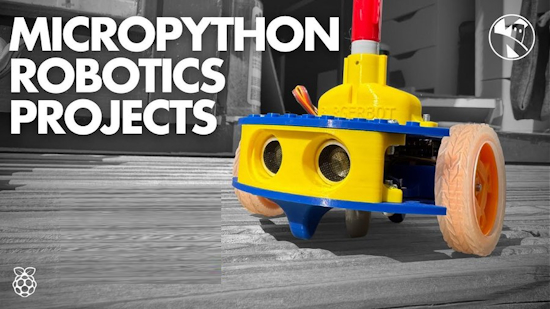](https://www.youtube.com/watch?v=6YqzOQ7OZkQ)

Can MicroPython handle real robotics? Find out with Kevin McAleer - [YouTube](https://www.youtube.com/watch?v=6YqzOQ7OZkQ).

[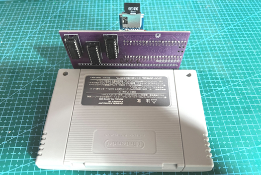](https://codeberg.org/xsk/sfc-cartridge-pico)

A Super Famicom cartridge reader implemented in MicroPython, for use with a Raspberry Pi Pico - [Codeberg](https://codeberg.org/xsk/sfc-cartridge-pico).

A MIDI controlled acoustic crank organ with an ESP32-S3 N16R8 and MicroPython - [GitHub](https://github.com/orgs/micropython/discussions/17278) and [YouTube](https://www.youtube.com/watch?v=gbV-u4Oz1Xo). Via [Mastodon](https://mastodon.social/@scruss@xoxo.zone/114483758157827451).

[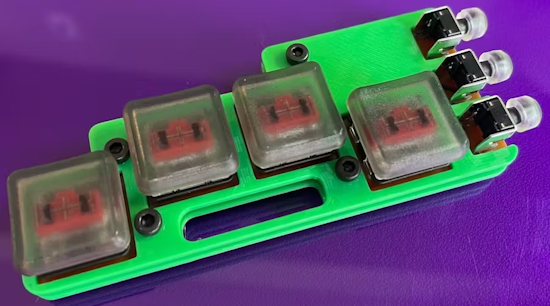](https://www.hackster.io/mikeysklar/c7k-keychain-7367bd)

The c7k keychain is a chording 7 key wearable I2C keyboard running CircuitPython - [hackster.io](https://www.hackster.io/mikeysklar/c7k-keychain-7367bd).

[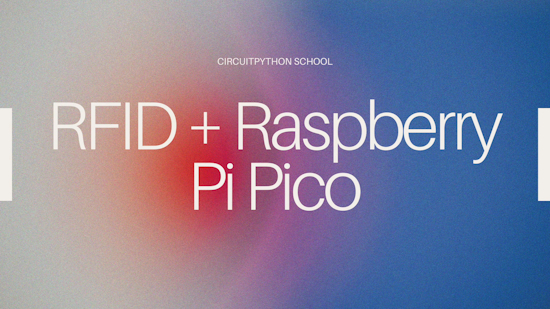](https://www.youtube.com/watch?v=XCZ5Yf09HM4)

Abby Bergman, a Ph.D. student in the Boston College Physical Computing course, details how to use RFID with CircuitPython and the Raspberry Pi Pico - [YouTube](https://www.youtube.com/watch?v=XCZ5Yf09HM4).

[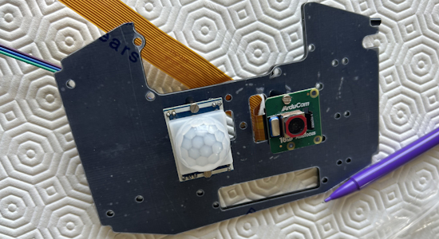](https://hackaday.io/project/203104-whosthatbird)

Who's That Bird captures photos and images of birds and classifies them at a species and individual level, with Raspberry Pi and Python - [Hackaday.io](https://hackaday.io/project/203104-whosthatbird).

[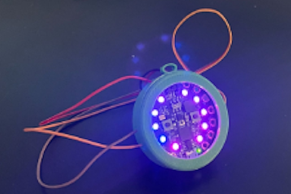](https://www.instructables.com/Party-Necklace/)

Making a party necklace with a Circuit Playground Express and CircuitPython - [Instructables](https://www.instructables.com/Party-Necklace/).

[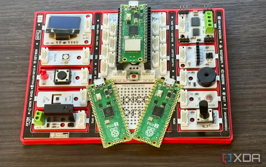](https://www.xda-developers.com/raspberry-pi-pico-projects-cost-under-10/)

5 Raspberry Pi Pico projects that cost under $10 but feel magical - [XDA](https://www.xda-developers.com/raspberry-pi-pico-projects-cost-under-10/).

How to use template strings in Python 3.14 - [InfoWorld](https://www.infoworld.com/article/3977626/how-to-use-template-strings-in-python-3-14.html).

[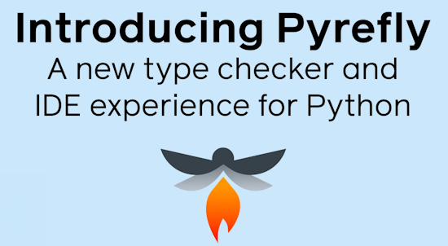](https://engineering.fb.com/2025/05/15/developer-tools/introducing-pyrefly-a-new-type-checker-and-ide-experience-for-python/)

Pyrefly: A new type checker and IDE experience for Python - [Meta Engineering](https://engineering.fb.com/2025/05/15/developer-tools/introducing-pyrefly-a-new-type-checker-and-ide-experience-for-python/).

The adventure of getting a customized version of MicroPython running on a custom circuit board, to integrate with a pocketqube satellite and make it into low Eath orbit - 
[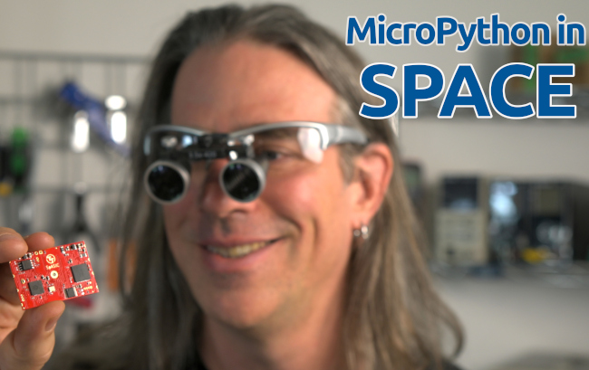](https://youtu.be/ToPX98kjwP8)

## New

[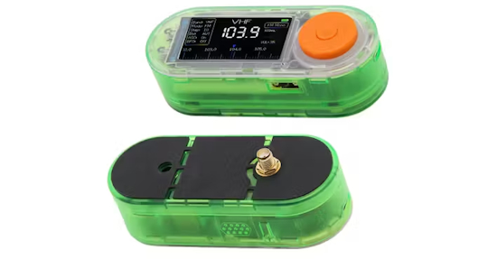](https://www.hackster.io/news/lilygo-s-new-t-embed-si4732-is-a-pocket-friendly-programmable-espressif-esp32-powered-radio-47607a8f3e73)

LILYGO's new T-Embed SI4732 is a pocket-friendly programmable Espressif ESP32-powered radio. FM, AM, LW, SW courtesy of a Skyworks Si4732 CMOS radio receiver connected to an Espressif ESP32-S3 - [hackster.io](https://www.hackster.io/news/lilygo-s-new-t-embed-si4732-is-a-pocket-friendly-programmable-espressif-esp32-powered-radio-47607a8f3e73).

[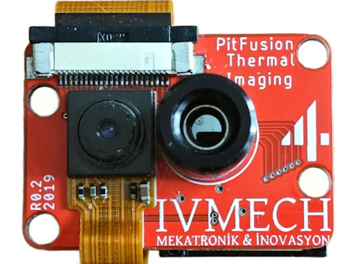](https://www.cnx-software.com/2025/05/16/pitfusion-thermal-imager-for-raspberry-pi-combines-melexis-mlx90640-sensor-and-rgb-camera/)

The PitFusion thermal imager for Raspberry Pi combines a Melexis MLX90640 sensor and an RGB camera. It uses an Adafruit LX90640 with 32 x 24 pixel array and Adafruit 0V5647 camera sensor, comparable to the RPi Camera Module v1.3 with 2592 x 1944 resolution - [CNX Software](https://www.cnx-software.com/2025/05/16/pitfusion-thermal-imager-for-raspberry-pi-combines-melexis-mlx90640-sensor-and-rgb-camera/).

## New Boards Supported by CircuitPython

The number of supported microcontrollers and Single Board Computers (SBC) grows every week. This section outlines which boards have been included in CircuitPython or added to [CircuitPython.org](https://circuitpython.org/).

This week there were 20 new boards added!

- [W5500-EVB-Pico2 by WIZnet](https://circuitpython.org/board/wiznet_w5500_evb_pico2/)
- [Cygnet by Blues Inc](https://circuitpython.org/board/blues_cygnet/)
- [Feather RP2350 Adalogger by Adafruit](https://circuitpython.org/board/adafruit_feather_rp2350_adalogger/)
- [Adafruit Sparkle Motion by Adafruit](https://circuitpython.org/board/adafruit_sparkle_motion_stick/)
- [Banana Pi BPI-F3 by SinoVoip](https://circuitpython.org/blinka/banana_pi_bpi_f3/) (Blinka)
- [Banana Pi BPI-M4 Berry by SinoVoip](https://circuitpython.org/blinka/banana_pi_bpi_m4_berry/) (Blinka)
- [Banana Pi BPI-M4 Zero by SinoVoip](https://circuitpython.org/blinka/banana_pi_bpi_m4_zero/) (Blinka)
- [INDIEDROID NOVA by INDIEDROID](https://circuitpython.org/blinka/indiedroid_nova/) (Blinka)
- [Orange Pi 3B by Shenzhen Xunlong Software](https://circuitpython.org/blinka/orange_pi_3b/) (Blinka)
- [Pi 500 Desktop by Raspberry Pi](https://circuitpython.org/blinka/raspberry_pi_500/) (Blinka)
- [Compute Module 5 IO Board by Raspberry Pi](https://circuitpython.org/blinka/raspberry_pi_cm5io/) (Blinka)
- [Orange Pi 3 LTS by Shenzhen Xunlong Software](https://circuitpython.org/blinka/orange_pi_3_lts/) (Blinka)
- [Banana Pi BPI-F5 by SinoVoip](https://circuitpython.org/blinka/banana_pi_bpi_f5/) (Blinka)
- [D-Robotics RDK-X3 by D-Robotics](https://circuitpython.org/blinka/d-robotics_rdk-x3/) (Blinka)
- [FT4232H by Future Technology Devices International](https://circuitpython.org/blinka/ft4232h/) (Blinka)
- [Orange Pi 5 Max by Shenzhen Xunlong Software](https://circuitpython.org/blinka/orange_pi_5_max/) (Blinka)
- [Rock 3B by Radxa Limited](https://circuitpython.org/blinka/radxa_rock_3b/) (Blinka)
- [Vicharak Axon by Vicharak](https://circuitpython.org/blinka/vicharak_axon/) (Blinka)
- [Vicharak Vaaman by Vicharak](https://circuitpython.org/blinka/vicharak_vaaman/) (Blinka)
- [Banana Pi BPI-AI2H with BPI-AI2N Carrier by SinoVoip](https://circuitpython.org/blinka/banana_pi_bpi_ai2h_ai2n/) (Blinka)

*Note: For non-Adafruit boards, please use the support forums of the board manufacturer for assistance, as Adafruit does not have the hardware to assist in troubleshooting.*

Looking to add a new board to CircuitPython? It's highly encouraged! Adafruit has four guides to help you do so:

- [How to Add a New Board to CircuitPython](https://learn.adafruit.com/how-to-add-a-new-board-to-circuitpython/overview)
- [How to add a New Board to the circuitpython.org website](https://learn.adafruit.com/how-to-add-a-new-board-to-the-circuitpython-org-website)
- [Adding a Single Board Computer to PlatformDetect for Blinka](https://learn.adafruit.com/adding-a-single-board-computer-to-platformdetect-for-blinka)
- [Adding a Single Board Computer to Blinka](https://learn.adafruit.com/adding-a-single-board-computer-to-blinka)

## New Learn Guides

[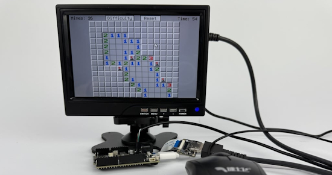](https://learn.adafruit.com/guides/latest)

The Adafruit Learning System has over 3,000 free guides for learning skills and building projects including using Python.

[Minesweeper on Metro RP2350](https://learn.adafruit.com/minesweeper-on-metro-rp2350) from [M. LeBlanc-Williams](https://learn.adafruit.com/u/MakerMelissa)

[Motorized Camera Slider 2-Axis](https://learn.adafruit.com/motorized-camera-slider-2-axis) from [Ruiz Brothers](https://learn.adafruit.com/u/pixil3d) and [Liz Clark](https://learn.adafruit.com/u/BlitzCityDIY)

[World Clock](https://learn.adafruit.com/world-clock) from [Ben Everard](https://learn.adafruit.com/world-clock)

## CircuitPython Libraries

The CircuitPython library numbers are continually increasing, while existing ones continue to be updated. Here we provide library numbers and updates!

To get the latest Adafruit libraries, download the [Adafruit CircuitPython Library Bundle](https://circuitpython.org/libraries). To get the latest community contributed libraries, download the [CircuitPython Community Bundle](https://circuitpython.org/libraries).

If you'd like to contribute to the CircuitPython project on the Python side of things, the libraries are a great place to start. Check out the [CircuitPython.org Contributing page](https://circuitpython.org/contributing). If you're interested in reviewing, check out Open Pull Requests. If you'd like to contribute code or documentation, check out Open Issues. We have a guide on [contributing to CircuitPython with Git and GitHub](https://learn.adafruit.com/contribute-to-circuitpython-with-git-and-github), and you can find us in the #help-with-circuitpython and #circuitpython-dev channels on the [Adafruit Discord](https://adafru.it/discord).

You can check out this [list of all the Adafruit CircuitPython libraries and drivers available](https://github.com/adafruit/Adafruit_CircuitPython_Bundle/blob/master/circuitpython_library_list.md). 

The current number of CircuitPython libraries is **525**!

**New Libraries**

Here's this week's new CircuitPython libraries:

  * [adafruit/Adafruit_CircuitPython_MIDI_Parser](https://github.com/adafruit/Adafruit_CircuitPython_MIDI_Parser)
  * [joepardue/circuitpython-as7343](https://github.com/joepardue/circuitpython-as7343)

**Updated Libraries**

Here's this week's updated CircuitPython libraries:

  * [adafruit/Adafruit_CircuitPython_Pathlib](https://github.com/adafruit/Adafruit_CircuitPython_Pathlib)
  * [adafruit/Adafruit_CircuitPython_USB_Host_Mouse](https://github.com/adafruit/Adafruit_CircuitPython_USB_Host_Mouse)
  * [adafruit/Adafruit_CircuitPython_DS1841](https://github.com/adafruit/Adafruit_CircuitPython_DS1841)
  * [adafruit/Adafruit_CircuitPython_RA8875](https://github.com/adafruit/Adafruit_CircuitPython_RA8875)
  * [adafruit/Adafruit_CircuitPython_BLE_Eddystone](https://github.com/adafruit/Adafruit_CircuitPython_BLE_Eddystone)

## What’s the CircuitPython team up to this week?

What is the team up to this week? Let’s check in:

**Dan**

I was away for a couple of weeks but am now back and have caught up.

CircuitPython 10.0.0 is a lot closer now, with about 20 issues to address left on the 10.0.0 milestone. Eightycc and I will be working on these while Scott is away on leave.

I fixed a bug on the Nordic port that caused `microcontroller.cpu.reset_reason` not to be updated in some cases.

**Tim**

This week I updated the core `tilepalettemapper` module to be more integrated with `TileGrid` and to take advantage of some internal behavior of `TileGrid` to make the mapper only cause a single tile to get refreshed when a mapping is updated instead of the entire grid. This was a done in anticipation of using `TilePaletteMapper` for the visible cursor inside of the editor, which I also did this week. I've also started working on updating all of the CircuitPython libraries to use Ruff instead of pylint and Black, I've been using Claude Code for that process and it has sped up the process quite substantially, there were about 300 that needed updating when I started so the speed is welcome.

**Scott**

This last week I worked part time fixing bugs and I'm starting the remaining eight weeks of my paternity leave tomorrow. This week I fixed four bugs:

- Fixed `vectorio` in group tracking so they can’t be added to multiple groups.
- Fixed RISC-V register collection for GC.
- Removed non-standard `sys.print_exception()` and removed one of two traceback object implementations we had added to CP.
- Fixed terminal initialization after setting a new rotation.

**Liz**

This week I wrote a new [CircuitPython helper library called MIDI Parser](https://github.com/adafruit/Adafruit_CircuitPython_MIDI_Parser). It lets you read MIDI files (.mid) in CircuitPython and "play" them with the included BPM in the file if available. This came out of the new toy robot xylophone I've been working on. I wanted to have it be able to act as a music box and play music on its own. I had written code to do this in the code.py file and then realized it could be broken out into its own helper library. 

## Upcoming Events

The community is coming back to Pittsburgh, Pennsylvania for PyCon US 2025 May 14 - May 22, 2025 - [us.pycon.org](https://us.pycon.org/2025/).

The next MicroPython Meetup in Melbourne will be on May 28th – [Meetup](https://www.meetup.com/micropython-meetup/events). You can see recordings of previous meetings on [YouTube](https://www.youtube.com/@MicroPythonOfficial). 

KiCad conferences (KiCon) to be held this year include 28 - 30 May 2025 in San Diego, California, 19 - 20 Sept 2024 in Bochum, Germany, and to be determined in Asia - [KiCad](https://kicon.kicad.org/).

Open Hardware Summit 2025 is being held May 30 @ 10am - May 31 @ 6pm GMT+1 in Edinburgh, Scotland - [Eventbrite](https://www.eventbrite.com/e/open-hardware-summit-2025-tickets-1067611086499).

PyOhio 2025 will be held Saturday & Sunday July 26 & 27, 2025 at the Cleveland State University Student Center in Cleveland, Ohio - [PyOhio 2025](https://www.pyohio.org/2025/).

PyCon UK will be at CONTACT in Manchester from Friday 19th September to Monday 22nd September 2025 - [PyCon UK 2025](https://2025.pyconuk.org/).

**Send Your Events In**

If you know of virtual events or upcoming events, please let us know via email to cpnews(at)adafruit(dot)com.

## Latest Releases

CircuitPython's stable release is [9.2.6](https://github.com/adafruit/circuitpython/releases/latest) and its unstable release is [10.0.0-alpha.5](https://github.com/adafruit/circuitpython/releases). New to CircuitPython? Start with our [Welcome to CircuitPython Guide](https://learn.adafruit.com/welcome-to-circuitpython).

[20250516](https://github.com/adafruit/Adafruit_CircuitPython_Bundle/releases/latest) is the latest Adafruit CircuitPython library bundle.

[20250516](https://github.com/adafruit/CircuitPython_Community_Bundle/releases/latest) is the latest CircuitPython Community library bundle.

[v1.25.0](https://micropython.org/download) is the latest MicroPython release. Documentation for it is [here](http://docs.micropython.org/en/latest/pyboard/).

[3.13.3](https://www.python.org/downloads/) is the latest Python release. The latest pre-release version is [3.14.0b1](https://www.python.org/download/pre-releases/).

[4,267 Stars](https://github.com/adafruit/circuitpython/stargazers) Like CircuitPython? [Star it on GitHub!](https://github.com/adafruit/circuitpython)

## Call for Help -- Translating CircuitPython is now easier than ever

[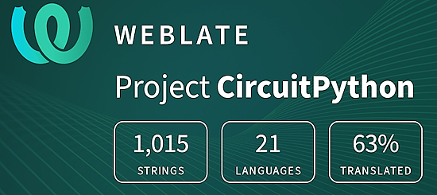](https://hosted.weblate.org/engage/circuitpython/)

One important feature of CircuitPython is translated control and error messages. With the help of fellow open source project [Weblate](https://weblate.org/), we're making it even easier to add or improve translations. 

Sign in with an existing account such as GitHub, Google or Facebook and start contributing through a simple web interface. No forks or pull requests needed! As always, if you run into trouble join us on [Discord](https://adafru.it/discord), we're here to help.

## 38,936 Thanks

The Adafruit Discord community, where we do all our CircuitPython development in the open, reached over 38,936 humans - thank you! Adafruit believes Discord offers a unique way for Python on hardware folks to connect. Join today at [https://adafru.it/discord](https://adafru.it/discord).

## ICYMI - In case you missed it

Python on hardware is the Adafruit Python video-newsletter-podcast! The news comes from the Python community, Discord, Adafruit communities and more and is broadcast on ASK an ENGINEER Wednesdays. The complete Python on Hardware weekly videocast [playlist is here](https://www.youtube.com/playlist?list=PLjF7R1fz_OOXRMjM7Sm0J2Xt6H81TdDev). The video podcast is on [iTunes](https://itunes.apple.com/us/podcast/python-on-hardware/id1451685192?mt=2), [YouTube](http://adafru.it/pohepisodes), [Instagram](https://www.instagram.com/adafruit/channel/)), and [XML](https://itunes.apple.com/us/podcast/python-on-hardware/id1451685192?mt=2).

[The weekly community chat on Adafruit Discord server CircuitPython channel - Audio / Podcast edition](https://itunes.apple.com/us/podcast/circuitpython-weekly-meeting/id1451685016) - Audio from the Discord chat space for CircuitPython, meetings are usually Mondays at 2pm ET, this is the audio version on [iTunes](https://itunes.apple.com/us/podcast/circuitpython-weekly-meeting/id1451685016), Pocket Casts, [Spotify](https://adafru.it/spotify), and [XML feed](https://adafruit-podcasts.s3.amazonaws.com/circuitpython_weekly_meeting/audio-podcast.xml).

## Contribute

The CircuitPython Weekly Newsletter is a CircuitPython community-run newsletter emailed every Monday. The complete [archives are here](https://www.adafruitdaily.com/category/circuitpython/). It highlights the latest CircuitPython related news from around the web including Python and MicroPython developments. To contribute, edit next week's draft [on GitHub](https://github.com/adafruit/circuitpython-weekly-newsletter/tree/gh-pages/_drafts) and [submit a pull request](https://help.github.com/articles/editing-files-in-your-repository/) with the changes. You may also tag your information on Twitter with #CircuitPython. 

Join the Adafruit [Discord](https://adafru.it/discord) or [post to the forum](https://forums.adafruit.com/viewforum.php?f=60) if you have questions.
