- [ ] Library and info updates
- [ ] change date
- [ ] update title
- [ ] Feature story
- [ ] Update  for images
- [ ] Update ICYDNCI
- [ ] All images 550w max only
- [ ] Link "View this email in your browser."

News Sources

- [Adafruit Playground](https://adafruit-playground.com/)
- Twitter: [CircuitPython](https://twitter.com/search?q=circuitpython&src=typed_query&f=live), [MicroPython](https://twitter.com/search?q=micropython&src=typed_query&f=live) and [Python](https://twitter.com/search?q=python&src=typed_query)
- [Raspberry Pi News](https://www.raspberrypi.com/news/)
- Mastodon [CircuitPython](https://mastodon.social/tags/CircuitPython) and [MicroPython](https://mastodon.social/tags/MicroPython)
- [hackster.io CircuitPython](https://www.hackster.io/search?q=circuitpython&i=projects&sort_by=most_recent) and [MicroPython](https://www.hackster.io/search?q=micropython&i=projects&sort_by=most_recent)
- YouTube: [CircuitPython](https://www.youtube.com/results?search_query=circuitpython&sp=CAI%253D), [MicroPython](https://www.youtube.com/results?search_query=micropython&sp=CAI%253D), [Prof Gallaugher](https://www.youtube.com/@BuildWithProfG/videos), [Teacher Brogan M. Pratt CircuitPython](https://www.youtube.com/playlist?list=PLRHdgFNRLyaN6eCw8b0yoHKDY9B4GiirU), [Teacher Brogan M. Pratt CircuitPython search](https://www.youtube.com/@BroganMPratt/search?query=circuitpython)
- Instructables: [CircuitPython](https://www.instructables.com/search/?q=circuitpython&projects=all&sort=Newest), [MicroPython](https://www.instructables.com/search/?q=micropython&projects=all&sort=Newest), [Raspberry Pi Python](https://www.instructables.com/search/?q=raspberry+pi+python&projects=all&sort=Newest)
- [hackaday CircuitPython](https://hackaday.com/blog/?s=circuitpython) and [MicroPython](https://hackaday.com/blog/?s=micropython)
- [python.org](https://www.python.org/)
- [Python Insider - dev team blog](https://pythoninsider.blogspot.com/)
- Individuals: [Jeff Geerling](https://www.jeffgeerling.com/blog), [Yakroo](https://x.com/Yakroo5077)
- Tom's Hardware: [CircuitPython](https://www.tomshardware.com/search?searchTerm=circuitpython&articleType=all&sortBy=publishedDate) and [MicroPython](https://www.tomshardware.com/search?searchTerm=micropython&articleType=all&sortBy=publishedDate) and [Raspberry Pi](https://www.tomshardware.com/search?searchTerm=raspberry%20pi&articleType=all&sortBy=publishedDate)
- [hackaday.io newest projects MicroPython](https://hackaday.io/projects?tag=micropython&sort=date) and [CircuitPython](https://hackaday.io/projects?tag=circuitpython&sort=date)
- [Google News Python](https://news.google.com/topics/CAAqIQgKIhtDQkFTRGdvSUwyMHZNRFY2TVY4U0FtVnVLQUFQAQ?hl=en-US&gl=US&ceid=US%3Aen)
- hackaday.io - [CircuitPython](https://hackaday.io/search?term=circuitpython) and [MicroPython](https://hackaday.io/search?term=micropython)

View this email in your browser. **Warning: Flashing Imagery**

Welcome to the latest Python on Microcontrollers newsletter! *insert 2-3 sentences from editor (what's in overview, banter)* - *Anne Barela, Editor*

We're on [Discord](https://discord.gg/HYqvREz), [Twitter/X](https://twitter.com/search?q=circuitpython&src=typed_query&f=live), [BlueSky](https://bsky.app/profile/circuitpython.org) and for past newsletters - [view them all here](https://www.adafruitdaily.com/category/circuitpython/). If you're reading this on the web, please [subscribe here](https://www.adafruitdaily.com/). Here's the news this week:

## Special: Microsoft Releases More Software as Open Source

Microsoft has open-sources additional software of interest to programmers - [Microsoft](https://opensource.microsoft.com/).

### GitHub Copilot Extension in VS Code Goes Open Source

Microsoft is open-sourcing its signature GitHub Copilot Chat extension within Visual Studio Code (VS Code) and embedding core AI capabilities directly into the code editor. Unveiled at Microsoft Build 2025 by CEO Satya Nadella, the move fundamentally shifts expectations for what a modern integrated development environment (IDE) should deliver, especially in an era where artificial intelligence is no longer an add-on but becoming a central player in developer workflows - [Windows Forum](https://windowsforum.com/threads/microsoft-open-sources-github-copilot-chat-in-vs-code-revolutionizing-ai-driven-development.367140/) and [YouTube](https://www.youtube.com/watch?v=GMmaYUcdMyU).

### Windows Subsystem for Linux is Now Open Source

[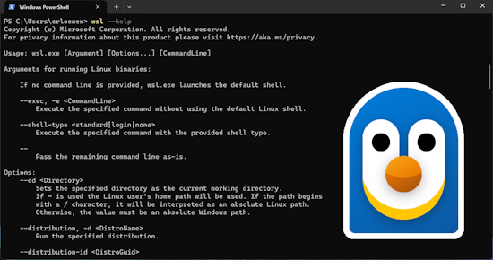](https://github.com/microsoft/WSL/tree/2.5.7)

Windows Subsystem for Linux (WSL), the ability to run Linux distributions within Windows, is now Open Source. The code that powers WSL is available on GitHub - [Microsoft](https://learn.microsoft.com/en-us/windows/wsl/opensource) and [GitHub](https://github.com/microsoft/WSL/tree/2.5.7). Via [X](https://x.com/craigaloewen/status/1924497512192483387).

## Securing the Model Context Protocol: Building a Safer Agentic Future on Windows

As AI agents become more capable and integrated into daily workflows, the need for secure, standardized communication between tools and agents has never been greater. At Microsoft Build 2025, Microsoft announced an early preview of how Windows 11 is embracing the Model Context Protocol (MCP) as a foundational layer for secure, interoperable agentic computing - [Windows Blog](https://blogs.windows.com/windowsexperience/2025/05/19/securing-the-model-context-protocol-building-a-safer-agentic-future-on-windows/) and [Anil Dash](https://www.anildash.com//2025/05/20/mcp-web20-20/). Via [X](https://x.com/windowsdev/status/1924543741060071521?s=31).

> "MCP is a lightweight, open protocol — essentially JSON-RPC over HTTP — that allows agents and applications to discover and invoke tools in a standardized way. It enables seamless orchestration across local and remote services, allowing developers to build once and integrate everywhere."

## PyCon US 2025 Videos Available

Viideos of the talks at the recent PyCon US are now available on YouTube. Some excellent talks on a variety of Python topics - [YouTube Playlist](https://www.youtube.com/playlist?list=PL2Uw4_HvXqvb98mQjN0-rYQjdDxJ_hcrs).

## MicroPython Goes to Space

[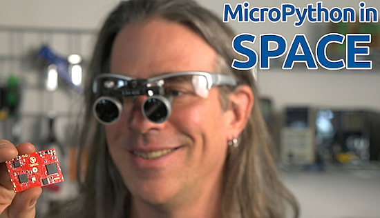](https://youtu.be/ToPX98kjwP8)

The adventure of getting a customized version of MicroPython running on a custom circuit board, to integrate with a pocketqube satellite and make it into low Eath orbit - [YouTube](https://youtu.be/ToPX98kjwP8)

## CircuitPython 10.0.0-alpha.6 Released

[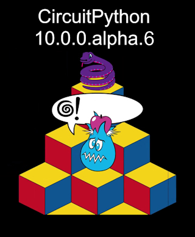](https://blog.adafruit.com/2025/05/17/circuitpython-10-0-0-alpha-6-released/)

CircuitPython 10.0.0-alpha.6 is an alpha release for 10.0.0. Further features, changes, and bug fixes will be added before the final release of 10.0.0 - [Adafruit Blog](https://blog.adafruit.com/2025/05/17/circuitpython-10-0-0-alpha-6-released/) and release notes - [GitHub](https://github.com/adafruit/circuitpython/releases/tag/10.0.0-alpha.6).

**Highlights of this release**

* Fix regression causing errors on ARM processors.

## A Python 3 Cheat Sheet

[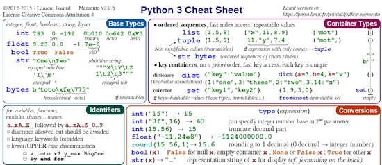](https://scouv.lisn.upsaclay.fr/python-memento/memento-python3-en-latest.pdf)

Readers always seem to like consise reference materials (as does your editor). Seeing an older version of Laurent Pointal's doocument, I tracked down the website where the reference is updated - [Website](https://scouv.lisn.upsaclay.fr/python-memento/index.en.html), [Cheat Sheet (English)](https://scouv.lisn.upsaclay.fr/python-memento/memento-python3-en-latest.pdf) (PDF) and [Cheat Sheet (French)](https://scouv.lisn.upsaclay.fr/python-memento/index.fr.html) (PDF). Via [X](https://x.com/Eyowhite3/status/1925177505897410576?s=03).

## This Week's Python Streams

Python on Hardware is all about building a cooperative ecosphere which allows contributions to be valued and to grow knowledge. Below are the streams within the last week focusing on the community.

**CircuitPython Deep Dive Stream**

[Last Friday](link), Tim streamed work on {subject}.

You can see the latest video and past videos on the Adafruit YouTube channel under the Deep Dive playlist - [YouTube](https://www.youtube.com/playlist?list=PLjF7R1fz_OOXBHlu9msoXq2jQN4JpCk8A).

**CircuitPython Parsec**

John Park’s CircuitPython Parsec this week is on {subject} - [Adafruit Blog](link) and [YouTube](link).

Catch all the episodes in the [YouTube playlist](https://www.youtube.com/playlist?list=PLjF7R1fz_OOWFqZfqW9jlvQSIUmwn9lWr).

**The CircuitPython Show**

In the last episode of The CircuitPython Show, Paul welcomed Justin Myers. Justin shares how he started with computers and electronics and how he developed `connectionmanager` to make networking easier in CircuitPython - [The CircuitPython Show](https://www.circuitpythonshow.com/@circuitpythonshow).

**CircuitPython Weekly Meeting**

CircuitPython Weekly Meeting for May 19, 2025 ([notes](https://github.com/adafruit/adafruit-circuitpython-weekly-meeting/blob/main/2025/2025-05-19.md)) [on YouTube](https://www.youtube.com/watch?v=BjsOG3WdIaQ).

## Project of the Week: A Bluetooth Low Energy Presentation Clicker

[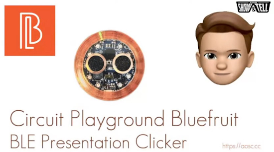](https://www.youtube.com/live/qW3KyLgyroY?feature=shared&t=717)

[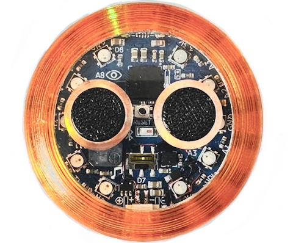](https://bsky.app/profile/bradanlane.bsky.social/post/3lpofgky5zc2g)

The BLE Presentation Clicker is an Adafruit Circuit Playground Bluefruit (with a few mods including a smaller JST connector, LiPi, and LiPo charging). The buttons activate keystrokes via Bluetooth for a presentation. It has a 3D printed case and buttons with an acrylic faceplate. Active power usage is just 2mA ... impressive for CircuitPython - [BlueSky](https://bsky.app/profile/bradanlane.bsky.social/post/3lpofgky5zc2g) and [Show and Tell](https://www.youtube.com/live/qW3KyLgyroY?feature=shared&t=717).

## Popular Last Week

[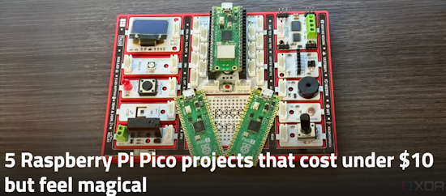](https://www.xda-developers.com/raspberry-pi-pico-projects-cost-under-10/)

What was the most popular, most clicked link, in [last week's newsletter](https://www.adafruitdaily.com/2025/05/19/python-on-microcontrollers-newsletter-python-jumps-in-popularity-hacking-pis-new-circuitpython-and-more-circuitpython-python-micropython-thepsf-raspberry_pi/)? [5 Raspberry Pi Pico projects that cost under $10 but feel magical](https://www.xda-developers.com/raspberry-pi-pico-projects-cost-under-10/).

Did you know you can read past issues of this newsletter in the Adafruit Daily Archive? [Check it out](https://www.adafruitdaily.com/category/circuitpython/).

## New Notes from Adafruit Playground

[Adafruit Playground](https://adafruit-playground.com/) is a new place for the community to post their projects and other making tips/tricks/techniques. Ad-free, it's an easy way to publish your work in a safe space for free.

[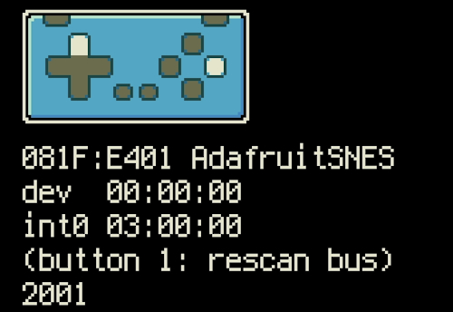](https://adafruit-playground.com/u/SamBlenny/pages/fruit-jam-gamepad-tester)

Fruit Jam Gamepad Tester - [Adafruit Playground](https://adafruit-playground.com/u/SamBlenny/pages/fruit-jam-gamepad-tester).

## News From Around the Web

[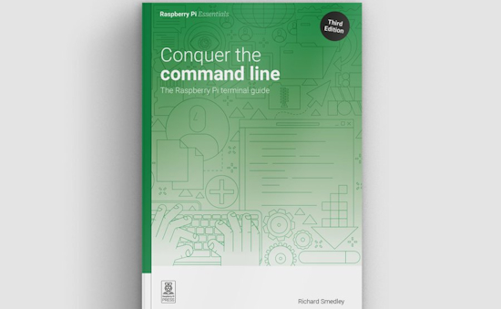](https://www.raspberrypi.com/news/conquer-the-command-line-3rd-edition-out-now/)

The Raspberry Pi Essentials books, Conquer the Command Line, has been updated; the third edition of our Raspberry Pi terminal guide is out - [Raspberry Pi News](https://www.raspberrypi.com/news/conquer-the-command-line-3rd-edition-out-now/).

The final Zephyr episode is out talking about "How to Create a Custom Board Definition" - [YouTube](https://www.youtube.com/watch?v=Hdbr_6Ww2B0).

The entire 12 episode playlist is now available - [YouTube Playlist](https://www.youtube.com/playlist?list=PLEBQazB0HUyTmK2zdwhaf8bLwuEaDH-52).

[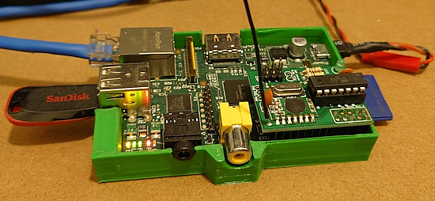](https://www.raspberrypi.com/news/extreme-raspberry-pi-projects-taking-raspberry-pi-to-its-very-limits/)

Extreme Raspberry Pi: projects taking Raspberry Pi to its very limits - [Raspberry Pi News](https://www.raspberrypi.com/news/extreme-raspberry-pi-projects-taking-raspberry-pi-to-its-very-limits/).

[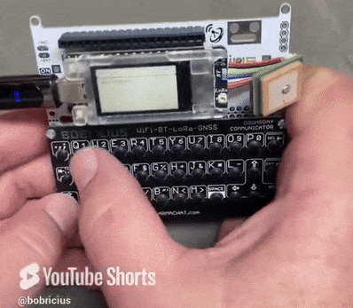](https://x.com/bobricius/status/1925305725602980301)

Circuitpython on Heltec Mesh Node T114. MeshSenger is pasive keyboard to turn ultra low power board T114 to standalone meshtastic communicator - [X](https://x.com/bobricius/status/1925305725602980301) and [Tindie](https://www.tindie.com/products/bobricius/meshsenger-meshtastic-keyboard-for-heltec-t114/).

[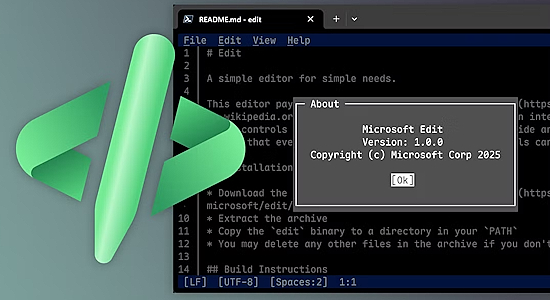](https://www.howtogeek.com/microsoft-new-text-editor-a-vim-nano-alternative/)

Microsoft's new Open Source text editor is a Vim and Nano alternative - [How-To Geek](https://www.howtogeek.com/microsoft-new-text-editor-a-vim-nano-alternative/) and [GitHub](https://github.com/microsoft/edit).

[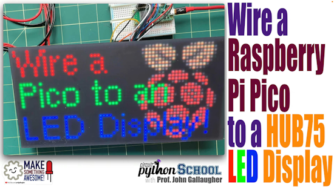](https://www.youtube.com/watch?v=vM3-0qyjfh8)

Wiring a HUB75 LED matrix to a Raspberry Pi Pico - [YouTube](https://www.youtube.com/watch?v=vM3-0qyjfh8).

[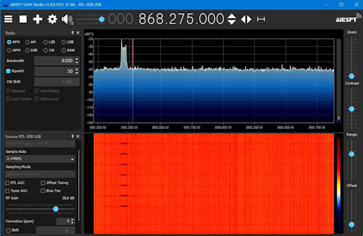](https://x.com/framboise314/status/1925502345217011730)

A Raspberry Pi Pico and CC1101 transmiting at 868.3 MHz in FSK every second, controlled in CircuitPython. A clean signal, visible on SDR — ready for NF S32-002 standard - [X](https://x.com/framboise314/status/1925502345217011730).

[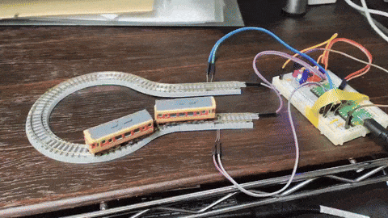](https://x.com/by2aE1WOPoBdfLo/status/1923922935007649869)

Model train control with a Raspberry Pi Pico and MicroPython - [X](https://x.com/by2aE1WOPoBdfLo/status/1923922935007649869).

text - [site](url).

text - [site](url).

text - [site](url).

text - [site](url).

text - [site](url).

text - [site](url).

7 Python functions you’re probably misusing (and don’t realize it) - [KDnuggets](https://www.kdnuggets.com/7-python-functions-youre-probably-misusing-and-dont-realize-it).

[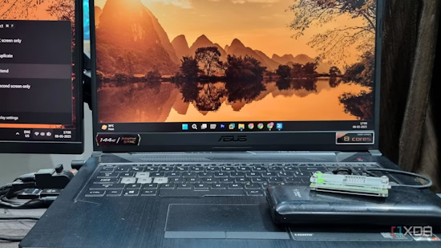](https://www.xda-developers.com/reasons-use-raspberry-pi-downloading-device-instead-windows-pc/)

5 reasons why I use a Raspberry Pi as a downloading device instead of my Windows PC - [XDA](https://www.xda-developers.com/reasons-use-raspberry-pi-downloading-device-instead-windows-pc/).

Programmers dig Python and Zig - [InfoWorld](https://www.infoworld.com/article/3983466/programmers-dig-python-and-zig.html).

## New

[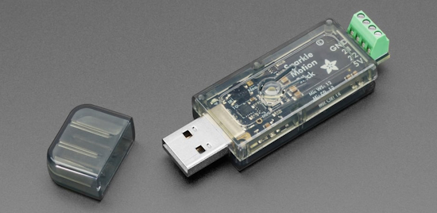](https://www.cnx-software.com/2025/05/21/adafruit-sparkle-motion-stick-a-compact-esp32-s3-usb-wled-controller-board-with-dual-5v-led-outputs-an-i2s-mic-and-a-snap-fit-enclosure/)

The new Adafruit Sparkle Motion Stick is a compact ESP32-S3 USB WLED controller board with dual 5V LED outputs, an I2S Mic, and an optional snap-fit enclosure - [CNX Software](https://www.cnx-software.com/2025/05/21/adafruit-sparkle-motion-stick-a-compact-esp32-s3-usb-wled-controller-board-with-dual-5v-led-outputs-an-i2s-mic-and-a-snap-fit-enclosure/) and [Adafruit](https://www.adafruit.com/product/6333).

Renesas has announced a new entry in its RZ/A series of real-time-targeting microprocessors: the RZ/A3M, with a generous 128MB of on-device DDR3L memory and an Arm Cortex-A55 core running at up to 1GHz - [hackster.io](https://www.hackster.io/news/renesas-rz-a3m-targets-slick-human-machine-interfaces-with-a-generous-128mb-of-on-device-sdram-3e57192c0b78). Via [BlueSky](https://bsky.app/profile/hacksterio.bsky.social/post/3lpmicrcwc22m).

[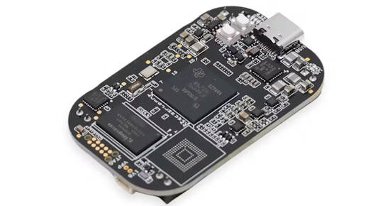](https://www.hackster.io/news/beagleboard-org-releases-a-surprise-pocketbeagle-2-refresh-doubles-the-cores-and-adds-a-gpu-286c3fe8ccd3)

PocketBeagle 2 is refreshed, doubling the cores and adding a GPU, just three months post-launch - [beagleboard.org](https://www.beagleboard.org/boards/pocketbeagle-2) and [hackster.io](https://www.hackster.io/news/beagleboard-org-releases-a-surprise-pocketbeagle-2-refresh-doubles-the-cores-and-adds-a-gpu-286c3fe8ccd3). Via [X](https://x.com/Hacksterio/status/1925591501976764695).

## New Boards Supported by CircuitPython

The number of supported microcontrollers and Single Board Computers (SBC) grows every week. This section outlines which boards have been included in CircuitPython or added to [CircuitPython.org](https://circuitpython.org/).

This week there were (#/no) new boards added:

- [Board name](url)
- [Board name](url)
- [Board name](url)

*Note: For non-Adafruit boards, please use the support forums of the board manufacturer for assistance, as Adafruit does not have the hardware to assist in troubleshooting.*

Looking to add a new board to CircuitPython? It's highly encouraged! Adafruit has four guides to help you do so:

- [How to Add a New Board to CircuitPython](https://learn.adafruit.com/how-to-add-a-new-board-to-circuitpython/overview)
- [How to add a New Board to the circuitpython.org website](https://learn.adafruit.com/how-to-add-a-new-board-to-the-circuitpython-org-website)
- [Adding a Single Board Computer to PlatformDetect for Blinka](https://learn.adafruit.com/adding-a-single-board-computer-to-platformdetect-for-blinka)
- [Adding a Single Board Computer to Blinka](https://learn.adafruit.com/adding-a-single-board-computer-to-blinka)

## New Learn Guides

The Adafruit Learning System has over 3,000 free guides for learning skills and building projects including using Python.

[Solderless Robot Toy Xylophone](https://learn.adafruit.com/solderless-robot-toy-xylophone) from [Liz Clark](https://learn.adafruit.com/u/BlitzCityDIY)

[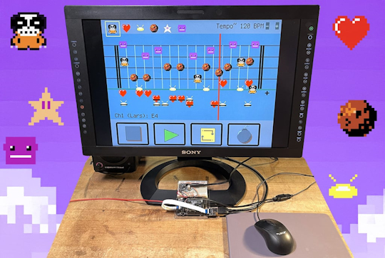](https://learn.adafruit.com/larsio-paint-music)

[Larsio Paint Music](https://learn.adafruit.com/larsio-paint-music) from [John Park](https://learn.adafruit.com/u/johnpark)

## CircuitPython Libraries

The CircuitPython library numbers are continually increasing, while existing ones continue to be updated. Here we provide library numbers and updates!

To get the latest Adafruit libraries, download the [Adafruit CircuitPython Library Bundle](https://circuitpython.org/libraries). To get the latest community contributed libraries, download the [CircuitPython Community Bundle](https://circuitpython.org/libraries).

If you'd like to contribute to the CircuitPython project on the Python side of things, the libraries are a great place to start. Check out the [CircuitPython.org Contributing page](https://circuitpython.org/contributing). If you're interested in reviewing, check out Open Pull Requests. If you'd like to contribute code or documentation, check out Open Issues. We have a guide on [contributing to CircuitPython with Git and GitHub](https://learn.adafruit.com/contribute-to-circuitpython-with-git-and-github), and you can find us in the #help-with-circuitpython and #circuitpython-dev channels on the [Adafruit Discord](https://adafru.it/discord).

You can check out this [list of all the Adafruit CircuitPython libraries and drivers available](https://github.com/adafruit/Adafruit_CircuitPython_Bundle/blob/master/circuitpython_library_list.md). 

The current number of CircuitPython libraries is **###**!

**New Libraries**

Here's this week's new CircuitPython libraries:

* [library](url)

**Updated Libraries**

Here's this week's updated CircuitPython libraries:

* [library](url)

## What’s the CircuitPython team up to this week?

What is the team up to this week? Let’s check in:

**Dan**

I've been working on more bugs that should be fixed before CircuitPython 10.0.0 final. Next up I have a couple of BLE bugs to look at. Then I will start merging recent versions of MicroPython into CircuitPython, so we can catch up on bug fixes and features.

**Tim**

This week I finished converting the library repos to use ruff. After that I worked on a few of the guide pages for the new Sparkle Motion Stick device. I am now starting to port the Arduino driver for the OPT4048 over to CircuitPython.

**Liz**

This week I wrote a guide for the [Solderless Robot Toy Xylophone](https://learn.adafruit.com/solderless-robot-toy-xylophone). This project uses a Metro RP2350 with an I2C to 8 Channel Solenoid Driver breakout. By using the Metro, the wiring for this project becomes very simple, since the solenoids can get 12V from the Metro DC jack. The xylophone has two playback modes: live MIDI where you can play the instrument in real time with MIDI messages over USB and music box mode where the [MIDI Parser library](https://github.com/adafruit/Adafruit_CircuitPython_MIDI_Parser) that I wrote about last week reads MIDI files on the CIRCUITPY drive and plays them back. Of all the robot instruments I've built, this was one of the most satisfying with really straight forward mechanical assembly and wiring schematic.

## Upcoming Events

The next MicroPython Meetup in Melbourne will be on May 28th – [Meetup](https://www.meetup.com/micropython-meetup/events). You can see recordings of previous meetings on [YouTube](https://www.youtube.com/@MicroPythonOfficial). 

KiCad conferences (KiCon) to be held this year include 28 - 30 May 2025 in San Diego, California, 19 - 20 Sept 2024 in Bochum, Germany, and to be determined in Asia - [KiCad](https://kicon.kicad.org/).

Open Hardware Summit 2025 is being held May 30 @ 10am - May 31 @ 6pm GMT+1 in Edinburgh, Scotland - [Eventbrite](https://www.eventbrite.com/e/open-hardware-summit-2025-tickets-1067611086499).

PyOhio 2025 will be held Saturday & Sunday July 26 & 27, 2025 at the Cleveland State University Student Center in Cleveland, Ohio - [PyOhio 2025](https://www.pyohio.org/2025/).

PyCon UK will be at CONTACT in Manchester from Friday 19th September to Monday 22nd September 2025 - [PyCon UK 2025](https://2025.pyconuk.org/).

Maker Faire Bay Area 2025 will be Sep 26 – 28, 2025 in Vallejo, California, US - [Maker Faire](https://bayarea.makerfaire.com/).

**Send Your Events In**

If you know of virtual events or upcoming events, please let us know via email to cpnews(at)adafruit(dot)com.

## Latest Releases

CircuitPython's stable release is [#.#.#](https://github.com/adafruit/circuitpython/releases/latest) and its unstable release is [#.#.#-##.#](https://github.com/adafruit/circuitpython/releases). New to CircuitPython? Start with our [Welcome to CircuitPython Guide](https://learn.adafruit.com/welcome-to-circuitpython).

[2025####](https://github.com/adafruit/Adafruit_CircuitPython_Bundle/releases/latest) is the latest Adafruit CircuitPython library bundle.

[2025####](https://github.com/adafruit/CircuitPython_Community_Bundle/releases/latest) is the latest CircuitPython Community library bundle.

[v#.#.#](https://micropython.org/download) is the latest MicroPython release. Documentation for it is [here](http://docs.micropython.org/en/latest/pyboard/).

[#.#.#](https://www.python.org/downloads/) is the latest Python release. The latest pre-release version is [#.#.#](https://www.python.org/download/pre-releases/).

[#,### Stars](https://github.com/adafruit/circuitpython/stargazers) Like CircuitPython? [Star it on GitHub!](https://github.com/adafruit/circuitpython)

## Call for Help -- Translating CircuitPython is now easier than ever

[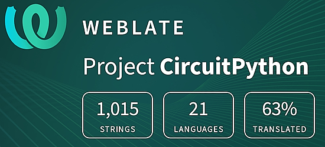](https://hosted.weblate.org/engage/circuitpython/)

One important feature of CircuitPython is translated control and error messages. With the help of fellow open source project [Weblate](https://weblate.org/), we're making it even easier to add or improve translations. 

Sign in with an existing account such as GitHub, Google or Facebook and start contributing through a simple web interface. No forks or pull requests needed! As always, if you run into trouble join us on [Discord](https://adafru.it/discord), we're here to help.

## NUMBER Thanks

The Adafruit Discord community, where we do all our CircuitPython development in the open, reached over NUMBER humans - thank you! Adafruit believes Discord offers a unique way for Python on hardware folks to connect. Join today at [https://adafru.it/discord](https://adafru.it/discord).

## ICYMI - In case you missed it

Python on hardware is the Adafruit Python video-newsletter-podcast! The news comes from the Python community, Discord, Adafruit communities and more and is broadcast on ASK an ENGINEER Wednesdays. The complete Python on Hardware weekly videocast [playlist is here](https://www.youtube.com/playlist?list=PLjF7R1fz_OOXRMjM7Sm0J2Xt6H81TdDev). The video podcast is on [iTunes](https://itunes.apple.com/us/podcast/python-on-hardware/id1451685192?mt=2), [YouTube](http://adafru.it/pohepisodes), [Instagram](https://www.instagram.com/adafruit/channel/)), and [XML](https://itunes.apple.com/us/podcast/python-on-hardware/id1451685192?mt=2).

[The weekly community chat on Adafruit Discord server CircuitPython channel - Audio / Podcast edition](https://itunes.apple.com/us/podcast/circuitpython-weekly-meeting/id1451685016) - Audio from the Discord chat space for CircuitPython, meetings are usually Mondays at 2pm ET, this is the audio version on [iTunes](https://itunes.apple.com/us/podcast/circuitpython-weekly-meeting/id1451685016), Pocket Casts, [Spotify](https://adafru.it/spotify), and [XML feed](https://adafruit-podcasts.s3.amazonaws.com/circuitpython_weekly_meeting/audio-podcast.xml).

## Contribute

The CircuitPython Weekly Newsletter is a CircuitPython community-run newsletter emailed every Monday. The complete [archives are here](https://www.adafruitdaily.com/category/circuitpython/). It highlights the latest CircuitPython related news from around the web including Python and MicroPython developments. To contribute, edit next week's draft [on GitHub](https://github.com/adafruit/circuitpython-weekly-newsletter/tree/gh-pages/_drafts) and [submit a pull request](https://help.github.com/articles/editing-files-in-your-repository/) with the changes. You may also tag your information on Twitter with #CircuitPython. 

Join the Adafruit [Discord](https://adafru.it/discord) or [post to the forum](https://forums.adafruit.com/viewforum.php?f=60) if you have questions.
