- [ ] Library and info updates
- [ ] change date
- [ ] update title
- [ ] Feature story
- [ ] Update  for images
- [ ] Update ICYDNCI
- [ ] All images 550w max only
- [ ] Link "View this email in your browser."

News Sources

- [Adafruit Playground](https://adafruit-playground.com/)
- Twitter: [CircuitPython](https://twitter.com/search?q=circuitpython&src=typed_query&f=live), [MicroPython](https://twitter.com/search?q=micropython&src=typed_query&f=live) and [Python](https://twitter.com/search?q=python&src=typed_query)
- [Raspberry Pi News](https://www.raspberrypi.com/news/)
- Mastodon [CircuitPython](https://mastodon.social/tags/CircuitPython) and [MicroPython](https://mastodon.social/tags/MicroPython)
- [hackster.io CircuitPython](https://www.hackster.io/search?q=circuitpython&i=projects&sort_by=most_recent) and [MicroPython](https://www.hackster.io/search?q=micropython&i=projects&sort_by=most_recent)
- YouTube: [CircuitPython](https://www.youtube.com/results?search_query=circuitpython&sp=CAI%253D), [MicroPython](https://www.youtube.com/results?search_query=micropython&sp=CAI%253D), [Prof Gallaugher](https://www.youtube.com/@BuildWithProfG/videos), [Teacher Brogan M. Pratt CircuitPython](https://www.youtube.com/playlist?list=PLRHdgFNRLyaN6eCw8b0yoHKDY9B4GiirU), [Teacher Brogan M. Pratt CircuitPython search](https://www.youtube.com/@BroganMPratt/search?query=circuitpython)
- Instructables: [CircuitPython](https://www.instructables.com/search/?q=circuitpython&projects=all&sort=Newest), [MicroPython](https://www.instructables.com/search/?q=micropython&projects=all&sort=Newest), [Raspberry Pi Python](https://www.instructables.com/search/?q=raspberry+pi+python&projects=all&sort=Newest)
- [hackaday CircuitPython](https://hackaday.com/blog/?s=circuitpython) and [MicroPython](https://hackaday.com/blog/?s=micropython)
- [python.org](https://www.python.org/)
- [Python Insider - dev team blog](https://pythoninsider.blogspot.com/)
- Individuals: [Jeff Geerling](https://www.jeffgeerling.com/blog), [Yakroo](https://x.com/Yakroo5077)
- Tom's Hardware: [CircuitPython](https://www.tomshardware.com/search?searchTerm=circuitpython&articleType=all&sortBy=publishedDate) and [MicroPython](https://www.tomshardware.com/search?searchTerm=micropython&articleType=all&sortBy=publishedDate) and [Raspberry Pi](https://www.tomshardware.com/search?searchTerm=raspberry%20pi&articleType=all&sortBy=publishedDate)
- [hackaday.io newest projects MicroPython](https://hackaday.io/projects?tag=micropython&sort=date) and [CircuitPython](https://hackaday.io/projects?tag=circuitpython&sort=date)
- [Google News Python](https://news.google.com/topics/CAAqIQgKIhtDQkFTRGdvSUwyMHZNRFY2TVY4U0FtVnVLQUFQAQ?hl=en-US&gl=US&ceid=US%3Aen)
- hackaday.io - [CircuitPython](https://hackaday.io/search?term=circuitpython) and [MicroPython](https://hackaday.io/search?term=micropython)

View this email in your browser. **Warning: Flashing Imagery**

Welcome to the latest Python on Microcontrollers newsletter! *insert 2-3 sentences from editor (what's in overview, banter)* - *Anne Barela, Editor*

We're on [Discord](https://discord.gg/HYqvREz), [Twitter/X](https://twitter.com/search?q=circuitpython&src=typed_query&f=live), [BlueSky](https://bsky.app/profile/circuitpython.org) and for past newsletters - [view them all here](https://www.adafruitdaily.com/category/circuitpython/). If you're reading this on the web, please [subscribe here](https://www.adafruitdaily.com/). Here's the news this week:

## Headline

text - [site](url).

## A Coordinated Python Security Update Release

To fix six vulnerability reports, the Python Software Foundation simultaneously released five new versions of Python. Python 3.13.4, 3.12.11, 3.11.13, 3.10.18 and 3.9.23 are now available. In addition to the security fixes,, a few additional changes to `ipaddress` were backported to make the security fixes feasible - [Python Discussion Forum](https://discuss.python.org/t/python-3-13-4-3-12-11-3-11-13-3-10-18-and-3-9-23-are-now-available/94367). Via [BlueSky](https://bsky.app/profile/sethmlarson.dev/post/3lqqbfkqk3k2z).

## The Latest Commercial and Prototype Uses for the Raspberry Pi Compute Module 5

Jeff Geerling reviews the latest commercial and prototype hardware designed to use the Raspberry Pi Compute Module 5 including a keyboard that translates speech to text locally - [YouTube](https://www.youtube.com/watch?v=qQ42lbLFxv8).

## What is Vibe Coding? A Computer Scientist Explains What It Means to Have AI Write Computer Code − and What Risks That Can Entail

[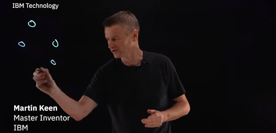](https://theconversation.com/what-is-vibe-coding-a-computer-scientist-explains-what-it-means-to-have-ai-write-computer-code-and-what-risks-that-can-entail-257172)

Vibe coding leans on standard patterns of technical language, which AI systems use to piece together original code from their training data. Any beginner can use an AI assistant such as GitHub Copilot or Cursor Chat, put in a few prompts, and let the system get to work - [The Conversation](https://theconversation.com/what-is-vibe-coding-a-computer-scientist-explains-what-it-means-to-have-ai-write-computer-code-and-what-risks-that-can-entail-257172) and [YouTube](https://youtu.be/P7lryCIvxgA).

> "AI tools do this without any real grasp of specific rules, edge cases or security requirements for the software in question. This is a far cry from the processes behind developing production-grade software, which must balance trade-offs between product requirements, speed, scalability, sustainability and security. Skilled engineers write and review the code, run tests and establish safety barriers before going live."

## The Wrong Way to Use AI (and How to Actually Write Better Code with LLMs)

Claude 4’s beautifully broken refactor is a perfect metaphor for engineering in 2025. Tools are improving rapidly. But they’re only as useful as the engineer wielding them. When AI outputs a beautifully structured but non-compiling refactor, it’s not a failure, it’s a mirror, revealing where human judgment still matters most. For developers serious about continuously learning, that mirror is invaluable - [SHawn Hymel](https://shawnhymel.com/2759/the-wrong-way-to-use-ai-and-how-to-actually-write-better-code-with-llms/).

## TARS-BSK: A Self-Contained LLM/AI for Raspberry Pi 5 Written in Python

[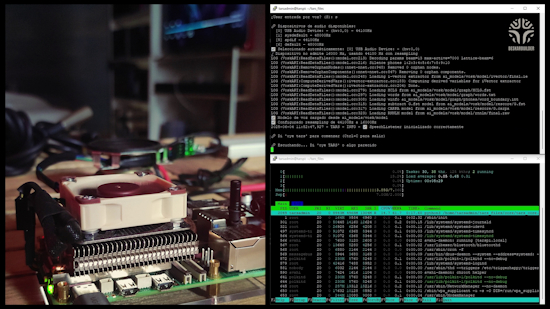](https://github.com/beskarbuilder/TARS-BSK/tree/main)

TARS-BSK (Tactical AI for Responsive Systems) is a personal assistant for Raspberry Pi with a radically different philosophy: identity before efficiency, both non-negotiable. It's not meant to compete with commercial assistants, but to adapt to its creator: it evolves with each interaction, controls the home environment with conversational naturalness, and works 100% offline (no internet) with adaptive personality. It's written in Python and under an open MIT license - [GitHub](https://github.com/beskarbuilder/TARS-BSK/tree/main).

[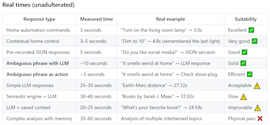](https://github.com/beskarbuilder/TARS-BSK/tree/main)

## 39,003 Thanks

The Adafruit Discord community, where we do all our CircuitPython development in the open, reached over 39,003 humans - thank you! Adafruit believes Discord offers a unique way for Python on hardware folks to connect. Join today at [https://adafru.it/discord](https://adafru.it/discord).

## This Week's Python Streams

Python on Hardware is all about building a cooperative ecosphere which allows contributions to be valued and to grow knowledge. Below are the streams within the last week focusing on the community.

**CircuitPython Deep Dive Stream**

[Last Friday](link), Tim streamed work on {subject}.

You can see the latest video and past videos on the Adafruit YouTube channel under the Deep Dive playlist - [YouTube](https://www.youtube.com/playlist?list=PLjF7R1fz_OOXBHlu9msoXq2jQN4JpCk8A).

**CircuitPython Parsec**

John Park’s CircuitPython Parsec this week is on {subject} - [Adafruit Blog](link) and [YouTube](link).

Catch all the episodes in the [YouTube playlist](https://www.youtube.com/playlist?list=PLjF7R1fz_OOWFqZfqW9jlvQSIUmwn9lWr).

**The CircuitPython Show**

In the last episode of The CircuitPython Show, Paul welcomed Justin Myers. Justin shares how he started with computers and electronics and how he developed `connectionmanager` to make networking easier in CircuitPython - [The CircuitPython Show](https://www.circuitpythonshow.com/@circuitpythonshow).

**CircuitPython Weekly Meeting**

CircuitPython Weekly Meeting for June 2, 2025 ([notes](https://github.com/adafruit/adafruit-circuitpython-weekly-meeting/blob/main/2025/2025-06-02.md)) [on YouTube](https://youtu.be/t6uoNY8biAw).

## Project of the Week

[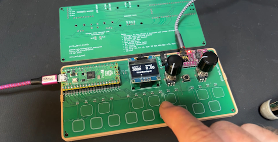](https://bsky.app/profile/todbot.com/post/3lqpwayjins2d)

Tod Kurt has been working on a TB-303-inspired synthesizer using a Raspberry Pi Pico 2 on a custom circuit board with touch pads, running CircuitPython - [YouTube](https://www.youtube.com/watch?v=1AflpXbEIno). Via [BlueSky](https://bsky.app/profile/todbot.com/post/3lqpwayjins2d).

## Popular Last Week

[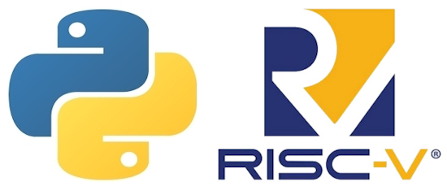](https://github.com/ccattuto/riscv-python)

What was the most popular, most clicked link, in [last week's newsletter](https://www.adafruitdaily.com/2025/06/02/python-on-microcontrollers-newsletter-a-risc-v-emulator-that-runs-circuitpython-micropython-and-more-circuitpython-python-micropython-thepsf-raspberry_pi/)? [RISC-V Emulator in Python](https://github.com/ccattuto/riscv-python).

Did you know you can read past issues of this newsletter in the Adafruit Daily Archive? [Check it out](https://www.adafruitdaily.com/category/circuitpython/).

## New Notes from Adafruit Playground

[Adafruit Playground](https://adafruit-playground.com/) is a new place for the community to post their projects and other making tips/tricks/techniques. Ad-free, it's an easy way to publish your work in a safe space for free.

Fruit Jam Color Checker - [Adafruit Playground](https://adafruit-playground.com/u/SamBlenny/pages/fruit-jam-color-checker).

text - [Adafruit Playground](url).

text - [Adafruit Playground](url).

## News From Around the Web

text - [site](url).

text - [site](url).

[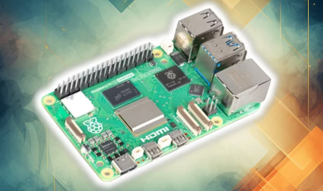](https://www.howtogeek.com/projects-that-might-make-me-finally-get-my-raspberry-pi-out-of-storage/)

7 projects that might make me finally get my Raspberry Pi out of storage - [How-To Geek](https://www.howtogeek.com/projects-that-might-make-me-finally-get-my-raspberry-pi-out-of-storage/).

Nallely: an open-source MIDI meta-synth system with Python - [Synthopia](https://www.synthtopia.com/content/2025/05/19/new-open-source-midi-meta-synth-system-nallely/). Via [Adafruit Blog](https://blog.adafruit.com/2025/06/02/nallely-an-open-source-midi-meta-synth-system-musicmonday/).

[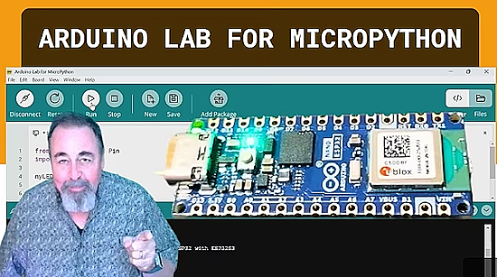](https://www.youtube.com/watch?v=l5nUrVZzzZk)

Getting started with Arduino Labs MicroPython: installing the MicroPython firmware - [YouTube](https://www.youtube.com/watch?v=l5nUrVZzzZk).

text - [site](url).

[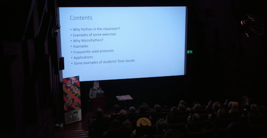](https://www.youtube.com/watch?v=pmTQJdqkCes)

Using Python and MicroPython in the classroom - [YouTube](https://www.youtube.com/watch?v=pmTQJdqkCes).

text - [site](url).

text - [site](url).

text - [site](url).

text - [site](url).

text - [site](url).

text - [site](url).

Python in unexpected places: Python quietly powers Mars rover missions, particle physics at CERN, industrial robotics and more, revealing its role in the physical world - [The New Stack](https://thenewstack.io/python-in-unexpected-places/).

[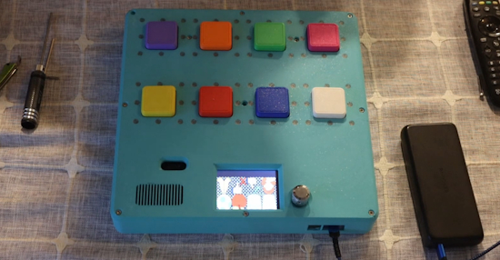](https://www.youtube.com/watch?v=n3s2r6SC2xQ)

An assistive technology device providing buttons for communication with voice confirmation using CircuitPython - [YouTube](https://www.youtube.com/watch?v=n3s2r6SC2xQ).

[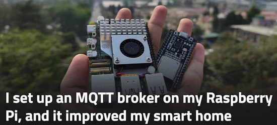](https://www.xda-developers.com/i-set-up-an-mqtt-broker-on-my-raspberry-pi-and-it-improved-my-smart-home/)

I set up an MQTT broker on my Raspberry Pi, and it improved my smart home - [XDA](https://www.xda-developers.com/i-set-up-an-mqtt-broker-on-my-raspberry-pi-and-it-improved-my-smart-home/).

Java at 30: How a language designed for a failed gadget became a global powerhouse - [ZDNet](https://www.zdnet.com/article/java-at-30-how-a-language-designed-for-a-failed-gadget-became-a-global-powerhouse/).

## New

[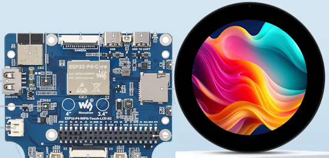](https://www.cnx-software.com/2025/06/01/esp32-p4-development-board-features-3-4-inch-or-4-inch-round-ips-touchscreen-display/)

The Waveshare ESP32-P4-WIFI6-Touch-LCD-3.4C and ESP32-P4-WIFI6-Touch-LCD-4C ESP32-P4-based development boards feature a 3.4-inch and a 4-inch round IPS display, respectively, a 10-point capacitive touchscreen, and a wide 170° viewing angle. They also integrate two microphones with echo cancellation for voice AI applications and offer WiFi 6 and Bluetooth 5 (LE) connectivity via an ESP32-C6 module - [CNX Software](https://www.cnx-software.com/2025/06/01/esp32-p4-development-board-features-3-4-inch-or-4-inch-round-ips-touchscreen-display/).

[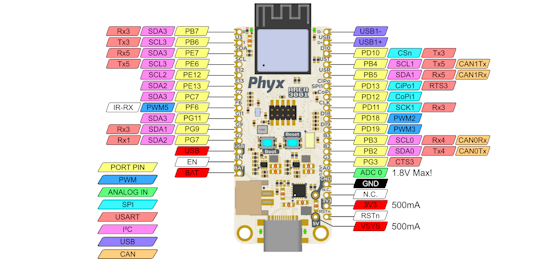](https://github.com/phyx-be/TESS)

TESS is an Adafruit Feather compatible embedded Linux board based on the Allwinner T113-S3 SoC with 128MB of DDR3 RAM built-in. Some additional pins that are not in the original spec were added. These allow for USB and debug UART to be available on regular pinheaders. This SoC only has 1 ADC pin availble, limited to 1.8V, so the extra analog pins are replaced by digital pins with various mux options. This allows for multiple I²C busses, UARTs and CAN interfaces to be used - [GitHub](https://github.com/phyx-be/TESS).

## New Boards Supported by CircuitPython

The number of supported microcontrollers and Single Board Computers (SBC) grows every week. This section outlines which boards have been included in CircuitPython or added to [CircuitPython.org](https://circuitpython.org/).

This week there were (#/no) new boards added:

- [Board name](url)
- [Board name](url)
- [Board name](url)

*Note: For non-Adafruit boards, please use the support forums of the board manufacturer for assistance, as Adafruit does not have the hardware to assist in troubleshooting.*

Looking to add a new board to CircuitPython? It's highly encouraged! Adafruit has four guides to help you do so:

- [How to Add a New Board to CircuitPython](https://learn.adafruit.com/how-to-add-a-new-board-to-circuitpython/overview)
- [How to add a New Board to the circuitpython.org website](https://learn.adafruit.com/how-to-add-a-new-board-to-the-circuitpython-org-website)
- [Adding a Single Board Computer to PlatformDetect for Blinka](https://learn.adafruit.com/adding-a-single-board-computer-to-platformdetect-for-blinka)
- [Adding a Single Board Computer to Blinka](https://learn.adafruit.com/adding-a-single-board-computer-to-blinka)

## New Learn Guides

The Adafruit Learning System has over 3,000 free guides for learning skills and building projects including using Python.

[title](url) from [name](url)

[title](url) from [name](url)

[title](url) from [name](url)

## Updated Learn Guides

[Discord and Slack Connected Smart Plant with Adafruit IO Actions](https://learn.adafruit.com/discord-and-slack-connected-smart-plant-with-adafruit-io-triggers)

## CircuitPython Libraries

The CircuitPython library numbers are continually increasing, while existing ones continue to be updated. Here we provide library numbers and updates!

To get the latest Adafruit libraries, download the [Adafruit CircuitPython Library Bundle](https://circuitpython.org/libraries). To get the latest community contributed libraries, download the [CircuitPython Community Bundle](https://circuitpython.org/libraries).

If you'd like to contribute to the CircuitPython project on the Python side of things, the libraries are a great place to start. Check out the [CircuitPython.org Contributing page](https://circuitpython.org/contributing). If you're interested in reviewing, check out Open Pull Requests. If you'd like to contribute code or documentation, check out Open Issues. We have a guide on [contributing to CircuitPython with Git and GitHub](https://learn.adafruit.com/contribute-to-circuitpython-with-git-and-github), and you can find us in the #help-with-circuitpython and #circuitpython-dev channels on the [Adafruit Discord](https://adafru.it/discord).

You can check out this [list of all the Adafruit CircuitPython libraries and drivers available](https://github.com/adafruit/Adafruit_CircuitPython_Bundle/blob/master/circuitpython_library_list.md). 

The current number of CircuitPython libraries is **###**!

**New Libraries**

Here's this week's new CircuitPython libraries:

* [library](url)

**Updated Libraries**

Here's this week's updated CircuitPython libraries:

* [library](url)

## What’s the CircuitPython team up to this week?

What is the team up to this week? Let’s check in:

**Dan**

I'm merging recent changes from MicroPython into CircuitPython, to incorporate bug fixes and new features in the MicroPython core. Currently I'm merging MicroPython v1.24.1, and after that I'll do v1.25.

**Tim**

This week I finished up the OPT4048 guide and it was published. I also finished the displayio API updates in all remaining CircuitPython libraries. I worked on some infrastructure issues updating adabot reports to look for new config files, and submitting a patch that will upgrade our libraries to use the latest configuration for their read the docs builds. I'm also working on a guide page for the Feather ESP32-S2 BME280 device that will show to use use deep sleep and wake up every so often, read data from a sensor, then send the data to Adafruit IO before going back to sleep. Here is a dashboard I whipped up on AIO to visualize the data.

[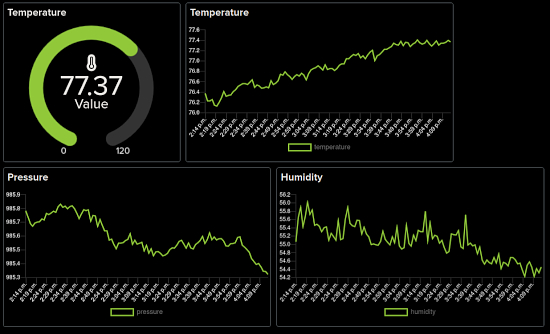](https://www.circuitpython.org/)

**Liz**

This week I worked on a guide for the [SEN6x Breakout](https://learn.adafruit.com/adafruit-sen6x-breakout). This breakout lets you easily use a SEN6x sensor with a STEMMA QT cable. I also wrote a [CircuitPython driver for the SEN6x](https://docs.circuitpython.org/projects/sen6x/en/latest/). It is setup to allow for a new class for each of the SEN6x sensors, with a full implementation for the SEN66 currently included.

## Upcoming Events

The next MicroPython Meetup in Melbourne will be on June 25thh – [Meetup](https://www.meetup.com/micropython-meetup/events). You can see recordings of previous meetings on [YouTube](https://www.youtube.com/@MicroPythonOfficial). 

PyOhio 2025 will be held Saturday & Sunday July 26 & 27, 2025 at the Cleveland State University Student Center in Cleveland, Ohio - [PyOhio 2025](https://www.pyohio.org/2025/).

KiCad conferences (KiCon) to be held this year include 19 - 20 Sept 2024 in Bochum, Germany, and to be determined in Asia - [KiCad](https://kicon.kicad.org/).

PyCon UK will be at CONTACT in Manchester from Friday 19th September to Monday 22nd September 2025 - [PyCon UK 2025](https://2025.pyconuk.org/).

Maker Faire Bay Area 2025 will be Sep 26 – 28, 2025 in Vallejo, California, US - [Maker Faire](https://bayarea.makerfaire.com/).

**Send Your Events In**

If you know of virtual events or upcoming events, please let us know via email to cpnews(at)adafruit(dot)com.

## Latest Releases

CircuitPython's stable release is [#.#.#](https://github.com/adafruit/circuitpython/releases/latest) and its unstable release is [#.#.#-##.#](https://github.com/adafruit/circuitpython/releases). New to CircuitPython? Start with our [Welcome to CircuitPython Guide](https://learn.adafruit.com/welcome-to-circuitpython).

[2025####](https://github.com/adafruit/Adafruit_CircuitPython_Bundle/releases/latest) is the latest Adafruit CircuitPython library bundle.

[2025####](https://github.com/adafruit/CircuitPython_Community_Bundle/releases/latest) is the latest CircuitPython Community library bundle.

[v#.#.#](https://micropython.org/download) is the latest MicroPython release. Documentation for it is [here](http://docs.micropython.org/en/latest/pyboard/).

[#.#.#](https://www.python.org/downloads/) is the latest Python release. The latest pre-release version is [#.#.#](https://www.python.org/download/pre-releases/).

[#,### Stars](https://github.com/adafruit/circuitpython/stargazers) Like CircuitPython? [Star it on GitHub!](https://github.com/adafruit/circuitpython)

## Call for Help -- Translating CircuitPython is now easier than ever

[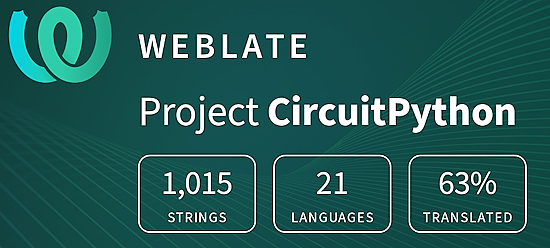](https://hosted.weblate.org/engage/circuitpython/)

One important feature of CircuitPython is translated control and error messages. With the help of fellow open source project [Weblate](https://weblate.org/), we're making it even easier to add or improve translations. 

Sign in with an existing account such as GitHub, Google or Facebook and start contributing through a simple web interface. No forks or pull requests needed! As always, if you run into trouble join us on [Discord](https://adafru.it/discord), we're here to help.

## ICYMI - In case you missed it

Python on hardware is the Adafruit Python video-newsletter-podcast! The news comes from the Python community, Discord, Adafruit communities and more and is broadcast on ASK an ENGINEER Wednesdays. The complete Python on Hardware weekly videocast [playlist is here](https://www.youtube.com/playlist?list=PLjF7R1fz_OOXRMjM7Sm0J2Xt6H81TdDev). The video podcast is on [iTunes](https://itunes.apple.com/us/podcast/python-on-hardware/id1451685192?mt=2), [YouTube](http://adafru.it/pohepisodes), [Instagram](https://www.instagram.com/adafruit/channel/)), and [XML](https://itunes.apple.com/us/podcast/python-on-hardware/id1451685192?mt=2).

[The weekly community chat on Adafruit Discord server CircuitPython channel - Audio / Podcast edition](https://itunes.apple.com/us/podcast/circuitpython-weekly-meeting/id1451685016) - Audio from the Discord chat space for CircuitPython, meetings are usually Mondays at 2pm ET, this is the audio version on [iTunes](https://itunes.apple.com/us/podcast/circuitpython-weekly-meeting/id1451685016), Pocket Casts, [Spotify](https://adafru.it/spotify), and [XML feed](https://adafruit-podcasts.s3.amazonaws.com/circuitpython_weekly_meeting/audio-podcast.xml).

## Contribute

The CircuitPython Weekly Newsletter is a CircuitPython community-run newsletter emailed every Monday. The complete [archives are here](https://www.adafruitdaily.com/category/circuitpython/). It highlights the latest CircuitPython related news from around the web including Python and MicroPython developments. To contribute, edit next week's draft [on GitHub](https://github.com/adafruit/circuitpython-weekly-newsletter/tree/gh-pages/_drafts) and [submit a pull request](https://help.github.com/articles/editing-files-in-your-repository/) with the changes. You may also tag your information on Twitter with #CircuitPython. 

Join the Adafruit [Discord](https://adafru.it/discord) or [post to the forum](https://forums.adafruit.com/viewforum.php?f=60) if you have questions.
