- [ ] Library and info updates
- [ ] change date
- [ ] update title
- [ ] Feature story
- [ ] Update  for images
- [ ] Update ICYDNCI
- [ ] All images 550w max only
- [ ] Link "View this email in your browser."

News Sources

- [Adafruit Playground](https://adafruit-playground.com/)
- Twitter: [CircuitPython](https://twitter.com/search?q=circuitpython&src=typed_query&f=live), [MicroPython](https://twitter.com/search?q=micropython&src=typed_query&f=live) and [Python](https://twitter.com/search?q=python&src=typed_query)
- [Raspberry Pi News](https://www.raspberrypi.com/news/)
- Mastodon [CircuitPython](https://mastodon.social/tags/CircuitPython) and [MicroPython](https://mastodon.social/tags/MicroPython)
- [hackster.io CircuitPython](https://www.hackster.io/search?q=circuitpython&i=projects&sort_by=most_recent) and [MicroPython](https://www.hackster.io/search?q=micropython&i=projects&sort_by=most_recent)
- YouTube: [CircuitPython](https://www.youtube.com/results?search_query=circuitpython&sp=CAI%253D), [MicroPython](https://www.youtube.com/results?search_query=micropython&sp=CAI%253D), [Prof Gallaugher](https://www.youtube.com/@BuildWithProfG/videos), [Teacher Brogan M. Pratt CircuitPython](https://www.youtube.com/playlist?list=PLRHdgFNRLyaN6eCw8b0yoHKDY9B4GiirU), [Teacher Brogan M. Pratt CircuitPython search](https://www.youtube.com/@BroganMPratt/search?query=circuitpython)
- Instructables: [CircuitPython](https://www.instructables.com/search/?q=circuitpython&projects=all&sort=Newest), [MicroPython](https://www.instructables.com/search/?q=micropython&projects=all&sort=Newest), [Raspberry Pi Python](https://www.instructables.com/search/?q=raspberry+pi+python&projects=all&sort=Newest)
- [hackaday CircuitPython](https://hackaday.com/blog/?s=circuitpython) and [MicroPython](https://hackaday.com/blog/?s=micropython)
- [python.org](https://www.python.org/)
- [Python Insider - dev team blog](https://pythoninsider.blogspot.com/)
- Individuals: [Jeff Geerling](https://www.jeffgeerling.com/blog), [Yakroo](https://x.com/Yakroo5077)
- Tom's Hardware: [CircuitPython](https://www.tomshardware.com/search?searchTerm=circuitpython&articleType=all&sortBy=publishedDate) and [MicroPython](https://www.tomshardware.com/search?searchTerm=micropython&articleType=all&sortBy=publishedDate) and [Raspberry Pi](https://www.tomshardware.com/search?searchTerm=raspberry%20pi&articleType=all&sortBy=publishedDate)
- [hackaday.io newest projects MicroPython](https://hackaday.io/projects?tag=micropython&sort=date) and [CircuitPython](https://hackaday.io/projects?tag=circuitpython&sort=date)
- [Google News Python](https://news.google.com/topics/CAAqIQgKIhtDQkFTRGdvSUwyMHZNRFY2TVY4U0FtVnVLQUFQAQ?hl=en-US&gl=US&ceid=US%3Aen)
- hackaday.io - [CircuitPython](https://hackaday.io/search?term=circuitpython) and [MicroPython](https://hackaday.io/search?term=micropython)

View this email in your browser. **Warning: Flashing Imagery**

Welcome to the latest Python on Microcontrollers newsletter! *insert 2-3 sentences from editor (what's in overview, banter)* - *Anne Barela, Editor*

We're on [Discord](https://discord.gg/HYqvREz), [Twitter/X](https://twitter.com/search?q=circuitpython&src=typed_query&f=live), [BlueSky](https://bsky.app/profile/circuitpython.org) and for past newsletters - [view them all here](https://www.adafruitdaily.com/category/circuitpython/). If you're reading this on the web, please [subscribe here](https://www.adafruitdaily.com/). Here's the news this week:

## Python 3.13.5 Released

[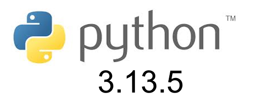](https://blog.python.org/2025/06/python-3135-is-now-available.html)

Python 3.13.5 is the fifth maintenance release of Python 3.13 which fixes several issues with Python 3.13.4 - [Python Blog](https://blog.python.org/2025/06/python-3135-is-now-available.html).

There is a feature freeze now for the upcoming Python 3.14 - [Real Python](https://realpython.com/python-news-june-2025/#python-3140-beta-feature-freeze-begins).

## 2025 Open Hardware Summit Videos Available

[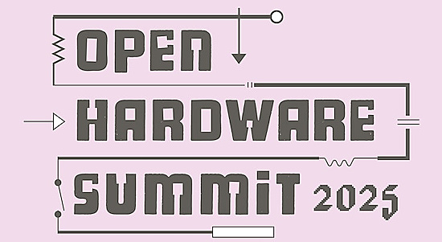](https://www.youtube.com/playlist?list=PLN2I5IwhHQ4qhEqAuk_MD0JZDzbTyWRXd)

The talk videos from the 2025 Open Hardware Summit are now available on YouTube. Check out the playlist to learn what your colleagues are looking at in the Open Hardware space - [YouTube Playlist](https://www.youtube.com/playlist?list=PLN2I5IwhHQ4qhEqAuk_MD0JZDzbTyWRXd).

## Coding in Python

Writing Python code in a way that's efficient and in tune with the language community is called writing Pythonic code. SOme feel this only adds additional learning time. But it really does help become a better programmer. Check out the two articles below.

[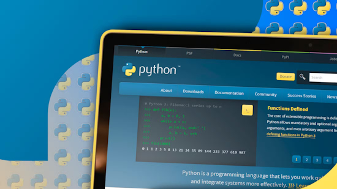](https://www.howtogeek.com/how-to-write-code-the-pythonic-way-with-examples/)

How to write code the Pythonic Way (with 6 examples) - [How-To Geek](https://www.howtogeek.com/how-to-write-code-the-pythonic-way-with-examples/).

Stop writing messy Python: a clean code crash course - [KDnuggets](https://www.kdnuggets.com/stop-writing-messy-python-a-clean-code-crash-course).

## A Tutorial Series on ARM Assembly

[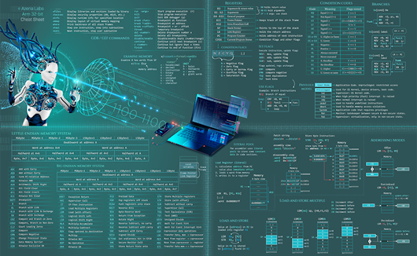](https://azeria-labs.com/writing-arm-assembly-part-1/)

Sometimes Python (or even C/C++) isn't fast enough to do what you want on an Arm single board computer or microcontroller. Or perhaps one needs to access features that high-level languages don't have libraries for. At such a point, coding some Arm assembly might be required. Maria Markstedter (Fox0x01) of Azeria Labs is one of the top folks in the field. [Her website has free resources on learning Arm assembly](https://azeria-labs.com/writing-arm-assembly-part-1/). She also has a book "Arm Assembly & Reverse Engineering" and a low cost [Arm Assembly Cheat Sheet](https://azeria.gumroad.com/l/Arm-cheatsheet-2020-version) - [Azeria Labs](https://azeria-labs.com/writing-arm-assembly-part-1/).

## Get Started With the New Python Installation Manager

[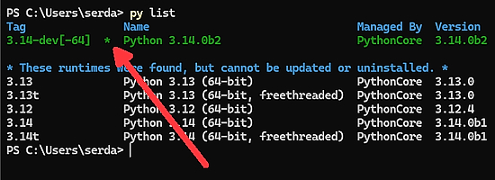](https://www.infoworld.com/article/4001983/get-started-with-the-new-python-installation-manager.html)

The soon to be the official tool for managing Python installations on Windows, the new Python Installation Manager picks up where the ‘py’ launcher left off to help you manage the tangle of Python installations on your machine - [InfoWorld](https://www.infoworld.com/article/4001983/get-started-with-the-new-python-installation-manager.html).

## Python: The Documentary Coming (See the Trailer)

From a side project in Amsterdam to powering AI at the world’s biggest companies - this is the story of Python. Featuring Guido van Rossum, Travis Oliphant, Barry Warsaw, and many more, our upcoming full-length documentary traces Python’s slow-but-steady rise, its community-driven evolution, and the language’s impact on... well… everything. See the trailer now - [YouTube](https://www.youtube.com/watch?v=pqBqdNIPrbo).

## KiCad and Wayland Support

KiCad is a popular free package for creating printed circuit boards. The graphical app runs under Linux using the older X11 windowing system. New Raspberry Pi Operating System devices and many other computers have adoptied the new Wayland windows manager. KiCad explains their issues with Wayland - [KiCad](https://www.kicad.org/blog/2025/06/KiCad-and-Wayland-Support/). Via [X](https://x.com/kicad_pcb/status/1932525301638279358?s=03).

## The Python Language Summit 2025

[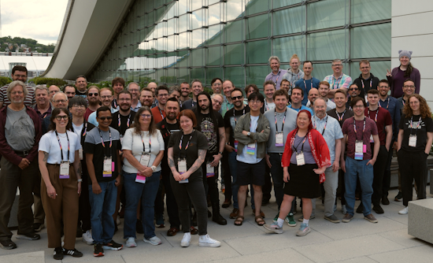](https://pyfound.blogspot.com/2025/06/python-language-summit-2025.html)

The Python Language Summit 2025 occurred on May 14th in Pittsburgh, Pennsylvania. Core developers and special guests from around the world gathered in one room for an entire day of presentations and discussions about the future of the Python programming language. See all the talks via posts linked - [Python Blog](https://pyfound.blogspot.com/2025/06/python-language-summit-2025.html).

## This Week's Python Streams

Python on Hardware is all about building a cooperative ecosphere which allows contributions to be valued and to grow knowledge. Below are the streams within the last week focusing on the community.

**CircuitPython Deep Dive Stream**

[Last Friday](https://youtube.com/live/Efthi9BPEJk), Tim streamed work on plotting data from adafruit.io with `displayio`.

You can see the latest video and past videos on the Adafruit YouTube channel under the Deep Dive playlist - [YouTube](https://www.youtube.com/playlist?list=PLjF7R1fz_OOXBHlu9msoXq2jQN4JpCk8A).

**CircuitPython Parsec**

John Park’s CircuitPython Parsec this week is access a built-in SD card reader - [Adafruit Blog](https://blog.adafruit.com/2025/06/13/john-parks-circuitpython-parsec-access-a-built-in-sd-card-reader/) and [YouTube](link).

Catch all the episodes in the [YouTube playlist](https://www.youtube.com/playlist?list=PLjF7R1fz_OOWFqZfqW9jlvQSIUmwn9lWr).

**CircuitPython Weekly Meeting**

CircuitPython Weekly Meeting for June 9, 2025 ([notes](https://github.com/adafruit/adafruit-circuitpython-weekly-meeting/blob/main/2025/2025-06-09.md)) [on YouTube](https://youtu.be/W0-K_HpTs_o).

## Project of the Week: Detecting Radio Jammers with Raspberry Pi 5 and Python

[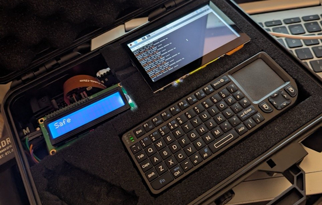](https://www.raspberrypi.com/news/detect-radio-jammers-with-raspberry-pi-5/)

Josh Perryman has created a package that can passiveely detect radio frequency jamming. Signal Sentinel uses a Raspberry 5 programmed in Python to compare receeived signals with a database of known good and bad signals to make a detection - [Raspberry Pi News](https://www.raspberrypi.com/news/detect-radio-jammers-with-raspberry-pi-5/) and [GitHub](https://github.com/CyberJsec47/Signal-Sentinel).

## Popular Last Week

What was the most popular, most clicked link, in [last week's newsletter](https://www.adafruitdaily.com/2025/06/09/python-on-microcontrollers-newsletter-python-security-updates-a-pi-5-llm-vibe-coding-and-more-circuitpython-python-micropython-thepsf-raspberry_pi/)? [
Someone put AI in a Keyboard! (CM5 Roundup)](https://www.youtube.com/watch?v=qQ42lbLFxv8).

Did you know you can read past issues of this newsletter in the Adafruit Daily Archive? [Check it out](https://www.adafruitdaily.com/category/circuitpython/).

## New Notes from Adafruit Playground

[Adafruit Playground](https://adafruit-playground.com/) is a new place for the community to post their projects and other making tips/tricks/techniques. Ad-free, it's an easy way to publish your work in a safe space for free.

[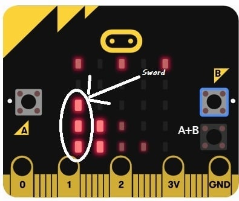](https://adafruit-playground.com/u/mrklingon/pages/sword-of-shannara-on-microbit)

Sword of Shannara on Micro:bit - [Adafruit Playground](https://adafruit-playground.com/u/mrklingon/pages/sword-of-shannara-on-microbit).

## News From Around the Web

[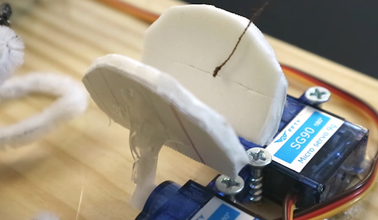](https://www.youtube.com/watch?v=C8fQrpzDpL8)

An AI Venus Flytrap (The Raspberry PiTrap) using a Raspberry Pi 4B, a Pi camera, and two servo motors running Python - [YouTube](https://www.youtube.com/watch?v=C8fQrpzDpL8) and [GitHub](https://github.com/JEOresearch/venuspitrap/).

David Groom and Alex Glow dig into Thumby, a teeny-tiny programmable game system that runs MicroPython. They tackle the web IDE and design some sprites - [YouTube](https://www.youtube.com/watch?v=IPjp-_b7Tdc&list=PLwWiFinxwDlgomKdWjfaavDbMRdhHhfqQ&index=2). Via [Mastodon](https://mastodon.social/@alexglow@chaos.social/114662421921808528).

An artificial life simulation on an LED matrix panel running on a Raspberry Pi 4 using Python - [GitHub](https://github.com/LordofBone/Artificial_Life), [hackster.io](https://www.hackster.io/314reactor/artificial-life-2-49274a), [electromaker.io](https://www.electromaker.io/project/view/artificial-life-2) and [YouTube](https://www.youtube.com/watch?v=d0jh7IboPaQ).

[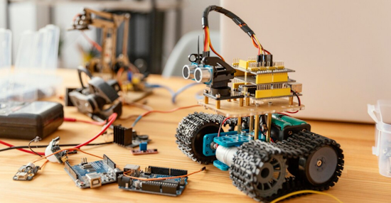](https://shawnhymel.com/2783/how-to-learn-embedded-systems-while-working-full-time-lessons-from-an-amazon-robotics-engineer/)

How to learn embedded systems while working full-time: lessons from an Amazon Robotics Engineer. Shawn Hymel speaks to Steve Branam - [Shawn Hymel](https://shawnhymel.com/2783/how-to-learn-embedded-systems-while-working-full-time-lessons-from-an-amazon-robotics-engineer/).

Andy Warburton finished building a new hardwired split mechanical keyboard. 3D printed based on his own design, spray painted and powered by a pair of Raspberry Pi Pico W’s. It runs KMK firmware based on CircuitPython - [Mastodon](https://mastodon.social/@andy_warb/114653501615810981).

[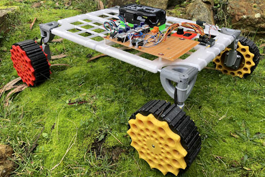](https://www.instructables.com/Roverling/)

Roverling is a RP2040-based 4 wheeled robot programmed in MicroPython - [Instructables](https://www.instructables.com/Roverling/), [YouTube](https://youtu.be/GWybyCDhXEM) and [GitHub](https://github.com/MarkMakies/Roverling).

[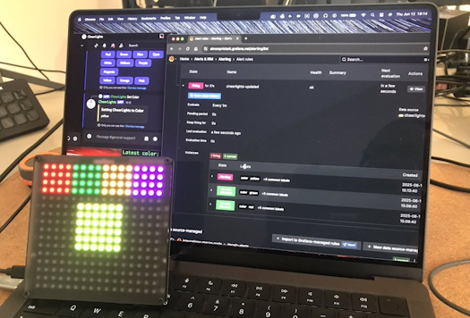](https://x.com/simon_prickett/status/1933219373604614453)

Simon Prickett has been learning about Grafana alerts by building an MQTT driven Cheerlights alerter using a Pimoroni Stellar Unicorn and MicroPython - [X](https://x.com/simon_prickett/status/1933219373604614453).

[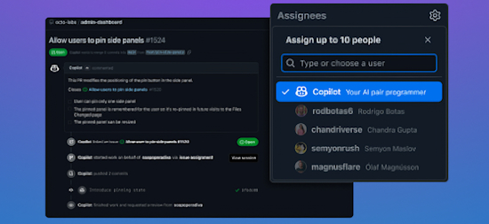](https://github.blog/changelog/2025-05-29-introducing-copilot-spaces-a-new-way-to-work-with-code-and-context/)

Copilot Spaces is now available in GitHub - [GitHub Blog](https://github.blog/changelog/2025-05-29-introducing-copilot-spaces-a-new-way-to-work-with-code-and-context/).

[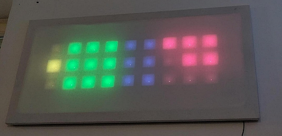](https://mastodon.social/@dr_muesli@woof.tech/114654726941893631)

Dr. Muesli has built Space Clock using MicroPython and ESP32. It shoould be possible to display other variants on it, such as a binary clock - [Mastodon](https://mastodon.social/@dr_muesli@woof.tech/114654726941893631).

How to run a Linux OS on your Chromebook - [Tom's Hardware](https://www.tomshardware.com/software/linux/how-to-run-a-linux-os-on-your-chromebook).

[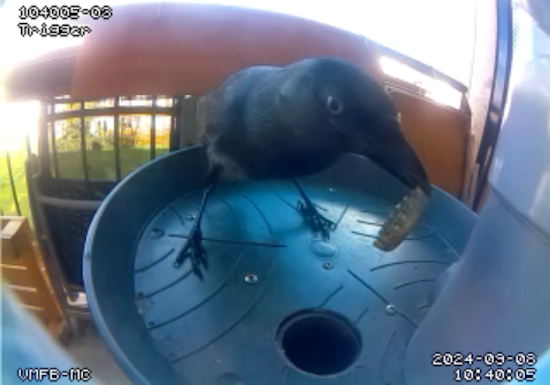](https://hackaday.io/project/184754-vending-machine-for-birds)

A vending machine for birds - a simple, inexpensive bird feeder that dispenses peanuts in exchange for dropping stuff into a hole using Raspberry Pi and Python - [hackaday.io](https://hackaday.io/project/184754-vending-machine-for-birds).

[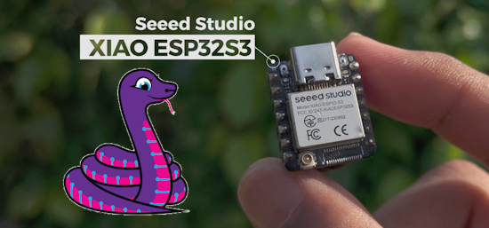](https://www.youtube.com/watch?v=InWYwM2DwpM)

How to install CircuitPython on Seeed Studio XIAO ESP32 boards - [YouTube](https://www.youtube.com/watch?v=InWYwM2DwpM).

Perfect Your Python development setup: learning VS Code, PyCharm, Venv, Pyenv, Docker, Git, and GitHub - [Real Python](https://realpython.com/learning-paths/perfect-your-python-development-setup/).

[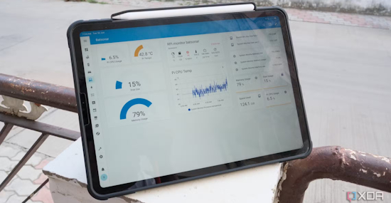](https://www.xda-developers.com/home-assistant-monitor-raspberry-pi-health/)

I used Home Assistant to monitor Raspberry Pi health and regret not using it sooner - [XDA](https://www.xda-developers.com/home-assistant-monitor-raspberry-pi-health/).

[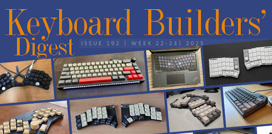](https://kbd.news/Behind-the-scenes-192-2659.html)

Keyboard Builders' Digest issue #192 - [kbd.news](https://kbd.news/Behind-the-scenes-192-2659.html).

7 cool Python projects to automate the boring stuff - [KDnuggets](https://www.kdnuggets.com/7-cool-python-projects-to-automate-the-boring-stuff).

text - [site](url).

## New

[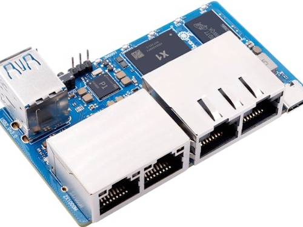](https://www.hackster.io/news/orange-pi-blends-edge-ai-with-compact-network-appliance-capabilities-in-the-orange-pi-r2s-3c09a6d81cbe)

Orange Pi blends edge AI with compact network appliance capabilities in the Orange Pi R2S. The eight-core RISC-V-powered single-board computer has no fewer than two 2.5-gigabit-Ethernet and two gigabit Ethernet ports plus a 2 TOPS CPU - [hackster.io](https://www.hackster.io/news/orange-pi-blends-edge-ai-with-compact-network-appliance-capabilities-in-the-orange-pi-r2s-3c09a6d81cbe).

The low cost RAK11160 LoRaWAN, WiFi, and BLE module pairs an ESP32-C2 (WiFi/BLE) with an STM32WLE5 (CPU/LoRa) for low-power, long-range IoT - [CNX Software](https://www.cnx-software.com/2025/06/09/6-5-rak11160-lorawan-wifi-and-ble-module-pairs-esp32-c2-with-stm32wle5-for-low-power-long-range-iot/).

## New Boards Supported by CircuitPython

The number of supported microcontrollers and Single Board Computers (SBC) grows every week. This section outlines which boards have been included in CircuitPython or added to [CircuitPython.org](https://circuitpython.org/).

This week there were (#/no) new boards added:

- [Board name](url)
- [Board name](url)
- [Board name](url)

*Note: For non-Adafruit boards, please use the support forums of the board manufacturer for assistance, as Adafruit does not have the hardware to assist in troubleshooting.*

Looking to add a new board to CircuitPython? It's highly encouraged! Adafruit has four guides to help you do so:

- [How to Add a New Board to CircuitPython](https://learn.adafruit.com/how-to-add-a-new-board-to-circuitpython/overview)
- [How to add a New Board to the circuitpython.org website](https://learn.adafruit.com/how-to-add-a-new-board-to-the-circuitpython-org-website)
- [Adding a Single Board Computer to PlatformDetect for Blinka](https://learn.adafruit.com/adding-a-single-board-computer-to-platformdetect-for-blinka)
- [Adding a Single Board Computer to Blinka](https://learn.adafruit.com/adding-a-single-board-computer-to-blinka)

## New Learn Guides

The Adafruit Learning System has over 3,000 free guides for learning skills and building projects including using Python.

[LED Matrix Alarm Clock](https://learn.adafruit.com/led-matrix-alarm-clock) from [Ruiz Brothers](https://learn.adafruit.com/u/pixil3d) and [Liz Clark](https://learn.adafruit.com/u/BlitzCityDIY)

[title](url) from [name](url)

[title](url) from [name](url)

## Updated Learn Guides

[title](url)

## CircuitPython Libraries

The CircuitPython library numbers are continually increasing, while existing ones continue to be updated. Here we provide library numbers and updates!

To get the latest Adafruit libraries, download the [Adafruit CircuitPython Library Bundle](https://circuitpython.org/libraries). To get the latest community contributed libraries, download the [CircuitPython Community Bundle](https://circuitpython.org/libraries).

If you'd like to contribute to the CircuitPython project on the Python side of things, the libraries are a great place to start. Check out the [CircuitPython.org Contributing page](https://circuitpython.org/contributing). If you're interested in reviewing, check out Open Pull Requests. If you'd like to contribute code or documentation, check out Open Issues. We have a guide on [contributing to CircuitPython with Git and GitHub](https://learn.adafruit.com/contribute-to-circuitpython-with-git-and-github), and you can find us in the #help-with-circuitpython and #circuitpython-dev channels on the [Adafruit Discord](https://adafru.it/discord).

You can check out this [list of all the Adafruit CircuitPython libraries and drivers available](https://github.com/adafruit/Adafruit_CircuitPython_Bundle/blob/master/circuitpython_library_list.md). 

The current number of CircuitPython libraries is **###**!

**New Libraries**

Here's this week's new CircuitPython libraries:

* [library](url)

**Updated Libraries**

Here's this week's updated CircuitPython libraries:

* [library](url)

## What’s the CircuitPython team up to this week?

What is the team up to this week? Let’s check in:

**Dan**

I've finished merging MicroPython v1.24.1 into CircuitPython. After we make an alpha release including this and other recent changes, I'll start on merging MicroPython v1.25.

**Tim**

I've been working on a guide about startup screens that will detail some general information and history about them, as well as go over the process of creating the startup screen for Fruit Jam OS. I've implemented a few other classic ones in CircuitPython for a page in the guide.  In my own time I've also been working on an integration between the video game Factorio and CircuitPython hardware. I showed a demo of this on Show & Tell this week.

**Liz**

This week I worked on a [guide for the INA237 and INA238](https://learn.adafruit.com/adafruit-ina237-dc-current-voltage-power-monitor). Both of these breakouts let you monitor high or low side voltage. They are basically identical, with the INA238 having a better gain error and offset voltage. I wrote a [CircuitPython driver](https://github.com/adafruit/Adafruit_CircuitPython_INA23x) for these breakouts and refactored the [INA228 driver](https://github.com/adafruit/Adafruit_CircuitPython_INA228) to have a shared INA2xx class since there is a lot of overlap in functionality between the three chips.

## Upcoming Events

The next MicroPython Meetup in Melbourne will be on June 25th – [Meetup](https://www.meetup.com/micropython-meetup/events). You can see recordings of previous meetings on [YouTube](https://www.youtube.com/@MicroPythonOfficial). 

PyOhio 2025 will be held Saturday & Sunday July 26 & 27, 2025 at the Cleveland State University Student Center in Cleveland, Ohio - [PyOhio 2025](https://www.pyohio.org/2025/).

KiCad conferences (KiCon) to be held this year include 19 - 20 Sept 2024 in Bochum, Germany, and to be determined in Asia - [KiCad](https://kicon.kicad.org/).

PyCon UK will be at CONTACT in Manchester from Friday 19th September to Monday 22nd September 2025 - [PyCon UK 2025](https://2025.pyconuk.org/).

Maker Faire Bay Area 2025 will be Sep 26 – 28, 2025 in Vallejo, California, US - [Maker Faire](https://bayarea.makerfaire.com/).

**Send Your Events In**

If you know of virtual events or upcoming events, please let us know via email to cpnews(at)adafruit(dot)com.

## Latest Releases

CircuitPython's stable release is [#.#.#](https://github.com/adafruit/circuitpython/releases/latest) and its unstable release is [#.#.#-##.#](https://github.com/adafruit/circuitpython/releases). New to CircuitPython? Start with our [Welcome to CircuitPython Guide](https://learn.adafruit.com/welcome-to-circuitpython).

[2025####](https://github.com/adafruit/Adafruit_CircuitPython_Bundle/releases/latest) is the latest Adafruit CircuitPython library bundle.

[2025####](https://github.com/adafruit/CircuitPython_Community_Bundle/releases/latest) is the latest CircuitPython Community library bundle.

[v#.#.#](https://micropython.org/download) is the latest MicroPython release. Documentation for it is [here](http://docs.micropython.org/en/latest/pyboard/).

[#.#.#](https://www.python.org/downloads/) is the latest Python release. The latest pre-release version is [#.#.#](https://www.python.org/download/pre-releases/).

[#,### Stars](https://github.com/adafruit/circuitpython/stargazers) Like CircuitPython? [Star it on GitHub!](https://github.com/adafruit/circuitpython)

## Call for Help -- Translating CircuitPython is now easier than ever

[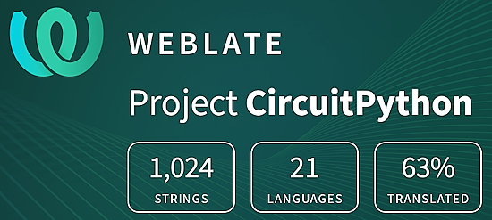](https://hosted.weblate.org/engage/circuitpython/)

One important feature of CircuitPython is translated control and error messages. With the help of fellow open source project [Weblate](https://weblate.org/), we're making it even easier to add or improve translations. 

Sign in with an existing account such as GitHub, Google or Facebook and start contributing through a simple web interface. No forks or pull requests needed! As always, if you run into trouble join us on [Discord](https://adafru.it/discord), we're here to help.

## 39,032 Thanks

The Adafruit Discord community, where we do all our CircuitPython development in the open, reached over 39,032 humans - thank you! Adafruit believes Discord offers a unique way for Python on hardware folks to connect. Join today at [https://adafru.it/discord](https://adafru.it/discord).

## ICYMI - In case you missed it

Python on hardware is the Adafruit Python video-newsletter-podcast! The news comes from the Python community, Discord, Adafruit communities and more and is broadcast on ASK an ENGINEER Wednesdays. The complete Python on Hardware weekly videocast [playlist is here](https://www.youtube.com/playlist?list=PLjF7R1fz_OOXRMjM7Sm0J2Xt6H81TdDev). The video podcast is on [iTunes](https://itunes.apple.com/us/podcast/python-on-hardware/id1451685192?mt=2), [YouTube](http://adafru.it/pohepisodes), [Instagram](https://www.instagram.com/adafruit/channel/)), and [XML](https://itunes.apple.com/us/podcast/python-on-hardware/id1451685192?mt=2).

[The weekly community chat on Adafruit Discord server CircuitPython channel - Audio / Podcast edition](https://itunes.apple.com/us/podcast/circuitpython-weekly-meeting/id1451685016) - Audio from the Discord chat space for CircuitPython, meetings are usually Mondays at 2pm ET, this is the audio version on [iTunes](https://itunes.apple.com/us/podcast/circuitpython-weekly-meeting/id1451685016), Pocket Casts, [Spotify](https://adafru.it/spotify), and [XML feed](https://adafruit-podcasts.s3.amazonaws.com/circuitpython_weekly_meeting/audio-podcast.xml).

## Contribute

The CircuitPython Weekly Newsletter is a CircuitPython community-run newsletter emailed every Monday. The complete [archives are here](https://www.adafruitdaily.com/category/circuitpython/). It highlights the latest CircuitPython related news from around the web including Python and MicroPython developments. To contribute, edit next week's draft [on GitHub](https://github.com/adafruit/circuitpython-weekly-newsletter/tree/gh-pages/_drafts) and [submit a pull request](https://help.github.com/articles/editing-files-in-your-repository/) with the changes. You may also tag your information on Twitter with #CircuitPython. 

Join the Adafruit [Discord](https://adafru.it/discord) or [post to the forum](https://forums.adafruit.com/viewforum.php?f=60) if you have questions.
