View this email in your browser. **Warning: Flashing Imagery**

Welcome to the latest Python on Microcontrollers newsletter! Apologies for the lack of a newsletter last week. Your editor ate something that had her quite sick for a weeek. That said, you now have a fabulous issue, packed with all the goodness. SO much news on MicroPython, CircuitPython, and Python on single-board computers (and related content) that I cannot encompase it all in a summary. Happy June. - *Anne Barela, Editor*

We're on [Discord](https://discord.gg/HYqvREz), [Twitter/X](https://twitter.com/search?q=circuitpython&src=typed_query&f=live), [BlueSky](https://bsky.app/profile/circuitpython.org) and for past newsletters - [view them all here](https://www.adafruitdaily.com/category/circuitpython/). If you're reading this on the web, please [subscribe here](https://www.adafruitdaily.com/). Here's the news this week:

## CircuitPython 10.0.0-alpha.7 Released

[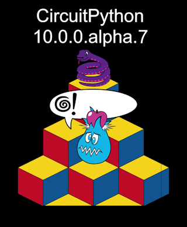](https://blog.adafruit.com/2025/06/17/circuitpython-10-0-0-alpha-7-released/)

CircuitPython 10.0.0-alpha.7 is now out. It's an alpha release for 10.0.0. Further features, changes, and bug fixes will be added before the final release of 10.0.0. - [Adafruit Blog](https://blog.adafruit.com/2025/06/17/circuitpython-10-0-0-alpha-7-released/) and Release Notes - [GitHub](https://github.com/adafruit/circuitpython/releases/tag/10.0.0-alpha.7).

**Highlights**
- Update frozen modules
- Merge MicroPython v1.24.1
- Espressif:
  - Expand firmware partition on non-USB boards
  - Fix `pulseio.PulseIn` length limitation
  - Initial impl of MicroROS
- Nordic: reinit BLE properly after deep sleep
- Fixes from CPy 9.2.8 and later

## MicroPython Ported to Motorola 68000-based Macs

[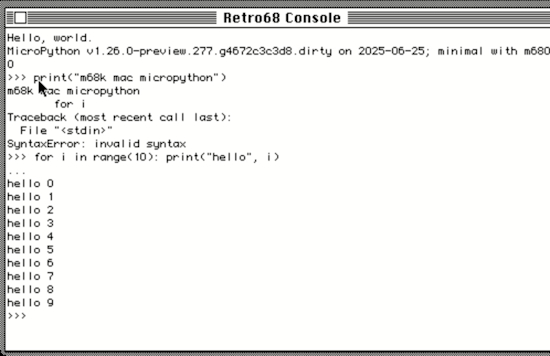](https://social.afront.org/@stylus/114745494736982809)

Jeff Epler has ported MicroPython 1.26.0 preview to older Macintosh computers running Motoroola 68000 microprocessors (pre-1994) - [Mastodon](https://social.afront.org/@stylus/114745494736982809) and [GitHub](https://github.com/jepler/circuitpython/pull/new/ports-m68kmac).

## Getting Started With Microcontrollers

Jeff Geerling goes through the basics of microcontrollers, the small chips that provide amazing compute capability - [YouTube](https://www.youtube.com/watch?v=Sd42q3OaOrE) and [GitHub](https://gist.github.com/geerlingguy/4d519887aeb462ba9501961a32ae3f71).

## CircuitPython School

[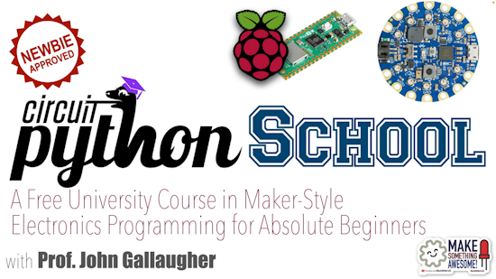](https://www.youtube.com/playlist?list=PL9VJ9OpT-IPSsQUWqQcNrVJqy4LhBjPX2)

Have you been looking for an easy way to learn CircuitPython? Check out the [videos](https://www.youtube.com/@profgallaugher) by Professor [John Gallaugher](https://gallaugher.com/) of Boston College. His CircuitPython School videos are especially helpful - [YouTube Playlist](https://www.youtube.com/playlist?list=PL9VJ9OpT-IPSsQUWqQcNrVJqy4LhBjPX2).

## Out Now: Simple Electronics with GPIO Zero, 2nd Edition

[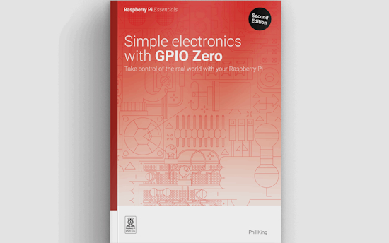](https://www.raspberrypi.com/news/out-today-simple-electronics-with-gpio-zero-2nd-edition/)

Simple Electronics with GPIO Zero, by Phil King, takes the reader from turning an LED on and off to controlling simple electronic components, processing information from buttons, sensors and the internet, and controlling it all using Python on Raspberry Pi - [Raspberry Pi News](https://www.raspberrypi.com/news/out-today-simple-electronics-with-gpio-zero-2nd-edition/).

## Arduino Stella Ultra-WideBand Board

[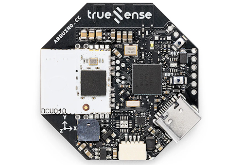](https://www.hackster.io/news/arduino-unveils-the-stella-and-portenta-uwb-shield-tracking-gadgets-in-partnership-with-truesense-ef45413f8f22)

Arduino has now launched its Stella ultra-wideband (UWB) board and Portenta UWB Shield add-on, after unveiling them both at Embedded World earlier this year.

The Arduino Stella, powered by the Truesense DCU040 and an on-board Nordic Semiconductor nRF52840 microcontroller, has been launched at $75.90; the Portenta UWB Shield, which allows an Arduino Portenta C33 to link to the Stella and other UWB devices as either another client or a base station, is priced at $60 excluding the Portenta C33 - [hackster.io](https://www.hackster.io/news/arduino-unveils-the-stella-and-portenta-uwb-shield-tracking-gadgets-in-partnership-with-truesense-ef45413f8f22).

## Python Remains #1 in the Latest TIOBE Poll

Python remains the number one language at tin the TIOBE index of of computer languages. Python currently has a 25.87 percent rating, up 10.48 percent on the year - [DevClass](https://devclass.com/2025/06/16/tiobe-index-sql-slides-in-programmer-popularity-stakes/).

## Protecting Your MicroPython Source Code

[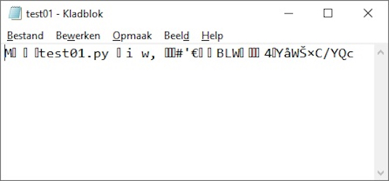](https://lucstechblog.blogspot.com/2025/06/protect-your-micropython-sourcecode.html)

Luc Volders provides a guide to changee the text source code of a program into bytecode (still runnable by MicroPython) but obscured from prying eyes - [lucstechblog](https://lucstechblog.blogspot.com/2025/06/protect-your-micropython-sourcecode.html).

## This Week's Python Streams

Python on Hardware is all about building a cooperative ecosphere which allows contributions to be valued and to grow knowledge. Below are the streams within the last week focusing on the community.

**CircuitPython Deep Dive Stream**

[Last Friday](https://youtube.com/live/u2XWtjS5jNc), Tim streamed work on Fruit Jammin, Curses-like Apps, ANSI color codes, and IRC.

The previous week, Tim was working on [Fruit Jam OS](https://youtube.com/live/mQgkVvDkYJw).

You can see the latest video and past videos on the Adafruit YouTube channel under the Deep Dive playlist - [YouTube](https://www.youtube.com/playlist?list=PLjF7R1fz_OOXBHlu9msoXq2jQN4JpCk8A).

**CircuitPython Parsec**

John Park’s CircuitPython Parsec this week is on Displayio .scale - [Adafruit Blog](https://blog.adafruit.com/2025/06/27/john-parks-circuitpython-parsec-displayio-scale/) and [YouTube](https://youtu.be/3J9GojLKpL0). 

CircuitPython Parsec last week was on Displayio move .x & .y - [Adafruit Blog](https://blog.adafruit.com/2025/06/20/john-parks-circuitpython-parsec-displayio-move-x-y/) and [YouTube](https://youtu.be/d1TEci7lV_U).

Catch all the episodes in the [YouTube playlist](https://www.youtube.com/playlist?list=PLjF7R1fz_OOWFqZfqW9jlvQSIUmwn9lWr).

**CircuitPython Weekly Meetings**

CircuitPython Weekly Meeting for June 16, 2025 ([notes](https://github.com/adafruit/adafruit-circuitpython-weekly-meeting/blob/main/2025/2025-06-16.md)) [on YouTube](https://www.youtube.com/watch?v=3oOj5V1ctRM).
CircuitPython Weekly Meeting for June 23, 2025 ([notes](https://github.com/adafruit/adafruit-circuitpython-weekly-meeting/blob/main/2025/2025-06-23.md)) [on YouTube](https://youtu.be/cTRc-tGFkCc).

## Project of the Week: IINTS, the Open-Source Insulin Pump for Raspberry Pi Pico

[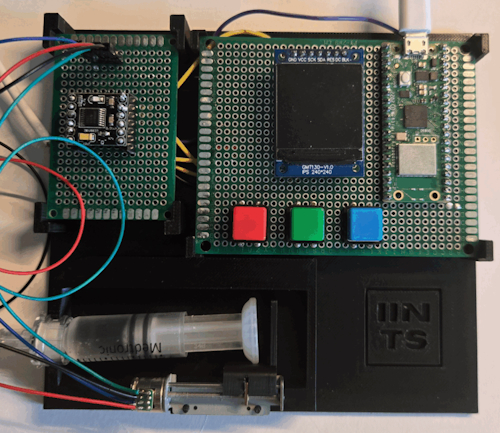](https://www.raspberrypi.com/news/learning-with-a-homemade-model-insulin-pump/)

Rune Bobbaers designed and built a fully open-source insulin pump from scratch having long “been fascinated by the medical technology that helps keep me alive, especially insulin pumps”. It uses MicroPython on a Raspberry Pi Pico, controling insulin delivery using stepper motors and a user-friendly interface - [Raspberry Pi News](https://www.raspberrypi.com/news/learning-with-a-homemade-model-insulin-pump/) and [GitHub](https://github.com/python35/IINTS).

## Popular Last Issue

[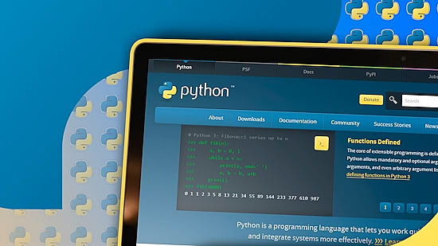](https://www.howtogeek.com/how-to-write-code-the-pythonic-way-with-examples/)

What was the most popular, most clicked link, in [the last newsletter](https://www.adafruitdaily.com/2025/06/16/python-on-microcontrollers-newsletter-python-3-13-5-coding-in-python-arm-assembly-and-more-circuitpython-python-micropython-thepsf-raspberry_pi/)? [How to Write Code the Pythonic Way (With 6 Examples)](https://www.howtogeek.com/how-to-write-code-the-pythonic-way-with-examples/).

Did you know you can read past issues of this newsletter in the Adafruit Daily Archive? [Check it out](https://www.adafruitdaily.com/category/circuitpython/).

## New Notes from Adafruit Playground

[Adafruit Playground](https://adafruit-playground.com/) is a new place for the community to post their projects and other making tips/tricks/techniques. Ad-free, it's an easy way to publish your work in a safe space for free.

Hypotrochoid Spiral Maker - [Adafruit Playground](https://adafruit-playground.com/u/SamBlenny/pages/fruit-jam-hypotrochoid-spiral-maker).

Fruit Jam Lines Screensaver - [Adafruit Playground](https://adafruit-playground.com/u/SamBlenny/pages/fruit-jam-lines-screensaver).

Fruit Jam Color Gradient Generator - [Adafruit Playground](https://adafruit-playground.com/u/SamBlenny/pages/fruit-jam-color-gradient-generator).

[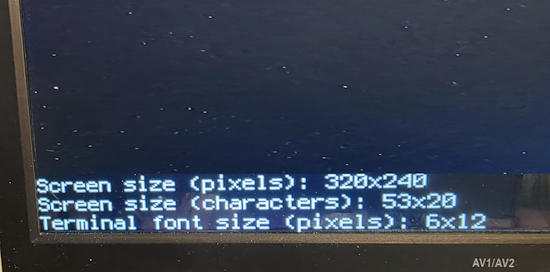](https://adafruit-playground.com/u/AnneBarela/pages/using-the-terminal-for-dvi-in-circuitpythonr)

Using the Terminal for DVI in CircuitPython - [Adafruit Playground](https://adafruit-playground.com/u/AnneBarela/pages/using-the-terminal-for-dvi-in-circuitpython).

## News From Around the Web

A brief history of the Zephyr real-time operating system (RTOS) - [Shawn Hymel](https://shawnhymel.com/2791/a-brief-history-of-zephyr-rtos/).

[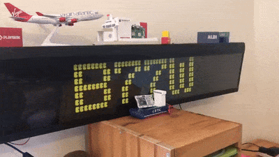](https://x.com/simon_prickett/status/1935719589360402904)

Simon Prickett posts about his flip dot bus display, driven by a Raspberry Pi 3 and a Pi Pico W to display aircraft data using Python and JavaScript - [X](https://x.com/simon_prickett/status/1935719589360402904) and [GitHub](https://github.com/simonprickett/local-aircraft-tracker).

[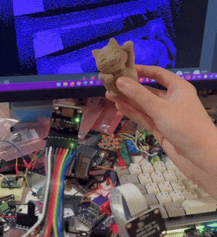](https://mastodon.social/@blitzcitydiy/114712185423339681)

Liz [BlitzCityDIY] has used CircuitPython with a OV5640 camera breakout wired up to an Adafruit Metro RP2350 with PSRAM. The video feed is sent via HSTX DVI - [Mastodon](https://mastodon.social/@blitzcitydiy/114712185423339681).

[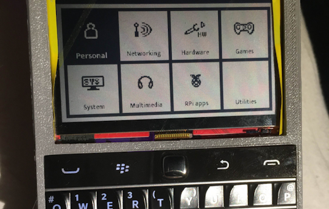](https://hackaday.com/2025/06/18/zpui-could-be-your-tiny-embedded-gui/)

ZPUI (Zippy UI) is a small-screen Linux control interface and UI framework. It gives you access to your system at your fingertips, untethered from any SSH or keyboard/display/mouse requirements. With ZPUI, you can see your IP address, connect to wireless networks (even do password input with arrow keys in a pinch!), run scripts, manage system services, reboot and power down your system, view and unmount storage partitions, control media volume, and do much more.

ZPUI is perfect for single-board computers, servers, embedded Linux devices, your broken-screen laptop on a shelf, wearable and pocket-able devices with Linux under the hood, and much more. OpenWRT support incoming, too. It is written in Python and it supports third-party apps - [Hackaday](https://hackaday.com/2025/06/18/zpui-could-be-your-tiny-embedded-gui/), [GitHub](https://github.com/ZeroPhone/ZPUI) and [ReadTheDocs](https://zpui.readthedocs.io/en/latest/setup.html#).

[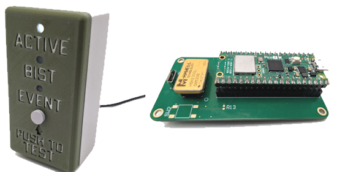](https://blog.adafruit.com/2025/06/24/has-a-nuke-gone-off/)

The Bhangmeter V2 is a Raspberry Pi Pico 2W + MicroPython powered device which detects the gamma ray burst from a nuclear explosion - [hasanukegoneoff.com](https://blog.adafruit.com/2025/06/24/has-a-nuke-gone-off/) and [GitHub](https://github.com/bigcrimping/bhangmeterV2).

[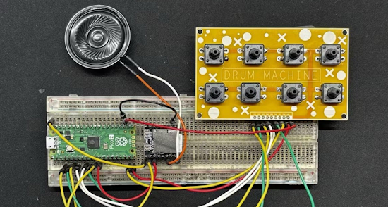](https://www.raspberrypi.com/news/raspberry-pi-pico-powered-drum-machine/)

A Raspberry Pi Pico and MicroPython–powered drum machine - [Raspberry Pi News](https://www.raspberrypi.com/news/raspberry-pi-pico-powered-drum-machine/).

[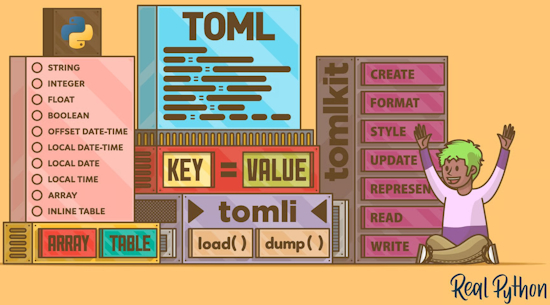](https://realpython.com/python-toml/)

Why did CircuitPython change their secrets.py to secrets.toml? Learn about how Python and TOML are getting along - [Real Python](https://realpython.com/python-toml/).

[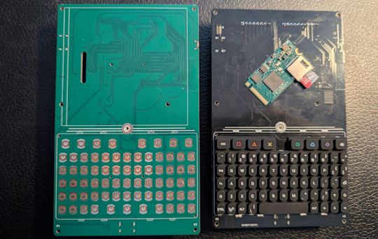](https://www.linkedin.com/posts/jelmer-lopes-terto-340460119_why2025-hardwaredesign-esp32-activity-7338279658313986048-o8vi/)

The hacker camp WHY2025 Badge uses a ESP32-P4, packaged as an M.2-2242 card, ESP32-C6 for WiFi 6, BLE 5.3, Thread & Matter, RA-01H LoRa module (SX1276) and a 4″ 720 × 720 IPS display. It can run MicroPython and is 100% open source - [LinkedIn](https://www.linkedin.com/posts/jelmer-lopes-terto-340460119_why2025-hardwaredesign-esp32-activity-7338279658313986048-o8vi/).

[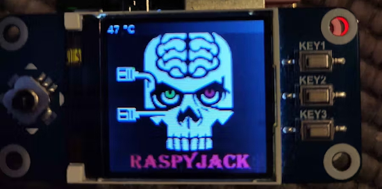](https://old.reddit.com/r/Hacking_Tutorials/comments/1lhoyxf/raspyjack_diy_sharkjack_style_pocket_tool_on/)

RaspyJack is a low-cost alternative to a Hak5 Shark Jack, built using a Raspberry Pi Zero 2W and Python - [Reddit](https://old.reddit.com/r/Hacking_Tutorials/comments/1lhoyxf/raspyjack_diy_sharkjack_style_pocket_tool_on/), [hackster.io](https://www.hackster.io/news/the-raspyjack-is-a-low-cost-alternative-to-the-hak5-shark-jack-built-from-a-raspberry-pi-zero-2w-cde02bdfc943) and [GitHub](https://github.com/7h30th3r0n3/Raspyjack).

[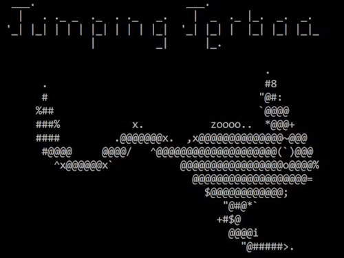](https://www.hackster.io/RVLAD/jumping-jerboa-transfer-mouse-keyboard-to-other-computer-68a134)

Jumping Jerboa: transfer mouse/keyboard to another computer, a Python and CircuitPython project, allowing transfer of a mouse and keyboard to another computer over a USB connection - [hackster.io](https://www.hackster.io/RVLAD/jumping-jerboa-transfer-mouse-keyboard-to-other-computer-68a134).

Adding lights and sound to LEGO builds using the Tiny FX board from Pimoroni and MicroPython - [Kev's Robots](https://www.kevsrobots.com/blog/tinyfx.html).

[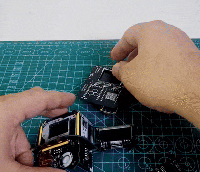](https://x.com/Yakroo5077/status/1935597260727046505?s=03)

Yakroo108 has made a 3D mini house using PCBs! It is built on a Raspberry Pi Pico & CircuitPython. It glows with Cyberpunk flair neon lights, metallic vibes & a dystopian twist - [X](https://x.com/Yakroo5077/status/1935597260727046505?s=03).

Advanced Git tips for Python developers - [Real Python](https://realpython.com/advanced-git-for-pythonistas/).

[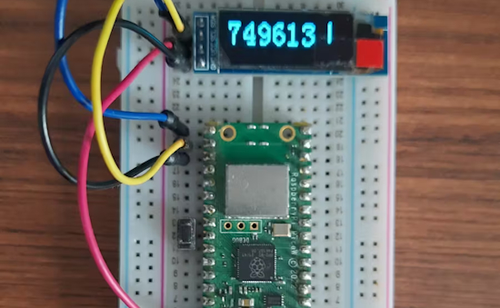](https://www.hackster.io/dquadros2/building-a-one-time-password-token-with-the-pi-pico-w-45a830)

Building a one-time password token with the Raspberry Pi Pico W and MicroPython - [hackster.io](https://www.hackster.io/dquadros2/building-a-one-time-password-token-with-the-pi-pico-w-45a830).

[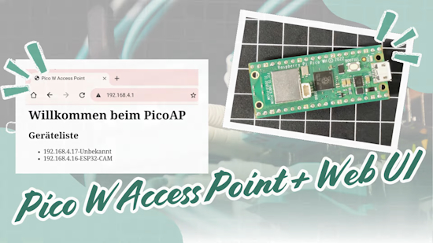](https://www.youtube.com/watch?v=jOVtYf6iNjY)

Raspberry Pi Pico W as a WiFi hotspot with a web interface displays devices on a network - [YouTube](https://www.youtube.com/watch?v=jOVtYf6iNjY).

Pyrefly and Ty: two new Rust-powered Python type-checking tools compared - [InfoWorld](https://www.infoworld.com/article/4005961/pyrefly-and-ty-two-new-rust-powered-python-type-checking-tools-compared.html).

Immutability in Python - [Real Python](https://realpython.com/courses/immutability-python/).

## New

[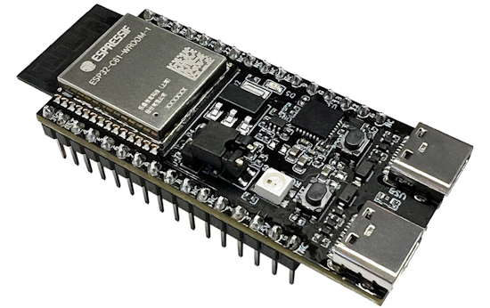](https://www.cnx-software.com/2025/06/16/esp32-c61-devkitc-1-development-board-features-esp32-c61-low-cost-wifi-6-and-bluetooth-le-5-0-soc/)

Espressif Systems ESP32-C61 low-cost WiFi 6 and BLE SoC has now entered mass production - [CNX Software](https://www.cnx-software.com/2025/06/16/esp32-c61-devkitc-1-development-board-features-esp32-c61-low-cost-wifi-6-and-bluetooth-le-5-0-soc/).

[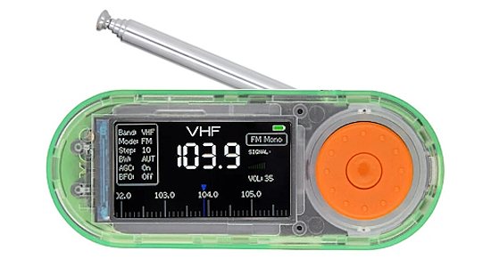](https://www.cnx-software.com/2025/06/17/esp32-s3-development-board-integrates-si4732-am-fm-radio-receiver/)

The LILYGO T-Embed SI4732 is an ESP32-S3 development board with an AM/FM radio, a TFT display, a rotary encoder, a built-in microphone, and a microSD card slot powered through a USB-C port or LiPo battery - [CNX Software](https://www.cnx-software.com/2025/06/17/esp32-s3-development-board-integrates-si4732-am-fm-radio-receiver/).

## New Boards Supported by CircuitPython

The number of supported microcontrollers and Single Board Computers (SBC) grows every week. This section outlines which boards have been included in CircuitPython or added to [CircuitPython.org](https://circuitpython.org/).

This week there were no new boards.

*Note: For non-Adafruit boards, please use the support forums of the board manufacturer for assistance, as Adafruit does not have the hardware to assist in troubleshooting.*

Looking to add a new board to CircuitPython? It's highly encouraged! Adafruit has four guides to help you do so:

- [How to Add a New Board to CircuitPython](https://learn.adafruit.com/how-to-add-a-new-board-to-circuitpython/overview)
- [How to add a New Board to the circuitpython.org website](https://learn.adafruit.com/how-to-add-a-new-board-to-the-circuitpython-org-website)
- [Adding a Single Board Computer to PlatformDetect for Blinka](https://learn.adafruit.com/adding-a-single-board-computer-to-platformdetect-for-blinka)
- [Adding a Single Board Computer to Blinka](https://learn.adafruit.com/adding-a-single-board-computer-to-blinka)

## New Learn Guides

[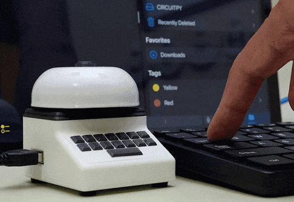](https://learn.adafruit.com/guides/latest)

The Adafruit Learning System has over 3,000 free guides for learning skills and building projects including using Python.

[Not A Typewriter](https://learn.adafruit.com/not-a-typewriter) from [Ruiz Brothers](https://learn.adafruit.com/u/pixil3d) and [Liz Clark](https://learn.adafruit.com/u/BlitzCityDIY)

[Startup Screens](https://learn.adafruit.com/startup-screens) from [Tim C](https://learn.adafruit.com/u/Foamyguy)

[Tile-Matching Game on the Adafruit Metro RP2350](https://learn.adafruit.com/tile-matching-game-on-the-adafruit-metro-rp2350) from [M. LeBlanc-Williams](M. LeBlanc-Williams)

## CircuitPython Libraries

The CircuitPython library numbers are continually increasing, while existing ones continue to be updated. Here we provide library numbers and updates!

To get the latest Adafruit libraries, download the [Adafruit CircuitPython Library Bundle](https://circuitpython.org/libraries). To get the latest community contributed libraries, download the [CircuitPython Community Bundle](https://circuitpython.org/libraries).

If you'd like to contribute to the CircuitPython project on the Python side of things, the libraries are a great place to start. Check out the [CircuitPython.org Contributing page](https://circuitpython.org/contributing). If you're interested in reviewing, check out Open Pull Requests. If you'd like to contribute code or documentation, check out Open Issues. We have a guide on [contributing to CircuitPython with Git and GitHub](https://learn.adafruit.com/contribute-to-circuitpython-with-git-and-github), and you can find us in the #help-with-circuitpython and #circuitpython-dev channels on the [Adafruit Discord](https://adafru.it/discord).

You can check out this [list of all the Adafruit CircuitPython libraries and drivers available](https://github.com/adafruit/Adafruit_CircuitPython_Bundle/blob/master/circuitpython_library_list.md). 

The current number of CircuitPython libraries is **530**!

**Updated Libraries**

Here are the updated CircuitPython libraries:

  * [adafruit/Adafruit_CircuitPython_HTTPServer](https://github.com/adafruit/Adafruit_CircuitPython_HTTPServer)
  * [adafruit/Adafruit_CircuitPython_SEN6x](https://github.com/adafruit/Adafruit_CircuitPython_SEN6x)
  * [EGJ-Moorington/CircuitPython_Button_Handler](https://github.com/EGJ-Moorington/CircuitPython_Button_Handler)

## What’s the CircuitPython team up to this week?

What is the team up to this week? Let’s check in:

**Dan**

I released  CircuitPython 10.0.0-alpha.7 last week. It includes a number of fixes, and also includes the merge from MicroPython v1.24.1. I've now also finished the merge of MicroPython v1.25.

Bob and I have gone through the remaining 10.0.0 issues and assigned more of them to one of us.

I am now switching more ESP32-S3 boards over to the new larger firmware partition. I'm reworking the "Factory Reset" guide pages to update the instructions. The pages will list a choice of TinyUF2 bootloaders to use.

**Tim**

This week I got the latest revision of the Fruit Jam and I have been testing WiFi capabilities and building some more apps for Fruit Jam OS. I started a basic IRC client program. I also worked on a `ColoredTerminal` class that builts upon terminalio.Terminal and supports ANSI color escape codes for changing the color of sequences of text when printed in the terminal.

**Liz**

This past week I worked on the [Not A Typewriter Learn Guide](https://learn.adafruit.com/not-a-typewriter). This project lets you turn your boring modern computer keyboard into an energetic, clacking emulated typewriter. There are two versions of the code. The first uses only CircuitPython on a Feather RP2040 USB Host. You plug your USB keyboard into the Feather and the Feather reads the incoming USB HID keycodes, triggers solenoids and send the USB HID keycodes out from the Feather. The second uses a CPython script on your computer that sends all incoming keycodes to the Feather attached via USB. The Feather runs CircuitPython code that receives the keycodes from your computer and triggers solenoids.

## Upcoming Events

The next MicroPython Meetup in Melbourne will be on July 23rd – [Meetup](https://www.meetup.com/micropython-meetup/events). You can see recordings of previous meetings on [YouTube](https://www.youtube.com/@MicroPythonOfficial). 

PyOhio 2025 will be held Saturday & Sunday July 26 & 27, 2025 at the Cleveland State University Student Center in Cleveland, Ohio - [PyOhio 2025](https://www.pyohio.org/2025/).

KiCad conferences (KiCon) to be held this year include 19 - 20 Sept 2024 in Bochum, Germany, and to be determined in Asia - [KiCad](https://kicon.kicad.org/).

PyCon UK will be at CONTACT in Manchester from Friday 19th September to Monday 22nd September 2025 - [PyCon UK 2025](https://2025.pyconuk.org/).

Maker Faire Bay Area 2025 will be Sep 26 – 28, 2025 in Vallejo, California, US - [Maker Faire](https://bayarea.makerfaire.com/).

**Send Your Events In**

If you know of virtual events or upcoming events, please let us know via email to cpnews(at)adafruit(dot)com.

## Latest Releases

CircuitPython's stable release is [9.2.8](https://github.com/adafruit/circuitpython/releases/latest) and its unstable release is [CircuitPython 10.0.0-alpha.7](https://github.com/adafruit/circuitpython/releases). New to CircuitPython? Start with our [Welcome to CircuitPython Guide](https://learn.adafruit.com/welcome-to-circuitpython).

[20250625](https://github.com/adafruit/Adafruit_CircuitPython_Bundle/releases/latest) is the latest Adafruit CircuitPython library bundle.

[20250620](https://github.com/adafruit/CircuitPython_Community_Bundle/releases/latest) is the latest CircuitPython Community library bundle.

[v1.25.0](https://micropython.org/download) is the latest MicroPython release. Documentation for it is [here](http://docs.micropython.org/en/latest/pyboard/).

[3.13.5](https://www.python.org/downloads/) is the latest Python release. The latest pre-release version is [3.14.0b3](https://www.python.org/download/pre-releases/).

[4,292 Stars](https://github.com/adafruit/circuitpython/stargazers) Like CircuitPython? [Star it on GitHub!](https://github.com/adafruit/circuitpython)

## Call for Help -- Translating CircuitPython is now easier than ever

[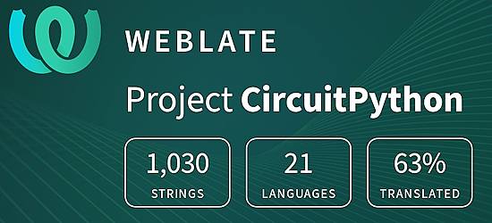](https://hosted.weblate.org/engage/circuitpython/)

One important feature of CircuitPython is translated control and error messages. With the help of fellow open source project [Weblate](https://weblate.org/), we're making it even easier to add or improve translations. 

Sign in with an existing account such as GitHub, Google or Facebook and start contributing through a simple web interface. No forks or pull requests needed! As always, if you run into trouble join us on [Discord](https://adafru.it/discord), we're here to help.

## 39,039 Thanks

The Adafruit Discord community, where we do all our CircuitPython development in the open, reached over 39,039 humans - thank you! Adafruit believes Discord offers a unique way for Python on hardware folks to connect. Join today at [https://adafru.it/discord](https://adafru.it/discord).

## ICYMI - In case you missed it

Python on hardware is the Adafruit Python video-newsletter-podcast! The news comes from the Python community, Discord, Adafruit communities and more and is broadcast on ASK an ENGINEER Wednesdays. The complete Python on Hardware weekly videocast [playlist is here](https://www.youtube.com/playlist?list=PLjF7R1fz_OOXRMjM7Sm0J2Xt6H81TdDev). The video podcast is on [iTunes](https://itunes.apple.com/us/podcast/python-on-hardware/id1451685192?mt=2), [YouTube](http://adafru.it/pohepisodes), [Instagram](https://www.instagram.com/adafruit/channel/)), and [XML](https://itunes.apple.com/us/podcast/python-on-hardware/id1451685192?mt=2).

[The weekly community chat on Adafruit Discord server CircuitPython channel - Audio / Podcast edition](https://itunes.apple.com/us/podcast/circuitpython-weekly-meeting/id1451685016) - Audio from the Discord chat space for CircuitPython, meetings are usually Mondays at 2pm ET, this is the audio version on [iTunes](https://itunes.apple.com/us/podcast/circuitpython-weekly-meeting/id1451685016), Pocket Casts, [Spotify](https://adafru.it/spotify), and [XML feed](https://adafruit-podcasts.s3.amazonaws.com/circuitpython_weekly_meeting/audio-podcast.xml).

## Contribute

The CircuitPython Weekly Newsletter is a CircuitPython community-run newsletter emailed every Monday. The complete [archives are here](https://www.adafruitdaily.com/category/circuitpython/). It highlights the latest CircuitPython related news from around the web including Python and MicroPython developments. To contribute, edit next week's draft [on GitHub](https://github.com/adafruit/circuitpython-weekly-newsletter/tree/gh-pages/_drafts) and [submit a pull request](https://help.github.com/articles/editing-files-in-your-repository/) with the changes. You may also tag your information on Twitter with #CircuitPython. 

Join the Adafruit [Discord](https://adafru.it/discord) or [post to the forum](https://forums.adafruit.com/viewforum.php?f=60) if you have questions.
