- [ ] Library and info updates
- [ ] change date
- [ ] update title
- [ ] Feature story
- [ ] Update  for images
- [ ] Update ICYDNCI
- [ ] All images 550w max only
- [ ] Link "View this email in your browser."

News Sources

- [Adafruit Playground](https://adafruit-playground.com/)
- Twitter: [CircuitPython](https://twitter.com/search?q=circuitpython&src=typed_query&f=live), [MicroPython](https://twitter.com/search?q=micropython&src=typed_query&f=live) and [Python](https://twitter.com/search?q=python&src=typed_query)
- [Raspberry Pi News](https://www.raspberrypi.com/news/)
- Mastodon [CircuitPython](https://mastodon.social/tags/CircuitPython) and [MicroPython](https://mastodon.social/tags/MicroPython)
- [hackster.io CircuitPython](https://www.hackster.io/search?q=circuitpython&i=projects&sort_by=most_recent) and [MicroPython](https://www.hackster.io/search?q=micropython&i=projects&sort_by=most_recent)
- YouTube: [CircuitPython](https://www.youtube.com/results?search_query=circuitpython&sp=CAI%253D), [MicroPython](https://www.youtube.com/results?search_query=micropython&sp=CAI%253D), [Prof Gallaugher](https://www.youtube.com/@BuildWithProfG/videos), [Teacher Brogan M. Pratt CircuitPython](https://www.youtube.com/playlist?list=PLRHdgFNRLyaN6eCw8b0yoHKDY9B4GiirU), [Teacher Brogan M. Pratt CircuitPython search](https://www.youtube.com/@BroganMPratt/search?query=circuitpython)
- Instructables: [CircuitPython](https://www.instructables.com/search/?q=circuitpython&projects=all&sort=Newest), [MicroPython](https://www.instructables.com/search/?q=micropython&projects=all&sort=Newest), [Raspberry Pi Python](https://www.instructables.com/search/?q=raspberry+pi+python&projects=all&sort=Newest)
- [hackaday CircuitPython](https://hackaday.com/blog/?s=circuitpython) and [MicroPython](https://hackaday.com/blog/?s=micropython)
- [python.org](https://www.python.org/)
- [Python Insider - dev team blog](https://pythoninsider.blogspot.com/)
- Individuals: [Jeff Geerling](https://www.jeffgeerling.com/blog), [Yakroo](https://x.com/Yakroo5077)
- Tom's Hardware: [CircuitPython](https://www.tomshardware.com/search?searchTerm=circuitpython&articleType=all&sortBy=publishedDate) and [MicroPython](https://www.tomshardware.com/search?searchTerm=micropython&articleType=all&sortBy=publishedDate) and [Raspberry Pi](https://www.tomshardware.com/search?searchTerm=raspberry%20pi&articleType=all&sortBy=publishedDate)
- [hackaday.io newest projects MicroPython](https://hackaday.io/projects?tag=micropython&sort=date) and [CircuitPython](https://hackaday.io/projects?tag=circuitpython&sort=date)
- [Google News Python](https://news.google.com/topics/CAAqIQgKIhtDQkFTRGdvSUwyMHZNRFY2TVY4U0FtVnVLQUFQAQ?hl=en-US&gl=US&ceid=US%3Aen)
- hackaday.io - [CircuitPython](https://hackaday.io/search?term=circuitpython) and [MicroPython](https://hackaday.io/search?term=micropython)

View this email in your browser. **Warning: Flashing Imagery**

Welcome to the latest Python on Microcontrollers newsletter! Ah, just off a holiday weekend in the States and I cannot complain it's finally hot. - *Anne Barela, Editor*

We're on [Discord](https://discord.gg/HYqvREz), [Twitter/X](https://twitter.com/search?q=circuitpython&src=typed_query&f=live), [BlueSky](https://bsky.app/profile/circuitpython.org) and for past newsletters - [view them all here](https://www.adafruitdaily.com/category/circuitpython/). If you're reading this on the web, please [subscribe here](https://www.adafruitdaily.com/). Here's the news this week:

## Headline

text - [site](url).

## Use VS Code Anywhere, Even Mobile Devices, with Code-Server

[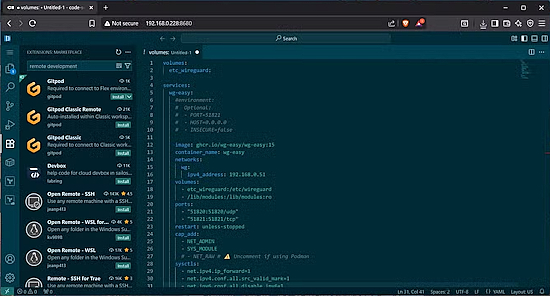](https://www.xda-developers.com/code-server-changed-my-workflow/)

Visual Studio Code-Server, running on a server, allows any device to connect via a web browser and edit their Python code - [XDA](https://www.xda-developers.com/code-server-changed-my-workflow/). Via [X](https://x.com/xdadevelopers/status/1940380131475771840?s=03).

## pyDrone is an ESP32-S3 Drone Running MicroPython Firmware

[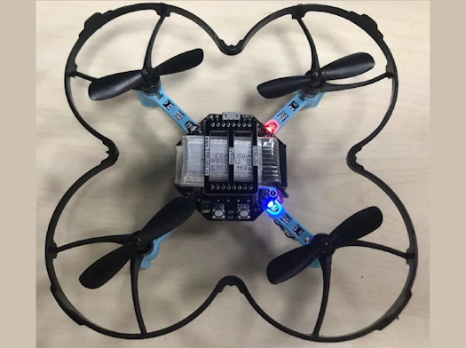](https://www.cnx-software.com/2025/07/02/pydrone-an-esp32-s3-drone-programmable-with-micropython/)

pyDrone – An ESP32-S3 drone running MicroPython firmware. It can be controlled over WiFi or Bluetooth using a pyController gamepad, also based on the same ESP32-S3 module and uses an OV2640 camera module - [CNX Software](https://www.cnx-software.com/2025/07/02/pydrone-an-esp32-s3-drone-programmable-with-micropython/).

## Get Your Pi Information On The Go

[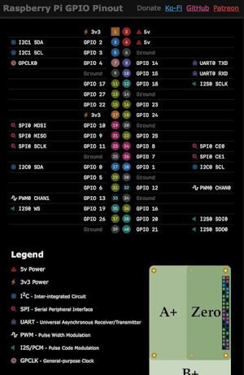](https://pi.pinout.xyz/)

It happens, you're prototyping in the hackerspace (or pub) with folks and you need the Raspberry Pi pinout. Do you download the 600 page PDF? It's much easier to go to [pi.pinout.xyz](https://pi.pinout.xyz/) to get beautiful pinouts that are mobile friendly. Check out the different pinouts available - [pi.pinout.xyz](https://pi.pinout.xyz/). Via [X](https://bsky.app/profile/gadgetoid.com/post/3lt2k3c2ch22k).

## The Raspberry Pi Radio Module 2 Has Been Released

[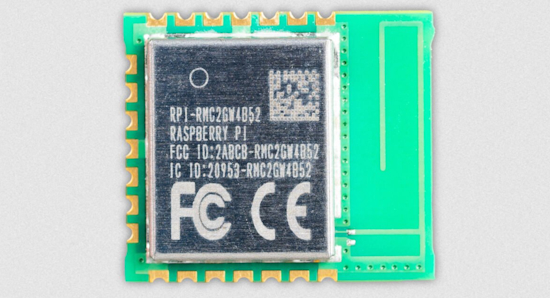](https://www.raspberrypi.com/news/raspberry-pi-radio-module-2-available-now-at-4/)

The new Raspberry Pi Radio Module 2 packages the same Infineon CYW43439 radio used on Raspberry Pi Pico W and Pico 2 W, capable of 2.4GHz WiFi 4 (802.11n) and Bluetooth 5.2. It's supported by the Raspberry Pi Pico SDK and MicroPython - [Raspberry Pi News](https://www.raspberrypi.com/news/raspberry-pi-radio-module-2-available-now-at-4/).

## 5 Kid-Friendly Raspberry Pi Build Ideas to Power up Summer Learning

[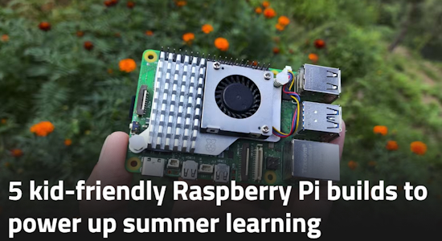](https://www.xda-developers.com/kid-friendly-raspberry-pi-builds-power-summer-learning/)

Likely you have a Raspberry Pi lying around and perhaps children off on school break. XDA presents 5 kid-friendly Raspberry Pi builds to kick off summer learning - [XDA](https://www.xda-developers.com/kid-friendly-raspberry-pi-builds-power-summer-learning/).

## This Week's Python Streams

Python on Hardware is all about building a cooperative ecosphere which allows contributions to be valued and to grow knowledge. Below are the streams within the last week focusing on the community.

**CircuitPython Deep Dive Stream**

[Last Friday](link), Tim streamed work on {subject}.

You can see the latest video and past videos on the Adafruit YouTube channel under the Deep Dive playlist - [YouTube](https://www.youtube.com/playlist?list=PLjF7R1fz_OOXBHlu9msoXq2jQN4JpCk8A).

**CircuitPython Parsec**

John Park’s CircuitPython Parsec this week is on {subject} - [Adafruit Blog](link) and [YouTube](link).

Catch all the episodes in the [YouTube playlist](https://www.youtube.com/playlist?list=PLjF7R1fz_OOWFqZfqW9jlvQSIUmwn9lWr).

**CircuitPython Weekly Meeting**

CircuitPython Weekly Meeting for June 30, 2025 ([notes](https://github.com/adafruit/adafruit-circuitpython-weekly-meeting/blob/main/2025/2025-06-30.md)) [on YouTube](https://youtu.be/orrvsB_hkYc).

## Project of the Week

text - [site](url).

## Popular Last Week

What was the most popular, most clicked link, in [last week's newsletter](https://www.adafruitdaily.com/2025/06/30/python-on-microcontrollers-newsletter-micropython-on-ancient-macs-new-circuitpython-10-alpha-and-much-more-circuitpython-python-micropython-thepsf-raspberry_pi/)? [CircuitPython 10.0.0-alpha.7 Released](https://blog.adafruit.com/2025/06/17/circuitpython-10-0-0-alpha-7-released/).

Did you know you can read past issues of this newsletter in the Adafruit Daily Archive? [Check it out](https://www.adafruitdaily.com/category/circuitpython/).

## New Notes from Adafruit Playground

[Adafruit Playground](https://adafruit-playground.com/) is a new place for the community to post their projects and other making tips/tricks/techniques. Ad-free, it's an easy way to publish your work in a safe space for free.

[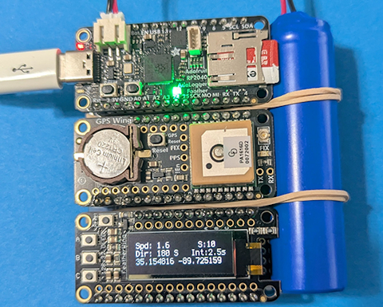](https://adafruit-playground.com/u/danak/pages/gps-tracker-coding-in-circuitpython-going-down-the-ai-rabbit-hole)

GPS Tracker Coding in CircuitPython - Going Down the AI Rabbit Hole - [Adafruit Playground](https://adafruit-playground.com/u/danak/pages/gps-tracker-coding-in-circuitpython-going-down-the-ai-rabbit-hole).

[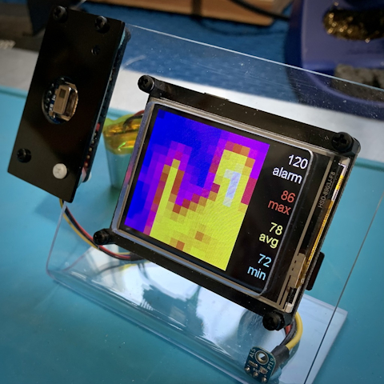](https://adafruit-playground.com/u/CGrover/pages/aio-connected-workshop-thermal-camera)

AIO-Connected Workshop Thermal Camera - [Adafruit Playground](https://adafruit-playground.com/u/CGrover/pages/aio-connected-workshop-thermal-camera).

text - [Adafruit Playground](url).

## News From Around the Web

[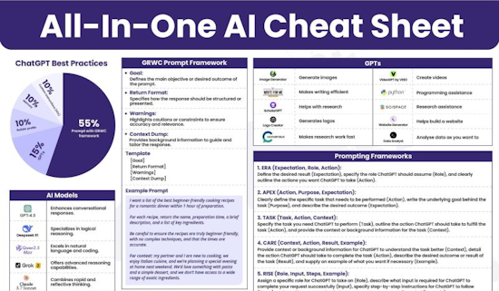](https://www.linkedin.com/posts/mattvillage_most-people-dont-know-how-to-use-ai-the-activity-7345088663917125632-qUMc/)

Cheat sheets are one of the more popular items when posted to the newsletter. As AI and LLMs are more available, here is a decent cheat sheet on AI - [LinkedIn](https://www.linkedin.com/posts/mattvillage_most-people-dont-know-how-to-use-ai-the-activity-7345088663917125632-qUMc/).

Kevin McAleer is making an x-y plotter with stepper motors and MicroPython - [YouTube](https://www.youtube.com/watch?v=ETFdvdC-9Oo).

text - [site](url).

text - [site](url).

text - [site](url).

text - [site](url).

[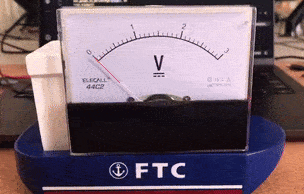](https://x.com/simon_prickett/status/1940765559353913473)

Simon Prickett is making a CircuitPython project to display data on Adafruit voltmeters. The code code sets the meter to a % value - [X](https://x.com/simon_prickett/status/1940765559353913473).

text - [site](url).

text - [site](url).

text - [site](url).

text - [site](url).

text - [site](url).

text - [site](url).

text - [site](url).

text - [site](url).

text - [site](url).

text - [site](url).

text - [site](url).

## New

[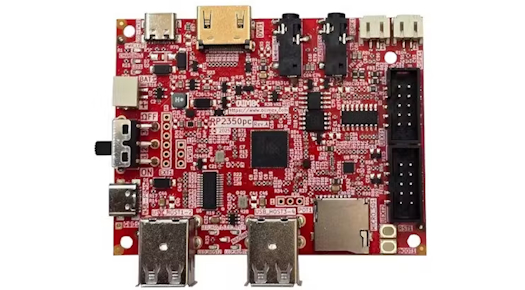](https://www.hackster.io/news/olimex-unveils-the-rp2350pc-a-retro-styled-single-board-computer-powered-by-raspberry-pi-s-rp2350b-4fced8b934d7)

Olimex unveils the RP2350pc, a retro-styled single-board computer powered by Raspberry Pi's RP2350B - [hackster.io](https://www.hackster.io/news/olimex-unveils-the-rp2350pc-a-retro-styled-single-board-computer-powered-by-raspberry-pi-s-rp2350b-4fced8b934d7).

[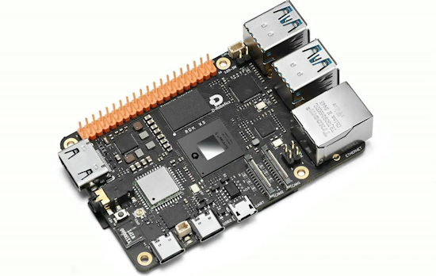](https://www.cnx-software.com/2025/06/30/d-robotics-rdk-x5-development-board-features-sunrise-x5-octa-core-soc-with-10-tops-bpu-for-ros-projects/)

The D-Robotics RDK X5 is an upgraded AI development board using a Sunrise X5 octa-core SoC. The RDK X5 comes with an 8-core Cortex-A55 SoC, a 10 TOPS NPU, and 8GB of RAM - [CNX Software](https://www.cnx-software.com/2025/06/30/d-robotics-rdk-x5-development-board-features-sunrise-x5-octa-core-soc-with-10-tops-bpu-for-ros-projects/).

## New Boards Supported by CircuitPython

The number of supported microcontrollers and Single Board Computers (SBC) grows every week. This section outlines which boards have been included in CircuitPython or added to [CircuitPython.org](https://circuitpython.org/).

This week there were (#/no) new boards added:

- [Board name](url)
- [Board name](url)
- [Board name](url)

*Note: For non-Adafruit boards, please use the support forums of the board manufacturer for assistance, as Adafruit does not have the hardware to assist in troubleshooting.*

Looking to add a new board to CircuitPython? It's highly encouraged! Adafruit has four guides to help you do so:

- [How to Add a New Board to CircuitPython](https://learn.adafruit.com/how-to-add-a-new-board-to-circuitpython/overview)
- [How to add a New Board to the circuitpython.org website](https://learn.adafruit.com/how-to-add-a-new-board-to-the-circuitpython-org-website)
- [Adding a Single Board Computer to PlatformDetect for Blinka](https://learn.adafruit.com/adding-a-single-board-computer-to-platformdetect-for-blinka)
- [Adding a Single Board Computer to Blinka](https://learn.adafruit.com/adding-a-single-board-computer-to-blinka)

## New Learn Guides

[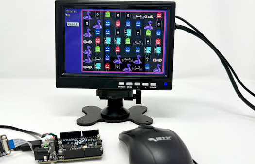](https://learn.adafruit.com/guides/latest)

The Adafruit Learning System has over 3,000 free guides for learning skills and building projects including using Python.

[Tile-Matching Game on the Adafruit Metro RP2350](https://learn.adafruit.com/tile-matching-game-on-the-adafruit-metro-rp2350) from [M. LeBlanc-Williams](https://learn.adafruit.com/u/MakerMelissa)

[title](url) from [name](url)

[title](url) from [name](url)

## Updated Learn Guides

[title](url)

## CircuitPython Libraries

The CircuitPython library numbers are continually increasing, while existing ones continue to be updated. Here we provide library numbers and updates!

To get the latest Adafruit libraries, download the [Adafruit CircuitPython Library Bundle](https://circuitpython.org/libraries). To get the latest community contributed libraries, download the [CircuitPython Community Bundle](https://circuitpython.org/libraries).

If you'd like to contribute to the CircuitPython project on the Python side of things, the libraries are a great place to start. Check out the [CircuitPython.org Contributing page](https://circuitpython.org/contributing). If you're interested in reviewing, check out Open Pull Requests. If you'd like to contribute code or documentation, check out Open Issues. We have a guide on [contributing to CircuitPython with Git and GitHub](https://learn.adafruit.com/contribute-to-circuitpython-with-git-and-github), and you can find us in the #help-with-circuitpython and #circuitpython-dev channels on the [Adafruit Discord](https://adafru.it/discord).

You can check out this [list of all the Adafruit CircuitPython libraries and drivers available](https://github.com/adafruit/Adafruit_CircuitPython_Bundle/blob/master/circuitpython_library_list.md). 

The current number of CircuitPython libraries is **###**!

**New Libraries**

Here are this week's new CircuitPython libraries:

* [library](url)

**Updated Libraries**

Here are this week's updated CircuitPython libraries:

* [library](url)

## What’s the CircuitPython team up to this week?

What is the team up to this week? Let’s check in:

**Dan**

I've finished reworking the "Factory Reset" Learn Guide pages for all our ESP32-S2 and ESP32-S3 boards. The TinyUF2 bootloaders are now organized in per-board directories on AWS S3.

I'm continuing to fix issues prior to the CircuitPython 10.0.0 release. I'm currently debugging a problem with the CIRCUITPY drive not appearing on Windows, when the build is compiled with optimizations for space rather than speed.

**Tim**

This week I published the `adafruit_color_terminal` library. It supports colored text in the terminal using ANSI color escape codes. I've been using it while working on an IRC client app for the new Fruit Jam revision with WiFi support. This week I refactored it to use `Dang`, a subset of the `Curses` framework for CircuitPython. I also added support for TLS connects, sending and receiving DMs, and several channel moderation commands. I'll work on releasing `Dang` as its own library soon as well.

**Liz**

This week I worked on a [Learn Guide for the TPS61169](https://learn.adafruit.com/adafruit-tps61169-constant-current-boost-converter-for-leds). This breakout is a constant current LED driver that makes it easy to power LEDs, like the [nOOds](https://www.adafruit.com/product/5731) and [letter filaments](https://www.adafruit.com/product/6191), with 3-5V. I added a page that walks through how to determine the maximum voltage and current needed for different LEDs and how to wire up LEDs in series with the breakout, which is a common request.

## Upcoming Events

The next MicroPython Meetup in Melbourne will be on July 23rd – [Meetup](https://www.meetup.com/micropython-meetup/events). You can see recordings of previous meetings on [YouTube](https://www.youtube.com/@MicroPythonOfficial). 

PyOhio 2025 will be held Saturday & Sunday July 26 & 27, 2025 at the Cleveland State University Student Center in Cleveland, Ohio - [PyOhio 2025](https://www.pyohio.org/2025/).

KiCad conferences (KiCon) to be held this year include 19 - 20 Sept 2024 in Bochum, Germany, and to be determined in Asia - [KiCad](https://kicon.kicad.org/).

PyCon UK will be at CONTACT in Manchester from Friday 19th September to Monday 22nd September 2025 - [PyCon UK 2025](https://2025.pyconuk.org/).

Maker Faire Bay Area 2025 will be Sep 26 – 28, 2025 in Vallejo, California, US - [Maker Faire](https://bayarea.makerfaire.com/).

**Send Your Events In**

If you know of virtual events or upcoming events, please let us know via email to cpnews(at)adafruit(dot)com.

## Latest Releases

CircuitPython's stable release is [#.#.#](https://github.com/adafruit/circuitpython/releases/latest) and its unstable release is [#.#.#-##.#](https://github.com/adafruit/circuitpython/releases). New to CircuitPython? Start with our [Welcome to CircuitPython Guide](https://learn.adafruit.com/welcome-to-circuitpython).

[2025####](https://github.com/adafruit/Adafruit_CircuitPython_Bundle/releases/latest) is the latest Adafruit CircuitPython library bundle.

[2025####](https://github.com/adafruit/CircuitPython_Community_Bundle/releases/latest) is the latest CircuitPython Community library bundle.

[v#.#.#](https://micropython.org/download) is the latest MicroPython release. Documentation for it is [here](http://docs.micropython.org/en/latest/pyboard/).

[#.#.#](https://www.python.org/downloads/) is the latest Python release. The latest pre-release version is [#.#.#](https://www.python.org/download/pre-releases/).

[#,### Stars](https://github.com/adafruit/circuitpython/stargazers) Like CircuitPython? [Star it on GitHub!](https://github.com/adafruit/circuitpython)

## Call for Help -- Translating CircuitPython is now easier than ever

[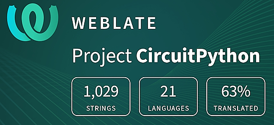](https://hosted.weblate.org/engage/circuitpython/)

One important feature of CircuitPython is translated control and error messages. With the help of fellow open source project [Weblate](https://weblate.org/), we're making it even easier to add or improve translations. 

Sign in with an existing account such as GitHub, Google or Facebook and start contributing through a simple web interface. No forks or pull requests needed! As always, if you run into trouble join us on [Discord](https://adafru.it/discord), we're here to help.

## NUMBER Thanks

The Adafruit Discord community, where we do all our CircuitPython development in the open, reached over NUMBER humans - thank you! Adafruit believes Discord offers a unique way for Python on hardware folks to connect. Join today at [https://adafru.it/discord](https://adafru.it/discord).

## ICYMI - In case you missed it

Python on hardware is the Adafruit Python video-newsletter-podcast! The news comes from the Python community, Discord, Adafruit communities and more and is broadcast on ASK an ENGINEER Wednesdays. The complete Python on Hardware weekly videocast [playlist is here](https://www.youtube.com/playlist?list=PLjF7R1fz_OOXRMjM7Sm0J2Xt6H81TdDev). The video podcast is on [iTunes](https://itunes.apple.com/us/podcast/python-on-hardware/id1451685192?mt=2), [YouTube](http://adafru.it/pohepisodes), [Instagram](https://www.instagram.com/adafruit/channel/)), and [XML](https://itunes.apple.com/us/podcast/python-on-hardware/id1451685192?mt=2).

[The weekly community chat on Adafruit Discord server CircuitPython channel - Audio / Podcast edition](https://itunes.apple.com/us/podcast/circuitpython-weekly-meeting/id1451685016) - Audio from the Discord chat space for CircuitPython, meetings are usually Mondays at 2pm ET, this is the audio version on [iTunes](https://itunes.apple.com/us/podcast/circuitpython-weekly-meeting/id1451685016), Pocket Casts, [Spotify](https://adafru.it/spotify), and [XML feed](https://adafruit-podcasts.s3.amazonaws.com/circuitpython_weekly_meeting/audio-podcast.xml).

## Contribute

The CircuitPython Weekly Newsletter is a CircuitPython community-run newsletter emailed every Monday. The complete [archives are here](https://www.adafruitdaily.com/category/circuitpython/). It highlights the latest CircuitPython related news from around the web including Python and MicroPython developments. To contribute, edit next week's draft [on GitHub](https://github.com/adafruit/circuitpython-weekly-newsletter/tree/gh-pages/_drafts) and [submit a pull request](https://help.github.com/articles/editing-files-in-your-repository/) with the changes. You may also tag your information on Twitter with #CircuitPython. 

Join the Adafruit [Discord](https://adafru.it/discord) or [post to the forum](https://forums.adafruit.com/viewforum.php?f=60) if you have questions.
