- [ ] Library and info updates
- [ ] change date
- [ ] update title
- [ ] Feature story
- [ ] Update  for images
- [ ] Update ICYDNCI
- [ ] All images 550w max only
- [ ] Link "View this email in your browser."

News Sources

- [Adafruit Playground](https://adafruit-playground.com/)
- Twitter: [CircuitPython](https://twitter.com/search?q=circuitpython&src=typed_query&f=live), [MicroPython](https://twitter.com/search?q=micropython&src=typed_query&f=live) and [Python](https://twitter.com/search?q=python&src=typed_query)
- [Raspberry Pi News](https://www.raspberrypi.com/news/)
- Mastodon [CircuitPython](https://mastodon.social/tags/CircuitPython) and [MicroPython](https://mastodon.social/tags/MicroPython)
- [hackster.io CircuitPython](https://www.hackster.io/search?q=circuitpython&i=projects&sort_by=most_recent) and [MicroPython](https://www.hackster.io/search?q=micropython&i=projects&sort_by=most_recent)
- YouTube: [CircuitPython](https://www.youtube.com/results?search_query=circuitpython&sp=CAI%253D), [MicroPython](https://www.youtube.com/results?search_query=micropython&sp=CAI%253D), [Prof Gallaugher](https://www.youtube.com/@BuildWithProfG/videos), [Teacher Brogan M. Pratt CircuitPython](https://www.youtube.com/playlist?list=PLRHdgFNRLyaN6eCw8b0yoHKDY9B4GiirU), [Teacher Brogan M. Pratt CircuitPython search](https://www.youtube.com/@BroganMPratt/search?query=circuitpython)
- Instructables: [CircuitPython](https://www.instructables.com/search/?q=circuitpython&projects=all&sort=Newest), [MicroPython](https://www.instructables.com/search/?q=micropython&projects=all&sort=Newest), [Raspberry Pi Python](https://www.instructables.com/search/?q=raspberry+pi+python&projects=all&sort=Newest)
- [hackaday CircuitPython](https://hackaday.com/blog/?s=circuitpython) and [MicroPython](https://hackaday.com/blog/?s=micropython)
- [python.org](https://www.python.org/)
- [Python Insider - dev team blog](https://pythoninsider.blogspot.com/)
- Individuals: [Jeff Geerling](https://www.jeffgeerling.com/blog), [Yakroo](https://x.com/Yakroo5077)
- Tom's Hardware: [CircuitPython](https://www.tomshardware.com/search?searchTerm=circuitpython&articleType=all&sortBy=publishedDate) and [MicroPython](https://www.tomshardware.com/search?searchTerm=micropython&articleType=all&sortBy=publishedDate) and [Raspberry Pi](https://www.tomshardware.com/search?searchTerm=raspberry%20pi&articleType=all&sortBy=publishedDate)
- [hackaday.io newest projects MicroPython](https://hackaday.io/projects?tag=micropython&sort=date) and [CircuitPython](https://hackaday.io/projects?tag=circuitpython&sort=date)
- [Google News Python](https://news.google.com/topics/CAAqIQgKIhtDQkFTRGdvSUwyMHZNRFY2TVY4U0FtVnVLQUFQAQ?hl=en-US&gl=US&ceid=US%3Aen)
- hackaday.io - [CircuitPython](https://hackaday.io/search?term=circuitpython) and [MicroPython](https://hackaday.io/search?term=micropython)

View this email in your browser. **Warning: Flashing Imagery**

Welcome to the latest Python on Microcontrollers newsletter! *insert 2-3 sentences from editor (what's in overview, banter)* - *Anne Barela, Editor*

We're on [Discord](https://discord.gg/HYqvREz), [Twitter/X](https://twitter.com/search?q=circuitpython&src=typed_query&f=live), [BlueSky](https://bsky.app/profile/circuitpython.org) and for past newsletters - [view them all here](https://www.adafruitdaily.com/category/circuitpython/). If you're reading this on the web, please [subscribe here](https://www.adafruitdaily.com/). Here's the news this week:

## CircuitPython 10.0.0-alpha.8 Released

[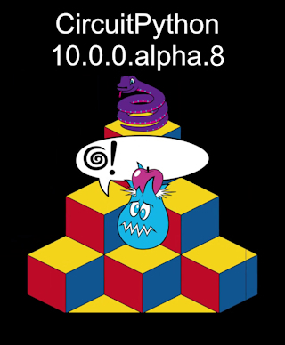](https://blog.adafruit.com/2025/07/08/circuitpython-10-0-0-alpha-8-released/)

CircuitPython 10.0.0-alpha.8 is an alpha release for 10.0.0. Further features, changes, and bug fixes will be added before the final release - [Adafruit Blog](https://blog.adafruit.com/2025/07/08/circuitpython-10-0-0-alpha-8-released/) and release notes - [GitHub](https://github.com/adafruit/circuitpython/releases/tag/10.0.0-alpha.8).

**Highlights of this release**

* Increase the firmware partition size for ESP32-S3 boards with 4MB flash, allowing more features to be included, including BLE. You must update the TinyUF2 bootloader on these boards. See the notes.
* Merge updates from MicroPython v1.25.0.
* Fix regressions caused by SD automount capability.
* Add `Terminal.cursor_x` and `.cursor_y`.
* Add `picodvi.Framebuffer.color_depth`.

## Building an Autonomous LEGO Train with CircuitPython and LIDAR

Dr. Lorraine Underwood hacks a Bluetooth-controlled LEGO train, mounting a track system to the ceiling of her home. She integrates CircuitPython, a Seeed XIAO board, NeoPixels, and a spinning LIDAR sensor to detect walls and control the train’s movement - [Element14](https://community.element14.com/challenges-projects/element14-presents/project-videos/w/documents/71936/building-an-autonomous-lego-train-with-circuitpython-and-lidar----episode-672?CMP=SOM-YOUTUBE-PRG-E14PRESENTS-EP672-COMM) and [YouTube](https://youtu.be/hgJ8ywYu6bY). Via [BlueSky](https://bsky.app/profile/lmcunderwood.bsky.social/post/3lt6h5mzls22f).

## Choose the Best Board for Wearables

[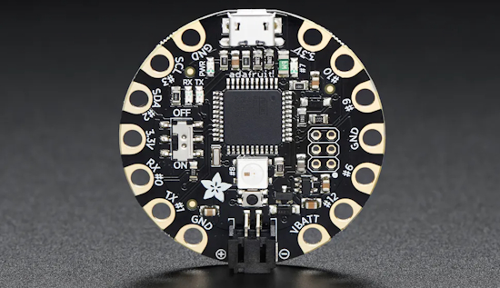](https://makezine.com/article/technology/microcontrollers/choose-the-best-board-for-wearables/)

Make: looks at boards suitable for wearaable projects in their latest piece. If you're going for MicroPython or CircuitPython, look at the Feather line in the article. They range from the SAMD21 (small scale) to the latest Pi RP2350 (runs code best) - [Make:](https://makezine.com/article/technology/microcontrollers/choose-the-best-board-for-wearables/).

## Despite 30 Months Work, Core Developer Says Python’s JIT Compiler is Often Slower Than the Interpreter

Ken Jin, a CPython core developer who works on the experimental JIT (just in time) compiler optimizer, says that after two and half years work, the “JIT ranges from slower than the interpreter to roughly equivalent to the interpreter.” The JIT compiler is included in Python 3.13, released in October 2024, but only when CPython is built using the `–enable-experimental-jit` option - [DevClass](https://devclass.com/2025/07/09/despite-30-months-work-core-developer-says-pythons-jit-compiler-is-often-slower-than-the-interpreter/).

## Setting Up Vim for Coding Python

The Vim editor is ubiquitous and free. Follow Real Python's tutorial on how to configure it to help you code Python - [Real Python](https://realpython.com/vim-and-python-a-match-made-in-heaven/).

## A Handy Utility For Seeing CircuitPython Pins

[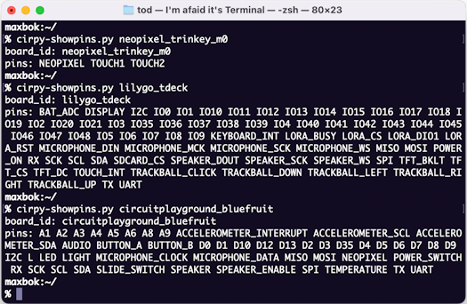](https://mastodon.social/@todbot/114802213324694124)

A Python 3 command line utility to see the defined pins for CircuitPython boards - [GitHub]([url](https://gist.github.com/todbot/e91853b9d5e021405bb9a85081a39163)). Via [Mastodon](https://mastodon.social/@todbot/114802213324694124).

## Lower Prices for 4GB and 8GB Raspberry Pi Compute Module 4

[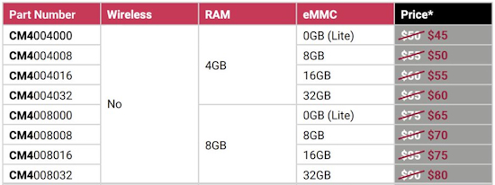](https://www.raspberrypi.com/news/lower-prices-for-4gb-and-8gb-compute-module-4/)

Raspberry Pi announced a reduction in the price of some variants of Raspberry Pi Compute Module 4. If you buy a standard operating temperature Compute Module 4 from a Raspberry Pi Approved Reseller, it will cost you $5 less for a 4GB RAM variant, and $10 less for an 8GB RAM variant - [Raspberry Pi News](https://www.raspberrypi.com/news/lower-prices-for-4gb-and-8gb-compute-module-4/).

## This Week's Python Streams

Python on Hardware is all about building a cooperative ecosphere which allows contributions to be valued and to grow knowledge. Below are the streams within the last week focusing on the community.

**CircuitPython Deep Dive Stream**

[Last Friday](https://youtube.com/live/EsjNreq4ibA), Tim streamed work on the Adafruit Raspberry Pi Triple Matrix Bonnet.

You can see the latest video and past videos on the Adafruit YouTube channel under the Deep Dive playlist - [YouTube](https://www.youtube.com/playlist?list=PLjF7R1fz_OOXBHlu9msoXq2jQN4JpCk8A).

**CircuitPython Parsec**

John Park’s CircuitPython Parsec this week is on {subject} - [Adafruit Blog](link) and [YouTube](link).

Catch all the episodes in the [YouTube playlist](https://www.youtube.com/playlist?list=PLjF7R1fz_OOWFqZfqW9jlvQSIUmwn9lWr).

## Project of the Week: A DIY IR Camera

[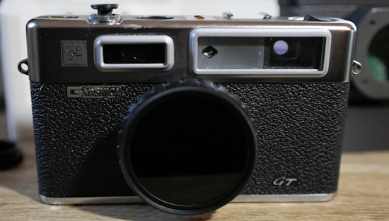](https://camerahacksbymalcolmjay.substack.com/p/ir-camera-build)

Malcom Wilson built a digital infrared camera in a Yashica Film body. It's built with a Raspberry Pi Zero 2 W, Pi Camera 3 NoIR and OLED display, programmed in Python - [Camera Hacks by Malcom-Jay](https://camerahacksbymalcolmjay.substack.com/p/ir-camera-build).

## Popular Last Week

What was the most popular, most clicked link, in [last week's newsletter](https://www.adafruitdaily.com/2025/07/07/python-on-microcontrollers-newsletter-use-vs-code-anywhere-fun-summer-projects-and-much-more-circuitpython-python-micropython-thepsf-raspberry_pi/)? [AI Cheat Sheet](https://www.linkedin.com/posts/mattvillage_most-people-dont-know-how-to-use-ai-the-activity-7345088663917125632-qUMc/).

Did you know you can read past issues of this newsletter in the Adafruit Daily Archive? [Check it out](https://www.adafruitdaily.com/category/circuitpython/).

## Adafruit Playground Notes

[Adafruit Playground](https://adafruit-playground.com/) is a new place for the community to post their projects and other making tips/tricks/techniques. Ad-free, it's an easy way to publish your work in a safe space for free.

## News From Around the Web

[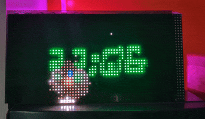](https://www.xda-developers.com/stunning-raspberry-pi-arcade-clock/)

This LEDarcade clock runs on Raspberry Pi, features retro arcade games, and shows time in style. It uses a Raspberry Pi 3, an Adafruit LED Matrix, and an RGB Hat, and uses Python - [XDA](https://www.xda-developers.com/stunning-raspberry-pi-arcade-clock/) and [GitHub](https://github.com/hzeller/rpi-rgb-led-matrix).

[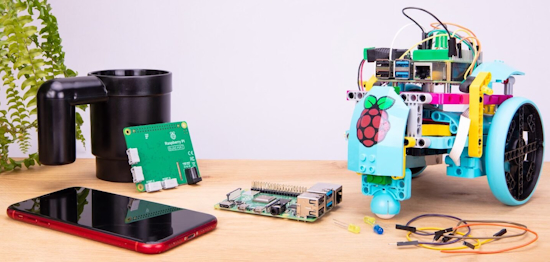](https://www.raspberrypi.com/news/build-hat-firmware-now-fully-open-source/)

The Raspberry Pi Build HAT is an add-on board designed in collaboration with LEGO® Education. It makes it easy to control LEGO Technic motors and sensors — like those found in the LEGO® Education SPIKE™ Prime set — directly from a Raspberry Pi (using Python, etc.). The Build HAT firmware, together with its signing keys, are now open source and available under a permissive BSD 3-Clause license - [Raspberry Pi News](https://www.raspberrypi.com/news/build-hat-firmware-now-fully-open-source/).

GamerCard is a portable gaming device the size of a gift card and made by the nephew of the ZX Spectrum inventor. It is powered by Raspberry Pi and has a high-resolution (254 PPI) 4” square IPS screen. GamerCard comes preloaded with high-energy arcade-style games and supports development coding in MicroPython, C, C++, and BASIC - [LinkedIn](https://www.linkedin.com/pulse/sinclair-invents-gift-card-size-pi-gaming-pc-grant-sinclair-fjkfe/). Via [Tom's Hardware](https://www.tomshardware.com/video-games/handheld-gaming/nephew-of-the-zx-spectrum-inventor-has-created-a-handheld-raspberry-pi-console-the-size-of-a-gift-card-gamercard-features-4-square-ips-screen-and-pre-loaded-arcade-games).

[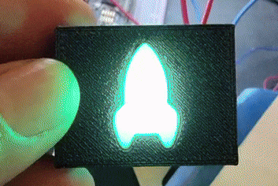](https://x.com/NetEng_Ian/status/1941259550579192013)

A light-up tactile button. Printed in PETG, using an Adafruit Feather RP2040 microcontroller, NeoPixel button PCB, and CircuitPython - [X](https://x.com/NetEng_Ian/status/1941259550579192013).

Two new CircuitPython School videos out from Boston College:

[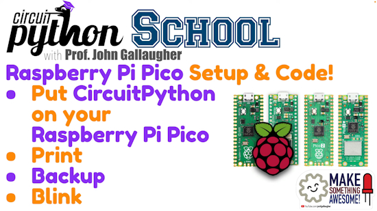](https://www.youtube.com/watch?v=d6e6En1OjNQ)

Learn Raspberry Pi Pico programming! Install CircuitPython on a Pico, print, and flash the LED! - [YouTube](https://www.youtube.com/watch?v=d6e6En1OjNQ).

[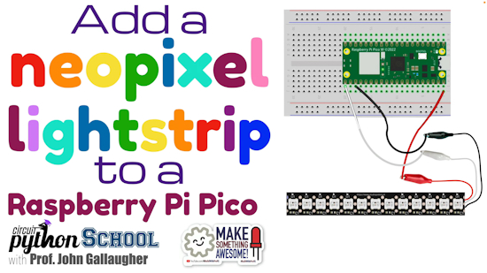](https://www.youtube.com/watch?v=o086k0E9XoQ)

Connecting a NeoPixel strip to a Raspberry Pi Pico (Pico School) - [YouTube](https://www.youtube.com/watch?v=o086k0E9XoQ).

Ubuntu 25.10 release to mandate RVA23 profile, obsoleting most RISC-V hardware, including the Orange Pi RV2 released March 2025 - [CNX](https://www.cnx-software.com/2025/07/08/ubuntu-25-10-release-to-mandate-rva23-profile-obsoleting-most-risc-v-hardware/).

[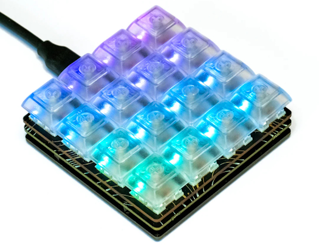](https://github.com/giacomo/pico-rgb-keyboard)

A 16-key RGB keypad (Keybow/Pimoroni RGBKeypad) powered by CircuitPython to act as a media controller, keyboard macro pad, and animated LED visualizer. It also includes a built-in web server hosted on the device for static file serving - [GitHub](https://github.com/giacomo/pico-rgb-keyboard). Via [Reddit](https://www.reddit.com/r/circuitpython/comments/1lqjy9d/rgb_keypad_media_controller_with_visual_modes_web/).

[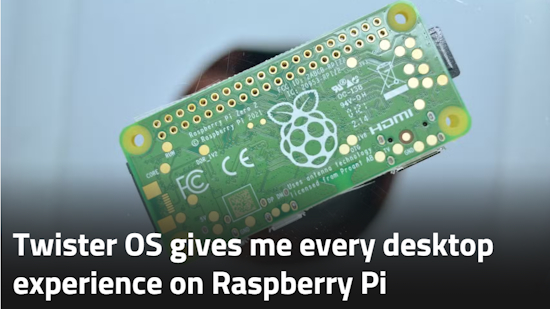](https://www.xda-developers.com/twister-os-gives-me-every-desktop-experience-raspberry-pi/)

Twister OS gives me every desktop experience on Raspberry Pi - [CDA](https://www.xda-developers.com/twister-os-gives-me-every-desktop-experience-raspberry-pi/).

[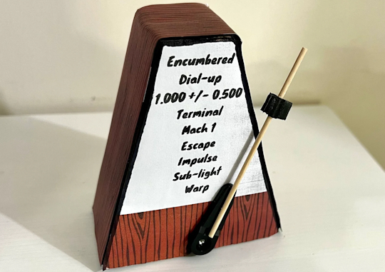](https://mikecoats.com/metronalmost/)

metronalmost (noun): A metronome that beats at almost, but never quite exactly, 60 beats per minute, made with an ESP8266 and MicroPython - [Mike Coats](https://mikecoats.com/metronalmost/).

[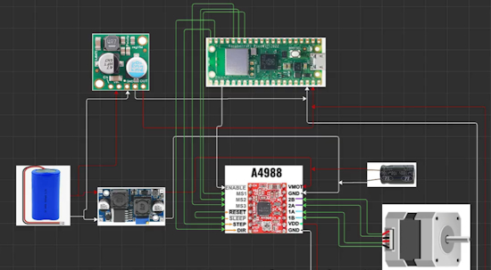](https://www.youtube.com/watch?v=b6R0arMrFBs)

Building a WiFi self-balancing robot with Pico W board, driving a NEMA 17 stepper motor with an A4988 driver and MicroPython - [YouTube](https://www.youtube.com/watch?v=b6R0arMrFBs).

text - [site](url).

[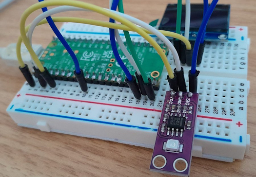](https://timhanewich.medium.com/using-the-guva-s12sd-solar-uv-sensor-with-a-raspberry-pi-pico-6e3212ab6690)

A MicroPython driver for the GUVA-S12SD UV sensor - [Medium](https://timhanewich.medium.com/using-the-guva-s12sd-solar-uv-sensor-with-a-raspberry-pi-pico-6e3212ab6690). Via [X](https://x.com/TimHanewich/status/1941600688309506395).

text - [site](url).

text - [site](url).

text - [site](url).

Learn how to write high-quality, readable code by using the Python style guidelines laid out in PEP 8 - [Real Python](https://realpython.com/python-pep8/).

Run your Python code up to 80x faster using the Cython library - [Towards Data Science](https://towardsdatascience.com/run-your-python-code-up-to-80x-faster-using-the-cython-library/).

## New

[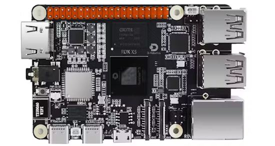](https://www.hackster.io/news/d-robotics-launches-the-10-tops-edge-ai-rdk-x5-and-teases-the-96-tops-rdk-ultra-c88714dab9d5)

D-Robotics launches the 10 TOPS Edge AI RDK X5 — and teases the 96 TOPS RDK Ultra - [hackster.io](https://www.hackster.io/news/d-robotics-launches-the-10-tops-edge-ai-rdk-x5-and-teases-the-96-tops-rdk-ultra-c88714dab9d5).

[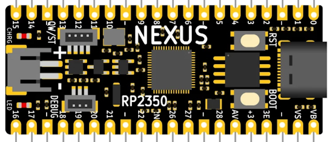](https://www.cnx-software.com/2025/07/01/nexus-rp2350-lipo-board-improves-on-raspberry-pi-pico-2-with-lipo-battery-support-16mb-flash-usb-c-port/)

The Nexus RP2350 LiPo board improves on Raspberry Pi Pico 2 with LiPo battery support, 16MB flash, USB-C port - [CNX Software](https://www.cnx-software.com/2025/07/01/nexus-rp2350-lipo-board-improves-on-raspberry-pi-pico-2-with-lipo-battery-support-16mb-flash-usb-c-port/).

[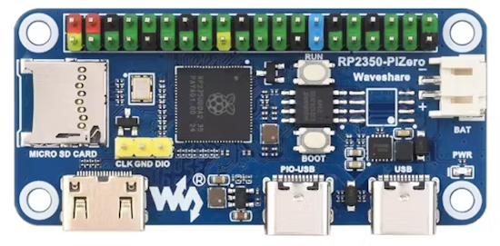](https://www.hackster.io/news/waveshare-melds-the-raspberry-pi-pico-and-raspberry-pi-zero-families-into-the-rp2350-pizero-52317fcd7074)

Waveshare melds the Raspberry Pi Pico and Raspberry Pi Zero families into the RP2350-PiZero - [hackster.io](https://www.hackster.io/news/waveshare-melds-the-raspberry-pi-pico-and-raspberry-pi-zero-families-into-the-rp2350-pizero-52317fcd7074).

## New Boards Supported by CircuitPython

The number of supported microcontrollers and Single Board Computers (SBC) grows every week. This section outlines which boards have been included in CircuitPython or added to [CircuitPython.org](https://circuitpython.org/).

This week there were (#/no) new boards added:

- [Board name](url)
- [Board name](url)
- [Board name](url)

*Note: For non-Adafruit boards, please use the support forums of the board manufacturer for assistance, as Adafruit does not have the hardware to assist in troubleshooting.*

Looking to add a new board to CircuitPython? It's highly encouraged! Adafruit has four guides to help you do so:

- [How to Add a New Board to CircuitPython](https://learn.adafruit.com/how-to-add-a-new-board-to-circuitpython/overview)
- [How to add a New Board to the circuitpython.org website](https://learn.adafruit.com/how-to-add-a-new-board-to-the-circuitpython-org-website)
- [Adding a Single Board Computer to PlatformDetect for Blinka](https://learn.adafruit.com/adding-a-single-board-computer-to-platformdetect-for-blinka)
- [Adding a Single Board Computer to Blinka](https://learn.adafruit.com/adding-a-single-board-computer-to-blinka)

## New Learn Guides

[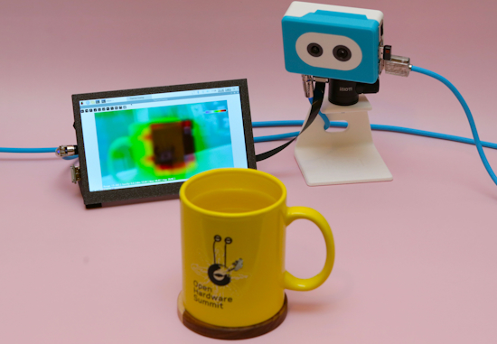](https://learn.adafruit.com/guides/latest)

The Adafruit Learning System has over 3,000 free guides for learning skills and building projects including using Python.

[Raspberry Pi Thermal Camera](https://learn.adafruit.com/raspberry-pi-thermal-camera) from [Ruiz Brothers](https://learn.adafruit.com/u/pixil3d) and [Liz Clark](https://learn.adafruit.com/u/BlitzCityDIY)

[title](url) from [name](url)

[title](url) from [name](url)

## Updated Learn Guides

[title](url)

## CircuitPython Libraries

The CircuitPython library numbers are continually increasing, while existing ones continue to be updated. Here we provide library numbers and updates!

To get the latest Adafruit libraries, download the [Adafruit CircuitPython Library Bundle](https://circuitpython.org/libraries). To get the latest community contributed libraries, download the [CircuitPython Community Bundle](https://circuitpython.org/libraries).

If you'd like to contribute to the CircuitPython project on the Python side of things, the libraries are a great place to start. Check out the [CircuitPython.org Contributing page](https://circuitpython.org/contributing). If you're interested in reviewing, check out Open Pull Requests. If you'd like to contribute code or documentation, check out Open Issues. We have a guide on [contributing to CircuitPython with Git and GitHub](https://learn.adafruit.com/contribute-to-circuitpython-with-git-and-github), and you can find us in the #help-with-circuitpython and #circuitpython-dev channels on the [Adafruit Discord](https://adafru.it/discord).

You can check out this [list of all the Adafruit CircuitPython libraries and drivers available](https://github.com/adafruit/Adafruit_CircuitPython_Bundle/blob/master/circuitpython_library_list.md). 

The current number of CircuitPython libraries is **###**!

**New Libraries**

Here are this week's new CircuitPython libraries:

* [library](url)

**Updated Libraries**

Here are this week's updated CircuitPython libraries:

* [library](url)

## What’s the CircuitPython team up to this week?

What is the team up to this week? Let’s check in:

**Dan**

text.

**Tim**

This week I added support for a beep command in the Fruit Jam IRC client that I've been working on. While working on this I tracked down an issue dealing with using both the ESP32SPI co-processor and audio DAC after working out the specific code that causes it and a way to work around it. I've also started working on the learn guide for the Triple Matrix Bonnet for HUB75 RGB Matrices.

**Liz**

This week I worked on the [Learn Guide for the AS5600 Magnetic Angle Sensor](https://learn.adafruit.com/adafruit-as5600-magnetic-angle-sensor). This sensor uses a magnet for rotational sensing without any mechanical connection. It's often used for rotary encoder or potentiometers with positional context. I wrote a CircuitPython driver for the sensor that is a part of the Adafruit bundle. I'd like to do a project where I build an encoder with a magnet and this sensor.

## Upcoming Events

The next MicroPython Meetup in Melbourne will be on July 23rd – [Meetup](https://www.meetup.com/micropython-meetup/events). You can see recordings of previous meetings on [YouTube](https://www.youtube.com/@MicroPythonOfficial). 

PyOhio 2025 will be held Saturday & Sunday July 26 & 27, 2025 at the Cleveland State University Student Center in Cleveland, Ohio - [PyOhio 2025](https://www.pyohio.org/2025/).

KiCad conferences (KiCon) to be held this year include 19 - 20 Sept 2024 in Bochum, Germany, and to be determined in Asia - [KiCad](https://kicon.kicad.org/).

PyCon UK will be at CONTACT in Manchester from Friday 19th September to Monday 22nd September 2025 - [PyCon UK 2025](https://2025.pyconuk.org/).

Maker Faire Bay Area 2025 will be Sep 26 – 28, 2025 in Vallejo, California, US - [Maker Faire](https://bayarea.makerfaire.com/).

**Send Your Events In**

If you know of virtual events or upcoming events, please let us know via email to cpnews(at)adafruit(dot)com.

## Latest Releases

CircuitPython's stable release is [#.#.#](https://github.com/adafruit/circuitpython/releases/latest) and its unstable release is [#.#.#-##.#](https://github.com/adafruit/circuitpython/releases). New to CircuitPython? Start with our [Welcome to CircuitPython Guide](https://learn.adafruit.com/welcome-to-circuitpython).

[2025####](https://github.com/adafruit/Adafruit_CircuitPython_Bundle/releases/latest) is the latest Adafruit CircuitPython library bundle.

[2025####](https://github.com/adafruit/CircuitPython_Community_Bundle/releases/latest) is the latest CircuitPython Community library bundle.

[v#.#.#](https://micropython.org/download) is the latest MicroPython release. Documentation for it is [here](http://docs.micropython.org/en/latest/pyboard/).

[#.#.#](https://www.python.org/downloads/) is the latest Python release. The latest pre-release version is [#.#.#](https://www.python.org/download/pre-releases/).

[#,### Stars](https://github.com/adafruit/circuitpython/stargazers) Like CircuitPython? [Star it on GitHub!](https://github.com/adafruit/circuitpython)

## Call for Help -- Translating CircuitPython is now easier than ever

[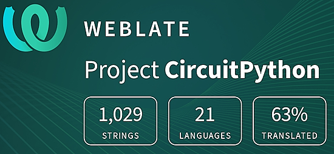](https://hosted.weblate.org/engage/circuitpython/)

One important feature of CircuitPython is translated control and error messages. With the help of fellow open source project [Weblate](https://weblate.org/), we're making it even easier to add or improve translations. 

Sign in with an existing account such as GitHub, Google or Facebook and start contributing through a simple web interface. No forks or pull requests needed! As always, if you run into trouble join us on [Discord](https://adafru.it/discord), we're here to help.

## NUMBER Thanks

The Adafruit Discord community, where we do all our CircuitPython development in the open, reached over NUMBER humans - thank you! Adafruit believes Discord offers a unique way for Python on hardware folks to connect. Join today at [https://adafru.it/discord](https://adafru.it/discord).

## ICYMI - In case you missed it

Python on hardware is the Adafruit Python video-newsletter-podcast! The news comes from the Python community, Discord, Adafruit communities and more and is broadcast on ASK an ENGINEER Wednesdays. The complete Python on Hardware weekly videocast [playlist is here](https://www.youtube.com/playlist?list=PLjF7R1fz_OOXRMjM7Sm0J2Xt6H81TdDev). The video podcast is on [iTunes](https://itunes.apple.com/us/podcast/python-on-hardware/id1451685192?mt=2), [YouTube](http://adafru.it/pohepisodes), [Instagram](https://www.instagram.com/adafruit/channel/)), and [XML](https://itunes.apple.com/us/podcast/python-on-hardware/id1451685192?mt=2).

[The weekly community chat on Adafruit Discord server CircuitPython channel - Audio / Podcast edition](https://itunes.apple.com/us/podcast/circuitpython-weekly-meeting/id1451685016) - Audio from the Discord chat space for CircuitPython, meetings are usually Mondays at 2pm ET, this is the audio version on [iTunes](https://itunes.apple.com/us/podcast/circuitpython-weekly-meeting/id1451685016), Pocket Casts, [Spotify](https://adafru.it/spotify), and [XML feed](https://adafruit-podcasts.s3.amazonaws.com/circuitpython_weekly_meeting/audio-podcast.xml).

## Contribute

The CircuitPython Weekly Newsletter is a CircuitPython community-run newsletter emailed every Monday. The complete [archives are here](https://www.adafruitdaily.com/category/circuitpython/). It highlights the latest CircuitPython related news from around the web including Python and MicroPython developments. To contribute, edit next week's draft [on GitHub](https://github.com/adafruit/circuitpython-weekly-newsletter/tree/gh-pages/_drafts) and [submit a pull request](https://help.github.com/articles/editing-files-in-your-repository/) with the changes. You may also tag your information on Twitter with #CircuitPython. 

Join the Adafruit [Discord](https://adafru.it/discord) or [post to the forum](https://forums.adafruit.com/viewforum.php?f=60) if you have questions.
