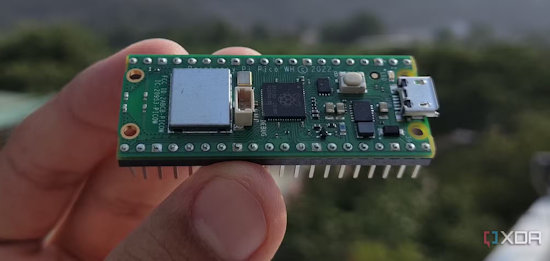
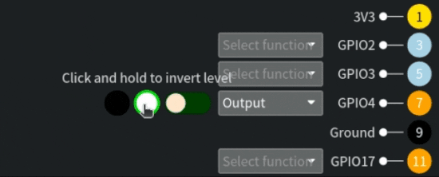
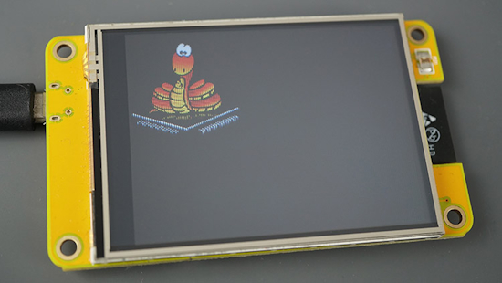
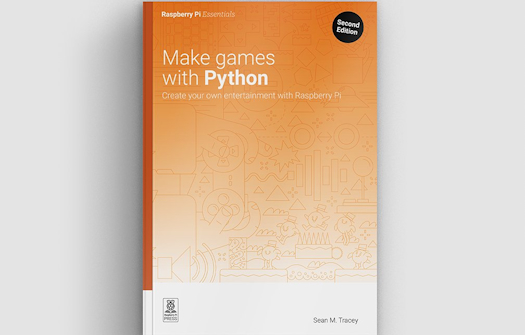
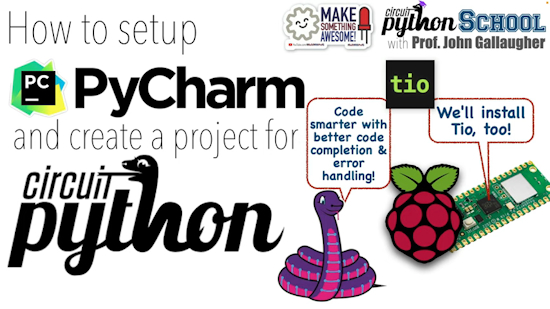
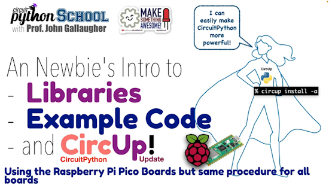
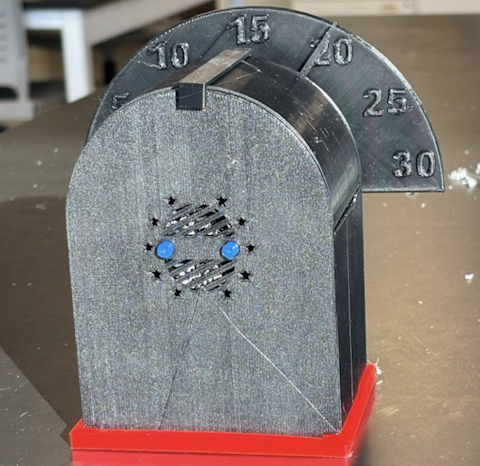
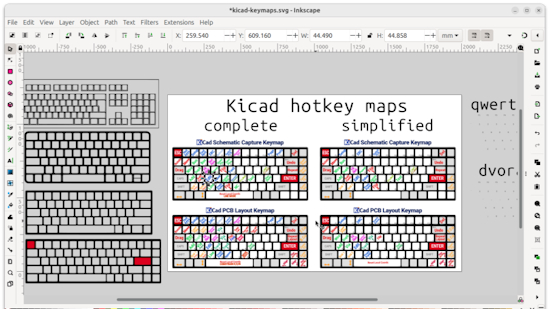
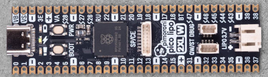

View this email in your browser. **Warning: Flashing Imagery**

Welcome to the latest Python on Microcontrollers newsletter! Coming off the shock that someone has invented a Chicago-style hot dog pizza (in a city with much better pizza), I've yet again collected a collection of Python information to tempt the senses. The first beta of CircuitPython 10 is locking in the features for this major update. I was looking to do some DVI video with an RP2350 but the information was fragmented. It's now centralized in my new Adafruit Learning System guide. When should you use a Raspberry Pi vs. a microcontroller? Learn that and much more in this Summer reading edition - *Anne Barela, Editor*

We're on [Discord](https://discord.gg/HYqvREz), [Twitter/X](https://twitter.com/search?q=circuitpython&src=typed_query&f=live), [BlueSky](https://bsky.app/profile/circuitpython.org) and for past newsletters - [view them all here](https://www.adafruitdaily.com/category/circuitpython/). If you're reading this on the web, please [subscribe here](https://www.adafruitdaily.com/). Here's the news this week:

## CircuitPython 10.0.0-beta.0 Released

CircuitPython 10.0.0-beta.0 is the first beta release for CircuitPython 10. It has known bugs that will be fixed before the final release. This release also marks the introduction of the new artwork for CircuitPython 10 - [Adafruit Blog](https://blog.adafruit.com/2025/07/15/circuitpython-10-0-0-beta-0-released/) and release notes - [GitHub](https://github.com/adafruit/circuitpython/releases/tag/10.0.0-beta.0).

**Highlights of this Release**
* Increase the firmware partition size for ESP32-S2 boards with 4MB flash, allowing more features to be included. This change was made for 4MB flash ESP32-S3 boards in previous releases. Starting with this release, you must now update the TinyUF2 bootloader on all 4MB flash ESP32-S2 and ESP32-S3 boards.
* Fix Espressif `pulseio.PulseIn` regression.

## CircuitPython Documentation

Have you ever wanted one document with all the latest CircuitPython information? While the latest documentation is on multiple web pages via [docs.circuitpython.org](https://docs.circuitpython.org/), you can download a single PDF with all the details including a table of contents and an index, searchable via your favorite PDF reader. Everyone has their own way of getting information, this is yet another way that might appeal to folks - [CircuitPython.Org](https://docs.circuitpython.org/_/downloads/en/latest/pdf/) (PDF).

## Using DVI Video in CircuitPython

With the release of the Raspberry Pi RP2350, the ability to use the microcontroller to display DVI video on HDMI monitors has grown. Your editor has written a guide to this video capability and how to use it in scenarios from emulated games tofill on graphics. If you are looking to use the HSTX bus on the RP2350 to output video, check out this guide on how the parts all work - [Adafruit Learning System](https://learn.adafruit.com/using-dvi-video-in-circuitpython/adafruit_color_terminal).

## Manipulating MicroPython ESP32 Firmware Images and Flash

mp-image-tool-esp32 manipulates MicroPython esp32 firmware files and flash storage on serial-attached ESP32 devices. It works with ESP32, ESP32-S2 and ESP32-S3 firmware images and devices. mp-image-tool-esp32 can operate on firmware files (including those downloaded from micropython.org) and flash storage in ESP32 devices attached via serial port - [GitHub](https://blog.adafruit.com/2025/07/16/manipulate-micropython-esp32-firmware-images-and-flash/).

## 5 Reasons To Use Microcontrollers Instead of a Raspberry Pi

Jeff Butts writes: "The Raspberry Pi is a fantastic tool, especially for general-purpose computing and media projects. But when I’m working on simple or embedded tasks, I often find myself reaching for a microcontroller instead. They’re not just cheaper; they’re more appropriate for many of the things I like to build. Whether I’m tinkering with sensors, automating something small, or creating wearables, microcontrollers (can) get the job done without the extra baggage" - [XDA](https://www.xda-developers.com/reasons-use-microcontrollers-instead-of-raspberry-pi/).

## pigg: A Raspberry Pi and Pi Pico GPIO Remote control from GUI and CLI

Have you ever visually wanted to see or manipulate the GPIO on your Raspberry Pi devices remotely? pigg is set of apps for Raspberry Pi GPIO output control and input visualization, with GUI and CLI Support for macOS, Linux (including Raspberry Pi) and Windows. It has a GPIO CLI agent for Raspberry Pi and embedded applications for Pi Pico (USB) and Pi Pico W (USB, TCP) - [GitHub](https://github.com/andrewdavidmackenzie/pigg?tab=readme-ov-file).

## I'm Switching to Python and Actually Liking It

César started to code more in Python 6 months ago. Why? Because of AI. "It’s clear (to me) that big money opportunities are all over AI these days. And guess what’s the de facto programming language for AI? Yep, that sneaky one" - [cesarsotovalero.net](https://www.cesarsotovalero.net/blog/i-am-switching-to-python-and-actually-liking-it.html). Via [news.ycombinator.com](https://news.ycombinator.com/item?id=44579717).

## This Week's Python Streams

Python on Hardware is all about building a cooperative ecosphere which allows contributions to be valued and to grow knowledge. Below are the streams within the last week focusing on the community.

**CircuitPython Deep Dive Stream**

[Last Friday](https://youtube.com/live/gm3ujqWdu7I), Tim streamed work on refactoring an [EDID example](https://learn.adafruit.com/using-dvi-video-in-circuitpython/monitor-display-capabilities) into a library.

You can see the latest video and past videos on the Adafruit YouTube channel under the Deep Dive playlist - [YouTube](https://www.youtube.com/playlist?list=PLjF7R1fz_OOXBHlu9msoXq2jQN4JpCk8A).

**CircuitPython Parsec**

John Park’s CircuitPython Parsec this week is on random(ish) numbers from floating pins - [Adafruit Blog](https://blog.adafruit.com/2025/07/18/john-parks-circuitpython-parsec-randomish-numbers-from-floating-pins/) and [YouTube](https://youtu.be/RyNvXmJ9ETw).

Catch all the episodes in the [YouTube playlist](https://www.youtube.com/playlist?list=PLjF7R1fz_OOWFqZfqW9jlvQSIUmwn9lWr).

**CircuitPython Weekly Meeting**

CircuitPython Weekly Meeting for July 14, 2025 ([notes](https://github.com/adafruit/adafruit-circuitpython-weekly-meeting/blob/main/2025/2025-07-14.md)) [on YouTube](https://www.youtube.com/watch?v=8gLIja4qRfA).

## Project of the Week: The Smart Magnifying Glass

Leviathan Engineering builds the ultimate Sherlock Holmes AI detective device using a Raspberry Pi and Raspberry Pi 4 camera module. It uses Python, OpenCV, and advanced image recognition algorithms - [Hackaday](https://www.hackster.io/news/the-case-of-the-smart-magnifying-glass-c57ff2457622?s=03), [YouTube](https://youtu.be/eRrlB3eovm4) and [GitHub](https://github.com/Leviathanengineer/Sherlock-Holmes-vision-).

## Popular Last Week

What was the most popular, most clicked link, in [last week's newsletter](https://www.adafruitdaily.com/2025/07/14/python-on-microcontrollers-newsletter-new-circuitpython-an-automated-lego-train-best-wearables-and-more-circuitpython-python-micropython-thepsf-raspberry_pi/)? [AI Cheat Sheet](https://www.linkedin.com/posts/mattvillage_most-people-dont-know-how-to-use-ai-the-activity-7345088663917125632-qUMc/).

Did you know you can read past issues of this newsletter in the Adafruit Daily Archive? [Check it out](https://www.adafruitdaily.com/category/circuitpython/).

## New Notes from Adafruit Playground

[Adafruit Playground](https://adafruit-playground.com/) is a new place for the community to post their projects and other making tips/tricks/techniques. Ad-free, it's an easy way to publish your work in a safe space for free.

Fruit Jam USB Host MIDI Tester - [Adafruit Playground](https://adafruit-playground.com/u/SamBlenny/pages/fruit-jam-usb-host-midi-tester).

## News From Around the Web

Mjölnir 2.0: IoT Smart Thor Hammer made with a Raspberry Pi Pico W, CircuitPython and 3D printing- [Instructables](https://www.instructables.com/Mj%C3%B6lnir-20-IoT-Smart-Thor-Hammer/), [YouTube](https://youtu.be/zJyJTZsgy5M), and [GitHub](https://github.com/alemanjavier/Mj-lnir).

A box that cannot be closed, made with a Raspberry Pi Pico, servo, sensor and MicroPython - [X](https://x.com/sozoraemon/status/1945829250139124059) (Japanese).

A tutorial on using MicroPython with the ESP32 Cheap Yellow Display (CYD) board - [Random Nerd Tutorials](https://randomnerdtutorials.com/micropython-cheap-yellow-display-board-cyd-esp32-2432s028r/).

Make games with Python, 2nd edition, is out now - [Raspberry Pi News](https://www.raspberrypi.com/news/make-games-with-python-2nd-edition-out-now/).

Build your own DIY Stream Deck with Raspberry Pi Pico W and CircuitPython - [CoderLegion](https://coderlegion.com/4008/build-your-own-diy-stream-deck-with-raspberry-pi-pico-w-and-circuitpython).

The Defcon 33 Indy badge: The NeoSword, programmable with MicroPython - [X](https://x.com/UntitledElec/status/1944866348406071786) and [Untitled Electronics](https://untitledelec.com/products/defcon-33-indy-badge-the-neosword).

A guide to programming the Thumby Color with MicroPython - [site](https://color.thumby.us/home/#thumby-color-dev-board-diagram).

A Xiao ESP32C6 device that, when inserted into a plant pot, sends data on moisture levels, temperature, and light intensity via WiFi, programmed with CircuitPython - [X](https://x.com/dannymodules/status/1945458077739692220) (Japanese).

How to overlay a heatmap on a real map with Python - [Towards Data Science](https://towardsdatascience.com/how-to-overlay-a-heatmap-on-a-real-map-with-python/).

Installing & Using PyCharm with CircuitPython (Pico School) - [YouTube](https://www.youtube.com/watch?v=5LoXTVGlNVU) and [Google Docs](https://docs.google.com/document/d/1H6jsuGSSCthuG0O26r7jxntXldwDP7crC8k2oPnaZ7I/edit?tab=t.0).

CircuitPython Libraries, Example Code, & Using CircUp (Pico School) - [YouTube](https://www.youtube.com/watch?v=OD6CqkVaihM).

5 projects you can complete in a weekend with the $8 Raspberry Pi Pico 2 W - [XDA](https://www.xda-developers.com/weekend-raspberry-pi-pico-2-w-projects/).

Getting the right time: another method, demonstrated with MicroPython - [lucstechblog](https://lucstechblog.blogspot.com/2025/07/getting-right-time-another-method.html).

A Circuit Playground Express 3D printed countdown timer - [Instructables](https://www.instructables.com/CPX-3D-Printed-Countdown-Timer/).

text - [site](url).

7 Raspberry Pi projects you can do in an hour - [How-To Geek](https://www.howtogeek.com/raspberry-pi-projects-that-you-can-do-in-1-hour/).

Making a simple HTTP server with Asyncio Protocols - [Jacob Padilla](https://jacobpadilla.com/articles/asyncio-protocols).

Improving KiCad productivity with these shortcuts - [Hackaday](https://hackaday.com/2025/07/17/improve-your-kicad-productivity-with-these-considered-shortcut-keys/).

## New

text - [site](url).

The Pimoroni Pico LiPo 2 XL W is an elongated Pirate-brand RP2350 microcontroller with 16MB of flash, 8MB of PSRAM, USB-C, Qw/ST, 2.4GHz wireless / Bluetooth and LiPo charging - [Pimoroni](https://shop.pimoroni.com/products/pimoroni-pico-lipo-2-xl-w?variant=55447911006587).

The NanoPi R76S is a new single-board computer that’s available in various configurations starting at $49. The Raspberry Pi competitor is by the Rockchip RK3576 SoC with four Cortex-A72 and four Cortex-A53 cores, a Mali-G52 MC3 GPU and an NPU with 6 TOPS - [NotebookCheck](https://www.notebookcheck.net/NanoPi-R76S-Raspberry-Pi-alternative-offers-up-to-16GB-RAM-quick-Ethernet-and-NPU.1055109.0.html).

## New Boards Supported by CircuitPython

The number of supported microcontrollers and Single Board Computers (SBC) grows every week. This section outlines which boards have been included in CircuitPython or added to [CircuitPython.org](https://circuitpython.org/).

No new boards were added this week.

*Note: For non-Adafruit boards, please use the support forums of the board manufacturer for assistance, as Adafruit does not have the hardware to assist in troubleshooting.*

Looking to add a new board to CircuitPython? It's highly encouraged! Adafruit has four guides to help you do so:

- [How to Add a New Board to CircuitPython](https://learn.adafruit.com/how-to-add-a-new-board-to-circuitpython/overview)
- [How to add a New Board to the circuitpython.org website](https://learn.adafruit.com/how-to-add-a-new-board-to-the-circuitpython-org-website)
- [Adding a Single Board Computer to PlatformDetect for Blinka](https://learn.adafruit.com/adding-a-single-board-computer-to-platformdetect-for-blinka)
- [Adding a Single Board Computer to Blinka](https://learn.adafruit.com/adding-a-single-board-computer-to-blinka)

## New Learn Guides

The Adafruit Learning System has over 3,200 free guides for learning skills and building projects including using Python.

[Knobby Sequencer](https://learn.adafruit.com/knobby-sequencer/overview) from [John Park](https://learn.adafruit.com/u/johnpark)

[Using DVI Video in CircuitPython](https://learn.adafruit.com/using-dvi-video-in-circuitpython) from [Anne Barela](https://learn.adafruit.com/u/AnneBarela)

## CircuitPython Libraries

The CircuitPython library numbers are continually increasing, while existing ones continue to be updated. Here we provide library numbers and updates!

To get the latest Adafruit libraries, download the [Adafruit CircuitPython Library Bundle](https://circuitpython.org/libraries). To get the latest community contributed libraries, download the [CircuitPython Community Bundle](https://circuitpython.org/libraries).

If you'd like to contribute to the CircuitPython project on the Python side of things, the libraries are a great place to start. Check out the [CircuitPython.org Contributing page](https://circuitpython.org/contributing). If you're interested in reviewing, check out Open Pull Requests. If you'd like to contribute code or documentation, check out Open Issues. We have a guide on [contributing to CircuitPython with Git and GitHub](https://learn.adafruit.com/contribute-to-circuitpython-with-git-and-github), and you can find us in the #help-with-circuitpython and #circuitpython-dev channels on the [Adafruit Discord](https://adafru.it/discord).

You can check out this [list of all the Adafruit CircuitPython libraries and drivers available](https://github.com/adafruit/Adafruit_CircuitPython_Bundle/blob/master/circuitpython_library_list.md). 

The current number of CircuitPython libraries is **532**!

**Updated Libraries**

Here are this week's updated CircuitPython libraries:

  * [adafruit/Adafruit_CircuitPython_HT16K33](https://github.com/adafruit/Adafruit_CircuitPython_HT16K33)
  * [adafruit/Adafruit_CircuitPython_FruitJam](https://github.com/adafruit/Adafruit_CircuitPython_FruitJam)

## What’s the CircuitPython team up to this week?

What is the team up to this week? Let’s check in:

**Dan**

I released CircuitPython 10.0.0-beta.0 last week. Now all 4MB Espressif boards have larger firmware partitions, allowing more features to be turned on.

I'm now working on the remaining issues for the 10.0.0 release. I've fixed some bugs, and also have switched the Espressif builds to use the Mozilla root certificate list, which means we have much more complete coverage of root certificates for websites you might want to connect to.

**Tim**

This week I finished the guide for the Triple RGB Matrix Bonnet. I've also worked a little on finding a solution to a docs build issue that resulted from a proposed change that adds the `micropython` module to CircuitPython stubs. I'm working on the HSTX DVI CowBell guide next.

**Scott**

I'm started working part-time after taking eight weeks fully off to care for my youngest. I'm still watching them during the day so I'm working when they're napping. So, folks can mention me or assign me as a reviewer and I'll get back to me when I can. No deep diving for me yet though. I'm jumping into fixing issues for 10.0 and adding support for newer epaper displays.

**Liz**

This past week I worked on a Python script for a [Raspberry Pi thermal camera](https://learn.adafruit.com/raspberry-pi-thermal-camera). The project uses a Raspberry Pi camera along with an MLX90640 thermal camera module. The script shows a preview stream from the Pi camera and then overlays the thermal camera image on top. You can use keyboard commands to adjust the thermal range and the overlay opacity.

## Upcoming Events

The next MicroPython Meetup in Melbourne will be on July 23rd – [Meetup](https://www.meetup.com/micropython-meetup/events). You can see recordings of previous meetings on [YouTube](https://www.youtube.com/@MicroPythonOfficial). 

PyOhio 2025 will be held Saturday & Sunday July 26 & 27, 2025 at the Cleveland State University Student Center in Cleveland, Ohio - [PyOhio 2025](https://www.pyohio.org/2025/).

HOPE_16 is a welcoming place for hackers of all types: makers, artists, educators, experimenters, tinkerers, and more! If you’re interested in playing with technology, coming up with new ideas, learning from others, and sharing your knowledge, then this is the place for you. August 15-17, 2025 at St. John’s University Queens, New York City US - [HOPE](https://hope.net/).

KiCad conferences (KiCon) to be held this year include 19 - 20 Sept 2024 in Bochum, Germany, and to be determined in Asia - [KiCad](https://kicon.kicad.org/).

PyCon UK will be at CONTACT in Manchester from Friday 19th September to Monday 22nd September 2025 - [PyCon UK 2025](https://2025.pyconuk.org/).

Maker Faire Bay Area 2025 will be Sep 26 – 28, 2025 in Vallejo, California, US - [Maker Faire](https://bayarea.makerfaire.com/).

PyLadiesCon returns December 5–7, 2025. 100% online conference designed for our global community. Talks, workshops, panels, and community fun - [PyLadies](https://conference.pyladies.com/2025-pyladiescon-is-back/).

**Send Your Events In**

If you know of virtual events or upcoming events, please let us know via email to cpnews(at)adafruit(dot)com.

## Latest Releases

CircuitPython's stable release is [9.2.8](https://github.com/adafruit/circuitpython/releases/latest) and its unstable release is [10.0.0-beta.0](https://github.com/adafruit/circuitpython/releases). New to CircuitPython? Start with our [Welcome to CircuitPython Guide](https://learn.adafruit.com/welcome-to-circuitpython).

[20250718](https://github.com/adafruit/Adafruit_CircuitPython_Bundle/releases/latest) is the latest Adafruit CircuitPython library bundle.

[20250705](https://github.com/adafruit/CircuitPython_Community_Bundle/releases/latest) is the latest CircuitPython Community library bundle.

[v1.25.0](https://micropython.org/download) is the latest MicroPython release. Documentation for it is [here](http://docs.micropython.org/en/latest/pyboard/).

[3.13.5](https://www.python.org/downloads/) is the latest Python release. The latest pre-release version is [3.14.0b4](https://www.python.org/download/pre-releases/).

[4,304 Stars](https://github.com/adafruit/circuitpython/stargazers) Like CircuitPython? [Star it on GitHub!](https://github.com/adafruit/circuitpython)

## Call for Help -- Translating CircuitPython is now easier than ever

One important feature of CircuitPython is translated control and error messages. With the help of fellow open source project [Weblate](https://weblate.org/), we're making it even easier to add or improve translations. 

Sign in with an existing account such as GitHub, Google or Facebook and start contributing through a simple web interface. No forks or pull requests needed! As always, if you run into trouble join us on [Discord](https://adafru.it/discord), we're here to help.

## 39,057 Thanks

The Adafruit Discord community, where we do all our CircuitPython development in the open, reached over 39,057 humans - thank you! Adafruit believes Discord offers a unique way for Python on hardware folks to connect. Join today at [https://adafru.it/discord](https://adafru.it/discord).

## ICYMI - In case you missed it

Python on hardware is the Adafruit Python video-newsletter-podcast! The news comes from the Python community, Discord, Adafruit communities and more and is broadcast on ASK an ENGINEER Wednesdays. The complete Python on Hardware weekly videocast [playlist is here](https://www.youtube.com/playlist?list=PLjF7R1fz_OOXRMjM7Sm0J2Xt6H81TdDev). The video podcast is on [iTunes](https://itunes.apple.com/us/podcast/python-on-hardware/id1451685192?mt=2), [YouTube](http://adafru.it/pohepisodes), [Instagram](https://www.instagram.com/adafruit/channel/)), and [XML](https://itunes.apple.com/us/podcast/python-on-hardware/id1451685192?mt=2).

[The weekly community chat on Adafruit Discord server CircuitPython channel - Audio / Podcast edition](https://itunes.apple.com/us/podcast/circuitpython-weekly-meeting/id1451685016) - Audio from the Discord chat space for CircuitPython, meetings are usually Mondays at 2pm ET, this is the audio version on [iTunes](https://itunes.apple.com/us/podcast/circuitpython-weekly-meeting/id1451685016), Pocket Casts, [Spotify](https://adafru.it/spotify), and [XML feed](https://adafruit-podcasts.s3.amazonaws.com/circuitpython_weekly_meeting/audio-podcast.xml).

## Contribute

The CircuitPython Weekly Newsletter is a CircuitPython community-run newsletter emailed every Monday. The complete [archives are here](https://www.adafruitdaily.com/category/circuitpython/). It highlights the latest CircuitPython related news from around the web including Python and MicroPython developments. To contribute, edit next week's draft [on GitHub](https://github.com/adafruit/circuitpython-weekly-newsletter/tree/gh-pages/_drafts) and [submit a pull request](https://help.github.com/articles/editing-files-in-your-repository/) with the changes. You may also tag your information on Twitter with #CircuitPython. 

Join the Adafruit [Discord](https://adafru.it/discord) or [post to the forum](https://forums.adafruit.com/viewforum.php?f=60) if you have questions.
