- [ ] Library and info updates
- [ ] change date
- [ ] update title
- [ ] Feature story
- [ ] Update  for images
- [ ] Update ICYDNCI
- [ ] All images 550w max only
- [ ] Link "View this email in your browser."

News Sources

- [Adafruit Playground](https://adafruit-playground.com/)
- Twitter: [CircuitPython](https://twitter.com/search?q=circuitpython&src=typed_query&f=live), [MicroPython](https://twitter.com/search?q=micropython&src=typed_query&f=live) and [Python](https://twitter.com/search?q=python&src=typed_query)
- [Raspberry Pi News](https://www.raspberrypi.com/news/)
- Mastodon [CircuitPython](https://mastodon.social/tags/CircuitPython) and [MicroPython](https://mastodon.social/tags/MicroPython)
- [hackster.io CircuitPython](https://www.hackster.io/search?q=circuitpython&i=projects&sort_by=most_recent) and [MicroPython](https://www.hackster.io/search?q=micropython&i=projects&sort_by=most_recent)
- YouTube: [CircuitPython](https://www.youtube.com/results?search_query=circuitpython&sp=CAI%253D), [MicroPython](https://www.youtube.com/results?search_query=micropython&sp=CAI%253D), [Prof Gallaugher](https://www.youtube.com/@BuildWithProfG/videos), [Teacher Brogan M. Pratt CircuitPython](https://www.youtube.com/playlist?list=PLRHdgFNRLyaN6eCw8b0yoHKDY9B4GiirU), [Teacher Brogan M. Pratt CircuitPython search](https://www.youtube.com/@BroganMPratt/search?query=circuitpython)
- Instructables: [CircuitPython](https://www.instructables.com/search/?q=circuitpython&projects=all&sort=Newest), [MicroPython](https://www.instructables.com/search/?q=micropython&projects=all&sort=Newest), [Raspberry Pi Python](https://www.instructables.com/search/?q=raspberry+pi+python&projects=all&sort=Newest)
- [maker.io Python](https://www.digikey.com/en/maker/search-results?t=python)
- [hackaday CircuitPython](https://hackaday.com/blog/?s=circuitpython) and [MicroPython](https://hackaday.com/blog/?s=micropython)
- [python.org](https://www.python.org/)
- [Python Insider - dev team blog](https://pythoninsider.blogspot.com/)
- Individuals: [Jeff Geerling](https://www.jeffgeerling.com/blog), [Yakroo](https://x.com/Yakroo5077)
- Tom's Hardware: [CircuitPython](https://www.tomshardware.com/search?searchTerm=circuitpython&articleType=all&sortBy=publishedDate) and [MicroPython](https://www.tomshardware.com/search?searchTerm=micropython&articleType=all&sortBy=publishedDate) and [Raspberry Pi](https://www.tomshardware.com/search?searchTerm=raspberry%20pi&articleType=all&sortBy=publishedDate)
- [hackaday.io newest projects MicroPython](https://hackaday.io/projects?tag=micropython&sort=date) and [CircuitPython](https://hackaday.io/projects?tag=circuitpython&sort=date)
- [Google News Python](https://news.google.com/topics/CAAqIQgKIhtDQkFTRGdvSUwyMHZNRFY2TVY4U0FtVnVLQUFQAQ?hl=en-US&gl=US&ceid=US%3Aen)
- hackaday.io - [CircuitPython](https://hackaday.io/search?term=circuitpython) and [MicroPython](https://hackaday.io/search?term=micropython)

View this email in your browser. **Warning: Flashing Imagery**

Welcome to the latest Python on Microcontrollers newsletter! *insert 2-3 sentences from editor (what's in overview, banter)* - *Anne Barela, Editor*

We're on [Discord](https://discord.gg/HYqvREz), [Twitter/X](https://twitter.com/search?q=circuitpython&src=typed_query&f=live), [BlueSky](https://bsky.app/profile/circuitpython.org) and for past newsletters - [view them all here](https://www.adafruitdaily.com/category/circuitpython/). If you're reading this on the web, please [subscribe here](https://www.adafruitdaily.com/). Here's the news this week:

## CircuitPython Day 2025 - August 15th

text - [Adafruit Blog](url).

## Feature

text - [site](url).

## Next-gen WiFi 8 is Coming

The next-generation WiFi 8 (IEEE 802.11bn) specification is not meant to improve performance, but rather to [boost reliability of wireless connections](https://www.tomshardware.com/networking/wi-fi-8-will-not-improve-transfer-speeds-the-new-standard-will-however-enhance-reliability-and-user-experience) as they become even more ubiquitous. Since improving reliability is a pretty vague description, the IEEE has issued a scope document that quantitatively defines the enhancements. According to a new post by [Qualcomm](https://www.qualcomm.com/news/onq/2025/07/wi-fi-8-advancing-wireless-through-ultra-high-reliability) (which is a contributor to the standard), the IEEE wants Wi-Fi 8 devices to offer a 25% improvement across a number of metrics, under the umbrella of Ultra High Reliability, or UHR - [Tom's Hardware](https://www.tomshardware.com/networking/next-gen-wi-fi-8-focuses-on-reliability-instead-of-speed-ultra-high-reliability-initiative-boosts-performance-lowers-latency-and-packet-loss-in-challenging-conditions).

## Zephyr 4.2 Released

[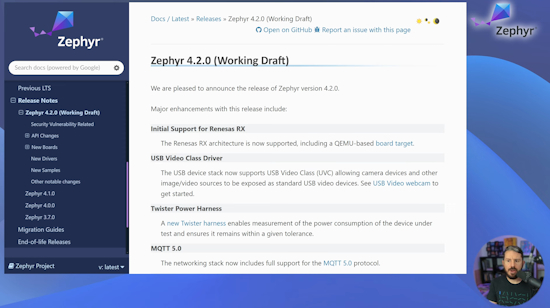](https://www.zephyrproject.org/zephyr-rtos-4-2-now-available-introduces-renesas-rx-support-usb-video-class-and-more/)

Zephyr RTOS 4.2 is now available. It introduces Renesas RX Support, MQTT 5.0, USB Video Class, an improved Devicetree developer experience, and more with 96 board additions and 810 contributions in total - [Zephyr Blog](https://www.zephyrproject.org/zephyr-rtos-4-2-now-available-introduces-renesas-rx-support-usb-video-class-and-more/) and [YouTube](https://www.youtube.com/watch?v=25xrHzeaw5w). Via [LinkedIn](https://www.linkedin.com/posts/gsteiert_zephyr-42-overview-walkthrough-activity-7353086356220243974-kXJP/).

## Overclocking the Raspberry Pi Pico 2

[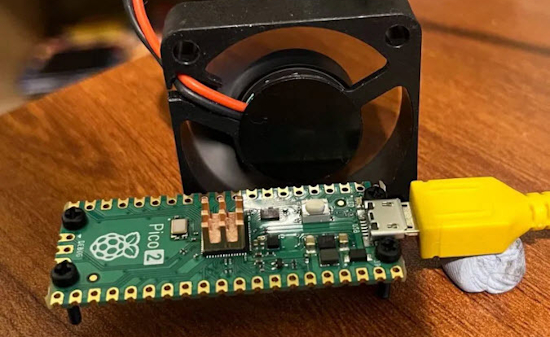](https://www.digikey.com/en/maker/projects/overclocking-raspberry-pi-pico-2/d0e83fd7200f4d269464695370a60924)

Pimoroni looks at overclocking the Raspberry Pi Pico 2 using a MicroPython script to see how fast it'll go and still be stable - [DigiKey](https://www.digikey.com/en/maker/projects/overclocking-raspberry-pi-pico-2/d0e83fd7200f4d269464695370a60924).

## The CircuitPython Online IDE 2.1 Released

[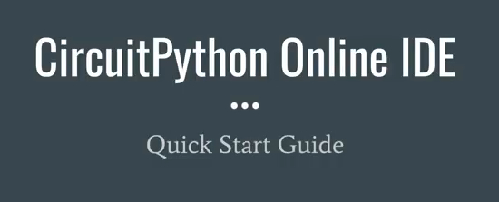](https://x.com/River___Wang/status/1946772071888908372?s=03)

River Wang has released the independently developed CircuitPython Online IDE (integrated development environment) version 2.1, which runs in a modern web browser - [circuitpy.dev](https://urfdvw.github.io/circuitpython-online-ide-2/). Via [X](https://x.com/River___Wang/status/1946772071888908372?s=03).

**Highlights of this release**

* Serial Console rewritten with Xterm
* Progressive Web App
* Performance improvement and bug fixes

## This Week's Python Streams

Python on Hardware is all about building a cooperative ecosphere which allows contributions to be valued and to grow knowledge. Below are the streams within the last week focusing on the community.

**CircuitPython Deep Dive Stream**

[Last Friday](link), Tim streamed work on {subject}.

You can see the latest video and past videos on the Adafruit YouTube channel under the Deep Dive playlist - [YouTube](https://www.youtube.com/playlist?list=PLjF7R1fz_OOXBHlu9msoXq2jQN4JpCk8A).

**CircuitPython Parsec**

John Park’s CircuitPython Parsec this week is on {subject} - [Adafruit Blog](link) and [YouTube](link).

Catch all the episodes in the [YouTube playlist](https://www.youtube.com/playlist?list=PLjF7R1fz_OOWFqZfqW9jlvQSIUmwn9lWr).

**CircuitPython Weekly Meeting**

CircuitPython Weekly Meeting for {date} ([notes](file)) [on YouTube](link).

## Project of the Week: An LED Hexagon Family Tracker

[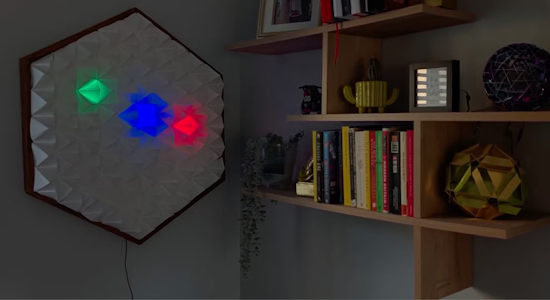](https://www.xda-developers.com/forget-airtags-build-family-location-tracker-raspberry-pi-pico/)

This Raspberry Pi project is an experiment in creating a dynamic family location tracker using MQTT, Node-RED, Folium, and Adafruit's NeoPixel library - [XDA](https://www.xda-developers.com/forget-airtags-build-family-location-tracker-raspberry-pi-pico/), [Medium](https://blog.devgenius.io/my-son-is-now-a-proper-generation-alpha-latchkey-kid-c392cef05b84) [YouTube](https://youtu.be/dpJ-_VhkowA?feature=shared) and [GitHub](https://github.com/reveleigh/LED-hexagon-family-tracker).

## Popular Last Week

What was the most popular, most clicked link, in [last week's newsletter](https://www.adafruitdaily.com/2025/07/21/python-on-microcontrollers-newsletter-circuitpython-10-beta-microcontroller-or-sbc-dvi-video-and-more-circuitpython-python-micropython-thepsf-raspberry_pi/)? [AI Cheat Sheet](https://www.linkedin.com/posts/mattvillage_most-people-dont-know-how-to-use-ai-the-activity-7345088663917125632-qUMc/).

Did you know you can read past issues of this newsletter in the Adafruit Daily Archive? [Check it out](https://www.adafruitdaily.com/category/circuitpython/).

## New Notes from Adafruit Playground

[Adafruit Playground](https://adafruit-playground.com/) is a new place for the community to post their projects and other making tips/tricks/techniques. Ad-free, it's an easy way to publish your work in a safe space for free.

text - [Adafruit Playground](url).

text - [Adafruit Playground](url).

text - [Adafruit Playground](url).

## News From Around the Web

[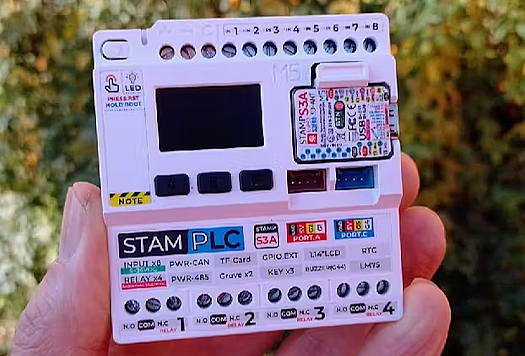](https://www.hackster.io/etolocka/discovering-the-stamplc-features-and-functions-37baf2)

StamPLC by M5Stack is a compact programmable logic controller (PLC) with WiFi, relays, and opto-isolated inputs for industrial-grade projects, programmable in Arduino, UIFlow Ver. 2, MicroPython, ESP-IDF, or PlatformIO - [hackster.io](https://www.hackster.io/etolocka/discovering-the-stamplc-features-and-functions-37baf2).

[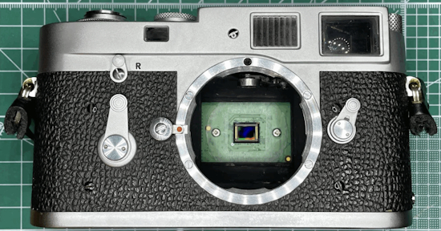](https://www.raspberrypi.com/news/the-many-and-varied-uses-of-photography-on-raspberry-pi/)

The many and varied uses of photography on Raspberry Pi - [Raspberry Pi News](https://www.raspberrypi.com/news/the-many-and-varied-uses-of-photography-on-raspberry-pi/).

SparkFun MicroPython for Beginners: Flash Firmware, Upload Code & Run - [YouTube](https://www.youtube.com/watch?v=VnSsQwogz-U) and [Tutorial](https://learn.sparkfun.com/tutorials/setup-and-using-micropython-for-beginners).

[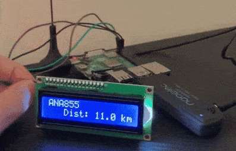](https://sozorablog.com/flightradar/)

A mini airplane radar with Raspberry Pi, Python and an ADS-B receiver - [sozorablog](https://sozorablog.com/flightradar/) (Japanese). Via [X](). 

text - [site](url).

text - [site](url).

This Raspberry Pi Zero 2 W project startles everyone who visits with an PIR sensor and audio, programmed in Python - [XDA](https://www.xda-developers.com/raspberry-pi-zero-2-w-project-startles-everyone/).

[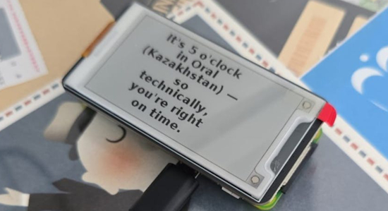](https://www.hackster.io/jampez77/alcoclock-it-s-5-o-clock-somewhere-880719)

Alcoclock is a Raspberry Pi Zero & Python project that checks where in the world it's 5PM - [hackster.io](https://www.hackster.io/jampez77/alcoclock-it-s-5-o-clock-somewhere-880719). Via [PCguide](https://www.pcguide.com/news/this-raspberry-pi-project-lets-you-know-where-exactly-its-5-oclock/).

text - [site](url).

text - [site](url).

text - [site](url).

text - [site](url).

text - [site](url).

text - [site](url).

text - [site](url).

text - [site](url).

text - [site](url).

[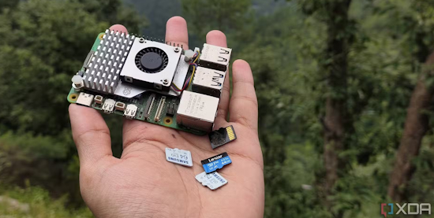](https://www.xda-developers.com/booting-your-raspberry-pi-off-an-sd-card-isnt-ideal/)

Booting your Raspberry Pi off an SD card isn't ideal - here's what I do instead - [XDA](https://www.xda-developers.com/booting-your-raspberry-pi-off-an-sd-card-isnt-ideal/).

## New

[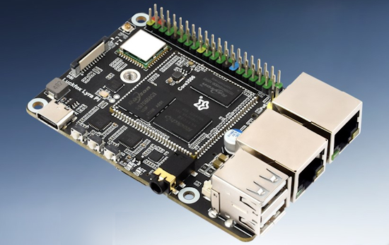](https://www.notebookcheck.net/Lyra-Pi-New-micro-development-board-with-LTE-modem-is-cheaper-than-the-Raspberry-Pi.1061628.0.html)

The Luckfox Lyra Pi is a new single-board computer (SBC) which comes with cellular connectivity, making it suitable for projects far from a WiFi network - [NotebookCheck](https://www.notebookcheck.net/Lyra-Pi-New-micro-development-board-with-LTE-modem-is-cheaper-than-the-Raspberry-Pi.1061628.0.html).

text - [site](url).

## New Boards Supported by CircuitPython

The number of supported microcontrollers and Single Board Computers (SBC) grows every week. This section outlines which boards have been included in CircuitPython or added to [CircuitPython.org](https://circuitpython.org/).

This week there were (#/no) new boards added:

- [Board name](url)
- [Board name](url)
- [Board name](url)

*Note: For non-Adafruit boards, please use the support forums of the board manufacturer for assistance, as Adafruit does not have the hardware to assist in troubleshooting.*

Looking to add a new board to CircuitPython? It's highly encouraged! Adafruit has four guides to help you do so:

- [How to Add a New Board to CircuitPython](https://learn.adafruit.com/how-to-add-a-new-board-to-circuitpython/overview)
- [How to add a New Board to the circuitpython.org website](https://learn.adafruit.com/how-to-add-a-new-board-to-the-circuitpython-org-website)
- [Adding a Single Board Computer to PlatformDetect for Blinka](https://learn.adafruit.com/adding-a-single-board-computer-to-platformdetect-for-blinka)
- [Adding a Single Board Computer to Blinka](https://learn.adafruit.com/adding-a-single-board-computer-to-blinka)

## New Learn Guides

The Adafruit Learning System has over 3,200 free guides for learning skills and building projects including using Python.

[title](url) from [name](url)

[title](url) from [name](url)

[title](url) from [name](url)

## Updated Learn Guides

[title](url)

## CircuitPython Libraries

The CircuitPython library numbers are continually increasing, while existing ones continue to be updated. Here we provide library numbers and updates!

To get the latest Adafruit libraries, download the [Adafruit CircuitPython Library Bundle](https://circuitpython.org/libraries). To get the latest community contributed libraries, download the [CircuitPython Community Bundle](https://circuitpython.org/libraries).

If you'd like to contribute to the CircuitPython project on the Python side of things, the libraries are a great place to start. Check out the [CircuitPython.org Contributing page](https://circuitpython.org/contributing). If you're interested in reviewing, check out Open Pull Requests. If you'd like to contribute code or documentation, check out Open Issues. We have a guide on [contributing to CircuitPython with Git and GitHub](https://learn.adafruit.com/contribute-to-circuitpython-with-git-and-github), and you can find us in the #help-with-circuitpython and #circuitpython-dev channels on the [Adafruit Discord](https://adafru.it/discord).

You can check out this [list of all the Adafruit CircuitPython libraries and drivers available](https://github.com/adafruit/Adafruit_CircuitPython_Bundle/blob/master/circuitpython_library_list.md). 

The current number of CircuitPython libraries is **###**!

**New Libraries**

Here are this week's new CircuitPython libraries:

* [library](url)

**Updated Libraries**

Here are this week's updated CircuitPython libraries:

* [library](url)

## What’s the CircuitPython team up to this week?

What is the team up to this week? Let’s check in:

**Dan**

I added the full Mozilla SSL root certificate list to all builds now, so Pico W and similar boards should be able to connect to any host. I am continuing to work on the CircuitPython 10.0.0 issue list.

**Tim**

This week I finished the guide for the HSTX DVI CowBell. After that I started getting back into Fruit Jam mode, I've been working on adding support for portalbase library features to the adafruit_fruitjam library. So far I've got it working and have successfully run two older pyportal projects with a few tweaks. I still need to add a handful of the helper functions that are used by some of the more advanced projects and keep testing different ones to find things that aren't working.

**Scott**

This week I've been in epaper land. I've gotten the new screen for the MagTag working in CircuitPython's build. It will autodetect which screen is connected. Next, I'm going to add support for the new quad color epaper that is in the shop.

**Liz**

In the past week, there were quite a few new product guides. The first was the [Simple Soil Moisture Sensor](https://learn.adafruit.com/adafruit-simple-soil-moisture-sensor). This is a resistive moisture sensor that generates an analog signal. I have examples for CircuitPython, Arduino, MicroPython and MakeCode. There was also the [LM73100 Ideal Diode Breakout](https://learn.adafruit.com/adafruit-lm73100-ideal-diode-breakout), which can be used in your project for stable power and power monitoring. And finally, the [Pi Stemma QT Breakout](https://learn.adafruit.com/adafruit-pi-stemma-qt-breakout). This smol board fits onto the first 6 GPIO on your Raspberry Pi to give you a STEMMA QT port.

## Upcoming Events

The next MicroPython Meetup in Melbourne will be on July 23rd – [Meetup](https://www.meetup.com/micropython-meetup/events). You can see recordings of previous meetings on [YouTube](https://www.youtube.com/@MicroPythonOfficial). 

PyOhio 2025 will be held Saturday & Sunday July 26 & 27, 2025 at the Cleveland State University Student Center in Cleveland, Ohio - [PyOhio 2025](https://www.pyohio.org/2025/).

KiCad conferences (KiCon) to be held this year include 19 - 20 Sept 2024 in Bochum, Germany, and to be determined in Asia - [KiCad](https://kicon.kicad.org/).

PyCon UK will be at CONTACT in Manchester from Friday 19th September to Monday 22nd September 2025 - [PyCon UK 2025](https://2025.pyconuk.org/).

Maker Faire Bay Area 2025 will be Sep 26 – 28, 2025 in Vallejo, California, US - [Maker Faire](https://bayarea.makerfaire.com/).

**Send Your Events In**

If you know of virtual events or upcoming events, please let us know via email to cpnews(at)adafruit(dot)com.

## Latest Releases

CircuitPython's stable release is [#.#.#](https://github.com/adafruit/circuitpython/releases/latest) and its unstable release is [#.#.#-##.#](https://github.com/adafruit/circuitpython/releases). New to CircuitPython? Start with our [Welcome to CircuitPython Guide](https://learn.adafruit.com/welcome-to-circuitpython).

[2025####](https://github.com/adafruit/Adafruit_CircuitPython_Bundle/releases/latest) is the latest Adafruit CircuitPython library bundle.

[2025####](https://github.com/adafruit/CircuitPython_Community_Bundle/releases/latest) is the latest CircuitPython Community library bundle.

[v#.#.#](https://micropython.org/download) is the latest MicroPython release. Documentation for it is [here](http://docs.micropython.org/en/latest/pyboard/).

[#.#.#](https://www.python.org/downloads/) is the latest Python release. The latest pre-release version is [#.#.#](https://www.python.org/download/pre-releases/).

[#,### Stars](https://github.com/adafruit/circuitpython/stargazers) Like CircuitPython? [Star it on GitHub!](https://github.com/adafruit/circuitpython)

## Call for Help -- Translating CircuitPython is now easier than ever

[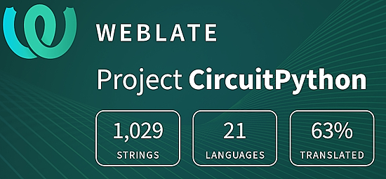](https://hosted.weblate.org/engage/circuitpython/)

One important feature of CircuitPython is translated control and error messages. With the help of fellow open source project [Weblate](https://weblate.org/), we're making it even easier to add or improve translations. 

Sign in with an existing account such as GitHub, Google or Facebook and start contributing through a simple web interface. No forks or pull requests needed! As always, if you run into trouble join us on [Discord](https://adafru.it/discord), we're here to help.

## NUMBER Thanks

The Adafruit Discord community, where we do all our CircuitPython development in the open, reached over NUMBER humans - thank you! Adafruit believes Discord offers a unique way for Python on hardware folks to connect. Join today at [https://adafru.it/discord](https://adafru.it/discord).

## ICYMI - In case you missed it

Python on hardware is the Adafruit Python video-newsletter-podcast! The news comes from the Python community, Discord, Adafruit communities and more and is broadcast on ASK an ENGINEER Wednesdays. The complete Python on Hardware weekly videocast [playlist is here](https://www.youtube.com/playlist?list=PLjF7R1fz_OOXRMjM7Sm0J2Xt6H81TdDev). The video podcast is on [iTunes](https://itunes.apple.com/us/podcast/python-on-hardware/id1451685192?mt=2), [YouTube](http://adafru.it/pohepisodes), [Instagram](https://www.instagram.com/adafruit/channel/)), and [XML](https://itunes.apple.com/us/podcast/python-on-hardware/id1451685192?mt=2).

[The weekly community chat on Adafruit Discord server CircuitPython channel - Audio / Podcast edition](https://itunes.apple.com/us/podcast/circuitpython-weekly-meeting/id1451685016) - Audio from the Discord chat space for CircuitPython, meetings are usually Mondays at 2pm ET, this is the audio version on [iTunes](https://itunes.apple.com/us/podcast/circuitpython-weekly-meeting/id1451685016), Pocket Casts, [Spotify](https://adafru.it/spotify), and [XML feed](https://adafruit-podcasts.s3.amazonaws.com/circuitpython_weekly_meeting/audio-podcast.xml).

## Contribute

The CircuitPython Weekly Newsletter is a CircuitPython community-run newsletter emailed every Monday. The complete [archives are here](https://www.adafruitdaily.com/category/circuitpython/). It highlights the latest CircuitPython related news from around the web including Python and MicroPython developments. To contribute, edit next week's draft [on GitHub](https://github.com/adafruit/circuitpython-weekly-newsletter/tree/gh-pages/_drafts) and [submit a pull request](https://help.github.com/articles/editing-files-in-your-repository/) with the changes. You may also tag your information on Twitter with #CircuitPython. 

Join the Adafruit [Discord](https://adafru.it/discord) or [post to the forum](https://forums.adafruit.com/viewforum.php?f=60) if you have questions.
