- [ ] Library and info updates
- [ ] change date
- [ ] update title
- [ ] Feature story
- [ ] Update  for images
- [ ] Update ICYDNCI
- [ ] All images 550w max only
- [ ] Link "View this email in your browser."

News Sources

- [Adafruit Playground](https://adafruit-playground.com/)
- Twitter: [CircuitPython](https://twitter.com/search?q=circuitpython&src=typed_query&f=live), [MicroPython](https://twitter.com/search?q=micropython&src=typed_query&f=live) and [Python](https://twitter.com/search?q=python&src=typed_query)
- [Raspberry Pi News](https://www.raspberrypi.com/news/)
- Mastodon [CircuitPython](https://mastodon.social/tags/CircuitPython) and [MicroPython](https://mastodon.social/tags/MicroPython)
- [hackster.io CircuitPython](https://www.hackster.io/search?q=circuitpython&i=projects&sort_by=most_recent) and [MicroPython](https://www.hackster.io/search?q=micropython&i=projects&sort_by=most_recent)
- YouTube: [CircuitPython](https://www.youtube.com/results?search_query=circuitpython&sp=CAI%253D), [MicroPython](https://www.youtube.com/results?search_query=micropython&sp=CAI%253D), [Prof Gallaugher](https://www.youtube.com/@BuildWithProfG/videos), [Teacher Brogan M. Pratt CircuitPython](https://www.youtube.com/playlist?list=PLRHdgFNRLyaN6eCw8b0yoHKDY9B4GiirU), [Teacher Brogan M. Pratt CircuitPython search](https://www.youtube.com/@BroganMPratt/search?query=circuitpython)
- [maker.io Python](https://www.digikey.com/en/maker/search-results?t=python)
- Instructables: [CircuitPython](https://www.instructables.com/search/?q=circuitpython&projects=all&sort=Newest), [MicroPython](https://www.instructables.com/search/?q=micropython&projects=all&sort=Newest), [Raspberry Pi Python](https://www.instructables.com/search/?q=raspberry+pi+python&projects=all&sort=Newest)
- [hackaday CircuitPython](https://hackaday.com/blog/?s=circuitpython) and [MicroPython](https://hackaday.com/blog/?s=micropython)
- [python.org](https://www.python.org/)
- [Python Insider - dev team blog](https://pythoninsider.blogspot.com/)
- Individuals: [Jeff Geerling](https://www.jeffgeerling.com/blog), [Yakroo](https://x.com/Yakroo5077)
- Tom's Hardware: [CircuitPython](https://www.tomshardware.com/search?searchTerm=circuitpython&articleType=all&sortBy=publishedDate) and [MicroPython](https://www.tomshardware.com/search?searchTerm=micropython&articleType=all&sortBy=publishedDate) and [Raspberry Pi](https://www.tomshardware.com/search?searchTerm=raspberry%20pi&articleType=all&sortBy=publishedDate)
- [hackaday.io newest projects MicroPython](https://hackaday.io/projects?tag=micropython&sort=date) and [CircuitPython](https://hackaday.io/projects?tag=circuitpython&sort=date)
- [Google News Python](https://news.google.com/topics/CAAqIQgKIhtDQkFTRGdvSUwyMHZNRFY2TVY4U0FtVnVLQUFQAQ?hl=en-US&gl=US&ceid=US%3Aen)
- hackaday.io - [CircuitPython](https://hackaday.io/search?term=circuitpython) and [MicroPython](https://hackaday.io/search?term=micropython)

View this email in your browser. **Warning: Flashing Imagery**

Welcome to the latest Python on Microcontrollers newsletter! *insert 2-3 sentences from editor (what's in overview, banter)* - *Anne Barela, Editor*

We're on [Discord](https://discord.gg/HYqvREz), [Twitter/X](https://twitter.com/search?q=circuitpython&src=typed_query&f=live), [BlueSky](https://bsky.app/profile/circuitpython.org) and for past newsletters - [view them all here](https://www.adafruitdaily.com/category/circuitpython/). If you're reading this on the web, please [subscribe here](https://www.adafruitdaily.com/). Here's the news this week:

## The Raspberry Pi RP2350 Has Been Fixed + A New Hacker Challenge

[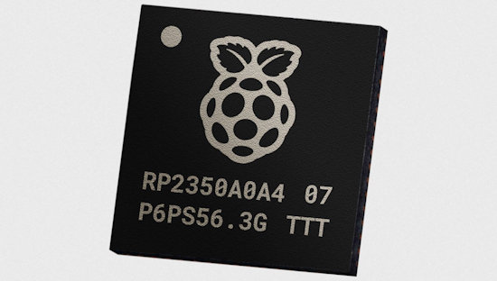](https://www.raspberrypi.com/news/rp2350-a4-rp2354-and-a-new-hacking-challenge/)

The Raspberry Pi RP2350 microcontroller wasn’t perfect on day one. The launch stepping, designated A2, is affected by a number of errata, including an error in the GPIO pad design which prevents pads from properly going into a high-impedance state (Erratum 9), and a number of security issues identified by participants of a sponsored [RP2350 Hacking Challenge](https://www.raspberrypi.com/news/security-through-transparency-rp2350-hacking-challenge-results-are-in/). Now there is immediate availability of a new A4 stepping, which addresses the vast majority of these issues - [Raspberry Pi News](https://www.raspberrypi.com/news/rp2350-a4-rp2354-and-a-new-hacking-challenge/).

> "Last year’s RP2350 Hacking Challenge was so much fun that we thought we should celebrate the launch of A4 with another one. This time we’re [challenging you to find a practical side-channel attack](https://github.com/raspberrypi/rp2350_hacking_challenge_2) on our [hardened implementation of the AES cipher](https://github.com/raspberrypi/rp2350_hacking_challenge_2/blob/main/aes_report_monospace.md), which is used to decrypt firmware images into internal SRAM at boot time. Once again, we’ve teamed up with Thomas “stacksmashing” Roth and the [Hextree.io](https://www.hextree.io/) team to set the [rules of the contest](https://github.com/raspberrypi/rp2350_hacking_challenge_2). &nbsp;  Those of you interfacing RP2350 to retro computer hardware will be pleased to hear that, after an extensive qualification campaign, RP2350 is now officially 5V tolerant!"

## CircuitPython 10.0.0-beta.2 Released

CircuitPython 10.0.0-beta.2, a beta release for 10.0.0, has been released. It has known bugs that will be fixed before the final release of 10.0.0 - [Adafruit Blog](https://blog.adafruit.com/2025/07/30/circuitpython-10-0-0-beta-2-released/) and release notes - [GitHub](https://github.com/adafruit/circuitpython/releases/tag/10.0.0-beta.2).

**Highlights of this Release**

* Support quad-color e-paper displays.
* Support MagTag 2025 Edition display.
* Use full Mozilla SSL root certificate list for all network-capable boards.

## The Adafruit Fruit Jam Arrives

[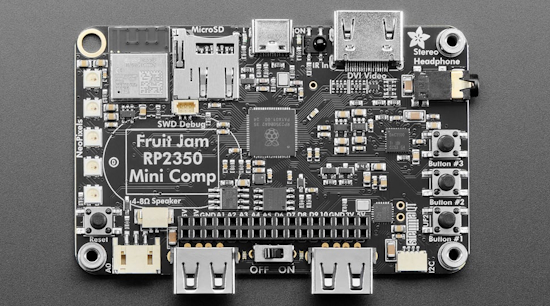](https://www.adafruit.com/product/6200)

The awaited Fruit Jam single board computer has been released by Adafruit. It sports a Raspberry Pi RP2350B dual 150MHz Cortex M33 microcontroller, 16 MB Flash + 8 MB PSRAM, DVI video out on an HDMI port, 2 USB Host ports, SD card, stereo headphone DAC, and much more. The USB Host ports support keyboards, mice and some game controllers. [Learn Guide tutorials](https://learn.adafruit.com/search?q=fruit%2520jam) are appearing, with more on the way. It's expected that the credit card-sized board will be used for games and emulators among other creative uses. It's programmable in CircuitPython, Arduino, and Pico SDK and will likely have other languages supported by the community - [Adafruit](https://www.adafruit.com/product/6200).

## Benchmarking MicroPython

[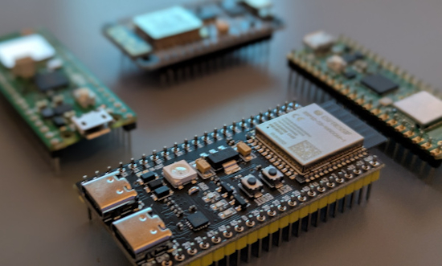](https://blog.miguelgrinberg.com/post/benchmarking-micropython)

Testing the performance of MicroPython running on different microcontrollers - [Miguel Grinberg](https://blog.miguelgrinberg.com/post/benchmarking-micropython).

## Feature

text - [site](url).

## Feature

text - [site](url).

## This Week's Python Streams

Python on Hardware is all about building a cooperative ecosphere which allows contributions to be valued and to grow knowledge. Below are the streams within the last week focusing on the community.

**CircuitPython Deep Dive Stream**

[Last Friday](link), Tim streamed work on {subject}.

You can see the latest video and past videos on the Adafruit YouTube channel under the Deep Dive playlist - [YouTube](https://www.youtube.com/playlist?list=PLjF7R1fz_OOXBHlu9msoXq2jQN4JpCk8A).

**CircuitPython Parsec**

John Park’s CircuitPython Parsec this week is on {subject} - [Adafruit Blog](link) and [YouTube](link).

Catch all the episodes in the [YouTube playlist](https://www.youtube.com/playlist?list=PLjF7R1fz_OOWFqZfqW9jlvQSIUmwn9lWr).

**CircuitPython Weekly Meeting**

CircuitPython Weekly Meeting for July 28, 2025 ([notes](https://github.com/adafruit/adafruit-circuitpython-weekly-meeting/blob/main/2025/2025-07-28.md)) [on YouTube](https://youtu.be/4lEZ0qYmgIw).

## Project of the Week: A CircuitPython Assistive Device

[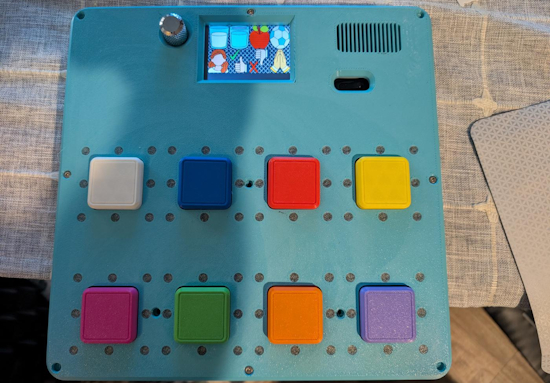](url)

"T-Rex" successfully built and deployed a needs communication device for an adobrable, non-verbal, 3 year girl to communicate her basic needs (hungry, thirsty, etc.) to her caregiver. The project runs off an Adafuit Feather RP2350 with added SRAM, an I2S amplifier, and a 18650 battery and is programmed in CircuitPython. Everything is open source - [Adafruit Forums](https://forums.adafruit.com/viewtopic.php?t=219447) and [Author Website](https://tssfaa.com/index.html).

## Popular Last Week

[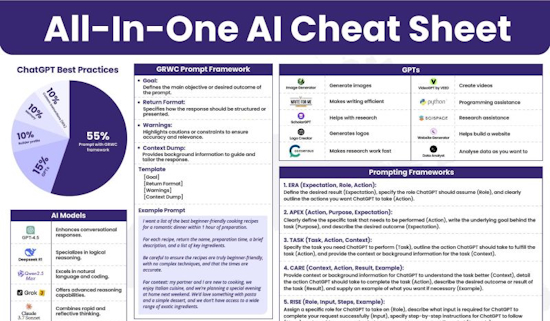](https://www.linkedin.com/posts/mattvillage_most-people-dont-know-how-to-use-ai-the-activity-7345088663917125632-qUMc/)

What was the most popular, most clicked link, in [last week's newsletter](https://www.adafruitdaily.com/2025/07/28/python-on-microcontrollers-newsletter-circuitpython-day-approaching-overclocking-the-pico-2-and-more-circuitpython-python-micropython-thepsf-raspberry_pi/)? [AI Cheat Sheet](https://www.linkedin.com/posts/mattvillage_most-people-dont-know-how-to-use-ai-the-activity-7345088663917125632-qUMc/).

Did you know you can read past issues of this newsletter in the Adafruit Daily Archive? [Check it out](https://www.adafruitdaily.com/category/circuitpython/).

## New Notes from Adafruit Playground

[Adafruit Playground](https://adafruit-playground.com/) is a new place for the community to post their projects and other making tips/tricks/techniques. Ad-free, it's an easy way to publish your work in a safe space for free.

[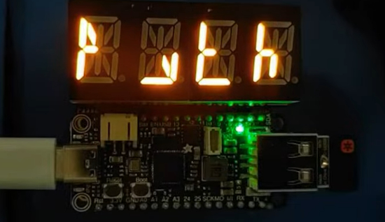](https://adafruit-playground.com/u/Foamyguy/pages/usb-cipher-machine)

USB Cipher Machine - [Adafruit Playground](https://adafruit-playground.com/u/Foamyguy/pages/usb-cipher-machine).

[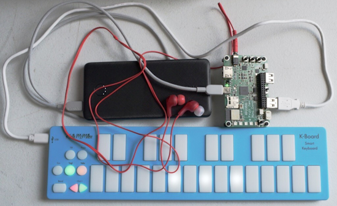](https://adafruit-playground.com/u/SamBlenny/pages/fruit-jam-portable-midi-synth)

Fruit Jam Portable MIDI Synth - [Adafruit Playground](https://adafruit-playground.com/u/SamBlenny/pages/fruit-jam-portable-midi-synth).

Custom Flight Sim Controllers with CircuitPython and MobiFlight - [Adafruit Playground](https://adafruit-playground.com/u/Gamblor21/pages/custom-flight-sim-controllers-with-circuitpython-and-mobiflight).

## News From Around the Web

[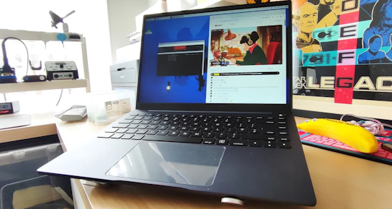](https://www.tomshardware.com/raspberry-pi/the-dream-of-a-raspberry-pi-laptop-becomes-a-reality-argonone-up-review)

The ArgonOne Up is the first laptop built using the Raspberry Pi CM5 single board computer module - [Tom's Hardware](https://www.tomshardware.com/raspberry-pi/the-dream-of-a-raspberry-pi-laptop-becomes-a-reality-argonone-up-review).

[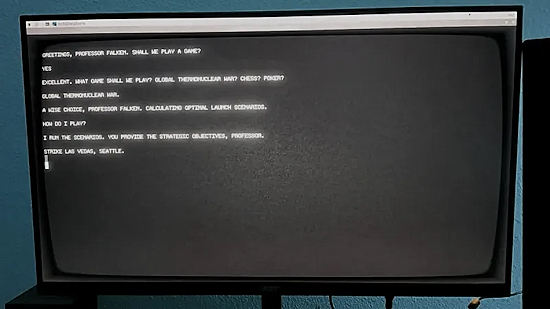](https://hackaday.io/project/203641-simulate-talking-with-wopr-from-the-movie-wargames)

Nick Bild simulates talking with WOPR from the movie *WarGames* by using a Raspberry Pi 400, a General Instrument SP0256-AL2 speech chip, and a Google Gemini LLM - [hackaday.io](https://hackaday.io/project/203641-simulate-talking-with-wopr-from-the-movie-wargames) and [YouTube](https://youtu.be/CZiND41tn_8). Via [Hackaday](https://hackaday.com/2025/07/30/rebooting-wargames-wopr-with-a-pi-and-gemini/).

This Raspberry Pi and Python project monitors your server rack so you don't have to - [Reddit](https://www.reddit.com/r/raspberry_pi/comments/1mav1sq/gui_for_raspberry_pi_headless_control_inside/) and [GitHub](https://github.com/ubopod/ubo_app). Via [XDA](https://www.xda-developers.com/raspberry-pi-powered-gui-keeps-an-eye-server-rack/).

[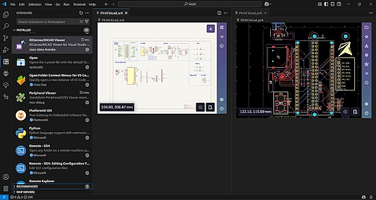](https://marketplace.visualstudio.com/items?itemName=JesseJabezArendse.kicanvas-viewer)

KiCanvas Viewer is a VS Code extension that offers an interactive (though limited) and real time KiCad file viewer - [Visual Studio Marketplace](https://marketplace.visualstudio.com/items?itemName=JesseJabezArendse.kicanvas-viewer). Via [LinkedIn](https://www.linkedin.com/posts/jesse-arendse-988216286_kicad-vscode-hardwaredevelopment-activity-7352667298802917378-YBQI/).

[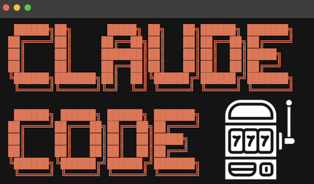](https://news.ycombinator.com/item?id=44702046)

Claude Code is a slot machine - [ycombinator News](https://news.ycombinator.com/item?id=44702046).

[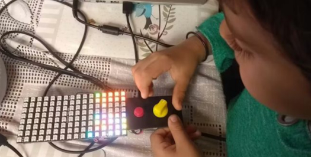](https://www.sescsp.org.br/programacao/introducao-ao-circuitpython-criacao-de-videogame/)

Brazilian course - Introduction to CircuitPython: Video Game Creation - [sescsp.org.br](https://www.sescsp.org.br/programacao/introducao-ao-circuitpython-criacao-de-videogame/). Via [Adafruit Forums](https://forums.adafruit.com/viewtopic.php?t=219461).

Microsoft is planning a huge upgrade for Visual Studio - [Neowin](https://www.neowin.net/news/microsoft-is-planning-a-huge-upgrade-for-visual-studio/).

Why MIT switched from Scheme to Python (2009) - [ycombinator News](https://news.ycombinator.com/item?id=44685119).

[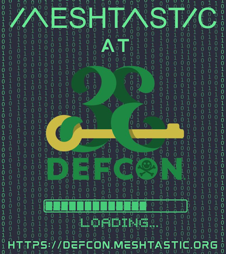](https://bsky.app/profile/meshtastic.org/post/3luvr3bqmze2k)

At DEF CON 33 August 7-10, Meshtastic is again collaborating with DEF CON, Darknet-NG, the Lonely Hackers Club, and other prominent groups heavily involved in the event to ensure the Meshtastic MQTT firmware is even more successful - [BlueSky](https://bsky.app/profile/meshtastic.org/post/3luvr3bqmze2k).

[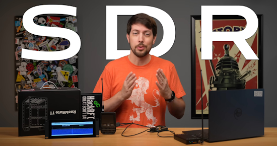](https://www.youtube.com/watch?v=1_lbvqCQnMY)

Jeff Geerling: Hacking Meshtastic with a Raspberry Pi and GNU Radio (with Python scripts) - [site](https://www.youtube.com/watch?v=1_lbvqCQnMY) and [GitHub](https://gitlab.com/crankylinuxuser/meshtastic_sdr).

[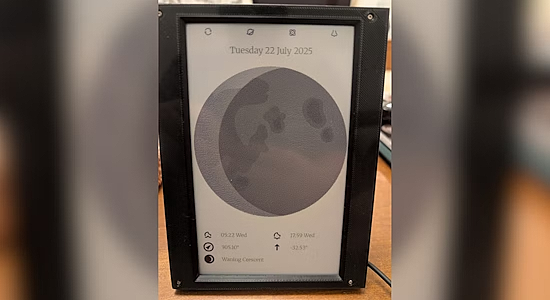](https://github.com/NotmoGit/AstroInky)

Inky Impression Moon Phase Display is a Python project for Raspberry Pi that displays various astronomical information pages on a 6-color Inky Impression e-ink display, using PyEphem for precise astronomical calculations - [GitHub](https://github.com/NotmoGit/AstroInky). Via [XDA](https://www.xda-developers.com/raspberry-pi-e-ink-project-astronomy/).

[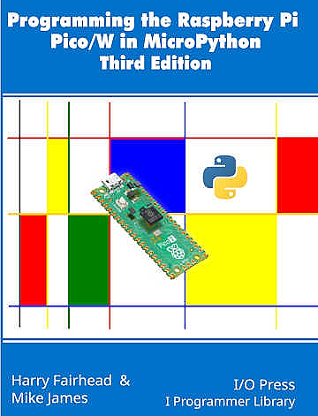](https://www.i-programmer.info/programming/148-hardware/18215-the-pico-in-micropython-asyncio-client.html)

The Pico In MicroPython: Asyncio Client (free chapter) - [i-programmer.info](https://www.i-programmer.info/programming/148-hardware/18215-the-pico-in-micropython-asyncio-client.html).

[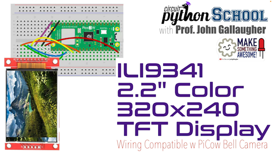](https://www.youtube.com/watch?v=2UDoitOSZXU)

ILI9341 2.2" color TFT display wiring & setup for a Raspberry Pi Pico (CircuitPython School) - [YouTube](https://www.youtube.com/watch?v=2UDoitOSZXU).

A dual-screen cyberdeck with Raspberry Pi and Python - [Hackaday](https://hackaday.com/2025/07/30/a-dual-screen-cyberdeck-to-rule-them-all/) and [GitHub](https://github.com/sector07-dev/RPI_DEV).

text - [site](url).

text - [site](url).

text - [site](url).

text - [site](url).

## New

[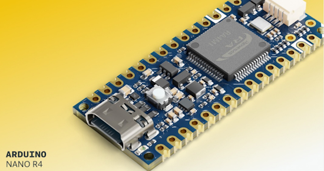](https://blog.arduino.cc/2025/07/24/introducing-the-arduino-nano-r4-small-in-size-big-on-possibilities/)

Arduino Nano R4 is powered by the same RA4M1 microcontroller that’s at the core of UNO R4 boards - [Arduino Blog](https://blog.arduino.cc/2025/07/24/introducing-the-arduino-nano-r4-small-in-size-big-on-possibilities/).

[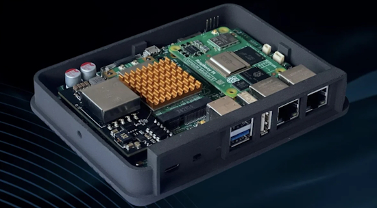](url)

text - [site](url).

## New Boards Supported by CircuitPython

The number of supported microcontrollers and Single Board Computers (SBC) grows every week. This section outlines which boards have been included in CircuitPython or added to [CircuitPython.org](https://circuitpython.org/).

This week there were (#/no) new boards added:

- [Board name](url)
- [Board name](url)
- [Board name](url)

*Note: For non-Adafruit boards, please use the support forums of the board manufacturer for assistance, as Adafruit does not have the hardware to assist in troubleshooting.*

Looking to add a new board to CircuitPython? It's highly encouraged! Adafruit has four guides to help you do so:

- [How to Add a New Board to CircuitPython](https://learn.adafruit.com/how-to-add-a-new-board-to-circuitpython/overview)
- [How to add a New Board to the circuitpython.org website](https://learn.adafruit.com/how-to-add-a-new-board-to-the-circuitpython-org-website)
- [Adding a Single Board Computer to PlatformDetect for Blinka](https://learn.adafruit.com/adding-a-single-board-computer-to-platformdetect-for-blinka)
- [Adding a Single Board Computer to Blinka](https://learn.adafruit.com/adding-a-single-board-computer-to-blinka)

## New Learn Guides

[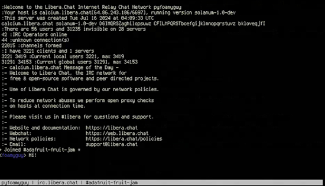](https://learn.adafruit.com/guides/latest)

The Adafruit Learning System has over 3,200 free guides for learning skills and building projects including using Python.

[Fruit Jam IRC Client in CircuitPython](https://learn.adafruit.com/fruit-jam-irc-client-in-circuitpython) from [Tim C](https://learn.adafruit.com/u/Foamyguy)

## Updated Learn Guides

[Adafruit MagTag](https://learn.adafruit.com/adafruit-magtag)

## CircuitPython Libraries

The CircuitPython library numbers are continually increasing, while existing ones continue to be updated. Here we provide library numbers and updates!

To get the latest Adafruit libraries, download the [Adafruit CircuitPython Library Bundle](https://circuitpython.org/libraries). To get the latest community contributed libraries, download the [CircuitPython Community Bundle](https://circuitpython.org/libraries).

If you'd like to contribute to the CircuitPython project on the Python side of things, the libraries are a great place to start. Check out the [CircuitPython.org Contributing page](https://circuitpython.org/contributing). If you're interested in reviewing, check out Open Pull Requests. If you'd like to contribute code or documentation, check out Open Issues. We have a guide on [contributing to CircuitPython with Git and GitHub](https://learn.adafruit.com/contribute-to-circuitpython-with-git-and-github), and you can find us in the #help-with-circuitpython and #circuitpython-dev channels on the [Adafruit Discord](https://adafru.it/discord).

You can check out this [list of all the Adafruit CircuitPython libraries and drivers available](https://github.com/adafruit/Adafruit_CircuitPython_Bundle/blob/master/circuitpython_library_list.md). 

The current number of CircuitPython libraries is **###**!

**New Libraries**

Here are this week's new CircuitPython libraries:

* [library](url)

**Updated Libraries**

Here are this week's updated CircuitPython libraries:

* [library](url)

## What’s the CircuitPython team up to this week?

What is the team up to this week? Let’s check in:

**Dan**

I released CircuitPython 10.0.0-beta.2 last Wednesday. I started with beta.1, but there was a build problem that caused the release to be incomplete, so I made another release immediately. As we say, integers are cheap: there are a lot of them.

Now all 4MB-flash USB-capable Espressif boards need a TinyUF2 bootloader upgrade. I'm revising the appropriate Learn Guide pages to include instructions for the using Melissa's Web Firmware Installer, available by clicking the "OPEN INSTALLER" button on board pages in [circuitpython.org](http://circuitpython.org/). The Web Firmware Installer is the easiest way to upgrade TinyUF2.

**Tim**

This week I finished the HSTX DVI CowBell guide. I updated many learn guide projects that use portalbase libraries to remove usage of a deprecated function and fix a few other minor bugs along the way. I also finished writing a guide for the Fruit Jam IRC Client. I did some testing on the latest versions of Nina-fw with fixes for HTTPS connects. Lastly I'm working on some pages in the Fruit Jam product guide. 

**Scott**

This week I merged in support for autodetecting the new MagTag screen and quad color e-paper support in `displayio`. I also fixed a memory allocation error in 10.x. I finishing up Python library support for the new MagTag screen and the new quad color. Next I'll look into supporting the larger 5.83" screen.

**Liz**

This week I added the new [quad-color eInk display](https://www.adafruit.com/product/6366) to the [CircuitPython EPD library](https://github.com/adafruit/Adafruit_CircuitPython_EPD). This library is used on a Raspberry Pi with Blinka. Support for this display is also being added to `displayio` and a guide is in progress.

## Upcoming Events

HOPE_16 is a welcoming place for hackers of all types: makers, artists, educators, experimenters, tinkerers, and more! If you’re interested in playing with technology, coming up with new ideas, learning from others, and sharing your knowledge, then this is the place for you. August 15-17, 2025 at St. John’s University Queens, New York City US - [HOPE](https://hope.net/).

The next MicroPython Meetup in Melbourne will be on August 27th – [Meetup](https://www.meetup.com/micropython-meetup/events). You can see recordings of previous meetings on [YouTube](https://www.youtube.com/@MicroPythonOfficial). 

KiCad conferences (KiCon) to be held this year include 19 – 20 Sept 2024 in Bochum, Germany, and November 21-23 in China (more details forthcoming) - [KiCad](https://kicon.kicad.org/).

PyCon UK will be at CONTACT in Manchester from Friday 19th September to Monday 22nd September 2025 - [PyCon UK 2025](https://2025.pyconuk.org/).

Maker Faire Bay Area 2025 will be Sep 26 – 28, 2025 in Vallejo, California, US - [Maker Faire](https://bayarea.makerfaire.com/).

PyLadiesCon returns December 5–7, 2025. 100% online conference designed for our global community. Talks, workshops, panels, and community fun – [PyLadies](https://conference.pyladies.com/2025-pyladiescon-is-back/).

**Send Your Events In**

If you know of virtual events or upcoming events, please let us know via email to cpnews(at)adafruit(dot)com.

## Latest Releases

CircuitPython's stable release is [#.#.#](https://github.com/adafruit/circuitpython/releases/latest) and its unstable release is [#.#.#-##.#](https://github.com/adafruit/circuitpython/releases). New to CircuitPython? Start with our [Welcome to CircuitPython Guide](https://learn.adafruit.com/welcome-to-circuitpython).

[2025####](https://github.com/adafruit/Adafruit_CircuitPython_Bundle/releases/latest) is the latest Adafruit CircuitPython library bundle.

[2025####](https://github.com/adafruit/CircuitPython_Community_Bundle/releases/latest) is the latest CircuitPython Community library bundle.

[v#.#.#](https://micropython.org/download) is the latest MicroPython release. Documentation for it is [here](http://docs.micropython.org/en/latest/pyboard/).

[#.#.#](https://www.python.org/downloads/) is the latest Python release. The latest pre-release version is [#.#.#](https://www.python.org/download/pre-releases/).

[#,### Stars](https://github.com/adafruit/circuitpython/stargazers) Like CircuitPython? [Star it on GitHub!](https://github.com/adafruit/circuitpython)

## Call for Help -- Translating CircuitPython is now easier than ever

[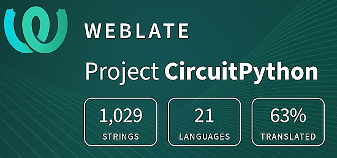](https://hosted.weblate.org/engage/circuitpython/)

One important feature of CircuitPython is translated control and error messages. With the help of fellow open source project [Weblate](https://weblate.org/), we're making it even easier to add or improve translations. 

Sign in with an existing account such as GitHub, Google or Facebook and start contributing through a simple web interface. No forks or pull requests needed! As always, if you run into trouble join us on [Discord](https://adafru.it/discord), we're here to help.

## NUMBER Thanks

The Adafruit Discord community, where we do all our CircuitPython development in the open, reached over NUMBER humans - thank you! Adafruit believes Discord offers a unique way for Python on hardware folks to connect. Join today at [https://adafru.it/discord](https://adafru.it/discord).

## ICYMI - In case you missed it

Python on hardware is the Adafruit Python video-newsletter-podcast! The news comes from the Python community, Discord, Adafruit communities and more and is broadcast on ASK an ENGINEER Wednesdays. The complete Python on Hardware weekly videocast [playlist is here](https://www.youtube.com/playlist?list=PLjF7R1fz_OOXRMjM7Sm0J2Xt6H81TdDev). The video podcast is on [iTunes](https://itunes.apple.com/us/podcast/python-on-hardware/id1451685192?mt=2), [YouTube](http://adafru.it/pohepisodes), [Instagram](https://www.instagram.com/adafruit/channel/)), and [XML](https://itunes.apple.com/us/podcast/python-on-hardware/id1451685192?mt=2).

[The weekly community chat on Adafruit Discord server CircuitPython channel - Audio / Podcast edition](https://itunes.apple.com/us/podcast/circuitpython-weekly-meeting/id1451685016) - Audio from the Discord chat space for CircuitPython, meetings are usually Mondays at 2pm ET, this is the audio version on [iTunes](https://itunes.apple.com/us/podcast/circuitpython-weekly-meeting/id1451685016), Pocket Casts, [Spotify](https://adafru.it/spotify), and [XML feed](https://adafruit-podcasts.s3.amazonaws.com/circuitpython_weekly_meeting/audio-podcast.xml).

## Contribute

The CircuitPython Weekly Newsletter is a CircuitPython community-run newsletter emailed every Monday. The complete [archives are here](https://www.adafruitdaily.com/category/circuitpython/). It highlights the latest CircuitPython related news from around the web including Python and MicroPython developments. To contribute, edit next week's draft [on GitHub](https://github.com/adafruit/circuitpython-weekly-newsletter/tree/gh-pages/_drafts) and [submit a pull request](https://help.github.com/articles/editing-files-in-your-repository/) with the changes. You may also tag your information on Twitter with #CircuitPython. 

Join the Adafruit [Discord](https://adafru.it/discord) or [post to the forum](https://forums.adafruit.com/viewforum.php?f=60) if you have questions.
