- [ ] Library and info updates
- [ ] change date
- [ ] update title
- [ ] Feature story
- [ ] Update  for images
- [ ] Update ICYDNCI
- [ ] All images 550w max only
- [ ] Link "View this email in your browser."

News Sources

- [Adafruit Playground](https://adafruit-playground.com/)
- Twitter: [CircuitPython](https://twitter.com/search?q=circuitpython&src=typed_query&f=live), [MicroPython](https://twitter.com/search?q=micropython&src=typed_query&f=live) and [Python](https://twitter.com/search?q=python&src=typed_query)
- [Raspberry Pi News](https://www.raspberrypi.com/news/)
- Mastodon [CircuitPython](https://mastodon.social/tags/CircuitPython) and [MicroPython](https://mastodon.social/tags/MicroPython)
- [hackster.io CircuitPython](https://www.hackster.io/search?q=circuitpython&i=projects&sort_by=most_recent) and [MicroPython](https://www.hackster.io/search?q=micropython&i=projects&sort_by=most_recent)
- YouTube: [CircuitPython](https://www.youtube.com/results?search_query=circuitpython&sp=CAI%253D), [MicroPython](https://www.youtube.com/results?search_query=micropython&sp=CAI%253D), [Prof Gallaugher](https://www.youtube.com/@BuildWithProfG/videos), [Teacher Brogan M. Pratt CircuitPython](https://www.youtube.com/playlist?list=PLRHdgFNRLyaN6eCw8b0yoHKDY9B4GiirU), [Teacher Brogan M. Pratt CircuitPython search](https://www.youtube.com/@BroganMPratt/search?query=circuitpython)
- [maker.io Python](https://www.digikey.com/en/maker/search-results?t=python)
- Instructables: [CircuitPython](https://www.instructables.com/search/?q=circuitpython&projects=all&sort=Newest), [MicroPython](https://www.instructables.com/search/?q=micropython&projects=all&sort=Newest), [Raspberry Pi Python](https://www.instructables.com/search/?q=raspberry+pi+python&projects=all&sort=Newest)
- [hackaday CircuitPython](https://hackaday.com/blog/?s=circuitpython) and [MicroPython](https://hackaday.com/blog/?s=micropython)
- [python.org](https://www.python.org/)
- [Python Insider - dev team blog](https://pythoninsider.blogspot.com/)
- Individuals: [Jeff Geerling](https://www.jeffgeerling.com/blog), [Yakroo](https://x.com/Yakroo5077)
- Tom's Hardware: [CircuitPython](https://www.tomshardware.com/search?searchTerm=circuitpython&articleType=all&sortBy=publishedDate) and [MicroPython](https://www.tomshardware.com/search?searchTerm=micropython&articleType=all&sortBy=publishedDate) and [Raspberry Pi](https://www.tomshardware.com/search?searchTerm=raspberry%20pi&articleType=all&sortBy=publishedDate)
- [hackaday.io newest projects MicroPython](https://hackaday.io/projects?tag=micropython&sort=date) and [CircuitPython](https://hackaday.io/projects?tag=circuitpython&sort=date)
- [Google News Python](https://news.google.com/topics/CAAqIQgKIhtDQkFTRGdvSUwyMHZNRFY2TVY4U0FtVnVLQUFQAQ?hl=en-US&gl=US&ceid=US%3Aen)
- hackaday.io - [CircuitPython](https://hackaday.io/search?term=circuitpython) and [MicroPython](https://hackaday.io/search?term=micropython)

View this email in your browser. **Warning: Flashing Imagery**

Welcome to the latest Python on Microcontrollers newsletter! *insert 2-3 sentences from editor (what's in overview, banter)* - *Anne Barela, Editor*

We're on [Discord](https://discord.gg/HYqvREz), [Twitter/X](https://twitter.com/search?q=circuitpython&src=typed_query&f=live), [BlueSky](https://bsky.app/profile/circuitpython.org) and for past newsletters - [view them all here](https://www.adafruitdaily.com/category/circuitpython/). If you're reading this on the web, please [subscribe here](https://www.adafruitdaily.com/). Here's the news this week:

## CircuitPython Day 2025 is August 15th!

[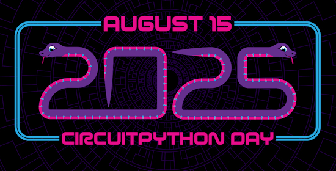](https://blog.adafruit.com/2025/07/28/circuitpython-day-is-august-15-2025/)

Friday, August 15th is CircuitPython Day, the snakiest day of the year. Please mark your calendars! And let us know how you might be celebrating CircuitPython Day by tagging social media with #CircuitPythonDay2025 - [Adafruit Blog](https://blog.adafruit.com/2025/07/28/circuitpython-day-is-august-15-2025/).

- 11 am – 3D Hangouts with Noe & Pedro
- 12 noon – CircuitPython Core Dev Chat with Dan & Scott, submit your questions on the form here.
- 1 pm – Adafruit IO Actions with Brent & Loren
- 4 pm – Bootloader Podcast Live: CircuitPython Day Edition
- 6:30 pm – Game Jam with Tim

## Feature

text - [site](url).

## Feature

text - [site](url).

## The Particle Tachyon 5G Single-Board Computer Ships

[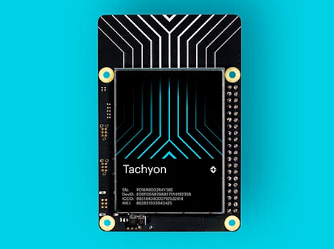](https://store.particle.io/products/tachyon-5g-single-board-computer)

The new Tachyon single board computer is shipping direct from Particle. It’s powered by a Qualcomm QCM6490 Dragonwing processor with 8 Kryo 670 CPU cores, Adreno 643 graphics, and an NPU with up to 12 TOPS of AI performance. It also supports 5G sub-6 GHz cellular networks as well as WiFi 6E and Bluetooth 5.2 - [Particle](https://store.particle.io/products/tachyon-5g-single-board-computer). Via [Lilyputing](https://liliputing.com/particle-tachyon-5g-single-board-pc-now-available-for-299/).

## Arduino's Move to a Zephyr RTOS-Based Firmware Moves Forward With Core v0.3.2

[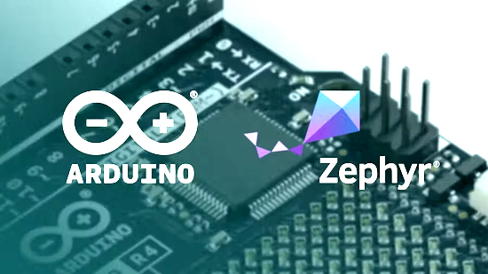](https://www.hackster.io/news/arduino-s-move-to-a-zephyr-rtos-based-firmware-makes-new-strides-with-core-v0-3-2-b29f6d909882)

Selected Arduino boards, previously built atop Arm's since-shuttered Mbed OS, can now participate in the current beta - [hackster.io](https://www.hackster.io/news/arduino-s-move-to-a-zephyr-rtos-based-firmware-makes-new-strides-with-core-v0-3-2-b29f6d909882) and [GitHub](https://github.com/arduino/ArduinoCore-zephyr).

## Python Popularity Boosted by AI Coding Assistants – Tiobe

Python, the highest-ranking language ever in the Tiobe index of programming language popularity, has been getting a boost from AI coding assistants, according to Tiobe. In the July 2025 index, Python scored a rating of 26.98%, the highest ever in the monthly index, which dates back to June 2001. In the August index, published August 4, Python once again easily maintained its top spot in the rankings, though its rating slipped slightly to 26.14% - [InfoWorld](https://www.infoworld.com/article/4033860/python-popularity-boosted-by-ai-coding-assistants-tiobe.html).

## This Week's Python Streams

Python on Hardware is all about building a cooperative ecosphere which allows contributions to be valued and to grow knowledge. Below are the streams within the last week focusing on the community.

**CircuitPython Deep Dive Stream**

Tim is off this week. You can see the latest video and past videos on the Adafruit YouTube channel under the Deep Dive playlist - [YouTube](https://www.youtube.com/playlist?list=PLjF7R1fz_OOXBHlu9msoXq2jQN4JpCk8A).

**CircuitPython Parsec**

John Park’s CircuitPython Parsec this week is on {subject} - [Adafruit Blog](link) and [YouTube](link).

Catch all the episodes in the [YouTube playlist](https://www.youtube.com/playlist?list=PLjF7R1fz_OOWFqZfqW9jlvQSIUmwn9lWr).

**CircuitPython Weekly Meeting**

CircuitPython Weekly Meeting for {date} ([notes](file)) [on YouTube](link).

## Project of the Week

[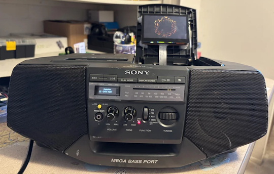](url)

text - [site](url).

## Popular Last Week

What was the most popular, most clicked link, in [last week's newsletter](https://www.adafruitdaily.com/2025/08/04/python-on-microcontrollers-newsletter-raspberry-pi-rp2350-fixed-fruit-jammin-talkin-wopr-and-more-circuitpython-python-micropython-thepsf-raspberry_pi/)? [Microsoft is planning a huge upgrade for Visual Studio](https://www.neowin.net/news/microsoft-is-planning-a-huge-upgrade-for-visual-studio/).

Did you know you can read past issues of this newsletter in the Adafruit Daily Archive? [Check it out](https://www.adafruitdaily.com/category/circuitpython/).

## New Notes from Adafruit Playground

[Adafruit Playground](https://adafruit-playground.com/) is a new place for the community to post their projects and other making tips/tricks/techniques. Ad-free, it's an easy way to publish your work in a safe space for free.

[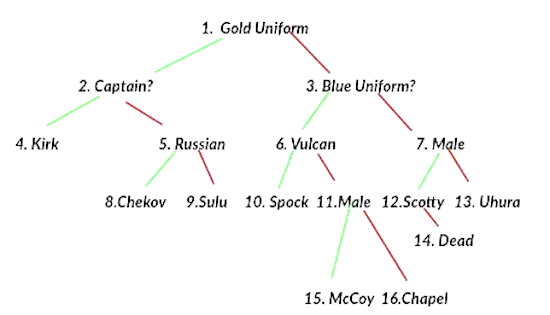](https://adafruit-playground.com/u/mrklingon/pages/build-a-brain-in-your-neotrinkey)

Build a Brain in your NeoTrinkey - [Adafruit Playground](https://adafruit-playground.com/u/mrklingon/pages/build-a-brain-in-your-neotrinkey).

text - [Adafruit Playground](url).

text - [Adafruit Playground](url).

## News From Around the Web

The top 10 collections of cheat sheets on GitHub - [KDnuggets](https://www.kdnuggets.com/top-10-collections-of-cheat-sheets-on-github).  Python is [here](https://github.com/gto76/python-cheatsheet).

Python performance myths and fairy tales - [LWN.net](https://lwn.net/SubscriberLink/1031707/73cb0cf917307a93/).

text - [site](url).

[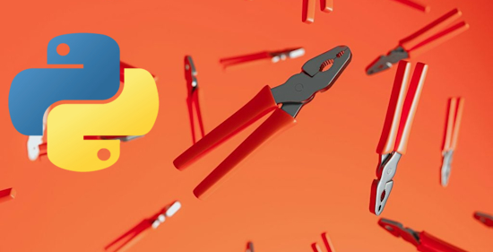](https://thenewstack.io/python-vibe-coding-tools/)

Python Vibe Coding Tools - [The New STack](https://thenewstack.io/python-vibe-coding-tools/).

The Case for Makefiles in Python Projects (And How to Get Started) - [KDNuggests](https://www.kdnuggets.com/the-case-for-makefiles-in-python-projects-and-how-to-get-started).

[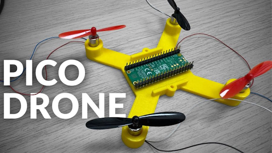](https://www.youtube.com/watch?v=Us0bSUX9UkQ)

Pico Drone - Kevin McAleer sets out to build a drone using a Raspberry Pi Pico and MicroPython - [YouTube](https://www.youtube.com/watch?v=Us0bSUX9UkQ). Via [X](https://x.com/kevsmac/status/1952268827007315986?s=03).

A MicroPython driver for the TF Luna LiDAR range sensor (I2C Mode) - [GitHub](https://github.com/TimHanewich/MicroPython-Collection/tree/master/TF-Luna).

text - [site](url).

text - [site](url).

text - [site](url).

text - [site](url).

text - [site](url).

text - [site](url).

[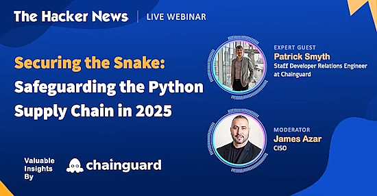](https://thehackernews.com/2025/08/webinar-how-to-stop-python-supply-chain.html)

Webinar: How to stop Python supply chain attacks—and the expert tools you need - [The Hacker News](https://thehackernews.com/2025/08/webinar-how-to-stop-python-supply-chain.html).

[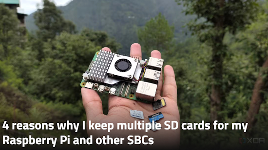](https://www.xda-developers.com/reasons-use-multiple-sd-cards-for-raspberry-pi/)

4 reasons why I keep multiple SD cards for my Raspberry Pi and other SBCs - [XDA](https://www.xda-developers.com/reasons-use-multiple-sd-cards-for-raspberry-pi/).

text - [site](url).

text - [site](url).

[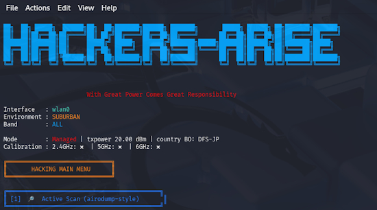](https://hackers-arise.com/python-basics-for-hackers-building-a-wi-fi-scanner-capable-of-locating-the-position-of-local-aps/)

Python Basics for Hackers: Building a WiFi scanner capable of locating the position of local access points - [Hackers Arise](https://hackers-arise.com/python-basics-for-hackers-building-a-wi-fi-scanner-capable-of-locating-the-position-of-local-aps/).

## New

[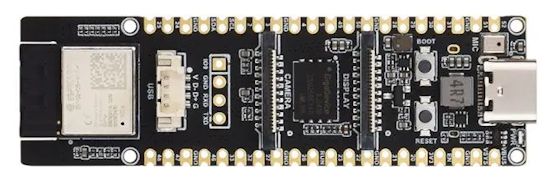](https://linuxgizmos.com/esp32-p4-wifi6-development-board-with-wi-fi-6-and-bluetooth-5-support/)

ESP32-P4-WIFI6 Development Board with Wi-Fi 6 and Bluetooth 5 Support - [LinuxGizmos](https://linuxgizmos.com/esp32-p4-wifi6-development-board-with-wi-fi-6-and-bluetooth-5-support/).

[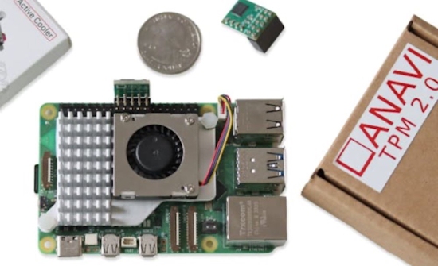](https://www.hackster.io/news/anavi-aims-to-boost-raspberry-pi-project-security-with-a-simple-drop-in-trusted-platform-module-2-0-932c7257baf8)

ANAVI aims to boost Raspberry Pi project security with a simple drop-in Trusted Platform Module 2.0 - [hackster.io](https://www.hackster.io/news/anavi-aims-to-boost-raspberry-pi-project-security-with-a-simple-drop-in-trusted-platform-module-2-0-932c7257baf8). Via [BlueSky](https://bsky.app/profile/hacksterio.bsky.social/post/3lveg2xtw6c2e).

[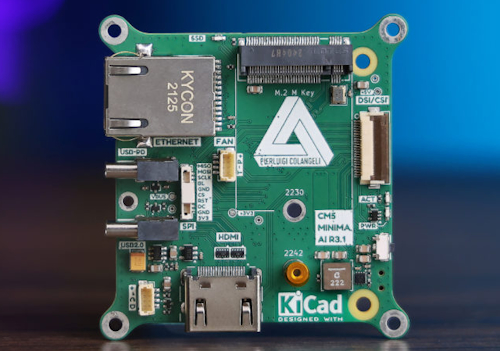](https://www.seeedstudio.com/blog/2025/08/04/introducing-the-cm5-minima-r3-a-compact-open-source-powerhouse-for-raspberry-pi-cm5/)

The CM5 MINIMA R3 is a compact carrier board built for the Raspberry Pi Compute Module (CM5) - [Seeedstudio](https://www.seeedstudio.com/blog/2025/08/04/introducing-the-cm5-minima-r3-a-compact-open-source-powerhouse-for-raspberry-pi-cm5/).

## New Boards Supported by CircuitPython

The number of supported microcontrollers and Single Board Computers (SBC) grows every week. This section outlines which boards have been included in CircuitPython or added to [CircuitPython.org](https://circuitpython.org/).

This week there were (#/no) new boards added:

- [Board name](url)
- [Board name](url)
- [Board name](url)

*Note: For non-Adafruit boards, please use the support forums of the board manufacturer for assistance, as Adafruit does not have the hardware to assist in troubleshooting.*

Looking to add a new board to CircuitPython? It's highly encouraged! Adafruit has four guides to help you do so:

- [How to Add a New Board to CircuitPython](https://learn.adafruit.com/how-to-add-a-new-board-to-circuitpython/overview)
- [How to add a New Board to the circuitpython.org website](https://learn.adafruit.com/how-to-add-a-new-board-to-the-circuitpython-org-website)
- [Adding a Single Board Computer to PlatformDetect for Blinka](https://learn.adafruit.com/adding-a-single-board-computer-to-platformdetect-for-blinka)
- [Adding a Single Board Computer to Blinka](https://learn.adafruit.com/adding-a-single-board-computer-to-blinka)

## New Learn Guides

[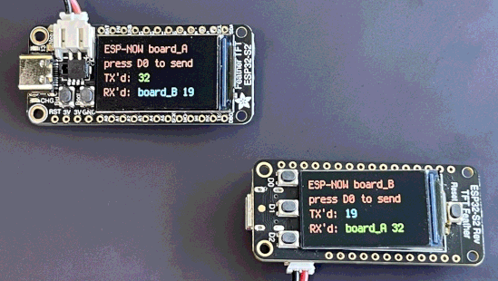](https://learn.adafruit.com/guides/latest)

The Adafruit Learning System has over 3,200 free guides for learning skills and building projects including using Python.

[ESP-NOW in CircuitPython](https://learn.adafruit.com/admin/guides/4306/editor/30718) from [John Park](https://learn.adafruit.com/u/johnpark)

[title](url) from [name](url)

[title](url) from [name](url)

## Updated Learn Guides

[title](url)

## CircuitPython Libraries

The CircuitPython library numbers are continually increasing, while existing ones continue to be updated. Here we provide library numbers and updates!

To get the latest Adafruit libraries, download the [Adafruit CircuitPython Library Bundle](https://circuitpython.org/libraries). To get the latest community contributed libraries, download the [CircuitPython Community Bundle](https://circuitpython.org/libraries).

If you'd like to contribute to the CircuitPython project on the Python side of things, the libraries are a great place to start. Check out the [CircuitPython.org Contributing page](https://circuitpython.org/contributing). If you're interested in reviewing, check out Open Pull Requests. If you'd like to contribute code or documentation, check out Open Issues. We have a guide on [contributing to CircuitPython with Git and GitHub](https://learn.adafruit.com/contribute-to-circuitpython-with-git-and-github), and you can find us in the #help-with-circuitpython and #circuitpython-dev channels on the [Adafruit Discord](https://adafru.it/discord).

You can check out this [list of all the Adafruit CircuitPython libraries and drivers available](https://github.com/adafruit/Adafruit_CircuitPython_Bundle/blob/master/circuitpython_library_list.md). 

The current number of CircuitPython libraries is **###**!

**New Libraries**

Here are this week's new CircuitPython libraries:

* [library](url)

**Updated Libraries**

Here are this week's updated CircuitPython libraries:

* [library](url)

## What’s the CircuitPython team up to this week?

What is the team up to this week? Let’s check in:

**Dan**

text.

**Tim**

This week I've been working mostly on the Fruit Jam guide pages. Since the first round of Fruit Jam hardware has made it into peoples hands there has been an uptick in people using Fruit Jam OS, and the Fruit Jam library which has uncovered a few bugs that we've fixed. It's also allowed community members to start getting more involved with development, so I've been reviewing PRs that have improved and added new features to Fruit Jam OS. Better support for different display sizes, and customization theme colors are two improvements submitted by community members this week. Here is the Fruit Jam OS launching sporting a cool green and black matrix theme.

[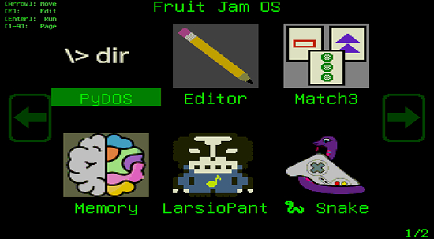](https://www.circuitpython.org/)

**Scott**

This last week I've continued working on e-paper drivers. I did [UC8253](https://github.com/adafruit/Adafruit_CircuitPython_UC8253) for two upcoming 3.7" displays. I did [UC8179](https://github.com/adafruit/Adafruit_CircuitPython_UC8179) for upcoming 5.83" and 7.5" displays. I'm just about done with the SSD1683 support for the two new 4.2" displays as well. Before moving on from e-paper, I plan on trying to add partial update support as well. Partial updates are quicker than normal but are limited to black and white and are more complex to implement.

This week I also received two more ESP32-P4 boards and checked their chip versions. One was v1.0 and one was v1.3. So, I know I've got the latest version for when I move on to ESP32-P4 work.

**Liz**

This week I've been working on starting to document Fruit Jam. I'm working with Tim on the main guide and I created the Factory Reset file from an [Arduino sketch](https://github.com/adafruit/Adafruit_Learning_System_Guides/blob/main/Factory_Tests/Fruit_Jam_Factory_Test/Fruit_Jam_Factory_Test.ino) that tests all of the peripherals on board. This doubles as an example on how to setup the peripherals in the correct order in Arduino. 

I also started documenting the [pico-mac emulator](https://github.com/adafruit/pico-mac). My first computing experience was Windows 98, so it's been a bit of a learning curve in both emulation and what software to try out, but I have a good disk image put together now and a guide will be out soon.

## Upcoming Events

HOPE_16 is a welcoming place for hackers of all types: makers, artists, educators, experimenters, tinkerers, and more! If you’re interested in playing with technology, coming up with new ideas, learning from others, and sharing your knowledge, then this is the place for you. August 15-17, 2025 at St. John’s University Queens, New York City US - [HOPE](https://hope.net/).

The next MicroPython Meetup in Melbourne will be on July 23rd – [Meetup](https://www.meetup.com/micropython-meetup/events). You can see recordings of previous meetings on [YouTube](https://www.youtube.com/@MicroPythonOfficial). 

PyOhio 2025 will be held Saturday & Sunday July 26 & 27, 2025 at the Cleveland State University Student Center in Cleveland, Ohio - [PyOhio 2025](https://www.pyohio.org/2025/).

KiCad conferences (KiCon) to be held this year include 19 - 20 Sept 2024 in Bochum, Germany, and to be determined in Asia - [KiCad](https://kicon.kicad.org/).

PyCon UK will be at CONTACT in Manchester from Friday 19th September to Monday 22nd September 2025 - [PyCon UK 2025](https://2025.pyconuk.org/).

Maker Faire Bay Area 2025 will be Sep 26 – 28, 2025 in Vallejo, California, US - [Maker Faire](https://bayarea.makerfaire.com/).

PyLadiesCon returns December 5–7, 2025. 100% online conference designed for our global community. Talks, workshops, panels, and community fun – [PyLadies](https://conference.pyladies.com/2025-pyladiescon-is-back/).

**Send Your Events In**

If you know of virtual events or upcoming events, please let us know via email to cpnews(at)adafruit(dot)com.

## Latest Releases

CircuitPython's stable release is [#.#.#](https://github.com/adafruit/circuitpython/releases/latest) and its unstable release is [#.#.#-##.#](https://github.com/adafruit/circuitpython/releases). New to CircuitPython? Start with our [Welcome to CircuitPython Guide](https://learn.adafruit.com/welcome-to-circuitpython).

[2025####](https://github.com/adafruit/Adafruit_CircuitPython_Bundle/releases/latest) is the latest Adafruit CircuitPython library bundle.

[2025####](https://github.com/adafruit/CircuitPython_Community_Bundle/releases/latest) is the latest CircuitPython Community library bundle.

[v#.#.#](https://micropython.org/download) is the latest MicroPython release. Documentation for it is [here](http://docs.micropython.org/en/latest/pyboard/).

[#.#.#](https://www.python.org/downloads/) is the latest Python release. The latest pre-release version is [#.#.#](https://www.python.org/download/pre-releases/).

[#,### Stars](https://github.com/adafruit/circuitpython/stargazers) Like CircuitPython? [Star it on GitHub!](https://github.com/adafruit/circuitpython)

## Call for Help -- Translating CircuitPython is now easier than ever

[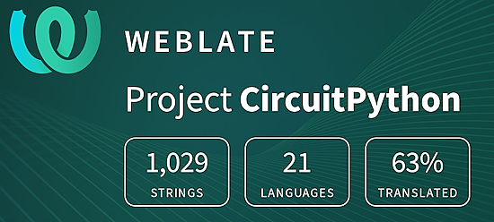](https://hosted.weblate.org/engage/circuitpython/)

One important feature of CircuitPython is translated control and error messages. With the help of fellow open source project [Weblate](https://weblate.org/), we're making it even easier to add or improve translations. 

Sign in with an existing account such as GitHub, Google or Facebook and start contributing through a simple web interface. No forks or pull requests needed! As always, if you run into trouble join us on [Discord](https://adafru.it/discord), we're here to help.

## NUMBER Thanks

The Adafruit Discord community, where we do all our CircuitPython development in the open, reached over NUMBER humans - thank you! Adafruit believes Discord offers a unique way for Python on hardware folks to connect. Join today at [https://adafru.it/discord](https://adafru.it/discord).

## ICYMI - In case you missed it

Python on hardware is the Adafruit Python video-newsletter-podcast! The news comes from the Python community, Discord, Adafruit communities and more and is broadcast on ASK an ENGINEER Wednesdays. The complete Python on Hardware weekly videocast [playlist is here](https://www.youtube.com/playlist?list=PLjF7R1fz_OOXRMjM7Sm0J2Xt6H81TdDev). The video podcast is on [iTunes](https://itunes.apple.com/us/podcast/python-on-hardware/id1451685192?mt=2), [YouTube](http://adafru.it/pohepisodes), [Instagram](https://www.instagram.com/adafruit/channel/)), and [XML](https://itunes.apple.com/us/podcast/python-on-hardware/id1451685192?mt=2).

[The weekly community chat on Adafruit Discord server CircuitPython channel - Audio / Podcast edition](https://itunes.apple.com/us/podcast/circuitpython-weekly-meeting/id1451685016) - Audio from the Discord chat space for CircuitPython, meetings are usually Mondays at 2pm ET, this is the audio version on [iTunes](https://itunes.apple.com/us/podcast/circuitpython-weekly-meeting/id1451685016), Pocket Casts, [Spotify](https://adafru.it/spotify), and [XML feed](https://adafruit-podcasts.s3.amazonaws.com/circuitpython_weekly_meeting/audio-podcast.xml).

## Contribute

The CircuitPython Weekly Newsletter is a CircuitPython community-run newsletter emailed every Monday. The complete [archives are here](https://www.adafruitdaily.com/category/circuitpython/). It highlights the latest CircuitPython related news from around the web including Python and MicroPython developments. To contribute, edit next week's draft [on GitHub](https://github.com/adafruit/circuitpython-weekly-newsletter/tree/gh-pages/_drafts) and [submit a pull request](https://help.github.com/articles/editing-files-in-your-repository/) with the changes. You may also tag your information on Twitter with #CircuitPython. 

Join the Adafruit [Discord](https://adafru.it/discord) or [post to the forum](https://forums.adafruit.com/viewforum.php?f=60) if you have questions.
