View this email in your browser. **Warning: Flashing Imagery**

Welcome to the latest Python on Microcontrollers newsletter! Your editor is sleeping in after doing double duty posting social media for CircuitPython Day 2025. Lots of great talks occurred, which you can catch now on [YouTube](https://www.youtube.com/playlist?list=PLjF7R1fz_OOVoxNn38WR-p-Dv6bksiJg3). Yet this issue is chock-full of goodness too. Will GitHub be renamed Microsoft Bob? We'll see. Catch all the news and projects in this issue. Cheers - *Anne Barela, Editor*

We're on [Discord](https://discord.gg/HYqvREz), [Twitter/X](https://twitter.com/search?q=circuitpython&src=typed_query&f=live), [BlueSky](https://bsky.app/profile/circuitpython.org) and for past newsletters - [view them all here](https://www.adafruitdaily.com/category/circuitpython/). If you're reading this on the web, please [subscribe here](https://www.adafruitdaily.com/). Here's the news this week:

## CircuitPython Day 2025 Wrap-up

CircuitPython Day 2025, last Friday, was outstanding! All the folks doing videocasts and projects posted. Videos of events are available - [YouTube](https://www.youtube.com/playlist?list=PLjF7R1fz_OOVoxNn38WR-p-Dv6bksiJg3).

## Reverse Engineering the Raspberry Pi Zero 2W

[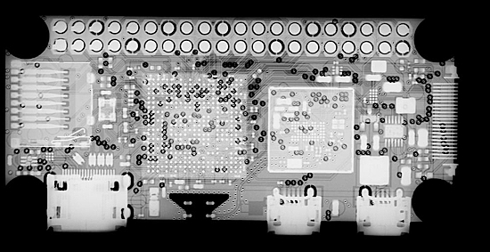](https://www.youtube.com/watch?v=p7IvioiveOo)

Jeff Geerling discusses reverse engineering a Raspberry Pi Zero 2W PCB including scans using a Lumafield CT device - [YouTube](https://www.youtube.com/watch?v=p7IvioiveOo). Via [BlueSky](https://bsky.app/profile/jeffgeerling.com/post/3lwa7k7pgyc2h).

## .mpy FlashLoader for MicroPython on the Pico

[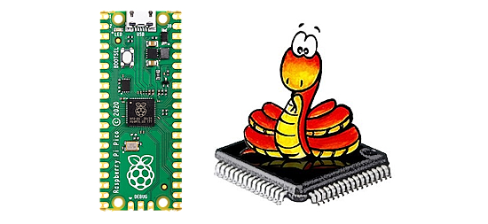](https://github.com/Gadgetoid/mpy_pico_flashloader)

The .mpy FlashLoader for MicroPython on the Pico does one thing: flash a payload to a Raspberry Pi Pico (RP2040) from MicroPython - [GitHub](https://github.com/Gadgetoid/mpy_pico_flashloader).

## GitHub Folds Into Microsoft Following CEO Resignation

GitHub folds into Microsoft following CEO resignation. The once independent programming site is now part of the 'CoreAI' team - [Tom's Hardware](https://www.tomshardware.com/software/programming/github-folds-into-microsoft-following-ceo-resignation-once-independent-programming-site-now-part-of-coreai-team).

## Python 3.14.0rc2 and 3.13.7 are Out!

[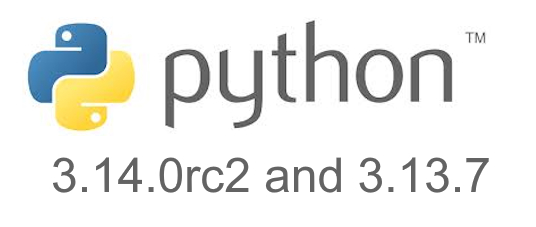](https://pythoninsider.blogspot.com/2025/08/python-3140rc2-and-3137-are-go.html)

3.14.0rc2, is the penultimate release preview. Entering the release candidate phase, only reviewed code changes which are clear bug fixes are allowed between this release candidate and the final release. 3.13.7 is an expedited release to fix a significant issue with the 3.13.6 release with ssl and tls - [Python Insider Blog](https://pythoninsider.blogspot.com/2025/08/python-3140rc2-and-3137-are-go.html).

## Trimming the FAT: Flash Raspberry Pi OS Images Faster

[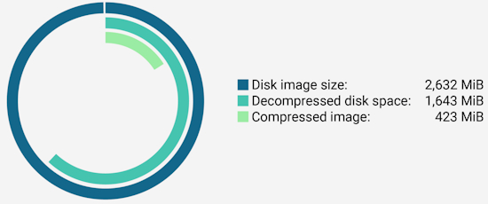](https://www.raspberrypi.com/news/trimming-the-fat-flash-raspberry-pi-os-images-faster/)

Did you know that when you download and flash a Raspberry Pi OS Lite image, you’re largely flashing… nothing? Looking at the latest 64-bit lite image from 13 May, it’s supposedly 2,632 MiB decompressed, yet for some reason it occupies only 1,643 MiB of disk space, just 62.4% of that amount. Richard Oliver shows you some new tools to shrink install images while still getting things to the correct places on a disk image, which also saves time - [Raspberry Pi News](https://www.raspberrypi.com/news/trimming-the-fat-flash-raspberry-pi-os-images-faster/).

## This Week's Python Streams

Python on Hardware is all about building a cooperative ecosphere which allows contributions to be valued and to grow knowledge. Below are the streams within the last week focusing on the community.

**CircuitPython Deep Dive Stream**

[Last Friday](https://www.youtube.com/watch?v=05c2LV6krvM), Tim streamed work on Game Jam.

You can see the latest video and past videos on the Adafruit YouTube channel under the Deep Dive playlist - [YouTube](https://www.youtube.com/playlist?list=PLjF7R1fz_OOXBHlu9msoXq2jQN4JpCk8A).

**CircuitPython Parsec**

John Park’s CircuitPython Parsec is off this week. Catch all the episodes in the [YouTube playlist](https://www.youtube.com/playlist?list=PLjF7R1fz_OOWFqZfqW9jlvQSIUmwn9lWr).

**CircuitPython Weekly Meeting**

CircuitPython Weekly Meeting for August 11, 2025 ([notes](https://github.com/adafruit/adafruit-circuitpython-weekly-meeting/blob/main/2025/2025-08-11.md)) [on YouTube](https://youtu.be/Nc5-uQEDGyo).

## Project of the Week: circremote

John Romkey has put together a utility that sends code to a CircuitPython device, either locally over USB or through the WebWorkflow as supported by ESP32 CPUs. This lets you execute code without disturbing code.py - [Reddit](https://www.reddit.com/r/circuitpython/comments/1modps2/new_circuitpython_utility_circremote/).

> "I use it for testing and diagnostics and for shorthand to save copying and pasting an I2C scanner for the four hundredth time. It should be suitable for use as part of a scripted testing environment. It currently includes 92 "commands", mostly code for sensors that Adafruit sells but also a few utility programs like an I2C scanner, reset to UF2 mode, cat, ls, rm, show board info, clean up unwanted files, and a few other things.

## Popular Last Week

[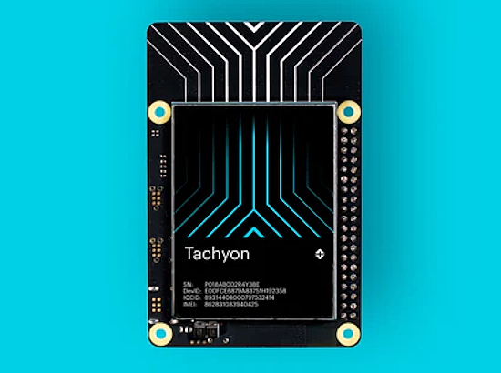](https://store.particle.io/products/tachyon-5g-single-board-computer)

What was the most popular, most clicked link, in [last week's newsletter](https://www.adafruitdaily.com/2025/08/11/python-on-microcontrollers-newsletter-circuitpython-day-is-friday-micropython-v1-26-0-release-soon-and-more-circuitpython-python-micropython-thepsf-raspberry_pi/)? [Tachyon 5G Single-Board Computer](https://store.particle.io/products/tachyon-5g-single-board-computer).

Did you know you can read past issues of this newsletter in the Adafruit Daily Archive? [Check it out](https://www.adafruitdaily.com/category/circuitpython/).

## New Notes from Adafruit Playground

[Adafruit Playground](https://adafruit-playground.com/) is a new place for the community to post their projects and other making tips/tricks/techniques. Ad-free, it's an easy way to publish your work in a safe space for free.

Fruit Jam Fruitris (Tetris) - [Adafruit Playground](https://adafruit-playground.com/u/relic_se/pages/fruit-jam-fruitris-tetris).

[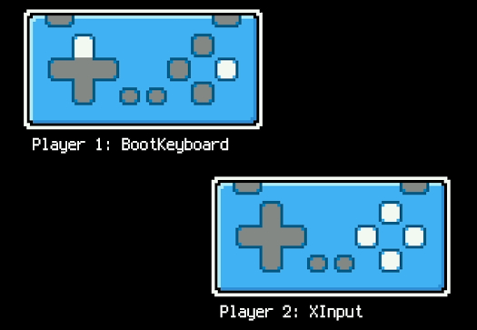](https://adafruit-playground.com/u/SamBlenny/pages/fruit-jam-two-gamepad-demo)

Fruit Jam Two Gamepad Demo - [Adafruit Playground](https://adafruit-playground.com/u/SamBlenny/pages/fruit-jam-two-gamepad-demo).

## News From Around the Web

[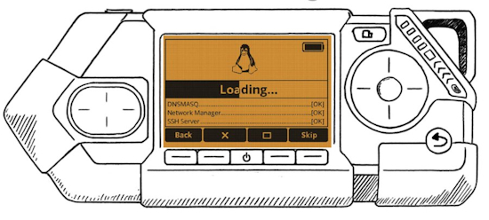](https://x.com/zhovner/status/1956376140182081573)

The Flipper One, a follow-on to the Fliiper Zero hacking device (that can run MicroPython) is in development. The team is looking for a Linux Engineer to design a custom Linux distribution for Flipper One, based on a modern A/B partition, immutable root filesystem model with atomic upgrades - [X](https://x.com/zhovner/status/1956376140182081573).

[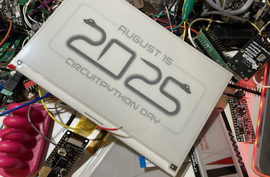](https://mastodon.social/@blitzcitydiy/115033761220968351)

Liz shows some sweet, dithered Circuit Python Day 2025 graphics on a 7.5” e-ink display with a Feather ThinkInk running CircuitPython - [Mastodon](https://mastodon.social/@blitzcitydiy/115033761220968351).

The Python Software Foundation has paused their Grants Program due to reaching their cap earlier than expected. Corporations are not providing funds even as Python takes a significant lead in the top of programming worldwide - [PSF Blog](https://pyfound.blogspot.com/2025/08/the-psf-has-paused-our-grants-program.html).

[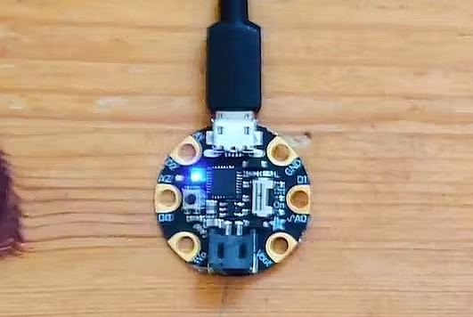](https://www.hackster.io/andreas-motzek/complex-behaving-hardware-with-circuitpython-part-i-d45e27)

Complex behaving Hardware with CircuitPython, a three part series by Andreas Motzek - [hackster.io](https://www.hackster.io/andreas-motzek/complex-behaving-hardware-with-circuitpython-part-i-d45e27), [Part 2](https://www.hackster.io/andreas-motzek/complex-behaving-hardware-with-circuitpython-part-ii-760166), and [Part 3](https://www.hackster.io/andreas-motzek/complex-behaving-hardware-with-circuitpython-part-iii-5953b9).

[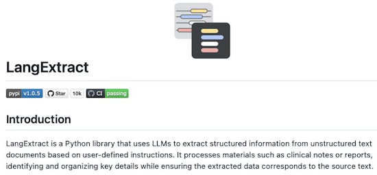](https://github.com/google/langextract)

LangExtract is a Python library that uses LLMs to extract structured information from unstructured text documents based on user-defined instructions. It processes materials such as clinical notes or reports, identifying and organizing key details while ensuring the extracted data corresponds to the source text - [GitHub](https://github.com/google/langextract). Via [X](https://x.com/Sumanth_077/status/1955630062705033474).

[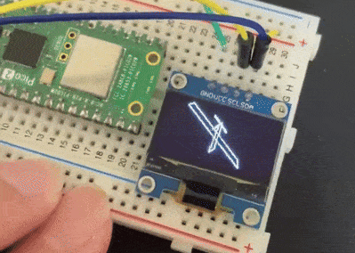](https://x.com/sozoraemon/status/1955223795410837962)

Displaying a rotating airplane on the Raspberry Pi Pico 2 W with MicroPython - [X](https://x.com/sozoraemon/status/1955223795410837962).

[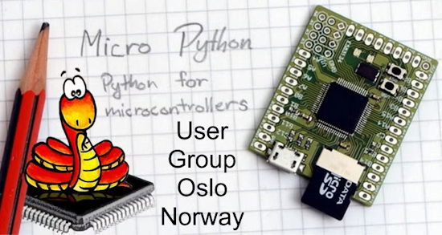](https://www.meetup.com/bitraf/events/310423321/)

The MicroPython / CircuitPython / Python for hardware usergroup, Oslo Norway. The next meeting is September 9th at Bitraf, Brenneriveien 9 - [Meetup](https://www.meetup.com/bitraf/events/310423321/).

Equipment you need to get started as an embedded engineer - [Makerio on X](https://x.com/MakerIO/status/1955309097135255697).

[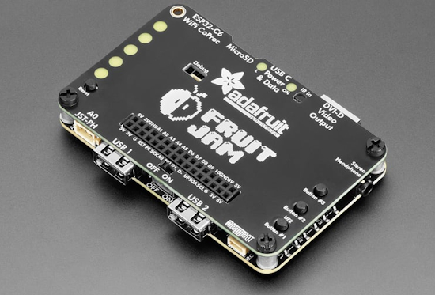](https://www.electronicsweekly.com/news/products/bus-systems-sbcs/rp2350-dev-board-drives-displays-2025-08/)

Adafruit has created a dev board for the Raspberry Pi RP2350 microcontroller that can drive a DVI display, handle a keyboard and has WiFi - [Electronics Weekly](https://www.electronicsweekly.com/news/products/bus-systems-sbcs/rp2350-dev-board-drives-displays-2025-08/).

Why Python developers are switching to UV instead of using pip - [YouTube](https://www.youtube.com/watch?v=5rTwOt9Qgik).

Preparing BMPs with free GIMP software for CircuitPython use (CircuitPython School) - [YouTube](https://www.youtube.com/watch?v=HSeee0NZ9uk).

Improve images for LED display with gamma correction (CircuitPython School) - [YouTube](https://www.youtube.com/watch?v=wOXB2eQ2YD0).

[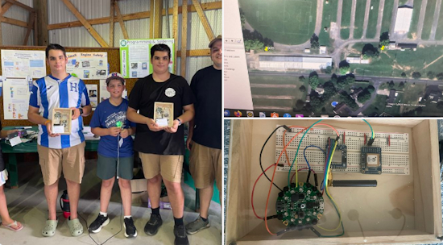](https://x.com/evm_sec/status/1955994536255103157)

Demonstrating a new 4H programming project: GPS/LORA trackers using Adafruit CircuitPython at a county fair this week. "(We) got a voltage dropout issue we need to debug but thanks to excellent Adafruit support we’ve got a plan, hoping for more demos tonight." - [X](https://x.com/evm_sec/status/1955994536255103157).

[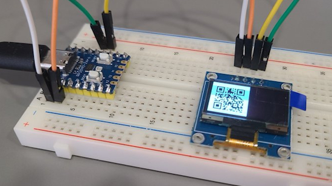](https://x.com/yossy0107/status/1955864871742136757)

Generating QR codes with MicroPython - [X](https://x.com/yossy0107/status/1955864871742136757) and [GitHub](https://github.com/JASchilz/uQR).

[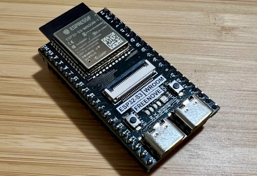](https://mikecoats.com/circuitpython-on-freenove-esp32/)

For CircuitPython Day 2025, here's how Mike Coats installed CircuitPython on an unsupported board, the Freenove ESP32-S3-WROOM CAM - [mikecoats.com](https://mikecoats.com/circuitpython-on-freenove-esp32/). Via [BlueSky](https://bsky.app/profile/mikecoats.social/post/3lwgivz4ozs2n).

[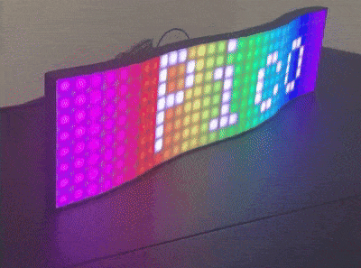](https://x.com/sozoraemon/status/1956312307283444186?s=03)

A curved LED panel powered by Raspberry Pi Pico 2 and MicroPython - [X](https://x.com/sozoraemon/status/1956312307283444186?s=03).

Develop with just a notepad! Get hands-on with microcontrollers more easily using CircuitPython - [Zenn](https://zenn.dev/nananauno/articles/34dc6b76d15335) (Japanese). Via [X](https://x.com/zenn_dev/status/1955464330226569683).

[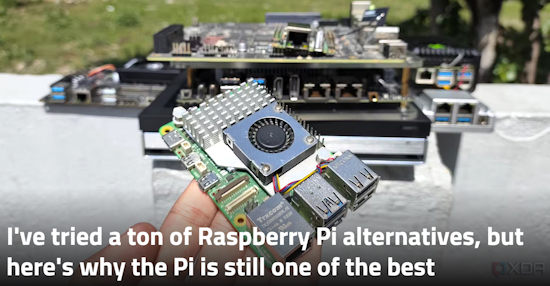](https://www.xda-developers.com/tried-ton-raspberry-pi-alternatives-why-pi-still-best/)

I've tried a ton of Raspberry Pi alternatives, but here's why the Pi is still one of the best - [XDA](https://www.xda-developers.com/tried-ton-raspberry-pi-alternatives-why-pi-still-best/).

[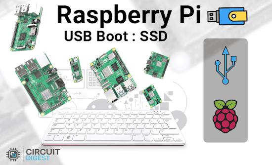](https://circuitdigest.com/tutorial/raspberry-pi-usb-boot-complete-guide)

How to boot a Raspberry Pi from USB without an SD Card - [Circuit Digest](https://circuitdigest.com/tutorial/raspberry-pi-usb-boot-complete-guide).

[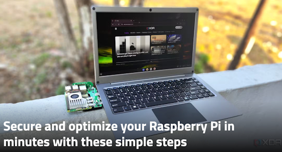](https://www.xda-developers.com/secure-optimize-raspberry-pi-minutes-simple-steps/)

Secure and optimize your Raspberry Pi in minutes with these simple steps - [XDA](https://www.xda-developers.com/secure-optimize-raspberry-pi-minutes-simple-steps/).

[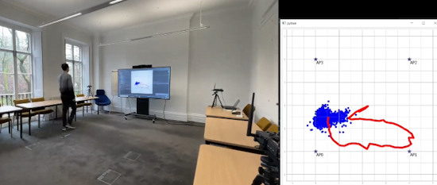](https://www.linkedin.com/posts/ugcPost-7359527306861654016-rkLc/)

Pi-RTCSI: a new software tool that transforms the on-board WiFi chip on a Raspberry Pi into a real-time sensing and localisation tool - [LinkedIn](https://www.linkedin.com/posts/ugcPost-7359527306861654016-rkLc/), [YouTube](https://www.youtube.com/watch?v=yhX8dvuif-g) and [paper](https://discovery.ucl.ac.uk/id/eprint/10203112/1/ML_Track%20Paper_accepted.pdf) (PDF).

## New

[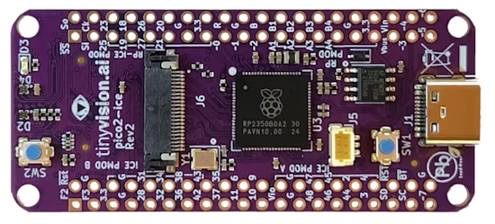](https://www.hackster.io/news/tinyvision-ai-launches-its-next-gen-pico2-ice-fpga-dev-board-now-featuring-a-raspberry-pi-rp2350b-a851fcd23a6b)

[tinyVision.ai](https://tinyvision.ai/products/raspberry-pi-pico-2-development-board-with-fpga) launches its next-gen pico2-ice FPGA development board, featuring a Raspberry Pi RP2350B. Board design files are available on [GitHub](https://github.com/tinyvision-ai-inc/pico2-ice) under the permissive MIT license - [hackster.io](https://www.hackster.io/news/tinyvision-ai-launches-its-next-gen-pico2-ice-fpga-dev-board-now-featuring-a-raspberry-pi-rp2350b-a851fcd23a6b).

[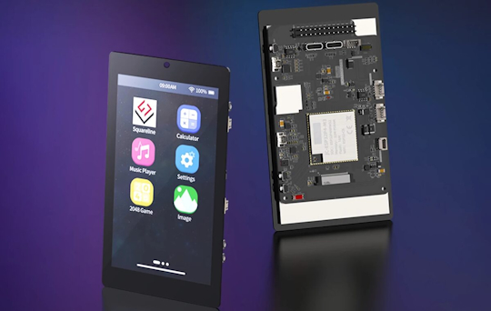](https://www.cnx-software.com/2025/08/12/4-3-inch-touch-display-board-features-single-esp32-p4-esp32-c6-module-supports-camera-and-speakers/)

The GUITION JC4880P433 is a 4.3-inch touch display board features a ESP32-P4 + ESP32-C6 module and supports camera and speakers - [CNX Software](https://www.cnx-software.com/2025/08/12/4-3-inch-touch-display-board-features-single-esp32-p4-esp32-c6-module-supports-camera-and-speakers/).

## New Boards Supported by CircuitPython

The number of supported microcontrollers and Single Board Computers (SBC) grows every week. This section outlines which boards have been included in CircuitPython or added to [CircuitPython.org](https://circuitpython.org/).

This week there were no new boards added, but there are several in the pipeline.

*Note: For non-Adafruit boards, please use the support forums of the board manufacturer for assistance, as Adafruit does not have the hardware to assist in troubleshooting.*

Looking to add a new board to CircuitPython? It's highly encouraged! Adafruit has four guides to help you do so:

- [How to Add a New Board to CircuitPython](https://learn.adafruit.com/how-to-add-a-new-board-to-circuitpython/overview)
- [How to add a New Board to the circuitpython.org website](https://learn.adafruit.com/how-to-add-a-new-board-to-the-circuitpython-org-website)
- [Adding a Single Board Computer to PlatformDetect for Blinka](https://learn.adafruit.com/adding-a-single-board-computer-to-platformdetect-for-blinka)
- [Adding a Single Board Computer to Blinka](https://learn.adafruit.com/adding-a-single-board-computer-to-blinka)

## New Learn Guides

[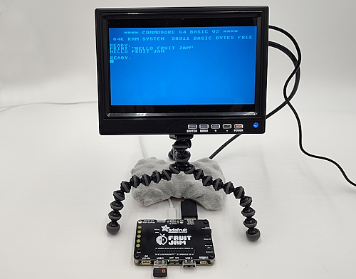](https://learn.adafruit.com/guides/latest)

The Adafruit Learning System has over 3,200 free guides for learning skills and building projects including using Python.

[MCUME Emulators on Fruit Jam](https://learn.adafruit.com/mcume-emulators-on-fruit-jam) from [Tim C](https://learn.adafruit.com/u/Foamyguy) and [Liz Clark](https://learn.adafruit.com/u/BlitzCityDIY)

[USB MIDI Keyset Controller](https://learn.adafruit.com/midi-keyset) from [Ruiz Brothers](https://learn.adafruit.com/u/pixil3d) and [Liz Clark](https://learn.adafruit.com/u/BlitzCityDIY)

[Adafruit Fruit Jam](https://learn.adafruit.com/adafruit-fruit-jam) from [Liz Clark](https://learn.adafruit.com/u/BlitzCityDIY) and [Tim C](https://learn.adafruit.com/u/Foamyguy)

[Coffee Rater](https://learn.adafruit.com/coffee-rater) from [Ben Everard](https://learn.adafruit.com/u/benev)

[Speech Synthesis On Raspberry Pi with KittenTTS](https://learn.adafruit.com/speech-synthesis-on-raspberry-pi-with-kittentts) from [Tim C](https://learn.adafruit.com/u/Foamyguy)

## Updated Learn Guides

[RP2040 RunCPM Emulator with USB Keyboard & HDMI screen](https://learn.adafruit.com/rp2040-runcpm-emulator-with-usb-keyboard-hdmi-screen/overview) (Fruit Jam added)

## CircuitPython Libraries

The CircuitPython library numbers are continually increasing, while existing ones continue to be updated. Here we provide library numbers and updates!

To get the latest Adafruit libraries, download the [Adafruit CircuitPython Library Bundle](https://circuitpython.org/libraries). To get the latest community contributed libraries, download the [CircuitPython Community Bundle](https://circuitpython.org/libraries).

If you'd like to contribute to the CircuitPython project on the Python side of things, the libraries are a great place to start. Check out the [CircuitPython.org Contributing page](https://circuitpython.org/contributing). If you're interested in reviewing, check out Open Pull Requests. If you'd like to contribute code or documentation, check out Open Issues. We have a guide on [contributing to CircuitPython with Git and GitHub](https://learn.adafruit.com/contribute-to-circuitpython-with-git-and-github), and you can find us in the #help-with-circuitpython and #circuitpython-dev channels on the [Adafruit Discord](https://adafru.it/discord).

You can check out this [list of all the Adafruit CircuitPython libraries and drivers available](https://github.com/adafruit/Adafruit_CircuitPython_Bundle/blob/master/circuitpython_library_list.md). 

The current number of CircuitPython libraries is **536**!

**New Libraries**

Here are this week's new CircuitPython libraries:

  * [adafruit/Adafruit_CircuitPython_QMC5883P](https://github.com/adafruit/Adafruit_CircuitPython_QMC5883P)

**Updated Libraries**

Here are this week's updated CircuitPython libraries:

  * [adafruit/Adafruit_CircuitPython_PortalBase](https://github.com/adafruit/Adafruit_CircuitPython_PortalBase)

## What’s the CircuitPython team up to this week?

What is the team up to this week? Let’s check in:

**Tim**

This week I stepped outside of CircuitPython land a little. I worked on a CPython guide for using the new KittenTTS speech synthesis module on a Raspberry Pi. I also did a guide this week for the MCUME emulators on Fruit Jam which is a C/arduino project that has C64, VIC-20, and GameBoy emulators that are compatible with Fruit Jam hardware. After those I got back into CircuitPython stuff working on changing the Fruit Jam OS build script to try to resolve an issue that is causing it to lag a few days behind getting the latest version of apps from the Learn system.

**Scott**

This week I've stalled out on epaper work. I couldn't get the 2.66" e-paper displays working and then the partial display update stuff confused me. So, I'm switching gears to looking at the ESP32-P4. I've been excited for it since I got the newest version of the chip.

**Liz**

This week I wrote a CircuitPython driver for the QMC5883 magnetometer and [published a guide](https://learn.adafruit.com/adafruit-qmc5883p-triple-axis-magnetometer) for the breakout. I've also been documenting some emulators for the Fruit Jam, including the [pico-mac emulator](https://learn.adafruit.com/fruit-jam-mac-emulator) and an update to jepler's [RunCPM emulator project](https://learn.adafruit.com/rp2040-runcpm-emulator-with-usb-keyboard-hdmi-screen/runcpm-on-the-fruit-jam).

The other big focus has been CircuitPython Day. When you read this, the day will be over, but I've been meeting with folks to record their sessions and get graphics and music set. Big thanks to everyone who helped out and participated.

I'm going to be on vacation for the next two weeks so I'll be recharged for more projects coming up.

## Upcoming Events

The next MicroPython Meetup in Melbourne will be on August 27th – [Meetup](https://www.meetup.com/micropython-meetup/events). You can see recordings of previous meetings on [YouTube](https://www.youtube.com/@MicroPythonOfficial). 

KiCad conferences (KiCon) to be held this year include 19 - 20 Sept 2024 in Bochum, Germany, and 14 - 15 November, 2025 in Shenzhen, China - [KiCad](https://kicon.kicad.org/).

PyCon UK will be at CONTACT in Manchester from Friday 19th September to Monday 22nd September 2025 - [PyCon UK 2025](https://2025.pyconuk.org/).

Maker Faire Bay Area 2025 will be Sep 26 – 28, 2025 in Vallejo, California, US - [Maker Faire](https://bayarea.makerfaire.com/).

PyLadiesCon returns December 5–7, 2025. 100% online conference designed for our global community. Talks, workshops, panels, and community fun – [PyLadies](https://conference.pyladies.com/2025-pyladiescon-is-back/).

**Send Your Events In**

If you know of virtual events or upcoming events, please let us know via email to cpnews(at)adafruit(dot)com.

## Latest Releases

CircuitPython's stable release is [9.2.8](https://github.com/adafruit/circuitpython/releases/latest) and its unstable release is [10.0.0-beta.2](https://github.com/adafruit/circuitpython/releases). New to CircuitPython? Start with our [Welcome to CircuitPython Guide](https://learn.adafruit.com/welcome-to-circuitpython).

[20250810](https://github.com/adafruit/Adafruit_CircuitPython_Bundle/releases/latest) is the latest Adafruit CircuitPython library bundle.

[20250805](https://github.com/adafruit/CircuitPython_Community_Bundle/releases/latest) is the latest CircuitPython Community library bundle.

[v1.26.0](https://micropython.org/download) is the latest MicroPython release. Documentation for it is [here](http://docs.micropython.org/en/latest/pyboard/).

[3.13.7](https://www.python.org/downloads/) is the latest Python release. The latest pre-release version is [3.14.0rc2](https://www.python.org/download/pre-releases/).

[4,318 Stars](https://github.com/adafruit/circuitpython/stargazers) Like CircuitPython? [Star it on GitHub!](https://github.com/adafruit/circuitpython)

## Call for Help -- Translating CircuitPython is now easier than ever

[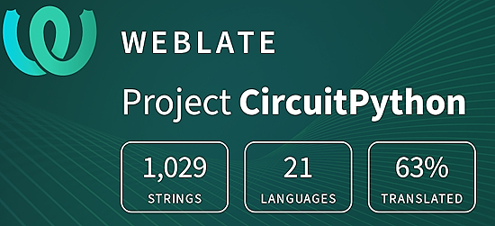](https://hosted.weblate.org/engage/circuitpython/)

One important feature of CircuitPython is translated control and error messages. With the help of fellow open source project [Weblate](https://weblate.org/), we're making it even easier to add or improve translations. 

Sign in with an existing account such as GitHub, Google or Facebook and start contributing through a simple web interface. No forks or pull requests needed! As always, if you run into trouble join us on [Discord](https://adafru.it/discord), we're here to help.

## 39,049 Thanks

The Adafruit Discord community, where we do all our CircuitPython development in the open, reached over 39,049 humans - thank you! Adafruit believes Discord offers a unique way for Python on hardware folks to connect. Join today at [https://adafru.it/discord](https://adafru.it/discord).

## ICYMI - In case you missed it

Python on hardware is the Adafruit Python video-newsletter-podcast! The news comes from the Python community, Discord, Adafruit communities and more and is broadcast on ASK an ENGINEER Wednesdays. The complete Python on Hardware weekly videocast [playlist is here](https://www.youtube.com/playlist?list=PLjF7R1fz_OOXRMjM7Sm0J2Xt6H81TdDev). The video podcast is on [iTunes](https://itunes.apple.com/us/podcast/python-on-hardware/id1451685192?mt=2), [YouTube](http://adafru.it/pohepisodes), [Instagram](https://www.instagram.com/adafruit/channel/)), and [XML](https://itunes.apple.com/us/podcast/python-on-hardware/id1451685192?mt=2).

[The weekly community chat on Adafruit Discord server CircuitPython channel - Audio / Podcast edition](https://itunes.apple.com/us/podcast/circuitpython-weekly-meeting/id1451685016) - Audio from the Discord chat space for CircuitPython, meetings are usually Mondays at 2pm ET, this is the audio version on [iTunes](https://itunes.apple.com/us/podcast/circuitpython-weekly-meeting/id1451685016), Pocket Casts, [Spotify](https://adafru.it/spotify), and [XML feed](https://adafruit-podcasts.s3.amazonaws.com/circuitpython_weekly_meeting/audio-podcast.xml).

## Contribute

The CircuitPython Weekly Newsletter is a CircuitPython community-run newsletter emailed every Monday. The complete [archives are here](https://www.adafruitdaily.com/category/circuitpython/). It highlights the latest CircuitPython related news from around the web including Python and MicroPython developments. To contribute, edit next week's draft [on GitHub](https://github.com/adafruit/circuitpython-weekly-newsletter/tree/gh-pages/_drafts) and [submit a pull request](https://help.github.com/articles/editing-files-in-your-repository/) with the changes. You may also tag your information on Twitter with #CircuitPython. 

Join the Adafruit [Discord](https://adafru.it/discord) or [post to the forum](https://forums.adafruit.com/viewforum.php?f=60) if you have questions.
