- [ ] Library and info updates
- [ ] change date
- [ ] update title
- [ ] Feature story
- [ ] Update  for images
- [ ] Update ICYDNCI
- [ ] All images 550w max only
- [ ] Link "View this email in your browser."

News Sources

- [Adafruit Playground](https://adafruit-playground.com/)
- Twitter: [CircuitPython](https://twitter.com/search?q=circuitpython&src=typed_query&f=live), [MicroPython](https://twitter.com/search?q=micropython&src=typed_query&f=live) and [Python](https://twitter.com/search?q=python&src=typed_query)
- [Raspberry Pi News](https://www.raspberrypi.com/news/)
- Mastodon [CircuitPython](https://mastodon.social/tags/CircuitPython) and [MicroPython](https://mastodon.social/tags/MicroPython)
- [hackster.io CircuitPython](https://www.hackster.io/search?q=circuitpython&i=projects&sort_by=most_recent) and [MicroPython](https://www.hackster.io/search?q=micropython&i=projects&sort_by=most_recent)
- YouTube: [CircuitPython](https://www.youtube.com/results?search_query=circuitpython&sp=CAI%253D), [MicroPython](https://www.youtube.com/results?search_query=micropython&sp=CAI%253D), [Prof Gallaugher](https://www.youtube.com/@BuildWithProfG/videos), [Teacher Brogan M. Pratt CircuitPython](https://www.youtube.com/playlist?list=PLRHdgFNRLyaN6eCw8b0yoHKDY9B4GiirU)
- [Google News Python](https://news.google.com/topics/CAAqIQgKIhtDQkFTRGdvSUwyMHZNRFY2TVY4U0FtVnVLQUFQAQ?hl=en-US&gl=US&ceid=US%3Aen)
- [maker.io Python](https://www.digikey.com/en/maker/search-results?t=python)
- Instructables: [CircuitPython](https://www.instructables.com/search/?q=circuitpython&projects=all&sort=Newest), [MicroPython](https://www.instructables.com/search/?q=micropython&projects=all&sort=Newest), [Raspberry Pi Python](https://www.instructables.com/search/?q=raspberry+pi+python&projects=all&sort=Newest)
- [hackaday CircuitPython](https://hackaday.com/blog/?s=circuitpython) and [MicroPython](https://hackaday.com/blog/?s=micropython)
- [python.org](https://www.python.org/)
- [Python Insider - dev team blog](https://pythoninsider.blogspot.com/)
- Individuals: [Jeff Geerling](https://www.jeffgeerling.com/blog), [Yakroo](https://x.com/Yakroo5077)
- Tom's Hardware: [CircuitPython](https://www.tomshardware.com/search?searchTerm=circuitpython&articleType=all&sortBy=publishedDate) and [MicroPython](https://www.tomshardware.com/search?searchTerm=micropython&articleType=all&sortBy=publishedDate) and [Raspberry Pi](https://www.tomshardware.com/search?searchTerm=raspberry%20pi&articleType=all&sortBy=publishedDate)
- [hackaday.io newest projects MicroPython](https://hackaday.io/projects?tag=micropython&sort=date) and [CircuitPython](https://hackaday.io/projects?tag=circuitpython&sort=date)
- hackaday.io - [CircuitPython](https://hackaday.io/search?term=circuitpython) and [MicroPython](https://hackaday.io/search?term=micropython)

View this email in your browser. **Warning: Flashing Imagery**

Welcome to the latest Python on Microcontrollers newsletter! *insert 2-3 sentences from editor (what's in overview, banter)* - *Anne Barela, Editor*

We're on [Discord](https://discord.gg/HYqvREz), [Twitter/X](https://twitter.com/search?q=circuitpython&src=typed_query&f=live), [BlueSky](https://bsky.app/profile/circuitpython.org) and for past newsletters - [view them all here](https://www.adafruitdaily.com/category/circuitpython/). If you're reading this on the web, please [subscribe here](https://www.adafruitdaily.com/). Here's the news this week:

## Headline

text - [site](url).

## Feature

text - [site](url).

## KiCanvas: View KiCad Files in a Browser

[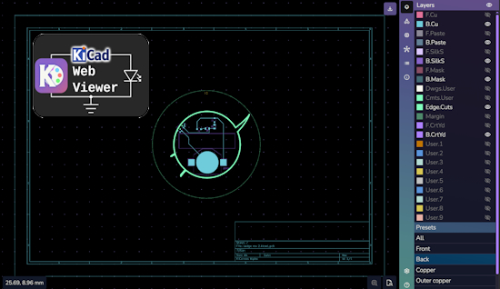](https://kicanvas.org/)

KiCanvas by Thea Flowers is an open-source, interactive, browser-based viewer for KiCAD schematics and boards. Not only can you view files from your computer or GitHub links, but it is also designed to be embedded in a web page so you can use it to directly reference your KiCAD files in online documentation. The embed-ability greatly simplifies documentation management since it saves the hassle of exporting images after every revision.  - [kicanvas.org](https://kicanvas.org/) and [GitHub](https://github.com/theacodes/kicanvas). Via [LinkedIn](https://www.linkedin.com/posts/gsteiert_opensource-kicad-schematic-activity-7362536125153882112-QYkm/).

## The New 5″ Raspberry Pi Touch Display 2

[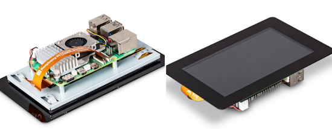](https://www.raspberrypi.com/news/a-new-5-variant-of-raspberry-pi-touch-display-2/)

Raspberry Pi announced a new 5 inch Display 2 variant, 720 (RGB) × 1280 pixels, available to buy now from Raspberry Pi [Approved Resellers](https://www.raspberrypi.com/products/touch-display-2/) at the same $40 price point as 7 inch displays - [Raspberry Pi News](https://www.raspberrypi.com/news/a-new-5-variant-of-raspberry-pi-touch-display-2/).

## The JetBrains State of Python 2025 Survey Results

[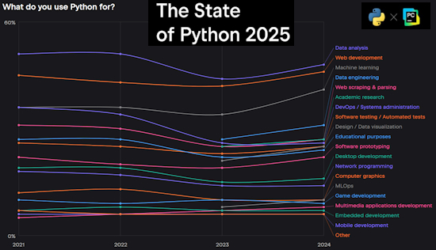](https://lp.jetbrains.com/python-developers-survey-2024/)

The results of the eighth annual Python Developers Survey, conducted as a collaborative effort between the Python Software Foundation and JetBrains PyCharm is available. 30,000 Python developers and enthusiasts from almost 200 countries and regions took part to illuminate the current state of the language and its ecosystem. It looks like embedded developemnt is about the same as last year - [JetBrains](https://lp.jetbrains.com/python-developers-survey-2024/). Via [X](https://bsky.app/profile/pycharm.dev).

Python survey shows growth even as Foundation funding falters - [The Register](https://www.theregister.com/2025/08/19/python_survey/).

## Free eBook: MIT's Structure and Interpretation of Computer Programs

[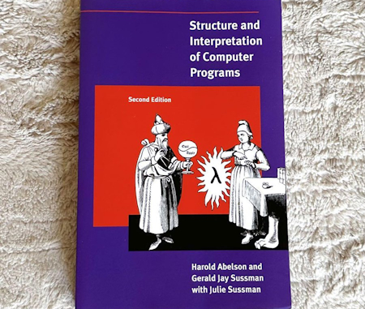](https://web.mit.edu/6.001/6.037/sicp.pdf)

One of the most influential programming textbooks was first published as a paperback 40 years ago today: MIT's "Structure and Interpretation of Computer Programs." Now you can read it for free - [mit.edu](https://web.mit.edu/6.001/6.037/sicp.pdf) (PDF). Via [X](https://x.com/MIT_CSAIL/status/1958559972251377767).

## This Week's Python Streams

Python on Hardware is all about building a cooperative ecosphere which allows contributions to be valued and to grow knowledge. Below are the streams within the last week focusing on the community.

**CircuitPython Deep Dive Stream**

[Last Friday](link), Tim streamed work on {subject}.

You can see the latest video and past videos on the Adafruit YouTube channel under the Deep Dive playlist - [YouTube](https://www.youtube.com/playlist?list=PLjF7R1fz_OOXBHlu9msoXq2jQN4JpCk8A).

**CircuitPython Parsec**

John Park’s CircuitPython Parsec this week is on {subject} - [Adafruit Blog](link) and [YouTube](link).

Catch all the episodes in the [YouTube playlist](https://www.youtube.com/playlist?list=PLjF7R1fz_OOWFqZfqW9jlvQSIUmwn9lWr).

## Project of the Week: Centauri: Multi-MCU Quadcopter Flight Controller

[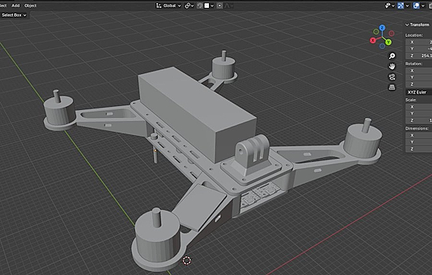](https://github.com/TimHanewich/centauri/)

Tim Hanewich has been designing a follow-on to a previous quadcopter flight controller named [Scout](https://github.com/TimHanewich/scout). The new version, Centauri, uses multiple microcontrollers and the code is written in 100% Python (MicroPython on device). He's documenting development on [X](https://x.com/TimHanewich) - [GitHub](https://github.com/TimHanewich/centauri/).

## Popular Last Week

What was the most popular, most clicked link, in [last week's newsletter](https://www.adafruitdaily.com/2025/08/18/python-on-microcontrollers-newsletter-circuitpython-python-micropython-thepsf-raspberry_pi-2/)? [GitHub folds into Microsoft following CEO resignation — once independent programming site now part of 'CoreAI' team](https://www.tomshardware.com/software/programming/github-folds-into-microsoft-following-ceo-resignation-once-independent-programming-site-now-part-of-coreai-team).

Did you know you can read past issues of this newsletter in the Adafruit Daily Archive? [Check it out](https://www.adafruitdaily.com/category/circuitpython/).

## New Notes from Adafruit Playground

[Adafruit Playground](https://adafruit-playground.com/) is a new place for the community to post their projects and other making tips/tricks/techniques. Ad-free, it's an easy way to publish your work in a safe space for free.

[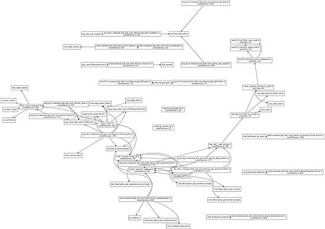](https://adafruit-playground.com/u/SamBlenny/pages/circuitpython-core-dev-debug-tricks)

CircuitPython Core Dev & Debug Tricks - [Adafruit Playground](https://adafruit-playground.com/u/SamBlenny/pages/circuitpython-core-dev-debug-tricks).

text - [Adafruit Playground](url).

text - [Adafruit Playground](url).

## News From Around the Web

[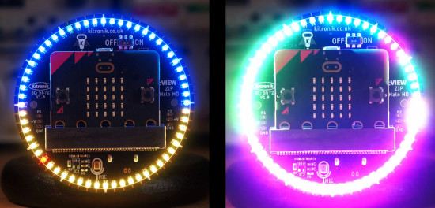](https://kevinjwalters.medium.com/debugging-rare-rgb-led-glitches-in-micropython-on-bbc-micro-bit-ed2ab468d192)

A detailed account (part 1/2) of troubleshooting some mysterious visual glitches on the RGB ZIP LEDs (like NeoPixels) on a Kitronik Zip Halo HD controlled by a MicroPython program running on a BBC micro:bit V2 including getting the best use out of a low-end logic analyzer and the micro:bit itself to aid the process - [Medium.com](https://kevinjwalters.medium.com/debugging-rare-rgb-led-glitches-in-micropython-on-bbc-micro-bit-ed2ab468d192).

Another detailed account (part 2/2) of fixing the bugs in the micro:bit V2 port of MicroPython relating to WS2812B protocol generation using the nRF52 (internal) PWM peripheral including some background on Cortex ARM interrupts and the use of [Visual Studio Code for remote debugging](https://www.instructables.com/Setting-Up-Visual-Studio-Code-to-Compile-and-Debug/) - [Medium.com](https://kevinjwalters.medium.com/everything-you-always-wanted-to-know-about-debugging-the-nordic-nrf52-pwm-peripheral-and-cortex-arm-9be8fbf327e5).

[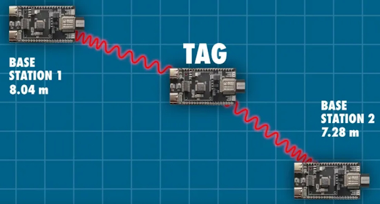](url)

Getting started with ultra-wideband (UWB) and measuring distances with Raspberry Pi Pico + MicroPython & Arduino guide - [Core Electronics](https://core-electronics.com.au/guides/sensors/getting-started-with-ultra-wideband-and-measuring-distances-arduino-and-pico-guide/) and [YouTube](https://youtu.be/fpTaFBbadyE). Via [Hackaday](https://hackaday.com/2025/08/19/using-ultra-wideband-for-3d-location-and-tracking/).

Rust: Python’s New Performance Engine - [The New Stack](https://thenewstack.io/rust-pythons-new-performance-engine/).

[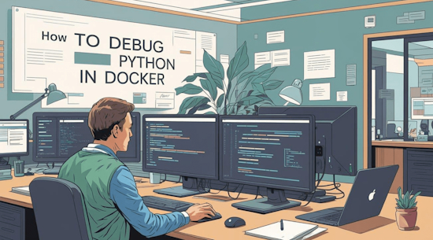](https://www.kdnuggets.com/debugging-python-in-docker-a-tutorial-for-beginners)

Debugging Python in Docker: a tutorial for beginners - [KDNuggets](https://www.kdnuggets.com/debugging-python-in-docker-a-tutorial-for-beginners).

A version of "frogger" (with a bit of imagination) on Picopad in CircuitPython - [X](https://x.com/MakerClassCZ/status/1958614866543223184) (Czech).

[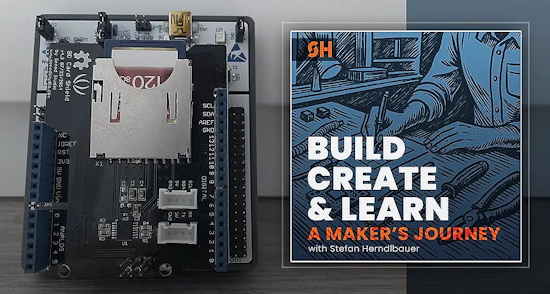](https://herndlbauer.com/blog/a-makers-journey-podcast-episode-4/)

New Podcast Episode! "After weeks of failing at SD card logging on my STM32, I made a bold pivot: switching to CircuitPython on the RP2040 for my DIY drone telemetry project" - [herndlbauer.com](https://herndlbauer.com/blog/a-makers-journey-podcast-episode-4/). Via [X](https://x.com/herndlbauer/status/1957737159781195991).

text - [site](url).

text - [site](url).

text - [site](url).

text - [site](url).

7 surprisingly useful Python scripts you’ll use every week - [KDnuggets](https://www.kdnuggets.com/7-surprisingly-useful-python-scripts-youll-use-every-week).

text - [site](url).

text - [site](url).

text - [site](url).

text - [site](url).

Agentic AI Hands-On in Python: a video tutorial recently recorded from an ODSC talk and made broadly available by its creators - [KDNuggets](https://www.kdnuggets.com/agentic-ai-hands-on-in-python-a-video-tutorial) and [YouTube](https://www.kdnuggets.com/agentic-ai-hands-on-in-python-a-video-tutorial).

text - [site](url).

## New

[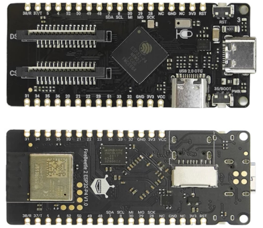](https://x.com/dfrobotcn/status/1957971568283267291)

DFRobot FireBeetle 2 ESP32-P4 AI Vision Board - 360MHz ESP32-P4 RISC-V, MIPI CSI/DSI, WiFi 6, built-in mic - [X](https://x.com/dfrobotcn/status/1957971568283267291).

text - [site](url).

## New Boards Supported by CircuitPython

The number of supported microcontrollers and Single Board Computers (SBC) grows every week. This section outlines which boards have been included in CircuitPython or added to [CircuitPython.org](https://circuitpython.org/).

This week there were (#/no) new boards added:

- [Board name](url)
- [Board name](url)
- [Board name](url)

*Note: For non-Adafruit boards, please use the support forums of the board manufacturer for assistance, as Adafruit does not have the hardware to assist in troubleshooting.*

Looking to add a new board to CircuitPython? It's highly encouraged! Adafruit has four guides to help you do so:

- [How to Add a New Board to CircuitPython](https://learn.adafruit.com/how-to-add-a-new-board-to-circuitpython/overview)
- [How to add a New Board to the circuitpython.org website](https://learn.adafruit.com/how-to-add-a-new-board-to-the-circuitpython-org-website)
- [Adding a Single Board Computer to PlatformDetect for Blinka](https://learn.adafruit.com/adding-a-single-board-computer-to-platformdetect-for-blinka)
- [Adding a Single Board Computer to Blinka](https://learn.adafruit.com/adding-a-single-board-computer-to-blinka)

## New Learn Guides

[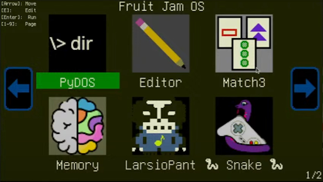](https://learn.adafruit.com/guides/latest)

The Adafruit Learning System has over 3,200 free guides for learning skills and building projects including using Python.

[Fruit Jam OS](https://github.com/adafruit/Fruit-Jam-OS) is under heavy development by the community. If you'd like to participate, check out the Adafruit [Discord](https://adafru.it/discord) and [GitHub](https://github.com/adafruit/Fruit-Jam-OS).

[title](url) from [name](url)

[title](url) from [name](url)

## Updated Learn Guides

[title](url)

## CircuitPython Libraries

The CircuitPython library numbers are continually increasing, while existing ones continue to be updated. Here we provide library numbers and updates!

To get the latest Adafruit libraries, download the [Adafruit CircuitPython Library Bundle](https://circuitpython.org/libraries). To get the latest community contributed libraries, download the [CircuitPython Community Bundle](https://circuitpython.org/libraries).

If you'd like to contribute to the CircuitPython project on the Python side of things, the libraries are a great place to start. Check out the [CircuitPython.org Contributing page](https://circuitpython.org/contributing). If you're interested in reviewing, check out Open Pull Requests. If you'd like to contribute code or documentation, check out Open Issues. We have a guide on [contributing to CircuitPython with Git and GitHub](https://learn.adafruit.com/contribute-to-circuitpython-with-git-and-github), and you can find us in the #help-with-circuitpython and #circuitpython-dev channels on the [Adafruit Discord](https://adafru.it/discord).

You can check out this [list of all the Adafruit CircuitPython libraries and drivers available](https://github.com/adafruit/Adafruit_CircuitPython_Bundle/blob/master/circuitpython_library_list.md). 

The current number of CircuitPython libraries is **###**!

**New Libraries**

Here are this week's new CircuitPython libraries:

* [library](url)

**Updated Libraries**

Here are this week's updated CircuitPython libraries:

* [library](url)

## What’s the CircuitPython team up to this week?

What is the team up to this week? Let’s check in:

**Dan**

text.

**Tim**

This week I wrote a few of the guide pages for the NeoPot poroduct guide. I've also been continuing to review many PRs submitted by the community with improvements to Fruit Jam OS and the apps within it. I worked on simplifying the volume API in the Fruit Jam library as well since the DAC supports so many different ways to control volume. We put a customizable limit mechanism in it as well to try to help prevent small speakers from getting blown out.

**Scott**

text.

## Upcoming Events

[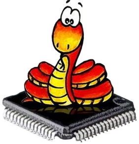](https://www.meetup.com/MicroPython-Meetup/)

The next MicroPython Meetup in Melbourne will be on August 27th – [Meetup](https://www.meetup.com/micropython-meetup/events). You can see recordings of previous meetings on [YouTube](https://www.youtube.com/@MicroPythonOfficial). 

KiCad conferences (KiCon) to be held this year include 19 - 20 Sept 2024 in Bochum, Germany, and 14 - 15 November, 2025 in Shenzhen, China - [KiCad](https://kicon.kicad.org/).

PyCon UK will be at CONTACT in Manchester from Friday 19th September to Monday 22nd September 2025 - [PyCon UK 2025](https://2025.pyconuk.org/).

Maker Faire Bay Area 2025 will be Sep 26 – 28, 2025 in Vallejo, California, US - [Maker Faire](https://bayarea.makerfaire.com/).

PyLadiesCon returns December 5–7, 2025. 100% online conference designed for our global community. Talks, workshops, panels, and community fun – [PyLadies](https://conference.pyladies.com/2025-pyladiescon-is-back/).

**Send Your Events In**

If you know of virtual events or upcoming events, please let us know via email to cpnews(at)adafruit(dot)com.

## Latest Releases

CircuitPython's stable release is [#.#.#](https://github.com/adafruit/circuitpython/releases/latest) and its unstable release is [#.#.#-##.#](https://github.com/adafruit/circuitpython/releases). New to CircuitPython? Start with our [Welcome to CircuitPython Guide](https://learn.adafruit.com/welcome-to-circuitpython).

[2025####](https://github.com/adafruit/Adafruit_CircuitPython_Bundle/releases/latest) is the latest Adafruit CircuitPython library bundle.

[2025####](https://github.com/adafruit/CircuitPython_Community_Bundle/releases/latest) is the latest CircuitPython Community library bundle.

[v#.#.#](https://micropython.org/download) is the latest MicroPython release. Documentation for it is [here](http://docs.micropython.org/en/latest/pyboard/).

[#.#.#](https://www.python.org/downloads/) is the latest Python release. The latest pre-release version is [#.#.#](https://www.python.org/download/pre-releases/).

[#,### Stars](https://github.com/adafruit/circuitpython/stargazers) Like CircuitPython? [Star it on GitHub!](https://github.com/adafruit/circuitpython)

## Call for Help -- Translating CircuitPython is now easier than ever

[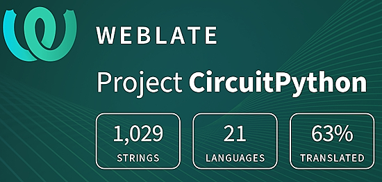](https://hosted.weblate.org/engage/circuitpython/)

One important feature of CircuitPython is translated control and error messages. With the help of fellow open source project [Weblate](https://weblate.org/), we're making it even easier to add or improve translations. 

Sign in with an existing account such as GitHub, Google or Facebook and start contributing through a simple web interface. No forks or pull requests needed! As always, if you run into trouble join us on [Discord](https://adafru.it/discord), we're here to help.

## NUMBER Thanks

The Adafruit Discord community, where we do all our CircuitPython development in the open, reached over NUMBER humans - thank you! Adafruit believes Discord offers a unique way for Python on hardware folks to connect. Join today at [https://adafru.it/discord](https://adafru.it/discord).

## ICYMI - In case you missed it

Python on hardware is the Adafruit Python video-newsletter-podcast! The news comes from the Python community, Discord, Adafruit communities and more and is broadcast on ASK an ENGINEER Wednesdays. The complete Python on Hardware weekly videocast [playlist is here](https://www.youtube.com/playlist?list=PLjF7R1fz_OOXRMjM7Sm0J2Xt6H81TdDev). The video podcast is on [iTunes](https://itunes.apple.com/us/podcast/python-on-hardware/id1451685192?mt=2), [YouTube](http://adafru.it/pohepisodes), [Instagram](https://www.instagram.com/adafruit/channel/)), and [XML](https://itunes.apple.com/us/podcast/python-on-hardware/id1451685192?mt=2).

[The weekly community chat on Adafruit Discord server CircuitPython channel - Audio / Podcast edition](https://itunes.apple.com/us/podcast/circuitpython-weekly-meeting/id1451685016) - Audio from the Discord chat space for CircuitPython, meetings are usually Mondays at 2pm ET, this is the audio version on [iTunes](https://itunes.apple.com/us/podcast/circuitpython-weekly-meeting/id1451685016), Pocket Casts, [Spotify](https://adafru.it/spotify), and [XML feed](https://adafruit-podcasts.s3.amazonaws.com/circuitpython_weekly_meeting/audio-podcast.xml).

## Contribute

The CircuitPython Weekly Newsletter is a CircuitPython community-run newsletter emailed every Monday. The complete [archives are here](https://www.adafruitdaily.com/category/circuitpython/). It highlights the latest CircuitPython related news from around the web including Python and MicroPython developments. To contribute, edit next week's draft [on GitHub](https://github.com/adafruit/circuitpython-weekly-newsletter/tree/gh-pages/_drafts) and [submit a pull request](https://help.github.com/articles/editing-files-in-your-repository/) with the changes. You may also tag your information on Twitter with #CircuitPython. 

Join the Adafruit [Discord](https://adafru.it/discord) or [post to the forum](https://forums.adafruit.com/viewforum.php?f=60) if you have questions.
