- [ ] Library and info updates
- [ ] change date
- [ ] update title
- [ ] Feature story
- [ ] Update  for images
- [ ] Update ICYDNCI
- [ ] All images 550w max only
- [ ] Link "View this email in your browser."

News Sources

- [Adafruit Playground](https://adafruit-playground.com/)
- Twitter: [CircuitPython](https://twitter.com/search?q=circuitpython&src=typed_query&f=live), [MicroPython](https://twitter.com/search?q=micropython&src=typed_query&f=live) and [Python](https://twitter.com/search?q=python&src=typed_query)
- [Raspberry Pi News](https://www.raspberrypi.com/news/)
- Mastodon [CircuitPython](https://mastodon.social/tags/CircuitPython) and [MicroPython](https://mastodon.social/tags/MicroPython)
- [hackster.io CircuitPython](https://www.hackster.io/search?q=circuitpython&i=projects&sort_by=most_recent) and [MicroPython](https://www.hackster.io/search?q=micropython&i=projects&sort_by=most_recent)
- YouTube: [CircuitPython](https://www.youtube.com/results?search_query=circuitpython&sp=CAI%253D), [MicroPython](https://www.youtube.com/results?search_query=micropython&sp=CAI%253D), [Prof Gallaugher](https://www.youtube.com/@BuildWithProfG/videos), [Teacher Brogan M. Pratt CircuitPython](https://www.youtube.com/playlist?list=PLRHdgFNRLyaN6eCw8b0yoHKDY9B4GiirU)
- [Google News Python](https://news.google.com/topics/CAAqIQgKIhtDQkFTRGdvSUwyMHZNRFY2TVY4U0FtVnVLQUFQAQ?hl=en-US&gl=US&ceid=US%3Aen)
- [maker.io Python](https://www.digikey.com/en/maker/search-results?t=python)
- Instructables: [CircuitPython](https://www.instructables.com/search/?q=circuitpython&projects=all&sort=Newest), [MicroPython](https://www.instructables.com/search/?q=micropython&projects=all&sort=Newest), [Raspberry Pi Python](https://www.instructables.com/search/?q=raspberry+pi+python&projects=all&sort=Newest)
- [hackaday CircuitPython](https://hackaday.com/blog/?s=circuitpython) and [MicroPython](https://hackaday.com/blog/?s=micropython)
- [python.org](https://www.python.org/)
- [Python Insider - dev team blog](https://pythoninsider.blogspot.com/)
- Individuals: [Jeff Geerling](https://www.jeffgeerling.com/blog), [Yakroo](https://x.com/Yakroo5077)
- Tom's Hardware: [CircuitPython](https://www.tomshardware.com/search?searchTerm=circuitpython&articleType=all&sortBy=publishedDate) and [MicroPython](https://www.tomshardware.com/search?searchTerm=micropython&articleType=all&sortBy=publishedDate) and [Raspberry Pi](https://www.tomshardware.com/search?searchTerm=raspberry%20pi&articleType=all&sortBy=publishedDate)
- [hackaday.io newest projects MicroPython](https://hackaday.io/projects?tag=micropython&sort=date) and [CircuitPython](https://hackaday.io/projects?tag=circuitpython&sort=date)
- hackaday.io - [CircuitPython](https://hackaday.io/search?term=circuitpython) and [MicroPython](https://hackaday.io/search?term=micropython)

View this email in your browser. **Warning: Flashing Imagery**

Welcome to the latest Python on Microcontrollers newsletter! *insert 2-3 sentences from editor (what's in overview, banter)* - *Anne Barela, Editor*

We're on [Discord](https://discord.gg/HYqvREz), [Twitter/X](https://twitter.com/search?q=circuitpython&src=typed_query&f=live), [BlueSky](https://bsky.app/profile/circuitpython.org) and for past newsletters - [view them all here](https://www.adafruitdaily.com/category/circuitpython/). If you're reading this on the web, please [subscribe here](https://www.adafruitdaily.com/). Here's the news this week:

## Special Section: Vibe Coding

Vibe coding is where developers rely on large language models (LLMs) to generate functional code from natural language prompts, treating the AI as a collaborative partner rather than a code-writing tool. The developer focuses on the high-level vision and intent, "giving into the vibes," while the AI handles the precise syntax and code structure.

Certainly there is a debate whether this approach works well or not. Here are some articles discussing the latest on the subject.

Vibe coding is creating a generation of unemployable developers - [HackerNoon](https://hackernoon.com/vibe-coding-is-creating-a-generation-of-unemployable-developers).

They don't make 'em like they used to? Older coders are more in tune with vibe coding, study claims - [TechRadar.Pro](https://www.techradar.com/pro/they-dont-make-em-like-they-used-to-older-coders-are-more-in-tune-with-vibe-coding-study-claims).

[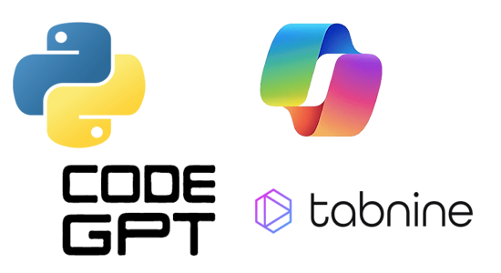](https://thenewstack.io/vibe-coding-python-testing-copilot-vs-codegpt-vs-tabnine/)

The New Stack puts three vibe coding tools to the test. Not with the goal of finding the best one, just to see how they’re different. Is one easier? Three free tools were used. The tools chosen were GitHub Copilot (obviously), CodeGPT and Tabnine. Code was written in VS Code - [The New Stack](https://thenewstack.io/vibe-coding-python-testing-copilot-vs-codegpt-vs-tabnine/).

An 8 key vibe coding keyboard using an Adafruit KB2040 and CircuitPython - [X](https://x.com/joeysywang/status/1957283482314686829). Via [Adafruit Blog](https://blog.adafruit.com/2025/08/30/8-key-vibe-coding-keyboard/).

## Starter Electronics (With CircuitPython)

[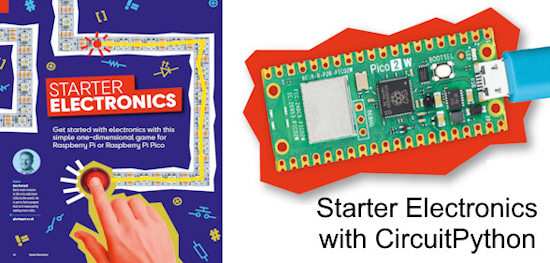](https://blog.adafruit.com/2025/09/02/the-raspberry-pi-official-magazine-issue-157-starter-electronics-rpimagazine/)

The Raspberry Pi Official Magazine, Issue 157, highlights how to get started in electronics with Raspberry Pi, both Raspberry Pi 5 and Raspberry Pi Pico 2W, using the same CircuitPython code - [Adafruit Blog](https://blog.adafruit.com/2025/09/02/the-raspberry-pi-official-magazine-issue-157-starter-electronics-rpimagazine/).

## Build a Humane Mousetrap That Emails You When It's Triggered With MicroPython

[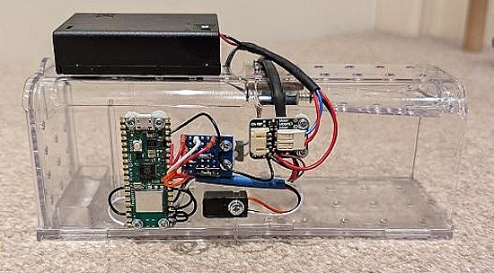](https://www.instructables.com/Build-a-Humane-Mousetrap-That-Emails-You-When-Its-/)

Build a smart mouse trap which humanely catches mice and alerts you via email, coded in MicroPython - [Instructables](https://www.instructables.com/Build-a-Humane-Mousetrap-That-Emails-You-When-Its-/).

## Reviving a 1970s Analog HP X-Y Recorder with Python

[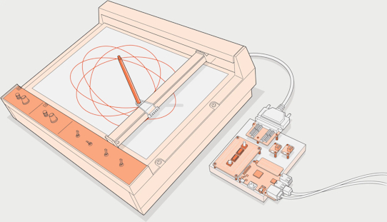](https://spectrum.ieee.org/reviving-vintage-x-y-recorder)

Stephen Cass writes about reviving an old HP 7041A X-Y recorder with a Raspberry Pi Model B+, three Adafruit DACs  and Python scripts - [IEEE Spectrum](https://spectrum.ieee.org/reviving-vintage-x-y-recorder).

> "I wrote code on the Pi to put the plotter through its paces, using parametric equations written in CircuitPython to draw swirling hypotrochoids and other geometric curves. Ultimately, it should be possible to have the Pi accept and translate commands written in a plotter-control language such as HP-GL. Then I’ll be able to plot vector graphics and text from drawing software like Inkscape."

## Researcher Unearths Thousands of Leaked Secrets in GitHub’s “Oops Commits”

Security researcher Sharon Brizinov has conducted a sweeping investigation of GitHub's "oops commits", force-pushed or deleted commits that remain archived, and uncovered thousands of secrets left behind, including high-value tokens and admin-level credentials. The team also released an open-source tool to help others scan their own repositories for such hidden leakage - [Infoq](https://www.infoq.com/news/2025/09/github-leaked-secrets/).

## This Week's Python Streams

Python on Hardware is all about building a cooperative ecosphere which allows contributions to be valued and to grow knowledge. Below are the streams within the last week focusing on the community.

**CircuitPython Deep Dive Stream**

[Last Friday](link), Tim streamed work on {subject}.

You can see the latest video and past videos on the Adafruit YouTube channel under the Deep Dive playlist - [YouTube](https://www.youtube.com/playlist?list=PLjF7R1fz_OOXBHlu9msoXq2jQN4JpCk8A).

**CircuitPython Parsec**

John Park’s CircuitPython Parsec is off this week. Catch all the episodes in the [YouTube playlist](https://www.youtube.com/playlist?list=PLjF7R1fz_OOWFqZfqW9jlvQSIUmwn9lWr).

**CircuitPython Weekly Meeting**

CircuitPython Weekly Meeting for {date} ([notes](file)) [on YouTube](link).

## Project of the Week: Busy Buttons

Busy Buttons is a 3D printed box of glowy buttons that play random sounds to entertain babies and keep them busy. It runs on an Adafruit ESP32-S2 Feather running CircuitPython - [GitHub](https://github.com/skjdghsdjgsdj/busy-buttons/). Via [Adafruit Learn Playground](https://adafruit-playground.com/u/sdkjfgjdskjlflhdsjkgf/pages/busy-buttons-noisy-glowy-buttons-for-babies-and-toddlers).

## Popular Last Week

What was the most popular, most clicked link, in [last week's newsletter](newslink)? [Python: The Documentary - An Origin Story](https://www.youtube.com/watch?v=GfH4QL4VqJ0).

Did you know you can read past issues of this newsletter in the Adafruit Daily Archive? [Check it out](https://www.adafruitdaily.com/category/circuitpython/).

## New Notes from Adafruit Playground

[Adafruit Playground](https://adafruit-playground.com/) is a new place for the community to post their projects and other making tips/tricks/techniques. Ad-free, it's an easy way to publish your work in a safe space for free.

text - [Adafruit Playground](url).

## News From Around the Web

How to use libraries in Python to do more with less code - [How-to Geek](https://www.howtogeek.com/how-to-use-libraries-in-python-to-do-more-with-less-code/).

[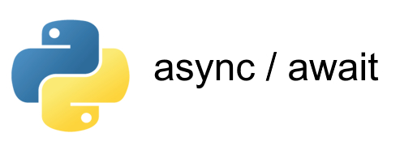](https://news.ycombinator.com/item?id=45106189)

Python has had async for 10 years – why isn't it more popular? - [HN](https://news.ycombinator.com/item?id=45106189).

[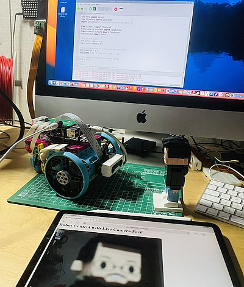](https://x.com/r_schulz_maker/status/1962578794620887252)

Roland Schulz' huge colorful MicroPython Lego robot, powered by Raspberry Pi and a Build-Hat, now has an upgrade. The robot may be controlled via a web server from any mobile device, and hasa live Pi Camera Module 3 feed - [X](https://x.com/r_schulz_maker/status/1962578794620887252).

Power an external loudspeaker and amplifier through a CircuitPlayground (CircuitPython School) - [YouTube](https://www.youtube.com/watch?v=Ozeo8l8PHTA).

[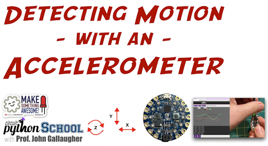](https://www.youtube.com/watch?v=PW1y0I-B_Ew)

Detect Motion with the Built in Accelerometer in CircuitPlayground boards (CircuitPython School) - [YouTube](https://www.youtube.com/watch?v=PW1y0I-B_Ew).

[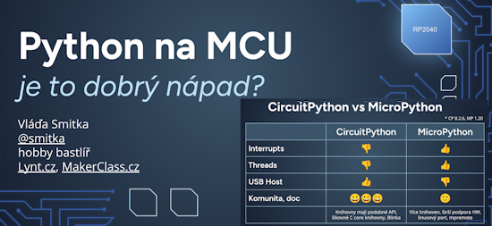](https://x.com/miklik72/status/1962582747525857531)

Maker Class held their first teaching session, "a ten-hour marathon of tinkering and I brought 7 new tinkerers into the world" using CircuitPython - [X](https://x.com/miklik72/status/1962582747525857531), [GitHub](https://github.com/MakerClassCZ/elektro101) and [Slides](https://docs.google.com/presentation/d/e/2PACX-1vS-bUOOdW9TZU03R32yoFQpBBhiEEbFBJdAwh1wVNrLdNIY5sPIpEtbjnRcPVENdWvVnPx2NuKakaPp/pub?start=false&loop=false&delayms=3000&slide=id.p) (Czech).

New stealthy Python malware leverages Discord to steal data from Windows machines - [Cyber Security News](https://cybersecuritynews.com/new-stealthy-python-malware-leverages-discord/).

[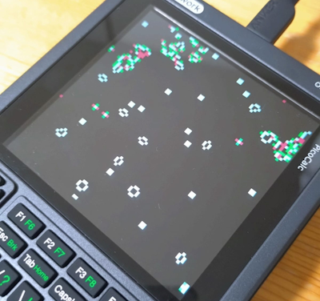](https://zenn.dev/snaga/articles/2025-08-31-picocalc-micropython)

A review of MicroPython on PicoCalc - [Zenn](https://zenn.dev/snaga/articles/2025-08-31-picocalc-micropython) (Japanese).

[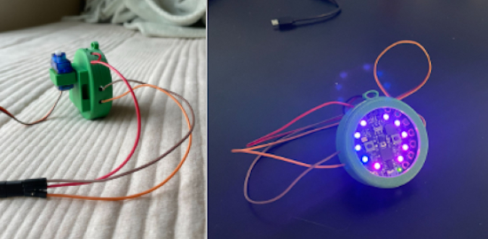](https://www.instructables.com/Party-Necklace/)

Making an LED party necklace  with a Circuit Playground Express programmed in CircuitPython - [Instructables](https://www.instructables.com/Party-Necklace/).

MicroPython and LVGL 9.3 - Creating a Custom Gauge for MPU-6050 - [YouTube](https://www.youtube.com/watch?v=3unw_nzO-Kg).

text - [Adafruit Playground](url).

[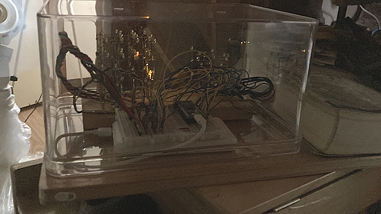](https://x.com/KLVpPJ6DfQX8iH4/status/1963482656089543100)

Two LED cubes, on the right there is a 3×3×3 LED cube, on the left, there's a 4×4×4 LED Cube (lit up), controlled by a single Raspberry Pi Pico
using MicroPython - [X](https://x.com/KLVpPJ6DfQX8iH4/status/1963482656089543100).

[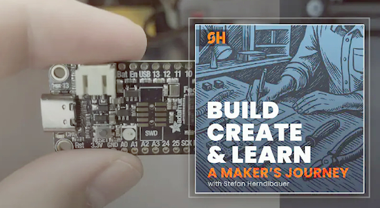](https://herndlbauer.com/blog/a-makers-journey-podcast-episode-5/)

From Zero to Flight-Ready: Logging Data with CircuitPython on the Feather RP2040 - [herndlbauer.com](https://herndlbauer.com/blog/a-makers-journey-podcast-episode-5/).

[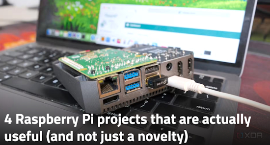](https://www.xda-developers.com/raspberry-pi-projects-useful-not-novelty/)

4 Raspberry Pi projects that are actually useful (and not just a novelty) - [XDA](https://www.xda-developers.com/raspberry-pi-projects-useful-not-novelty/).

[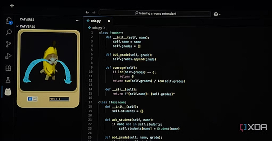](https://www.xda-developers.com/vs-code-extensions-that-react-to-your-mistakes/)

These VS Code extensions scream or make faces when you make a coding mistake, and I absolutely love them - [XDA](https://www.xda-developers.com/vs-code-extensions-that-react-to-your-mistakes/).

[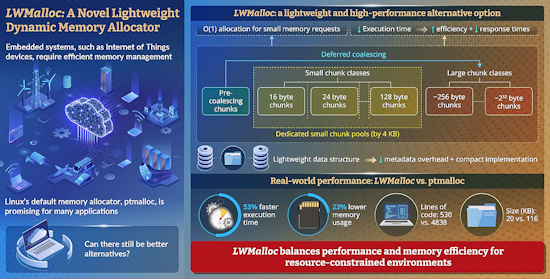](https://www.cnx-software.com/2025/09/03/lwmalloc-lightweight-dynamic-memory-allocator-for-embedded-systems/)

LWMalloc is a lightweight dynamic memory allocator for embedded systems - [CNX Software](https://www.cnx-software.com/2025/09/03/lwmalloc-lightweight-dynamic-memory-allocator-for-embedded-systems/).

[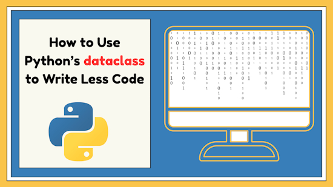](https://www.kdnuggets.com/how-to-use-pythons-dataclass-to-write-less-code)

How to use Python’s `dataclass` to write less code - [KDnuggets](https://www.kdnuggets.com/how-to-use-pythons-dataclass-to-write-less-code).

## New

[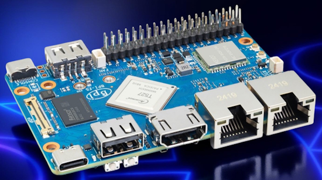](https://www.notebookcheck.net/Banana-Pi-launches-new-Raspberry-Pi-alternative-SBC-with-octa-core-ARM-CPU-and-plenty-of-connectivity.1102721.0.html)

Banana Pi BPI-F5 is a brand new SBC (single-board computer) that packs an octa-core ARM SoC, a decent NPU, 40-pin GPIO header and plenty of connectivity in a credit-card sized board - [NotebookCheck](https://www.notebookcheck.net/Banana-Pi-launches-new-Raspberry-Pi-alternative-SBC-with-octa-core-ARM-CPU-and-plenty-of-connectivity.1102721.0.html).

[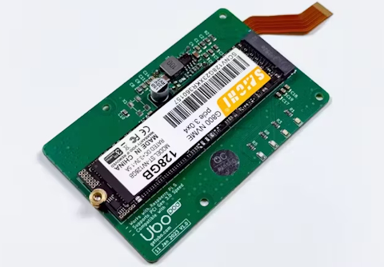](https://www.hackster.io/news/mehrdad-majzoobi-releases-an-open-hardware-pcie-m-2-adapter-board-for-the-raspberry-pi-5-9ecffa489866)

An open-hardware PCIe M.2 adapter board for the Raspberry Pi 5, Hardware Attached on the Bottom (HAB) - [hackster.io](https://www.hackster.io/news/mehrdad-majzoobi-releases-an-open-hardware-pcie-m-2-adapter-board-for-the-raspberry-pi-5-9ecffa489866), [Reddit](https://old.reddit.com/r/raspberry_pi/comments/1n7oelv/open_source_pcie_adapter_for_raspberry_pi_5/), and [GitHub](https://github.com/ubopod/ubo-pcb/tree/main/KiCad/ubo-pcie-adapter).

## New Boards Supported by CircuitPython

The number of supported microcontrollers and Single Board Computers (SBC) grows every week. This section outlines which boards have been included in CircuitPython or added to [CircuitPython.org](https://circuitpython.org/).

This week there were (#/no) new boards added:

- [Board name](url)
- [Board name](url)
- [Board name](url)

*Note: For non-Adafruit boards, please use the support forums of the board manufacturer for assistance, as Adafruit does not have the hardware to assist in troubleshooting.*

Looking to add a new board to CircuitPython? It's highly encouraged! Adafruit has four guides to help you do so:

- [How to Add a New Board to CircuitPython](https://learn.adafruit.com/how-to-add-a-new-board-to-circuitpython/overview)
- [How to add a New Board to the circuitpython.org website](https://learn.adafruit.com/how-to-add-a-new-board-to-the-circuitpython-org-website)
- [Adding a Single Board Computer to PlatformDetect for Blinka](https://learn.adafruit.com/adding-a-single-board-computer-to-platformdetect-for-blinka)
- [Adding a Single Board Computer to Blinka](https://learn.adafruit.com/adding-a-single-board-computer-to-blinka)

## New Learn Guides

[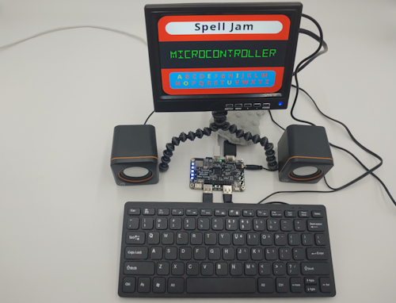](https://learn.adafruit.com/guides/latest)

The Adafruit Learning System has over 3,200 free guides for learning skills and building projects including using Python.

[Spell Jam App on Fruit Jam](https://learn.adafruit.com/spell-jam-app-on-fruit-jam) from [Tim C](https://learn.adafruit.com/u/Foamyguy)

[title](url) from [name](url)

[title](url) from [name](url)

## Updated Learn Guides

[title](url)

## CircuitPython Libraries

The CircuitPython library numbers are continually increasing, while existing ones continue to be updated. Here we provide library numbers and updates!

To get the latest Adafruit libraries, download the [Adafruit CircuitPython Library Bundle](https://circuitpython.org/libraries). To get the latest community contributed libraries, download the [CircuitPython Community Bundle](https://circuitpython.org/libraries).

If you'd like to contribute to the CircuitPython project on the Python side of things, the libraries are a great place to start. Check out the [CircuitPython.org Contributing page](https://circuitpython.org/contributing). If you're interested in reviewing, check out Open Pull Requests. If you'd like to contribute code or documentation, check out Open Issues. We have a guide on [contributing to CircuitPython with Git and GitHub](https://learn.adafruit.com/contribute-to-circuitpython-with-git-and-github), and you can find us in the #help-with-circuitpython and #circuitpython-dev channels on the [Adafruit Discord](https://adafru.it/discord).

You can check out this [list of all the Adafruit CircuitPython libraries and drivers available](https://github.com/adafruit/Adafruit_CircuitPython_Bundle/blob/master/circuitpython_library_list.md). 

The current number of CircuitPython libraries is **###**!

**New Libraries**

Here are this week's new CircuitPython libraries:

* [library](url)

**Updated Libraries**

Here are this week's updated CircuitPython libraries:

* [library](url)

## What’s the CircuitPython team up to this week?

What is the team up to this week? Let’s check in:

**Dan**

I released CircuitPython 10.0.0-beta.3 at the end of August, to catch up with some important fixes. Since then, I've fixed some more bugs for the 10.0.0 final release, and will continue to work on that.

I tested some monitors for use with the Fruit Jam board at home and at a store. A few monitors don't work at all, and some only work in one mode. HDTV's are forgiving. One 20-year-old monitor works in several modes.

**Tim**

This week I finished and published the Spell Jam app for the Fruit Jam it pronounces and spells words using AWS Polly service. After that I started working on the BMP5xx CircuitPython driver and the guide for the BMP5xx breakouts. I also did some quick tests loading the small Gemma 3 LLM that Google recently released onto a Raspberry Pi 4 & 5.

**Scott**

Switched off of IDF 5.5 update because I wasn't making progress. Made quick progress fixing two Fruit Jam bugs that resulted in display instability. Two other uses of DMA could DMA from PSRAM were changed to prevent DMAing from PSRAM. Doing so can lead to stalling the DMA during a PSRAM transfer that prevents other DMA (particularly DVI) from happening. Also fixed a `lvfontio` issue with fixed width fonts.

**Liz**

I returned from vacation this week. After catching up on email and GitHub, I started working on the CircuitPython driver for the [MLX90632 FIR Remote Thermal Temperature Sensor](https://www.adafruit.com/product/6403). The guide and library will likely be available next week.

## Upcoming Events

PyCon AU will be held from Friday the 12th to Tuesday the 16th of September at Pullman Melbourne On The Park in Narrm/Melbourne, Australia - [pycon.org.au](https://2025.pycon.org.au/).

KiCad conferences (KiCon) to be held this year include 19 - 20 Sept 2024 in Bochum, Germany, and 14 - 15 November, 2025 in Shenzhen, China - [KiCad](https://kicon.kicad.org/).

PyCon UK will be at CONTACT in Manchester from Friday 19th September to Monday 22nd September 2025 - [PyCon UK 2025](https://2025.pyconuk.org/).

Maker Faire Bay Area 2025 will be Sep 26 – 28, 2025 in Vallejo, California, US - [Maker Faire](https://bayarea.makerfaire.com/).

The next MicroPython Meetup in Melbourne will be on August 27th – [Meetup](https://www.meetup.com/micropython-meetup/events). You can see recordings of previous meetings on [YouTube](https://www.youtube.com/@MicroPythonOfficial). 

The Hackaday Superconference is back! Join this global conference of hardware hackers, makers, and tech enthusiasts this Oct 31st - Nov 2nd in Pasadena, California - [Eventbrite](https://www.eventbrite.com/e/2025-hackaday-superconference-tickets-1505260116529).

PyLadiesCon returns December 5–7, 2025. 100% online conference designed for our global community. Talks, workshops, panels, and community fun – [PyLadies](https://conference.pyladies.com/2025-pyladiescon-is-back/).

**Send Your Events In**

If you know of virtual events or upcoming events, please let us know via email to cpnews(at)adafruit(dot)com.

## Latest Releases

CircuitPython's stable release is [#.#.#](https://github.com/adafruit/circuitpython/releases/latest) and its unstable release is [#.#.#-##.#](https://github.com/adafruit/circuitpython/releases). New to CircuitPython? Start with our [Welcome to CircuitPython Guide](https://learn.adafruit.com/welcome-to-circuitpython).

[2025####](https://github.com/adafruit/Adafruit_CircuitPython_Bundle/releases/latest) is the latest Adafruit CircuitPython library bundle.

[2025####](https://github.com/adafruit/CircuitPython_Community_Bundle/releases/latest) is the latest CircuitPython Community library bundle.

[v#.#.#](https://micropython.org/download) is the latest MicroPython release. Documentation for it is [here](http://docs.micropython.org/en/latest/pyboard/).

[#.#.#](https://www.python.org/downloads/) is the latest Python release. The latest pre-release version is [#.#.#](https://www.python.org/download/pre-releases/).

[#,### Stars](https://github.com/adafruit/circuitpython/stargazers) Like CircuitPython? [Star it on GitHub!](https://github.com/adafruit/circuitpython)

## Call for Help -- Translating CircuitPython is now easier than ever

[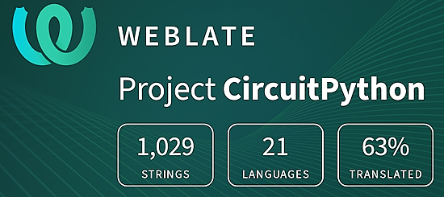](https://hosted.weblate.org/engage/circuitpython/)

One important feature of CircuitPython is translated control and error messages. With the help of fellow open source project [Weblate](https://weblate.org/), we're making it even easier to add or improve translations. 

Sign in with an existing account such as GitHub, Google or Facebook and start contributing through a simple web interface. No forks or pull requests needed! As always, if you run into trouble join us on [Discord](https://adafru.it/discord), we're here to help.

## NUMBER Thanks

The Adafruit Discord community, where we do all our CircuitPython development in the open, reached over NUMBER humans - thank you! Adafruit believes Discord offers a unique way for Python on hardware folks to connect. Join today at [https://adafru.it/discord](https://adafru.it/discord).

## ICYMI - In case you missed it

Python on hardware is the Adafruit Python video-newsletter-podcast! The news comes from the Python community, Discord, Adafruit communities and more and is broadcast on ASK an ENGINEER Wednesdays. The complete Python on Hardware weekly videocast [playlist is here](https://www.youtube.com/playlist?list=PLjF7R1fz_OOXRMjM7Sm0J2Xt6H81TdDev). The video podcast is on [iTunes](https://itunes.apple.com/us/podcast/python-on-hardware/id1451685192?mt=2), [YouTube](http://adafru.it/pohepisodes), [Instagram](https://www.instagram.com/adafruit/channel/)), and [XML](https://itunes.apple.com/us/podcast/python-on-hardware/id1451685192?mt=2).

[The weekly community chat on Adafruit Discord server CircuitPython channel - Audio / Podcast edition](https://itunes.apple.com/us/podcast/circuitpython-weekly-meeting/id1451685016) - Audio from the Discord chat space for CircuitPython, meetings are usually Mondays at 2pm ET, this is the audio version on [iTunes](https://itunes.apple.com/us/podcast/circuitpython-weekly-meeting/id1451685016), Pocket Casts, [Spotify](https://adafru.it/spotify), and [XML feed](https://adafruit-podcasts.s3.amazonaws.com/circuitpython_weekly_meeting/audio-podcast.xml).

## Contribute

The CircuitPython Weekly Newsletter is a CircuitPython community-run newsletter emailed every Monday. The complete [archives are here](https://www.adafruitdaily.com/category/circuitpython/). It highlights the latest CircuitPython related news from around the web including Python and MicroPython developments. To contribute, edit next week's draft [on GitHub](https://github.com/adafruit/circuitpython-weekly-newsletter/tree/gh-pages/_drafts) and [submit a pull request](https://help.github.com/articles/editing-files-in-your-repository/) with the changes. You may also tag your information on Twitter with #CircuitPython. 

Join the Adafruit [Discord](https://adafru.it/discord) or [post to the forum](https://forums.adafruit.com/viewforum.php?f=60) if you have questions.
