View this email in your browser. 

Welcome to the latest Python on Microcontrollers newsletter! *insert 2-3 sentences from editor (what's in overview, banter)* - *Anne Barela, Editor*

We're on [Discord](https://discord.gg/HYqvREz), [Twitter/X](https://twitter.com/search?q=circuitpython&src=typed_query&f=live), [BlueSky](https://bsky.app/profile/circuitpython.org) and for past newsletters - [view them all here](https://www.adafruitdaily.com/category/circuitpython/). If you're reading this on the web, please [subscribe here](https://www.adafruitdaily.com/). Here's the news this week:

## CircuitPython 9.2.9 Released

CircuitPython 9.2.9 is the latest bugfix revision of CircuitPython and is a new stable release - [Adafruit Blog](https://blog.adafruit.com/2025/09/07/circuitpython-9-2-9-released/) and release notes - [GitHub](https://github.com/adafruit/circuitpython/releases/tag/9.2.9).

**Highlights of this release**

- Fix network crashes on Pico W; fixes regression since 9.2.5.

## Spotlight This Week: Chip Futures

News this week from ther Arm and RISC-V camps. AI/LLM seems to be driving chip growth.

### ARM Introduces New C1 CPU and G1 GPU Cores With New Branding, "Cortex" Name Dropped

[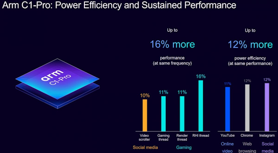](https://www.gsmarena.com/arm_introduces_new_c1_cpu_and_g1_gpu_cores_with_new_branding_cortex_name_dropped-news-69450.php)

ARM has unveiled its next generation CPU and GPU designs and is doing some rebranding at the same time. Meet the ARM C1 CPUs and G1 GPUs, which will form the ARM Lumex compute subsystem (CSS) - [GSMarena](https://www.gsmarena.com/arm_introduces_new_c1_cpu_and_g1_gpu_cores_with_new_branding_cortex_name_dropped-news-69450.php).

### SiFive Unleashes Second-Generation RISC-V IP

[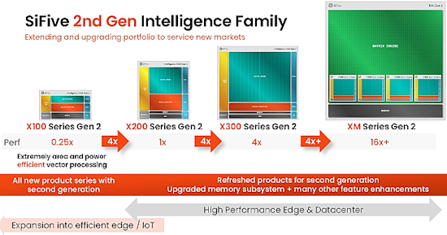](https://www.eetimes.com/sifive-unleashes-second-generation-risc-v-ip/)

RISC-V is becoming a domanent architecture for microcontrollers with Espressif and Raspberry Pi offering chips using RISC-V. Noe SiFive, a leader in RISC-V computing, launches its second-generation Intelligence family of processors, a major advancement in accelerating artificial intelligence workloads across a broad spectrum of applications. The new lineup features five RISC-V-based products, including the entirely new X100 series - [EE Times](https://www.eetimes.com/sifive-unleashes-second-generation-risc-v-ip/).

## 1TB Raspberry Pi SSD on Sale Now for $70

[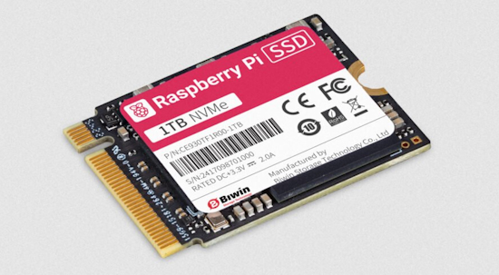](https://www.raspberrypi.com/news/1tb-raspberry-pi-ssd-on-sale-now-for-70/)

Raspberry Pi is now selling the Raspberry Pi SSD as a 1TB SSD for the Raspberry Pi 5 and other devices. This is a PCIe Gen 3 compliant SSD with there also being 256GB and 512GB versions for those not needing 1TB of storage capacity - [Raspberry Pi News](https://www.raspberrypi.com/news/1tb-raspberry-pi-ssd-on-sale-now-for-70/). Via [Phoronix](https://www.phoronix.com/news/Raspberry-Pi-1TB-SSD).

## A Gentle Introduction to Docker for Python Developers

Learn how Docker can help Python developers create isolated, consistent environments that simplify everything from development to deployment - [KDnuggets](https://www.kdnuggets.com/a-gentle-introduction-to-docker-for-python-developers).

## Sprints are the Best Part of a Conference

PSF CPython Developer-in-Residence Łukasz Langa writes about why sprints are a wonderful environment for productivity, learning, and community connection, and his favorite part of a Python conference - [Python Blog](https://pyfound.blogspot.com/2025/09/sprints-are-best-part-of-conference.html).

## This Week's Python Streams

Python on Hardware is all about building a cooperative ecosphere which allows contributions to be valued and to grow knowledge. Below are the streams within the last week focusing on the community.

**CircuitPython Deep Dive Stream**

[Last Friday](link), Tim streamed work on {subject}.

You can see the latest video and past videos on the Adafruit YouTube channel under the Deep Dive playlist - [YouTube](https://www.youtube.com/playlist?list=PLjF7R1fz_OOXBHlu9msoXq2jQN4JpCk8A).

**CircuitPython Parsec**

John Park’s CircuitPython Parsec this week is on {subject} - [Adafruit Blog](link) and [YouTube](link).

Catch all the episodes in the [YouTube playlist](https://www.youtube.com/playlist?list=PLjF7R1fz_OOWFqZfqW9jlvQSIUmwn9lWr).

**CircuitPython Weekly Meeting**

CircuitPython Weekly Meeting for September 8, 2025 ([notes](https://github.com/adafruit/adafruit-circuitpython-weekly-meeting/blob/main/2025/2025-09-08.md)) [on YouTube](https://youtu.be/xdIczhWAX24).

## Project of the Week: Space Invaders on a HUB75 LED Matrix

[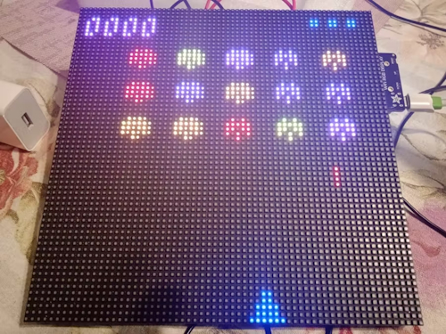](https://www.hackster.io/nicolaudosbrinquedos/space-invaders-in-hub75-led-matrix-a43ad4)

Djair Guilherme creates a Space Invaders hame that runs on a 64x64 HUB75 LED matrix panel connected to an Adafruit MatrixPortal S3 board running CircuitPython. An analog joystick module is used to move the ship and fire shots - [hackster.io](https://www.hackster.io/nicolaudosbrinquedos/space-invaders-in-hub75-led-matrix-a43ad4).

## Popular Last Week

What was the most popular, most clicked link, in [last week's newsletter](https://www.adafruitdaily.com/2025/09/08/python-on-microcontrollers-newsletter-vibe-coding-github-oops-commits-projects-much-more-circuitpython-python-micropython-thepsf-raspberry_pi/)? [Vibe Coding is Creating a Generation of Unemployable Developers](https://hackernoon.com/vibe-coding-is-creating-a-generation-of-unemployable-developers).

Did you know you can read past issues of this newsletter in the Adafruit Daily Archive? [Check it out](https://www.adafruitdaily.com/category/circuitpython/).

## New Notes from Adafruit Playground

[Adafruit Playground](https://adafruit-playground.com/) is a new place for the community to post their projects and other making tips/tricks/techniques. Ad-free, it's an easy way to publish your work in a safe space for free.

Fruit Jam Ssspeed Dating - [Adafruit Playground](https://adafruit-playground.com/u/relic_se/pages/fruit-jam-ssspeed-dating).

[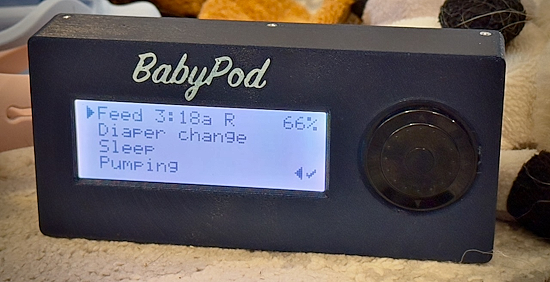](https://adafruit-playground.com/u/sdkjfgjdskjlflhdsjkgf/pages/babypod)

BabyPod - [Adafruit Playground](https://adafruit-playground.com/u/sdkjfgjdskjlflhdsjkgf/pages/babypod).

## News From Around the Web

5 projects you can do for much cheaper with an ESP32 than a Raspberry Pi - [XDA](https://www.xda-developers.com/projects-you-can-do-for-much-cheaper-with-an-esp32/).

[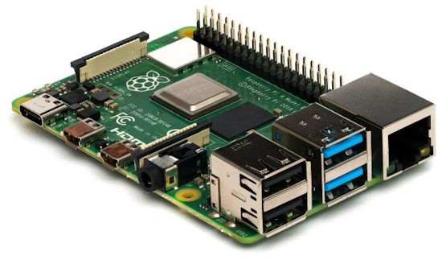](https://www.extremetech.com/computing/raspberry-pi-could-monitor-heart-rates-without-wearables)

Raspberry Pi could monitor heart rates without wearables - [ExtremeTech](https://www.extremetech.com/computing/raspberry-pi-could-monitor-heart-rates-without-wearables).

[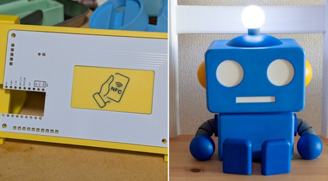](https://x.com/hsgw/status/1964249942966620533)

A robot that links with an NFC tag and flashes and beeps when you hold up your smartphone to it made with a RP2040-Zero, NFC reader and CircuitPython - [X](https://x.com/hsgw/status/1964249942966620533) and [GitHub](https://github.com/hsgw/nfc_dynamic_tag_dev_board).

[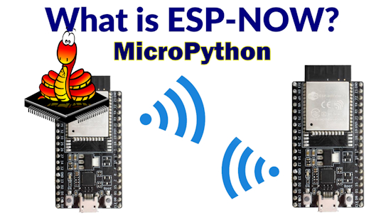](https://www.donskytech.com/exploring-esp-now-in-micropython-a-learners-guide/)

Exploring ESP-NOW in MicroPython: A Learner’s Guide - [donskytech.com](https://www.donskytech.com/exploring-esp-now-in-micropython-a-learners-guide/).

A [CircuitPython program](https://github.com/kevinjwalters/circuitpython-examples/tree/master/pyruler) similar to the one that ships with the Adafruit PyRuler but this one types words cycling through text files in response to button presses whilst spinning the colour on the DotStar pixel - [YouTube](https://www.youtube.com/watch?v=Wvg3ykPnwUg).

[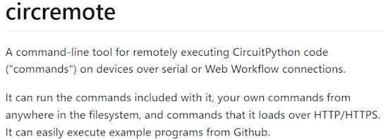](https://github.com/romkey/circremote)

circremote. a command-line tool for remotely executing CircuitPython code ("commands") on devices over serial or Web Workflow connections, has a new release to make it work better with Windows - [GitHub](https://github.com/romkey/circremote) and [change log](https://github.com/romkey/circremote/releases/tag/v0.12.0). Via [Reddit](https://www.reddit.com/r/circuitpython/comments/1n8dcb8/circremote_update_windows_support_pip_quiet_mode/).

The VS Code team and friends dive into the latest features from the v1.104 release - [YouTube](https://www.youtube.com/live/w2qMcctqv40).

Design a keyboard using only Python without using Kicad or 3DCAD. The firmware is KMK (CircuitPython) - [GitHub](https://github.com/hsgw/keyboard-made-by-python/tree/main/notebook/jp).

[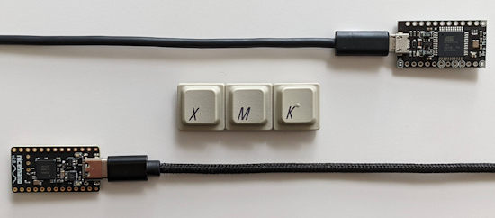](https://github.com/manna-harbour/xmk)

𝑥MK facilitates the use of programmable keyboard firmware with any keyboard. With 𝑥MK, a keyboard, and an MCU board running programmable keyboard firmware, are connected to the host, and key events are diverted by xmk from the keyboard to the MCU board for processing by the firmware. 𝑥MK supports any keyboard, Linux hosts, and QMK, ZMK, or KMK (CircuitPython-based) keymaps, and requires an MCU board and the xmk application - [GitHub](https://github.com/manna-harbour/xmk).

[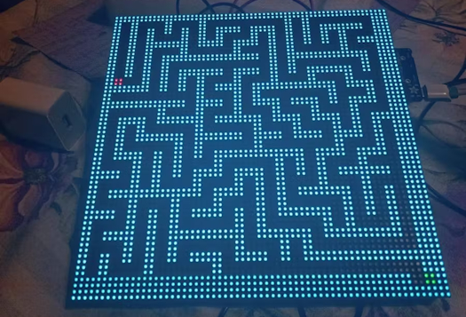](https://www.hackster.io/nicolaudosbrinquedos/matrixportal-s3-maze-game-with-circuitpython-003a78)

MatrixPortal S3 maze game with CircuitPython - [hackster.io](https://www.hackster.io/nicolaudosbrinquedos/matrixportal-s3-maze-game-with-circuitpython-003a78).

[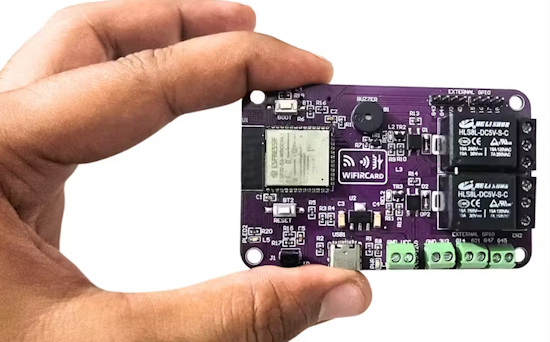](https://www.hackster.io/CarstenJanmy/wifircard-smart-home-automation-with-esp32-s3-ir-relays-d9c2a1)

WiFIRCard – smart home automation with ESP32-S3, IR & relays with MicroPython - [hackster.io](https://www.hackster.io/CarstenJanmy/wifircard-smart-home-automation-with-esp32-s3-ir-relays-d9c2a1).

[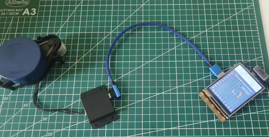](https://community.dfrobot.com/makelog-318091.html)

Building a LiDAR monitoring system using the Unihiker board and the YDLIDAR X2 sensor with Python - [DFRobot](https://community.dfrobot.com/makelog-318091.html) and [YouTube](https://youtu.be/F9JiOHICAPo).

[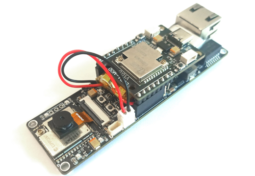](https://hackaday.io/project/203879-ai-on-the-edge-cam)

Ai-on-the-edge-cam is an ESP32-S3 development board with Ethernet, PoE, SD card, battery management, Lora/Lorawan, and Smart LEDs which can run CircuitPython - [hackaday.io](https://hackaday.io/project/203879-ai-on-the-edge-cam).

How to make graphical Python apps the EasyGUI way - [Tom's Hardware](https://www.tomshardware.com/software/python/how-to-make-graphical-python-apps-the-easygui-way).

[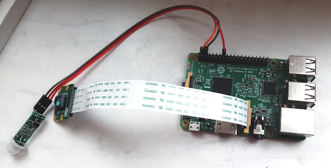](https://www.hackster.io/ujur007/raspberry-pi-home-security-system-with-camera-and-pir-sensor-6154f3)

Raspberry Pi home hecurity hystem with camera and PIR sensor - [hackster.io](https://www.hackster.io/ujur007/raspberry-pi-home-security-system-with-camera-and-pir-sensor-6154f3).

[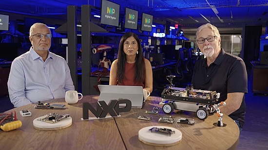](https://www.youtube.com/watch?v=NcIBYZSbktw)

Conversations at the Edge S2E2 - You can’t go to market with Raspberry Pi - [YouTube](https://www.youtube.com/watch?v=NcIBYZSbktw).

text - [site](url).

Raspberry Pi System Monitor is a real-time system monitoring tool for Pi that tracks CPU usage, memory consumption, & temperature with live graphs &data export capability - [hackster.io](https://www.hackster.io/aula-jazmati/raspberry-pi-system-monitor-a6eb9e).

## New

[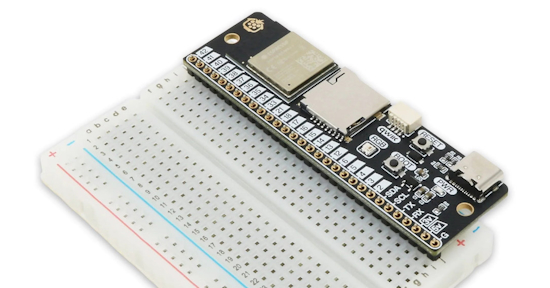](https://www.cnx-software.com/2025/09/10/baguette-s3-esp32-s3-board-gets-the-breadboard-friendly-crown/)

The Pi Hut’s Baguette S3 provides a single 30-pin header designed to be inserted in one of the rows of a breadboard, leaving space for prototyping. The board features an ESP32-S3 microcontroller, a microSD card slot, a USB-C for power and programming, a Qwiic port for expansion, an RGB LED, and RESET and BOOT buttons - [CNX Software](https://www.cnx-software.com/2025/09/10/baguette-s3-esp32-s3-board-gets-the-breadboard-friendly-crown/).

## Upcoming

[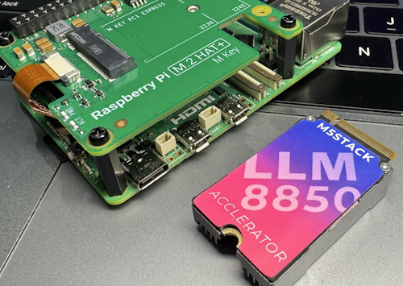](https://x.com/M5Stack/status/1966093859328606300)

M5Stack on X (formerly Twitter) has been teasing their upcoming LLM8850 accelerator designed to fit the PCIe slot in the Raspberry Pi PCIe HAT. - [X](https://x.com/M5Stack/status/1966093859328606300).

## New Boards Supported by CircuitPython

The number of supported microcontrollers and Single Board Computers (SBC) grows every week. This section outlines which boards have been included in CircuitPython or added to [CircuitPython.org](https://circuitpython.org/).

This week there was one new board added:

- [AI-On-The-Edge-Cam by Prokyber](https://circuitpython.org/board/ai_on_the_edge_cam/)

*Note: For non-Adafruit boards, please use the support forums of the board manufacturer for assistance, as Adafruit does not have the hardware to assist in troubleshooting.*

Looking to add a new board to CircuitPython? It's highly encouraged! Adafruit has four guides to help you do so:

- [How to Add a New Board to CircuitPython](https://learn.adafruit.com/how-to-add-a-new-board-to-circuitpython/overview)
- [How to add a New Board to the circuitpython.org website](https://learn.adafruit.com/how-to-add-a-new-board-to-the-circuitpython-org-website)
- [Adding a Single Board Computer to PlatformDetect for Blinka](https://learn.adafruit.com/adding-a-single-board-computer-to-platformdetect-for-blinka)
- [Adding a Single Board Computer to Blinka](https://learn.adafruit.com/adding-a-single-board-computer-to-blinka)

## New Learn Guides

[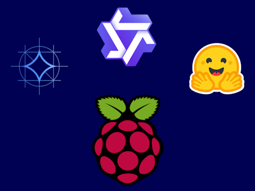](https://learn.adafruit.com/guides/latest)

The Adafruit Learning System has over 3,200 free guides for learning skills and building projects including using Python.

[Local LLMs on Raspberry Pi](https://learn.adafruit.com/local-llms-on-raspberry-pi) from [Tim C](https://learn.adafruit.com/u/Foamyguy)

[AS5600 Super Smooth Rotary Encoder](https://learn.adafruit.com/as5600-smooth-rotary-encoder) from [Liz Clark](https://learn.adafruit.com/u/BlitzCityDIY)

## CircuitPython Libraries

The CircuitPython library numbers are continually increasing, while existing ones continue to be updated. Here we provide library numbers and updates!

To get the latest Adafruit libraries, download the [Adafruit CircuitPython Library Bundle](https://circuitpython.org/libraries). To get the latest community contributed libraries, download the [CircuitPython Community Bundle](https://circuitpython.org/libraries).

If you'd like to contribute to the CircuitPython project on the Python side of things, the libraries are a great place to start. Check out the [CircuitPython.org Contributing page](https://circuitpython.org/contributing). If you're interested in reviewing, check out Open Pull Requests. If you'd like to contribute code or documentation, check out Open Issues. We have a guide on [contributing to CircuitPython with Git and GitHub](https://learn.adafruit.com/contribute-to-circuitpython-with-git-and-github), and you can find us in the #help-with-circuitpython and #circuitpython-dev channels on the [Adafruit Discord](https://adafru.it/discord).

You can check out this [list of all the Adafruit CircuitPython libraries and drivers available](https://github.com/adafruit/Adafruit_CircuitPython_Bundle/blob/master/circuitpython_library_list.md). 

The current number of CircuitPython libraries is **541**!

**New Libraries**

Here are this week's new CircuitPython libraries:

  * [adafruit/Adafruit_CircuitPython_MLX90632](https://github.com/adafruit/Adafruit_CircuitPython_MLX90632)
  * [MikeCoats/CircuitPython_AT42QT2120](https://github.com/MikeCoats/CircuitPython_AT42QT2120)

**Updated Libraries**

Here are this week's updated CircuitPython libraries:

  * [adafruit/Adafruit_CircuitPython_FruitJam](https://github.com/adafruit/Adafruit_CircuitPython_FruitJam)
  * [adafruit/Adafruit_CircuitPython_TLV320](https://github.com/adafruit/Adafruit_CircuitPython_TLV320)
  * [adafruit/Adafruit_CircuitPython_MatrixPortal](https://github.com/adafruit/Adafruit_CircuitPython_MatrixPortal)
  * [adafruit/Adafruit_CircuitPython_PortalBase](https://github.com/adafruit/Adafruit_CircuitPython_PortalBase)
  * [MikeCoats/CircuitPython_AT42QT2120](https://github.com/MikeCoats/CircuitPython_AT42QT2120)

## What’s the CircuitPython team up to this week?

What is the team up to this week? Let’s check in:

**Dan**

text.

**Tim**

I finished the BMP5xx guide this week and it was published. I am going to work on trying to make a unified SPI/I2C driver for it next. The existing driver is I2C only, and I have implemented a working SPI one, but still need to figure out how to combine them together in a satisfactory way that doesn't include a bunch of code duplication. I also finished and published another guide this week that documents how to setup and use a handful of LLMs locally on a Raspberry Pi 4 or 5.

**Scott**

This week I've gotten back to working on the IDF 5.5 update. The first step was updating to v5.5.1 since it came out. Then, yesterday I managed to get the C6 booting into CircuitPython... and then crashing. So, that's next.

**Liz**

This week I worked on the guide and CircuitPython driver for the [MLX90632 FIR temperature sensor](https://learn.adafruit.com/adafruit-mlx90632-fir-remote-thermal-temperature-sensor). This sensor is really cool since you get both the ambient temperature of your space and an object temperature for whatever object is directly in front of the sensor. It feels a bit like magic when you use it. 

I also documented a [project using the AS5600 sensor](https://learn.adafruit.com/as5600-smooth-rotary-encoder). It's a rotary encoder, coded in CircuitPython, that uses a magnet with the sensor to act as the encoder.

## Upcoming Events

KiCad conferences (KiCon) to be held this year include 19 - 20 Sept 2024 in Bochum, Germany, and 14 - 15 November, 2025 in Shenzhen, China - [KiCad](https://kicon.kicad.org/).

PyCon UK will be at CONTACT in Manchester from Friday 19th September to Monday 22nd September 2025 - [PyCon UK 2025](https://2025.pyconuk.org/).

The next MicroPython Meetup in Melbourne will be on September 25th – [Meetup](https://www.meetup.com/micropython-meetup/events). You can see recordings of previous meetings on [YouTube](https://www.youtube.com/@MicroPythonOfficial). 

Maker Faire Bay Area 2025 will be Sep 26 – 28, 2025 in Vallejo, California, US - [Maker Faire](https://bayarea.makerfaire.com/).

The Hackaday Superconference is back! Join this global conference of hardware hackers, makers, and tech enthusiasts this Oct 31st - Nov 2nd in Pasadena, California - [Eventbrite](https://www.eventbrite.com/e/2025-hackaday-superconference-tickets-1505260116529).

PyLadiesCon returns December 5–7, 2025. 100% online conference designed for our global community. Talks, workshops, panels, and community fun – [PyLadies](https://conference.pyladies.com/2025-pyladiescon-is-back/).

**Send Your Events In**

If you know of virtual events or upcoming events, please let us know via email to cpnews(at)adafruit(dot)com.

## Latest Releases

CircuitPython's stable release is [9.2.9](https://github.com/adafruit/circuitpython/releases/latest) and its unstable release is [10.0.0-beta.3](https://github.com/adafruit/circuitpython/releases). New to CircuitPython? Start with our [Welcome to CircuitPython Guide](https://learn.adafruit.com/welcome-to-circuitpython).

[20250909](https://github.com/adafruit/Adafruit_CircuitPython_Bundle/releases/latest) is the latest Adafruit CircuitPython library bundle.

[20250908](https://github.com/adafruit/CircuitPython_Community_Bundle/releases/latest) is the latest CircuitPython Community library bundle.

[v1.26.0](https://micropython.org/download) is the latest MicroPython release. Documentation for it is [here](http://docs.micropython.org/en/latest/pyboard/).

[3.13.7](https://www.python.org/downloads/) is the latest Python release. The latest pre-release version is [3.14.0rc2](https://www.python.org/download/pre-releases/).

[4,330 Stars](https://github.com/adafruit/circuitpython/stargazers) Like CircuitPython? [Star it on GitHub!](https://github.com/adafruit/circuitpython)

## Call for Help -- Translating CircuitPython is now easier than ever

[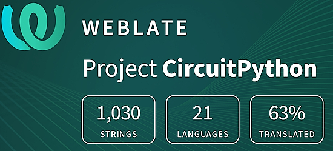](https://hosted.weblate.org/engage/circuitpython/)

One important feature of CircuitPython is translated control and error messages. With the help of fellow open source project [Weblate](https://weblate.org/), we're making it even easier to add or improve translations. 

Sign in with an existing account such as GitHub, Google or Facebook and start contributing through a simple web interface. No forks or pull requests needed! As always, if you run into trouble join us on [Discord](https://adafru.it/discord), we're here to help.

## 39,040 Thanks

The Adafruit Discord community, where we do all our CircuitPython development in the open, reached over 39,040 humans - thank you! Adafruit believes Discord offers a unique way for Python on hardware folks to connect. Join today at [https://adafru.it/discord](https://adafru.it/discord).

## ICYMI - In case you missed it

Python on hardware is the Adafruit Python video-newsletter-podcast! The news comes from the Python community, Discord, Adafruit communities and more and is broadcast on ASK an ENGINEER Wednesdays. The complete Python on Hardware weekly videocast [playlist is here](https://www.youtube.com/playlist?list=PLjF7R1fz_OOXRMjM7Sm0J2Xt6H81TdDev). The video podcast is on [iTunes](https://itunes.apple.com/us/podcast/python-on-hardware/id1451685192?mt=2), [YouTube](http://adafru.it/pohepisodes), [Instagram](https://www.instagram.com/adafruit/channel/)), and [XML](https://itunes.apple.com/us/podcast/python-on-hardware/id1451685192?mt=2).

[The weekly community chat on Adafruit Discord server CircuitPython channel - Audio / Podcast edition](https://itunes.apple.com/us/podcast/circuitpython-weekly-meeting/id1451685016) - Audio from the Discord chat space for CircuitPython, meetings are usually Mondays at 2pm ET, this is the audio version on [iTunes](https://itunes.apple.com/us/podcast/circuitpython-weekly-meeting/id1451685016), Pocket Casts, [Spotify](https://adafru.it/spotify), and [XML feed](https://adafruit-podcasts.s3.amazonaws.com/circuitpython_weekly_meeting/audio-podcast.xml).

## Contribute

The CircuitPython Weekly Newsletter is a CircuitPython community-run newsletter emailed every Monday. The complete [archives are here](https://www.adafruitdaily.com/category/circuitpython/). It highlights the latest CircuitPython related news from around the web including Python and MicroPython developments. To contribute, edit next week's draft [on GitHub](https://github.com/adafruit/circuitpython-weekly-newsletter/tree/gh-pages/_drafts) and [submit a pull request](https://help.github.com/articles/editing-files-in-your-repository/) with the changes. You may also tag your information on Twitter with #CircuitPython. 

Join the Adafruit [Discord](https://adafru.it/discord) or [post to the forum](https://forums.adafruit.com/viewforum.php?f=60) if you have questions.
