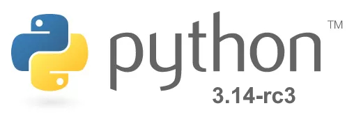
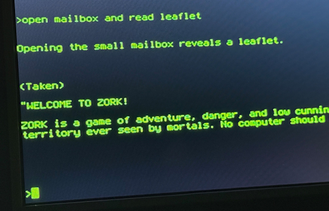
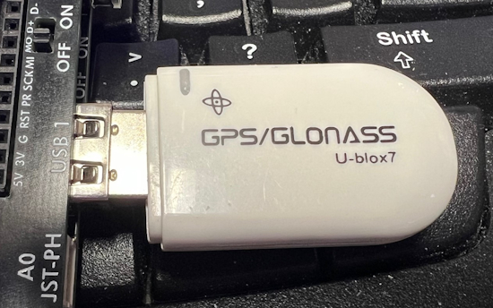
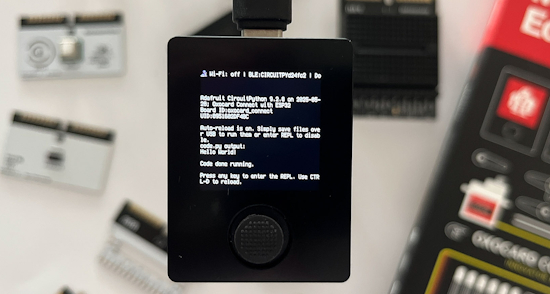
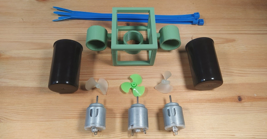
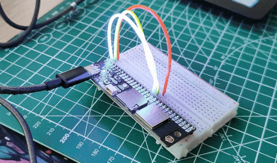
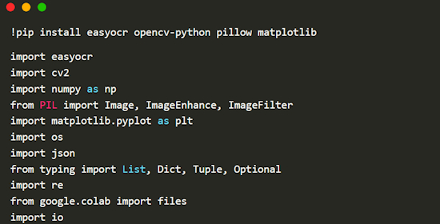
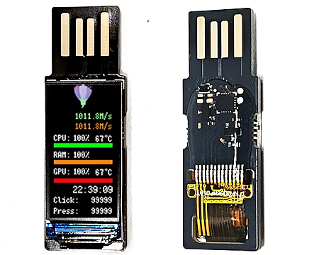
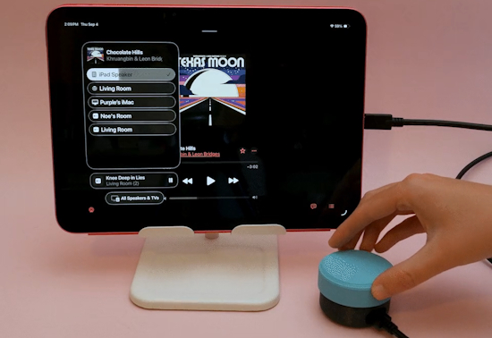
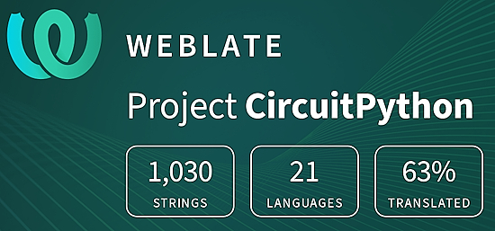

- [ ] Library and info updates
- [ ] change date
- [ ] update title
- [ ] Feature story
- [ ] Update  for images
- [ ] Update ICYDNCI
- [ ] All images 550w max only
- [ ] Link "View this email in your browser."

News Sources

- [Adafruit Playground](https://adafruit-playground.com/)
- Twitter: [CircuitPython](https://twitter.com/search?q=circuitpython&src=typed_query&f=live), [MicroPython](https://twitter.com/search?q=micropython&src=typed_query&f=live) and [Python](https://twitter.com/search?q=python&src=typed_query)
- [Raspberry Pi News](https://www.raspberrypi.com/news/)
- Mastodon [CircuitPython](https://mastodon.social/tags/CircuitPython) and [MicroPython](https://mastodon.social/tags/MicroPython)
- [hackster.io CircuitPython](https://www.hackster.io/search?q=circuitpython&i=projects&sort_by=most_recent) and [MicroPython](https://www.hackster.io/search?q=micropython&i=projects&sort_by=most_recent)
- YouTube: [CircuitPython](https://www.youtube.com/results?search_query=circuitpython&sp=CAI%253D), [MicroPython](https://www.youtube.com/results?search_query=micropython&sp=CAI%253D), [Prof Gallaugher](https://www.youtube.com/@BuildWithProfG/videos), [Teacher Brogan M. Pratt CircuitPython](https://www.youtube.com/playlist?list=PLRHdgFNRLyaN6eCw8b0yoHKDY9B4GiirU)
- [Google News Python](https://news.google.com/topics/CAAqIQgKIhtDQkFTRGdvSUwyMHZNRFY2TVY4U0FtVnVLQUFQAQ?hl=en-US&gl=US&ceid=US%3Aen)
- [maker.io Python](https://www.digikey.com/en/maker/search-results?t=python)
- Instructables: [CircuitPython](https://www.instructables.com/search/?q=circuitpython&projects=all&sort=Newest), [MicroPython](https://www.instructables.com/search/?q=micropython&projects=all&sort=Newest), [Raspberry Pi Python](https://www.instructables.com/search/?q=raspberry+pi+python&projects=all&sort=Newest)
- [hackaday CircuitPython](https://hackaday.com/blog/?s=circuitpython) and [MicroPython](https://hackaday.com/blog/?s=micropython)
- [python.org](https://www.python.org/)
- [Python Insider - dev team blog](https://pythoninsider.blogspot.com/)
- Individuals: [Jeff Geerling](https://www.jeffgeerling.com/blog), [Yakroo](https://x.com/Yakroo5077)
- Tom's Hardware: [CircuitPython](https://www.tomshardware.com/search?searchTerm=circuitpython&articleType=all&sortBy=publishedDate) and [MicroPython](https://www.tomshardware.com/search?searchTerm=micropython&articleType=all&sortBy=publishedDate) and [Raspberry Pi](https://www.tomshardware.com/search?searchTerm=raspberry%20pi&articleType=all&sortBy=publishedDate)
- [hackaday.io newest projects MicroPython](https://hackaday.io/projects?tag=micropython&sort=date) and [CircuitPython](https://hackaday.io/projects?tag=circuitpython&sort=date)
- hackaday.io - [CircuitPython](https://hackaday.io/search?term=circuitpython) and [MicroPython](https://hackaday.io/search?term=micropython)

View this email in your browser. **Warning: Flashing Imagery**

Welcome to the latest Python on Microcontrollers newsletter! *insert 2-3 sentences from editor (what's in overview, banter)* - *Anne Barela, Editor*

We're on [Discord](https://discord.gg/HYqvREz), [Twitter/X](https://twitter.com/search?q=circuitpython&src=typed_query&f=live), [BlueSky](https://bsky.app/profile/circuitpython.org) and for past newsletters - [view them all here](https://www.adafruitdaily.com/category/circuitpython/). If you're reading this on the web, please [subscribe here](https://www.adafruitdaily.com/). Here's the news this week:

## Headline

text - [site](url).

## How Python Grew From a Language to a Community

Python traveled a bumpy early road on its way to becoming the world’s #1 most popular programming language - [The New Stack](https://thenewstack.io/how-python-grew-from-a-language-to-a-community/).

> "When it first launched in 1991, Python 'wasn’t lucrative,' remembers long-time Python community organizer Paul Everitt (now a Python and web developer advocate at JetBrains). 'But we believed in it. The passion was there — we were doing good in the world.'"

## River Wang's CircuitPython Online IDE 2.2 Released

River Wang's web based CircuitPython Online IDE has been upgraded to version 2.2 with the edition of a Library Management Tool - [X](https://x.com/River___Wang/status/1967619790664782023), [IDE](https://urfdvw.github.io/circuitpython-online-ide-2/) and [YouTube](https://www.youtube.com/watch?v=pno0WYdwzSo).

## Python 3.14-rc3 Released Ahead Of Next Month's Official Release

Python 3.14-rc3 is out as the final test preview ahead of an October 7th official Python 3.14 stable release - [Phoronix](https://www.phoronix.com/news/Python-3.14-rc3-Released) and [PSF](https://pythoninsider.blogspot.com/2025/09/python-3140rc3-is-go.html).

## GitHub Copilot Coding Agent 101: Getting Started With Agentic Workflows on GitHub

Copilot coding agent helps automate developer workflows. Rather than working in isolated IDE sessions, the agent operates directly within the GitHub pull request workflow. It asynchronously automates tedious tasks like branch creation, commit writing, and pull request reviews - [GitHub Blog](https://github.blog/ai-and-ml/github-copilot/github-copilot-coding-agent-101-getting-started-with-agentic-workflows-on-github/) and [YouTube](https://youtu.be/t4ERV6aHCPM).

## OpenAI Releases GPT‑5‑Codex: Improved AI Coding Agent for Software Engineers

OpenAI has unveiled GPT‑5-Codex, an improved AI coding agent designed for software engineers, featuring autonomous code review and software flaw detection, with multi-platform integration. It operates in a secure sandbox and includes safeguards due to its high capability in sensitive domains - [NotebookCheck](https://www.notebookcheck.net/OpenAI-releases-GPT-5-Codex-Improved-AI-coding-agent-for-software-engineers.1115796.0.html) and [OpenAI News Release](https://openai.com/index/introducing-upgrades-to-codex/).

## This Week's Python Streams

Python on Hardware is all about building a cooperative ecosphere which allows contributions to be valued and to grow knowledge. Below are the streams within the last week focusing on the community.

**CircuitPython Deep Dive Stream**

[Last Friday](link), Tim streamed work on {subject}.

You can see the latest video and past videos on the Adafruit YouTube channel under the Deep Dive playlist - [YouTube](https://www.youtube.com/playlist?list=PLjF7R1fz_OOXBHlu9msoXq2jQN4JpCk8A).

**CircuitPython Parsec**

John Park’s CircuitPython Parsec this week is on {subject} - [Adafruit Blog](link) and [YouTube](link).

Catch all the episodes in the [YouTube playlist](https://www.youtube.com/playlist?list=PLjF7R1fz_OOWFqZfqW9jlvQSIUmwn9lWr).

**CircuitPython Weekly Meeting**

CircuitPython Weekly Meeting for {date} ([notes](file)) [on YouTube](link).

## Project of the Week: Z Machine Emulator in CircuitPython

Dan Cogliano has ported a [version 3](https://blog.zarfhome.com/2020/05/compiling-for-z-machine-version-3) [Z Machine Emulator](https://en.wikipedia.org/wiki/Z-machine) to CircuitPython 10, which allows running games which used this format, such as Zork! It currently works on the new Adafruit Fruit Jam and within Fruit Jam OS - [BlueSky](https://bsky.app/profile/cogliano.bsky.social/post/3lz4vvz53es2w) and [GitHub](https://github.com/ZContent/CPZ_Machine).

## Popular Last Week

What was the most popular, most clicked link, in [last week's newsletter](https://www.adafruitdaily.com/2025/09/15/python-on-microcontrollers-newsletter-circuitpython-9-2-9-new-arm-and-risc-v-chips-using-docker-and-more-circuitpython-python-micropython-thepsf-raspberry_pi/)? [5 projects you can do for much cheaper with an ESP32 than a Raspberry Pi](https://www.xda-developers.com/projects-you-can-do-for-much-cheaper-with-an-esp32/).

Did you know you can read past issues of this newsletter in the Adafruit Daily Archive? [Check it out](https://www.adafruitdaily.com/category/circuitpython/).

## New Notes from Adafruit Playground

[Adafruit Playground](https://adafruit-playground.com/) is a new place for the community to post their projects and other making tips/tricks/techniques. Ad-free, it's an easy way to publish your work in a safe space for free.

text - [Adafruit Playground](url).

text - [Adafruit Playground](url).

text - [Adafruit Playground](url).

## News From Around the Web

To date, most uses of USB Host for devices like Adafruit Fruit Jam in CircuitPython have been for HID devices like keyboards, mice and game controllers. But there are whole swaths of other types of USB device types. Adafruit Forums user blakebr has interfaced a GPS/GLONASS U-blox7 USB receiver to Fruit Jam. - [Adafruit Forums](https://forums.adafruit.com/viewtopic.php?t=220229).

> "I was able to get my Fruit Jam to read Date, Time, Location, etc. from the device. The information from the GPS sentences is shown on REPL. Also the Fruit Jam System Clock is set to local time based on the time zone offset from settings.toml."

Programming the Oxocard Connect with CircuitPython - [Make:](https://makezine.com/projects/programming-the-oxocard-connect-with-circuitpython/).

Build a tiny open-source underwater vehicle with Raspberry Pi Pico and MicroPython - [Raspberry Pi News](https://www.raspberrypi.com/news/build-a-tiny-open-source-underwater-vehicle/).

Les Pounder tries the new Baguette S3 board with CircuitPython - [bigl.es](https://bigl.es/im-tinkering-with-an-esp32/).

text - [site](url).

text - [site](url).

text - [site](url).

text - [site](url).

text - [site](url).

text - [site](url).

text - [site](url).

text - [site](url).

text - [site](url).

text - [site](url).

text - [site](url).

Programmer's Python: Async Locks - [i-programmer.info](https://www.i-programmer.info/programming/195-python/18321-programmers-python-async-locks.html).

text - [site](url).

How to build a multilingual OCR AI agent in Python with EasyOCR and OpenCV - [MarkTechPost](https://www.marktechpost.com/2025/09/12/how-to-build-a-multilingual-ocr-ai-agent-in-python-with-easyocr-and-opencv/).

## Coming Soon / New

text - [site](url).

text - [site](url).

## New Boards Supported by CircuitPython

The number of supported microcontrollers and Single Board Computers (SBC) grows every week. This section outlines which boards have been included in CircuitPython or added to [CircuitPython.org](https://circuitpython.org/).

This week there were (#/no) new boards added:

- [Board name](url)
- [Board name](url)
- [Board name](url)

*Note: For non-Adafruit boards, please use the support forums of the board manufacturer for assistance, as Adafruit does not have the hardware to assist in troubleshooting.*

Looking to add a new board to CircuitPython? It's highly encouraged! Adafruit has four guides to help you do so:

- [How to Add a New Board to CircuitPython](https://learn.adafruit.com/how-to-add-a-new-board-to-circuitpython/overview)
- [How to add a New Board to the circuitpython.org website](https://learn.adafruit.com/how-to-add-a-new-board-to-the-circuitpython-org-website)
- [Adding a Single Board Computer to PlatformDetect for Blinka](https://learn.adafruit.com/adding-a-single-board-computer-to-platformdetect-for-blinka)
- [Adding a Single Board Computer to Blinka](https://learn.adafruit.com/adding-a-single-board-computer-to-blinka)

## New Learn Guides

The Adafruit Learning System has over 3,200 free guides for learning skills and building projects including using Python.

[title](url) from [name](url)

[title](url) from [name](url)

[title](url) from [name](url)

## Updated Learn Guides

[title](url)

## CircuitPython Libraries

The CircuitPython library numbers are continually increasing, while existing ones continue to be updated. Here we provide library numbers and updates!

To get the latest Adafruit libraries, download the [Adafruit CircuitPython Library Bundle](https://circuitpython.org/libraries). To get the latest community contributed libraries, download the [CircuitPython Community Bundle](https://circuitpython.org/libraries).

If you'd like to contribute to the CircuitPython project on the Python side of things, the libraries are a great place to start. Check out the [CircuitPython.org Contributing page](https://circuitpython.org/contributing). If you're interested in reviewing, check out Open Pull Requests. If you'd like to contribute code or documentation, check out Open Issues. We have a guide on [contributing to CircuitPython with Git and GitHub](https://learn.adafruit.com/contribute-to-circuitpython-with-git-and-github), and you can find us in the #help-with-circuitpython and #circuitpython-dev channels on the [Adafruit Discord](https://adafru.it/discord).

You can check out this [list of all the Adafruit CircuitPython libraries and drivers available](https://github.com/adafruit/Adafruit_CircuitPython_Bundle/blob/master/circuitpython_library_list.md). 

The current number of CircuitPython libraries is **###**!

**New Libraries**

Here are this week's new CircuitPython libraries:

* [library](url)

**Updated Libraries**

Here are this week's updated CircuitPython libraries:

* [library](url)

## What’s the CircuitPython team up to this week?

What is the team up to this week? Let’s check in:

**Dan**

text.

**Tim**

text.

**Scott**

text.

**Liz**

text.

## Upcoming Events

The next MicroPython Meetup in Melbourne will be on September 24th – [Meetup](https://www.meetup.com/micropython-meetup/events). You can see recordings of previous meetings on [YouTube](https://www.youtube.com/@MicroPythonOfficial). 

Maker Faire Bay Area 2025 will be Sep 26 – 28, 2025 in Vallejo, California, US - [Maker Faire](https://bayarea.makerfaire.com/).

The Hackaday Superconference is back! Join this global conference of hardware hackers, makers, and tech enthusiasts this Oct 31st - Nov 2nd in Pasadena, California - [Eventbrite](https://www.eventbrite.com/e/2025-hackaday-superconference-tickets-1505260116529).

The final KiCad conference (KiCon) will be 15 November, 2025 in Shenzhen, China - [KiCad](https://kicon.kicad.org/).

PyLadiesCon returns December 5–7, 2025. 100% online conference designed for our global community. Talks, workshops, panels, and community fun – [PyLadies](https://conference.pyladies.com/2025-pyladiescon-is-back/).

**Send Your Events In**

If you know of virtual events or upcoming events, please let us know via email to cpnews(at)adafruit(dot)com.

## Latest Releases

CircuitPython's stable release is [#.#.#](https://github.com/adafruit/circuitpython/releases/latest) and its unstable release is [#.#.#-##.#](https://github.com/adafruit/circuitpython/releases). New to CircuitPython? Start with our [Welcome to CircuitPython Guide](https://learn.adafruit.com/welcome-to-circuitpython).

[2025####](https://github.com/adafruit/Adafruit_CircuitPython_Bundle/releases/latest) is the latest Adafruit CircuitPython library bundle.

[2025####](https://github.com/adafruit/CircuitPython_Community_Bundle/releases/latest) is the latest CircuitPython Community library bundle.

[v#.#.#](https://micropython.org/download) is the latest MicroPython release. Documentation for it is [here](http://docs.micropython.org/en/latest/pyboard/).

[#.#.#](https://www.python.org/downloads/) is the latest Python release. The latest pre-release version is [#.#.#](https://www.python.org/download/pre-releases/).

[#,### Stars](https://github.com/adafruit/circuitpython/stargazers) Like CircuitPython? [Star it on GitHub!](https://github.com/adafruit/circuitpython)

## Call for Help -- Translating CircuitPython is now easier than ever

One important feature of CircuitPython is translated control and error messages. With the help of fellow open source project [Weblate](https://weblate.org/), we're making it even easier to add or improve translations. 

Sign in with an existing account such as GitHub, Google or Facebook and start contributing through a simple web interface. No forks or pull requests needed! As always, if you run into trouble join us on [Discord](https://adafru.it/discord), we're here to help.

## NUMBER Thanks

The Adafruit Discord community, where we do all our CircuitPython development in the open, reached over NUMBER humans - thank you! Adafruit believes Discord offers a unique way for Python on hardware folks to connect. Join today at [https://adafru.it/discord](https://adafru.it/discord).

## ICYMI - In case you missed it

Python on hardware is the Adafruit Python video-newsletter-podcast! The news comes from the Python community, Discord, Adafruit communities and more and is broadcast on ASK an ENGINEER Wednesdays. The complete Python on Hardware weekly videocast [playlist is here](https://www.youtube.com/playlist?list=PLjF7R1fz_OOXRMjM7Sm0J2Xt6H81TdDev). The video podcast is on [iTunes](https://itunes.apple.com/us/podcast/python-on-hardware/id1451685192?mt=2), [YouTube](http://adafru.it/pohepisodes), [Instagram](https://www.instagram.com/adafruit/channel/)), and [XML](https://itunes.apple.com/us/podcast/python-on-hardware/id1451685192?mt=2).

[The weekly community chat on Adafruit Discord server CircuitPython channel - Audio / Podcast edition](https://itunes.apple.com/us/podcast/circuitpython-weekly-meeting/id1451685016) - Audio from the Discord chat space for CircuitPython, meetings are usually Mondays at 2pm ET, this is the audio version on [iTunes](https://itunes.apple.com/us/podcast/circuitpython-weekly-meeting/id1451685016), Pocket Casts, [Spotify](https://adafru.it/spotify), and [XML feed](https://adafruit-podcasts.s3.amazonaws.com/circuitpython_weekly_meeting/audio-podcast.xml).

## Contribute

The CircuitPython Weekly Newsletter is a CircuitPython community-run newsletter emailed every Monday. The complete [archives are here](https://www.adafruitdaily.com/category/circuitpython/). It highlights the latest CircuitPython related news from around the web including Python and MicroPython developments. To contribute, edit next week's draft [on GitHub](https://github.com/adafruit/circuitpython-weekly-newsletter/tree/gh-pages/_drafts) and [submit a pull request](https://help.github.com/articles/editing-files-in-your-repository/) with the changes. You may also tag your information on Twitter with #CircuitPython. 

Join the Adafruit [Discord](https://adafru.it/discord) or [post to the forum](https://forums.adafruit.com/viewforum.php?f=60) if you have questions.
