- [ ] Library and info updates
- [ ] change date
- [ ] update title
- [ ] Feature story
- [ ] Update  for images
- [ ] Update ICYDNCI
- [ ] All images 550w max only
- [ ] Link "View this email in your browser."

News Sources

- [Adafruit Playground](https://adafruit-playground.com/)
- Twitter: [CircuitPython](https://twitter.com/search?q=circuitpython&src=typed_query&f=live), [MicroPython](https://twitter.com/search?q=micropython&src=typed_query&f=live) and [Python](https://twitter.com/search?q=python&src=typed_query)
- [Raspberry Pi News](https://www.raspberrypi.com/news/)
- Mastodon [CircuitPython](https://mastodon.social/tags/CircuitPython) and [MicroPython](https://mastodon.social/tags/MicroPython)
- [hackster.io CircuitPython](https://www.hackster.io/search?q=circuitpython&i=projects&sort_by=most_recent) and [MicroPython](https://www.hackster.io/search?q=micropython&i=projects&sort_by=most_recent)
- YouTube: [CircuitPython](https://www.youtube.com/results?search_query=circuitpython&sp=CAI%253D), [MicroPython](https://www.youtube.com/results?search_query=micropython&sp=CAI%253D), [Prof Gallaugher](https://www.youtube.com/@BuildWithProfG/videos), [Teacher Brogan M. Pratt CircuitPython](https://www.youtube.com/playlist?list=PLRHdgFNRLyaN6eCw8b0yoHKDY9B4GiirU)
- [Google News Python](https://news.google.com/topics/CAAqIQgKIhtDQkFTRGdvSUwyMHZNRFY2TVY4U0FtVnVLQUFQAQ?hl=en-US&gl=US&ceid=US%3Aen)
- [maker.io Python](https://www.digikey.com/en/maker/search-results?t=python)
- Instructables: [CircuitPython](https://www.instructables.com/search/?q=circuitpython&projects=all&sort=Newest), [MicroPython](https://www.instructables.com/search/?q=micropython&projects=all&sort=Newest), [Raspberry Pi Python](https://www.instructables.com/search/?q=raspberry+pi+python&projects=all&sort=Newest)
- [hackaday CircuitPython](https://hackaday.com/blog/?s=circuitpython) and [MicroPython](https://hackaday.com/blog/?s=micropython)
- [python.org](https://www.python.org/)
- [Python Insider - dev team blog](https://pythoninsider.blogspot.com/)
- Individuals: [bret.dk](https://bret.dk/), [Jeff Geerling](https://www.jeffgeerling.com/blog), [Yakroo](https://x.com/Yakroo5077)
- Tom's Hardware: [CircuitPython](https://www.tomshardware.com/search?searchTerm=circuitpython&articleType=all&sortBy=publishedDate) and [MicroPython](https://www.tomshardware.com/search?searchTerm=micropython&articleType=all&sortBy=publishedDate) and [Raspberry Pi](https://www.tomshardware.com/search?searchTerm=raspberry%20pi&articleType=all&sortBy=publishedDate)
- [hackaday.io newest projects MicroPython](https://hackaday.io/projects?tag=micropython&sort=date) and [CircuitPython](https://hackaday.io/projects?tag=circuitpython&sort=date)
- hackaday.io - [CircuitPython](https://hackaday.io/search?term=circuitpython) and [MicroPython](https://hackaday.io/search?term=micropython)

View this email in your browser. **Warning: Flashing Imagery**

Welcome to the latest Python on Microcontrollers newsletter! *insert 2-3 sentences from editor (what's in overview, banter)* - *Anne Barela, Editor*

We're on [Discord](https://discord.gg/HYqvREz), [Twitter/X](https://twitter.com/search?q=circuitpython&src=typed_query&f=live), [BlueSky](https://bsky.app/profile/circuitpython.org) and for past newsletters - [view them all here](https://www.adafruitdaily.com/category/circuitpython/). If you're reading this on the web, please [subscribe here](https://www.adafruitdaily.com/). Here's the news this week:

## October is Open Hardware Month

[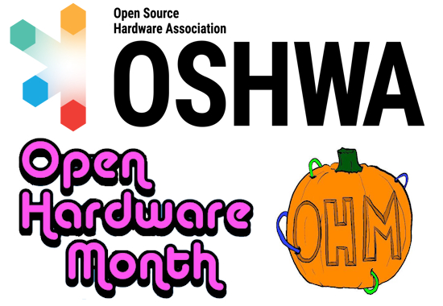](https://oshwa.org/announcements/open-hardware-month-is-coming/)

The Open Source Hardware Association is celebrating Open Hardware Month all October. There will be events and if you certify your open hardware design in October you'll get the official pumpkin spice sticker - [OSHWA](https://oshwa.org/announcements/open-hardware-month-is-coming/).

*Ed: As of last week there are 3,146 registered open source hardware projects.*

## New From Raspberry Pi This Week

### The Raspberry Pi 500+

[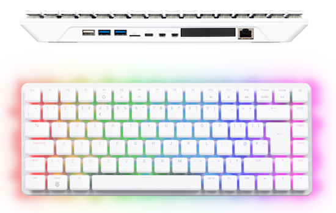](https://www.raspberrypi.com/news/the-ultimate-all-in-one-pc-raspberry-pi-500-plus-on-sale-now-at-200/)

Raspberry Pi has released an upgrade to their all-in-one computer to include a mechanical keyboard with RGB LEDs and (finally) SSD support. Raspberry Pi 500+ is built on the Raspberry Pi 5 platform, featuring a 2.4GHz quad-core Arm Cortex-A76 CPU, dual 4k display output, dual-band WiFi and much more - [Raspberry Pi News](https://www.raspberrypi.com/news/the-ultimate-all-in-one-pc-raspberry-pi-500-plus-on-sale-now-at-200/).

### Raspberry Pi CM0 Castellated Module

[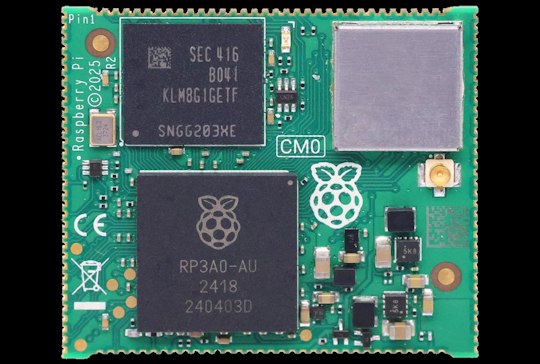](https://www.cnx-software.com/2025/09/23/raspberry-pi-cm0-castellated-module-features-raspberry-pi-rp3a0-system-in-package/)

Raspberry Pi CM0 is a yet-to-be-officially-announced castellated Compute Module based on the Raspberry Pi RP3A0 SiP (System-in-Package) found in the Raspberry Pi Zero 2 W and Raspberry Pi Compute Module 3E (CM3E). Since most Raspberry Pi products are announced under a strict embargo, it's surprising when new Raspberry Pi hardware appears that was never formally introduced - [CNX Software](https://www.cnx-software.com/2025/09/23/raspberry-pi-cm0-castellated-module-features-raspberry-pi-rp3a0-system-in-package/) and [Pi Forums](https://forums.raspberrypi.com/viewtopic.php?t=386639).

### M.2 HAT+ Compact

[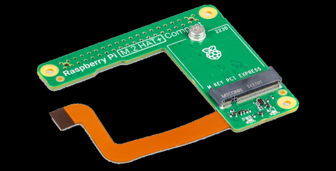](https://www.raspberrypi.com/news/m-2-hat-compact-on-sale-now-at-15/)

The new M.2 HAT+ Compact for Raspberry Pi 5 allows squeezeing a 2230-format (30mm long) M.2 PCI Express card inside an official case, nestled neatly between the fan and the USB connectors - [Raspberry Pi News](https://www.raspberrypi.com/news/m-2-hat-compact-on-sale-now-at-15/).

## The Harsh Truth about FPGAs

[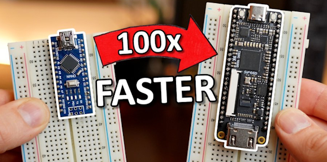](https://www.youtube.com/watch?v=l3d8uFKsJiY)

A close look at a budget friendly FPGA board. FPGAs are super fast and can do pretty much anything when it comes to digital electronics. So they should be way better than microcontrollers, yes? GreatScott! shows you how easy you can use them and why you would often times avoid them - [YouTube](https://www.youtube.com/watch?v=l3d8uFKsJiY).

## BeagleBone Green Eco Receives Refresh with Gigabit Ethernet and 16GB eMMC

[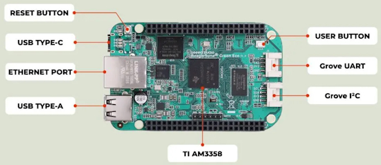](https://linuxgizmos.com/beaglebone-green-eco-receives-refresh-with-gigabit-ethernet-and-16gb-emmc/)

The Seeed Studio BeagleBone Green Eco, built around the Texas Instruments AM3358 processor, now has an ARM Cortex-A8 running at 1 GHz with a NEON SIMD coprocessor and dual-core PRU-ICSS for deterministic, real-time control. It integrates 512 MB of DDR3L RAM and expands onboard storage to 16 GB eMMC, a fourfold increase compared to the earlier BeagleBone Green - [LinuxGizmos](https://linuxgizmos.com/beaglebone-green-eco-receives-refresh-with-gigabit-ethernet-and-16gb-emmc/).

## Feature

text - [site](url).

## Real-Time BLE Air Quality Monitoring with BleuIO, Python and Adafruit IO

This project shows how to turn a BleuIO USB dongle into a tiny gateway that streams live air-quality data from a HibouAir sensor straight to Adafruit IO. The script listens for Bluetooth Low Energy (BLE) advertising packets, decodes CO2, temperature, and humidity, and posts fresh readings via Python to an Adafruit IO feeds every few seconds. The result is a clean, shareable dashboard that updates in real time - [BleuIO](https://www.bleuio.com/blog/real-time-ble-air-quality-monitoring-with-bleuio-and-adafruit-io/).

## This Week's Python Streams

Python on Hardware is all about building a cooperative ecosphere which allows contributions to be valued and to grow knowledge. Below are the streams within the last week focusing on the community.

**CircuitPython Deep Dive Stream**

[Last Friday](link), Tim streamed work on {subject}.

You can see the latest video and past videos on the Adafruit YouTube channel under the Deep Dive playlist - [YouTube](https://www.youtube.com/playlist?list=PLjF7R1fz_OOXBHlu9msoXq2jQN4JpCk8A).

**CircuitPython Parsec**

John Park’s CircuitPython Parsec this week is on {subject} - [Adafruit Blog](link) and [YouTube](link).

Catch all the episodes in the [YouTube playlist](https://www.youtube.com/playlist?list=PLjF7R1fz_OOWFqZfqW9jlvQSIUmwn9lWr).

**CircuitPython Weekly Meeting**

CircuitPython Weekly Meeting for September 22, 2025 ([notes](https://github.com/adafruit/adafruit-circuitpython-weekly-meeting/blob/main/2025/2025-09-22.md)) [on YouTube](https://youtu.be/Xj8ACgoeqss).

## Project of the Week: Pong For the Adafuit Fruit Jam Using CircuitPython Tutorial

Cooper Dalrymple is creating a Pong game for the Fruit Jam using CircuitPython. In the process, Cooper is writing a how-to  on each part to help folks understand how to write games for the platform. It's a work in progress but quite helpful - [GitHub](https://github.com/relic-se/Fruit_Jam_Pong?tab=readme-ov-file) and [Tutorial in progress](https://github.com/relic-se/Fruit_Jam_Pong/blob/main/README-0-Getting-Started.md). Via [X](https://x.com/coopersnout/status/1970517503148499121).

## Popular Last Week

[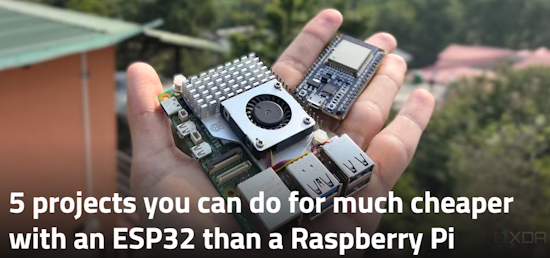](https://www.xda-developers.com/projects-you-can-do-for-much-cheaper-with-an-esp32/)

What was the most popular, most clicked link, in [last week's newsletter](https://www.adafruitdaily.com/2025/09/22/python-on-microcontrollers-newsletter-micropython-v1-26-1-whats-best-for-iot-zork-on-circuitpython-and-more-circuitpython-python-micropython-thepsf-raspberry_pi/)? [5 projects you can do for much cheaper with an ESP32 than a Raspberry Pi](https://www.xda-developers.com/projects-you-can-do-for-much-cheaper-with-an-esp32/).

Did you know you can read past issues of this newsletter in the Adafruit Daily Archive? [Check it out](https://www.adafruitdaily.com/category/circuitpython/).

## New Notes from Adafruit Playground

[Adafruit Playground](https://adafruit-playground.com/) is a new place for the community to post their projects and other making tips/tricks/techniques. Ad-free, it's an easy way to publish your work in a safe space for free.

[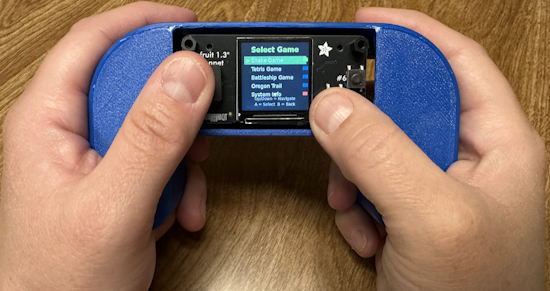](https://adafruit-playground.com/u/johnsonfarms/pages/herman-entertainment-system-pi-zero2w-python-handheld)

The Herman Entertainment System is a handheld gaming system with a Raspberry Pi Zero 2 W and the Adafruit 1.3″ TFT Bonnet. We created a small setup that uses Python and creates a home screen that lists all the games on the device and you simply choose which to play - [Adafruit Playground](https://adafruit-playground.com/u/johnsonfarms/pages/herman-entertainment-system-pi-zero2w-python-handheld).

[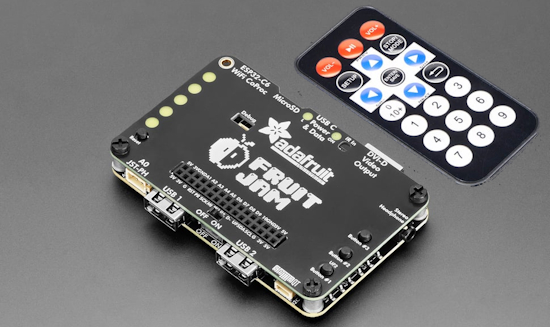](https://adafruit-playground.com/u/danak/pages/fruit-jam-remote-control-the-power-of-the-community)

Fruit Jam Remote Control & the Power of the Community - [Adafruit Playground](https://adafruit-playground.com/u/danak/pages/fruit-jam-remote-control-the-power-of-the-community).

Pill case light to show each day - [Adafruit Playground](https://adafruit-playground.com/u/scenography/pages/pill-case-light-to-show-the-correct-day).

## News From Around the Web

[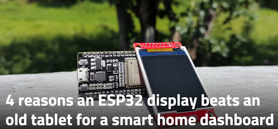](https://www.xda-developers.com/reasons-esp32-display-beats-old-tablet-for-smart-home-dashboard/)

4 reasons an ESP32 display beats an old tablet for a smart home dashboard - [XDA](https://www.xda-developers.com/reasons-esp32-display-beats-old-tablet-for-smart-home-dashboard/).

[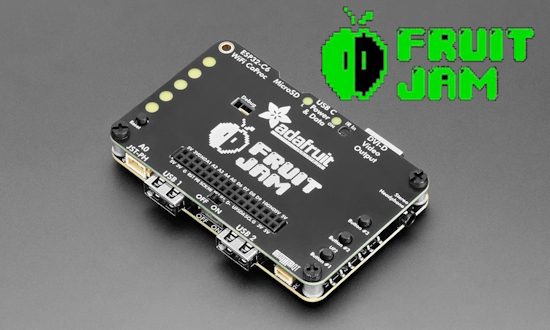](https://github.com/relic-se/Fruit_Jam_Application)

Fruit_Jam_Application is a template for a CircuitPython application for the Adafruit Fruit Jam which is compatible with Fruit Jam OS - [GitHub](https://github.com/relic-se/Fruit_Jam_Application).

Does AI mean the end for the top programming languages? - [IEEE Spectrum](https://spectrum.ieee.org/top-programming-languages-2025) and [i-programmer.info](https://www.i-programmer.info/news/99-professional/18338-python-supreme-in-era-of-ai.html).

text - [site](url).

text - [site](url).

text - [site](url).

text - [site](url).

text - [site](url).

[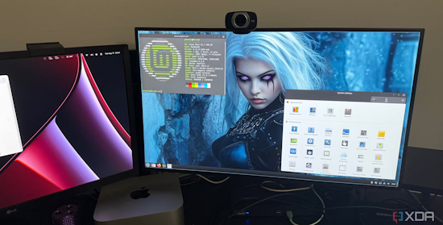](https://www.xda-developers.com/replaced-bash-scripts-python-what-happened/)

I replaced all my bash scripts with Python, and here’s what happened - [XDA](https://www.xda-developers.com/replaced-bash-scripts-python-what-happened/).

text - [site](url).

text - [site](url).

text - [site](url).

text - [site](url).

text - [site](url).

text - [site](url).

text - [site](url).

text - [site](url).

text - [site](url).

## New

[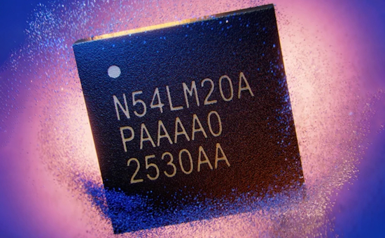](url)

text - [site](url).

[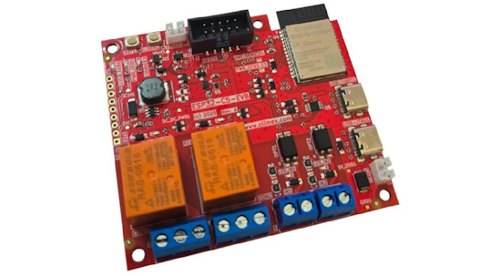](https://www.cnx-software.com/2025/09/19/olimex-esp32-c5-evb-a-dual-band-wifi-6-iot-board-with-relays-opto-isolated-inputs-lipo-battery-support/)

The Olimex ESP32-C5-EVB is an evaluation board built around Espressif’s ESP32-C5-WROOM-N8R4 module with dual-band (2.4/5.0GHz) WiFi 6, Bluetooth 5.0 LE, and 802.15.4 (Zigbee/Thread/Matter) wireless connectivity,  8MB flash, and 4MB PSRAM. - [CNX Software](https://www.cnx-software.com/2025/09/19/olimex-esp32-c5-evb-a-dual-band-wifi-6-iot-board-with-relays-opto-isolated-inputs-lipo-battery-support/).

## New Boards Supported by CircuitPython

The number of supported microcontrollers and Single Board Computers (SBC) grows every week. This section outlines which boards have been included in CircuitPython or added to [CircuitPython.org](https://circuitpython.org/).

This week there were (#/no) new boards added:

- [Board name](url)
- [Board name](url)
- [Board name](url)

*Note: For non-Adafruit boards, please use the support forums of the board manufacturer for assistance, as Adafruit does not have the hardware to assist in troubleshooting.*

Looking to add a new board to CircuitPython? It's highly encouraged! Adafruit has four guides to help you do so:

- [How to Add a New Board to CircuitPython](https://learn.adafruit.com/how-to-add-a-new-board-to-circuitpython/overview)
- [How to add a New Board to the circuitpython.org website](https://learn.adafruit.com/how-to-add-a-new-board-to-the-circuitpython-org-website)
- [Adding a Single Board Computer to PlatformDetect for Blinka](https://learn.adafruit.com/adding-a-single-board-computer-to-platformdetect-for-blinka)
- [Adding a Single Board Computer to Blinka](https://learn.adafruit.com/adding-a-single-board-computer-to-blinka)

## New Learn Guides

[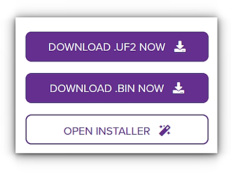](https://learn.adafruit.com/guides/latest)

The Adafruit Learning System has over 3,200 free guides for learning skills and building projects including using Python.

[title](url) from [name](url)

[title](url) from [name](url)

[title](url) from [name](url)

## Updated Learn Guides

[title](url)

## CircuitPython Libraries

The CircuitPython library numbers are continually increasing, while existing ones continue to be updated. Here we provide library numbers and updates!

To get the latest Adafruit libraries, download the [Adafruit CircuitPython Library Bundle](https://circuitpython.org/libraries). To get the latest community contributed libraries, download the [CircuitPython Community Bundle](https://circuitpython.org/libraries).

If you'd like to contribute to the CircuitPython project on the Python side of things, the libraries are a great place to start. Check out the [CircuitPython.org Contributing page](https://circuitpython.org/contributing). If you're interested in reviewing, check out Open Pull Requests. If you'd like to contribute code or documentation, check out Open Issues. We have a guide on [contributing to CircuitPython with Git and GitHub](https://learn.adafruit.com/contribute-to-circuitpython-with-git-and-github), and you can find us in the #help-with-circuitpython and #circuitpython-dev channels on the [Adafruit Discord](https://adafru.it/discord).

You can check out this [list of all the Adafruit CircuitPython libraries and drivers available](https://github.com/adafruit/Adafruit_CircuitPython_Bundle/blob/master/circuitpython_library_list.md). 

The current number of CircuitPython libraries is **###**!

**New Libraries**

Here are this week's new CircuitPython libraries:

* [library](url)

**Updated Libraries**

Here are this week's updated CircuitPython libraries:

* [library](url)

## What’s the CircuitPython team up to this week?

What is the team up to this week? Let’s check in:

**Dan**

text.

**Tim**

This week the RPi sensor data LLM project guide went live. I also worked on the CircuitPython driver for the SPA06-003. I was having trouble for a while getting the wrong values from the sensor for temperature and pressure. After comparing the Arduino driver bus traffic with the CircuitPython traffic, I realized the difference was not correctly setting the bit shift functionality in the chip, which is required for large oversampling rates. After the I got the driver working and published, I finished up the remaining guide pages for this breakout.

**Scott**

This week I chatted with Dan about getting 10.0.0 released as stable. We're super close! I fixed an issue with using PSRAM buffers for USB host. Otherwise, I'm slowly working my way through an ESP IDF update that will likely be released as 10.1.0.

**Liz**

This week I worked on documenting the new [E-Ink Bonnet](https://learn.adafruit.com/adafruit-e-ink-bonnet-for-raspberry-pi/). This Bonnet plugs into your Raspberry Pi and lets you connect bare E-Ink displays to it. This board will make using the larger bare displays with Raspberry Pi a lot easier and open up a lot of projects.

## Upcoming Events

The next MicroPython Meetup in Melbourne will be on October 24th – [Meetup](https://www.meetup.com/micropython-meetup/events). You can see recordings of previous meetings on [YouTube](https://www.youtube.com/@MicroPythonOfficial). 

The Hackaday Superconference is back! Join this global conference of hardware hackers, makers, and tech enthusiasts this Oct 31st - Nov 2nd in Pasadena, California - [Eventbrite](https://www.eventbrite.com/e/2025-hackaday-superconference-tickets-1505260116529).

The final KiCad conference (KiCon) will be 15 November, 2025 in Shenzhen, China - [KiCad](https://kicon.kicad.org/).

PyLadiesCon returns December 5–7, 2025. 100% online conference designed for our global community. Talks, workshops, panels, and community fun – [PyLadies](https://conference.pyladies.com/2025-pyladiescon-is-back/).

**Send Your Events In**

If you know of virtual events or upcoming events, please let us know via email to cpnews(at)adafruit(dot)com.

## Latest Releases

CircuitPython's stable release is [#.#.#](https://github.com/adafruit/circuitpython/releases/latest) and its unstable release is [#.#.#-##.#](https://github.com/adafruit/circuitpython/releases). New to CircuitPython? Start with our [Welcome to CircuitPython Guide](https://learn.adafruit.com/welcome-to-circuitpython).

[2025####](https://github.com/adafruit/Adafruit_CircuitPython_Bundle/releases/latest) is the latest Adafruit CircuitPython library bundle.

[2025####](https://github.com/adafruit/CircuitPython_Community_Bundle/releases/latest) is the latest CircuitPython Community library bundle.

[v#.#.#](https://micropython.org/download) is the latest MicroPython release. Documentation for it is [here](http://docs.micropython.org/en/latest/pyboard/).

[#.#.#](https://www.python.org/downloads/) is the latest Python release. The latest pre-release version is [#.#.#](https://www.python.org/download/pre-releases/).

[#,### Stars](https://github.com/adafruit/circuitpython/stargazers) Like CircuitPython? [Star it on GitHub!](https://github.com/adafruit/circuitpython)

## Call for Help -- Translating CircuitPython is now easier than ever

[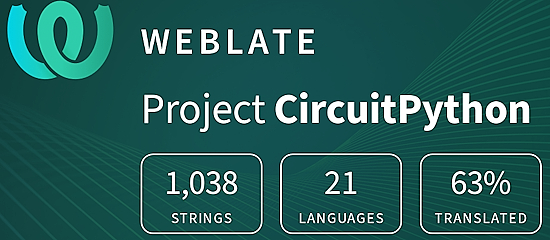](https://hosted.weblate.org/engage/circuitpython/)

One important feature of CircuitPython is translated control and error messages. With the help of fellow open source project [Weblate](https://weblate.org/), we're making it even easier to add or improve translations. 

Sign in with an existing account such as GitHub, Google or Facebook and start contributing through a simple web interface. No forks or pull requests needed! As always, if you run into trouble join us on [Discord](https://adafru.it/discord), we're here to help.

## NUMBER Thanks

The Adafruit Discord community, where we do all our CircuitPython development in the open, reached over NUMBER humans - thank you! Adafruit believes Discord offers a unique way for Python on hardware folks to connect. Join today at [https://adafru.it/discord](https://adafru.it/discord).

## ICYMI - In case you missed it

Python on hardware is the Adafruit Python video-newsletter-podcast! The news comes from the Python community, Discord, Adafruit communities and more and is broadcast on ASK an ENGINEER Wednesdays. The complete Python on Hardware weekly videocast [playlist is here](https://www.youtube.com/playlist?list=PLjF7R1fz_OOXRMjM7Sm0J2Xt6H81TdDev). The video podcast is on [iTunes](https://itunes.apple.com/us/podcast/python-on-hardware/id1451685192?mt=2), [YouTube](http://adafru.it/pohepisodes), [Instagram](https://www.instagram.com/adafruit/channel/)), and [XML](https://itunes.apple.com/us/podcast/python-on-hardware/id1451685192?mt=2).

[The weekly community chat on Adafruit Discord server CircuitPython channel - Audio / Podcast edition](https://itunes.apple.com/us/podcast/circuitpython-weekly-meeting/id1451685016) - Audio from the Discord chat space for CircuitPython, meetings are usually Mondays at 2pm ET, this is the audio version on [iTunes](https://itunes.apple.com/us/podcast/circuitpython-weekly-meeting/id1451685016), Pocket Casts, [Spotify](https://adafru.it/spotify), and [XML feed](https://adafruit-podcasts.s3.amazonaws.com/circuitpython_weekly_meeting/audio-podcast.xml).

## Contribute

The CircuitPython Weekly Newsletter is a CircuitPython community-run newsletter emailed every Monday. The complete [archives are here](https://www.adafruitdaily.com/category/circuitpython/). It highlights the latest CircuitPython related news from around the web including Python and MicroPython developments. To contribute, edit next week's draft [on GitHub](https://github.com/adafruit/circuitpython-weekly-newsletter/tree/gh-pages/_drafts) and [submit a pull request](https://help.github.com/articles/editing-files-in-your-repository/) with the changes. You may also tag your information on Twitter with #CircuitPython. 

Join the Adafruit [Discord](https://adafru.it/discord) or [post to the forum](https://forums.adafruit.com/viewforum.php?f=60) if you have questions.
