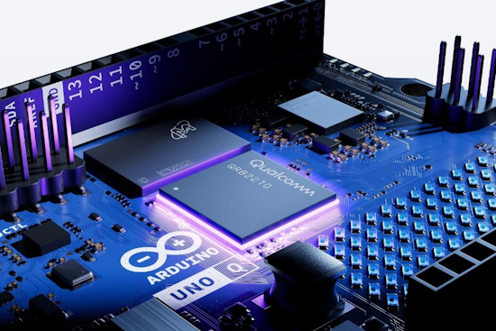
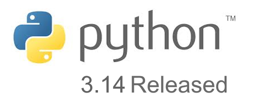
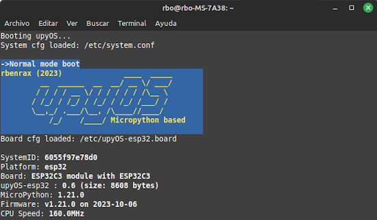
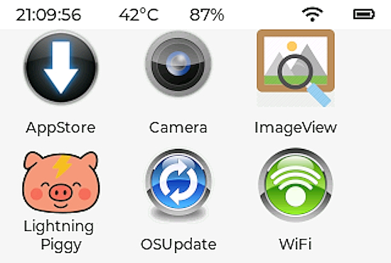
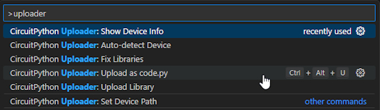
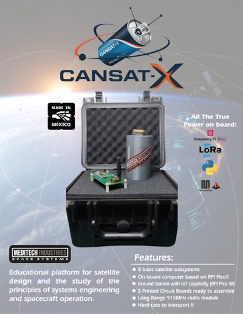
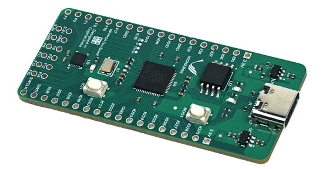
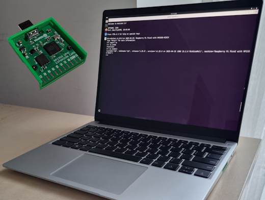
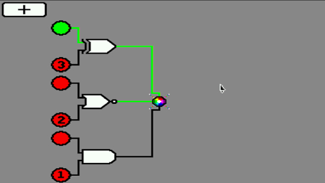
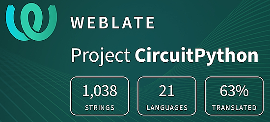

- [ ] Library and info updates
- [ ] change date
- [ ] update title
- [ ] Feature story
- [ ] Update  for images
- [ ] Update ICYDNCI
- [ ] All images 550w max only
- [ ] Link "View this email in your browser."

News Sources

- [Adafruit Playground](https://adafruit-playground.com/)
- Twitter: [CircuitPython](https://twitter.com/search?q=circuitpython&src=typed_query&f=live), [MicroPython](https://twitter.com/search?q=micropython&src=typed_query&f=live) and [Python](https://twitter.com/search?q=python&src=typed_query)
- [Raspberry Pi News](https://www.raspberrypi.com/news/)
- Mastodon [CircuitPython](https://mastodon.social/tags/CircuitPython) and [MicroPython](https://mastodon.social/tags/MicroPython)
- [hackster.io CircuitPython](https://www.hackster.io/search?q=circuitpython&i=projects&sort_by=most_recent) and [MicroPython](https://www.hackster.io/search?q=micropython&i=projects&sort_by=most_recent)
- YouTube: [CircuitPython](https://www.youtube.com/results?search_query=circuitpython&sp=CAI%253D), [MicroPython](https://www.youtube.com/results?search_query=micropython&sp=CAI%253D), [Prof Gallaugher](https://www.youtube.com/@BuildWithProfG/videos), [Teacher Brogan M. Pratt CircuitPython](https://www.youtube.com/playlist?list=PLRHdgFNRLyaN6eCw8b0yoHKDY9B4GiirU)
- [Google News Python](https://news.google.com/topics/CAAqIQgKIhtDQkFTRGdvSUwyMHZNRFY2TVY4U0FtVnVLQUFQAQ?hl=en-US&gl=US&ceid=US%3Aen)
- [maker.io Python](https://www.digikey.com/en/maker/search-results?t=python)
- Instructables: [CircuitPython](https://www.instructables.com/search/?q=circuitpython&projects=all&sort=Newest), [MicroPython](https://www.instructables.com/search/?q=micropython&projects=all&sort=Newest), [Raspberry Pi Python](https://www.instructables.com/search/?q=raspberry+pi+python&projects=all&sort=Newest)
- [hackaday CircuitPython](https://hackaday.com/blog/?s=circuitpython) and [MicroPython](https://hackaday.com/blog/?s=micropython)
- [python.org](https://www.python.org/)
- [Python Insider - dev team blog](https://pythoninsider.blogspot.com/)
- Individuals: [bret.dk](https://bret.dk/), [Jeff Geerling](https://www.jeffgeerling.com/blog), [Yakroo](https://x.com/Yakroo5077)
- Tom's Hardware: [CircuitPython](https://www.tomshardware.com/search?searchTerm=circuitpython&articleType=all&sortBy=publishedDate) and [MicroPython](https://www.tomshardware.com/search?searchTerm=micropython&articleType=all&sortBy=publishedDate) and [Raspberry Pi](https://www.tomshardware.com/search?searchTerm=raspberry%20pi&articleType=all&sortBy=publishedDate)
- [hackaday.io newest projects MicroPython](https://hackaday.io/projects?tag=micropython&sort=date) and [CircuitPython](https://hackaday.io/projects?tag=circuitpython&sort=date)
- hackaday.io - [CircuitPython](https://hackaday.io/search?term=circuitpython) and [MicroPython](https://hackaday.io/search?term=micropython)

View this email in your browser. **Warning: Flashing Imagery**

Welcome to the latest Python on Microcontrollers newsletter! *insert 2-3 sentences from editor (what's in overview, banter)* - *Anne Barela, Editor*

We're on [Discord](https://discord.gg/HYqvREz), [Twitter/X](https://twitter.com/search?q=circuitpython&src=typed_query&f=live), [BlueSky](https://bsky.app/profile/circuitpython.org) and for past newsletters - [view them all here](https://www.adafruitdaily.com/category/circuitpython/). If you're reading this on the web, please [subscribe here](https://www.adafruitdaily.com/). Here's the news this week:

## Qualcomm Buys Arduino and Releases a New Raspberry Pi-esque Arduino Board

Smartphone processor and modem maker Qualcomm is acquiring Arduino, the Italian company known mainly for its (mostly) open source ecosystem of microcontrollers and the software that makes them function. In its announcement, Qualcomm said that Arduino would "[retain] its brand and mission," including its "open source ethos" and "support for multiple silicon vendors." 

The first fruit of this pending acquisition will be the Arduino Uno Q, a Qualcomm-based single-board computer with a Qualcomm Dragonwing QRB2210 processor installed. The QRB2210 includes a quad-core Arm Cortex-A53 CPU and a Qualcomm Adreno 702 GPU, plus WiFi and Bluetooth connectivity, similar in concept to former Arduino Edison and Yun boards - [Make](https://makezine.com/article/technology/arduino/live-arduino-announce-uno-q-app-lab-and-qualcomm-acquisition/), [Ars Technica](https://arstechnica.com/gadgets/2025/10/arduino-retains-its-brand-and-mission-following-acquisition-by-qualcomm/) and [Tom's Hardware](https://www.tomshardware.com/tech-industry/qualcomm-acquires-arduino-to-make-ai-development-more-accessible-microcontroller-makers-hardware-becomes-the-foundation-of-mobile-tech-giants-edge-ai-stack).

**Community Commentary**

* "Arduino: From Blink to Think …or blink once for open source, twice for AI" - [Adafruit](https://blog.adafruit.com/2025/09/28/arduino-from-blink-to-think-or-blink-once-for-open-source-twice-for-ai/).
* Qualcomm's buying Arduino – what it means for makers - [Jeff Geerling](https://www.jeffgeerling.com/blog/2025/qualcomms-buying-arduino-%E2%80%93-what-it-means-makers) and [YouTube](https://youtu.be/CfKX616-nsE).

## Python 3.14 Released

Python 3.14 is now available as the newest annual major feature release for the Python programming language. It delivers on official support for the free-threaded Python code path, a new Zstd compression module, various performance improvements, a zero-overhead external debugger for Python, C API improvements, enhanced error messages a new opt-in interpreter, T-strings and many other enhancements - [Phoronix](https://www.phoronix.com/news/Python-3.14) and [How-To Geek](https://www.howtogeek.com/python-314-has-arrived-with-t-string-support/).

## Feature

text - [site](url).

## Focus: MicroPython Operating Systems

Two very new projects have similar goals: to be a MicroPython-based operating system. upyOS is more Unix oriented while MicroPythonOS provides a small GUI.

### upyOS: a Modular Flash Operating System for Microcontrollers Based on Micropython

upyOS is a modular, lightweight MicroPython-based operating system (OS) that provides a Unix-like experience on low-resource microcontrollers such as Espressif Systems ESP32/ESP32-C3/ESP32-S3, Raspberry Pi RP2040, and others. Inspired by [smolOS](https://www.cnx-software.com/2023/07/12/smolos-brings-a-linux-like-command-line-interface-to-esp8266-microcontroller/), upyOS offers remote development tools, OTA updates, and a built-in web server. Its modular architecture separates system functions into reusable components, instead of large, monolithic programs. It's available under an MIT license - [CNX](https://www.cnx-software.com/2025/10/09/upyos-modular-micropython-based-os-for-microcontrollers-esp32-rp2040/) and [GitHub](https://github.com/rbenrax/upyOS).

### MicroPythonOS

MicroPythonOS is a lightweight, fast, and versatile operating system designed to run on microcontrollers like the ESP32 and desktop systems. With a modern Android-like touch screen UI, App Store, and Over-The-Air updates, it’s billed as the perfect OS for innovators and developers - [MicroPythonOS.com](https://micropythonos.com/) and [GitHub](https://github.com/MicroPythonOS/MicroPythonOS). Via [X](https://x.com/john_chandler/status/1976185191669661937).

## Feature

text - [site](url).

## Maker Faire Rome Returns 17-19 October, 2025

Maker Faire Rome is coming up this week. While the big news will likely be the Arduino acquisition, Microchip will be there with demonstrations including with CircuitPython - [MakerFaireRome](https://makerfairerome.eu/en/blog/microchip-technology-innovation-creativity-and-technologies-for-makers/).

## This Week's Python Streams

Python on Hardware is all about building a cooperative ecosphere which allows contributions to be valued and to grow knowledge. Below are the streams within the last week focusing on the community.

**CircuitPython Deep Dive Stream**

[Last Friday](link), Tim streamed work on {subject}.

You can see the latest video and past videos on the Adafruit YouTube channel under the Deep Dive playlist - [YouTube](https://www.youtube.com/playlist?list=PLjF7R1fz_OOXBHlu9msoXq2jQN4JpCk8A).

**CircuitPython Parsec**

John Park’s CircuitPython Parsec this week is on {subject} - [Adafruit Blog](link) and [YouTube](link).

Catch all the episodes in the [YouTube playlist](https://www.youtube.com/playlist?list=PLjF7R1fz_OOWFqZfqW9jlvQSIUmwn9lWr).

In the latest episode of The CircuitPython Show released October 13th, Noe Ruiz of Adafruit Industries joins the show.  Noe and Paul discuss how Noe got started with design and 3D modeling, the Layer by Layer tutorials Noe created, and more. - [The CircuitPython Show](https://www.circuitpythonshow.com/@circuitpythonshow).

**CircuitPython Weekly Meeting**

CircuitPython Weekly Meeting for October 6, 2025 ([notes](https://github.com/adafruit/adafruit-circuitpython-weekly-meeting/blob/main/2025/2025-10-06.md)) [on YouTube](https://www.youtube.com/watch?v=V3mWvakfeHA).

## Project of the Week: CircuitPython Uploader

CircuitPython Uploader is an open source VS Code extension for uploading code and managing libraries on CircuitPython devices - [GitHub](https://github.com/MakerClassCZ/circuitpython-uploader). Via [X](https://x.com/MakerClassCZ/status/1976321040281411668).

## Popular Last Week

What was the most popular, most clicked link, in [last week's newsletter](https://www.adafruitdaily.com/2025/10/06/python-on-microcontrollers-newsletter-all-new-circuitpython-10-and-raspi-os-trixie-ram-flash-shortages-and-more-circuitpython-python-micropython-thepsf-raspberry_pi/)? [4 tiny single-board computers that outclass the Raspberry Pi](https://www.xda-developers.com/single-board-computers-that-outclass-the-raspberry-pi/).

Did you know you can read past issues of this newsletter in the Adafruit Daily Archive? [Check it out](https://www.adafruitdaily.com/category/circuitpython/).

## New Notes from Adafruit Playground

[Adafruit Playground](https://adafruit-playground.com/) is a new place for the community to post their projects and other making tips/tricks/techniques. Ad-free, it's an easy way to publish your work in a safe space for free.

text - [Adafruit Playground](url).

text - [Adafruit Playground](url).

text - [Adafruit Playground](url).

## News From Around the Web

CanSat-X is a complete educational satellite, made in Mexico by [Meditech Industries](https://meditechindustries.com/) Space Systems. Each CanSat-X includes a functioning satellite with sensors, GPS, and LoRa radio. A ground station with software ready for communications and telemetry. Programming in MicroPython on a Raspberry Pi Pico 2. Delivered in a professional-grade, waterproof carrying case - [X](https://x.com/elprofe_tellez/status/1975970162508693937).

text - [site](url).

The latest stats for this newsletter have been published - [Adafruit Blog](https://blog.adafruit.com/2025/10/07/statistics-on-the-python-on-microcontrollers-newsletter-for-2025-q3-circuitpython-python-micropython-adafruit/).

Dan Cogliano demonstrates another game in progress, this time it's a rocket lander game for the Adafruit Fruit Jam in CircuitPython - [BlueSky](https://bsky.app/profile/cogliano.bsky.social/post/3m2m577fua22d).

text - [site](url).

text - [site](url).

text - [site](url).

8 practical uses for the Python os module - [How-To Geek](https://www.howtogeek.com/practical-uses-for-python-os-module/).

text - [site](url).

text - [site](url).

text - [site](url).

text - [site](url).

text - [site](url).

text - [site](url).

text - [site](url).

Polymorphic Python malware that mutates every time it runs - [gbhackers](https://gbhackers.com/polymorphic-python-malware/).

12 open-source tools I use every day on my Mac - [How-To Geek](https://www.howtogeek.com/open-source-tools-i-use-every-day-on-my-mac/).

text - [site](url).

## New

Shrike-Lite combines an MCU (RP2040) with an FPGA (ForgeFPGA – 1K LUT) on a single board for just $4 - [X](https://x.com/Vicharak_In/status/1975787181156237497).

text - [site](url).

## New Boards Supported by CircuitPython

The number of supported microcontrollers and Single Board Computers (SBC) grows every week. This section outlines which boards have been included in CircuitPython or added to [CircuitPython.org](https://circuitpython.org/).

This week there were (#/no) new boards added:

- [Board name](url)
- [Board name](url)
- [Board name](url)

*Note: For non-Adafruit boards, please use the support forums of the board manufacturer for assistance, as Adafruit does not have the hardware to assist in troubleshooting.*

Looking to add a new board to CircuitPython? It's highly encouraged! Adafruit has four guides to help you do so:

- [How to Add a New Board to CircuitPython](https://learn.adafruit.com/how-to-add-a-new-board-to-circuitpython/overview)
- [How to add a New Board to the circuitpython.org website](https://learn.adafruit.com/how-to-add-a-new-board-to-the-circuitpython-org-website)
- [Adding a Single Board Computer to PlatformDetect for Blinka](https://learn.adafruit.com/adding-a-single-board-computer-to-platformdetect-for-blinka)
- [Adding a Single Board Computer to Blinka](https://learn.adafruit.com/adding-a-single-board-computer-to-blinka)

## New Learn Guides

The Adafruit Learning System has over 3,200 free guides for learning skills and building projects including using Python.

[title](url) from [name](url)

[title](url) from [name](url)

[title](url) from [name](url)

## Updated Learn Guides

[title](url)

## CircuitPython Libraries

The CircuitPython library numbers are continually increasing, while existing ones continue to be updated. Here we provide library numbers and updates!

To get the latest Adafruit libraries, download the [Adafruit CircuitPython Library Bundle](https://circuitpython.org/libraries). To get the latest community contributed libraries, download the [CircuitPython Community Bundle](https://circuitpython.org/libraries).

If you'd like to contribute to the CircuitPython project on the Python side of things, the libraries are a great place to start. Check out the [CircuitPython.org Contributing page](https://circuitpython.org/contributing). If you're interested in reviewing, check out Open Pull Requests. If you'd like to contribute code or documentation, check out Open Issues. We have a guide on [contributing to CircuitPython with Git and GitHub](https://learn.adafruit.com/contribute-to-circuitpython-with-git-and-github), and you can find us in the #help-with-circuitpython and #circuitpython-dev channels on the [Adafruit Discord](https://adafru.it/discord).

You can check out this [list of all the Adafruit CircuitPython libraries and drivers available](https://github.com/adafruit/Adafruit_CircuitPython_Bundle/blob/master/circuitpython_library_list.md).

The current number of CircuitPython libraries is **###**!

**New Libraries**

Here are this week's new CircuitPython libraries:

* [library](url)

**Updated Libraries**

Here are this week's updated CircuitPython libraries:

* [library](url)

## What’s the CircuitPython team up to this week?

What is the team up to this week? Let’s check in:

**Dan**

text.

**Tim**

The refactoring that I was doing in the Register library is merged now and this week I iterated on the SPA06_003 driver PR based on discussions with Scott and Dan. I've also been working the logic gates simulator mentioned last week. The code is complete and I'm in the process of writing the guide. I showed it in action this week on show and tell. Here is a screenshot from it.

**Scott**

This last week I mostly did reviews for others. I also did a quick driver for the quad color 3.52" epaper display. I made a little progress testing the ESP IDF update but the C6 continues to boot loop. :-/ Next week I'm out of town so I won't be working.

**Liz**

This week I've been working on a guide for all of the bare eInk displays in the shop. Each display has its own page with example code for using them with Arduino, CircuitPython displayio and Python. It's been a big lift, but I think it will be a really helpful guide. It has also served as a way to double check that all of the drivers have been written for these chipsets and tested with hardware. Big thanks to Scott for writing up a CircuitPython displayio driver for the 3.52" quad-color display.

## Upcoming Events

The next MicroPython Meetup in Melbourne will be on October 22th – [Meetup](https://www.meetup.com/micropython-meetup/events). You can see recordings of previous meetings on [YouTube](https://www.youtube.com/@MicroPythonOfficial).

The Hackaday Superconference is back! Join this global conference of hardware hackers, makers, and tech enthusiasts this Oct 31st - Nov 2nd in Pasadena, California - [Eventbrite](https://www.eventbrite.com/e/2025-hackaday-superconference-tickets-1505260116529).

The final KiCad conference (KiCon) will be 15 November, 2025 in Shenzhen, China - [KiCad](https://kicon.kicad.org/).

PyLadiesCon returns December 5–7, 2025. 100% online conference designed for our global community. Talks, workshops, panels, and community fun – [PyLadies](https://conference.pyladies.com/2025-pyladiescon-is-back/).

**Send Your Events In**

If you know of virtual events or upcoming events, please let us know via email to cpnews(at)adafruit(dot)com.

## Latest Releases

CircuitPython's stable release is [#.#.#](https://github.com/adafruit/circuitpython/releases/latest) and its unstable release is [#.#.#-##.#](https://github.com/adafruit/circuitpython/releases). New to CircuitPython? Start with our [Welcome to CircuitPython Guide](https://learn.adafruit.com/welcome-to-circuitpython).

[2025####](https://github.com/adafruit/Adafruit_CircuitPython_Bundle/releases/latest) is the latest Adafruit CircuitPython library bundle.

[2025####](https://github.com/adafruit/CircuitPython_Community_Bundle/releases/latest) is the latest CircuitPython Community library bundle.

[v#.#.#](https://micropython.org/download) is the latest MicroPython release. Documentation for it is [here](http://docs.micropython.org/en/latest/pyboard/).

[#.#.#](https://www.python.org/downloads/) is the latest Python release. The latest pre-release version is [#.#.#](https://www.python.org/download/pre-releases/).

[#,### Stars](https://github.com/adafruit/circuitpython/stargazers) Like CircuitPython? [Star it on GitHub!](https://github.com/adafruit/circuitpython)

## Call for Help -- Translating CircuitPython is now easier than ever

One important feature of CircuitPython is translated control and error messages. With the help of fellow open source project [Weblate](https://weblate.org/), we're making it even easier to add or improve translations.

Sign in with an existing account such as GitHub, Google or Facebook and start contributing through a simple web interface. No forks or pull requests needed! As always, if you run into trouble join us on [Discord](https://adafru.it/discord), we're here to help.

## NUMBER Thanks

The Adafruit Discord community, where we do all our CircuitPython development in the open, reached over NUMBER humans - thank you! Adafruit believes Discord offers a unique way for Python on hardware folks to connect. Join today at [https://adafru.it/discord](https://adafru.it/discord).

## ICYMI - In case you missed it

Python on hardware is the Adafruit Python video-newsletter-podcast! The news comes from the Python community, Discord, Adafruit communities and more and is broadcast on ASK an ENGINEER Wednesdays. The complete Python on Hardware weekly videocast [playlist is here](https://www.youtube.com/playlist?list=PLjF7R1fz_OOXRMjM7Sm0J2Xt6H81TdDev). The video podcast is on [iTunes](https://itunes.apple.com/us/podcast/python-on-hardware/id1451685192?mt=2), [YouTube](http://adafru.it/pohepisodes), [Instagram](https://www.instagram.com/adafruit/channel/)), and [XML](https://itunes.apple.com/us/podcast/python-on-hardware/id1451685192?mt=2).

[The weekly community chat on Adafruit Discord server CircuitPython channel - Audio / Podcast edition](https://itunes.apple.com/us/podcast/circuitpython-weekly-meeting/id1451685016) - Audio from the Discord chat space for CircuitPython, meetings are usually Mondays at 2pm ET, this is the audio version on [iTunes](https://itunes.apple.com/us/podcast/circuitpython-weekly-meeting/id1451685016), Pocket Casts, [Spotify](https://adafru.it/spotify), and [XML feed](https://adafruit-podcasts.s3.amazonaws.com/circuitpython_weekly_meeting/audio-podcast.xml).

## Contribute

The CircuitPython Weekly Newsletter is a CircuitPython community-run newsletter emailed every Monday. The complete [archives are here](https://www.adafruitdaily.com/category/circuitpython/). It highlights the latest CircuitPython related news from around the web including Python and MicroPython developments. To contribute, edit next week's draft [on GitHub](https://github.com/adafruit/circuitpython-weekly-newsletter/tree/gh-pages/_drafts) and [submit a pull request](https://help.github.com/articles/editing-files-in-your-repository/) with the changes. You may also tag your information on Twitter with #CircuitPython.

Join the Adafruit [Discord](https://adafru.it/discord) or [post to the forum](https://forums.adafruit.com/viewforum.php?f=60) if you have questions.
