- [ ] Library and info updates
- [ ] change date
- [ ] update title
- [ ] Feature story
- [ ] Update  for images
- [ ] Update ICYDNCI
- [ ] All images 550w max only
- [ ] Link "View this email in your browser."

News Sources

- [Adafruit Playground](https://adafruit-playground.com/)
- Twitter: [CircuitPython](https://twitter.com/search?q=circuitpython&src=typed_query&f=live), [MicroPython](https://twitter.com/search?q=micropython&src=typed_query&f=live) and [Python](https://twitter.com/search?q=python&src=typed_query)
- [Raspberry Pi News](https://www.raspberrypi.com/news/)
- Mastodon [CircuitPython](https://mastodon.social/tags/CircuitPython) and [MicroPython](https://mastodon.social/tags/MicroPython)
- [hackster.io CircuitPython](https://www.hackster.io/search?q=circuitpython&i=projects&sort_by=most_recent) and [MicroPython](https://www.hackster.io/search?q=micropython&i=projects&sort_by=most_recent)
- YouTube: [CircuitPython](https://www.youtube.com/results?search_query=circuitpython&sp=CAI%253D), [MicroPython](https://www.youtube.com/results?search_query=micropython&sp=CAI%253D), [Prof Gallaugher](https://www.youtube.com/@BuildWithProfG/videos), [Teacher Brogan M. Pratt CircuitPython](https://www.youtube.com/playlist?list=PLRHdgFNRLyaN6eCw8b0yoHKDY9B4GiirU)
- [Google News Python](https://news.google.com/topics/CAAqIQgKIhtDQkFTRGdvSUwyMHZNRFY2TVY4U0FtVnVLQUFQAQ?hl=en-US&gl=US&ceid=US%3Aen)
- [maker.io Python](https://www.digikey.com/en/maker/search-results?t=python)
- Instructables: [CircuitPython](https://www.instructables.com/search/?q=circuitpython&projects=all&sort=Newest), [MicroPython](https://www.instructables.com/search/?q=micropython&projects=all&sort=Newest), [Raspberry Pi Python](https://www.instructables.com/search/?q=raspberry+pi+python&projects=all&sort=Newest)
- [hackaday CircuitPython](https://hackaday.com/blog/?s=circuitpython) and [MicroPython](https://hackaday.com/blog/?s=micropython)
- [python.org](https://www.python.org/)
- [Python Insider - dev team blog](https://pythoninsider.blogspot.com/)
- Individuals: [bret.dk](https://bret.dk/), [Jeff Geerling](https://www.jeffgeerling.com/blog), [Yakroo](https://x.com/Yakroo5077)
- Tom's Hardware: [CircuitPython](https://www.tomshardware.com/search?searchTerm=circuitpython&articleType=all&sortBy=publishedDate) and [MicroPython](https://www.tomshardware.com/search?searchTerm=micropython&articleType=all&sortBy=publishedDate) and [Raspberry Pi](https://www.tomshardware.com/search?searchTerm=raspberry%20pi&articleType=all&sortBy=publishedDate)
- [hackaday.io newest projects MicroPython](https://hackaday.io/projects?tag=micropython&sort=date) and [CircuitPython](https://hackaday.io/projects?tag=circuitpython&sort=date)
- hackaday.io - [CircuitPython](https://hackaday.io/search?term=circuitpython) and [MicroPython](https://hackaday.io/search?term=micropython)

View this email in your browser. **Warning: Flashing Imagery**

Welcome to the latest Python on Microcontrollers newsletter! *insert 2-3 sentences from editor (what's in overview, banter)* - *Anne Barela, Editor*

We're on [Discord](https://discord.gg/HYqvREz), [Twitter/X](https://twitter.com/search?q=circuitpython&src=typed_query&f=live), [BlueSky](https://bsky.app/profile/circuitpython.org) and for past newsletters - [view them all here](https://www.adafruitdaily.com/category/circuitpython/). If you're reading this on the web, please [subscribe here](https://www.adafruitdaily.com/). Here's the news this week:

## Headline

text - [site](url).

## CircuitPython 10.0.2 Released

CircuitPython 10.0.2, the latest bugfix revision of CircuitPython, and is a new stable release - [Adafruit Blog](url) and release notes - [GitHub](https://github.com/adafruit/circuitpython/releases/tag/10.0.2).

**Highlights of this Release**

- Fix SPI DMA on `atmel-samd` boards, which fixes SD card mounting problems.
- Restore SD card USB presentation on `atmel-samd` boards.
- No changes in this release for non-`atmel-samd` boards.

## Evaluating the Arduino Acquisition

The community is now evaluatinng the Qualcomm acquisation of Arduino last week. The implications on open source, focus on processors going forward, software development tools and more. Will Arduino's embracing MicroPython for microcontrollers still hold, or will Python on Linux take a predominent role?

### EYE on NPI – Qualcomm & Arduino UNO Q Microcontroller Board

Adafruit's Limor Fried takes a detailed look at the new Arduino Uno Q - [Adafruit Blog](https://blog.adafruit.com/2025/10/17/eye-on-npi-qualcomm-arduino-uno-q-microcontroller-board-digikey-arduino-adafruit/).

### Qualcomm Solders Arduino to its Edge AI Ambitions, Debuts Raspberry Pi Rival

Qualcomm acquiring Arduino, maker of microcontrollers (and now single-board computers), is a move designed to boost its presence in edge computing, as evidenced by a new Arduino product based on one of its Dragonwing chips - [The Register](https://www.theregister.com/2025/10/07/qualcomm_arduino_acquisition/).

> "This indicates that Qualcomm sees its acquisition of Arduino as a way to push its AI models and hardware into lots of edge devices, which are predicted to be a key area for AI deployment."

## Exploring the Arduino App Lab Binary

[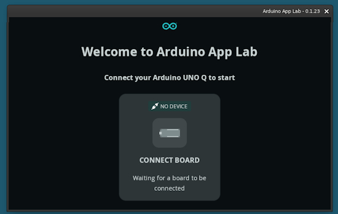](https://adafruit-playground.com/u/SamBlenny/pages/exploring-the-arduino-app-lab-binary)

To understand what the new Arduino UNO Q is about, Sam Blenny has been looking at the new the Arduino App Lab coding tool. The App Lab download page links to the [source code](https://downloads.arduino.cc/app-lab-release/source-app-lab.zip), but the source seems incomplete. Among other differences, there aren't any build instructions or scripts in the source archive - [Adafruit Playground](https://adafruit-playground.com/u/SamBlenny/pages/exploring-the-arduino-app-lab-binary).

## ESP32 vs STM32 vs NRF52 vs RP2040 - Which is Best for Your Product?

There are hundreds of microcontroller options out there. John Teel, former Microchip design engineer, finds that four families stand out as the most popular among those building real products today. That includes the ESP32, STM32, Nordic NRF52 and the Raspberry Pi RP2040. Each one of these microcontroller families has their own strengths and weaknesses and ideal use cases. In this video, John breaks down each one of the options - [YouTube](https://www.youtube.com/watch?v=EGqLTQIbsOg).

## RFIDisk — A Physical App Launcher for Linux PCs

[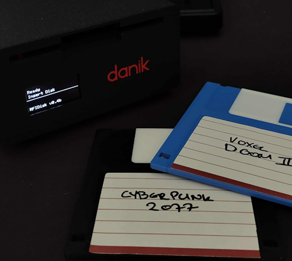](https://github.com/ItsDanik/rfidisk)

RFIDisk turns RFID tags into physical shortcuts that launch games, apps, or scripts when inserted on a retro-styled "floppy drive" reader. Think of it as a cross between an RFID scanner and a USB floppy disk drive. Coded in Python and Arduino - [GitHub](https://github.com/ItsDanik/rfidisk). Via [X](https://x.com/arduino/status/1978889204575711260?s=03).

## How I Built My Own Wolfram Mathematica-like Engine With Python

Thanks to Python, David Delony built a local, self-hosted math engine that can rival Wolfram Alpha or other pricey proprietary packages  - [How-To Geek](https://www.howtogeek.com/how-i-built-my-own-wolfram-mathematica-with-python-libraries/).

## This Week's Python Streams

Python on Hardware is all about building a cooperative ecosphere which allows contributions to be valued and to grow knowledge. Below are the streams within the last week focusing on the community.

**CircuitPython Deep Dive Stream**

[Last Friday](link), Tim streamed work on {subject}.

You can see the latest video and past videos on the Adafruit YouTube channel under the Deep Dive playlist - [YouTube](https://www.youtube.com/playlist?list=PLjF7R1fz_OOXBHlu9msoXq2jQN4JpCk8A).

**CircuitPython Parsec**

John Park’s CircuitPython Parsec is off this week. Catch all the episodes in the [YouTube playlist](https://www.youtube.com/playlist?list=PLjF7R1fz_OOWFqZfqW9jlvQSIUmwn9lWr).

**CircuitPython Weekly Meeting**

CircuitPython Weekly Meeting for {date} ([notes](file)) [on YouTube](link).

## Project of the Week: Electronic Pumpkin

An updated electric pumpkin from the young folk at GurgleApps! The latest uses an LED matrix for a flickering flame effect and GC9A01 round LCD displays for the eyes. All programmed in CircuitPython and well documented open source projects. Flickering Flame - [GitHub](https://github.com/gurgleapps/FlickeringFlame) and [Etsy](https://www.etsy.com/listing/4386406336/rgb-led-matrix-halloween-pumpkin-flame), and Eyes - [GitHub](https://github.com/gurgleapps/PumpkinEyes-GC9A01). Documented also on [YouTube](https://www.youtube.com/watch?v=UFfcsSoiJz8). Via [X](https://x.com/GurgleApps/status/1978762570619146516).

## Popular Last Week

[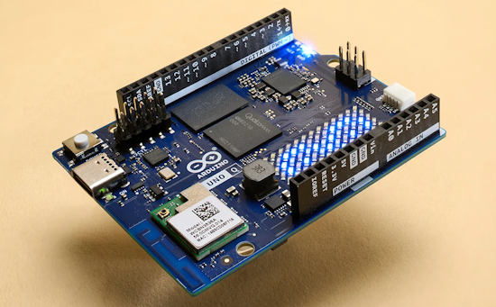](https://makezine.com/article/technology/arduino/live-arduino-announce-uno-q-app-lab-and-qualcomm-acquisition/)

What was the most popular, most clicked link, in [last week's newsletter](https://www.adafruitdaily.com/2025/10/13/python-on-microcontrollers-newsletter-qualcomm-nabs-arduino-micropython-oses-python-3-14-out-and-more-circuitpython-python-micropython-thepsf-raspberry_pi/)? [Arduino Announce UNO Q, App Lab, and Qualcomm Acquisition](https://makezine.com/article/technology/arduino/live-arduino-announce-uno-q-app-lab-and-qualcomm-acquisition/).

Did you know you can read past issues of this newsletter in the Adafruit Daily Archive? [Check it out](https://www.adafruitdaily.com/category/circuitpython/).

## New Notes from Adafruit Playground

[Adafruit Playground](https://adafruit-playground.com/) is a new place for the community to post their projects and other making tips/tricks/techniques. Ad-free, it's an easy way to publish your work in a safe space for free.

Your own TTS engine for the Fruit Jam Spell Jam app - [Adafruit Playground](https://adafruit-playground.com/u/retiredwizard/pages/your-own-tts-engine-for-the-fruit-jam-spell-jam-app).

text - [Adafruit Playground](url).

## News From Around the Web

[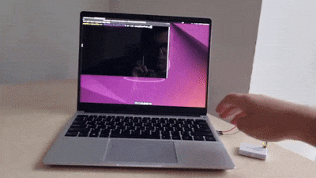](https://x.com/semito_v/status/1978409445446054062)

The SemiTO-V Micropython Compatibility Layer (MCL) library allows inclusion of MicroPython code targeting MCUs within CPython. Made for a RISC-V based RP2350 GPIO Expansion Card for Framework Laptops. Works well with any MCU that supports MicroPython connected to RISC-V, ARM and X86 PCs - [GitHub](https://github.com/semitov/SemiTOV-MCL). Via [X](https://x.com/semito_v/status/1978409445446054062).

[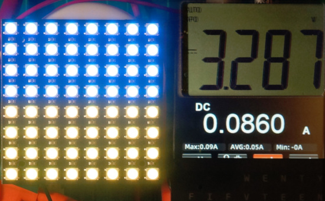](https://www.instructables.com/Testing-an-RGB-LED-Matrix-With-Different-Supply-Vo/)

Using a BBC micro:bit running a MicroPython program to test the [GurgleApps](https://www.youtube.com/@GurgleApps) 8x8 NeoPixel-like RGB LED matrix from their [Word Clock](https://gurgleapps.com/reviews/electronics/wifi-controlled-color-word-clock-kit-micropython) at various supply voltages, includes some fun with a home-made level converter - [Instructables](https://www.instructables.com/Testing-an-RGB-LED-Matrix-With-Different-Supply-Vo/).

[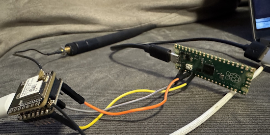](https://github.com/varna9000/micropython-meshtastic)

MicroPython minimal telemetry for Meshtastic devices - [GitHub](https://github.com/varna9000/micropython-meshtastic). Via [X](https://x.com/circuit_k/status/1977057618670829855).

[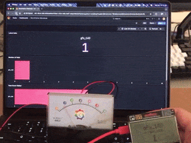](https://x.com/simon_prickett/status/1978072997660377158)

A physical gauge that talks to Grafana. Code is CircuitPython on a Raspberry Pi Pico powering the gauge and MicroPython on the Pimoroni GFX pack - [X](https://x.com/simon_prickett/status/1978072997660377158).

[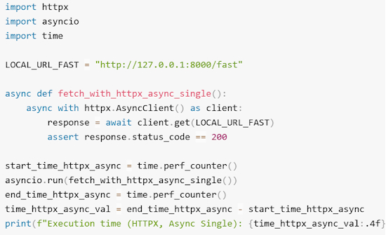](https://towardsdatascience.com/beyond-requests-why-httpx-is-the-modern-http-client-you-need-sometimes/)

Beyond Requests: Why httpx is the modern HTTP Python 3 client you need - [Towards Data Science](https://towardsdatascience.com/beyond-requests-why-httpx-is-the-modern-http-client-you-need-sometimes/).

[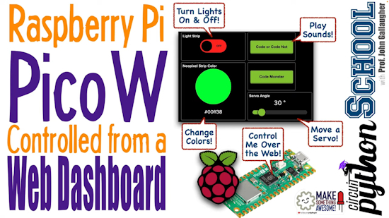](https://youtu.be/fjysAa3N2OI?si=LVXLIu9gZEgiVvjb)

Raspberry Pi Pico W controlled from a Web Dashboard - [YouTube](https://youtu.be/fjysAa3N2OI?si=LVXLIu9gZEgiVvjb).

5 Halloween-themed Raspberry Pi projects you can easily set up - [XDA](https://www.xda-developers.com/halloween-themed-raspberry-pi-projects-easily-set-up/).

[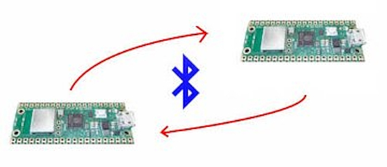](https://saitodev.co/programming/raspberrypi/article/%E3%83%A9%E3%82%BA%E3%83%99%E3%83%AA%E3%83%BC%E3%83%91%E3%82%A4Pico_W%E3%81%A7Bluetooth%E3%81%AE%E3%82%BB%E3%83%B3%E3%83%88%E3%83%A9%E3%83%AB%E6%A9%9F%E5%99%A8%E3%82%92%E6%A7%8B%E7%AF%89%E3%81%97%E3%81%A6%E3%81%BF%E3%82%8B)

Building a Bluetooth central device with Raspberry Pi Pico W - [saitodev.co](https://saitodev.co/programming/raspberrypi/article/%E3%83%A9%E3%82%BA%E3%83%99%E3%83%AA%E3%83%BC%E3%83%91%E3%82%A4Pico_W%E3%81%A7Bluetooth%E3%81%AE%E3%82%BB%E3%83%B3%E3%83%88%E3%83%A9%E3%83%AB%E6%A9%9F%E5%99%A8%E3%82%92%E6%A7%8B%E7%AF%89%E3%81%97%E3%81%A6%E3%81%BF%E3%82%8B) (Japanese). Via [X](https://x.com/saitodev/status/1978408100446236946).

[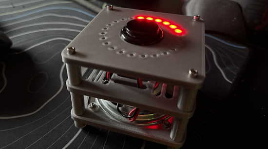](https://mastodon.social/@andy_warb/115370999445777102)

Mouth Blaster: When kids press the button, the LED ring counts up while playing “Song 2” by Blur (which just happens to be 2 minutes long - the recommended time for tooth brushing!). Powered by a 24 NeoPixel ring, an arcade button, speaker and an Adafruit Propmaker RP2040 coded in CircuitPython - [Mastodon](https://mastodon.social/@andy_warb/115370999445777102).

text - [site](url).

A gentle introduction to TypeScript for Python programmers - [KDnuggets](https://www.kdnuggets.com/a-gentle-introduction-to-typescript-for-python-programmers).

[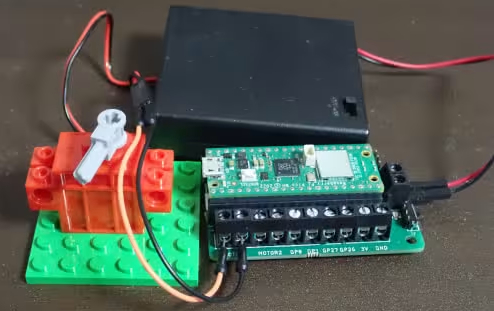](https://saitodev.co/programming/raspberrypi/article/%E3%83%A9%E3%82%BA%E3%83%99%E3%83%AA%E3%83%BC%E3%83%91%E3%82%A4Pico_W%E3%81%A8%E3%83%A2%E3%83%BC%E3%82%BF%E3%83%89%E3%83%A9%E3%82%A4%E3%83%90%E3%81%A7DC%E3%83%A2%E3%83%BC%E3%82%BF%E3%82%92%E5%8B%95%E3%81%8B%E3%81%97%E3%81%A6%E3%81%BF%E3%82%88%E3%81%86)

Let's drive a DC motor with a Raspberry Pi Pico W, MicroPython and a motor driver - [saitodev.co](https://saitodev.co/programming/raspberrypi/article/%E3%83%A9%E3%82%BA%E3%83%99%E3%83%AA%E3%83%BC%E3%83%91%E3%82%A4Pico_W%E3%81%A8%E3%83%A2%E3%83%BC%E3%82%BF%E3%83%89%E3%83%A9%E3%82%A4%E3%83%90%E3%81%A7DC%E3%83%A2%E3%83%BC%E3%82%BF%E3%82%92%E5%8B%95%E3%81%8B%E3%81%97%E3%81%A6%E3%81%BF%E3%82%88%E3%81%86) (Japanese).

text - [site](url).

text - [site](url).

[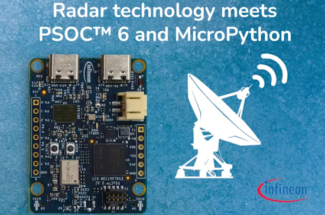](https://www.hackster.io/537973/explore-the-environment-using-bgt60-radar-and-micropython-c67d6e)

Distance measuring using Infineon's BGT60-Radar-Sensor and MicroPython - [hackster.io](https://www.hackster.io/537973/explore-the-environment-using-bgt60-radar-and-micropython-c67d6e).

How to get a job in Edge AI: essential skills for 2025 - [Shawn Hymel](https://shawnhymel.com/2976/how-to-get-a-job-in-edge-ai-essential-skills-for-2025/).

[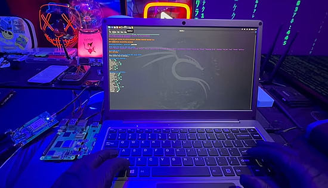](https://www.youtube.com/watch?v=5ql_VS6DviQ)

Turn your Raspberry Pi 5 into a portable ‘laptop-like’ device for Cybersecurity - [YouTube](https://www.youtube.com/watch?v=5ql_VS6DviQ).

text - [site](url).

text - [site](url).

## New

[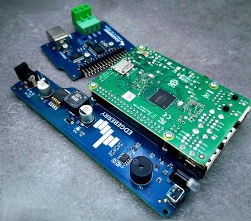](https://www.raspberrypi.com/news/edgeberry-interface-board-for-raspberry-pi/)

Edgeberry is a modular expansion system that turns your Raspberry Pi into a robust, adaptable Internet of Things (IoT) edge device - [Raspberry Pi News](https://www.raspberrypi.com/news/edgeberry-interface-board-for-raspberry-pi/) and [GitHub](https://github.com/Edgeberry).

[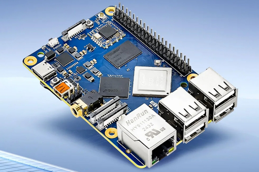](https://www.cnx-software.com/2025/10/16/raspberry-pi-allwinner-a527-t527-industrial-sbc-dual-camera-ai-acceleration/)

EBYTE has recently released an Allwinner A527/T527-based Raspberry Pi-like industrial SBC with dual camera and AI features, with a design very similar to the Walnut Pi 2B, and to a lesser extent, the Orange Pi 4A. It is designed for embedded, IoT, and smart commercial applications - [CNX](https://www.cnx-software.com/2025/10/16/raspberry-pi-allwinner-a527-t527-industrial-sbc-dual-camera-ai-acceleration/).

[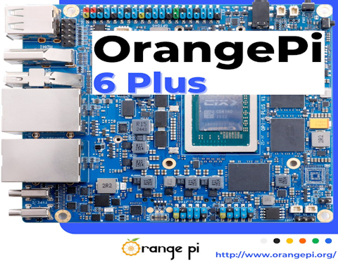](https://x.com/orangepixunlong/status/1978415106376556715?s=03)

The Orange Pi 6 Plus has a 12 core 64-bit CPU and NPU, 45 TOPS, 2 M.2 slots, USB 2 and 3, 5G Ethernet and HDMI out - [X](https://x.com/orangepixunlong/status/1978415106376556715?s=03).

## New Boards Supported by CircuitPython

The number of supported microcontrollers and Single Board Computers (SBC) grows every week. This section outlines which boards have been included in CircuitPython or added to [CircuitPython.org](https://circuitpython.org/).

This week there were (#/no) new boards added:

- [Board name](url)
- [Board name](url)
- [Board name](url)

*Note: For non-Adafruit boards, please use the support forums of the board manufacturer for assistance, as Adafruit does not have the hardware to assist in troubleshooting.*

Looking to add a new board to CircuitPython? It's highly encouraged! Adafruit has four guides to help you do so:

- [How to Add a New Board to CircuitPython](https://learn.adafruit.com/how-to-add-a-new-board-to-circuitpython/overview)
- [How to add a New Board to the circuitpython.org website](https://learn.adafruit.com/how-to-add-a-new-board-to-the-circuitpython-org-website)
- [Adding a Single Board Computer to PlatformDetect for Blinka](https://learn.adafruit.com/adding-a-single-board-computer-to-platformdetect-for-blinka)
- [Adding a Single Board Computer to Blinka](https://learn.adafruit.com/adding-a-single-board-computer-to-blinka)

## New Learn Guides

[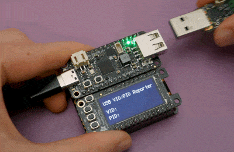](https://learn.adafruit.com/guides/latest)

The Adafruit Learning System has over 3,200 free guides for learning skills and building projects including using Python.

[CircuitPython USB VID/PID Reporter](https://learn.adafruit.com/circuitpython-usb-vid-pid-reporter) from [Liz Clark](https://learn.adafruit.com/u/BlitzCityDIY)

[Using Raspberry Pi Pico and Pico 2 with Arduino](https://learn.adafruit.com/using-raspberry-pi-pico-pico-2-with-arduino) from [Anne Barela](https://learn.adafruit.com/u/AnneBarela)

[Bare E-Ink Displays Crash Course](https://learn.adafruit.com/bare-e-ink-displays-crash-course) from [Liz Clark](https://learn.adafruit.com/u/BlitzCityDIY)

[Logic Gates Simulator on Fruit Jam](https://learn.adafruit.com/logic-gates-simulator-on-fruit-jam) from [Tim C](https://learn.adafruit.com/u/Foamyguy)

## CircuitPython Libraries

The CircuitPython library numbers are continually increasing, while existing ones continue to be updated. Here we provide library numbers and updates!

To get the latest Adafruit libraries, download the [Adafruit CircuitPython Library Bundle](https://circuitpython.org/libraries). To get the latest community contributed libraries, download the [CircuitPython Community Bundle](https://circuitpython.org/libraries).

If you'd like to contribute to the CircuitPython project on the Python side of things, the libraries are a great place to start. Check out the [CircuitPython.org Contributing page](https://circuitpython.org/contributing). If you're interested in reviewing, check out Open Pull Requests. If you'd like to contribute code or documentation, check out Open Issues. We have a guide on [contributing to CircuitPython with Git and GitHub](https://learn.adafruit.com/contribute-to-circuitpython-with-git-and-github), and you can find us in the #help-with-circuitpython and #circuitpython-dev channels on the [Adafruit Discord](https://adafru.it/discord).

You can check out this [list of all the Adafruit CircuitPython libraries and drivers available](https://github.com/adafruit/Adafruit_CircuitPython_Bundle/blob/master/circuitpython_library_list.md). 

The current number of CircuitPython libraries is **###**!

**New Libraries**

Here are this week's new CircuitPython libraries:

* [library](url)

**Updated Libraries**

Here are this week's updated CircuitPython libraries:

* [library](url)

## What’s the CircuitPython team up to this week?

What is the team up to this week? Let’s check in:

**Dan**

Last week I fixed an SPI DMA issue on Atmel SAMD boards that was causing problems with SD card access on those boards. I'll be releasing that with some other fixes as CircuitPython 10.0.2 shortly.

**Tim**

text.

**Scott**

text.

**Liz**

The [bare eInk display guide](https://learn.adafruit.com/bare-e-ink-displays-crash-course) that I mentioned last week went live, so if you've been curious about using these displays definitely check it out. I also published a quick project guide. It's a [CircuitPython USB VID/PID Reporter](https://learn.adafruit.com/circuitpython-usb-vid-pid-reporter). It uses a Feather RP2040 USB Host board alongside an OLED FeatherWing. When you plug in a USB device to the host, its VID and PID are shown on the OLED. If you press any of the buttons on the OLED, it toggles the root_group and shows the USB manufacturer and product name.

## Upcoming Events

The next MicroPython Meetup in Melbourne will be on October 22th – [Meetup](https://www.meetup.com/micropython-meetup/events). You can see recordings of previous meetings on [YouTube](https://www.youtube.com/@MicroPythonOfficial). 

[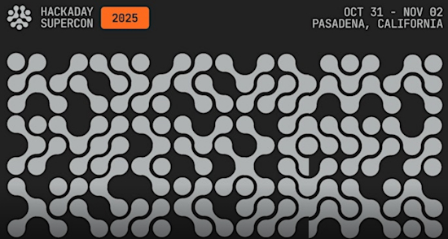](https://www.eventbrite.com/e/2025-hackaday-superconference-tickets-1505260116529)

The Hackaday Superconference is back! Join this global conference of hardware hackers, makers, and tech enthusiasts this Oct 31st - Nov 2nd in Pasadena, California - [Eventbrite](https://www.eventbrite.com/e/2025-hackaday-superconference-tickets-1505260116529).

The final KiCad conference (KiCon) will be 15 November, 2025 in Shenzhen, China - [KiCad](https://kicon.kicad.org/).

PyLadiesCon returns December 5–7, 2025. 100% online conference designed for our global community. Talks, workshops, panels, and community fun – [PyLadies](https://conference.pyladies.com/2025-pyladiescon-is-back/).

**Coming in 2026**

- The Open Source Hardware Association Open Hardware Summit is coming to Berlin, Germany on May 23rd and 24th, 2025.

**Send Your Events In**

If you know of virtual events or upcoming events, please let us know via email to cpnews(at)adafruit(dot)com.

## Latest Releases

CircuitPython's stable release is [#.#.#](https://github.com/adafruit/circuitpython/releases/latest) and its unstable release is [#.#.#-##.#](https://github.com/adafruit/circuitpython/releases). New to CircuitPython? Start with our [Welcome to CircuitPython Guide](https://learn.adafruit.com/welcome-to-circuitpython).

[2025####](https://github.com/adafruit/Adafruit_CircuitPython_Bundle/releases/latest) is the latest Adafruit CircuitPython library bundle.

[2025####](https://github.com/adafruit/CircuitPython_Community_Bundle/releases/latest) is the latest CircuitPython Community library bundle.

[v#.#.#](https://micropython.org/download) is the latest MicroPython release. Documentation for it is [here](http://docs.micropython.org/en/latest/pyboard/).

[#.#.#](https://www.python.org/downloads/) is the latest Python release. The latest pre-release version is [#.#.#](https://www.python.org/download/pre-releases/).

[#,### Stars](https://github.com/adafruit/circuitpython/stargazers) Like CircuitPython? [Star it on GitHub!](https://github.com/adafruit/circuitpython)

## Call for Help -- Translating CircuitPython is now easier than ever

[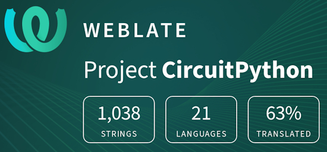](https://hosted.weblate.org/engage/circuitpython/)

One important feature of CircuitPython is translated control and error messages. With the help of fellow open source project [Weblate](https://weblate.org/), we're making it even easier to add or improve translations. 

Sign in with an existing account such as GitHub, Google or Facebook and start contributing through a simple web interface. No forks or pull requests needed! As always, if you run into trouble join us on [Discord](https://adafru.it/discord), we're here to help.

## NUMBER Thanks

The Adafruit Discord community, where we do all our CircuitPython development in the open, reached over NUMBER humans - thank you! Adafruit believes Discord offers a unique way for Python on hardware folks to connect. Join today at [https://adafru.it/discord](https://adafru.it/discord).

## ICYMI - In case you missed it

Python on hardware is the Adafruit Python video-newsletter-podcast! The news comes from the Python community, Discord, Adafruit communities and more and is broadcast on ASK an ENGINEER Wednesdays. The complete Python on Hardware weekly videocast [playlist is here](https://www.youtube.com/playlist?list=PLjF7R1fz_OOXRMjM7Sm0J2Xt6H81TdDev). The video podcast is on [iTunes](https://itunes.apple.com/us/podcast/python-on-hardware/id1451685192?mt=2), [YouTube](http://adafru.it/pohepisodes), [Instagram](https://www.instagram.com/adafruit/channel/)), and [XML](https://itunes.apple.com/us/podcast/python-on-hardware/id1451685192?mt=2).

[The weekly community chat on Adafruit Discord server CircuitPython channel - Audio / Podcast edition](https://itunes.apple.com/us/podcast/circuitpython-weekly-meeting/id1451685016) - Audio from the Discord chat space for CircuitPython, meetings are usually Mondays at 2pm ET, this is the audio version on [iTunes](https://itunes.apple.com/us/podcast/circuitpython-weekly-meeting/id1451685016), Pocket Casts, [Spotify](https://adafru.it/spotify), and [XML feed](https://adafruit-podcasts.s3.amazonaws.com/circuitpython_weekly_meeting/audio-podcast.xml).

## Contribute

The CircuitPython Weekly Newsletter is a CircuitPython community-run newsletter emailed every Monday. The complete [archives are here](https://www.adafruitdaily.com/category/circuitpython/). It highlights the latest CircuitPython related news from around the web including Python and MicroPython developments. To contribute, edit next week's draft [on GitHub](https://github.com/adafruit/circuitpython-weekly-newsletter/tree/gh-pages/_drafts) and [submit a pull request](https://help.github.com/articles/editing-files-in-your-repository/) with the changes. You may also tag your information on Twitter with #CircuitPython. 

Join the Adafruit [Discord](https://adafru.it/discord) or [post to the forum](https://forums.adafruit.com/viewforum.php?f=60) if you have questions.
