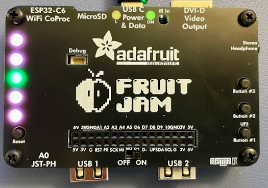
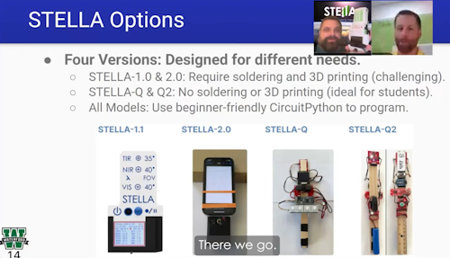
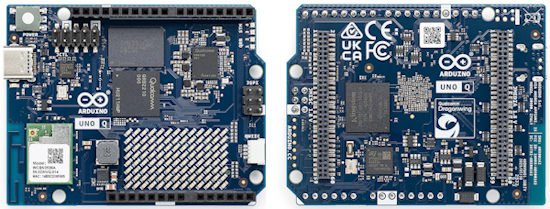
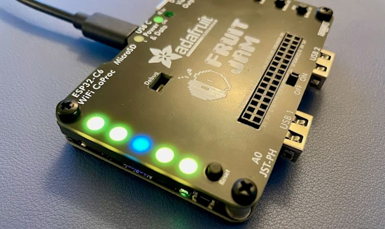
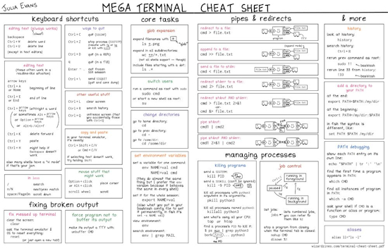
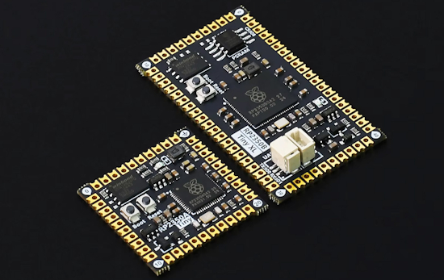

- [ ] Library and info updates
- [ ] change date
- [ ] update title
- [ ] Feature story
- [ ] Update  for images
- [ ] Update ICYDNCI
- [ ] All images 550w max only
- [ ] Link "View this email in your browser."

News Sources

- [Adafruit Playground](https://adafruit-playground.com/)
- Twitter: [CircuitPython](https://twitter.com/search?q=circuitpython&src=typed_query&f=live), [MicroPython](https://twitter.com/search?q=micropython&src=typed_query&f=live) and [Python](https://twitter.com/search?q=python&src=typed_query)
- [Raspberry Pi News](https://www.raspberrypi.com/news/)
- Mastodon [CircuitPython](https://mastodon.social/tags/CircuitPython) and [MicroPython](https://mastodon.social/tags/MicroPython)
- [hackster.io CircuitPython](https://www.hackster.io/search?q=circuitpython&i=projects&sort_by=most_recent) and [MicroPython](https://www.hackster.io/search?q=micropython&i=projects&sort_by=most_recent)
- YouTube: [CircuitPython](https://www.youtube.com/results?search_query=circuitpython&sp=CAI%253D), [MicroPython](https://www.youtube.com/results?search_query=micropython&sp=CAI%253D), [Prof Gallaugher](https://www.youtube.com/@BuildWithProfG/videos), [Teacher Brogan M. Pratt CircuitPython](https://www.youtube.com/playlist?list=PLRHdgFNRLyaN6eCw8b0yoHKDY9B4GiirU)
- [Google News Python](https://news.google.com/topics/CAAqIQgKIhtDQkFTRGdvSUwyMHZNRFY2TVY4U0FtVnVLQUFQAQ?hl=en-US&gl=US&ceid=US%3Aen)
- [maker.io Python](https://www.digikey.com/en/maker/search-results?t=python)
- Instructables: [CircuitPython](https://www.instructables.com/search/?q=circuitpython&projects=all&sort=Newest), [MicroPython](https://www.instructables.com/search/?q=micropython&projects=all&sort=Newest), [Raspberry Pi Python](https://www.instructables.com/search/?q=raspberry+pi+python&projects=all&sort=Newest)
- [hackaday CircuitPython](https://hackaday.com/blog/?s=circuitpython) and [MicroPython](https://hackaday.com/blog/?s=micropython)
- [python.org](https://www.python.org/)
- [Python Insider - dev team blog](https://pythoninsider.blogspot.com/)
- Individuals: [bret.dk](https://bret.dk/), [Jeff Geerling](https://www.jeffgeerling.com/blog), [Yakroo](https://x.com/Yakroo5077)
- Tom's Hardware: [CircuitPython](https://www.tomshardware.com/search?searchTerm=circuitpython&articleType=all&sortBy=publishedDate) and [MicroPython](https://www.tomshardware.com/search?searchTerm=micropython&articleType=all&sortBy=publishedDate) and [Raspberry Pi](https://www.tomshardware.com/search?searchTerm=raspberry%20pi&articleType=all&sortBy=publishedDate)
- [hackaday.io newest projects MicroPython](https://hackaday.io/projects?tag=micropython&sort=date) and [CircuitPython](https://hackaday.io/projects?tag=circuitpython&sort=date)
- hackaday.io - [CircuitPython](https://hackaday.io/search?term=circuitpython) and [MicroPython](https://hackaday.io/search?term=micropython)

View this email in your browser. **Warning: Flashing Imagery**

Welcome to the latest Python on Microcontrollers newsletter! *insert 2-3 sentences from editor (what's in overview, banter)* - *Anne Barela, Editor*

We're on [Discord](https://discord.gg/HYqvREz), [Twitter/X](https://twitter.com/search?q=circuitpython&src=typed_query&f=live), [BlueSky](https://bsky.app/profile/circuitpython.org) and for past newsletters - [view them all here](https://www.adafruitdaily.com/category/circuitpython/). If you're reading this on the web, please [subscribe here](https://www.adafruitdaily.com/). Here's the news this week:

## Headline

text - [site](url).

## CircuitPython 10.1.0 Beta 0 Released

CircuitPython 10.1.0-beta.0 is a beta release for 10.1.0. It has known bugs that will be fixed before the final release of 10.1.0 - [Adafruit Blog](https://blog.adafruit.com/2025/10/20/circuitpython-10-1-0-beta-0-released/) and release notes - [GitHub](https://github.com/adafruit/circuitpython/releases/tag/10.1.0-beta.0).

**Highlights of this release**

* Update the Espressif ESP-IDF to v5.5.1 and support the [ESP32-C61](https://www.espressif.com/en/products/socs/esp32-c61)

## Feature

text - [site](url).

## Feature

text - [site](url).

## NeoPixel Light Pipe Add-on for Fruit Jam

Mikey Sklar came up with a simple 3D printed add-on for the Fruit Jam that isolates the light from each NeoPixel LED making the lights more crisp and defined - [Adafruit Blog](https://blog.adafruit.com/2025/10/23/neopixel-light-pipe-add-on-for-fruit-jam-3dthursday/) and [GitHub](https://github.com/mikeysklar/fj-tunnel).

## As Vibe Coding Fades, Startup Woz Offers Production-Ready Alternative

A new startup, Woz, launches to build production-ready apps using prebuilt components and human oversight, as traffic to leading vibe coding tools plummets up to 64% - [The New Stack](https://thenewstack.io/as-vibe-coding-fades-woz-offers-production-ready-alternative/).

*Ed note: prebuilt components sounds like libraries and APIs...*

## This Week's Python Streams

Python on Hardware is all about building a cooperative ecosphere which allows contributions to be valued and to grow knowledge. Below are the streams within the last week focusing on the community.

**CircuitPython Deep Dive Stream**

[Last Friday](link), Tim streamed work on {subject}.

You can see the latest video and past videos on the Adafruit YouTube channel under the Deep Dive playlist - [YouTube](https://www.youtube.com/playlist?list=PLjF7R1fz_OOXBHlu9msoXq2jQN4JpCk8A).

**CircuitPython Parsec**

John Park’s CircuitPython Parsec this week is on {subject} - [Adafruit Blog](link) and [YouTube](link).

Catch all the episodes in the [YouTube playlist](https://www.youtube.com/playlist?list=PLjF7R1fz_OOWFqZfqW9jlvQSIUmwn9lWr).

In the latest episode of The CircuitPython Show released October 27th, Paul interviews Sam Blenny.  Sam is the author of over 30 guides on the Adafruit Playground and they discuss Sam's work with the Fruit Jam, including a MIDI tester, Gamepad Tester, Color Checker, and more. - [The CircuitPython Show](https://www.circuitpythonshow.com/@circuitpythonshow).

**CircuitPython Weekly Meeting**

CircuitPython Weekly Meeting for October 20, 2025 ([notes](https://github.com/adafruit/adafruit-circuitpython-weekly-meeting/blob/main/2025/2025-10-20.md)) [on YouTube](https://youtu.be/Y1t9DYOxGZA).

## Project of the Week - STELLA: Bridging Aagriculture & Technology in the Classroom With CircuitPython

Educator Craig Kohn from Waterford Union High School demonstrates how open-source, affordable, STELLA-Q2 spectrometer instruments are transforming agriscience education - [YouTube](https://www.youtube.com/watch?v=quo88PSg_iM) and [NASA](https://science.gsfc.nasa.gov/stella/instruments/spectral/stella-q2/). Via [Adafruit Blog](https://blog.adafruit.com/2025/10/20/bridging-agriculture-technology-in-the-classroom-with-circuitpython/).

> STELLA-Q2 spectrometer units (~$150 per unit) have 18-band electromagnetic radiation detection (410-940 nanometers). Devices composing the spectrometer are connected via qwiic/STEMMA QT I2C cables, no soldering, and includes a combination of SparkFun and Adafruit components. The different versions of the STELLA instrument are programmed in open-source CircuitPython.

## Popular Last Week

What was the most popular, most clicked link, in [last week's newsletter](https://www.adafruitdaily.com/2025/10/20/python-on-microcontrollers-newsletter-evaluating-the-arduino-acquisition-circuitpython-10-0-3-and-much-more-circuitpython-python-micropython-thepsf-raspberry_pi/)? [Ladyada's EYE on NPI review of the Qualcomm & Arduino UNO Q Microcontroller Board](https://blog.adafruit.com/2025/10/17/eye-on-npi-qualcomm-arduino-uno-q-microcontroller-board-digikey-arduino-adafruit/).

Did you know you can read past issues of this newsletter in the Adafruit Daily Archive? [Check it out](https://www.adafruitdaily.com/category/circuitpython/).

## New Notes from Adafruit Playground

[Adafruit Playground](https://adafruit-playground.com/) is a new place for the community to post their projects and other making tips/tricks/techniques. Ad-free, it's an easy way to publish your work in a safe space for free.

Fun with Fruit Jam Neopixels - [Adafruit Playground](https://adafruit-playground.com/u/danak/pages/fun-with-fruit-jam-neopixels).

text - [Adafruit Playground](url).

text - [Adafruit Playground](url).

## News From Around the Web

Through Humble Bundle, for $8 (roughly £6/€7), you’ll get DRM-free copies of several Raspberry Pi Press books worth $357, and paying $10 more unlocks 13 additional books. Your purchase will support the Raspberry Pi Foundation‘s work to help young people reach their potential with computing. Check out the All Things Raspberry Pi bundle, which runs from Monday 20 October to Monday 10 November - [Raspberry Pi News](https://www.raspberrypi.com/news/name-your-price-raspberry-pi-books/) and [Humble Bundle](https://www.humblebundle.com/books/all-things-raspberry-pi-raspberry-pi-press-books).

The MEGA TERMINAL CHEAT SHEET from Julia Evans' "The Secret Rules of the Terminal" - [X](https://bsky.app/profile/b0rk.jvns.ca/post/3m3n4mmewjc2l).

text - [site](url).

text - [site](url).

text - [site](url).

text - [site](url).

text - [site](url).

text - [site](url).

text - [site](url).

text - [site](url).

text - [site](url).

text - [site](url).

text - [site](url).

text - [site](url).

text - [site](url).

text - [site](url).

text - [site](url).

text - [site](url).

## New

Found on AliExpress, the RP2350 Tiny and Tiny XL, both of which are RP2350-based low-cost stamp-size development boards that look exactly like the Solder Party’s “RP2350 Stamp” modules, but are available at nearly half the price - [CNX](https://www.cnx-software.com/2025/10/19/rp2350-tiny-and-tiny-xl-boards-clone-solder-party-rp2350-stamp-modules/).

text - [site](url).

## New Boards Supported by CircuitPython

The number of supported microcontrollers and Single Board Computers (SBC) grows every week. This section outlines which boards have been included in CircuitPython or added to [CircuitPython.org](https://circuitpython.org/).

This week there were (#/no) new boards added:

- [Board name](url)
- [Board name](url)
- [Board name](url)

*Note: For non-Adafruit boards, please use the support forums of the board manufacturer for assistance, as Adafruit does not have the hardware to assist in troubleshooting.*

Looking to add a new board to CircuitPython? It's highly encouraged! Adafruit has four guides to help you do so:

- [How to Add a New Board to CircuitPython](https://learn.adafruit.com/how-to-add-a-new-board-to-circuitpython/overview)
- [How to add a New Board to the circuitpython.org website](https://learn.adafruit.com/how-to-add-a-new-board-to-the-circuitpython-org-website)
- [Adding a Single Board Computer to PlatformDetect for Blinka](https://learn.adafruit.com/adding-a-single-board-computer-to-platformdetect-for-blinka)
- [Adding a Single Board Computer to Blinka](https://learn.adafruit.com/adding-a-single-board-computer-to-blinka)

## New Learn Guides

The Adafruit Learning System has over 3,200 free guides for learning skills and building projects including using Python.

[title](url) from [name](url)

[title](url) from [name](url)

[title](url) from [name](url)

## Updated Learn Guides

[title](url)

## CircuitPython Libraries

The CircuitPython library numbers are continually increasing, while existing ones continue to be updated. Here we provide library numbers and updates!

To get the latest Adafruit libraries, download the [Adafruit CircuitPython Library Bundle](https://circuitpython.org/libraries). To get the latest community contributed libraries, download the [CircuitPython Community Bundle](https://circuitpython.org/libraries).

If you'd like to contribute to the CircuitPython project on the Python side of things, the libraries are a great place to start. Check out the [CircuitPython.org Contributing page](https://circuitpython.org/contributing). If you're interested in reviewing, check out Open Pull Requests. If you'd like to contribute code or documentation, check out Open Issues. We have a guide on [contributing to CircuitPython with Git and GitHub](https://learn.adafruit.com/contribute-to-circuitpython-with-git-and-github), and you can find us in the #help-with-circuitpython and #circuitpython-dev channels on the [Adafruit Discord](https://adafru.it/discord).

You can check out this [list of all the Adafruit CircuitPython libraries and drivers available](https://github.com/adafruit/Adafruit_CircuitPython_Bundle/blob/master/circuitpython_library_list.md). 

The current number of CircuitPython libraries is **###**!

**New Libraries**

Here are this week's new CircuitPython libraries:

* [library](url)

**Updated Libraries**

Here are this week's updated CircuitPython libraries:

* [library](url)

## What’s the CircuitPython team up to this week?

What is the team up to this week? Let’s check in:

**Dan**

text.

**Tim**

The Fruit Jam logic gates guide mentioned in my previous update is now published. I was out part of last week for vacation. Before leaving I wrote the guide for the Apple //e emulator. This week I rolled out a patch and release to all CircuitPython libraries that removes the usage of a deprecated ruff rule, and fixes a styling issue that some RTD pages have. I also made a few final tweaks in the SPA06_003 PR to add SPI support to that driver, and it is now merged.  I've started working on a guide for another Fruit Jam emulator, this one is the Intel 286. It has got me digging out ancient DOS knowledge from the depths of my brain. There is a working QBasic disk that runs inside of it which I always love running across because it was the first programming language that I ever used. 

**Scott**

Last week I was on vacation visiting family. This week, my ESP IDF 5.5.1 update was merged in a release as 10.1.0-beta.1. Please give it a try! Next, I'm working on adding MIPI DSI display support. I'm excited to open up a new tier of displays to CircuitPython.

**Liz**

This week I worked on documenting the new [STHS34PF80 IR Presence / Motion Sensor](https://learn.adafruit.com/adafruit-sths34pf80-ir-presence-motion-sensor). This breakout works like a PIR sensor, but its controllable over I2C. I wrote a CircuitPython driver for the sensor, that is currently in the bundle. I've also started working on a Halloween project that involves a Raspberry Pi, Raspberry Pi camera and speaker bonnet. 

## Upcoming Events

The next MicroPython Meetup in Melbourne will be on October 22th – [Meetup](https://www.meetup.com/micropython-meetup/events). You can see recordings of previous meetings on [YouTube](https://www.youtube.com/@MicroPythonOfficial). 

The Hackaday Superconference is back! Join this global conference of hardware hackers, makers, and tech enthusiasts this Oct 31st - Nov 2nd in Pasadena, California - [Eventbrite](https://www.eventbrite.com/e/2025-hackaday-superconference-tickets-1505260116529).

The final KiCad conference (KiCon) will be 15 November, 2025 in Shenzhen, China - [KiCad](https://kicon.kicad.org/).

PyLadiesCon returns December 5–7, 2025. 100% online conference designed for our global community. Talks, workshops, panels, and community fun – [PyLadies](https://conference.pyladies.com/2025-pyladiescon-is-back/).

**Send Your Events In**

If you know of virtual events or upcoming events, please let us know via email to cpnews(at)adafruit(dot)com.

## Latest Releases

CircuitPython's stable release is [10.0.3](https://github.com/adafruit/circuitpython/releases/latest) and its unstable release is [10.1.0-beta.0](https://github.com/adafruit/circuitpython/releases). New to CircuitPython? Start with our [Welcome to CircuitPython Guide](https://learn.adafruit.com/welcome-to-circuitpython).

[2025####](https://github.com/adafruit/Adafruit_CircuitPython_Bundle/releases/latest) is the latest Adafruit CircuitPython library bundle.

[2025####](https://github.com/adafruit/CircuitPython_Community_Bundle/releases/latest) is the latest CircuitPython Community library bundle.

[v#.#.#](https://micropython.org/download) is the latest MicroPython release. Documentation for it is [here](http://docs.micropython.org/en/latest/pyboard/).

[#.#.#](https://www.python.org/downloads/) is the latest Python release. The latest pre-release version is [#.#.#](https://www.python.org/download/pre-releases/).

[#,### Stars](https://github.com/adafruit/circuitpython/stargazers) Like CircuitPython? [Star it on GitHub!](https://github.com/adafruit/circuitpython)

## Call for Help -- Translating CircuitPython is now easier than ever

One important feature of CircuitPython is translated control and error messages. With the help of fellow open source project [Weblate](https://weblate.org/), we're making it even easier to add or improve translations. 

Sign in with an existing account such as GitHub, Google or Facebook and start contributing through a simple web interface. No forks or pull requests needed! As always, if you run into trouble join us on [Discord](https://adafru.it/discord), we're here to help.

## NUMBER Thanks

The Adafruit Discord community, where we do all our CircuitPython development in the open, reached over NUMBER humans - thank you! Adafruit believes Discord offers a unique way for Python on hardware folks to connect. Join today at [https://adafru.it/discord](https://adafru.it/discord).

## ICYMI - In case you missed it

Python on hardware is the Adafruit Python video-newsletter-podcast! The news comes from the Python community, Discord, Adafruit communities and more and is broadcast on ASK an ENGINEER Wednesdays. The complete Python on Hardware weekly videocast [playlist is here](https://www.youtube.com/playlist?list=PLjF7R1fz_OOXRMjM7Sm0J2Xt6H81TdDev). The video podcast is on [iTunes](https://itunes.apple.com/us/podcast/python-on-hardware/id1451685192?mt=2), [YouTube](http://adafru.it/pohepisodes), [Instagram](https://www.instagram.com/adafruit/channel/)), and [XML](https://itunes.apple.com/us/podcast/python-on-hardware/id1451685192?mt=2).

[The weekly community chat on Adafruit Discord server CircuitPython channel - Audio / Podcast edition](https://itunes.apple.com/us/podcast/circuitpython-weekly-meeting/id1451685016) - Audio from the Discord chat space for CircuitPython, meetings are usually Mondays at 2pm ET, this is the audio version on [iTunes](https://itunes.apple.com/us/podcast/circuitpython-weekly-meeting/id1451685016), Pocket Casts, [Spotify](https://adafru.it/spotify), and [XML feed](https://adafruit-podcasts.s3.amazonaws.com/circuitpython_weekly_meeting/audio-podcast.xml).

## Contribute

The CircuitPython Weekly Newsletter is a CircuitPython community-run newsletter emailed every Monday. The complete [archives are here](https://www.adafruitdaily.com/category/circuitpython/). It highlights the latest CircuitPython related news from around the web including Python and MicroPython developments. To contribute, edit next week's draft [on GitHub](https://github.com/adafruit/circuitpython-weekly-newsletter/tree/gh-pages/_drafts) and [submit a pull request](https://help.github.com/articles/editing-files-in-your-repository/) with the changes. You may also tag your information on Twitter with #CircuitPython. 

Join the Adafruit [Discord](https://adafru.it/discord) or [post to the forum](https://forums.adafruit.com/viewforum.php?f=60) if you have questions.
