View this email in your browser. **Warning: Flashing Imagery**

Welcome to the latest Python on Microcontrollers newsletter! This week we see folks getting past the media hype of the Arduino Uno Q and doing real testing. See the three articles on the results. There are two high profile conference badges out and they both use MicroPython to implement magical capabilities. Rather than compromise their ethics, the Python Software Foundation turned down a hefty grant which required exclusionary practices. Bravo! All this and more as it's been a very busy week in the community, as we start November. - *Anne Barela, Editor*

We're on [Discord](https://discord.gg/HYqvREz), [Twitter/X](https://twitter.com/search?q=circuitpython&src=typed_query&f=live), [BlueSky](https://bsky.app/profile/circuitpython.org) and for past newsletters - [view them all here](https://www.adafruitdaily.com/category/circuitpython/). If you're reading this on the web, please [subscribe here](https://www.adafruitdaily.com/). Here's the news this week:

## The 2025 Hackaday Superconference Communicator Badge runs MicroPython

[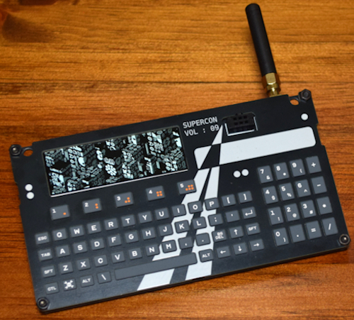](https://hackaday.com/2025/10/23/announcing-the-2025-hackaday-superconference-communicator-badge/)

The badge for the Hackaday Superconference this past weekend is a rather powerful device sporting an ESP32-S3 with 8 MB of PSRAM and 16 MB of flash, LCD screen, SX1262 LoRa module, LiPo battery/charging and a Solder Party custom keyboard. It runs MicroPython with `lvgl_micropython` running on the display for LVGL graphics - [Hackaday](https://hackaday.com/2025/10/23/announcing-the-2025-hackaday-superconference-communicator-badge/) and [GitHub](https://github.com/Hack-a-Day/2025-Communicator_Badge). Via [Adafruit Blog](https://blog.adafruit.com/2025/10/28/the-2025-hackaday-superconference-communicator-badge-runs-micropython/).

## The Arduino Uno Q: Hands On

Folks have now had their hands on this new board which can run Python in Linux and MicroPython on its STM32 processor and are now reporting their findings. Here is a group of articles summarizing findings from prominent makers:

### Arduino Made a Weird SBC

Jeff Geerling looks at the Uno Q and says "it's... weird" - [YouTube](https://www.youtube.com/watch?v=Vz3pD3_CDUE) and blog - [jeffgeerling.com](https://www.jeffgeerling.com/blog/2025/arduino-uno-q-weird-hybrid-sbc).

### Arduino Uno Q vs Raspberry Pi - Which One Should You Buy?

[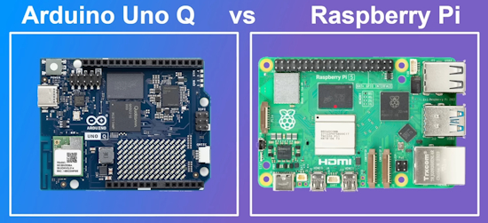](https://www.youtube.com/watch?v=9wspsEO1WeA)

The Arduino Uno Q is a single board computer and so is the Raspberry Pi. But which one should you buy? Which one is better for you? This video looks at the features, performance, and price of these boards to help you pick the best board for you - [YouTube](https://www.youtube.com/watch?v=9wspsEO1WeA).

### Arduino Uno Q - 5 Tips You Need to Know

Kevin McAleer provides tips on how to set up and use the new Arduino Uno Q effectively - [kevsrobots.com](https://www.kevsrobots.com/blog/uno-q-tips.html) and [YouTube](https://www.youtube.com/watch?v=e5mNvGAk_Cg).

## Python Foundation Rejects US Government Grant With Strings Attached

The Python Software Foundation (PSF) has walked away from a $1.5 million US government grant and can blame the Trump administration's war on woke/DEI for effectively weakening some open source security - [The Register](https://www.theregister.com/2025/10/27/python_foundation_abandons_15m_nsf/) and [Python Software Foundation](https://pyfound.blogspot.com/2025/10/NSF-funding-statement.html).

## Develop Embedded Firmware for Pico Using Rust or Zephyr with `pico-vscode`

[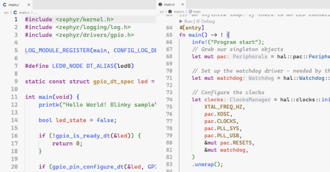](https://www.raspberrypi.com/news/develop-embedded-firmware-for-pico-using-rust-or-zephyr-with-pico-vscode/)

Raspberry Pi has upgraded the [Raspberry Pi Pico extension for Visual Studio Code](https://github.com/raspberrypi/pico-vscode) to support use of the Zephyr RTOS and the Rust programming language - [Raspberry Pi News](https://www.raspberrypi.com/news/develop-embedded-firmware-for-pico-using-rust-or-zephyr-with-pico-vscode/).

## Self Learning / Correcting Clock Using MicroPython

[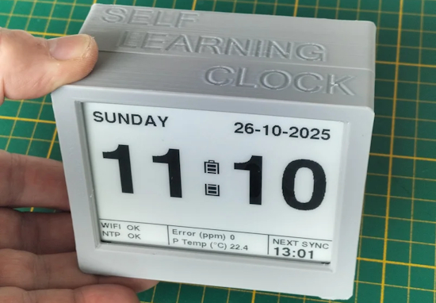](https://www.instructables.com/Self-Larning-Clock-SLC/)

The Self-Learning Clock (SLC) is a DIY clock that learns its own internal drift to maintain high accuracy with minimal NTP synchronizations. It uses an ultra-low power ESP32-S3 development board, paired with a 4.2-inch, high-contrast e-paper display running MicroPython - [Instructables](https://www.instructables.com/Self-Larning-Clock-SLC/).

## This Week's Python Streams

Python on Hardware is all about building a cooperative ecosphere which allows contributions to be valued and to grow knowledge. Below are the streams within the last week focusing on the community.

**CircuitPython Deep Dive Stream**

[Last Friday](https://youtube.com/live/HGg5jGbwqWo), Tim streamed work on the Fruit Jam Pixelfed Viewer.

You can see the latest video and past videos on the Adafruit YouTube channel under the Deep Dive playlist - [YouTube](https://www.youtube.com/playlist?list=PLjF7R1fz_OOXBHlu9msoXq2jQN4JpCk8A).

**CircuitPython Parsec**

John Park’s CircuitPython Parsec this week is on Spyce Invaders: Keeping Score - [Adafruit Blog](https://blog.adafruit.com/2025/10/31/john-parks-circuitpython-parsec-spyce-invaders-keeping-score/) and [YouTube](https://youtu.be/CCUr0QdxAxw).

Catch all the episodes in the [YouTube playlist](https://www.youtube.com/playlist?list=PLjF7R1fz_OOWFqZfqW9jlvQSIUmwn9lWr).

## Project of the Week: Hacking the GitHub Universe Conference Badge

Simon Willison picked up a GitHub Universe Tufty Badger 2350 conference badge. It incorporates a Raspberry Pi RP2350B microcontroller, battery, color screen, qwiic port, WiFi and Bluetooth with all the software written in MicroPython. Simon used the available documentation as input to Claude to write a new systems information app for the device, along with an icon editor and REPL access - [Simon Willison](https://simonwillison.net/2025/Oct/28/github-universe-badge/). Via the [Adafruit Blog](https://blog.adafruit.com/2025/10/29/hacking-the-wifi-enabled-color-screen-github-universe-conference-badge-simonw/).

## Popular Last Week

What was the most popular, most clicked link, in [last week's newsletter](https://www.adafruitdaily.com/2025/10/27/python-on-microcontrollers-newsletter-qualcomms-dev-grab-q-open-source-circuitpython-10-1-0-beta0-and-much-more-circuitpython-python-micropython-thepsf-raspberry_pi/)? [Behind Qualcomm’s Arduino Acquisition: 33 Million IoT Developers](https://www.forbes.com/sites/stevemcdowell/2025/10/22/behind-qualcomms-arduino-acquisition-33-million-iot-developers/).

Did you know you can read past issues of this newsletter in the Adafruit Daily Archive? [Check it out](https://www.adafruitdaily.com/category/circuitpython/).

## New Notes from Adafruit Playground

[Adafruit Playground](https://adafruit-playground.com/) is a new place for the community to post their projects and other making tips/tricks/techniques. Ad-free, it's an easy way to publish your work in a safe space for free.

Fruit Jam Tips and Tricks - [Adafruit Playground](https://adafruit-playground.com/u/AnneBarela/pages/fruit-jam-tips-and-tricks).

## News From Around the Web

[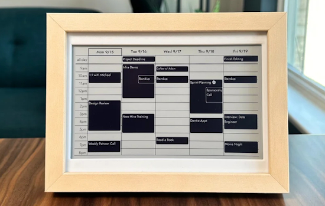](https://www.xda-developers.com/gorgeous-e-paper-raspberry-pi-project-perfect-companion-productivity-minded/)

The InkyPi project has come a long way, now supporting Waveshare e-paper displays and the new 2025 Spectra 6 Inky Impression from Pimoroni, with a total of 20 plugins. InkyPi runs on a Raspberry Pi Zero 2W and comes with a local web server hosted on the Pi that allows you to update the display from your browser, schedule refreshes, and build playlists to cycle between plugins. Programmeed in Python - [XDA](https://www.xda-developers.com/gorgeous-e-paper-raspberry-pi-project-perfect-companion-productivity-minded/) and [GitHub](https://github.com/fatihak/InkyPi).

The Rust team at Espressif has announced the official 1.0.0 release for `esp-hal`, the first vendor-backed Rust SDK for embedded devices - [Espressif](https://developer.espressif.com/blog/2025/10/esp-hal-1/).

[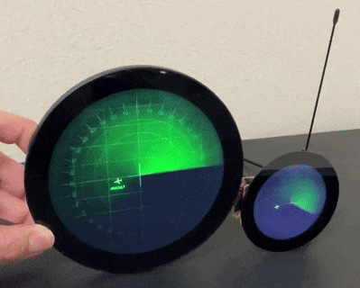](https://x.com/sozoraemon/status/1983467572155793409)

An airplane radar using a Raspberry Pi 4 (large) and Raspberry Pi Zero 2 W (small) in a dual round screen setup using Python - [X](https://x.com/sozoraemon/status/1983467572155793409).

[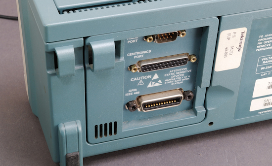](https://github.com/K4zuki/pipico-micropython-scpi)

`pipico-micropython-scpi` is an experimental repo for an SCPI device emulation using Raspberry Pi Pico + MicroPython. The [Standard Commands for Programmable Instruments](https://en.wikipedia.org/wiki/Standard_Commands_for_Programmable_Instruments) (SCPI; often pronounced "skippy") defines a standard for syntax and commands to use in controlling programmable test and measurement devices, such as automatic test equipment and electronic test equipment - [GitHub](https://github.com/K4zuki/pipico-micropython-scpi).

[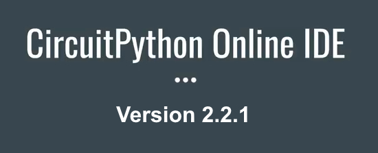](https://urfdvw.github.io/circuitpython-online-ide-2/)

River Wang's CircuitPython Online IDE 2.2.1 has been released featuring Serial Console enhancements. It will now auto-reconnect after re-plugging, and there are more configuration options - [circuitpy.dev](https://urfdvw.github.io/circuitpython-online-ide-2/).

Top 7 Python package managers - [KDnugget](https://www.kdnuggets.com/top-7-python-package-managers).

[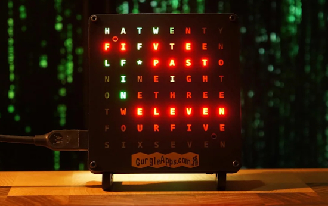](https://www.instructables.com/GurgleApps-Word-Clock-Assembly-With-an-Ambient-Lig/)

GurgleApps Word Clock assembly With an ambient light sensor and MicroPython - [Instructables](https://www.instructables.com/GurgleApps-Word-Clock-Assembly-With-an-Ambient-Lig/).

[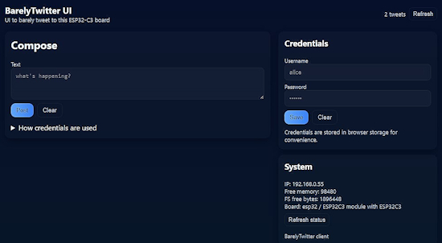](https://x.com/misaalanshori03/status/1983809580829491218)

Barely Twitter, recreated (barely) on a $2 ESP32-C3 Supermini microcontroller board. It lets you barely tweet anything... Nearly everything is running on the ESP32-C3. It has a MicroPython backend with zero security considerations, featuring a completely vibe-coded frontend - [X](https://x.com/misaalanshori03/status/1983809580829491218).

5 Text-to-Speech open source models - [KDnuggets](https://www.kdnuggets.com/top-5-text-to-speech-open-source-models).

[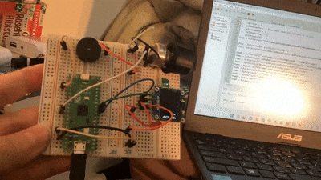](https://x.com/iGamerai/status/1983575829637689677)

Pico Invaders is a spacee invaders implementation, written in MicroPython for the Raspberry Pi Pico and a SSD1306 display - [X](https://x.com/iGamerai/status/1983575829637689677) and [GitHub](https://raw.githubusercontent.com/printnplay/Pico-MicroPython/refs/heads/main/picoinvaders.py).

[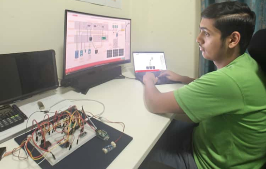](https://x.com/OjasJhaWise/status/1982131455603228900)

VyomSat is an open source project and learning kit for exploring microsatellite technology through hands-on CubeSat development using MicroPython - [X](https://x.com/OjasJhaWise/status/1982131455603228900) and [GitHub](https://github.com/OjasJha/vyomsat).

[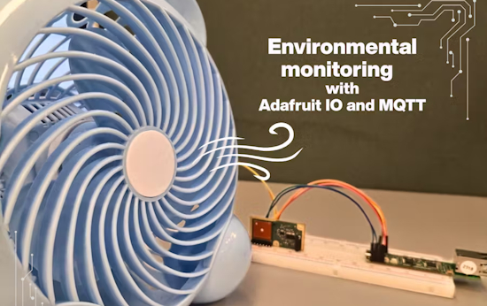](https://www.hackster.io/melodysit2003/environmental-monitoring-with-adafruit-io-and-mqtt-d77ebc)

Environmental monitoring with Adafruit IO and MQTT, this smart air quality system monitors toxins, temperature, and humidity. There is auto-fan cooling with real-time cloud alerts with Adafruit.io using CircuitPython - [hackster.io](https://www.hackster.io/melodysit2003/environmental-monitoring-with-adafruit-io-and-mqtt-d77ebc).

[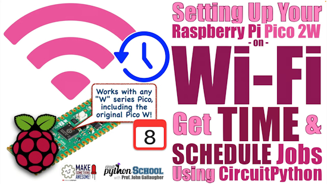](https://www.youtube.com/watch?v=mopOuE6L67Y)

Connect your Pico W or 2W to WiFi, get time with NTP, and schedule jobs (CircuitPython School) - [YouTube](https://www.youtube.com/watch?v=mopOuE6L67Y).

How to parse JSON in Python – a complete guide with examples - [freeCodeCamp](https://www.freecodecamp.org/news/how-to-parse-json-in-python-with-examples/).

10 Python libraries I wish I knew when I started - [Medium](https://python.plainenglish.io/10-python-libraries-i-wish-i-knew-when-i-started-bd83ebe2e9e5).

Programmer’s Python: Async shared memory – [i-programmer.info](https://www.i-programmer.info/programming/195-python/18418-programmers-python-async-shared-memory.html).

[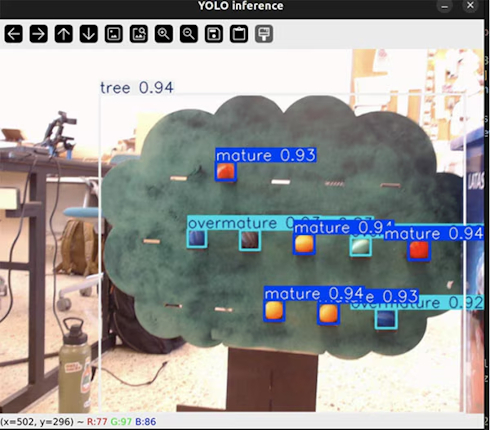](https://www.digikey.com/en/maker/tutorials/2025/from-webcam-to-cloud-building-an-iot-ready-computer-vision-system)

From Webcam to Cloud: building an IoT-ready computer vision system - [maker.io](https://www.digikey.com/en/maker/tutorials/2025/from-webcam-to-cloud-building-an-iot-ready-computer-vision-system).

5 lightweight services you can self-host on a Raspberry Pi - [How-To Geek](https://www.howtogeek.com/5ightweight-services-you-can-self-host-on-a-raspberry-pi/).

## New

Renesas has recently expanded its RA8 lineup with the RA8D2 and RA8M2 groups of MCUs. They offer up to 1MB of MRAM and 2MB of SRAM, and support SiP options with up to 8MB flash. The RA8D2 adds HMI capabilities, including a 1280×800 graphics LCD controller, a 2D drawing engine, MIPI DSI and CSI-2 interfaces, and audio input support - [CNX Software](https://www.cnx-software.com/2025/10/27/1ghz-renesas-ra8d2-and-ra8m2-cortex-m85-mcus-feature-up-to-1mb-mram-2mb-sram/).

Microchip has recently introduced the PIC32-BZ6 family of single-chip, multiprotocol wireless MCUs, also available as RF-certified modules. The module supports Bluetooth LE 6.0, IEEE 802.15.4-based Thread and Matter. There are two CAN-FD ports, a 10/100 Mbps Ethernet MAC, and a USB 2.0 full-speed transceiver - [CNX](https://www.cnx-software.com/2025/10/28/microchip-pic32-bz6-ble-6-0-thread-and-matter-wireless-mcu-integrates-touch-and-motor-control/).

## New Boards Supported by CircuitPython

The number of supported microcontrollers and Single Board Computers (SBC) grows every week. This section outlines which boards have been included in CircuitPython or added to [CircuitPython.org](https://circuitpython.org/).

There were no new boards added this week.

*Note: For non-Adafruit boards, please use the support forums of the board manufacturer for assistance, as Adafruit does not have the hardware to assist in troubleshooting.*

Looking to add a new board to CircuitPython? It's highly encouraged! Adafruit has four guides to help you do so:

- [How to Add a New Board to CircuitPython](https://learn.adafruit.com/how-to-add-a-new-board-to-circuitpython/overview)
- [How to add a New Board to the circuitpython.org website](https://learn.adafruit.com/how-to-add-a-new-board-to-the-circuitpython-org-website)
- [Adding a Single Board Computer to PlatformDetect for Blinka](https://learn.adafruit.com/adding-a-single-board-computer-to-platformdetect-for-blinka)
- [Adding a Single Board Computer to Blinka](https://learn.adafruit.com/adding-a-single-board-computer-to-blinka)

## New Learn Guides

The Adafruit Learning System has over 3,200 free guides for learning skills and building projects including using Python.

[Raspberry Pi Halloween Costume Detector](https://learn.adafruit.com/raspberry-pi-halloween-costume-detector) from [Liz Clark](https://learn.adafruit.com/u/BlitzCityDIY)

[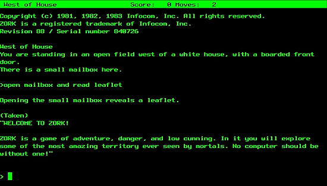](https://learn.adafruit.com/zork-and-the-z-machine)

[Fruit Jam, Zork and the Z Machine](https://learn.adafruit.com/zork-and-the-z-machine) from [Dan Cogliano](https://learn.adafruit.com/u/cogliano)

[Wireless LED Juggling Balls with ESP-NOW](https://learn.adafruit.com/wireless-juggling-balls-esp-now) from [John Park](https://learn.adafruit.com/u/johnpark)

## Updated Learn Guides

[Breakout Game on the Metro RP2350 and Fruit Jam](https://learn.adafruit.com/breakout-game-on-metro-rp2350-and-fruit-jam) by [Anne Barela](https://learn.adafruit.com/u/AnneBarela)

## CircuitPython Libraries

The CircuitPython library numbers are continually increasing, while existing ones continue to be updated. Here we provide library numbers and updates!

To get the latest Adafruit libraries, download the [Adafruit CircuitPython Library Bundle](https://circuitpython.org/libraries). To get the latest community contributed libraries, download the [CircuitPython Community Bundle](https://circuitpython.org/libraries).

If you'd like to contribute to the CircuitPython project on the Python side of things, the libraries are a great place to start. Check out the [CircuitPython.org Contributing page](https://circuitpython.org/contributing). If you're interested in reviewing, check out Open Pull Requests. If you'd like to contribute code or documentation, check out Open Issues. We have a guide on [contributing to CircuitPython with Git and GitHub](https://learn.adafruit.com/contribute-to-circuitpython-with-git-and-github), and you can find us in the #help-with-circuitpython and #circuitpython-dev channels on the [Adafruit Discord](https://adafru.it/discord).

You can check out this [list of all the Adafruit CircuitPython libraries and drivers available](https://github.com/adafruit/Adafruit_CircuitPython_Bundle/blob/master/circuitpython_library_list.md). 

The current number of CircuitPython libraries is **549**!

**Updated Libraries**

Here are this week's updated CircuitPython libraries:

  * [adafruit/Adafruit_CircuitPython_VEML7700](https://github.com/adafruit/Adafruit_CircuitPython_VEML7700)
  * [adafruit/Adafruit_CircuitPython_FruitJam](https://github.com/adafruit/Adafruit_CircuitPython_FruitJam)
  * [adafruit/Adafruit_CircuitPython_VL53L1X](https://github.com/adafruit/Adafruit_CircuitPython_VL53L1X)
  * [jins-tkomoda/CircuitPython_QMI8658C](https://github.com/jins-tkomoda/CircuitPython_QMI8658C)

## What’s the CircuitPython team up to this week?

What is the team up to this week? Let’s check in:

**Dan**

I found several bugs that caused crashes or disconnects when ending programs that used user-mounted SD cards present as USB devices. The fixes are all in a PR. I will be testing the fixes on ports other than Espressif before it's merged.

**Tim**

This week I've been working on code and guide with some more experiments using edge models locally on the Rasbperry Pi 5. This one features SmolLM3 for translation and wardrobe suggestions based on weather, and Piper TTS for synthesizing speech in several different languages. I've also tested some  improvements to the Fruit Jam logic gates simulator that I made recently and updated the guide with details of the new functionality.

**Scott**

This week I've continued work on DSI displays. I have a working ESP-IDF example with my hardware but it doesn't work from CircuitPython. So, I'm figuring out what is different between the two. Next week is short for me due to a week long vacation.

**Liz**

This week I published a project guide for a [Raspberry Pi Halloween Costume Detector](https://learn.adafruit.com/raspberry-pi-halloween-costume-detector). The build uses a Raspberry Pi 5 with a PiCamera and a speaker bonnet. There is a Python script that uses OpenCV to identify motion and a person in frame. When a person is identified, the photo is sent to the Claude Vision API with a prompt asking for a dad joke about the Halloween costume. When the joke text is returned, it's passed through the Piper text to speech API. This creates an audio file that is played through the speaker bonnet. I was able to reuse a 3D printed skull design from a previous project, [CircuitPython MIDI to CV Skull](https://learn.adafruit.com/circuitpython-midi-to-cv-skull) to work as the enclosure. It was a really fun build and I'm glad I was able to get it published right before Halloween.

## Upcoming Events

The final KiCad conference (KiCon) will be 15 November, 2025 in Shenzhen, China - [KiCad](https://kicon.kicad.org/).

The next MicroPython Meetup in Melbourne will be on November 19 – [Meetup](https://www.meetup.com/micropython-meetup/events). You can see recordings of previous meetings on [YouTube](https://www.youtube.com/@MicroPythonOfficial). 

PyLadiesCon returns December 5–7, 2025. 100% online conference designed for our global community. Talks, workshops, panels, and community fun – [PyLadies](https://conference.pyladies.com/2025-pyladiescon-is-back/).

**Coming in 2026**

* PyCascades 2026 will be 20 March 2026 – 21 March 2026 in Vancouver, British Columbia, Canada
* PyCon DE & PyData 2026 will be 13 April 2026 – 17 April 2026 in Darmstadt, Germany
* The Open Source Hardware Association Open Hardware Summit is coming to Berlin, Germany on May 23rd and 24th, 2025.
* PyCon AU 2026 will be 26 Aug. 2026 – 30 Aug. 2026 in Brisbane, Australia

**Send Your Events In**

If you know of virtual events or upcoming events, please let us know via email to cpnews(at)adafruit(dot)com.

## Latest Releases

CircuitPython's stable release is [10.0.3](https://github.com/adafruit/circuitpython/releases/latest) and its unstable release is [10.1.0-beta.0](https://github.com/adafruit/circuitpython/releases). New to CircuitPython? Start with our [Welcome to CircuitPython Guide](https://learn.adafruit.com/welcome-to-circuitpython).

[20251031](https://github.com/adafruit/Adafruit_CircuitPython_Bundle/releases/latest) is the latest Adafruit CircuitPython library bundle.

[20251027](https://github.com/adafruit/CircuitPython_Community_Bundle/releases/latest) is the latest CircuitPython Community library bundle.

[v1.26.1](https://micropython.org/download) is the latest MicroPython release. Documentation for it is [here](http://docs.micropython.org/en/latest/pyboard/).

[3.14.0](https://www.python.org/downloads/) is the latest Python release. The latest pre-release version is [3.15.0a1](https://www.python.org/download/pre-releases/).

[4,370 Stars](https://github.com/adafruit/circuitpython/stargazers) Like CircuitPython? [Star it on GitHub!](https://github.com/adafruit/circuitpython)

## Call for Help -- Translating CircuitPython is now easier than ever

One important feature of CircuitPython is translated control and error messages. With the help of fellow open source project [Weblate](https://weblate.org/), we're making it even easier to add or improve translations. 

Sign in with an existing account such as GitHub, Google or Facebook and start contributing through a simple web interface. No forks or pull requests needed! As always, if you run into trouble join us on [Discord](https://adafru.it/discord), we're here to help.

## 39,034 Thanks

The Adafruit Discord community, where we do all our CircuitPython development in the open, reached over 39,034 humans - thank you! Adafruit believes Discord offers a unique way for Python on hardware folks to connect. Join today at [https://adafru.it/discord](https://adafru.it/discord).

## ICYMI - In case you missed it

Python on hardware is the Adafruit Python video-newsletter-podcast! The news comes from the Python community, Discord, Adafruit communities and more and is broadcast on ASK an ENGINEER Wednesdays. The complete Python on Hardware weekly videocast [playlist is here](https://www.youtube.com/playlist?list=PLjF7R1fz_OOXRMjM7Sm0J2Xt6H81TdDev). The video podcast is on [iTunes](https://itunes.apple.com/us/podcast/python-on-hardware/id1451685192?mt=2), [YouTube](http://adafru.it/pohepisodes), [Instagram](https://www.instagram.com/adafruit/channel/)), and [XML](https://itunes.apple.com/us/podcast/python-on-hardware/id1451685192?mt=2).

[The weekly community chat on Adafruit Discord server CircuitPython channel - Audio / Podcast edition](https://itunes.apple.com/us/podcast/circuitpython-weekly-meeting/id1451685016) - Audio from the Discord chat space for CircuitPython, meetings are usually Mondays at 2pm ET, this is the audio version on [iTunes](https://itunes.apple.com/us/podcast/circuitpython-weekly-meeting/id1451685016), Pocket Casts, [Spotify](https://adafru.it/spotify), and [XML feed](https://adafruit-podcasts.s3.amazonaws.com/circuitpython_weekly_meeting/audio-podcast.xml).

## Contribute

The CircuitPython Weekly Newsletter is a CircuitPython community-run newsletter emailed every Monday. To contribute your content, please email your news to cpnews (at) adafruit (dot) com with information and link(s) to your content. 

Join the Adafruit [Discord](https://adafru.it/discord) or [post to the forum](https://forums.adafruit.com/viewforum.php?f=60) if you have questions.
