- [ ] Library and info updates
- [ ] change date
- [ ] update title
- [ ] Feature story
- [ ] Update  for images
- [ ] Update ICYDNCI
- [ ] All images 550w max only
- [ ] Link "View this email in your browser."

News Sources

- [Adafruit Playground](https://adafruit-playground.com/)
- Twitter: [CircuitPython](https://twitter.com/search?q=circuitpython&src=typed_query&f=live), [MicroPython](https://twitter.com/search?q=micropython&src=typed_query&f=live) and [Python](https://twitter.com/search?q=python&src=typed_query)
- [Raspberry Pi News](https://www.raspberrypi.com/news/)
- Mastodon [CircuitPython](https://mastodon.social/tags/CircuitPython) and [MicroPython](https://mastodon.social/tags/MicroPython)
- [hackster.io CircuitPython](https://www.hackster.io/search?q=circuitpython&i=projects&sort_by=most_recent) and [MicroPython](https://www.hackster.io/search?q=micropython&i=projects&sort_by=most_recent)
- YouTube: [CircuitPython](https://www.youtube.com/results?search_query=circuitpython&sp=CAI%253D), [MicroPython](https://www.youtube.com/results?search_query=micropython&sp=CAI%253D), [Prof Gallaugher](https://www.youtube.com/@BuildWithProfG/videos), [Teacher Brogan M. Pratt CircuitPython](https://www.youtube.com/playlist?list=PLRHdgFNRLyaN6eCw8b0yoHKDY9B4GiirU)
- [Google News Python](https://news.google.com/topics/CAAqIQgKIhtDQkFTRGdvSUwyMHZNRFY2TVY4U0FtVnVLQUFQAQ?hl=en-US&gl=US&ceid=US%3Aen)
- [maker.io Python](https://www.digikey.com/en/maker/search-results?s=createdDate&t=python)
- Instructables: [CircuitPython](https://www.instructables.com/search/?q=circuitpython&projects=all&sort=Newest), [MicroPython](https://www.instructables.com/search/?q=micropython&projects=all&sort=Newest), [Raspberry Pi Python](https://www.instructables.com/search/?q=raspberry+pi+python&projects=all&sort=Newest)
- [hackaday CircuitPython](https://hackaday.com/blog/?s=circuitpython) and [MicroPython](https://hackaday.com/blog/?s=micropython)
- [python.org](https://www.python.org/)
- [Python Insider - dev team blog](https://pythoninsider.blogspot.com/)
- Individuals: [bret.dk](https://bret.dk/), [Jeff Geerling](https://www.jeffgeerling.com/blog), [Yakroo](https://x.com/Yakroo5077)
- Tom's Hardware: [CircuitPython](https://www.tomshardware.com/search?searchTerm=circuitpython&articleType=all&sortBy=publishedDate) and [MicroPython](https://www.tomshardware.com/search?searchTerm=micropython&articleType=all&sortBy=publishedDate) and [Raspberry Pi](https://www.tomshardware.com/search?searchTerm=raspberry%20pi&articleType=all&sortBy=publishedDate)
- [hackaday.io newest projects MicroPython](https://hackaday.io/projects?tag=micropython&sort=date) and [CircuitPython](https://hackaday.io/projects?tag=circuitpython&sort=date)
- hackaday.io - [CircuitPython](https://hackaday.io/search?term=circuitpython) and [MicroPython](https://hackaday.io/search?term=micropython)

View this email in your browser. **Warning: Flashing Imagery**

Welcome to the latest Python on Microcontrollers newsletter! *insert 2-3 sentences from editor (what's in overview, banter)* - *Anne Barela, Editor*

We're on [Discord](https://discord.gg/HYqvREz), [Twitter/X](https://twitter.com/search?q=circuitpython&src=typed_query&f=live), [BlueSky](https://bsky.app/profile/circuitpython.org) and for past newsletters - [view them all here](https://www.adafruitdaily.com/category/circuitpython/). If you're reading this on the web, please [subscribe here](https://www.adafruitdaily.com/). Here's the news this week:

## Raspberry Pi 1 Will Be Losing Linux Support

[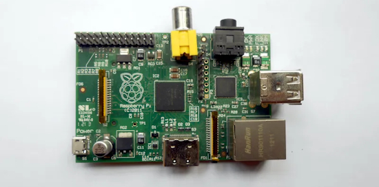](https://hackaday.com/2025/11/06/countdown-to-pi-1-loss-of-support-activated/)

The original Raspberry Pi 1 boards have had a long life, serving faithfully since 2012. Frankly, their continued support is a rarity these days — it’s truly incredible that an up-to-date OS image can still be downloaded for them in 2025. Perhaps one of the first signs of the end for the BCM2385 could be evident in Phoronix’s report on [Debian dropping support for MIPS64EL & ARMEL architectures](https://www.phoronix.com/news/Debian-Drops-MIPS64EL-ARMEL) - [Hackaday](https://hackaday.com/2025/11/06/countdown-to-pi-1-loss-of-support-activated/).

## CircuitPython 10.1.0 Beta 1 Released

CircuitPython 10.1.0-beta.1 is the latest beta release for 10.1.0. It has known bugs that will be fixed before the final release of 10.1.0 - [Adafruit Blog](https://blog.adafruit.com/2025/11/06/circuitpython-10-1-0-beta-1-released/) and release notes - [GitHub](https://github.com/adafruit/circuitpython/releases/tag/10.1.0-beta.1).

**Highlights of this release**
* Add `mipidsi` module to support MIPI DSI displays. Currently enabled for ESP32-P4.
* Fix problems with presenting user-mounted SD cards over USB.

## New Version of VSCode Extension "CircuitPython Sync" Adds Serial Port Support

[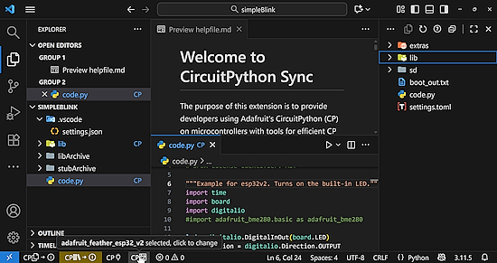](https://marketplace.visualstudio.com/items?itemName=padgettholdings.circuitpythonsync)

Version 2 of the Visual Studio Code extension "CircuitPython Sync" adds support for devices that don't present a CIRCUITPY drive, such as the Adafruit ESP32 Feather V2 and other brands. Version 2 offers almost all the features of Version 1 for serial port boards, such as file and library upload, a full featured board explorer and extensive built-in help. The extension continues to be fully open-source - [Visual Studio Marketplace](https://marketplace.visualstudio.com/items?itemName=padgettholdings.circuitpythonsync).

## The Raspberry Pi AES Hacking Challenge Has Been Extended

[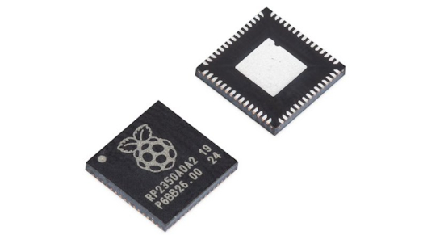](url)

Three months ago, Raspberry Pi launched a second RP2350 hacking challenge focusing on a side-channel analysis of the new SCA-hardened (side-channel analysis–hardened) AES library. The AES library is thus far unvanquished. They are extending the submission deadline for the challenge to midnight (UK time) on 31 December 2025 - [Raspberry Pi News](https://www.raspberrypi.com/news/rp2350-hacking-challenge-2-into-extra-time/)and [Challenge Page](https://github.com/raspberrypi/rp2350_hacking_challenge_2). Via [X](https://x.com/Raspberry_Pi/status/1985328802684125602).

## MIT Researchers Propose a New Model for Legible, Modular Software Than Using Pure AI

Coding with large language models (LLMs) holds huge promise, but it also exposes some long-standing flaws in software: code that’s messy, hard to change safely, and often opaque about what’s really happening under the hood. Researchers at MIT’s Computer Science and Artificial Intelligence Laboratory (CSAIL) are charting a more “modular” path ahead - [MIT News](https://news.mit.edu/2025/mit-researchers-propose-new-model-for-legible-modular-software-1106).

## Bluetooth 6.2 gets more responsive, improves security, USB communication, and testing capabilities

[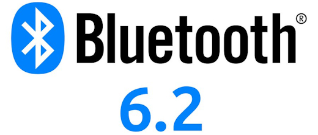](https://www.cnx-software.com/2025/11/05/bluetooth-6-2-gets-more-responsive-improves-security-usb-communication-and-testing-capabilities/)

Bluetooth 6.2 specification has just been released with a range of new features to enhance responsiveness with shorter connection intervals, strengthen security against amplitude-based RF attacks, and improve communication with a new “Bulk Serialization Mode” that’s especially useful for USB Bluetooth LE audio applications. The new Bluetooth Core 6.2 specification also introduces various BLE Test Mode enhancements - [CNX](https://www.cnx-software.com/2025/11/05/bluetooth-6-2-gets-more-responsive-improves-security-usb-communication-and-testing-capabilities/), [Core Specs](https://www.bluetooth.com/specifications/specs/core-specification-6-2/) and [Tech Overview](https://www.bluetooth.com/bluetooth-core-6-2-feature-overview/). Via [Adafruit Blog](https://blog.adafruit.com/2025/11/05/the-bluetooth-6-2-specification-has-been-released/).

## This Week's Python Streams

Python on Hardware is all about building a cooperative ecosphere which allows contributions to be valued and to grow knowledge. Below are the streams within the last week focusing on the community.

**CircuitPython Deep Dive Stream**

[Last Friday](https://youtube.com/live/4ACmNaTrNPs), Tim streamed work on screen savers for Fruit Jam OS.

You can see the latest video and past videos on the Adafruit YouTube channel under the Deep Dive playlist - [YouTube](https://www.youtube.com/playlist?list=PLjF7R1fz_OOXBHlu9msoXq2jQN4JpCk8A).

**CircuitPython Parsec**

John Park’s CircuitPython Parsec this week is on {subject} - [Adafruit Blog](link) and [YouTube](link).

Catch all the episodes in the [YouTube playlist](https://www.youtube.com/playlist?list=PLjF7R1fz_OOWFqZfqW9jlvQSIUmwn9lWr).

In the latest episode of The CircuitPython Show released November 10th, Paul interviews John Romkey.  John shares his Python app, `circremote`,  a command line tool for remotely executing CircuitPython code on a board. - [The CircuitPython Show](https://www.circuitpythonshow.com/@circuitpythonshow).

**CircuitPython Weekly Meeting**

CircuitPython Weekly Meeting for November 3, 2025 ([notes](https://github.com/adafruit/adafruit-circuitpython-weekly-meeting/blob/main/2025/2025-11-03.md)) [on YouTube](https://youtu.be/ksd4D7phNU4?si=j_-26VSAWdmaYvYw).

## Project of the Week: A Minecraft Shoe Costume

A lovely Minecraft sneaker project in which the lights on the costume blink in sync with the real shoes when the child stomps. Two Adafruit Feather RP2040 microcontrollers are used: one on an ankle with an accelerometer to detect a stomp that would trigger the real light-up shoe, and one in the costume to drive the LED light strip - [imgur](https://imgur.com/gallery/daughter-s-minecraft-shoe-costume-WsyXgBJ).

## Popular Last Week

[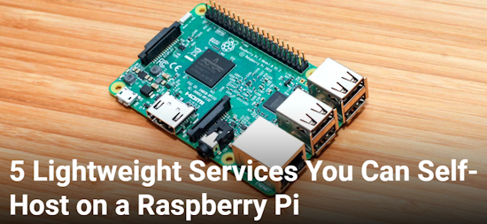](https://www.instructables.com/Self-Learning-Clock-SLC/)

What was the most popular, most clicked link, in [last week's newsletter](https://www.adafruitdaily.com/2025/11/03/python-on-microcontrollers-newsletter-micropython-badges-arduino-uno-q-hands-on-psf-says-no-and-more-circuitpython-python-micropython-thepsf-raspberry_pi/)? [Self Learning Clock (SLC)](https://www.instructables.com/Self-Learning-Clock-SLC/).

Did you know you can read past issues of this newsletter in the Adafruit Daily Archive? [Check it out](https://www.adafruitdaily.com/category/circuitpython/).

## New Notes from Adafruit Playground

[Adafruit Playground](https://adafruit-playground.com/) is a new place for the community to post their projects and other making tips/tricks/techniques. Ad-free, it's an easy way to publish your work in a safe space for free.

[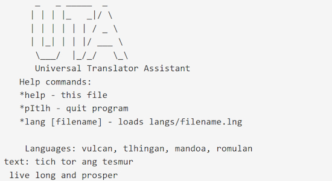](https://adafruit-playground.com/u/mrklingon/pages/talking-to-aliens-with-my-fruit-jam)

Talking to Aliens with my Fruit Jam - [Adafruit Playground](https://adafruit-playground.com/u/mrklingon/pages/talking-to-aliens-with-my-fruit-jam).

[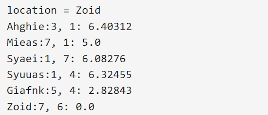](https://adafruit-playground.com/u/mrklingon/pages/astro-sf-starmaps-for-the-neotrinkey)

ASTRO - SF Starmaps for the Neotrinkey - [Adafruit Playground](https://adafruit-playground.com/u/mrklingon/pages/astro-sf-starmaps-for-the-neotrinkey).

[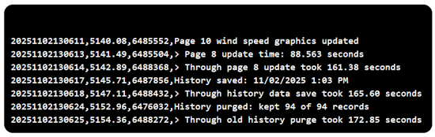](https://adafruit-playground.com/u/danak/pages/troubleshooting-circuitpython-programs-beyond-the-print-statement)

Troubleshooting CircuitPython Programs - Beyond the Print Statement - [Adafruit Playground](https://adafruit-playground.com/u/danak/pages/troubleshooting-circuitpython-programs-beyond-the-print-statement).

text - [Adafruit Playground](url).

## News From Around the Web

[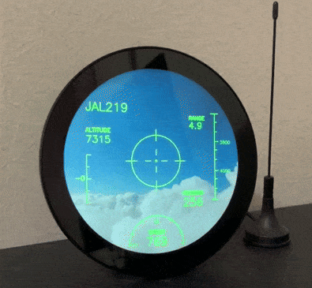](https://x.com/sozoraemon/status/1984590996924219559)

Receiving ADS-B signals transmitted from a nearby flying airplane and displaying them in a style reminiscent of a fighter jet's HUD (Head-Up Display). It's running on a Raspberry Pi using Python - [X](https://x.com/sozoraemon/status/1984590996924219559) and [Blog](https://sozorablog.com/flightradar/) (Japanese).

[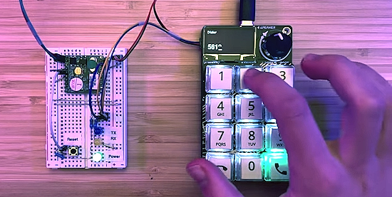](https://www.youtube.com/watch?v=T_9wwEUem8U)

Making a "telephone" built with a voicemodem and an RP2040 MacroPad from Adafruit. It can dial, and listen to calls, adjust volume, and detect when the line is in use or disconnected, pick up inbound calls, and parse caller id. The code is in CircuitPython - [YouTube](https://www.youtube.com/watch?v=T_9wwEUem8U).

[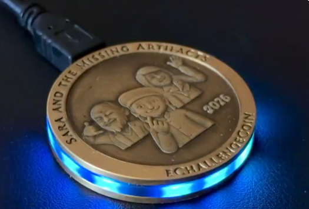](https://x.com/bradanlane/status/1986476903205577061)

Bradán Lane's 2026 eChallengeCoin has been shown and "has full support for CircuitPython 10" - [X](https://x.com/bradanlane/status/1986476903205577061).

[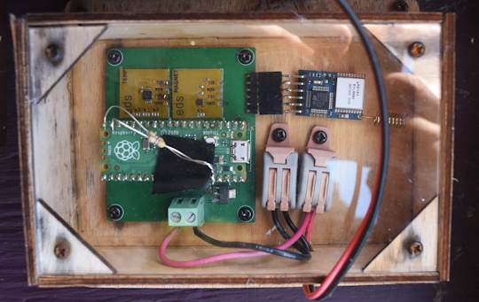](https://excamera.substack.com/p/chicken-coop-tech-stack)

Monitoring a chicken coup using a Raspberry Pi Pico, LoRa and CircuitPython - [Excamera Labs](https://excamera.substack.com/p/chicken-coop-tech-stack).

Do you know about reed switches and hall effect sensors? Add these to your project to give them magnetic super powers using MicroPython - [YouTube](https://www.youtube.com/live/6SpmwUdcS_g?si=7EpUjnVOaSdpIr0g).

[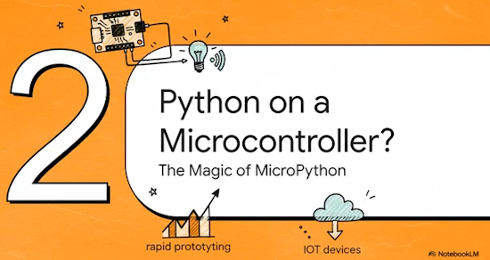](https://www.youtube.com/watch?v=84LtV8S0RlM)

The IoT Power Couple: MicroPython on ESP32 and RP2040 - [YouTube](https://www.youtube.com/watch?v=84LtV8S0RlM).

[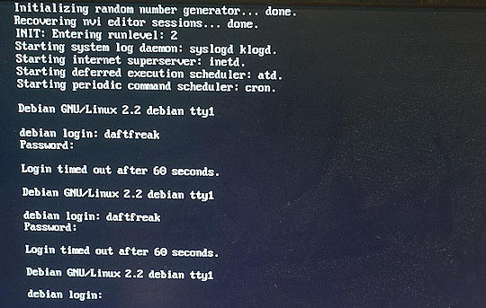](https://bsky.app/profile/charlie.daft.games/post/3m4h2myjiwfg2)

Charlie Birks has coded the probably-average-computer-emulator-32 which is capable of booting Debian Linux and Windows 95 (albeit rather slowly) - [BlueSky](https://bsky.app/profile/charlie.daft.games/post/3m4h2myjiwfg2) and [GitHub](https://github.com/Daft-Freak/probably-average-computer-emulator-32).

[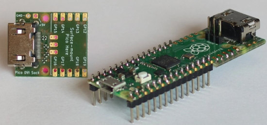](https://www.elektormagazine.com/news/raspberry-pi-pico-dvi)

Most video output via DVI on Raspberry Pi Pico microcontrollers tends to be 320x240. Mathias Klaussen has worked to display 640x480 by forgoing a framebuffer - [Elector](https://www.elektormagazine.com/news/raspberry-pi-pico-dvi) and [YouTube](https://youtu.be/1PsnXikew1Y).

[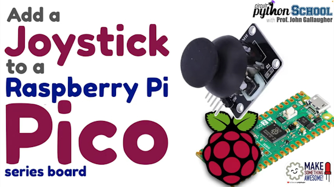](https://www.youtube.com/watch?v=YgUIkBt2Pto)

Add a joystick with a Raspberry Pi Pico (CircuitPython School) - [YouTube](https://www.youtube.com/watch?v=YgUIkBt2Pto).

[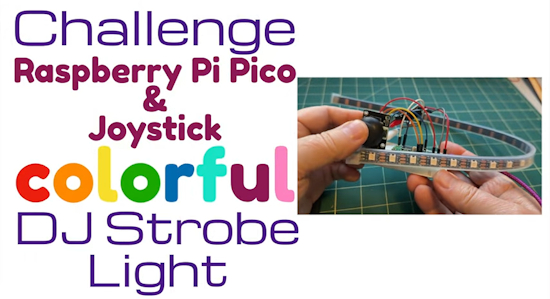](https://www.youtube.com/watch?v=iidICu-8QXk)

Challenge & Solution: Colorful DJ Strobe Light (CircuitPython School) - [YouTube](https://www.youtube.com/watch?v=iidICu-8QXk).

[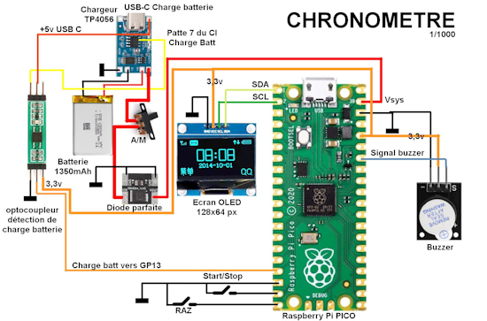](https://www.framboise314.fr/chronometre-raspberry-pi-pico/)

Build a standalone school timer with Raspberry Pi Pico, MicroPython, and an OLED screen - [Framboise 314](https://www.framboise314.fr/chronometre-raspberry-pi-pico/) (French).

[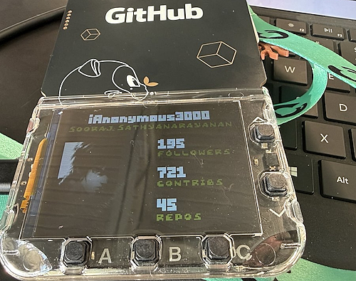](https://x.com/iAnonymous3000/status/1986104933528060093)

Another hack of the GitHub Universe 2025 badge to display GitHub statistics - [X](https://x.com/iAnonymous3000/status/1986104933528060093).

text - [site](url).

text - [site](url).

text - [site](url).

text - [site](url).

text - [site](url).

text - [site](url).

## New

[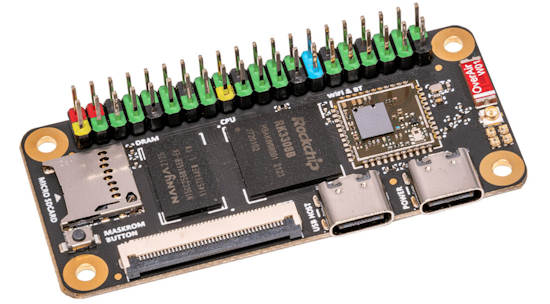](https://www.cnx-software.com/2025/10/31/sakura-pi-rk3308b-sbc-offers-rgb-lcd-interface-supports-mainline-linux/)

Sakura Pi RK3308B is a small SBC powered by the Rockchip RK3308B quad-core Cortex-A35 SoC. The board comes with 512 MB of DDR3 memory, a microSD card slot, an optional 4 GB or 8 GB eMMC flash, an RGB LCD interface to connect an LCD, two USB-C ports (one host, one OTG), a WiFi 5 and Bluetooth 4.2 module, and the usual 40-pin GPIO header - [CNX](https://www.cnx-software.com/2025/10/31/sakura-pi-rk3308b-sbc-offers-rgb-lcd-interface-supports-mainline-linux/).

[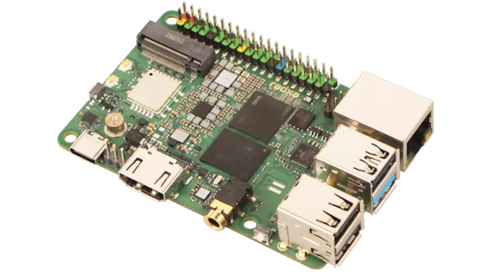](https://www.cnx-software.com/2025/10/27/radxa-dragon-q6a-a-qualcomm-qcs6490-edge-ai-sbc-with-gbe-wifi-6-three-camera-connectors/)

Radxa Dragon Q6A is a credit card-sized SBC powered by a Qualcomm QCS6490 octa-core SoC with a 12 TOPS AI accelerator, up to 16GB LPDDR5 memory, and the usual ports found on Raspberry Pi-like single board computers, such as gigabit Ethernet, four USB ports, HDMI video output, and a 40-pin GPIO header. The board also features an M.2 Key-M socket for SSD storage, a WiFi 6 and Bluetooth 5.4 wireless module, a MIPI DSI display interface, three MIPI CSI connectors, a connector for an eMMC or UFS flash module, a microphone input connector, and an RTC battery connector - [CNX](https://www.cnx-software.com/2025/10/27/radxa-dragon-q6a-a-qualcomm-qcs6490-edge-ai-sbc-with-gbe-wifi-6-three-camera-connectors/).

## New Boards Supported by CircuitPython

The number of supported microcontrollers and Single Board Computers (SBC) grows every week. This section outlines which boards have been included in CircuitPython or added to [CircuitPython.org](https://circuitpython.org/).

This week there were (#/no) new boards added:

- [Board name](url)
- [Board name](url)
- [Board name](url)

*Note: For non-Adafruit boards, please use the support forums of the board manufacturer for assistance, as Adafruit does not have the hardware to assist in troubleshooting.*

Looking to add a new board to CircuitPython? It's highly encouraged! Adafruit has four guides to help you do so:

- [How to Add a New Board to CircuitPython](https://learn.adafruit.com/how-to-add-a-new-board-to-circuitpython/overview)
- [How to add a New Board to the circuitpython.org website](https://learn.adafruit.com/how-to-add-a-new-board-to-the-circuitpython-org-website)
- [Adding a Single Board Computer to PlatformDetect for Blinka](https://learn.adafruit.com/adding-a-single-board-computer-to-platformdetect-for-blinka)
- [Adding a Single Board Computer to Blinka](https://learn.adafruit.com/adding-a-single-board-computer-to-blinka)

## New Learn Guides

The Adafruit Learning System has over 3,200 free guides for learning skills and building projects including using Python.

[Pixelfed Photo Viewer on Fruit Jam](https://learn.adafruit.com/pixelfed-photo-viewer-on-fruit-jam) from [Tim C](https://learn.adafruit.com/u/Foamyguy)

[title](url) from [name](url)

## Updated Learn Guides

[title](url)

## CircuitPython Libraries

The CircuitPython library numbers are continually increasing, while existing ones continue to be updated. Here we provide library numbers and updates!

To get the latest Adafruit libraries, download the [Adafruit CircuitPython Library Bundle](https://circuitpython.org/libraries). To get the latest community contributed libraries, download the [CircuitPython Community Bundle](https://circuitpython.org/libraries).

If you'd like to contribute to the CircuitPython project on the Python side of things, the libraries are a great place to start. Check out the [CircuitPython.org Contributing page](https://circuitpython.org/contributing). If you're interested in reviewing, check out Open Pull Requests. If you'd like to contribute code or documentation, check out Open Issues. We have a guide on [contributing to CircuitPython with Git and GitHub](https://learn.adafruit.com/contribute-to-circuitpython-with-git-and-github), and you can find us in the #help-with-circuitpython and #circuitpython-dev channels on the [Adafruit Discord](https://adafru.it/discord).

You can check out this [list of all the Adafruit CircuitPython libraries and drivers available](https://github.com/adafruit/Adafruit_CircuitPython_Bundle/blob/master/circuitpython_library_list.md). 

The current number of CircuitPython libraries is **###**!

**New Libraries**

Here are this week's new CircuitPython libraries:

* [library](url)

**Updated Libraries**

Here are this week's updated CircuitPython libraries:

* [library](url)

## What’s the CircuitPython team up to this week?

What is the team up to this week? Let’s check in:

**Dan**

I released CircuitPython 10.1.0-beta.1 last Thursday. This includes fixes for SD card USB presentation and also includes Scott's new native module for MIPI DSI support.

I'm starting work on a native C implementation of the adafruit_ESP32SPI library, which supports ESP32 and ESP32-C6 WiFi co-processors that run the NINA-FW firmware.

**Tim**

This week I wrote code and a guide for a basic Pixelfed photo viewer for the Fruit Jam. Pixelfed is a decentralized fediverse photo sharing social media system. I've also been reviewing and testing PRs in the Circup utility and in a handful of CircuitPython libraries.

**Scott**

This last week I got the DSI display working with the ESP32-P4 EV function board. I haven't gotten a second one working yet. I did PR the `mipidsi` module so others can try it. Next week I'm on vacation. Starting in December, I'll be back full time and look forward to making quicker progress.

**Liz**

This week I’ve been working on using HyperHDR, a video ambient lighting project, with a Sparkle Motion Stick. I have the software working well with my TV and now I’m working on a frame for the NeoPixel strip to go around the back of the TV. I should have a learn guide for it next week.

## Upcoming Events

The next MicroPython Meetup in Melbourne will be on November 26th – [Luma](https://luma.com/r0rq9pl4). You can see recordings of previous meetings on [YouTube](https://www.youtube.com/@MicroPythonOfficial). 

The final KiCad conference (KiCon) will be 15 November, 2025 in Shenzhen, China - [KiCad](https://kicon.kicad.org/).

PyLadiesCon returns December 5–7, 2025. 100% online conference designed for our global community. Talks, workshops, panels, and community fun – [PyLadies](https://conference.pyladies.com/2025-pyladiescon-is-back/).

**Coming in 2026**

* PyCascades 2026 will be 20 March 2026 – 21 March 2026 in Vancouver, British Columbia, Canada
* PyCon DE & PyData 2026 will be 13 April 2026 – 17 April 2026 in Darmstadt, Germany
* The Open Source Hardware Association Open Hardware Summit is coming to Berlin, Germany on May 23rd and 24th, 2025.
* PyCon AU 2026 will be 26 Aug. 2026 – 30 Aug. 2026 in Brisbane, Australia

**Send Your Events In**

If you know of virtual events or upcoming events, please let us know via email to cpnews(at)adafruit(dot)com.

## Latest Releases

CircuitPython's stable release is [#.#.#](https://github.com/adafruit/circuitpython/releases/latest) and its unstable release is [#.#.#-##.#](https://github.com/adafruit/circuitpython/releases). New to CircuitPython? Start with our [Welcome to CircuitPython Guide](https://learn.adafruit.com/welcome-to-circuitpython).

[2025####](https://github.com/adafruit/Adafruit_CircuitPython_Bundle/releases/latest) is the latest Adafruit CircuitPython library bundle.

[2025####](https://github.com/adafruit/CircuitPython_Community_Bundle/releases/latest) is the latest CircuitPython Community library bundle.

[v#.#.#](https://micropython.org/download) is the latest MicroPython release. Documentation for it is [here](http://docs.micropython.org/en/latest/pyboard/).

[#.#.#](https://www.python.org/downloads/) is the latest Python release. The latest pre-release version is [#.#.#](https://www.python.org/download/pre-releases/).

[#,### Stars](https://github.com/adafruit/circuitpython/stargazers) Like CircuitPython? [Star it on GitHub!](https://github.com/adafruit/circuitpython)

## Call for Help -- Translating CircuitPython is now easier than ever

[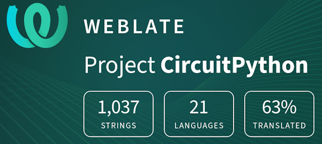](https://hosted.weblate.org/engage/circuitpython/)

One important feature of CircuitPython is translated control and error messages. With the help of fellow open source project [Weblate](https://weblate.org/), we're making it even easier to add or improve translations. 

Sign in with an existing account such as GitHub, Google or Facebook and start contributing through a simple web interface. No forks or pull requests needed! As always, if you run into trouble join us on [Discord](https://adafru.it/discord), we're here to help.

## NUMBER Thanks

The Adafruit Discord community, where we do all our CircuitPython development in the open, reached over NUMBER humans - thank you! Adafruit believes Discord offers a unique way for Python on hardware folks to connect. Join today at [https://adafru.it/discord](https://adafru.it/discord).

## ICYMI - In case you missed it

Python on hardware is the Adafruit Python video-newsletter-podcast! The news comes from the Python community, Discord, Adafruit communities and more and is broadcast on ASK an ENGINEER Wednesdays. The complete Python on Hardware weekly videocast [playlist is here](https://www.youtube.com/playlist?list=PLjF7R1fz_OOXRMjM7Sm0J2Xt6H81TdDev). The video podcast is on [iTunes](https://itunes.apple.com/us/podcast/python-on-hardware/id1451685192?mt=2), [YouTube](http://adafru.it/pohepisodes), [Instagram](https://www.instagram.com/adafruit/channel/)), and [XML](https://itunes.apple.com/us/podcast/python-on-hardware/id1451685192?mt=2).

[The weekly community chat on Adafruit Discord server CircuitPython channel - Audio / Podcast edition](https://itunes.apple.com/us/podcast/circuitpython-weekly-meeting/id1451685016) - Audio from the Discord chat space for CircuitPython, meetings are usually Mondays at 2pm ET, this is the audio version on [iTunes](https://itunes.apple.com/us/podcast/circuitpython-weekly-meeting/id1451685016), Pocket Casts, [Spotify](https://adafru.it/spotify), and [XML feed](https://adafruit-podcasts.s3.amazonaws.com/circuitpython_weekly_meeting/audio-podcast.xml).

## Contribute

The CircuitPython Weekly Newsletter is a CircuitPython community-run newsletter emailed every Monday. To contribute your content, please email your news to cpnews (at) adafruit (dot) com with information and link(s) to your content. 

Join the Adafruit [Discord](https://adafru.it/discord) or [post to the forum](https://forums.adafruit.com/viewforum.php?f=60) if you have questions.
