- [ ] Library and info updates
- [ ] change date
- [ ] update title
- [ ] Feature story
- [ ] Update  for images
- [ ] Update ICYDNCI
- [ ] All images 550w max only
- [ ] Link "View this email in your browser."

News Sources

- [Adafruit Playground](https://adafruit-playground.com/)
- Twitter: [CircuitPython](https://twitter.com/search?q=circuitpython&src=typed_query&f=live), [MicroPython](https://twitter.com/search?q=micropython&src=typed_query&f=live) and [Python](https://twitter.com/search?q=python&src=typed_query)
- [Raspberry Pi News](https://www.raspberrypi.com/news/), [Pi Foundation](https://www.raspberrypi.org/blog/)
- Mastodon [CircuitPython](https://mastodon.social/tags/CircuitPython) and [MicroPython](https://mastodon.social/tags/MicroPython)
- [hackster.io CircuitPython](https://www.hackster.io/search?q=circuitpython&i=projects&sort_by=most_recent) and [MicroPython](https://www.hackster.io/search?q=micropython&i=projects&sort_by=most_recent)
- YouTube: [CircuitPython](https://www.youtube.com/results?search_query=circuitpython&sp=CAI%253D), [MicroPython](https://www.youtube.com/results?search_query=micropython&sp=CAI%253D), [Prof Gallaugher](https://www.youtube.com/@BuildWithProfG/videos), [Teacher Brogan M. Pratt CircuitPython](https://www.youtube.com/playlist?list=PLRHdgFNRLyaN6eCw8b0yoHKDY9B4GiirU)
- [Google News Python](https://news.google.com/topics/CAAqIQgKIhtDQkFTRGdvSUwyMHZNRFY2TVY4U0FtVnVLQUFQAQ?hl=en-US&gl=US&ceid=US%3Aen)
- [maker.io Python](https://www.digikey.com/en/maker/search-results?s=createdDate&t=python)
- Instructables: [CircuitPython](https://www.instructables.com/search/?q=circuitpython&projects=all&sort=Newest), [MicroPython](https://www.instructables.com/search/?q=micropython&projects=all&sort=Newest), [Raspberry Pi Python](https://www.instructables.com/search/?q=raspberry+pi+python&projects=all&sort=Newest)
- [hackaday CircuitPython](https://hackaday.com/blog/?s=circuitpython) and [MicroPython](https://hackaday.com/blog/?s=micropython)
- [python.org](https://www.python.org/)
- [Python Insider - dev team blog](https://pythoninsider.blogspot.com/)
- Individuals: [bret.dk](https://bret.dk/), [Jeff Geerling](https://www.jeffgeerling.com/blog), [Yakroo](https://x.com/Yakroo5077)
- Tom's Hardware: [CircuitPython](https://www.tomshardware.com/search?searchTerm=circuitpython&articleType=all&sortBy=publishedDate) and [MicroPython](https://www.tomshardware.com/search?searchTerm=micropython&articleType=all&sortBy=publishedDate) and [Raspberry Pi](https://www.tomshardware.com/search?searchTerm=raspberry%20pi&articleType=all&sortBy=publishedDate)
- [hackaday.io newest projects MicroPython](https://hackaday.io/projects?tag=micropython&sort=date) and [CircuitPython](https://hackaday.io/projects?tag=circuitpython&sort=date)
- hackaday.io - [CircuitPython](https://hackaday.io/search?term=circuitpython) and [MicroPython](https://hackaday.io/search?term=micropython)
- [MicroPython Meeting](https://luma.com/micropython?k=c)

View this email in your browser. **Warning: Flashing Imagery**

Welcome to the latest Python on Microcontrollers newsletter! *insert 2-3 sentences from editor (what's in overview, banter)* - *Anne Barela, Editor*

We're on [Discord](https://discord.gg/HYqvREz), [Twitter/X](https://twitter.com/search?q=circuitpython&src=typed_query&f=live), [BlueSky](https://bsky.app/profile/circuitpython.org) and for past newsletters - [view them all here](https://www.adafruitdaily.com/category/circuitpython/). If you're reading this on the web, please [subscribe here](https://www.adafruitdaily.com/). Here's the news this week:

## Headline

text - [site](url).

## The Raspberry Pi Code Editor For Education Update

[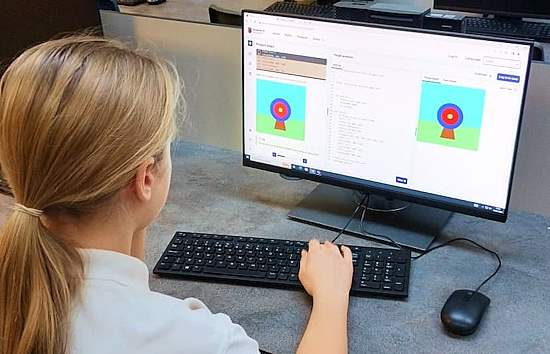]https://editor.raspberrypi.org/en/education)

Teachers can now import classes directly from Google Classroom, making setup faster and easier than ever. Tailored specifically to young people's needs, the integrated development environment (IDE) helps make learning text-based programming simple and accessible for children aged 9 and up - [editor.raspberrypi.edu](https://editor.raspberrypi.org/en/education).

## Electronic Drum Business Cards Built on RP2040 and CircuitPython

[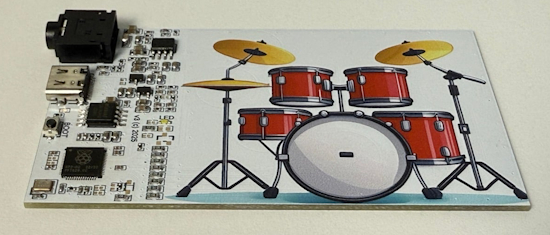](https://www.raspberrypi.com/news/electronic-drum-business-cards-built-on-rp2040/)

Embedded systems engineer Sergey Antonovich has reinvented the age-old business card by turning it into a playable electronic drum kit. Moving from a complex Linux version 1, version 2 was build ready within hours. “I started from a CircuitPython build for a 16MB RP2040 board, prepared a tiny drum sample set, and wrote a short script that scans pads and plays stereo WAVs via audiomixer and audiopwmio.” - [Raspberry Pi News](https://www.raspberrypi.com/news/electronic-drum-business-cards-built-on-rp2040/).

## MicroPython v1.27.0 52% To Goal

MicroPython developers had targeted November 14th for release of version 1.27.0. To date, they are 52%complete on completing, likely due to an ambitious list of features and pull requests - [GitHub](https://github.com/micropython/micropython/milestone/11).

You can download a preview version - [click on your board](https://micropython.org/download/) on their website and there should bee current and preview builds listed.

## Python 3.15.0 alpha 2 is Out

Python 3.15 is still in development. This release, 3.15.0a2, is the second of seven planned alpha releases. Alpha releases are intended to make it easier to test the current state of new features and bug fixes and to test the release process - [Python Insider Blog](https://pythoninsider.blogspot.com/2025/11/python-3150a2.html).

**Among the new major new features and changes so far**

* PEP 799: A new high-frequency, low-overhead, statistical sampling profiler and dedicated profiling package
* PEP 686: Python now uses UTF-8 as the default encoding
* PEP 782: A new PyBytesWriter C API to create a Python bytes object
* Improved error messages

## Python Remains the #1 Language While C# Grows

[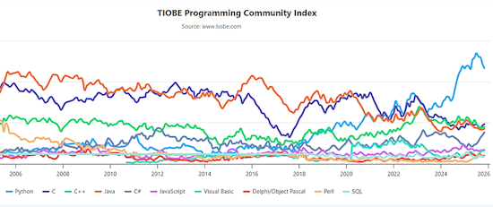](https://www.techrepublic.com/article/news-tiobe-commentary-nov-2025/)

The November 2025 TIOBE Index brings another twist below Python’s familiar lead. C solidifies its position as runner-up, C++ and Java lose some ground, and C# moves sharply upward, narrowing the gap with Java to less than a percentage point. At the bottom of the leaderboard, long-established languages once again define the shape of the top 10, with Perl reappearing and Go dropping out - [TechRepublic](https://www.techrepublic.com/article/news-tiobe-commentary-nov-2025/).

## This Week's Python Streams

Python on Hardware is all about building a cooperative ecosphere which allows contributions to be valued and to grow knowledge. Below are the streams within the last week focusing on the community.

**CircuitPython Deep Dive Stream**

[Last Friday](https://youtube.com/live/HvbUC4t1eVg), Tim was looking into the CircuitPython WASM port.

You can see the latest video and past videos on the Adafruit YouTube channel under the Deep Dive playlist - [YouTube](https://www.youtube.com/playlist?list=PLjF7R1fz_OOXBHlu9msoXq2jQN4JpCk8A).

**CircuitPython Parsec**

John Park’s CircuitPython Parsec is off this week. Catch all the episodes in the [YouTube playlist](https://www.youtube.com/playlist?list=PLjF7R1fz_OOWFqZfqW9jlvQSIUmwn9lWr).

**The CircuitPython Show**

In the latest episode of The CircuitPython Show released November 24th, Paul welcomes River Wang. River shares his work creating the CircuitPython Online IDE, his motivations, its features, and more. - [The CircuitPython Show](https://www.circuitpythonshow.com/@circuitpythonshow).

**CircuitPython Weekly Meeting**

CircuitPython Weekly Meeting for November 17, 2025 ([notes](https://github.com/adafruit/adafruit-circuitpython-weekly-meeting/blob/main/2025/2025-11-17.md)) [on YouTube](https://www.youtube.com/watch?v=imswXcOyvPk).

## Project of the Week: A Raspberry Pi Pico W  Binary Clock and Weather Monitor

[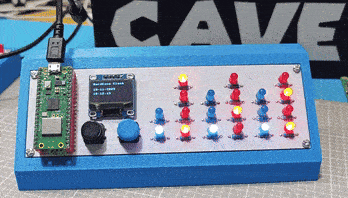](https://www.instructables.com/Raspberry-Pi-Pico-W-Binary-Clock-Weather-Monitor/)

Building a binary clock and weather monitor using the Raspberry Pi Pico W. It displays the time in binary using LEDs and also pulls the current weather data from the internet — all powered by a tiny microcontroller - [Instructables](https://www.instructables.com/Raspberry-Pi-Pico-W-Binary-Clock-Weather-Monitor/), [GitHub](https://github.com/Guitarman9119/Raspberry-Pi-Pico-/tree/refs/heads/main/Weather%20Binary%20Clock) and [YouTube](https://youtu.be/hAAY1Tiw1yg). Via [Hackaday](https://hackaday.com/2025/11/17/binary-clock-also-monitors-weather/).

## Popular Last Week

What was the most popular, most clicked link, in [last week's newsletter](https://www.adafruitdaily.com/2025/11/17/python-on-microcontrollers-newsletter-ikea-goes-matter-blockly-adopted-by-raspi-a-new-arduino-and-more-circuitpython-python-micropython-thepsf-raspberry_pi/)? [IKEA launches new smart home range with 21 Matter-compatible products](https://www.ikea.com/global/en/newsroom/retail/the-new-smart-home-from-ikea-matter-compatible-251106/).

Did you know you can read past issues of this newsletter in the Adafruit Daily Archive? [Check it out](https://www.adafruitdaily.com/category/circuitpython/).

## New Notes from Adafruit Playground

[Adafruit Playground](https://adafruit-playground.com/) is a new place for the community to post their projects and other making tips/tricks/techniques. Ad-free, it's an easy way to publish your work in a safe space for free.

[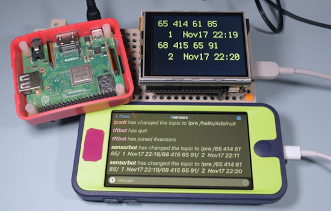](https://adafruit-playground.com/u/SamBlenny/pages/irc-display-bot)

IRC Display Bot - [Adafruit Playground](https://adafruit-playground.com/u/SamBlenny/pages/irc-display-bot).

[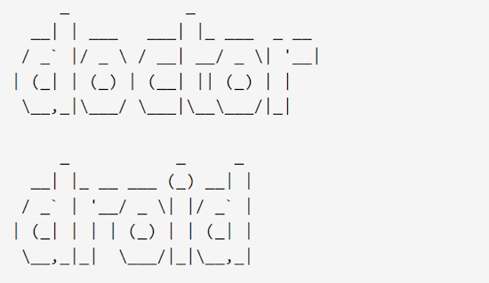](https://adafruit-playground.com/u/mrklingon/pages/the-doctor-will-see-you-know-a-chatbot-nobody-needs)

The Doctor will see you know - a chatbot nobody needs - [Adafruit Playground](https://adafruit-playground.com/u/mrklingon/pages/the-doctor-will-see-you-know-a-chatbot-nobody-needs).

[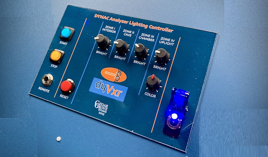](https://adafruit-playground.com/u/CGrover/pages/building-a-sci-fi-movie-prop)

Building a Sci-Fi Movie Prop - [Adafruit Playground](https://adafruit-playground.com/u/CGrover/pages/building-a-sci-fi-movie-prop).

[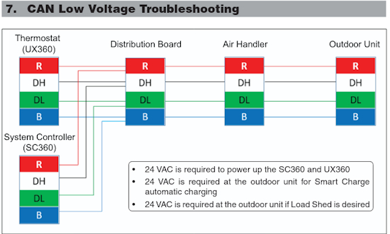](https://adafruit-playground.com/u/jepler/pages/trane-furnace-canbus)

Trane furnace canbus - [Adafruit Playground](https://adafruit-playground.com/u/jepler/pages/trane-furnace-canbus).

## News From Around the Web

[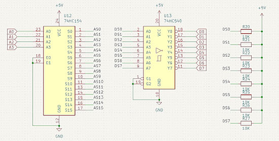](https://mastodon.social/@emalliab.wordpress.com@emalliab.wordpress.com/115555070667899565)

Kevin's Blog on Mastodon dives into replacing the ROM with a microcontroller, trying Arduino and CircuitPython - [Mastodon](https://mastodon.social/@emalliab.wordpress.com@emalliab.wordpress.com/115555070667899565).

[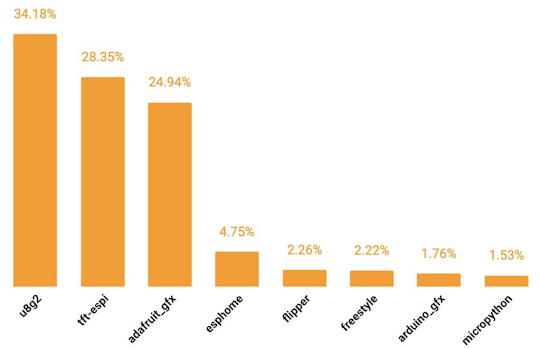](https://x.com/lopaka_app/status/1990505218816016558)

Lopaka.app reviews the most popular graphics library for tiny embedded displays and lists the graph above. It looks like they may have forgotten CircuitPython `displayio` - [X](https://x.com/lopaka_app/status/1990505218816016558).

From the archives: Raspberry Pirate Radio with Raspberry Pi aand Python - [Make Magazine](https://makezine.com/projects/raspberry-pirate-radio/). Via a recent post on [X](https://x.com/cqcqcqdx/status/1991666827903295623?t=IxvIKOZFFf5mqcIdna6PYQ&s=19). Also a similar article on [Hackaday](https://hackaday.com/2014/06/15/easily-turn-your-raspberry-pi-into-an-fm-transmitter/).

[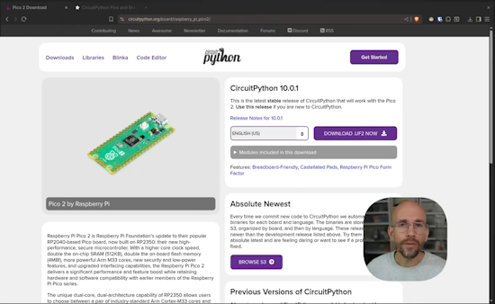](https://www.youtube.com/watch?v=TvWJmQLlC9U)

Video: Raspberry Pi Pico 2 W with CircuitPython (German original commentary and English dubbed soundtracks, select with the gear icon) - [YouTube](https://www.youtube.com/watch?v=TvWJmQLlC9U).

[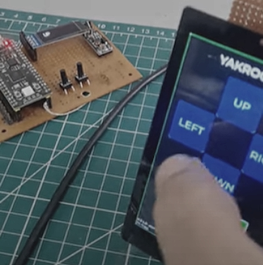](https://x.com/Yakroo5077/status/1990694895556964814)

Doing a LoRa TX/RX test on a touch panel with RP2350 and Python - [X](https://x.com/Yakroo5077/status/1990694895556964814) and [YouTube](https://www.youtube.com/shorts/lvk8hWtvcyc).

[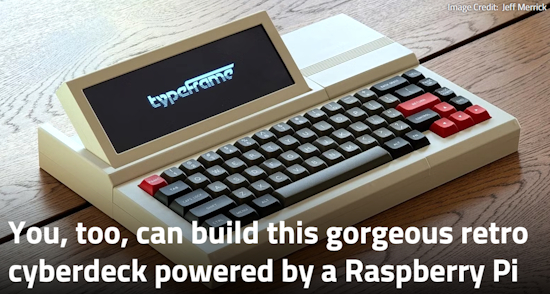](https://www.xda-developers.com/you-too-can-build-tgorgeous-retro-cyberdeck-powered-by-raspberry-pi/)

You, too, can build this gorgeous retro cyberdeck powered by a Raspberry Pi, Typescript and Python - [XDA](https://www.xda-developers.com/you-too-can-build-tgorgeous-retro-cyberdeck-powered-by-raspberry-pi/) and [GitHub](https://github.com/jeffmerrick/typeframe).

Python developers are looking at introducing the Rust programming language in CPython - [Phoronix](https://www.phoronix.com/news/Proposal-Rust-In-CPython) and [Python Discussion Forum](https://discuss.python.org/t/pre-pep-rust-for-cpython/104906).

Revisiting Mojo: a faster Python? - [InfoWorld](https://www.infoworld.com/article/4081105/revisiting-mojo-a-faster-python.html).

[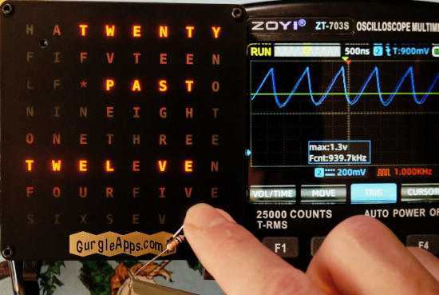](https://www.instructables.com/Add-Touch-Button-to-GurgleApps-Word-Clock-Using-RP/)

Adding a capacitive touch button to the [GurgleApps Word Clock](https://gurgleapps.com/reviews/electronics/wifi-controlled-color-word-clock-kit-micropython) without external resistors using PIO in MicroPython on a Pi Pico 2 W - [Instructables](https://www.instructables.com/Add-Touch-Button-to-GurgleApps-Word-Clock-Using-RP/).

[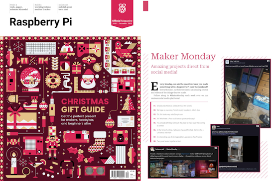](https://x.com/r_schulz_maker/status/1991484804781732190?s=03)

Roland Shulz posts about being featured talking about the new Arduino Uno Q and using MicroPython in the upcoming Christmas gift guide issue of the Official Raspberry Pi Magazine - [X](https://x.com/r_schulz_maker/status/1991484804781732190?s=03).

[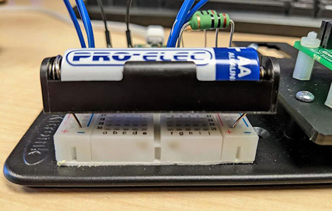](https://www.digikey.com/en/maker/tutorials/2025/raspberry-pi-pico-battery-voltmeter-in-python)

Raspberry Pi Pico battery voltmeter coded in MicroPython - [Maker.io](https://www.digikey.com/en/maker/tutorials/2025/raspberry-pi-pico-battery-voltmeter-in-python).

[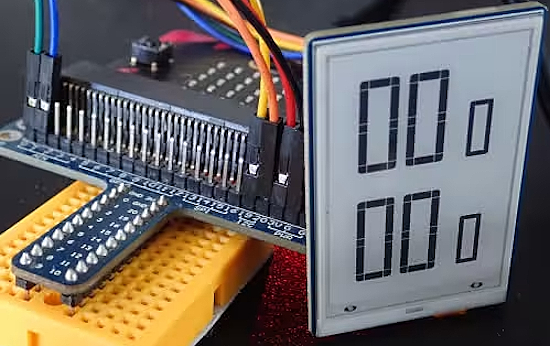](https://saitodev.co/programming/microbit/article/%E3%83%9E%E3%82%A4%E3%82%AF%E3%83%AD%E3%83%93%E3%83%83%E3%83%88%E3%81%A7I2C%E9%9B%BB%E5%AD%90%E3%83%9A%E3%83%BC%E3%83%91%E3%83%A2%E3%82%B8%E3%83%A5%E3%83%BC%E3%83%AB%E3%82%92%E4%BD%BF%E3%81%A3%E3%81%A6%E3%81%BF%E3%82%8B)

Using an I2C e-paper module with a micro:bit and MicroPython - [saitodev.co](https://saitodev.co/programming/microbit/article/%E3%83%9E%E3%82%A4%E3%82%AF%E3%83%AD%E3%83%93%E3%83%83%E3%83%88%E3%81%A7I2C%E9%9B%BB%E5%AD%90%E3%83%9A%E3%83%BC%E3%83%91%E3%83%A2%E3%82%B8%E3%83%A5%E3%83%BC%E3%83%AB%E3%82%92%E4%BD%BF%E3%81%A3%E3%81%A6%E3%81%BF%E3%82%8B) (Japanese).

[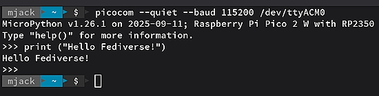](https://mastodon.social/@mjack@bsd.cafe/115578059129245310)

Raspberry Pi Pico 2 W with MicroPython on OpenSUSE Leap 16.0 - [Mastodon](https://mastodon.social/@mjack@bsd.cafe/115578059129245310).

[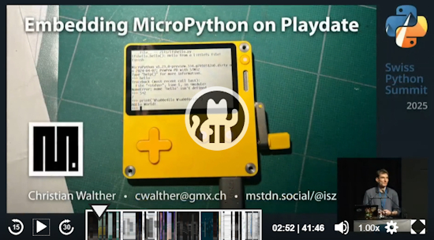](https://mastodon.social/@isziaui@mstdn.social/115561124781286979l)

Christian Walther's talk at the Swiss Python Summit, a lightning talk about “Embedding #MicroPython on Playdate,” is now available - [Mastodon](https://mastodon.social/@isziaui@mstdn.social/115561124781286979).

text - [site](url).

Writing readable Python functions doesn’t have to be difficult. This guide shows simple beginner-friendly techniques to make your code clear, consistent, and easy for others to understand - [KDnuggets](https://www.kdnuggets.com/how-to-write-readable-python-functions-even-if-youre-a-beginner).

[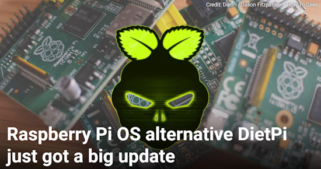](https://www.howtogeek.com/raspberry-pi-os-alternative-dietpi-update-9-19/)

Raspberry Pi OS alternative DietPi just got a big update - [How-To Geek](https://www.howtogeek.com/raspberry-pi-os-alternative-dietpi-update-9-19/).

The Basics Of Using Python For Quantum Computing - [OpenSourceForU](https://www.opensourceforu.com/2025/11/the-basics-of-using-python-for-quantum-computing/).

text - [site](url).

## New

[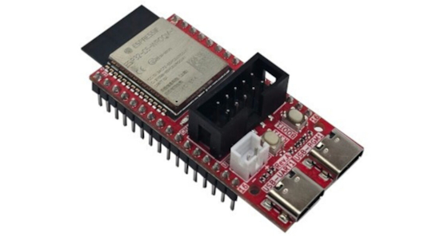](https://www.cnx-software.com/2025/11/12/olimex-esp32-c5-devkit-lipo-a-dual-band-wifi-6-ble-and-802-15-4-iot-board-with-battery-support-uext-connector/)

Olimex ESP32-C5-Devkit-Lipo is a compact ESP32-C5 board with dual-band WiFi 6, Bluetooth LE, and a 802.15.4 radio for Zigbee, Thread, and Matter connectivity with support for LiPo battery for a charging circuit - [CNX](https://www.cnx-software.com/2025/11/12/olimex-esp32-c5-devkit-lipo-a-dual-band-wifi-6-ble-and-802-15-4-iot-board-with-battery-support-uext-connector/).

[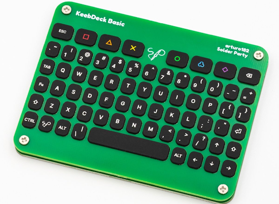](https://liliputing.com/solder-partys-keebdeck-is-a-cheap-open-source-69-key-thumb-keyboard/)

The KeebDeck Keyboard is a tiny thumb keyboard with 69 silicone keys arranged in an orthogonal layout, while the KeebDeck Basic is the first fully functional input device built around that keyboard. It’s a fully functional keyboard that has two PCBs, an STM32F042 microcontroller, USB Type-C interface, and an unpopulated Qwiic connector as well as an I2C interface. It ships with QMK firmware pre-installed, but you can use the I2C interface to flash alternate firmware - [Liliputing](https://liliputing.com/solder-partys-keebdeck-is-a-cheap-open-source-69-key-thumb-keyboard/), [Hackster.io](https://www.hackster.io/news/solder-party-launches-the-keebdeck-a-compact-silicone-keyboard-for-space-constrained-projects-06d01d8d106f) and [Solder Party](https://lectronz.com/stores/solderparty). And an audio cassette themed 3D printed case - [BlueSky](https://bsky.app/profile/solder.party/post/3m65pe7jxis2n).

[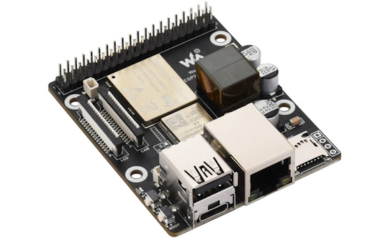](https://www.cnx-software.com/2025/11/19/waveshare-esp32-p4-esp32-c6-poe-development-board-targets-hmi-and-iot-applications/)

Waveshare has recently launched ESP32-P4-WIFI6-POE-ETH, a compact development board with Wi-Fi 6, Bluetooth 5 (LE), OTG, Ethernet, and PoE support, for various HMI and IoT applications. The board supports 100Mbps Ethernet with PoE, MIPI-CSI, MIPI-DSI, USB 2.0 OTG, audio codec + amplifier, microphone, MicroSD card slot, and 40-pin GPIO expansion - [CNX](https://www.cnx-software.com/2025/11/19/waveshare-esp32-p4-esp32-c6-poe-development-board-targets-hmi-and-iot-applications/).

## New Boards Supported by CircuitPython

The number of supported microcontrollers and Single Board Computers (SBC) grows every week. This section outlines which boards have been included in CircuitPython or added to [CircuitPython.org](https://circuitpython.org/).

This week there were (#/no) new boards added:

- [Board name](url)
- [Board name](url)
- [Board name](url)

*Note: For non-Adafruit boards, please use the support forums of the board manufacturer for assistance, as Adafruit does not have the hardware to assist in troubleshooting.*

Looking to add a new board to CircuitPython? It's highly encouraged! Adafruit has four guides to help you do so:

- [How to Add a New Board to CircuitPython](https://learn.adafruit.com/how-to-add-a-new-board-to-circuitpython/overview)
- [How to add a New Board to the circuitpython.org website](https://learn.adafruit.com/how-to-add-a-new-board-to-the-circuitpython-org-website)
- [Adding a Single Board Computer to PlatformDetect for Blinka](https://learn.adafruit.com/adding-a-single-board-computer-to-platformdetect-for-blinka)
- [Adding a Single Board Computer to Blinka](https://learn.adafruit.com/adding-a-single-board-computer-to-blinka)

## New Learn Guides

[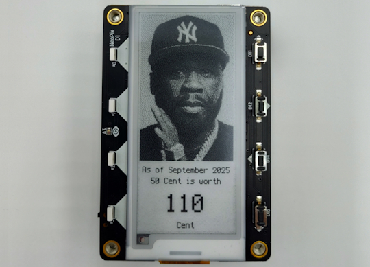](https://learn.adafruit.com/guides/latest)

The Adafruit Learning System has over 3,200 free guides for learning skills and building projects including using Python.

[title](url) from [name](url)

[title](url) from [name](url)

[title](url) from [name](url)

## Updated Learn Guides

[title](url)

## CircuitPython Libraries

The CircuitPython library numbers are continually increasing, while existing ones continue to be updated. Here we provide library numbers and updates!

To get the latest Adafruit libraries, download the [Adafruit CircuitPython Library Bundle](https://circuitpython.org/libraries). To get the latest community contributed libraries, download the [CircuitPython Community Bundle](https://circuitpython.org/libraries).

If you'd like to contribute to the CircuitPython project on the Python side of things, the libraries are a great place to start. Check out the [CircuitPython.org Contributing page](https://circuitpython.org/contributing). If you're interested in reviewing, check out Open Pull Requests. If you'd like to contribute code or documentation, check out Open Issues. We have a guide on [contributing to CircuitPython with Git and GitHub](https://learn.adafruit.com/contribute-to-circuitpython-with-git-and-github), and you can find us in the #help-with-circuitpython and #circuitpython-dev channels on the [Adafruit Discord](https://adafru.it/discord).

You can check out this [list of all the Adafruit CircuitPython libraries and drivers available](https://github.com/adafruit/Adafruit_CircuitPython_Bundle/blob/master/circuitpython_library_list.md). 

The current number of CircuitPython libraries is **###**!

**New Libraries**

Here are this week's new CircuitPython libraries:

* [library](url)

**Updated Libraries**

Here are this week's updated CircuitPython libraries:

* [library](url)

## What’s the CircuitPython team up to this week?

What is the team up to this week? Let’s check in:

**Dan**

text.

**Tim**

I made a 50 Cent inflation tracker project & guide for the MagTag this week. It pulls CPI data from the US Bureau of Labor Statistics API to compare current money buying power against that of 1994. I've also started work on a new version of the `pi_video_looper` project that aims to support the Raspberry Pi 5 and the latest versions of Raspberry Pi OS.

**Scott**

This week I've been dipping my toe back into Zephyr land while poking a Waveshare DSI display. I'm working to update CircuitPython to Zephyr 4.3.0, which just came out. I want to get the Waveshare DSI display going to get a second, different display going with the new `mipidsi` module on the ESP32-P4. Once I get the display going, I'll work exclusively on fleshing out the Zephyr port. I'm excited to leverage Claude Code to lay out a bunch of boiler plate as I add modules.

**Liz**

This week I published the [HyperHDR video lights guide](https://learn.adafruit.com/ambient-video-lighting-with-hyperhdr). I was able to write an Arduino script to work with the Pixel Trinkey. I also published a [video showing off the project](https://youtu.be/hNzoBn9OQhQ). Next, I'll be converting a decorative USB light that's shaped like a rainbow to be audio reactive. I'm going to use CircuitPython to write a program that uses FFT and PWM to control the light strips.

## Upcoming Events

The next MicroPython Meetup in Melbourne will be on November 26th – [Luma](https://luma.com/r0rq9pl4). You can see recordings of previous meetings on [YouTube](https://www.youtube.com/@MicroPythonOfficial). 

PyLadiesCon returns December 5–7, 2025. 100% online conference designed for our global community. Talks, workshops, panels, and community fun – [PyLadies](https://conference.pyladies.com/2025-pyladiescon-is-back/).

**Coming in 2026**

* PyCascades 2026 will be 20 March 2026 – 21 March 2026 in Vancouver, British Columbia, Canada
* PyCon DE & PyData 2026 will be 13 April 2026 – 17 April 2026 in Darmstadt, Germany
* The Open Source Hardware Association Open Hardware Summit is coming to Berlin, Germany on May 23rd and 24th, 2025.
* PyCon AU 2026 will be 26 Aug. 2026 – 30 Aug. 2026 in Brisbane, Australia

**Send Your Events In**

If you know of virtual events or upcoming events, please let us know via email to cpnews(at)adafruit(dot)com.

## Latest Releases

CircuitPython's stable release is [#.#.#](https://github.com/adafruit/circuitpython/releases/latest) and its unstable release is [#.#.#-##.#](https://github.com/adafruit/circuitpython/releases). New to CircuitPython? Start with our [Welcome to CircuitPython Guide](https://learn.adafruit.com/welcome-to-circuitpython).

[2025####](https://github.com/adafruit/Adafruit_CircuitPython_Bundle/releases/latest) is the latest Adafruit CircuitPython library bundle.

[2025####](https://github.com/adafruit/CircuitPython_Community_Bundle/releases/latest) is the latest CircuitPython Community library bundle.

[v#.#.#](https://micropython.org/download) is the latest MicroPython release. Documentation for it is [here](http://docs.micropython.org/en/latest/pyboard/).

[#.#.#](https://www.python.org/downloads/) is the latest Python release. The latest pre-release version is [#.#.#](https://www.python.org/download/pre-releases/).

[#,### Stars](https://github.com/adafruit/circuitpython/stargazers) Like CircuitPython? [Star it on GitHub!](https://github.com/adafruit/circuitpython)

## Call for Help -- Translating CircuitPython is now easier than ever

[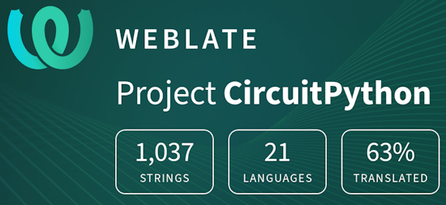](https://hosted.weblate.org/engage/circuitpython/)

One important feature of CircuitPython is translated control and error messages. With the help of fellow open source project [Weblate](https://weblate.org/), we're making it even easier to add or improve translations. 

Sign in with an existing account such as GitHub, Google or Facebook and start contributing through a simple web interface. No forks or pull requests needed! As always, if you run into trouble join us on [Discord](https://adafru.it/discord), we're here to help.

## NUMBER Thanks

The Adafruit Discord community, where we do all our CircuitPython development in the open, reached over NUMBER humans - thank you! Adafruit believes Discord offers a unique way for Python on hardware folks to connect. Join today at [https://adafru.it/discord](https://adafru.it/discord).

## ICYMI - In case you missed it

Python on hardware is the Adafruit Python video-newsletter-podcast! The news comes from the Python community, Discord, Adafruit communities and more and is broadcast on ASK an ENGINEER Wednesdays. The complete Python on Hardware weekly videocast [playlist is here](https://www.youtube.com/playlist?list=PLjF7R1fz_OOXRMjM7Sm0J2Xt6H81TdDev). The video podcast is on [iTunes](https://itunes.apple.com/us/podcast/python-on-hardware/id1451685192?mt=2), [YouTube](http://adafru.it/pohepisodes), [Instagram](https://www.instagram.com/adafruit/channel/)), and [XML](https://itunes.apple.com/us/podcast/python-on-hardware/id1451685192?mt=2).

[The weekly community chat on Adafruit Discord server CircuitPython channel - Audio / Podcast edition](https://itunes.apple.com/us/podcast/circuitpython-weekly-meeting/id1451685016) - Audio from the Discord chat space for CircuitPython, meetings are usually Mondays at 2pm ET, this is the audio version on [iTunes](https://itunes.apple.com/us/podcast/circuitpython-weekly-meeting/id1451685016), Pocket Casts, [Spotify](https://adafru.it/spotify), and [XML feed](https://adafruit-podcasts.s3.amazonaws.com/circuitpython_weekly_meeting/audio-podcast.xml).

## Contribute

The CircuitPython Weekly Newsletter is a CircuitPython community-run newsletter emailed every Monday. To contribute your content, please email your news to cpnews (at) adafruit (dot) com with information and link(s) to your content. 

Join the Adafruit [Discord](https://adafru.it/discord) or [post to the forum](https://forums.adafruit.com/viewforum.php?f=60) if you have questions.
