View this email in your browser. **Warning: Flashing Imagery**

Welcome to the latest Python on Microcontrollers newsletter! Greetings from a very snowy northern US. The newsletter took a break last week for US Thanksgiving and will likely do the same for Christmas week. The hiatus means this issue is larger than average. AI is devouring RAM worldwide, causing shortages for boards like PCs and single board computeers (SBC), subsequently rasing prices. If you're deploying a large number of Raspberry Pi SBCs, there is now an easy way to software provision them all. And it appears Python is gaining popularity as folks shy away from Arduino, amid controversy. All of this and much more in this issue. Grab a hot cocoa (or iced tea in Australia) and I hope you enjoy this issue. - *Anne Barela, Editor*

We're on [Discord](https://discord.gg/HYqvREz), [Twitter/X](https://twitter.com/search?q=circuitpython&src=typed_query&f=live), [BlueSky](https://bsky.app/profile/circuitpython.org) and for past newsletters - [view them all here](https://www.adafruitdaily.com/category/circuitpython/). If you're reading this on the web, please [subscribe here](https://www.adafruitdaily.com/). Here's the news this week:

## A Shortage of DDR4 and DDR5 RAM Worldwide Due to AI Usage

[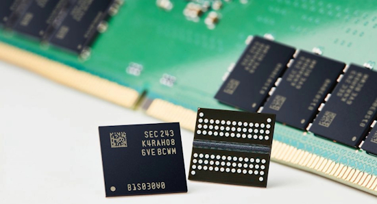](https://www.trendforce.com/news/2025/11/27/news-64gb-ddr5-ram-reportedly-now-pricier-than-a-playstation-5-amid-soaring-memory-costs/)

[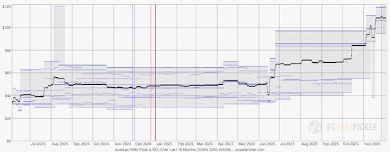](https://pcpartpicker.com/trends/price/memory/)

Driven by explosive AI demand, memory prices are climbing at a pace the industry hasn’t seen in years. Compared with earlier this year, price increases now range from 120% to 200%, particularly for newer DDR5 modules. Data from [PCPartPicker.com](https://pcpartpicker.com/trends/price/memory/) shows that the average price for a pair of 32GB DDR5 sticks (64GB total) has surpassed $600, up from around $200. The culprit is the high demand for memory for AI applications. Memory maker Micron is leaving the consumer market (Crucial) to focus sales solely towards AI data centers - [TrendForce](https://www.trendforce.com/news/2025/11/27/news-64gb-ddr5-ram-reportedly-now-pricier-than-a-playstation-5-amid-soaring-memory-costs/), [Micron](https://investors.micron.com/news-releases/news-release-details/micron-announces-exit-crucial-consumer-business) and [PCmag](https://www.pcmag.com/news/ddr5-ram-can-now-cost-more-than-a-playstation-5). Jeff Geerling video - [YouTube](https://www.youtube.com/watch?v=9rbz0akyLyQ).

## Raspberry Pi Releases a 1GB Pi 5 and Raises Prices on Pi 4, Pi 5 and Compute Modules

[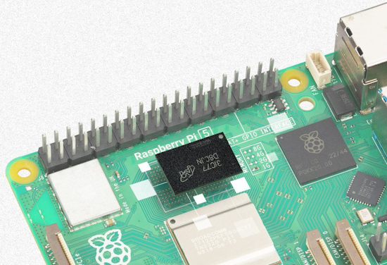](https://www.raspberrypi.com/news/1gb-raspberry-pi-5-now-available-at-45-and-memory-driven-price-rises/)

A 1GB Raspberry Pi 5 is now available at $45 to expand current offerings. But, to offset the recent unprecedented [rise in the cost of LPDDR4 memory](https://www.trendforce.com/news/2025/11/27/news-64gb-ddr5-ram-reportedly-now-pricier-than-a-playstation-5-amid-soaring-memory-costs/), they announced the price of some Raspberry Pi 4 and 5 products have been increased from $5 to $25 per board - [Raspberry Pi News](https://www.raspberrypi.com/news/1gb-raspberry-pi-5-now-available-at-45-and-memory-driven-price-rises/).

## Linux 6.18 is Out, Likely the Next Long Term Release Version

[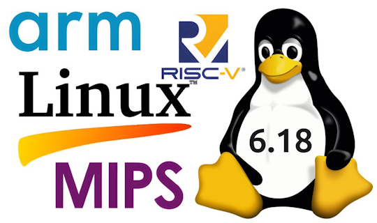](https://www.cnx-software.com/2025/12/01/linux-6-18-release-main-changes-arm-risc-v-and-mips-architectures/)

[Linus Torvalds announced](https://lkml.org/lkml/2025/11/30/341) the release of Linux 6.18. Notable changes include improved UDP networking throughput, additional Rust support, andadditional support on various chip architectures including Arm and RISC-V - [CNX](https://www.cnx-software.com/2025/12/01/linux-6-18-release-main-changes-arm-risc-v-and-mips-architectures/) and [Phoronix](https://www.phoronix.com/news/Linux-6.18-Released).

And for the neext version: Linux 6.19 Goes Ahead And Enables Microsoft C Extensions Support - [Phoronix](https://www.phoronix.com/news/Linux-6.19-Enables-MS-Ext).

## Why Developers Still Flock to Python: Guido van Rossum on Readability, AI, and the Future of Programming

[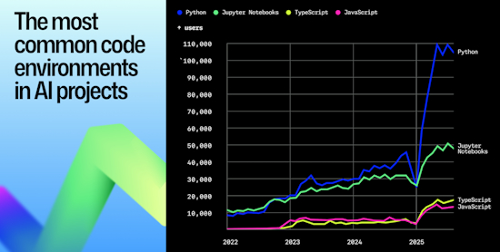](https://github.blog/developer-skills/programming-languages-and-frameworks/why-developers-still-flock-to-python-guido-van-rossum-on-readability-ai-and-the-future-of-programming/)

GitHub sat down with Python creator Guido van Rossum to discuss several modern developments in the industry - [GitHub Blog](https://github.blog/developer-skills/programming-languages-and-frameworks/why-developers-still-flock-to-python-guido-van-rossum-on-readability-ai-and-the-future-of-programming/).

> "The people now writing things for AI are familiar with Python because they started out in machine learning. Python isn’t just the language of AI. It enabled AI to become what it is today. That’s due, in part, to the language’s ability to evolve without sacrificing approachability. AI should adapt to us, not the other way around."   "Python is approachable because it’s designed for developers who are learning, tinkering, and exploring. Python’s future remains bright because its values align with how developers actually learn and build: readability, approachability, stability, and a touch of irreverence."

## Raspberry Pi Shakes Up Provisioning Their Boards With cloud-init

[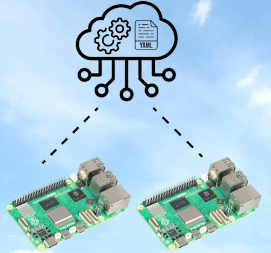](https://www.raspberrypi.com/news/cloud-init-on-raspberry-pi-os/)

Raspberry Pi introduced [`cloud-init`](https://cloudinit.readthedocs.io/en/latest/explanation/introduction.html) in their latest Raspberry Pi OS release based on Debian Trixie. It moves away from `config.txt` on the boot FAT partition to use three YAML files on the drive. The new methods allow broad configuration of the Pi set up from user creation, hardware provisioning and network set up. It all makes set up, from one or hundreds of boards, much easier. With [Raspberry Pi Imager 2.0](https://www.raspberrypi.com/news/a-new-raspberry-pi-imager/), `cloud-init` configuration for Raspberry Pi OS is now generated by default - [Raspberry Pi](https://www.raspberrypi.com/news/cloud-init-on-raspberry-pi-os/) and [hackster.io](https://www.hackster.io/news/raspberry-pi-aims-for-more-flexible-os-configuration-with-a-move-to-cloud-init-4394fd2c5adc).

## Raspberry Pi OS Update Adds Improvements

[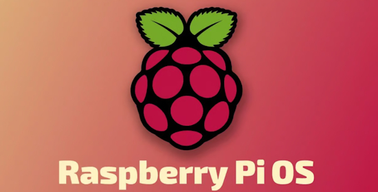](https://linuxiac.com/november-raspberry-pi-os-update-adds-hidpi-scaling/)

The November 2025 Raspberry Pi OS update adds full HiDPI scaling, refreshed icons, updated labwc, and new browser versions - [Liniac](https://linuxiac.com/november-raspberry-pi-os-update-adds-hidpi-scaling/).

## Why is Everyone Switching (from Arduino) to MicroPython?

Kevin McAleer streams that MicroPython is becoming the language for learning and developing code on microcontrollers. He asks why is this, and what are the main differences from Arduino - [YouTube](https://www.youtube.com/live/6cjYMklEsbk).

## Python 3.14.1 is Out With Many Improvements

[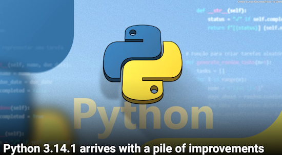](https://www.howtogeek.com/python-3-14-1-arrives-with-a-pile-of-improvements/)

Python 3.14 was released back in October, but a few bugs managed to push through the big release, and a few other changes weren't ready for prime time. A new minor update has now arrived as Python 3.14.1, containing around 558 bugfixes, build improvements and documentation changes since 3.14.0 - [How-To Geek](https://www.howtogeek.com/python-3-14-1-arrives-with-a-pile-of-improvements/) and [python.org](https://blog.python.org/2025/12/python-3141-is-now-available.html).

Also released was Python 3.13.10 containing around 300 bugfixes, build improvements and documentation changes since 3.13.9 - [python.org](https://blog.python.org/2025/12/python-31310-is-now-available-too-you.html).

## Shawn Hymel's CLI Guide Frees Arduino UNO Q Users From the "Limiting" App Lab

[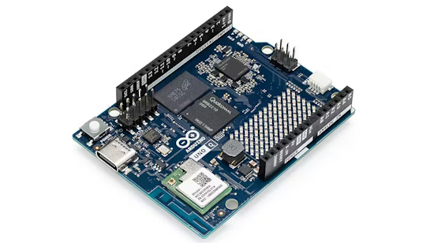](https://shawnhymel.com/3074/how-to-use-the-command-line-cli-with-the-arduino-uno-q/)

Maker Shawn Hymel has already found the Arduino App Lab, launched alongside the Arduino UNO Q single-board computer, to be a little restrictive for the more seasoned embedded developer. So he has a new guide to working with the Arduino UNO Q at the command-line instead. - [Shawn Hymel](https://shawnhymel.com/3074/how-to-use-the-command-line-cli-with-the-arduino-uno-q/) and [hackster.io](url). Check out a `blink` example - [GitHub](https://github.com/ShawnHymel/arduino_uno_q_blink_cli).

## This Week's Python Streams

Python on Hardware is all about building a cooperative ecosphere which allows contributions to be valued and to grow knowledge. Below are the streams within the last week focusing on the community.

**CircuitPython Deep Dive Stream**

[Last Friday](https://youtube.com/live/KIaKsFocfTA), Tim streamed work on Fancy Text & Bitmaptools outline function.

You can see the latest video and past videos on the Adafruit YouTube channel under the Deep Dive playlist - [YouTube](https://www.youtube.com/playlist?list=PLjF7R1fz_OOXBHlu9msoXq2jQN4JpCk8A).

**CircuitPython Parsec**

John Park’s CircuitPython Parsec this week is on using Microplot to plot data - [Adafruit Blog](https://blog.adafruit.com/2025/12/05/john-parks-circuitpython-parsec-using-microplot-to-plot-data/) and [YouTube](https://youtu.be/SMdC_jSwXrU).

Catch all the episodes in the [YouTube playlist](https://www.youtube.com/playlist?list=PLjF7R1fz_OOWFqZfqW9jlvQSIUmwn9lWr).

In the season finale, Dan Cogliano joins the show and discusses the CPZ Machine, the Zork game engine he ported to CircuitPython. The CircuitPython Show will return in 2026 - [The CircuitPython Show](https://www.circuitpythonshow.com/@circuitpythonshow).

**CircuitPython Weekly Meeting**

CircuitPython Weekly Meeting for December 1, 2025 ([notes](https://github.com/adafruit/adafruit-circuitpython-weekly-meeting/blob/main/2025/2025-12-01.md)) [on YouTube](https://youtu.be/x4IOaiZ85Jg).

## Project of the Week: The M314 Alien Motion Tracker

Robert Smith has built a "working" [M314 Motion Tracker](https://avp.fandom.com/wiki/M314_Motion_Tracker) from the movie [Aliens](https://avp.fandom.com/wiki/Aliens_(film)). It's based on a Raspberry Pi 4B, an ILI9341 display and an DreamHAT+Radar, running on Python - [robsmithdev.co.uk](https://alien.robsmithdev.co.uk/) and [YouTube](https://www.youtube.com/playlist?list=PL18CvD80w43YAV8UG24NtwRc2Wy-i7yyd). Via [Raspberry Pi](https://us8.campaign-archive.com/?e=ce7a578752&u=e31349e35c9c4dfb8bdf10e69&id=e3ca359c4b).

## Popular Last Issue: Python Remains the #1 Language While C# Grows

What was the most popular, most clicked link, in [the last newsletter](https://www.adafruitdaily.com/2025/11/24/python-on-microcontrollers-newsletter-python-still-1-a-pi-business-card-new-python-3-15-beta-and-more-circuitpython-python-micropython-thepsf-raspberry_pi/)? [Python Remains the #1 Language While C# Grows](https://www.techrepublic.com/article/news-tiobe-commentary-nov-2025/).

Did you know you can read past issues of this newsletter in the Adafruit Daily Archive? [Check it out](https://www.adafruitdaily.com/category/circuitpython/).

## New Notes from Adafruit Playground

[Adafruit Playground](https://adafruit-playground.com/) is a new place for the community to post their projects and other making tips/tricks/techniques. Ad-free, it's an easy way to publish your work in a safe space for free.

[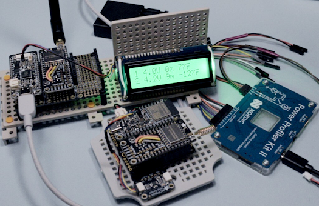](https://adafruit-playground.com/u/SamBlenny/pages/lora-wireless-greenhouse-monitor)

LoRa Wireless Greenhouse Monitor - [Adafruit Playground](https://adafruit-playground.com/u/SamBlenny/pages/lora-wireless-greenhouse-monitor).

[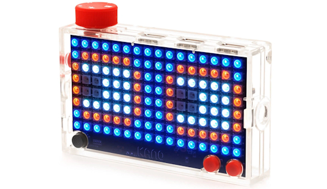](https://adafruit-playground.com/u/DJMixerC/pages/how-to-flash-and-run-circuitpython-on-your-kano-pixel-kit)

How to Flash and Run CircuitPython on Your Kano Pixel Kit - [Adafruit Playground](https://adafruit-playground.com/u/DJMixerC/pages/how-to-flash-and-run-circuitpython-on-your-kano-pixel-kit).

## News From Around the Web

[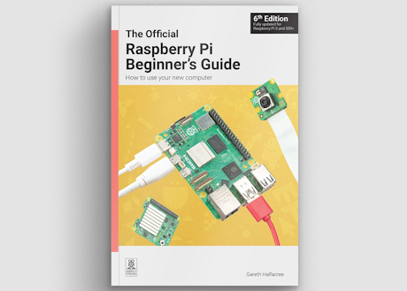](https://www.raspberrypi.com/news/the-6th-edition-of-our-beginners-guide-is-available-now/)

The 6th edition of the Raspberry Pi Beginner’s Guide is available now - [Raspberry Pi News](https://www.raspberrypi.com/news/the-6th-edition-of-our-beginners-guide-is-available-now/).

[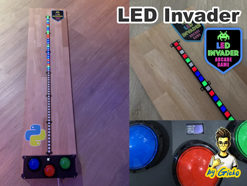](https://github.com/gickowtf/LED_Invader)

LED Invader is a one dimensional arcade game using CircuitPython - [Reddit](https://www.reddit.com/r/circuitpython/comments/1p8brzx/led_invader/) and [GitHub](https://github.com/gickowtf/LED_Invader).

[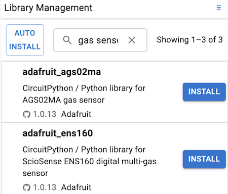](https://x.com/River___Wang/status/1994806019286077554?s=03)

River Wang's CircuitPython Online IDE 2.2.3 is out. The Library Manager now shows library descriptions and you can also search by description - [X](https://x.com/River___Wang/status/1994806019286077554?s=03).

[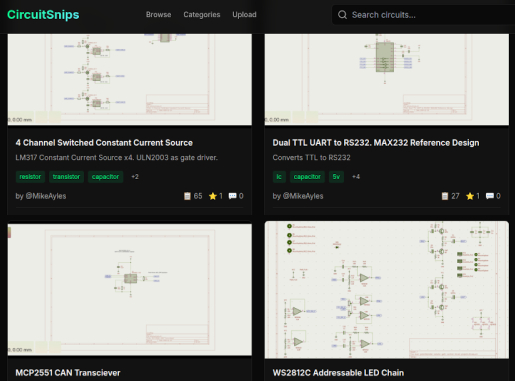](https://hackaday.com/2025/11/28/an-online-repository-for-kicad-schematics/)

An online repository For KiCad schematics - [Hackaday](https://hackaday.com/2025/11/28/an-online-repository-for-kicad-schematics/).

TRICORDEX is inspired by the Star Trek tricorder. A Heltec Mesh node T114 with nRF52840, GPS, I2C, BT, LoRa and CircuitPython as the main OS - [X](https://x.com/bobricius/status/1994380128621936689).

[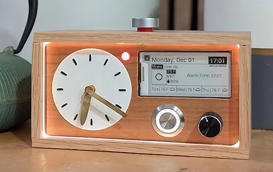](https://www.instructables.com/Digitial-Analog-Desk-Clock-Alarm-Clock/)

A digitial-analog desk alarm clock using a Raspberry Pi 2W, Python, Adafruit Blinka and CircuitPython - [Instructables](https://www.instructables.com/Digitial-Analog-Desk-Clock-Alarm-Clock/).

A talk at Djangocon Chicago 2025 by Pythonista Kattni: "The Source of Change: Bettering Online Open Source Communities Can Begin with You" - [DjangoTV](https://djangotv.com/videos/djangocon-us/2025/the-source-of-change-bettering-online-open-source-communities-can-begin-with-you-with-kattni/).

[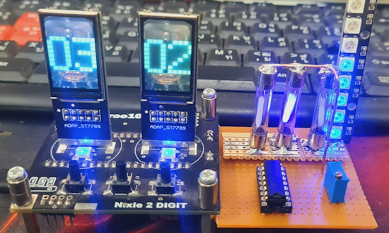](https://www.instructables.com/Retro-Futuristic-Hybrid-Clock/)

Making a retro-futuristic hybrid clock with Raspberry Pi Pico and CircuitPython - [Instructables](https://www.instructables.com/Retro-Futuristic-Hybrid-Clock/) and [YouTube](https://www.youtube.com/watch?v=k81SWZDNNIo).

[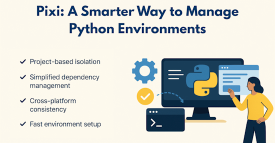](https://www.kdnuggets.com/pixi-a-smarter-way-to-manage-python-environments)

Pixi: a smarter way to manage Python environments - [kdnuggets](https://www.kdnuggets.com/pixi-a-smarter-way-to-manage-python-environments).

[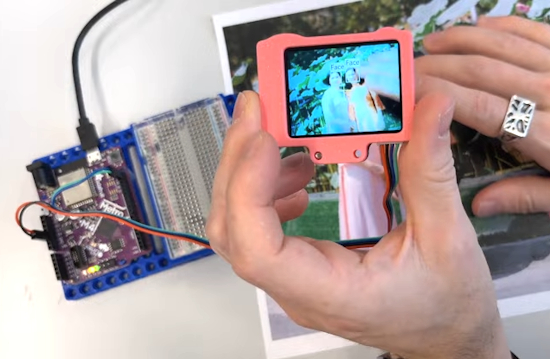](https://www.youtube.com/watch?v=Et7vXJgLRjA)

Face recognition made easy with a $40 camera, Adafruit Metro and CircuitPython - [YouTube](https://www.youtube.com/watch?v=Et7vXJgLRjA).

[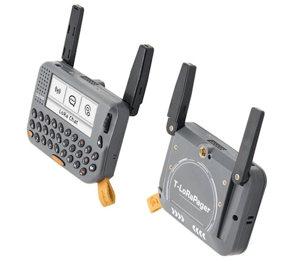](https://github.com/Xinyuan-LilyGO/LilyGoLib-MicroPython)

LILYGO has added MicroPython examples for T-Lorapager, which already supports the T-SIM series and T-Connect Pro - [GitHub](https://github.com/Xinyuan-LilyGO/LilyGoLib-MicroPython).

[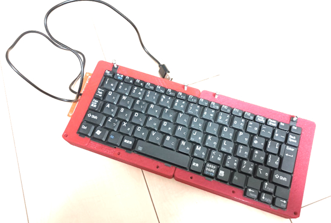](https://x.com/ina_ani/status/1996901950252896455)

Turned a laptop keyboard into a keyboard, using an ESP32-S3. The software uses KMK, which runs on CircuitPython - [X](https://x.com/ina_ani/status/1996901950252896455).

[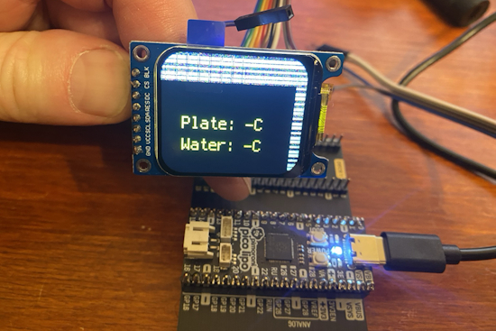](https://mastodon.social/@drfootleg@fosstodon.org/115606494826253724)

Cloud chamber electronics, a work in progress with CircuitPython - [Mastodon](https://mastodon.social/@drfootleg@fosstodon.org/115606494826253724).

[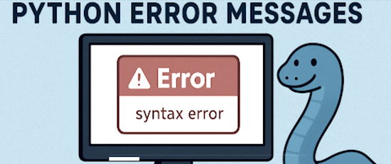](https://programminginsider.com/understanding-python-error-messages-why-theyre-not-as-scary-as-you-think/)

Understanding Python error messages: why they’re not as scary as you think - [Programming Insider](https://programminginsider.com/understanding-python-error-messages-why-theyre-not-as-scary-as-you-think/).

[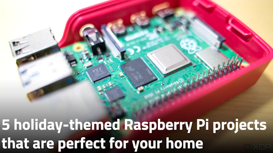](https://www.xda-developers.com/holiday-themed-raspberry-pi-projects-perfect-home/)

5 holiday-themed Raspberry Pi projects that are perfect for your home - [XDA](https://www.xda-developers.com/holiday-themed-raspberry-pi-projects-perfect-home/).

How often does Python allocate? - [zackoverflow](https://zackoverflow.dev/writing/how-often-does-python-allocate).

Simple tricks to make Python code faster - [Hackaday](https://hackaday.com/2025/11/25/simple-tricks-to-make-your-python-code-faster/).

7 useful ways to manipulate a text file with Python - [How-To Geek](https://www.howtogeek.com/useful-ways-to-manipulate-a-text-file-with-python/).

## New

[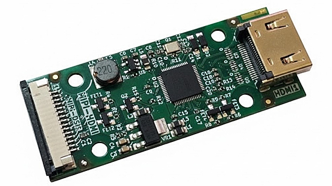](https://www.cnx-software.com/2025/12/04/olimex-lt8912b-based-mipi-hdmi-adapter-board-adds-hdmi-output-to-the-esp32-p4-devkit-board/)

The new Olimex MIPI-HDMI adapter board is built around Lontium Semiconductors’ LT8912B MIPI DSI to HDMI bridge chip and is designed to work with their own ESP32-P4-DevKit to turn 1–4 MIPI DSI data lanes (80 Mbps to 1.5 Gbps per lane) to HDMI 1.4 video out - [CNX](https://www.cnx-software.com/2025/12/04/olimex-lt8912b-based-mipi-hdmi-adapter-board-adds-hdmi-output-to-the-esp32-p4-devkit-board/) and [GitHub](https://github.com/OLIMEX/MIPI-HDMI).

Pimoroni unveils the Raspberry Pi RP2350-Powered Badgeware family of wearable displays building on the Badger's success. The three new Badgeware boards are an upgrade over earlier designs and have a Pi RP2350 microcontroller and feature WiFi and Bluetooth connectivity - [hackster.io](https://www.hackster.io/news/pimoroni-unveils-the-raspberry-pi-rp2350-powered-badgeware-family-of-wearable-displays-9c43d88872cd).

[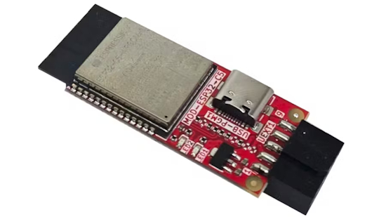](https://www.hackster.io/news/olimex-s-new-espressif-esp32-c5-uext-module-adds-dual-band-wi-fi-6-ble-and-thread-support-944802590dea)

Olimex's new Espressif ESP32-C5 UEXT module adds dual-band WiFi 6, BLE, and Thread support - [hackster.io](https://www.hackster.io/news/olimex-s-new-espressif-esp32-c5-uext-module-adds-dual-band-wi-fi-6-ble-and-thread-support-944802590dea).

## New Boards Supported by CircuitPython

The number of supported microcontrollers and Single Board Computers (SBC) grows every week. This section outlines which boards have been included in CircuitPython or added to [CircuitPython.org](https://circuitpython.org/).

This week there were no new boards added.

*Note: For non-Adafruit boards, please use the support forums of the board manufacturer for assistance, as Adafruit does not have the hardware to assist in troubleshooting.*

Looking to add a new board to CircuitPython? It's highly encouraged! Adafruit has four guides to help you do so:

- [How to Add a New Board to CircuitPython](https://learn.adafruit.com/how-to-add-a-new-board-to-circuitpython/overview)
- [How to add a New Board to the circuitpython.org website](https://learn.adafruit.com/how-to-add-a-new-board-to-the-circuitpython-org-website)
- [Adding a Single Board Computer to PlatformDetect for Blinka](https://learn.adafruit.com/adding-a-single-board-computer-to-platformdetect-for-blinka)
- [Adding a Single Board Computer to Blinka](https://learn.adafruit.com/adding-a-single-board-computer-to-blinka)

## New Learn Guides

The Adafruit Learning System has over 3,200 free guides for learning skills and building projects including using Python.

## CircuitPython Libraries

The CircuitPython library numbers are continually increasing, while existing ones continue to be updated. Here we provide library numbers and updates!

To get the latest Adafruit libraries, download the [Adafruit CircuitPython Library Bundle](https://circuitpython.org/libraries). To get the latest community contributed libraries, download the [CircuitPython Community Bundle](https://circuitpython.org/libraries).

If you'd like to contribute to the CircuitPython project on the Python side of things, the libraries are a great place to start. Check out the [CircuitPython.org Contributing page](https://circuitpython.org/contributing). If you're interested in reviewing, check out Open Pull Requests. If you'd like to contribute code or documentation, check out Open Issues. We have a guide on [contributing to CircuitPython with Git and GitHub](https://learn.adafruit.com/contribute-to-circuitpython-with-git-and-github), and you can find us in the #help-with-circuitpython and #circuitpython-dev channels on the [Adafruit Discord](https://adafru.it/discord).

You can check out this [list of all the Adafruit CircuitPython libraries and drivers available](https://github.com/adafruit/Adafruit_CircuitPython_Bundle/blob/master/circuitpython_library_list.md). 

The current number of CircuitPython libraries is **551**!

**New Libraries**

Here are this week's new CircuitPython libraries:

  * [bablokb/circuitpython-serial-tft](https://github.com/bablokb/circuitpython-serial-tft)

**Updated Libraries**

Here are this week's updated CircuitPython libraries:

  * [adafruit/Adafruit_CircuitPython_OPT4048](https://github.com/adafruit/Adafruit_CircuitPython_OPT4048)
  * [adafruit/Adafruit_CircuitPython_USB_Host_Mouse](https://github.com/adafruit/Adafruit_CircuitPython_USB_Host_Mouse)

## What’s the CircuitPython team up to this week?

What is the team up to this week? Let’s check in:

**Dan**

I'm continuing to work on a native C implementation of `wifi`, `socketpool`, and `ssl` that talk to an AirLift co-processor. I have communication with the AirLift processor working and I am now converting ESP32SPI-based code to use the `wifi/socketpool/socket` API.

**Tim**

This week I wrapped up the guide for Pi Video Looper 2, an updated version of a project from an outdated guide that turns a Raspberry Pi into a dedicated video looper. The new version is updated to work on Pi 4 & 5 with the latest full versions of RasPi OS. The next project that I've started is an Eink literary quotes clock. I wanted to be able to accent or highlight the part of the quote with the actual time in it, so I've created a new `Label` class that has the capability to use different foreground and background colors on specified ranges within the text. While doing that I submitted a PR adding `bitmaptools.replace_color()` function to the core that makes it quick and easy to replace all pixels of one color in a Bitmap with another. Here is a picture of a test of the new `Label`:

[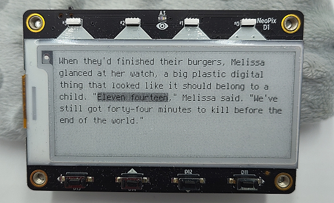](https://www.circuitpython.org/)

**Scott**

Last week I was out due to illness and the Thanksgiving holiday. This week my youngest started daycare! So, I'm back in my office space and working all day. I'm currently working to expand the Zephyr port with a focus on the nRF54H20. I'm also working on the ESP32-P4.

**Liz**

[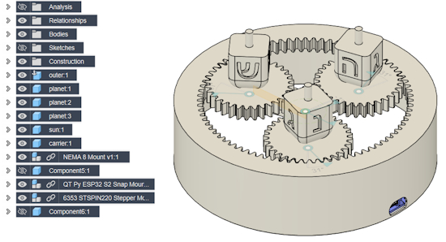](https://www.circuitpython.org/)

This week I published a guide for the new [ENS161 MOX gas sensor](https://learn.adafruit.com/adafruit-ens161-mox-gas-sensor) that is in the shop. It is an updated version of the ENS160 sensor and only required a slight update to the CircuitPython driver to have it working. Next up for me is a Hanukkah project that involves a planetary gear, stepper motor and dreidels all powered by CircuitPython.

## Upcoming Events

Note that in December there are not many scheduled meetings due to the holidays.

The next MicroPython Meetup in Melbourne will be in January due to the holidays – [Luma](https://luma.com/r0rq9pl4). You can see recordings of previous meetings on [YouTube](https://www.youtube.com/@MicroPythonOfficial). 

**Coming in 2026**

* PyCascades 2026 will be 20 March 2026 – 21 March 2026 in Vancouver, British Columbia, Canada
* PyCon DE & PyData 2026 will be 13 April 2026 – 17 April 2026 in Darmstadt, Germany
* The Open Source Hardware Association Open Hardware Summit is coming to Berlin, Germany on May 23rd and 24th, 2025.
* PyCon AU 2026 will be 26 Aug. 2026 – 30 Aug. 2026 in Brisbane, Australia

**Send Your Events In**

If you know of virtual events or upcoming events, please let us know via email to cpnews(at)adafruit(dot)com.

## Latest Releases

CircuitPython's stable release is [10.0.3](https://github.com/adafruit/circuitpython/releases/latest) and its unstable release is [10.1.0-beta.1](https://github.com/adafruit/circuitpython/releases). New to CircuitPython? Start with our [Welcome to CircuitPython Guide](https://learn.adafruit.com/welcome-to-circuitpython).

[20251204](https://github.com/adafruit/Adafruit_CircuitPython_Bundle/releases/latest) is the latest Adafruit CircuitPython library bundle.

[20251204](https://github.com/adafruit/CircuitPython_Community_Bundle/releases/latest) is the latest CircuitPython Community library bundle.

[v1.26.1](https://micropython.org/download) is the latest MicroPython release. Documentation for it is [here](http://docs.micropython.org/en/latest/pyboard/).

[3.14.2](https://www.python.org/downloads/) is the latest Python release. The latest pre-release version is [3.15.0a2](https://www.python.org/download/pre-releases/).

[4,407 Stars](https://github.com/adafruit/circuitpython/stargazers) Like CircuitPython? [Star it on GitHub!](https://github.com/adafruit/circuitpython)

## Call for Help -- Translating CircuitPython is now easier than ever

[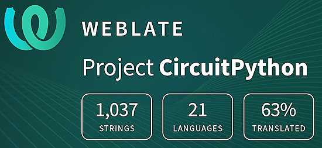](https://hosted.weblate.org/engage/circuitpython/)

One important feature of CircuitPython is translated control and error messages. With the help of fellow open source project [Weblate](https://weblate.org/), we're making it even easier to add or improve translations. 

Sign in with an existing account such as GitHub, Google or Facebook and start contributing through a simple web interface. No forks or pull requests needed! As always, if you run into trouble join us on [Discord](https://adafru.it/discord), we're here to help.

## 39,087 Thanks

The Adafruit Discord community, where we do all our CircuitPython development in the open, reached over 39,087 humans - thank you! Adafruit believes Discord offers a unique way for Python on hardware folks to connect. Join today at [https://adafru.it/discord](https://adafru.it/discord).

## ICYMI - In case you missed it

Python on hardware is the Adafruit Python video-newsletter-podcast! The news comes from the Python community, Discord, Adafruit communities and more and is broadcast on ASK an ENGINEER Wednesdays. The complete Python on Hardware weekly videocast [playlist is here](https://www.youtube.com/playlist?list=PLjF7R1fz_OOXRMjM7Sm0J2Xt6H81TdDev). The video podcast is on [iTunes](https://itunes.apple.com/us/podcast/python-on-hardware/id1451685192?mt=2), [YouTube](http://adafru.it/pohepisodes), [Instagram](https://www.instagram.com/adafruit/channel/)), and [XML](https://itunes.apple.com/us/podcast/python-on-hardware/id1451685192?mt=2).

[The weekly community chat on Adafruit Discord server CircuitPython channel - Audio / Podcast edition](https://itunes.apple.com/us/podcast/circuitpython-weekly-meeting/id1451685016) - Audio from the Discord chat space for CircuitPython, meetings are usually Mondays at 2pm ET, this is the audio version on [iTunes](https://itunes.apple.com/us/podcast/circuitpython-weekly-meeting/id1451685016), Pocket Casts, [Spotify](https://adafru.it/spotify), and [XML feed](https://adafruit-podcasts.s3.amazonaws.com/circuitpython_weekly_meeting/audio-podcast.xml).

## Contribute

The CircuitPython Weekly Newsletter is a CircuitPython community-run newsletter emailed every Monday. To contribute your content, please email your news to cpnews (at) adafruit (dot) com with information and link(s) to your content. 

Join the Adafruit [Discord](https://adafru.it/discord) or [post to the forum](https://forums.adafruit.com/viewforum.php?f=60) if you have questions.
