View this email in your browser. **Warning: Flashing Imagery**

Welcome to the latest Python on Microcontrollers newsletter! Your intrepid editor, having dug out of the Midwestern US snow, has gathered a bountiful selection of Python on Hardware content for this week's reading pleasure. Huge news with the latest version of MicroPython being released. It supports new boards, features, and bugfixes and improves automated testing. Looking at the latest Pi 5 1GB? Check out the review below. And this issue has a whole host of projects, from those at Boston College to home hacking. Lots of great ideas to explore. Happy Holidays! - *Anne Barela, Editor*

We're on [Discord](https://discord.gg/HYqvREz), [Twitter/X](https://twitter.com/search?q=circuitpython&src=typed_query&f=live), [BlueSky](https://bsky.app/profile/circuitpython.org) and for past newsletters - [view them all here](https://www.adafruitdaily.com/category/circuitpython/). If you're reading this on the web, please [subscribe here](https://www.adafruitdaily.com/). Here's the news this week:

## MicroPython v1.27.0 Released

[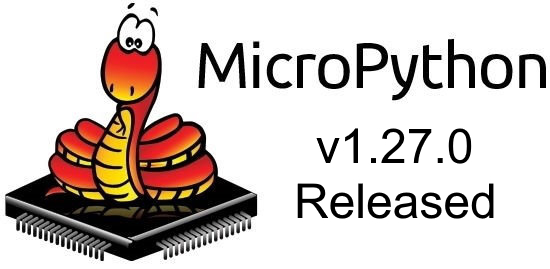](https://github.com/micropython/micropython/releases/tag/v1.27.0)

MicroPython v1.27.0 has been released and contains a wealth of upgrades - [Release Notes](https://github.com/micropython/micropython/releases/tag/v1.27.0) and [Download](https://micropython.org/download/).

> "This release of MicroPython adds support for ESP32-C5 and ESP32-P4 microcontrollers. The ESP32-P4 can work either standalone as a general purpose processor, or with an external wireless co-processor, currently either an ESP32-C5 or ESP32-C6. Board profiles are provided for all three of these configurations, as well as for the new ESP32-C5.   Support for the low-power and high performing STM32U5xx series is also added in this release, supporting USB, ADC, DAC, UART, I2C, SPI and RTC, with a board profile for the NUCLEO-U5A5ZJ-Q. Rigorous and ongoing hardware-based testing is an important part of MicroPython, and with the increasing number of supported hardware platforms -- along with a growing test suite -- it's important to make the tests run as smoothly and as automated as possible."

## Boston College Student Technology Showcase Demonstrates Python Projects

[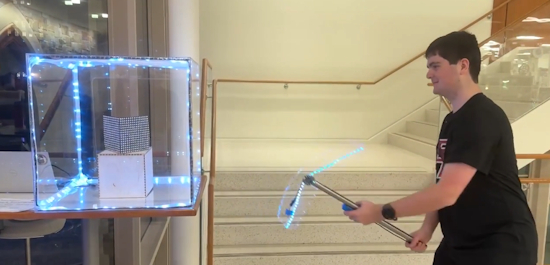](https://bsky.app/profile/gallaugher.bsky.social/post/3m7bskhz3xc2v)

The Boston College Student Technology Showcase was held on Friday, December 5. Students made a variety of projects, many using CircuitPython on a variety of hardware devices. Above, a Circuit Playgroound Bluefruit axe "mines" a block to reveal a "diamond" - [BlueSky](https://bsky.app/profile/gallaugher.bsky.social/post/3m7bskhz3xc2v) (and see other posts for more projects).

## Raspberry Pi 5 1GB Variant: Is It Worth $45?

[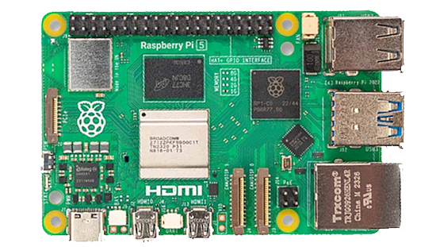](https://itsfoss.com/news/raspberry-pi-5-1gb-worth-it/)

The new 1GB Raspberry Pi 5 certainly appears to represent an entry point into the ecosystem. But $45 for 1GB in 2025 raises questions about value, especially seeing that there are competing brands with a better value proposition. The alternatives may offer better specs on paper. However, Raspberry Pi's ecosystem provides advantages that raw specifications don't accurately reflect - [It's FOSS](https://itsfoss.com/news/raspberry-pi-5-1gb-worth-it/).

## Model Context Protocol: How MCP Went From a Blog Post to the Linux Foundation

[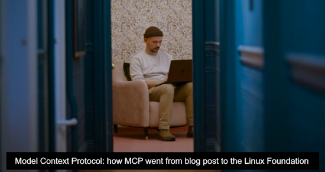](https://www.youtube.com/watch?v=DBaFFYyUSl8)

The Model Context Protocol (MCP) started as a small idea for an open way for AI models to connect to tools, systems, and developer workflows. It turned into one of the fastest-growing open standards in AI. Engineers and maintainers from Anthropic, GitHub, Microsoft, and OpenAI share how MCP “just clicked,” why openness was essential from day zero, and what its move to the Linux Foundation means for developers building agents and AI-powered tools - [YouTube](https://www.youtube.com/watch?v=DBaFFYyUSl8) and [GitHub Blog](https://github.blog/open-source/maintainers/mcp-joins-the-linux-foundation-what-this-means-for-developers-building-the-next-era-of-ai-tools-and-agents/).

## Arduino vs Raspberry Pi vs BeagleBone: Key Features and Differences

[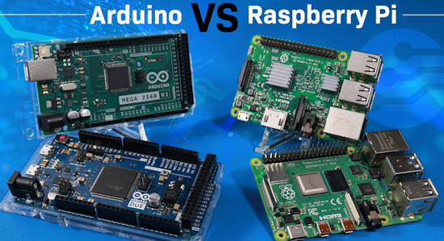](https://newhavendisplay.com/blog/arduino-vs-raspberry-pi-vs-beaglebone-key-features-and-differences/)

Arduino is a microcontroller board designed for simpler, real-time control tasks, such as controlling sensors or automating simple devices, while Raspberry Pi operates as a mini-computer, capable of running full operating systems and managing more advanced computations, like hosting a web server or processing video. BeagleBone shares traits from both. It runs Linux like Raspberry Pi but features real-time processing capabilities and extensive I/O support closer to Arduino, making it suitable for industrial and control-focused applications - [Newhaven Display](https://newhavendisplay.com/blog/arduino-vs-raspberry-pi-vs-beaglebone-key-features-and-differences/).

## Visual Studio Code Just Got a Huge Terminal Upgrade

Visual Studio Code just released its November 2025 update, version 1.107. There are more improvements for AI coding agents and TypeScript support, but folks are excited about another change: a much more powerful terminal - [How-To Geek](https://www.howtogeek.com/visual-studio-code-just-got-a-huge-terminal-upgrade/).

## Gift Giving

We have a no ads policy on the newsletter. But if you're like our editor *(ed: hey!)* your shopping is possibly incomplete. While there is still a bit of time for [last minute shipping](https://blog.adafruit.com/2025/11/20/adafruit-holiday-shipping-deadline-2025/) (domestic US), giving a gift certificate provides lots of time for a recipient to get what they want. Adafruit sponsors this industry-wide newsletter every week, free of charge - [Adafruit](https://www.adafruit.com/category/14).

## This Week's Python Streams

Python on Hardware is all about building a cooperative ecosphere which allows contributions to be valued and to grow knowledge. Below are the streams within the last week focusing on the community.

**CircuitPython Deep Dive Stream**

[Last Friday](https://youtube.com/live/xwahRY7lcng), Tim streamed work on a Fruit Jam Holiday Card Maker.

You can see the latest video and past videos on the Adafruit YouTube channel under the Deep Dive playlist - [YouTube](https://www.youtube.com/playlist?list=PLjF7R1fz_OOXBHlu9msoXq2jQN4JpCk8A).

**CircuitPython Parsec**

John Park’s CircuitPython Parsec is off this week. Catch all the episodes in the [YouTube playlist](https://www.youtube.com/playlist?list=PLjF7R1fz_OOWFqZfqW9jlvQSIUmwn9lWr).

**CircuitPython Weekly Meeting**

CircuitPython Weekly Meeting for December 8th, 2025 ([notes](https://github.com/adafruit/adafruit-circuitpython-weekly-meeting/blob/main/2025/2025-12-08.md)) [on YouTube](https://youtu.be/vUJWBqPBRP8).

## Project of the Week: A Raspberry Pi Pico and CircuitPython Keyboard

[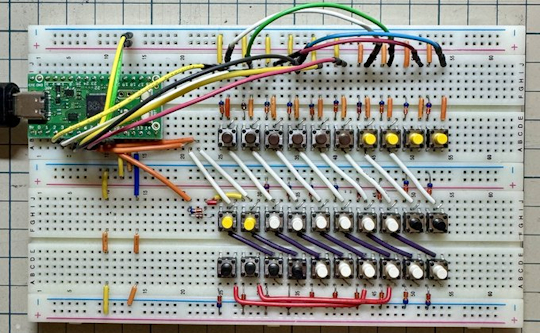](https://x.com/DragonBallEZ/status/1992590581718298781)

Making a breadboard-based keyboard using a Raspberry Pi Pico programmed with KMK firmware, based on CircuitPython. Also an updated version using a Pi RP2350 processor-based board - [X Thread](https://x.com/DragonBallEZ/status/1992590581718298781) (Japanese).

## Popular Last Week

[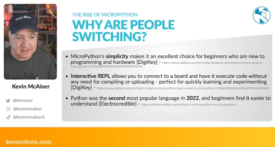](https://www.youtube.com/live/6cjYMklEsbk)

What was the most popular, most clicked link, in [last week's newsletter](https://www.adafruitdaily.com/2025/12/08/python-on-microcontrollers-newsletter-dram-shortages-affect-board-pricing-new-linux-switching-from-arduino-and-more-circuitpython-python-micropython-thepsf-raspberry_pi/)? [Why is everyone switching to MicroPython?](https://www.youtube.com/live/6cjYMklEsbk).

Did you know you can read past issues of this newsletter in the Adafruit Daily Archive? [Check it out](https://www.adafruitdaily.com/category/circuitpython/).

## New Notes from Adafruit Playground

[Adafruit Playground](https://adafruit-playground.com/) is a new place for the community to post their projects and other making tips/tricks/techniques. Ad-free, it's an easy way to publish your work in a safe space for free.

[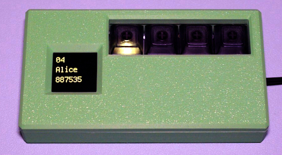](https://adafruit-playground.com/u/SamBlenny/pages/neokey-totp-token)

NeoKey TOTP Token - [Adafruit Playground](https://adafruit-playground.com/u/SamBlenny/pages/neokey-totp-token).

## News From Around the Web

[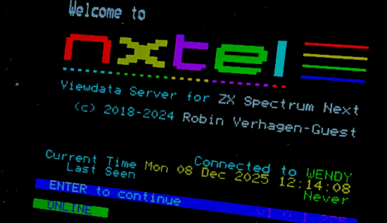](https://retrogamecoders.com/zx-spectrum-next-on-the-internet-xberry-pi-esp01-and-pi-zero-upgrades/)

Putting ZX Spectrum Next on the internet with CircuitPython - [Retro Game Coders](https://retrogamecoders.com/zx-spectrum-next-on-the-internet-xberry-pi-esp01-and-pi-zero-upgrades/). Via [Adafruit Blog](https://blog.adafruit.com/2025/12/10/putting-zx-spectrum-next-on-the-internet-circuitpython-rasppberry_pi/).

[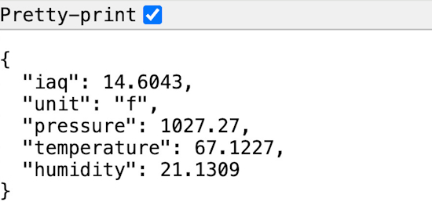](https://bsky.app/profile/guydupont.bsky.social/post/3m7aq3qtx7s2e)

Guy Dupont writes "I am obsessed with the fact that you can put ~60 lines of Python onto a $2 ESP32-C3 WiFi microcontroller board and get yourself a IoT sensor complete with custom hostname and HTTP endpoint. (It) works great with Home Assistant if you use the REST integration!! Shoutout always to 
[circuitpython.org](https://circuitpython.org/)" - [BlueSky](https://bsky.app/profile/guydupont.bsky.social/post/3m7aq3qtx7s2e) and [GitHub](https://gist.github.com/dupontgu/de375cff8c64f20372105d79833c13fc).

[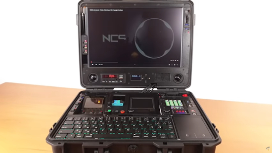](https://www.youtube.com/watch?v=AwwY2zp_qHE)

Cyberdeck Evolution, a multi-function portable computer with Raspberry Pi 5 and Python - [YouTube](https://www.youtube.com/watch?v=AwwY2zp_qHE).

[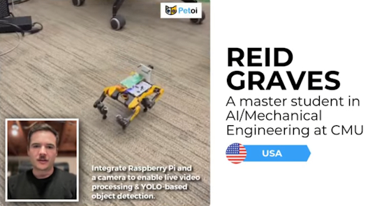](https://www.youtube.com/watch?v=28UCI2tEYWA)

Top 5 AI Robot Dog Projects: ChatGPT, YOLO , Raspberry Pi and Python - [YouTube](https://www.youtube.com/watch?v=28UCI2tEYWA).

Making an interactive light experience at the Denver Zoo with CircuitPython - [Instagram](https://www.instagram.com/p/DSGimgciSeI/). Via [Discord](https://discord.com/channels/327254708534116352/336571109430263816/1448523290598707220).

An ESP32-C3 & MicroPython run a vintage train station clock using a repurposed A4988 stepper driver for accurate, WiFi-synced time - [hackster.io](https://www.hackster.io/piotrtopa/old-train-station-clock-esp32-stepper-driver-hack-1cb319).

[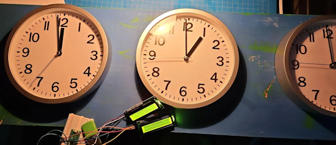](https://www.instructables.com/World-Time-Zone-Clock/)

A six-zone world time wall using Raspberry Pi Pico, MicroPython and 16×2 I²C LCDs. A modern rebuild of the classic newsroom world clock — analog faces with digital OLED placards - [Instructables](https://www.instructables.com/World-Time-Zone-Clock/).

Tide and moon clock - [Instructables](https://www.instructables.com/Moon-and-Tide-Clock/).

[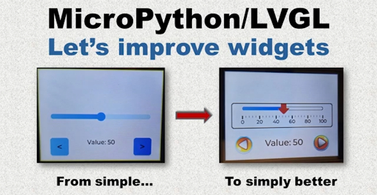](https://www.youtube.com/watch?v=xMvpFfWf_kQ)

MicroPython LVGL - let's improve LVGL with custom widgets - [YouTube](https://www.youtube.com/watch?v=xMvpFfWf_kQ).

[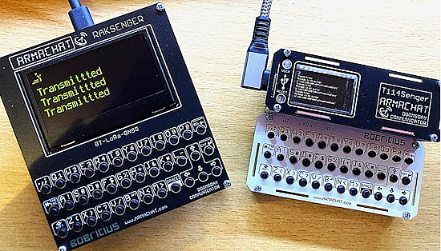](https://x.com/bobricius/status/1999395396876140602)

Raksenger by RAKwireless & Tricordex by Heltec Automation connected via LoRa radio. CircuitPython powered. The basis for a new generation of post-disaster communicator with Armachat - [X](https://x.com/bobricius/status/1999395396876140602).

[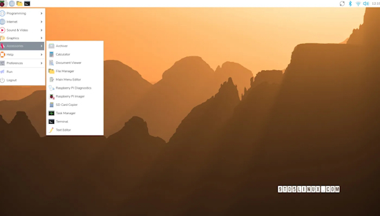](https://9to5linux.com/raspberry-pi-os-now-lets-you-safely-eject-hdd-and-nvme-drives-connected-via-usb)

Raspberry Pi OS now lets you safely eject HDD and NVMe drives connected via USB - [9to5Linux](https://9to5linux.com/raspberry-pi-os-now-lets-you-safely-eject-hdd-and-nvme-drives-connected-via-usb).

[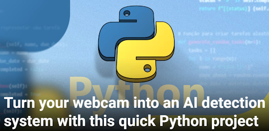](https://www.howtogeek.com/create-an-ai-smart-alert-system-in-python-in-10-minutes/)

Turn your webcam into an AI detection system with this quick Python project - [How-To Geek](https://www.howtogeek.com/create-an-ai-smart-alert-system-in-python-in-10-minutes/).

[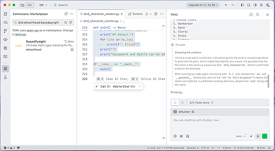](https://thenewstack.io/trae-ide-auto-installs-python-libraries-as-you-code/)

Trae IDE auto-installs Python libraries as you code- [The New Stack](https://thenewstack.io/trae-ide-auto-installs-python-libraries-as-you-code/).

[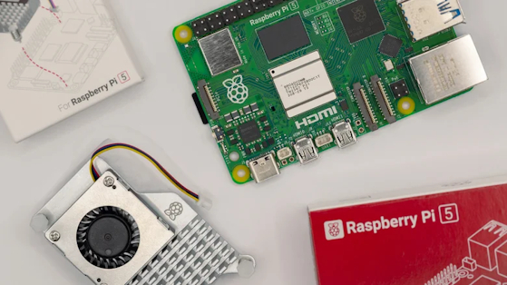](https://www.bgr.com/2043779/raspberry-pi-practical-uses-guide/)

6 unexpected practical uses for your Raspberry Pi - [BGR](https://www.bgr.com/2043779/raspberry-pi-practical-uses-guide/).

PythoC: A new way to generate C code from Python - [InfoWorld](https://www.infoworld.com/article/4101101/pythoc-a-new-way-to-generate-c-code-from-python.html).

Understanding `if __name__ == __main__` in a Python program - [YouTube](https://www.youtube.com/shorts/WXIPpHplwWE).

[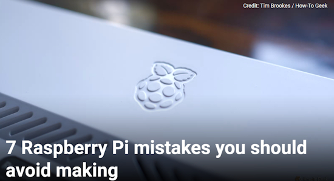](https://www.howtogeek.com/raspberry-pi-mistakes-you-should-avoid-making/)

7 Raspberry Pi mistakes you should avoid making - [How-To Geek](https://www.howtogeek.com/raspberry-pi-mistakes-you-should-avoid-making/).

## New

[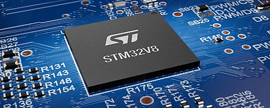](https://blog.st.com/stm32v8/)

The STM32V8 is the first Cortex-M85 microcontroller with 4 MB of embedded phase-change memory built on 18-nm process technology. Running at 800 MHz, it exceeds 5,000 points in CoreMark, with a 60% boost compared to STM32H7R/S launched in 2024. Compared to an STM32H7, an STM32V8 running a computer vision application at 800 MHz can perform inference operations up to six times faster. The STM32V8 will be available during the first quarter of 2026 - [ST Blog](https://blog.st.com/stm32v8/).

[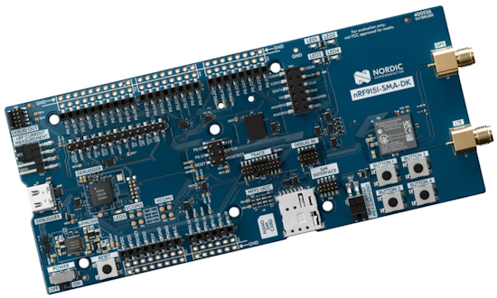](https://www.cnx-software.com/2025/12/12/nrf9151-sma-dk-development-kit-offers-cellular-iot-dect-nr-and-5g-ntn-satellite-connectivity/)

Nordic Semiconductor’s nRF9151 SMA DK development kit is designed for building IoT applications using LTE-M/NB-IoT cellular IoT, DECT NR+, or 5G NTN (Non-Terrestrial Network) satellite connectivity. The kit offers three ways to connect a SIM card, namely a NanoSIM card slot, an MFF2 SIM footprint for eSIM or software iSIM, and a 10-pin SIM connector. It also includes two SMA connectors for GPS and LTE antennas or lab equipment, multiple current measurement connectors, and Arduino UNO headers for expansion, notably the nRF7002 EK for adding Wi-Fi 6 locationing capabilities - [CNX](https://www.cnx-software.com/2025/12/12/nrf9151-sma-dk-development-kit-offers-cellular-iot-dect-nr-and-5g-ntn-satellite-connectivity/).

## New Boards Supported by CircuitPython

The number of supported microcontrollers and Single Board Computers (SBC) grows every week. This section outlines which boards have been included in CircuitPython or added to [CircuitPython.org](https://circuitpython.org/).

This week there was one new board added:

- [Pico Expander by Studiolab](https://circuitpython.org/board/studiolab_picoexpander/)

*Note: For non-Adafruit boards, please use the support forums of the board manufacturer for assistance, as Adafruit does not have the hardware to assist in troubleshooting.*

Looking to add a new board to CircuitPython? It's highly encouraged! Adafruit has four guides to help you do so:

- [How to Add a New Board to CircuitPython](https://learn.adafruit.com/how-to-add-a-new-board-to-circuitpython/overview)
- [How to add a New Board to the circuitpython.org website](https://learn.adafruit.com/how-to-add-a-new-board-to-the-circuitpython-org-website)
- [Adding a Single Board Computer to PlatformDetect for Blinka](https://learn.adafruit.com/adding-a-single-board-computer-to-platformdetect-for-blinka)
- [Adding a Single Board Computer to Blinka](https://learn.adafruit.com/adding-a-single-board-computer-to-blinka)

## New Learn Guides

[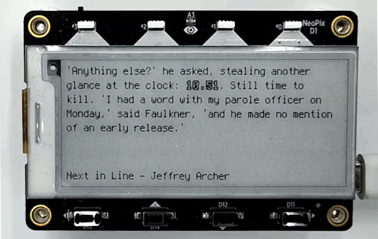](https://learn.adafruit.com/guides/latest)

The Adafruit Learning System has over 3,200 free guides for learning skills and building projects including using Python.

[eInk Literature Quotes Clock for MagTag](https://learn.adafruit.com/eink-literary-quotes-clock-for-magtag) from [Tim C](https://learn.adafruit.com/u/Foamyguy)

[Local Models for Translation, Speech, & Wardrobe on Pi 5](https://learn.adafruit.com/local-models-for-translation-speech-wardrobe-on-pi-5) from [Tim C](https://learn.adafruit.com/u/Foamyguy)

[4x12 Ortho Mechanical Keyboard](https://learn.adafruit.com/4x12-ortho-mechanical-keyboard) from [Ruiz Brothers](https://learn.adafruit.com/u/pixil3d)

## Updated Learn Guides

[Return to The Matrix with the Metro RP2350 or Fruit Jam](https://learn.adafruit.com/return-to-the-matrix-with-the-metro-rp2350) from [Anne Barela](https://learn.adafruit.com/u/AnneBarela)

## CircuitPython Libraries

The CircuitPython library numbers are continually increasing, while existing ones continue to be updated. Here we provide library numbers and updates!

To get the latest Adafruit libraries, download the [Adafruit CircuitPython Library Bundle](https://circuitpython.org/libraries). To get the latest community contributed libraries, download the [CircuitPython Community Bundle](https://circuitpython.org/libraries).

If you'd like to contribute to the CircuitPython project on the Python side of things, the libraries are a great place to start. Check out the [CircuitPython.org Contributing page](https://circuitpython.org/contributing). If you're interested in reviewing, check out Open Pull Requests. If you'd like to contribute code or documentation, check out Open Issues. We have a guide on [contributing to CircuitPython with Git and GitHub](https://learn.adafruit.com/contribute-to-circuitpython-with-git-and-github), and you can find us in the #help-with-circuitpython and #circuitpython-dev channels on the [Adafruit Discord](https://adafru.it/discord).

You can check out this [list of all the Adafruit CircuitPython libraries and drivers available](https://github.com/adafruit/Adafruit_CircuitPython_Bundle/blob/master/circuitpython_library_list.md). 

The current number of CircuitPython libraries is **551**!

**Updated Libraries**

Here are this week's updated CircuitPython libraries:

**Updated Libraries**

  * [adafruit/Adafruit_CircuitPython_USB_Host_Mouse](https://github.com/adafruit/Adafruit_CircuitPython_USB_Host_Mouse)
  * [adafruit/Adafruit_CircuitPython_Qualia](https://github.com/adafruit/Adafruit_CircuitPython_Qualia)
  * [adafruit/Adafruit_CircuitPython_EPD](https://github.com/adafruit/Adafruit_CircuitPython_EPD)
  * [adafruit/Adafruit_CircuitPython_USB_Host_Descriptors](https://github.com/adafruit/Adafruit_CircuitPython_USB_Host_Descriptors)

## What’s the CircuitPython team up to this week?

What is the team up to this week? Let’s check in:

**Dan**

I am continuing the native C AirLift implementation. I have implemented nearly all of the `wifi` module , and will start on `socketpool` next.

**Tim**

I did some refactoring in the display text library this week to make the accent functionality mentioned last week possible with BitmapLabel directly instead of needing its own class. In the process, I also brought in functionality from OutlinedLabel and ScrollingLabel so that it's possible to use inside of BitmapLabel as well instead of needing specific subclasses. Now all 3 features can be used together or separate with BitmapLabel. I also found and fixed a few remaining issues with the literature clock project and wrote the guide for it. Lastly, I spent a little time getting familiar with Pog, a KMK keyboard configuration tool, and working on updating a few bits within it to be compatible with CircuitPython 10.x.

**Scott**

This has been my first full week back! I added I2C support to the Zephyr port. I improved the USB support on the ESP32-P4 to allow swapping the full speed PHYs (thanks to Renze on Discord for the pointer.) So, on the M5Stack Tab5 it has full USB support now. I also got the display on the older Tab5s working. I ordered a second one to see if I get the new display. It is the third DSI display I've gotten working with the P4.

Now I'm working on adding SPI support to the Zephyr port. I'm refactoring `zephyr_serial` and `zephyr_i2c` back into `busio` as well so that we get the other stuff like `displayio` and `sdcardio` working with it.

**Liz**

This week I've been documenting the planetary gear dreidel guide. This project uses an STSPIN220 stepper motor driver to silently rotate a planetary gear mechanism. A KB2040 running CircuitPython code is the brains of the operation and a MPM3610 buck converter steps down the 12V motor supply to 5V to power the KB2040.

## Upcoming Events

Note that in December there are not many scheduled meetings due to the holidays.

The next MicroPython Meetup in Melbourne will be back in late January – [Luma](https://luma.com/r0rq9pl4). You can see recordings of previous meetings on [YouTube](https://www.youtube.com/@MicroPythonOfficial). 

**Coming in 2026**

* PyCascades 2026 will be 20 March 2026 – 21 March 2026 in Vancouver, British Columbia, Canada
* PyCon DE & PyData 2026 will be 13 April 2026 – 17 April 2026 in Darmstadt, Germany
* The Open Source Hardware Association Open Hardware Summit is coming to Berlin, Germany on May 23rd and 24th, 2025.
* PyCon AU 2026 will be 26 Aug. 2026 – 30 Aug. 2026 in Brisbane, Australia

**Send Your Events In**

If you know of virtual events or upcoming events, please let us know via email to cpnews(at)adafruit(dot)com.

## Latest Releases

CircuitPython's stable release is [10.0.3](https://github.com/adafruit/circuitpython/releases/latest) and its unstable release is [10.1.0-beta.1](https://github.com/adafruit/circuitpython/releases). New to CircuitPython? Start with our [Welcome to CircuitPython Guide](https://learn.adafruit.com/welcome-to-circuitpython).

[20251212](https://github.com/adafruit/Adafruit_CircuitPython_Bundle/releases/latest) is the latest Adafruit CircuitPython library bundle.

[20251204](https://github.com/adafruit/CircuitPython_Community_Bundle/releases/latest) is the latest CircuitPython Community library bundle.

[v1.27.0](https://micropython.org/download) is the latest MicroPython release. Documentation for it is [here](http://docs.micropython.org/en/latest/pyboard/).

[3.14.2](https://www.python.org/downloads/) is the latest Python release. The latest pre-release version is [3.15.0a2](https://www.python.org/download/pre-releases/).

[4,412 Stars](https://github.com/adafruit/circuitpython/stargazers) Like CircuitPython? [Star it on GitHub!](https://github.com/adafruit/circuitpython)

## Call for Help -- Translating CircuitPython is now easier than ever

[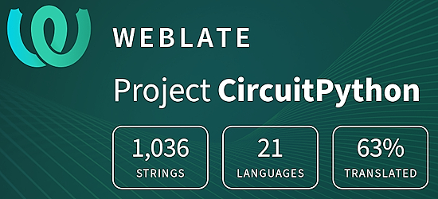](https://hosted.weblate.org/engage/circuitpython/)

One important feature of CircuitPython is translated control and error messages. With the help of fellow open source project [Weblate](https://weblate.org/), we're making it even easier to add or improve translations. 

Sign in with an existing account such as GitHub, Google or Facebook and start contributing through a simple web interface. No forks or pull requests needed! As always, if you run into trouble join us on [Discord](https://adafru.it/discord), we're here to help.

## 39,106 Thanks

The Adafruit Discord community, where we do all our CircuitPython development in the open, reached over 39,106 humans - thank you! Adafruit believes Discord offers a unique way for Python on hardware folks to connect. Join today at [https://adafru.it/discord](https://adafru.it/discord).

## ICYMI - In case you missed it

Python on hardware is the Adafruit Python video-newsletter-podcast! The news comes from the Python community, Discord, Adafruit communities and more and is broadcast on ASK an ENGINEER Wednesdays. The complete Python on Hardware weekly videocast [playlist is here](https://www.youtube.com/playlist?list=PLjF7R1fz_OOXRMjM7Sm0J2Xt6H81TdDev). The video podcast is on [iTunes](https://itunes.apple.com/us/podcast/python-on-hardware/id1451685192?mt=2), [YouTube](http://adafru.it/pohepisodes), [Instagram](https://www.instagram.com/adafruit/channel/)), and [XML](https://itunes.apple.com/us/podcast/python-on-hardware/id1451685192?mt=2).

[The weekly community chat on Adafruit Discord server CircuitPython channel - Audio / Podcast edition](https://itunes.apple.com/us/podcast/circuitpython-weekly-meeting/id1451685016) - Audio from the Discord chat space for CircuitPython, meetings are usually Mondays at 2pm ET, this is the audio version on [iTunes](https://itunes.apple.com/us/podcast/circuitpython-weekly-meeting/id1451685016), Pocket Casts, [Spotify](https://adafru.it/spotify), and [XML feed](https://adafruit-podcasts.s3.amazonaws.com/circuitpython_weekly_meeting/audio-podcast.xml).

## Contribute

The CircuitPython Weekly Newsletter is a CircuitPython community-run newsletter emailed every Monday. To contribute your content, please email your news to cpnews (at) adafruit (dot) com with information and link(s) to your content. 

Join the Adafruit [Discord](https://adafru.it/discord) or [post to the forum](https://forums.adafruit.com/viewforum.php?f=60) if you have questions.
