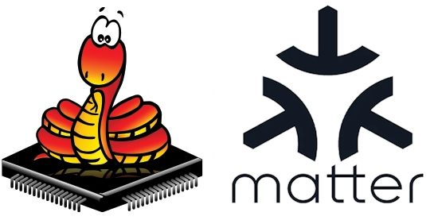
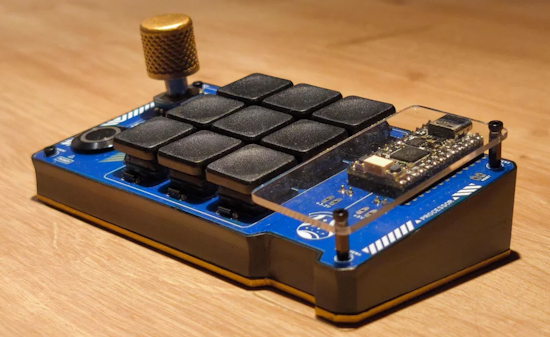
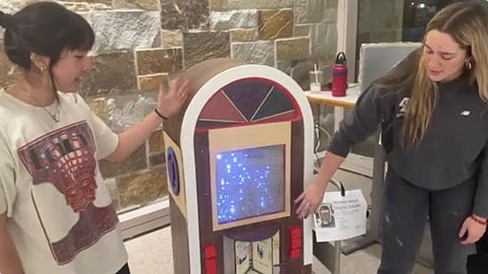
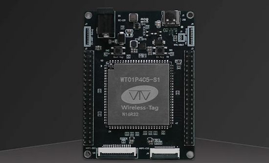
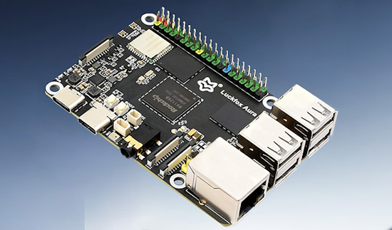
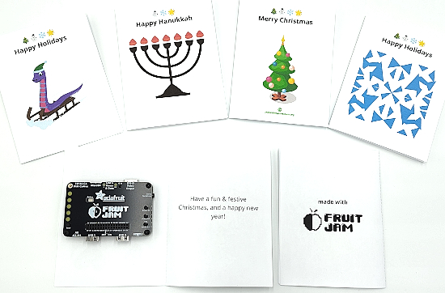
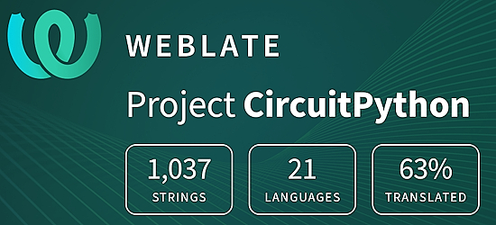

- [ ] Library and info updates
- [ ] change date
- [ ] update title
- [ ] Feature story
- [ ] Update  for images
- [ ] Update ICYDNCI
- [ ] All images 550w max only
- [ ] Link "View this email in your browser."

News Sources

- [Adafruit Playground](https://adafruit-playground.com/)
- Twitter: [CircuitPython](https://twitter.com/search?q=circuitpython&src=typed_query&f=live), [MicroPython](https://twitter.com/search?q=micropython&src=typed_query&f=live) and [Python](https://twitter.com/search?q=python&src=typed_query)
- [Raspberry Pi News](https://www.raspberrypi.com/news/), [Pi Foundation](https://www.raspberrypi.org/blog/)
- Mastodon [CircuitPython](https://mastodon.social/tags/CircuitPython) and [MicroPython](https://mastodon.social/tags/MicroPython)
- BlueSky [CircuitPython](https://bsky.app/search?q=circuitpython), [MicroPython](https://bsky.app/search?q=micropython), [Raspberry Pi](https://bsky.app/search?q=raspberry+pi)
- [Google News Python](https://news.google.com/topics/CAAqIQgKIhtDQkFTRGdvSUwyMHZNRFY2TVY4U0FtVnVLQUFQAQ?hl=en-US&gl=US&ceid=US%3Aen)
- YouTube: [CircuitPython](https://www.youtube.com/results?search_query=circuitpython&sp=CAI%253D), [MicroPython](https://www.youtube.com/results?search_query=micropython&sp=CAI%253D), [Prof Gallaugher](https://www.youtube.com/@BuildWithProfG/videos)
- [maker.io Python](https://www.digikey.com/en/maker/search-results?s=createdDate&t=python)
- [hackster.io CircuitPython](https://www.hackster.io/search?q=circuitpython&i=projects&sort_by=most_recent) and [MicroPython](https://www.hackster.io/search?q=micropython&i=projects&sort_by=most_recent)
- Instructables: [CircuitPython](https://www.instructables.com/search/?q=circuitpython&projects=all&sort=Newest), [MicroPython](https://www.instructables.com/search/?q=micropython&projects=all&sort=Newest), [Raspberry Pi Python](https://www.instructables.com/search/?q=raspberry+pi+python&projects=all&sort=Newest)
- [hackaday CircuitPython](https://hackaday.com/blog/?s=circuitpython) and [MicroPython](https://hackaday.com/blog/?s=micropython)
- [python.org](https://www.python.org/)
- [Python Insider - dev team blog](https://pythoninsider.blogspot.com/)
- Individuals: [bret.dk](https://bret.dk/), [Jeff Geerling](https://www.jeffgeerling.com/blog), [Yakroo](https://x.com/Yakroo5077)
- Tom's Hardware: [CircuitPython](https://www.tomshardware.com/search?searchTerm=circuitpython&articleType=all&sortBy=publishedDate) and [MicroPython](https://www.tomshardware.com/search?searchTerm=micropython&articleType=all&sortBy=publishedDate) and [Raspberry Pi](https://www.tomshardware.com/search?searchTerm=raspberry%20pi&articleType=all&sortBy=publishedDate)
- [hackaday.io newest projects MicroPython](https://hackaday.io/projects?tag=micropython&sort=date) and [CircuitPython](https://hackaday.io/projects?tag=circuitpython&sort=date)
- hackaday.io - [CircuitPython](https://hackaday.io/search?term=circuitpython) and [MicroPython](https://hackaday.io/search?term=micropython)
- [MicroPython Meeting](https://luma.com/micropython?k=c)

View this email in your browser. **Warning: Flashing Imagery**

Welcome to the latest Python on Microcontrollers newsletter! *insert 2-3 sentences from editor (what's in overview, banter)* - *Anne Barela, Editor*

We're on [Discord](https://discord.gg/HYqvREz), [Twitter/X](https://twitter.com/search?q=circuitpython&src=typed_query&f=live), [BlueSky](https://bsky.app/profile/circuitpython.org) and for past newsletters - [view them all here](https://www.adafruitdaily.com/category/circuitpython/). If you're reading this on the web, please [subscribe here](https://www.adafruitdaily.com/). Here's the news this week:

## Headline

text - [site](url).

## Feature

text - [site](url).

## 10 Things I Wish I Knew Before Learning Embedded Systems

As Shawn Hymel reflect back on his embedded systems journey for the past 20 years, he shares some of the insights along the way. "I figured a 10 things I wish I knew post would be perfect for this kind of reflection" - [Shawn Hymel](https://shawnhymel.com/3100/10-things-i-wish-i-knew-before-learning-embedded-systems/).

## A Matter Iot Module for MicroPython

Kevin McAleer has created a [Matter](https://en.wikipedia.org/wiki/Matter_(standard)) module for MicroPython to create internet of things (IoT) devices which work with all platforms - [GitHub](https://github.com/kevinmcaleer/micropython-matter). Via [X](https://x.com/kevsmac/status/2000594079646990470).

## Feature

text - [site](url).

## Designing Patterns for Holiday Lights

Ben Everard demonstrates using a Raspberry Pi Pico 2 and string(s) of NeoPixel smart LEDs with CircuitPython and libraries to make colorful holiday lights - [Raspberry Pi News](https://www.raspberrypi.com/news/designing-patterns-for-your-christmas-lights/). Via [Raspberry Pi Official Magazine](https://magazine.raspberrypi.com/issues/159).

## Zuban: A High-Performance Python Language Server and Type Checker

Zuban is a high-performance Python Language Server and type checker implemented in Rust, by the author of Jedi. Zuban is 20–200× faster than Mypy, while using roughly half the memory and CPU compared to Ty and Pyrefly - [Website](https://zubanls.com/) and [GitHub](https://github.com/zubanls/zuban).

## This Week's Python Streams

Python on Hardware is all about building a cooperative ecosphere which allows contributions to be valued and to grow knowledge. Below are the streams within the last week focusing on the community.

**CircuitPython Deep Dive Stream**

[Last Friday](link), Tim streamed work on {subject}.

You can see the latest video and past videos on the Adafruit YouTube channel under the Deep Dive playlist - [YouTube](https://www.youtube.com/playlist?list=PLjF7R1fz_OOXBHlu9msoXq2jQN4JpCk8A).

**CircuitPython Parsec**

John Park’s CircuitPython Parsec this week is on {subject} - [Adafruit Blog](link) and [YouTube](link).

Catch all the episodes in the [YouTube playlist](https://www.youtube.com/playlist?list=PLjF7R1fz_OOWFqZfqW9jlvQSIUmwn9lWr).

**CircuitPython Weekly Meeting**

CircuitPython Weekly Meeting for December 15, 2025 ([notes](https://github.com/adafruit/adafruit-circuitpython-weekly-meeting/blob/main/2025/2025-12-15.md)) [on YouTube](https://youtu.be/bPY1rcBPMYY?si=H7m9r9yVW0uRyEgY).

## Project of the Week: A DIY Macropad

Maker Galahad has made their first Macropad with 9 keys, clickable rotary encoder and dedicated power button. It has a 3D printed case, custom circuit board with an Adafruit KB2040 microcontroller and CircuitPython firmware. Open source, non-commercial - [Reddit](https://www.reddit.com/r/adafruit/comments/1poa48f/first_diy_macropad_opensource/), [GitHub](https://github.com/Galahad5818/Custom-Macropad-KB2040-3x3), and [Printables](https://www.printables.com/model/1516121-custom-macropad-kb2040-3x3-encodeur-pcb-maison).

## Popular Last Week

What was the most popular, most clicked link, in [last week's newsletter](https://www.adafruitdaily.com/2025/12/15/python-on-microcontrollers-newsletter-micropython-v1-27-released-model-context-protocol-and-much-more-circuitpython-python-micropython-thepsf-raspberry_pi/)? [Visual Studio Code just got a huge terminal upgrade](https://www.howtogeek.com/visual-studio-code-just-got-a-huge-terminal-upgrade/).

Did you know you can read past issues of this newsletter in the Adafruit Daily Archive? [Check it out](https://www.adafruitdaily.com/category/circuitpython/).

## New Notes from Adafruit Playground

[Adafruit Playground](https://adafruit-playground.com/) is a new place for the community to post their projects and other making tips/tricks/techniques. Ad-free, it's an easy way to publish your work in a safe space for free.

text - [Adafruit Playground](url).

text - [Adafruit Playground](url).

text - [Adafruit Playground](url).

## News From Around the Web

text - [site](url).

Les Pounder is doing a maker item a day for Advent. Here Les uses Adafruit CircuitPython to create an MP3 player hidden inside a Christmas present. The best part, it activates using a magnetic switch, to surprise the receiver - [Mastodon](https://mastodon.social/@biglesp/115739786336632343) and [YouTube](youtube.com/watch?v=ZoM-Ix2Q0lU&feature=youtu.be).

Meg & Michelle's Jukebox was a a real favorite during the Boston College student tech showcase. It uses CircuitPython, Circuit Playground Bluefruit, Raspberry Pi Pico, and 2 Pixelblazes - [BlueSky](https://bsky.app/profile/gallaugher.bsky.social/post/3ma2g6u2huc25). Via [Mastodon](https://mastodon.world/@gallaugher/115725360449333781).

text - [site](url).

text - [site](url).

text - [site](url).

text - [site](url).

text - [site](url).

text - [site](url).

text - [site](url).

text - [site](url).

text - [site](url).

text - [site](url).

text - [site](url).

text - [site](url).

text - [site](url).

text - [site](url).

text - [site](url).

## New

Wireless-Tag has released the WTDKP4C5-S1, a  compact development board built around the WT01P4C5-S1 ESP32-P4 and ESP32-C5 core module. The board supports MIPI-CSI and MIPI-DSI through the ESP32-P4, while the SDIO-connected ESP32-C5 provides dual-band Wi-Fi 6 (2.4/5 GHz) connectivity along with BLE 5, Zigbee, Thread, and Matter. Other features include a USB 2.0 Type-C OTG port, two UART debug interfaces, two 40-pin GPIO breakouts from both chips, and various power options via USB-C, a 12V DC input, or headers - [CNX](https://www.cnx-software.com/2025/12/17/compact-development-board-features-a-single-esp32-p4-esp32-c5-dual-band-wi-fi-6-module-mipi-display-and-camera-interfaces/).

The Luckfox Aura is a compact, high-performance Linux SBC built around Rockchip’s RV1126B quad-core Arm Cortex-A53 processor with a 3 TOPS NPU. The Aura supports up to 4 GB LPDDR4X memory and up to 64 GB of optional eMMC storage. Camera and display options include two 4-lane MIPI CSI camera inputs, a 4-lane MIPI DSI display interface up to 1080p60, and an AI-enhanced ISP with HDR, noise reduction, dehazing, and image correction features. The board also features Gigabit Ethernet with PoE support, onboard dual-band Wi-Fi 6 and Bluetooth 5.4/BLE, USB 3.0 OTG, four USB 2.0 host ports, a 40-pin GPIO header compatible with some Raspberry Pi HATs, audio I/O, an RTC, and a microSD card slot - [CNX](https://www.cnx-software.com/2025/12/16/luckfox-aura-a-raspberry-pi-like-linux-sbc-powered-by-rockchip-rv1126b-soc-with-3-tops-npu/).

## New Boards Supported by CircuitPython

The number of supported microcontrollers and Single Board Computers (SBC) grows every week. This section outlines which boards have been included in CircuitPython or added to [CircuitPython.org](https://circuitpython.org/).

This week there were (#/no) new boards added:

- [Board name](url)
- [Board name](url)
- [Board name](url)

*Note: For non-Adafruit boards, please use the support forums of the board manufacturer for assistance, as Adafruit does not have the hardware to assist in troubleshooting.*

Looking to add a new board to CircuitPython? It's highly encouraged! Adafruit has four guides to help you do so:

- [How to Add a New Board to CircuitPython](https://learn.adafruit.com/how-to-add-a-new-board-to-circuitpython/overview)
- [How to add a New Board to the circuitpython.org website](https://learn.adafruit.com/how-to-add-a-new-board-to-the-circuitpython-org-website)
- [Adding a Single Board Computer to PlatformDetect for Blinka](https://learn.adafruit.com/adding-a-single-board-computer-to-platformdetect-for-blinka)
- [Adding a Single Board Computer to Blinka](https://learn.adafruit.com/adding-a-single-board-computer-to-blinka)

## New Learn Guides

The Adafruit Learning System has over 3,200 free guides for learning skills and building projects including using Python.

[Planetary Gear Dreidels](https://learn.adafruit.com/planetary-gear-dreidels) from [Liz Clark](https://learn.adafruit.com/u/BlitzCityDIY)

[AdaBox 022](https://learn.adafruit.com/adabox022) from [John Park](https://learn.adafruit.com/u/johnpark)

## CircuitPython Libraries

The CircuitPython library numbers are continually increasing, while existing ones continue to be updated. Here we provide library numbers and updates!

To get the latest Adafruit libraries, download the [Adafruit CircuitPython Library Bundle](https://circuitpython.org/libraries). To get the latest community contributed libraries, download the [CircuitPython Community Bundle](https://circuitpython.org/libraries).

If you'd like to contribute to the CircuitPython project on the Python side of things, the libraries are a great place to start. Check out the [CircuitPython.org Contributing page](https://circuitpython.org/contributing). If you're interested in reviewing, check out Open Pull Requests. If you'd like to contribute code or documentation, check out Open Issues. We have a guide on [contributing to CircuitPython with Git and GitHub](https://learn.adafruit.com/contribute-to-circuitpython-with-git-and-github), and you can find us in the #help-with-circuitpython and #circuitpython-dev channels on the [Adafruit Discord](https://adafru.it/discord).

You can check out this [list of all the Adafruit CircuitPython libraries and drivers available](https://github.com/adafruit/Adafruit_CircuitPython_Bundle/blob/master/circuitpython_library_list.md). 

The current number of CircuitPython libraries is **###**!

**New Libraries**

Here are this week's new CircuitPython libraries:

* [library](url)

**Updated Libraries**

Here are this week's updated CircuitPython libraries:

* [library](url)

## What’s the CircuitPython team up to this week?

What is the team up to this week? Let’s check in:

**Dan**

text.

**Tim**

I've been working on a greetings card maker for the Fruit Jam. It allows you to customize the front image and text, as well as inside text for a card. It generates the card and writes it to CPSAVES where it can be opened from a PC and printed. The front image can be a custom SVG or PNG file, or a snowflake image designed inside of the app by clicking points to build up a shapes to cut out of a white background with horizontal and vertical mirror flipping. In the process of making this app, I created a CheckBox `displayio` widget, and added some new functionality to the `AnchoredGroup` library. Here is a photo of some of the cards created with it.

**Scott**

This week I've continued working on CircuitPython on Zephyr. I got SPI working and enabled many other modules that build on top of it such as `displayio` and `sdcardio`. I decided testing these boards would be easier if USB was working, so I'm now trying to use the Zephyr USB stack in CircuitPython. I'll be out between Christmas and New Years Day. I'm planning to kick off #CircuitPython2026 planning once I'm back.

**Liz**

This week I published the [Planetary Gear Dreidels project](https://learn.adafruit.com/planetary-gear-dreidels). It uses a KB2040 running CircuitPython with an STSPIN220 silent stepper motor driver. The stepper motor rotates a planetary gear reduction with 3D printed dreidels on each of the planet gears. I'm really proud of how this project came out.

I'm going to be out for the next two weeks for the holidays. I'm looking forward to working on new projects in 2026.

## Upcoming Events

Note that in December there are not many scheduled meetings due to the holidays.

The next MicroPython Meetup in Melbourne will be on November 26th – [Luma](https://luma.com/r0rq9pl4). You can see recordings of previous meetings on [YouTube](https://www.youtube.com/@MicroPythonOfficial). 

**Coming in 2026**

* PyCascades 2026 will be 20 March 2026 – 21 March 2026 in Vancouver, British Columbia, Canada
* PyCon DE & PyData 2026 will be 13 April 2026 – 17 April 2026 in Darmstadt, Germany
* The Open Source Hardware Association Open Hardware Summit is coming to Berlin, Germany on May 23rd and 24th, 2025.
* PyCon AU 2026 will be 26 Aug. 2026 – 30 Aug. 2026 in Brisbane, Australia

**Send Your Events In**

If you know of virtual events or upcoming events, please let us know via email to cpnews(at)adafruit(dot)com.

## Latest Releases

CircuitPython's stable release is [#.#.#](https://github.com/adafruit/circuitpython/releases/latest) and its unstable release is [#.#.#-##.#](https://github.com/adafruit/circuitpython/releases). New to CircuitPython? Start with our [Welcome to CircuitPython Guide](https://learn.adafruit.com/welcome-to-circuitpython).

[2025####](https://github.com/adafruit/Adafruit_CircuitPython_Bundle/releases/latest) is the latest Adafruit CircuitPython library bundle.

[2025####](https://github.com/adafruit/CircuitPython_Community_Bundle/releases/latest) is the latest CircuitPython Community library bundle.

[v#.#.#](https://micropython.org/download) is the latest MicroPython release. Documentation for it is [here](http://docs.micropython.org/en/latest/pyboard/).

[#.#.#](https://www.python.org/downloads/) is the latest Python release. The latest pre-release version is [#.#.#](https://www.python.org/download/pre-releases/).

[#,### Stars](https://github.com/adafruit/circuitpython/stargazers) Like CircuitPython? [Star it on GitHub!](https://github.com/adafruit/circuitpython)

## Call for Help -- Translating CircuitPython is now easier than ever

One important feature of CircuitPython is translated control and error messages. With the help of fellow open source project [Weblate](https://weblate.org/), we're making it even easier to add or improve translations. 

Sign in with an existing account such as GitHub, Google or Facebook and start contributing through a simple web interface. No forks or pull requests needed! As always, if you run into trouble join us on [Discord](https://adafru.it/discord), we're here to help.

## NUMBER Thanks

The Adafruit Discord community, where we do all our CircuitPython development in the open, reached over NUMBER humans - thank you! Adafruit believes Discord offers a unique way for Python on hardware folks to connect. Join today at [https://adafru.it/discord](https://adafru.it/discord).

## ICYMI - In case you missed it

Python on hardware is the Adafruit Python video-newsletter-podcast! The news comes from the Python community, Discord, Adafruit communities and more and is broadcast on ASK an ENGINEER Wednesdays. The complete Python on Hardware weekly videocast [playlist is here](https://www.youtube.com/playlist?list=PLjF7R1fz_OOXRMjM7Sm0J2Xt6H81TdDev). The video podcast is on [iTunes](https://itunes.apple.com/us/podcast/python-on-hardware/id1451685192?mt=2), [YouTube](http://adafru.it/pohepisodes), [Instagram](https://www.instagram.com/adafruit/channel/)), and [XML](https://itunes.apple.com/us/podcast/python-on-hardware/id1451685192?mt=2).

[The weekly community chat on Adafruit Discord server CircuitPython channel - Audio / Podcast edition](https://itunes.apple.com/us/podcast/circuitpython-weekly-meeting/id1451685016) - Audio from the Discord chat space for CircuitPython, meetings are usually Mondays at 2pm ET, this is the audio version on [iTunes](https://itunes.apple.com/us/podcast/circuitpython-weekly-meeting/id1451685016), Pocket Casts, [Spotify](https://adafru.it/spotify), and [XML feed](https://adafruit-podcasts.s3.amazonaws.com/circuitpython_weekly_meeting/audio-podcast.xml).

## Contribute

The CircuitPython Weekly Newsletter is a CircuitPython community-run newsletter emailed every Monday. To contribute your content, please email your news to cpnews (at) adafruit (dot) com with information and link(s) to your content. 

Join the Adafruit [Discord](https://adafru.it/discord) or [post to the forum](https://forums.adafruit.com/viewforum.php?f=60) if you have questions.
