- [ ] Library and info updates
- [ ] change date
- [ ] update title
- [ ] Feature story
- [ ] Update  for images
- [ ] Update ICYDNCI
- [ ] All images 550w max only
- [ ] Link "View this email in your browser."

News Sources

- [Adafruit Playground](https://adafruit-playground.com/)
- Twitter: [CircuitPython](https://twitter.com/search?q=circuitpython&src=typed_query&f=live), [MicroPython](https://twitter.com/search?q=micropython&src=typed_query&f=live) and [Python](https://twitter.com/search?q=python&src=typed_query)
- [Raspberry Pi News](https://www.raspberrypi.com/news/), [Pi Foundation](https://www.raspberrypi.org/blog/)
- Mastodon [CircuitPython](https://mastodon.social/tags/CircuitPython) and [MicroPython](https://mastodon.social/tags/MicroPython)
- BlueSky [CircuitPython](https://bsky.app/search?q=circuitpython), [MicroPython](https://bsky.app/search?q=micropython), [Raspberry Pi](https://bsky.app/search?q=raspberry+pi)
- [Google News Python](https://news.google.com/topics/CAAqIQgKIhtDQkFTRGdvSUwyMHZNRFY2TVY4U0FtVnVLQUFQAQ?hl=en-US&gl=US&ceid=US%3Aen)
- YouTube: [CircuitPython](https://www.youtube.com/results?search_query=circuitpython&sp=CAI%253D), [MicroPython](https://www.youtube.com/results?search_query=micropython&sp=CAI%253D), [Prof Gallaugher](https://www.youtube.com/@BuildWithProfG/videos)
- [maker.io Python](https://www.digikey.com/en/maker/search-results?s=createdDate&t=python)
- [hackster.io CircuitPython](https://www.hackster.io/search?q=circuitpython&i=projects&sort_by=most_recent) and [MicroPython](https://www.hackster.io/search?q=micropython&i=projects&sort_by=most_recent)
- Instructables: [CircuitPython](https://www.instructables.com/search/?q=circuitpython&projects=all&sort=Newest), [MicroPython](https://www.instructables.com/search/?q=micropython&projects=all&sort=Newest), [Raspberry Pi Python](https://www.instructables.com/search/?q=raspberry+pi+python&projects=all&sort=Newest)
- [hackaday CircuitPython](https://hackaday.com/blog/?s=circuitpython) and [MicroPython](https://hackaday.com/blog/?s=micropython)
- [python.org](https://www.python.org/)
- [Python Insider - dev team blog](https://pythoninsider.blogspot.com/)
- Individuals: [bret.dk](https://bret.dk/), [Jeff Geerling](https://www.jeffgeerling.com/blog), [Yakroo](https://x.com/Yakroo5077)
- Tom's Hardware: [CircuitPython](https://www.tomshardware.com/search?searchTerm=circuitpython&articleType=all&sortBy=publishedDate) and [MicroPython](https://www.tomshardware.com/search?searchTerm=micropython&articleType=all&sortBy=publishedDate) and [Raspberry Pi](https://www.tomshardware.com/search?searchTerm=raspberry%20pi&articleType=all&sortBy=publishedDate)
- [hackaday.io newest projects MicroPython](https://hackaday.io/projects?tag=micropython&sort=date) and [CircuitPython](https://hackaday.io/projects?tag=circuitpython&sort=date)
- hackaday.io - [CircuitPython](https://hackaday.io/search?term=circuitpython) and [MicroPython](https://hackaday.io/search?term=micropython)
- [MicroPython Meeting](https://luma.com/micropython?k=c)

View this email in your browser. **Warning: Flashing Imagery**

Welcome to the latest Python on Microcontrollers newsletter! *insert 2-3 sentences from editor (what's in overview, banter)* - *Anne Barela, Editor*

We're on [Discord](https://discord.gg/HYqvREz), [Twitter/X](https://twitter.com/search?q=circuitpython&src=typed_query&f=live), [BlueSky](https://bsky.app/profile/circuitpython.org) and for past newsletters - [view them all here](https://www.adafruitdaily.com/category/circuitpython/). If you're reading this on the web, please [subscribe here](https://www.adafruitdaily.com/). Here's the news this week:

## Python: What’s Coming in 2026

If 2025 was “the year of type checking and language server protocols” for Python, will 2026 be the year of the type server protocol? “Transformative” developments like free threading were said to be coming to Python in 2026, along with performance-improving “lazy” imports for Python modules. We’ll (hopefully) also be seeing improved Python agent frameworks - [The New Stack](https://thenewstack.io/python-whats-coming-in-2026/). Via the [Adafruit Blog](https://blog.adafruit.com/2026/01/12/python-whats-coming-in-2026/).

## #CircuitPython2026 Responses Rolling In

Responses are coming in for the #CircuitPython2026 data call. Developers would still like to hear from you how to improve CircuitPython in 2026, you have two days left - [Adafruit Blog](https://blog.adafruit.com/2026/01/02/circuitpython2026-kickoff/).

* What would you like CircuitPython to do that it can’t?
* What chipset would you like to run it on?
* What tools are missing or need improving?
* What documentation is missing or needs work?
* How would you like to program and debug CircuitPython?
* You can even post suggestions on improving this newsletter!

Please post about #CircuitPython2026 to some public place on the internet by Wednesday January 21st, 2026 and then let the team know! When you post, please add #CircuitPython2026 and email [circuitpython2026@adafruit.com](mailto:circuitpython2026@adafruit.com) with a link. Ideas will be posted on the Adafruit Blog and collated for review.

## Anthropic Finds $1.5 Million to Help Python Foundation Improve Security

The Python Software Foundation (PSF) has an extra $1.5 million heading its way, after AI upstart Anthropic entered into a partnership aimed at improving security in the Python ecosystem - [The Register](https://www.theregister.com/2026/01/14/anthropic_python_security/).

> “This investment will enable the PSF to make crucial security advances to CPython and the Python Package Index (PyPI) benefiting all users, and it will also sustain the foundation’s core work supporting the Python language, ecosystem, and global community,” wrote the organization’s deputy executive director Loren Crary. CPython is the reference implementation of the Python language and PyPI is a repository of software for Python devs.

Python 3.15.0 alpha 5 (yes, another alpha!) - [Python Insider Blog](https://blog.python.org/2026/01/python-3150-alpha-5-yes-another-alpha.html).

## Fake Raspberry Pi Picos Show Up on AliExpress

[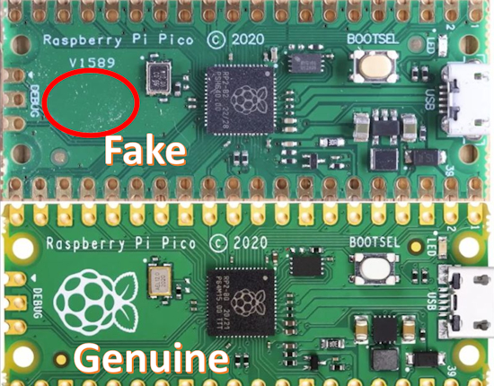](https://hackaday.com/2026/01/15/looking-at-a-real-fake-raspberry-pi-rp2040-board/)

AliExpress sellers are now offering their own versions of the Raspberry Pi Pico that can be significantly cheaper than the genuine article. Per Hackaday, they sell for just $2.25. On the fakes, there is no Pi logo and decapping reveals an early stepping of the RP2040 chip prone to USB issues. They are not worth dealing with - [Hackaday](https://hackaday.com/2026/01/15/looking-at-a-real-fake-raspberry-pi-rp2040-board/).

## Building in the Gaps: Lessons from an Apple Firmware Engineer

Shawn Hymel recently interviewed [Parth Thakkar](https://www.linkedin.com/in/parth-thakkar1674/), who shows that landing a coveted engineering job at a renowned hardware company isn’t built on credentials alone. It’s built on curiosity, persistence, and an almost stubborn commitment to learning by doing. Today, Parth is a HID Firmware Engineer at Apple, working on the embedded code that powers the next generation of Apple accessories - [Shawn Hymel](https://shawnhymel.com/3133/building-in-the-gaps-lessons-from-an-apple-firmware-engineer/).

## Even Linus Torvalds is Trying His Hand at Vibe Coding (But Just a Little)

Linux and Git creator Linus Torvalds’ latest project contains visualization code that was “basically written in Python by vibe coding,” but you shouldn’t read that to mean that Torvalds is embracing that approach for anything and everything - [Ars Technica](https://arstechnica.com/ai/2026/01/hobby-github-repo-shows-linus-torvalds-vibe-codes-sometimes/) and [Mezha](https://mezha.ua/en/news/linus-torvalds-used-vibecoding-307711/).

## STM32 vs ESP32: Common Microcontroller Mistakes That Cause IoT Product Failures

Most IoT product failures don’t come from bad ideas or poor execution. They come from early microcontroller decisions, especially when someone is chosing between STM32 vs ESP32 without fully understanding real-world constraints. This article contrasts both microcontroller lines to show where decisions can be made - [Medium](https://medium.com/@digital.auckam/stm32-vs-esp32-common-microcontroller-mistakes-that-cause-iot-product-failures-82a150a6c60f).

## Claude Code Alert Project

[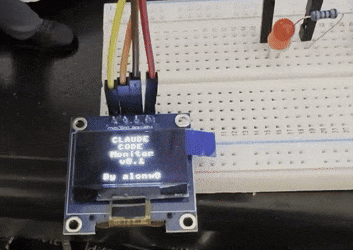](https://claude-blog.setec.rs/blog/esp32-claude-code-notification-device)

Alon Wolenitz built a device to get instant alerts when Claude Code needs attention. A physical notification device using MicroPython on ESP32 that displays Claude Code status on an OLED screen and alerts with sound. - [Claude Code Blog](https://claude-blog.setec.rs/blog/esp32-claude-code-notification-device) and [GitHub](https://github.com/alonw0/claude-monitor-esp32). Via [X](https://x.com/alonwo/status/2008912631864733881).

## This Week's Python Streams

Python on Hardware is all about building a cooperative ecosphere which allows contributions to be valued and to grow knowledge. Below are the streams within the last week focusing on the community.

**CircuitPython Deep Dive Stream**

Due to publishing deadlines, Deep Dive debuted last week after Newsletter completion. You can see the latest video and past videos on the Adafruit YouTube channel under the Deep Dive playlist - [YouTube](https://www.youtube.com/playlist?list=PLjF7R1fz_OOXBHlu9msoXq2jQN4JpCk8A).

**CircuitPython Parsec**

Due to publishing deadlines, Parsec debuted last week after Newsletter completion. See the latest video and catch all the episodes in the [YouTube playlist](https://www.youtube.com/playlist?list=PLjF7R1fz_OOWFqZfqW9jlvQSIUmwn9lWr).

**CircuitPython Weekly Meeting**

CircuitPython Weekly Meeting for January 12, 2026 ([notes](https://github.com/adafruit/adafruit-circuitpython-weekly-meeting/blob/main/2026/2026-01-12.md)) [on YouTube](https://www.youtube.com/watch?v=BUlKL_s_6e8).

## Project of the Week: A WiFi Intrusion Detection System (WIDS)

[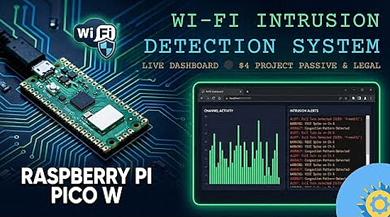](https://github.com/flatmarstheory/Wi-Fi-Intrusion-Detection-System)

Rai Bahadur Singh demonstrates a passive WiFi Intrusion Detection System built using a Raspberry Pi Pico W and MicroPython. The low-cost microcontroller works as a real-time wireless security sensor capable of monitoring surrounding WiFi activity, analysing channel congestion, and detecting suspicious access point behaviour such as rogue or evil-twin networks, abnormal RSSI spikes, and interference-based anomalies. The system operates without packet sniffing, monitor mode, or active transmission, making it safe, legal, and defensive by design while still aligning with industry-recognised Wireless Intrusion Detection System principles - [GitHub](https://github.com/flatmarstheory/Wi-Fi-Intrusion-Detection-System) and [YouTube](https://www.youtube.com/watch?v=DUJBXbPYDys).

## Popular Last Week

[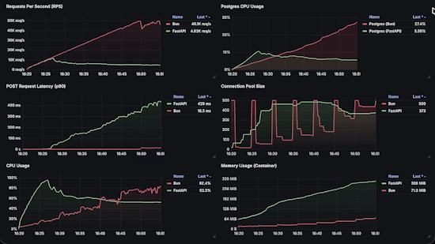](https://www.youtube.com/watch?v=hQGE_CAo1PE)

What was the most popular, most clicked link, in [last week's newsletter](https://www.adafruitdaily.com/2026/01/12/python-on-microcontrollers-newsletter-circuitpython2026-ml-comes-to-circuitpython-risc-v-gaining-and-more-circuitpython-python-micropython-thepsf-raspberry_pi/)? [
Python vs JavaScript Performance: Best Backend Language 2026](https://www.youtube.com/watch?v=hQGE_CAo1PE).

Did you know you can read past issues of this newsletter in the Adafruit Daily Archive? [Check it out](https://www.adafruitdaily.com/category/circuitpython/).

## New Notes from Adafruit Playground

[Adafruit Playground](https://adafruit-playground.com/) is a new place for the community to post their projects and other making tips/tricks/techniques. Ad-free, it's an easy way to publish your work in a safe space for free.

Polyglot - more alien language fun - [Adafruit Playground](https://adafruit-playground.com/u/mrklingon/pages/polyglot-more-alien-language-fun).

## News From Around the Web

[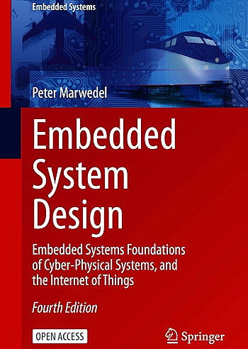](https://link.springer.com/book/10.1007/978-3-030-60910-8)

The textbook *Embedded System Design: Embedded Systems Foundations of Cyber-Physical Systems, and the Internet of Things* is available from the publisher as a free to download and read [open access](https://www.springernature.com/gp/open-science/about/the-fundamentals-of-open-access-and-open-research) textbook (ie. not a pirate site) - [Springer Books](https://link.springer.com/book/10.1007/978-3-030-60910-8).

[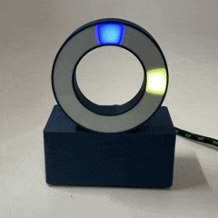](https://www.instructables.com/RGB-LED-Ring-Clock/)

RGB-LED-Ring-Clock-Pico is an RGB LED ring clock built with a Raspberry Pi Pico, WS2812B / NeoPixel ring, and a DS3231 real-time clock module, written in MicroPython - [GitHub](https://github.com/TellinStories/RGB-LED-Ring-Clock-Pico) and [Instructables](https://www.instructables.com/RGB-LED-Ring-Clock/).

Variables, AI for CircuitPython, and print + input to debug maker electronics (CircuitPython School) - [YouTube](https://www.youtube.com/watch?v=-wIqy7drCN8).

TinyCity is a city simulation game inspired by SimCity for the Raspberry Pi RP2040 running MicroPython - [GitHub](https://github.com/chrisdiana/TinyCity?tab=readme-ov-file).

[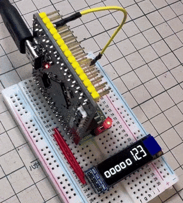](https://x.com/DragonBallEZ/status/2011333504756564209)

Making a seven segment number font and displaying it on a small OLED display, all using an RP2350 board and CircuitPython - [X Thread](https://x.com/DragonBallEZ/status/2011333504756564209) and [Code](https://x.com/DragonBallEZ/status/2010914379617989087).

[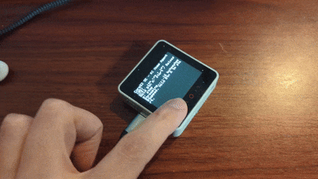](https://x.com/74th/status/2010667619653992540?s=20)

M5Stack CoreS3 SE serves as the front end for an AI agent that can be freely implemented in Python, by accessing a Python server on a PC via WebSocket, and handling voice input and recognition, as well as text-to-speech synthesis for output - [X](https://x.com/74th/status/2010667619653992540?s=20).

A Counter-Strike 2 player has built a physical LED matrix counter that sits on a desk and updates in real time using a Raspberry Pi and MicroPython - [PC Guide](https://www.pcguide.com/news/someone-used-their-raspberry-pi-to-create-the-perfect-desk-companion-for-cs2-players-a-physical-kill-counter/), [Reddit](https://www.reddit.com/r/raspberrypipico/comments/1q3rl49/i_built_a_physical_kill_counter_for_cs2_python/) and [GitHub](https://github.com/ChompLive/Galactic-CS2).

[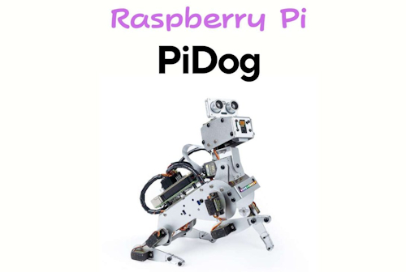](https://murasan-net.com/2024/02/29/raspberrypi-pidog/)

PiDog is a Raspberry Pi-controlled robot dog equipped with servo motors in each joint, allowing it to produce realistic motions as if it were a real dog. It uses a Raspberry Pi and a Python software library is available to access the sensors and actuators, allowing users to program and control it - [SunFounder](https://murasan-net.com/2024/02/29/raspberrypi-pidog/) (Japanese). Via [X](https://x.com/murasametech/status/2011272187039400348)

[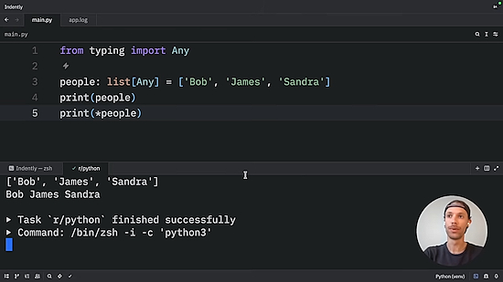](https://mail.google.com/mail/u/3/#inbox)

How to print like a pro in Python - [YouTube](https://mail.google.com/mail/u/3/#inbox).

Microsoft wants to overhaul GitHub to remain competitive with Cursor and Anthropic's Claude Code - [Times of India](https://timesofindia.indiatimes.com/technology/microsoft-wants-to-overhaul-github-and-on-ceo-satya-nadellas-target-are/articleshow/126475437.cms).

[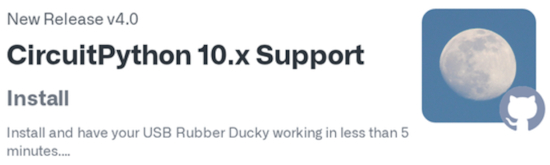](https://github.com/dbisu/pico-ducky)

A new Pico-Ducky release is available. pico-ducky makes a cheap but powerful USB Rubber Ducky with a Raspberry Pi Pico. This release include support for CircuitPython 10.x and has the latest merges to the main repo - [GitHub](https://github.com/dbisu/pico-ducky).

[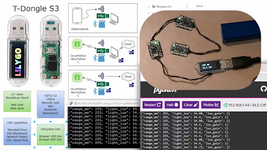](https://www.youtube.com/watch?v=rCJWZwMG2nQ)

Implementing standalone or tethered IoT appliances with the LILYGO T-Dongle-S3 and CircuitPython - [YouTube](https://www.youtube.com/watch?v=rCJWZwMG2nQ).

text - [site](url).

text - [site](url).

[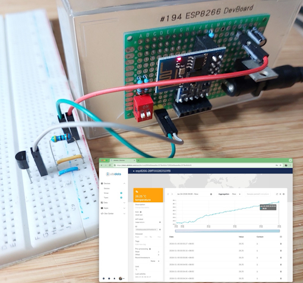](https://leap.tardate.com/esp8266/micropython/esp-01-temperature-logger/)

Using MicroPython on an ESP8266 (512kb ESP01) to capture DS18S20 temperature readings and log to a cloud data collection service (Ubidots) - [LEAP](https://leap.tardate.com/esp8266/micropython/esp-01-temperature-logger/) and [GitHub](https://github.com/tardate/LittleArduinoProjects/tree/main/ESP8266/micropython/esp-01-temperature-logger).

[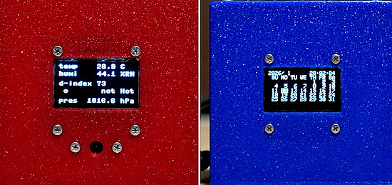](https://x.com/JolokiaCurry/status/2010700043976860151)

Raspberry Pi Pico temperature, humidity, and barometer using MicroPython - [X](https://x.com/JolokiaCurry/status/2010700043976860151).

A hardware-based password vault & sensor simulation with MicroPython and micro:bit - [GitHub](https://github.com/flatmarstheory/Hardware-Based-Password-Generator).

HTTP Requests in Python - [YouTube](https://www.youtube.com/watch?v=hEv50bS1_Og).

[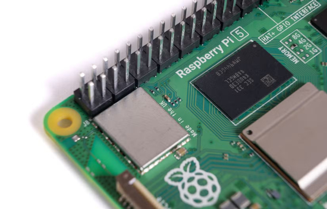](https://www.howtogeek.com/things-a-raspberry-pi-does-better-than-any-other-computer/)

5 things a Raspberry Pi does better than any other computer - [How-To Geek](https://www.howtogeek.com/things-a-raspberry-pi-does-better-than-any-other-computer/).

text - [site](url).

text - [site](url).

## New

[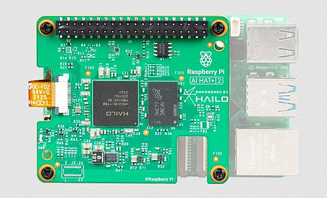](https://www.raspberrypi.com/news/introducing-the-raspberry-pi-ai-hat-plus-2-generative-ai-on-raspberry-pi-5/)

Just out: the Raspberry Pi AI HAT+ 2. This add-on board for Raspberry Pi 5, powered by the Hailo-10H AI accelerator and 8GB of on-board RAM, is built to run LLMs and VLMs locally, without cloud or network dependencies. The Raspberry Pi AI HAT+ 2 delivers 40 TOPS of generative AI performance and integrates directly with Raspberry Pi OS, including native support in rpicam-apps. It is priced at $130 - [Raspberry Pi News](https://www.raspberrypi.com/news/introducing-the-raspberry-pi-ai-hat-plus-2-generative-ai-on-raspberry-pi-5/).

See Jeff Geerling's review of the AI HAT+ 2 - [Blog](https://www.jeffgeerling.com/blog/2026/raspberry-pi-ai-hat-2/) and [YouTube](https://youtu.be/jRQaur0LdLE).

[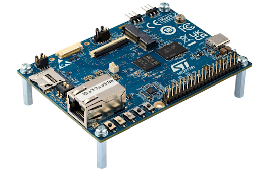](https://www.cnx-software.com/2026/01/07/stm32mp21-arm-cortex-a35-m33-mpu-targets-cost-effective-applications-in-smart-factory-homes-and-factories/)

The new STM32MP21 is a cost-optimized version of the earlier STM32MP23 and STM32MP25 that does without an AI accelerator, GPU, H.264 decoder and encoder, or PCIe Gen2 / USB 3.0 interfaces. It still offers a MIPI CSI-2 camera interface, two Gigabit Ethernet interfaces with Time-Sensitive Networking (TSN), and strong security targeting SESIP Level 3 and PCI pre-certification - [CNX](https://www.cnx-software.com/2026/01/07/stm32mp21-arm-cortex-a35-m33-mpu-targets-cost-effective-applications-in-smart-factory-homes-and-factories/).

The ESP-SensairShuttle kit is a ESP32-C5 development board that can be interfaced with a choice of two sensor daughterboards. It is designed for motion sensing and large language model human-computer/machine interaction scenarios. More specifically, the ESP-SensairShuttle mainboard relies on an ESP32-C5-WROOM-1-N16R8 module with dual-band Wi-Fi 6, Bluetooth 5 (LE), Zigbee, and Thread (802.15.4) wireless connectivity, and interfaces with the provided Bosch Sensortec Shuttle Boards, a 1.83-inch touch display, a microphone, and a speaker, and can be powered via USB or a LiPo battery - [CNX](https://www.cnx-software.com/2026/01/14/esp-sensairshuttle-esp32-c5-kit-supports-bosch-sensortec-bme690-bmi270-bmm350-environmental-and-motion-sensors/).

## New Boards Supported by CircuitPython

The number of supported microcontrollers and Single Board Computers (SBC) grows every week. This section outlines which boards have been included in CircuitPython or added to [CircuitPython.org](https://circuitpython.org/).

No new boards were added this week.

*Note: For non-Adafruit boards, please use the support forums of the board manufacturer for assistance, as Adafruit does not have the hardware to assist in troubleshooting.*

Looking to add a new board to CircuitPython? It's highly encouraged! Adafruit has four guides to help you do so:

- [How to Add a New Board to CircuitPython](https://learn.adafruit.com/how-to-add-a-new-board-to-circuitpython/overview)
- [How to add a New Board to the circuitpython.org website](https://learn.adafruit.com/how-to-add-a-new-board-to-the-circuitpython-org-website)
- [Adding a Single Board Computer to PlatformDetect for Blinka](https://learn.adafruit.com/adding-a-single-board-computer-to-platformdetect-for-blinka)
- [Adding a Single Board Computer to Blinka](https://learn.adafruit.com/adding-a-single-board-computer-to-blinka)

## New Learn Guides

The Adafruit Learning System has over 3,200 free guides for learning skills and building projects including using Python.

## CircuitPython Libraries

The CircuitPython library numbers are continually increasing, while existing ones continue to be updated. Here we provide library numbers and updates!

To get the latest Adafruit libraries, download the [Adafruit CircuitPython Library Bundle](https://circuitpython.org/libraries). To get the latest community contributed libraries, download the [CircuitPython Community Bundle](https://circuitpython.org/libraries).

If you'd like to contribute to the CircuitPython project on the Python side of things, the libraries are a great place to start. Check out the [CircuitPython.org Contributing page](https://circuitpython.org/contributing). If you're interested in reviewing, check out Open Pull Requests. If you'd like to contribute code or documentation, check out Open Issues. We have a guide on [contributing to CircuitPython with Git and GitHub](https://learn.adafruit.com/contribute-to-circuitpython-with-git-and-github), and you can find us in the #help-with-circuitpython and #circuitpython-dev channels on the [Adafruit Discord](https://adafru.it/discord).

You can check out this [list of all the Adafruit CircuitPython libraries and drivers available](https://github.com/adafruit/Adafruit_CircuitPython_Bundle/blob/master/circuitpython_library_list.md). 

The current number of CircuitPython libraries is **552**!

**Updated Libraries**

Here are this week's updated CircuitPython libraries:

  * [adafruit/Adafruit_CircuitPython_PortalBase](https://github.com/adafruit/Adafruit_CircuitPython_PortalBase)
  * [adafruit/Adafruit_CircuitPython_NeoPixel](https://github.com/adafruit/Adafruit_CircuitPython_NeoPixel)
  * [s-light/CircuitPython_ansi_escape_code](https://github.com/s-light/CircuitPython_ansi_escape_code)
  * [EGJ-Moorington/CircuitPython_Button_Handler](https://github.com/EGJ-Moorington/CircuitPython_Button_Handler)
  * [relic-se/CircuitPython_USB_Host_Gamepad](https://github.com/relic-se/CircuitPython_USB_Host_Gamepad)

## What’s the CircuitPython team up to this week?

What is the team up to this week? Let’s check in:

**Dan**

I've gotten HTTPS fetching working in the AirLift native `wifi` implementation in CircuitPython. I'm now testing UDP support, and will finish by making sure HTTP server support works. HTTPS server support is not possible with the NINA-FW firmware used in AirLift co-processor.

**Tim**

I worked a little more on the talking multimeter project. It now has a nicer printed enclosure and simpler wiring due to switching it to use the PropMaker Feather with its built-in DAC. I also updated the Fruit Jam OS guide on the Screensavers page to include screenshots and details about the newly updated Screensaver app within Fruit Jam OS that allows previewing and setting your screensaver visually instead of manual editing the config file. Lastly I've been continuing to test and review library PRs.

**Scott**

I've been collaborating with Liz on the Yoto hacking. My focus has been the EMMC storage which worked using `sdioio` once I set the reset line via the IOExpander. The display's CS and DC lines are done via the IOExpander as well. So, I'm adding native IOExpander support.

**Liz**

This week I've been working with Scott on reverse engineering a Yoto Mini toy audio player to run CircuitPython. It uses an ESP32 as its microcontroller, so it's fairly straight forward to get going. I've been working through getting the components working, including the I2S DAC. I wrote a [CircuitPython driver](https://github.com/BlitzCityDIY/CircuitPython_ES8156) to interact with it and have audio coming through the headphone jack. I figured out the amp that the speaker is connected to and will work on that next. I have a [Playground Note](https://adafruit-playground.com/u/BlitzCityDIY/pages/yoto-mini-hacking) in progress documenting the process and an additional note that shows how to wire up a [simple USB serial programming board](https://adafruit-playground.com/u/BlitzCityDIY/pages/serial-programmer-for-esp32).

## Upcoming Events

Note that in December there are not many scheduled meetings due to the holidays.

The next MicroPython Meetup in Melbourne will be on January 28th – [Luma](https://luma.com/r0rq9pl4). You can see recordings of previous meetings on [YouTube](https://www.youtube.com/@MicroPythonOfficial). 

PyCascades 2026 will be 20 March 2026 – 21 March 2026 in Vancouver, British Columbia, Canada - [PyCascades 2026](https://2026.pycascades.com/).

**Other Events This Year**
* PyCon DE & PyData 2026 will be 13 April 2026 – 17 April 2026 in Darmstadt, Germany
* The Open Source Hardware Association Open Hardware Summit is coming to Berlin, Germany on May 23rd and 24th, 2026.
* PyCon AU 2026 will be 26 Aug. 2026 – 30 Aug. 2026 in Brisbane, Australia

**Send Your Events In**

If you know of virtual events or upcoming events, please let us know via email to cpnews(at)adafruit(dot)com.

## Latest Releases

CircuitPython's stable release is [10.0.3](https://github.com/adafruit/circuitpython/releases/latest) and its unstable release is [10.1.0-beta.1](https://github.com/adafruit/circuitpython/releases). New to CircuitPython? Start with our [Welcome to CircuitPython Guide](https://learn.adafruit.com/welcome-to-circuitpython).

[20260115](https://github.com/adafruit/Adafruit_CircuitPython_Bundle/releases/latest) is the latest Adafruit CircuitPython library bundle.

[20260115](https://github.com/adafruit/CircuitPython_Community_Bundle/releases/latest) is the latest CircuitPython Community library bundle.

[v1.27.0](https://micropython.org/download) is the latest MicroPython release. Documentation for it is [here](http://docs.micropython.org/en/latest/pyboard/).

[3.14.2](https://www.python.org/downloads/) is the latest Python release. The latest pre-release version is [3.15.0a5](https://www.python.org/download/pre-releases/).

[4,437 Stars](https://github.com/adafruit/circuitpython/stargazers) Like CircuitPython? [Star it on GitHub!](https://github.com/adafruit/circuitpython)

## Call for Help -- Translating CircuitPython is now easier than ever

[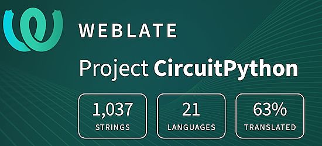](https://hosted.weblate.org/engage/circuitpython/)

One important feature of CircuitPython is translated control and error messages. With the help of fellow open source project [Weblate](https://weblate.org/), we're making it even easier to add or improve translations. 

Sign in with an existing account such as GitHub, Google or Facebook and start contributing through a simple web interface. No forks or pull requests needed! As always, if you run into trouble join us on [Discord](https://adafru.it/discord), we're here to help.

## 39,140 Thanks

The Adafruit Discord community, where we do all our CircuitPython development in the open, reached over 39,140 humans - thank you! Adafruit believes Discord offers a unique way for Python on hardware folks to connect. Join today at [https://adafru.it/discord](https://adafru.it/discord).

## ICYMI - In case you missed it

Python on hardware is the Adafruit Python video-newsletter-podcast! The news comes from the Python community, Discord, Adafruit communities and more and is broadcast on ASK an ENGINEER Wednesdays. The complete Python on Hardware weekly videocast [playlist is here](https://www.youtube.com/playlist?list=PLjF7R1fz_OOXRMjM7Sm0J2Xt6H81TdDev). The video podcast is on [iTunes](https://itunes.apple.com/us/podcast/python-on-hardware/id1451685192?mt=2), [YouTube](http://adafru.it/pohepisodes), [Instagram](https://www.instagram.com/adafruit/channel/)), and [XML](https://itunes.apple.com/us/podcast/python-on-hardware/id1451685192?mt=2).

[The weekly community chat on Adafruit Discord server CircuitPython channel - Audio / Podcast edition](https://itunes.apple.com/us/podcast/circuitpython-weekly-meeting/id1451685016) - Audio from the Discord chat space for CircuitPython, meetings are usually Mondays at 2pm ET, this is the audio version on [iTunes](https://itunes.apple.com/us/podcast/circuitpython-weekly-meeting/id1451685016), Pocket Casts, [Spotify](https://adafru.it/spotify), and [XML feed](https://adafruit-podcasts.s3.amazonaws.com/circuitpython_weekly_meeting/audio-podcast.xml).

## Contribute

The CircuitPython Weekly Newsletter is a CircuitPython community-run newsletter emailed every Monday. To contribute your content, please email your news to cpnews (at) adafruit (dot) com with information and link(s) to your content. 

Join the Adafruit [Discord](https://adafru.it/discord) or [post to the forum](https://forums.adafruit.com/viewforum.php?f=60) if you have questions.
