- [ ] Library and info updates
- [ ] change date
- [ ] update title
- [ ] Feature story
- [ ] Update  for images
- [ ] Update ICYDNCI
- [ ] All images 550w max only
- [ ] Link "View this email in your browser."

News Sources

- [Adafruit Playground](https://adafruit-playground.com/)
- Twitter: [CircuitPython](https://twitter.com/search?q=circuitpython&src=typed_query&f=live), [MicroPython](https://twitter.com/search?q=micropython&src=typed_query&f=live) and [Python](https://twitter.com/search?q=python&src=typed_query)
- [Raspberry Pi News](https://www.raspberrypi.com/news/), [Pi Foundation](https://www.raspberrypi.org/blog/)
- Mastodon [CircuitPython](https://mastodon.social/tags/CircuitPython) and [MicroPython](https://mastodon.social/tags/MicroPython)
- BlueSky [CircuitPython](https://bsky.app/search?q=circuitpython), [MicroPython](https://bsky.app/search?q=micropython), [Raspberry Pi](https://bsky.app/search?q=raspberry+pi)
- [Google News Python](https://news.google.com/topics/CAAqIQgKIhtDQkFTRGdvSUwyMHZNRFY2TVY4U0FtVnVLQUFQAQ?hl=en-US&gl=US&ceid=US%3Aen)
- YouTube: [CircuitPython](https://www.youtube.com/results?search_query=circuitpython&sp=CAI%253D), [MicroPython](https://www.youtube.com/results?search_query=micropython&sp=CAI%253D), [Prof Gallaugher](https://www.youtube.com/@BuildWithProfG/videos)
- [maker.io Python](https://www.digikey.com/en/maker/search-results?s=createdDate&t=python)
- [hackster.io CircuitPython](https://www.hackster.io/search?q=circuitpython&i=projects&sort_by=most_recent) and [MicroPython](https://www.hackster.io/search?q=micropython&i=projects&sort_by=most_recent)
- Instructables: [CircuitPython](https://www.instructables.com/search/?q=circuitpython&projects=all&sort=Newest), [MicroPython](https://www.instructables.com/search/?q=micropython&projects=all&sort=Newest), [Raspberry Pi Python](https://www.instructables.com/search/?q=raspberry+pi+python&projects=all&sort=Newest)
- [hackaday CircuitPython](https://hackaday.com/blog/?s=circuitpython) and [MicroPython](https://hackaday.com/blog/?s=micropython)
- [python.org](https://www.python.org/)
- [Python Insider - dev team blog](https://pythoninsider.blogspot.com/)
- Individuals: [bret.dk](https://bret.dk/), [Jeff Geerling](https://www.jeffgeerling.com/blog), [Yakroo](https://x.com/Yakroo5077)
- Tom's Hardware: [CircuitPython](https://www.tomshardware.com/search?searchTerm=circuitpython&articleType=all&sortBy=publishedDate) and [MicroPython](https://www.tomshardware.com/search?searchTerm=micropython&articleType=all&sortBy=publishedDate) and [Raspberry Pi](https://www.tomshardware.com/search?searchTerm=raspberry%20pi&articleType=all&sortBy=publishedDate)
- [hackaday.io newest projects MicroPython](https://hackaday.io/projects?tag=micropython&sort=date) and [CircuitPython](https://hackaday.io/projects?tag=circuitpython&sort=date)
- hackaday.io - [CircuitPython](https://hackaday.io/search?term=circuitpython) and [MicroPython](https://hackaday.io/search?term=micropython)
- [MicroPython Meeting](https://luma.com/micropython?k=c)

View this email in your browser. **Warning: Flashing Imagery**

Welcome to the latest Python on Microcontrollers newsletter! *insert 2-3 sentences from editor (what's in overview, banter)* - *Anne Barela, Editor*

We're on [Discord](https://discord.gg/HYqvREz), [Twitter/X](https://twitter.com/search?q=circuitpython&src=typed_query&f=live), [BlueSky](https://bsky.app/profile/circuitpython.org) and for past newsletters - [view them all here](https://www.adafruitdaily.com/category/circuitpython/). If you're reading this on the web, please [subscribe here](https://www.adafruitdaily.com/). Here's the news this week:

## Headline

text - [site](url).

## pico⚡flash Flashes RP2040 and RP2350 Devices in Chromium Browsers

[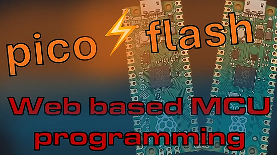](https://github.com/piersfinlayson/picoflash)

pico⚡️flash is a free and open source web application that allows you to quickly flash your Raspberry Pi Pico microcontroller directly from a Chromium-based web browser.  You can erase, read and write flash, RAM and One Time Programmable memory on any RP2040/RP2350 device - [GitHub](https://github.com/piersfinlayson/picoflash), [Website](https://picoflash.org/) and [YouTube](https://www.youtube.com/watch?v=SrImrDtGons).

## AI Can Write Python Code, But Maintaining It Is Still Your Job

AI can whip up Python (CircuitPython / MicroPython) code in no time. The challenge, however, is keeping the code clean, readable, and maintainable. - [KDnuggets](https://www.kdnuggets.com/ai-writes-python-code-but-maintaining-it-is-still-your-job#/).

## The Chip Shortage Will Spread to Other Segments

[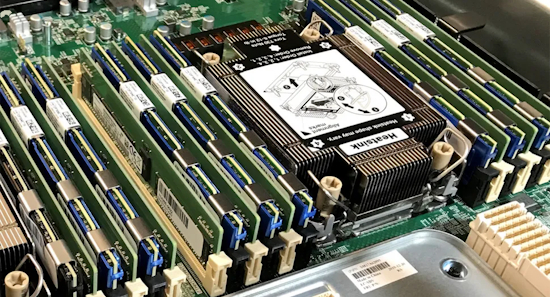](https://www.tomshardware.com/pc-components/ram/data-centers-will-consume-70-percent-of-memory-chips-made-in-2026-supply-shortfall-will-cause-the-chip-shortage-to-spread-to-other-segments#/)

The tech press has been lit up like Chernobyl reactor #4 for months about shortages in memory, solid-state drives, and hard drives. The shortages are driven by explosive AI demand, and the latest report says that up to 70 percent of the memory produced worldwide in 2026 will be consumed by data centers. A [Wall Street Journal article](https://www.wsj.com/tech/ai/memory-ram-shortage-2026-f55324b0) (WSJ) describes just how dire the situation is and how the fallout from the RAM shortage is set to irradiate several markets not directly linked to computing - [Tom's Hardware](https://www.tomshardware.com/pc-components/ram/data-centers-will-consume-70-percent-of-memory-chips-made-in-2026-supply-shortfall-will-cause-the-chip-shortage-to-spread-to-other-segments#/).

## USB Gadget Mode in Raspberry Pi OS: SSH over USB

[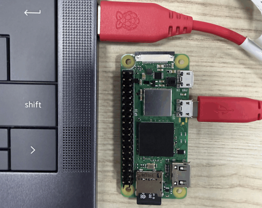](https://www.raspberrypi.com/news/usb-gadget-mode-in-raspberry-pi-os-ssh-over-usb/#/)

If you’ve ever tried using a Raspberry Pi — or any single-board computer — while travelling, you probably know how frustrating it can be. Hotel rooms with no spare Ethernet ports, conference WiFi behind captive portals, networks that block local discovery tools, or simply not knowing what IP address your headless board received can all turn a simple task into a hassle. 

Paul Oberosler came across a concept that sounded like the ideal solution: Ethernet over USB. Plug the Raspberry Pi into a laptop and it appears as a USB network adapter, just like when you enable USB tethering on a smartphone. That would mean no WiFi setup, no IP scanning, no captive portal headaches — just plug in, SSH, and start working. Bonus: the host computer could even share its internet connection over that same cable - [Raspberry Pi News](https://www.raspberrypi.com/news/usb-gadget-mode-in-raspberry-pi-os-ssh-over-usb/#/).

## Making a Quiz Program for CircuitPython & Circuit Playground Questions

[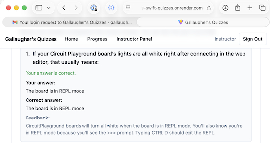](https://blog.adafruit.com/2026/01/21/making-a-quiz-program-for-circuitpython-circuit-playground-questions/#/)

Professor Gallaugher from Boston College teaches several courses and has a popular [YouTube CircuitPython School series of videos](https://www.youtube.com/playlist?list=PLBJJ76R_ry5T3X72OIDkMOXQIdmcvSkue#/) - [Adafruit Blog](https://blog.adafruit.com/2026/01/21/making-a-quiz-program-for-circuitpython-circuit-playground-questions/#/) and [Quiz Preview](https://www.johngallaugher.com/login).

## No Dataset? No Problem: 3 Ways to Generate Realistic Test Data in Python in Minutes

Try out operations in Python libraries but don't have any datasets handy? Fortunately, it's pretty easy to make your own when needed. Get some help from NumPy's random number generator - [How-To Geek](https://www.howtogeek.com/no-dataset-generate-realistic-test-data-in-python-in-minutes/#/).

## This Week's Python Streams

Python on Hardware is all about building a cooperative ecosphere which allows contributions to be valued and to grow knowledge. Below are the streams within the last week focusing on the community.

**CircuitPython Deep Dive Stream**

[Last Friday](https://youtube.com/live/lHcfkLUnwAk), Scott streamed work on Yoto hacking & #CircuitPython2026 Wrap-up.

You can see the latest video and past videos on the Adafruit YouTube channel under the Deep Dive playlist - [YouTube](https://www.youtube.com/playlist?list=PLjF7R1fz_OOXBHlu9msoXq2jQN4JpCk8A).

**CircuitPython Parsec**

John Park’s CircuitPython Parsec this week is a Circuit Playground Bluefruit iPhone Intervalometer - [Adafruit Blog](https://blog.adafruit.com/2026/01/23/john-parks-circuitpython-parsec-circuit-playground-bluefruit-iphone-intervalometer/#/) and [YouTube](https://youtu.be/vTqBrqXm5SI).

Catch all the episodes in the [YouTube playlist](https://www.youtube.com/playlist?list=PLjF7R1fz_OOWFqZfqW9jlvQSIUmwn9lWr).

**CircuitPython Weekly Meeting**

CircuitPython Weekly Meeting for January 20, 2026 ([notes](https://github.com/adafruit/adafruit-circuitpython-weekly-meeting/blob/main/2026/2026-01-20.md)) [on YouTube](https://youtu.be/BWVuH8AHuNo).

## Project of the Week: PyBASIC ported to the HP Prime calculator

[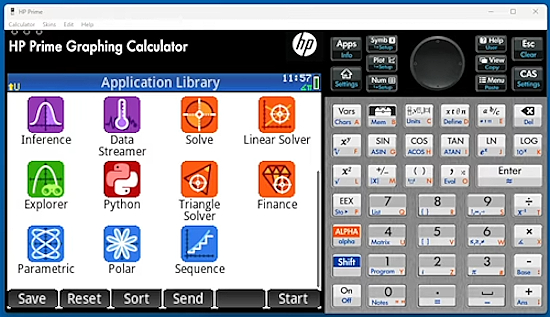](https://www.youtube.com/watch?v=a1LwXHX0U1o#/)

YouTube user Calculator Clique has ported PyBASIC to the HP Prime MicroPython environment - [YouTube](https://www.youtube.com/watch?v=a1LwXHX0U1o#/) and [GitHub](https://github.com/diemheych/PrimePyBASIC). Via [Hackaday](https://hackaday.com/2026/01/19/basic-on-a-calculator-again/#/).

## Popular Last Week

What was the most popular, most clicked link, in [last week's newsletter](https://www.adafruitdaily.com/2026/01/19/python-on-microcontrollers-newsletter-python-and-circuitpython-in-2026-fake-raspberry-pi-picos-on-aliexpress-and-more-circuitpython-python-micropython-thepsf-raspberry_pi/)? [STM32 vs ESP32: Common Microcontroller Mistakes That Cause IoT Product Failures](https://medium.com/@digital.auckam/stm32-vs-esp32-common-microcontroller-mistakes-that-cause-iot-product-failures-82a150a6c60f).

Did you know you can read past issues of this newsletter in the Adafruit Daily Archive? [Check it out](https://www.adafruitdaily.com/category/circuitpython/).

## New Notes from Adafruit Playground

[Adafruit Playground](https://adafruit-playground.com/) is a new place for the community to post their projects and other making tips/tricks/techniques. Ad-free, it's an easy way to publish your work in a safe space for free.

[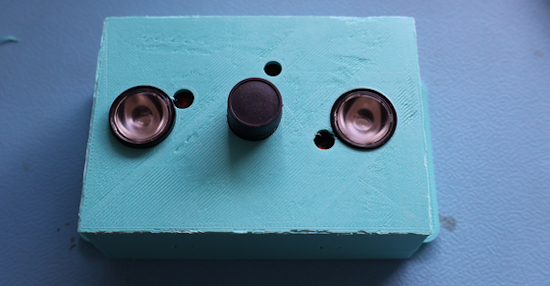](https://adafruit-playground.com/u/ntynen/pages/home-hub-camera)

Home Hub: Camera - [Adafruit Playground](https://adafruit-playground.com/u/ntynen/pages/home-hub-camera).

[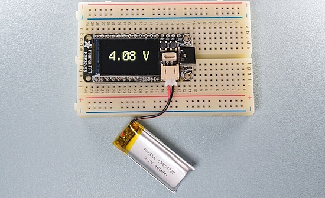](https://adafruit-playground.com/u/SamBlenny/pages/lipo-storage-voltage-conditioner)

LiPo Storage Voltage Conditioner - [Adafruit Playground](https://adafruit-playground.com/u/SamBlenny/pages/lipo-storage-voltage-conditioner).

"Polyglot" screen saver for Fruit Jam - [Adafruit Playground](https://adafruit-playground.com/u/mrklingon/pages/polyglot-screen-saver-for-fruit-jam).

## News From Around the Web

[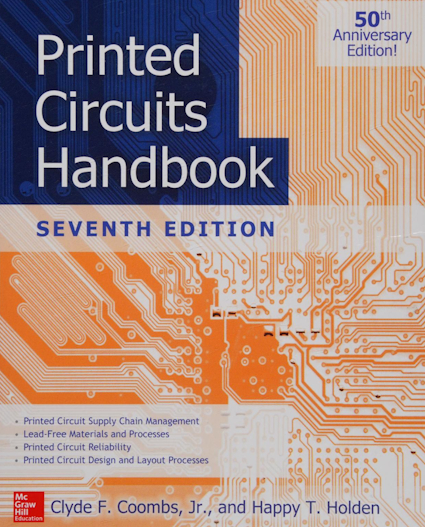](https://archive.org/details/isbn_9780071833950/mode/1up)

Free book: Printed Circuits Handbook, 2016 edition - [Internet Archive-](https://archive.org/details/isbn_9780071833950/mode/1up).

[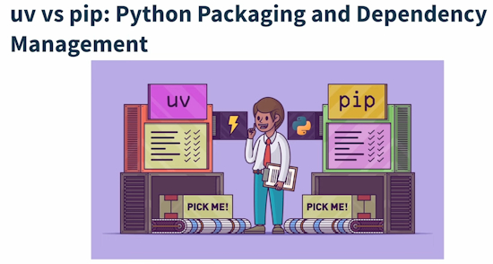](https://www.youtube.com/watch?app=desktop&v=R9_gToHrfWo)

`uv` vs. `pip` - Python packaging and dependency management: comparing `uv` and `pip` and their organizations - [YouTube](https://www.youtube.com/watch?app=desktop&v=R9_gToHrfWo).

[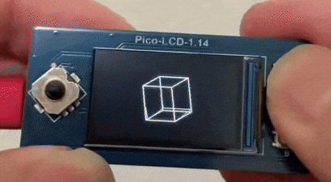](https://x.com/sozoraemon/status/2013212306889490762)

A device that lets you move 3D shapes exactly the way you want. Programmed with MicroPython on a Raspberry Pi Pico 2 - [X](https://x.com/sozoraemon/status/2013212306889490762).

[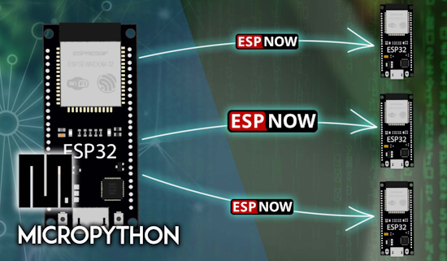](https://randomnerdtutorials.com/micropython-esp-now-esp32-one-to-many/)

ESP-NOW with ESP32 – Control Multiple Boards (One to Many) with MicroPython - [Random Nerd Tutorials](https://randomnerdtutorials.com/micropython-esp-now-esp32-one-to-many/).

[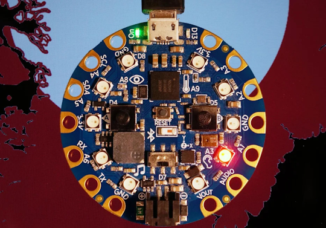](https://www.instructables.com/Audio-Player-on-Circuit-Playground-Bluefruit/)

A simple audio player on am Adafruit Circuit Playground Bluefruit (CPB) with CircuitPython - [Instructables](https://www.instructables.com/Audio-Player-on-Circuit-Playground-Bluefruit/).

Anthropic’s Python Software Foundation (PSF) investment: why it matters. Here’s what the $1.5M investment in the Python Software Foundation will mean for AI coding and open-source security - [ReversingLabs](https://www.reversinglabs.com/blog/anthropic-python-investment#/).

[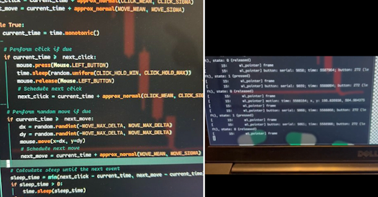](https://x.com/twinturbomonke1/status/2013753687898816660)

Father gives their six year old an old phone (no carrier service) as a mini-tablet. "He used it to learn about CircuitPython, Grok, how to frame prompts, and learned rudimentary CircuitPython to code his first science project" - [X Thread](https://x.com/twinturbomonke1/status/2013753687898816660).

Kritish Mohapatra shares his 100 Days – 100 IoT projects using MicroPython - [GitHub](https://github.com/orgs/micropython/discussions/18690).

[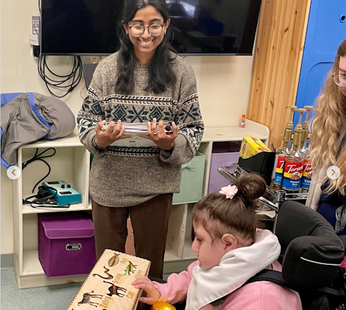](https://www.instagram.com/p/DTljI53jW9h/?img_index=9&igsh=MWFkZ21xdDB2c215Yg%3D%3D)

Boston College Campus School’s collaboration with Professor John Gallaugher’s Physical Computing class was once again a success last semester. After an initial visit led by Assistive Technology Professional Meghan, students learned how adaptive and assistive technology can remove barriers, promote independence, and bring joy to learning. Undergraduate and graduate students designed and built customized projects to support Campus School students - [Instagram](https://www.instagram.com/p/DTljI53jW9h/?img_index=9&igsh=MWFkZ21xdDB2c215Yg%3D%3D).

[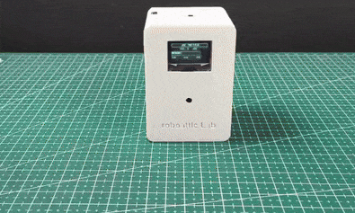](https://www.hackster.io/roboattic_Lab/portable-decibel-meter-using-raspberry-pi-pico-micro-python-ce1596#/)

Portable Decibel Meter using Raspberry Pi Pico, MicroPython, and a high-precision INMP441 I2S MEMS microphone. The device measures real-time sound levels - [hackster.io](https://www.hackster.io/roboattic_Lab/portable-decibel-meter-using-raspberry-pi-pico-micro-python-ce1596#/).

[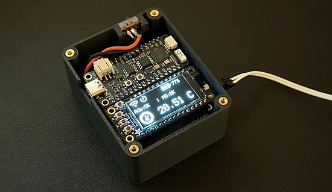](https://www.movingelectrons.net/posts/freezer-temperature-monitor---version-2.0/#/)

A HomeKit compatible freezer temperature monitoring system - version 2.0 with CircuitPython - [Moving Electrons](https://www.movingelectrons.net/posts/freezer-temperature-monitor---version-2.0/#/).

text - [site](url).

text - [site](url).

text - [site](url).

[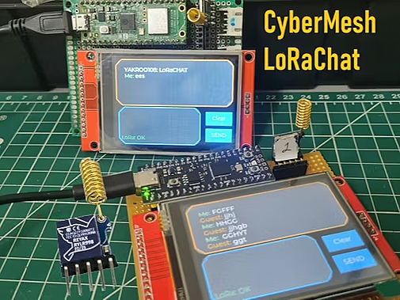](https://www.hackster.io/yakroo/cybermesh-lorachat-da39ac#/)

CyberMesh LoRaChat - a decentralized communication device for emergency situations. It uses a Raspberry Pi Pico 2, RYLR998 and MicroPython - [hackster.io](https://www.hackster.io/yakroo/cybermesh-lorachat-da39ac#/).

[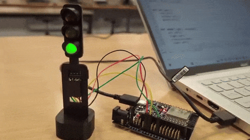](https://x.com/fsrobotic/status/2013869053497024709)

Making a traffic light in an Intro to Robotics course using ESP32 and MicroPython - [X](https://x.com/fsrobotic/status/2013869053497024709).

MicroPython/LVGL: set up an LVGL display and touch for the Waveshare ESP32-S3-Touch-LCD-3.5C - [YouTube](https://www.youtube.com/watch?v=64BtNvdnt-0) and [GitHub](https://github.com/kwinter745321/ESP32LVGL/tree/main/Videos/video73).

[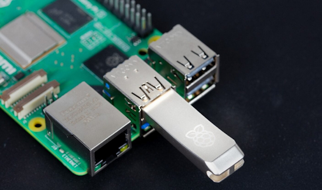](https://www.raspberrypi.com/news/raspberry-pi-flash-drive-available-now-from-30-a-high-quality-essential-accessory/#/)

The Raspberry Pi flash drive available is now available. It's billed as optimized for Raspberry Pi 5, likely due to being a USB 3 device - [Raspberry Pi News](https://www.raspberrypi.com/news/raspberry-pi-flash-drive-available-now-from-30-a-high-quality-essential-accessory/#/).

[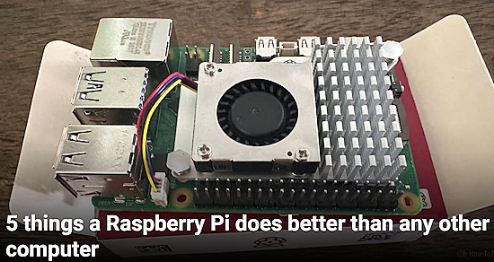](https://www.howtogeek.com/things-a-raspberry-pi-does-better-than-any-other-computer/#/)

5 things a Raspberry Pi does better than any other computer - [How-To Geek](https://www.howtogeek.com/things-a-raspberry-pi-does-better-than-any-other-computer/#/).

Bandit - an open-source tool for detecting security flaws in Python code - [The420](https://the420.in/bandit-python-security-scanner-open-source-devsecops-hardcoded-passwords/#/) and [GitHub](https://github.com/PyCQA/bandit).

## New

[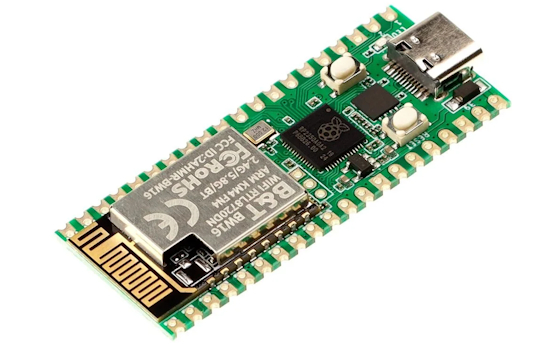](https://magazine.raspberrypi.com/articles/rp2350-pico-w5-review-2)

The Raspberry Pi Official Magazine provides a review of the Elecrow RP2350 Pico W5 - [Raspberry Pi Official Magazine](https://magazine.raspberrypi.com/articles/rp2350-pico-w5-review-2).

Waveshare has recently released the ESP32-P4-WIFI6-Touch-LCD, a family of tablet-like, fully enclosed HMI display development boards built around the ESP32-P4 SoC. The company offers 7-inch, 8-inch, or 10.1-inch configurations. Waveshare has integrated an ESP32-C6-MINI module for WiFi 6 and Bluetooth 5 (LE) support. The board also leverages the ESP32-P4’s peripherals for MIPI CSI/DSI interfaces, a 5MP camera, and various I/Os, including USB 2.0 OTG and USB-to-UART Type-C ports, an SDIO 3.0 microSD card slot, dual microphones with echo cancellation, a speaker driven by an onboard audio codec, GPIO expansion headers, and optional battery support - [CNX](https://www.cnx-software.com/2026/01/17/tablet-like-esp32-p4-based-7-8-and-10-1-inch-hmi-displays-integrate-wi-fi-6-connectivity-5mp-camera/#/).

[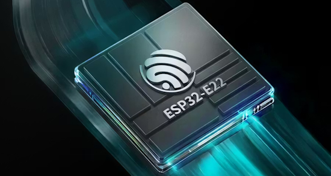](https://www.hackster.io/news/espressif-goes-tri-band-with-the-new-wi-fi-6e-capable-esp32-e22-communications-coprocessor-e76387f5c0c2#/)

Espressif goes tri-band with the new, WiFi 6E-capable ESP32-E22 Communications coprocessor. The new chip boasts a 2.4Gb/s peak throughput, WiFi 6E and Bluetooth 5.4/BLE radios, and high-speed interfaces - [hackster.io](https://www.hackster.io/news/espressif-goes-tri-band-with-the-new-wi-fi-6e-capable-esp32-e22-communications-coprocessor-e76387f5c0c2#/).

## New Boards Supported by CircuitPython

The number of supported microcontrollers and Single Board Computers (SBC) grows every week. This section outlines which boards have been included in CircuitPython or added to [CircuitPython.org](https://circuitpython.org/).

This week there were (#/no) new boards added:

- [Board name](url)
- [Board name](url)
- [Board name](url)

*Note: For non-Adafruit boards, please use the support forums of the board manufacturer for assistance, as Adafruit does not have the hardware to assist in troubleshooting.*

Looking to add a new board to CircuitPython? It's highly encouraged! Adafruit has four guides to help you do so:

- [How to Add a New Board to CircuitPython](https://learn.adafruit.com/how-to-add-a-new-board-to-circuitpython/overview)
- [How to add a New Board to the circuitpython.org website](https://learn.adafruit.com/how-to-add-a-new-board-to-the-circuitpython-org-website)
- [Adding a Single Board Computer to PlatformDetect for Blinka](https://learn.adafruit.com/adding-a-single-board-computer-to-platformdetect-for-blinka)
- [Adding a Single Board Computer to Blinka](https://learn.adafruit.com/adding-a-single-board-computer-to-blinka)

## New Learn Guides

The Adafruit Learning System has over 3,200 free guides for learning skills and building projects including using Python.

[title](url) from [name](url)

[title](url) from [name](url)

[title](url) from [name](url)

## Updated Learn Guides

[title](url)

## CircuitPython Libraries

The CircuitPython library numbers are continually increasing, while existing ones continue to be updated. Here we provide library numbers and updates!

To get the latest Adafruit libraries, download the [Adafruit CircuitPython Library Bundle](https://circuitpython.org/libraries). To get the latest community contributed libraries, download the [CircuitPython Community Bundle](https://circuitpython.org/libraries).

If you'd like to contribute to the CircuitPython project on the Python side of things, the libraries are a great place to start. Check out the [CircuitPython.org Contributing page](https://circuitpython.org/contributing). If you're interested in reviewing, check out Open Pull Requests. If you'd like to contribute code or documentation, check out Open Issues. We have a guide on [contributing to CircuitPython with Git and GitHub](https://learn.adafruit.com/contribute-to-circuitpython-with-git-and-github), and you can find us in the #help-with-circuitpython and #circuitpython-dev channels on the [Adafruit Discord](https://adafru.it/discord).

You can check out this [list of all the Adafruit CircuitPython libraries and drivers available](https://github.com/adafruit/Adafruit_CircuitPython_Bundle/blob/master/circuitpython_library_list.md). 

The current number of CircuitPython libraries is **###**!

**New Libraries**

Here are this week's new CircuitPython libraries:

* [library](url)

**Updated Libraries**

Here are this week's updated CircuitPython libraries:

* [library](url)

## What’s the CircuitPython team up to this week?

What is the team up to this week? Let’s check in:

**Dan**

I'm continuing on the AirLift `wifi` implementation. HTTP and HTTPS fetching, and bidirectional UDP traffic are all now working. I'll get HTTPS serving to work and then submit a PR for testing.

**Tim**

I've done some more library PR reviews this week as well as knocking out a handful of the infrastructure issue items listed on the contributing page. The other main thing I'm working on is new Learn guide for a MagTag Haiku viewer project. The code is done and I started writing the guide pages this week. Over the weekend I made progress ingesting the core stubs for use in a CircuitPython RAG system for local LLMs.

**Scott**

I'm back in the office today after watching my youngest while they were sick. It's going around her daycare. My first order of business is to get back to debugging why the display on the Yoto mini player doesn't work. I got more PCBite probes over the weekend so I can capture more pins at once. Hopefully that'll be enough for me to determine how to fix my implementation.

**Liz**

I made some pretty good progress with the Yoto Mini reverse engineering last week. I wrote a [CircuitPython helper library](https://github.com/BlitzCityDIY/CircuitPython_Yoto_Mini) to access all of the peripherals on board, minus the display. I've been documenting my progress in a [Playground note](https://adafruit-playground.com/u/BlitzCityDIY/pages/yoto-mini-hacking) that will eventually be transferred to a full guide. I also used a Bus Pirate for the first time to access I2C traffic during boot with the default firmware. I've learned a lot so far working on this.

## Upcoming Events

The next MicroPython Meetup in Melbourne will be on January 28th – [Luma](https://luma.com/r0rq9pl4). You can see recordings of previous meetings on [YouTube](https://www.youtube.com/@MicroPythonOfficial). 

PyCascades 2026 will be 20 March 2026 – 21 March 2026 in Vancouver, British Columbia, Canada - [PyCascades 2026](https://2026.pycascades.com/).

**Other Events This Year**
* PyCon DE & PyData 2026 will be 13 April 2026 – 17 April 2026 in Darmstadt, Germany
* The Open Source Hardware Association Open Hardware Summit is coming to Berlin, Germany on May 23rd and 24th, 2026.
* PyCon AU 2026 will be 26 Aug. 2026 – 30 Aug. 2026 in Brisbane, Australia

**Send Your Events In**

If you know of virtual events or upcoming events, please let us know via email to cpnews(at)adafruit(dot)com.

## Latest Releases

CircuitPython's stable release is [#.#.#](https://github.com/adafruit/circuitpython/releases/latest) and its unstable release is [#.#.#-##.#](https://github.com/adafruit/circuitpython/releases). New to CircuitPython? Start with our [Welcome to CircuitPython Guide](https://learn.adafruit.com/welcome-to-circuitpython).

[2026####](https://github.com/adafruit/Adafruit_CircuitPython_Bundle/releases/latest) is the latest Adafruit CircuitPython library bundle.

[2026####](https://github.com/adafruit/CircuitPython_Community_Bundle/releases/latest) is the latest CircuitPython Community library bundle.

[v#.#.#](https://micropython.org/download) is the latest MicroPython release. Documentation for it is [here](http://docs.micropython.org/en/latest/pyboard/).

[#.#.#](https://www.python.org/downloads/) is the latest Python release. The latest pre-release version is [#.#.#](https://www.python.org/download/pre-releases/).

[#,### Stars](https://github.com/adafruit/circuitpython/stargazers) Like CircuitPython? [Star it on GitHub!](https://github.com/adafruit/circuitpython)

## Call for Help -- Translating CircuitPython is now easier than ever

[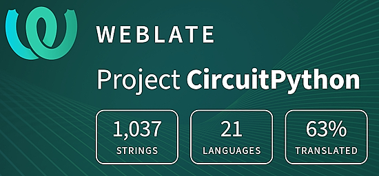](https://hosted.weblate.org/engage/circuitpython/)

One important feature of CircuitPython is translated control and error messages. With the help of fellow open source project [Weblate](https://weblate.org/), we're making it even easier to add or improve translations. 

Sign in with an existing account such as GitHub, Google or Facebook and start contributing through a simple web interface. No forks or pull requests needed! As always, if you run into trouble join us on [Discord](https://adafru.it/discord), we're here to help.

## 39,138 Thanks

The Adafruit Discord community, where we do all our CircuitPython development in the open, reached over 39,138 humans - thank you! Adafruit believes Discord offers a unique way for Python on hardware folks to connect. Join today at [https://adafru.it/discord](https://adafru.it/discord).

## ICYMI - In case you missed it

Python on hardware is the Adafruit Python video-newsletter-podcast! The news comes from the Python community, Discord, Adafruit communities and more and is broadcast on ASK an ENGINEER Wednesdays. The complete Python on Hardware weekly videocast [playlist is here](https://www.youtube.com/playlist?list=PLjF7R1fz_OOXRMjM7Sm0J2Xt6H81TdDev). The video podcast is on [iTunes](https://itunes.apple.com/us/podcast/python-on-hardware/id1451685192?mt=2), [YouTube](http://adafru.it/pohepisodes), [Instagram](https://www.instagram.com/adafruit/channel/)), and [XML](https://itunes.apple.com/us/podcast/python-on-hardware/id1451685192?mt=2).

[The weekly community chat on Adafruit Discord server CircuitPython channel - Audio / Podcast edition](https://itunes.apple.com/us/podcast/circuitpython-weekly-meeting/id1451685016) - Audio from the Discord chat space for CircuitPython, meetings are usually Mondays at 2pm ET, this is the audio version on [iTunes](https://itunes.apple.com/us/podcast/circuitpython-weekly-meeting/id1451685016), Pocket Casts, [Spotify](https://adafru.it/spotify), and [XML feed](https://adafruit-podcasts.s3.amazonaws.com/circuitpython_weekly_meeting/audio-podcast.xml).

## Contribute

The CircuitPython Weekly Newsletter is a CircuitPython community-run newsletter emailed every Monday. To contribute your content, please email your news to cpnews (at) adafruit (dot) com with information and link(s) to your content. 

Join the Adafruit [Discord](https://adafru.it/discord) or [post to the forum](https://forums.adafruit.com/viewforum.php?f=60) if you have questions.
