- [ ] Library and info updates
- [ ] change date
- [ ] update title
- [ ] Feature story
- [ ] Update  for images
- [ ] Update ICYDNCI
- [ ] All images 550w max only
- [ ] Link "View this email in your browser."

News Sources

- [Adafruit Playground](https://adafruit-playground.com/)
- Twitter: [CircuitPython](https://twitter.com/search?q=circuitpython&src=typed_query&f=live), [MicroPython](https://twitter.com/search?q=micropython&src=typed_query&f=live) and [Python](https://twitter.com/search?q=python&src=typed_query)
- [Raspberry Pi News](https://www.raspberrypi.com/news/), [Pi Foundation](https://www.raspberrypi.org/blog/)
- Mastodon [CircuitPython](https://mastodon.social/tags/CircuitPython) and [MicroPython](https://mastodon.social/tags/MicroPython)
- BlueSky [CircuitPython](https://bsky.app/search?q=circuitpython), [MicroPython](https://bsky.app/search?q=micropython), [Raspberry Pi](https://bsky.app/search?q=raspberry+pi)
- [Google News Python](https://news.google.com/topics/CAAqIQgKIhtDQkFTRGdvSUwyMHZNRFY2TVY4U0FtVnVLQUFQAQ?hl=en-US&gl=US&ceid=US%3Aen)
- YouTube: [CircuitPython](https://www.youtube.com/results?search_query=circuitpython&sp=CAI%253D), [MicroPython](https://www.youtube.com/results?search_query=micropython&sp=CAI%253D), [Prof Gallaugher](https://www.youtube.com/@BuildWithProfG/videos)
- [maker.io Python](https://www.digikey.com/en/maker/search-results?s=createdDate&t=python)
- [hackster.io CircuitPython](https://www.hackster.io/search?q=circuitpython&i=projects&sort_by=most_recent) and [MicroPython](https://www.hackster.io/search?q=micropython&i=projects&sort_by=most_recent)
- Instructables: [CircuitPython](https://www.instructables.com/search/?q=circuitpython&projects=all&sort=Newest), [MicroPython](https://www.instructables.com/search/?q=micropython&projects=all&sort=Newest), [Raspberry Pi Python](https://www.instructables.com/search/?q=raspberry+pi+python&projects=all&sort=Newest)
- [hackaday CircuitPython](https://hackaday.com/blog/?s=circuitpython) and [MicroPython](https://hackaday.com/blog/?s=micropython)
- [python.org](https://www.python.org/)
- [Python Insider - dev team blog](https://pythoninsider.blogspot.com/)
- Individuals: [bret.dk](https://bret.dk/), [Jeff Geerling](https://www.jeffgeerling.com/blog), [Yakroo](https://x.com/Yakroo5077)
- Tom's Hardware: [CircuitPython](https://www.tomshardware.com/search?searchTerm=circuitpython&articleType=all&sortBy=publishedDate) and [MicroPython](https://www.tomshardware.com/search?searchTerm=micropython&articleType=all&sortBy=publishedDate) and [Raspberry Pi](https://www.tomshardware.com/search?searchTerm=raspberry%20pi&articleType=all&sortBy=publishedDate)
- [hackaday.io newest projects MicroPython](https://hackaday.io/projects?tag=micropython&sort=date) and [CircuitPython](https://hackaday.io/projects?tag=circuitpython&sort=date)
- hackaday.io - [CircuitPython](https://hackaday.io/search?term=circuitpython) and [MicroPython](https://hackaday.io/search?term=micropython)
- [MicroPython Meeting](https://luma.com/micropython?k=c)

View this email in your browser. **Warning: Flashing Imagery**

Welcome to the latest Python on Microcontrollers newsletter! *insert 2-3 sentences from editor (what's in overview, banter)* - *Anne Barela, Editor*

We're on [Discord](https://discord.gg/HYqvREz), [Twitter/X](https://twitter.com/search?q=circuitpython&src=typed_query&f=live), [BlueSky](https://bsky.app/profile/circuitpython.org) and for past newsletters - [view them all here](https://www.adafruitdaily.com/category/circuitpython/). If you're reading this on the web, please [subscribe here](https://www.adafruitdaily.com/). Here's the news this week:

## Headline

text - [site](url).

## Feature

text - [site](url).

## Feature

text - [site](url).

## Raspberry Pi OS Alternative DietPi Just Got a Big Update

[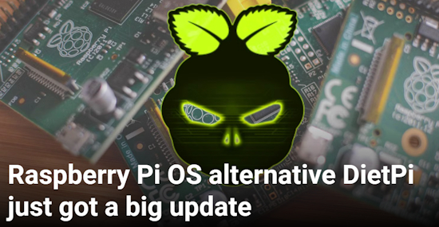](https://www.howtogeek.com/raspberry-pi-os-alternative-dietpi-just-got-a-big-update/)

DietPi is a popular Linux distribution for Raspberry Pi computers and other single-board computers. There's a new major release out this week, though it comes with some bad news for systems that can't be updated to Debian 12 or later versions - [How-To Geek](https://www.howtogeek.com/raspberry-pi-os-alternative-dietpi-just-got-a-big-update/).

## Kimi Code, an Open Source Python-Based Coding Agent

Kimi Code is an open-source coding agent under an Apache 2.0 License. It's Python-based and integrates with VS Code, Cursor, etc. It can also be connected to MoltBot (formerly ClawdBot). Costs apparently are [lower than Claude Opus](https://x.com/grok/status/2016812504068796606) - [kimi.com](https://www.kimi.com/), and [Kimi Code CLI GitHub](https://github.com/MoonshotAI/kimi-cli), [Connect to MoltBot](https://x.com/KimiProduct/status/2016791330022973892). Via [X](https://x.com/Kimi_Moonshot/status/2016034259350520226).

## A New Raspberry Pi Monthy Newsletter

The Raspberry Pi Industrial & Embedded Round-Up is a new newsletter published by Rasppberry Pi - [LinkedIn](https://www.linkedin.com/pulse/raspberry-pi-industrial-embedded-round-up-welcome-2026-raspberrypi-0pghe/).

> "This newsletter offers a concise snapshot. It focuses on recognising what people are building, sharing progress as it happens, and showing why Raspberry Pi continues to be trusted as a long-term, compliant platform for industry."

## Particle is Being Acquired by Digi

Wireless microcontrooller board maker Particle is being acquired by Digi, home of the venerable XBee platform that started affordable wireless on microcontrollers - [Particle.io](https://www.particle.io/blog/particle-is-being-acquired-by-digi-to-power-the-next-40-years-of-iot-innovation/). Via the [Adafruit Blog](https://blog.adafruit.com/2026/01/27/particle-is-being-acquired-by-digi/).

## This Week's Python Streams

Python on Hardware is all about building a cooperative ecosphere which allows contributions to be valued and to grow knowledge. Below are the streams within the last week focusing on the community.

**CircuitPython Deep Dive Stream**

[Last Friday](link), scott streamed work on {subject}.

You can see the latest video and past videos on the Adafruit YouTube channel under the Deep Dive playlist - [YouTube](https://www.youtube.com/playlist?list=PLjF7R1fz_OOXBHlu9msoXq2jQN4JpCk8A).

**CircuitPython Parsec**

John Park’s CircuitPython Parsec this week is on {subject} - [Adafruit Blog](link) and [YouTube](link).

Catch all the episodes in the [YouTube playlist](https://www.youtube.com/playlist?list=PLjF7R1fz_OOWFqZfqW9jlvQSIUmwn9lWr).

**CircuitPython Weekly Meeting**

CircuitPython Weekly Meeting for January 26, 2026 ([notes](https://github.com/adafruit/adafruit-circuitpython-weekly-meeting/blob/main/2026/2026-01-26.md)) [on YouTube](https://youtu.be/vhLFJygYPcs).

## Project of the Week

text - [site](url).

## Popular Last Week

[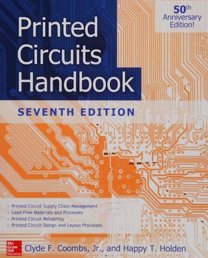](url)

What was the most popular, most clicked link, in [last week's newsletter](newslink)? [title](url).

Did you know you can read past issues of this newsletter in the Adafruit Daily Archive? [Check it out](https://www.adafruitdaily.com/category/circuitpython/).

## New Notes from Adafruit Playground

[Adafruit Playground](https://adafruit-playground.com/) is a new place for the community to post their projects and other making tips/tricks/techniques. Ad-free, it's an easy way to publish your work in a safe space for free.

[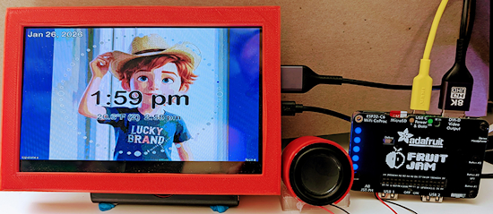](https://adafruit-playground.com/u/danak/pages/getting-my-fruit-jam-clock-to-speak)

Getting my Fruit Jam Clock to Speak - [Adafruit Playground](https://adafruit-playground.com/u/danak/pages/getting-my-fruit-jam-clock-to-speak).

text - [Adafruit Playground](url).

text - [Adafruit Playground](url).

## News From Around the Web

[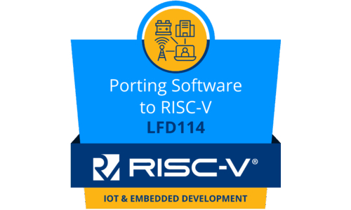](https://training.linuxfoundation.org/training/porting-software-to-risc-v-lfd114/)

The Linux Foundation is offering a FREE course on Porting Software to RISC-V - [The Linux Foundation](https://training.linuxfoundation.org/training/porting-software-to-risc-v-lfd114/).

[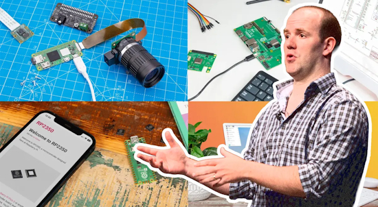](https://fabscene.com/new/special/raspberry-pi-history-education-to-industry/)

Raspberry Pi: How a $35 educational computer powered everything from personal electronics to enterprise products - [FabScene](https://fabscene.com/new/special/raspberry-pi-history-education-to-industry/) (Japanese).

Stop blindly trusting GitHub Copilot: 4 reasons it’s failing as a coding agent - [How-To Geek](https://www.howtogeek.com/github-copilot-is-powerful-but-these-issues-kept-slowing-me-down/).

[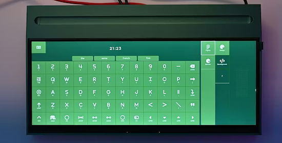](https://www.hackster.io/news/starkpad-is-a-gorgeous-stream-deck-alternative-you-can-build-yourself-76cfc961c5f0)

Starkpad is a gorgeous Stream Deck alternative using an Arduino UNO Q, STM32, and Xiao RP2040 with various programming including Python - [hackster.io](https://www.hackster.io/news/starkpad-is-a-gorgeous-stream-deck-alternative-you-can-build-yourself-76cfc961c5f0).

[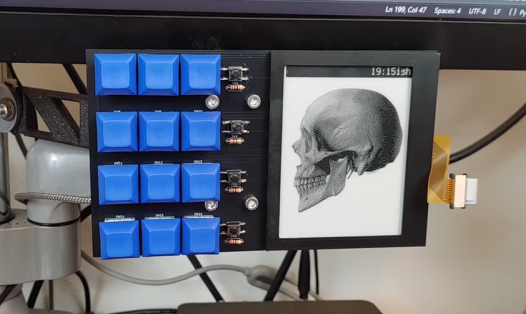](https://www.youtube.com/watch?v=PbdwmN28-So)

A macropad with a crisp eink display made with an Adafruit RP2040 Feather ThinkInk running CircuitPython - [YouTube](https://www.youtube.com/watch?v=PbdwmN28-So), [Hackaday](https://hackaday.com/2026/01/29/an-e-ink-macropad-for-improved-productivity/) and [Adafruit Blog](https://blog.adafruit.com/2026/01/29/an-e-ink-macropad-for-improved-productivity/).

[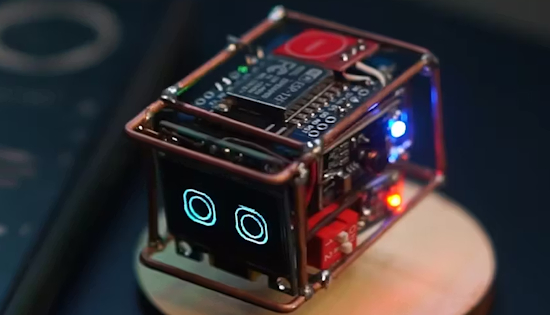](https://www.hackster.io/news/this-tiny-robot-wants-to-live-on-your-desk-ed7931a13f5a)

Mini Mochi Robot dances, reacts to touch, and adds playfulness to your workspace. The robot is built around a Wemos D1 Mini ESP8266-based development board programmable in MicroPython - [hackster.io](https://www.hackster.io/news/this-tiny-robot-wants-to-live-on-your-desk-ed7931a13f5a) and [YouTube](https://youtu.be/Rj3ImAVzOt0).

[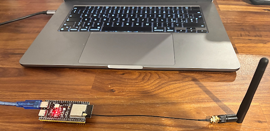](https://github.com/francescopace/espectre)

An ESP32-based person sensor, detecting slight movements with WiFi signals, using Python - [GitHub](https://github.com/francescopace/espectre) and [Hackaday](https://hackaday.com/2026/01/28/make-your-own-esp32-based-person-sensor-no-special-hardware-needed/).

text - [site](url).

text - [site](url).

text - [site](url).

text - [site](url).

text - [site](url).

5 Stream Deck alternatives you can build yourself that cost half as much - [XDA](https://www.xda-developers.com/stream-deck-alternatives-you-can-build-yourself-cost-half-as-much/).

text - [site](url).

text - [site](url).

[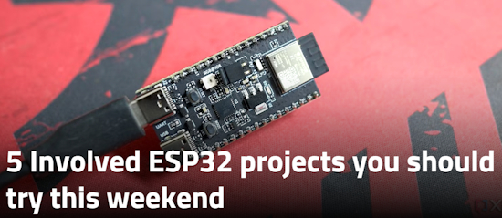](https://www.xda-developers.com/complex-esp32-projects-must-try-weekend/)

5 involved ESP32 projects you should try this weekend - [XDA](https://www.xda-developers.com/complex-esp32-projects-must-try-weekend/).

[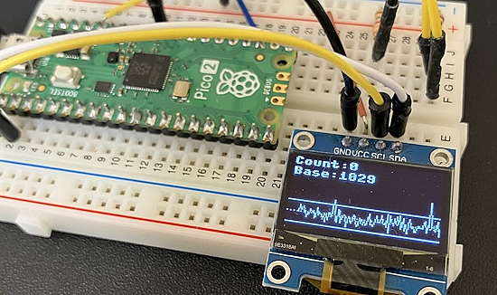](https://x.com/sozoraemon/status/2016106081634971844)

Adjusting detection logic for tissue extraction detection with MicroPython. "Graphing sensor values allows trends to be visualized, making the work more efficient" - [X](https://x.com/sozoraemon/status/2016106081634971844).

5 weird ways the Raspberry Pi has revived retro computer hardware - [How-To Geek](https://www.howtogeek.com/weird-ways-the-raspberry-pi-has-revived-retro-computer-hardware/).

[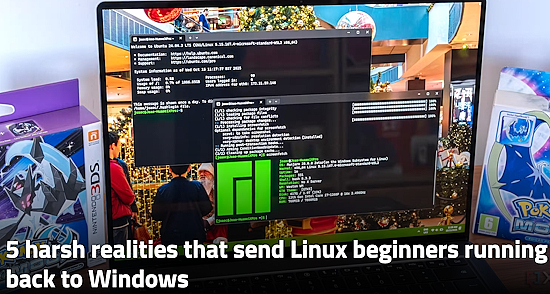](https://www.xda-developers.com/5-reasons-why-linux-beginners-always-end-up-going-back-to-windows/)

5 harsh realities that send Linux beginners running back to Windows - [XDA](https://www.xda-developers.com/5-reasons-why-linux-beginners-always-end-up-going-back-to-windows/).

## New

[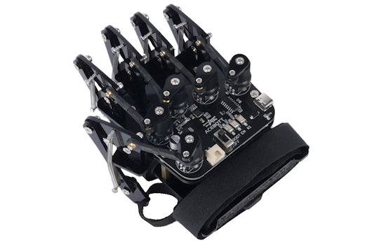](https://www.cnx-software.com/2026/01/26/acebott-qd023-esp32-based-gesture-control-glove-tracks-finger-movements-with-potentiometers/)

ACEBOTT QD023 ESP32-based gesture control glove tracks finger movements with potentiometers. Programmable in a number of languages - [CNX](https://www.cnx-software.com/2026/01/26/acebott-qd023-esp32-based-gesture-control-glove-tracks-finger-movements-with-potentiometers/).

[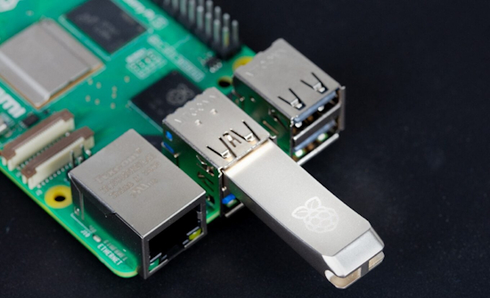](https://www.raspberrypi.com/news/raspberry-pi-flash-drive-available-now-from-30-a-high-quality-essential-accessory/)

Raspberry Pi is continuing its expansion into hardware accessories and components. You can now get an official Raspberry Pi Flash Drive. It's intended to be a boot drive for Pi boards, but you can use it like any other flash drive as well. The drives also support SMART health reporting and TRIM operations, and they will enter low-power USB 3.0 mode when not in use - [Raspberry Pi News](https://www.raspberrypi.com/news/raspberry-pi-flash-drive-available-now-from-30-a-high-quality-essential-accessory/) and [How-To Geek](https://www.howtogeek.com/need-a-good-flash-drive-raspberry-pi-has-one-for-you/).

[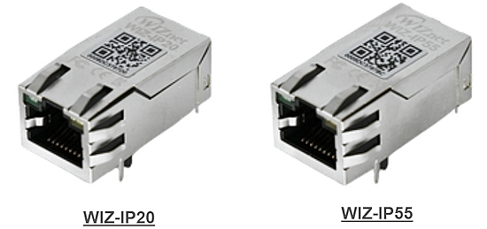](https://mailchi.mp/wiznet/wiznet-newsletter-january-2026)

WIZnet announced their newest “chip-in-jack” product line — the ioPort series — with sales starting in mid-February. The ioPort family is designed to make Ethernet integration faster and cleaner by putting the network solution directly into a compact jack form factor. The WIZ-IP20 is a Serial-to-Ethernet converter built on W55RP20, and WIZ-IP55 integrates W5500 inside - [WIZnet](https://mailchi.mp/wiznet/wiznet-newsletter-january-2026)

## New Boards Supported by CircuitPython

The number of supported microcontrollers and Single Board Computers (SBC) grows every week. This section outlines which boards have been included in CircuitPython or added to [CircuitPython.org](https://circuitpython.org/).

This week there were (#/no) new boards added:

- [Board name](url)
- [Board name](url)
- [Board name](url)

*Note: For non-Adafruit boards, please use the support forums of the board manufacturer for assistance, as Adafruit does not have the hardware to assist in troubleshooting.*

Looking to add a new board to CircuitPython? It's highly encouraged! Adafruit has four guides to help you do so:

- [How to Add a New Board to CircuitPython](https://learn.adafruit.com/how-to-add-a-new-board-to-circuitpython/overview)
- [How to add a New Board to the circuitpython.org website](https://learn.adafruit.com/how-to-add-a-new-board-to-the-circuitpython-org-website)
- [Adding a Single Board Computer to PlatformDetect for Blinka](https://learn.adafruit.com/adding-a-single-board-computer-to-platformdetect-for-blinka)
- [Adding a Single Board Computer to Blinka](https://learn.adafruit.com/adding-a-single-board-computer-to-blinka)

## New Learn Guides

The Adafruit Learning System has over 3,200 free guides for learning skills and building projects including using Python.

[title](url) from [name](url)

[title](url) from [name](url)

[title](url) from [name](url)

## Updated Learn Guides

[title](url)

## CircuitPython Libraries

The CircuitPython library numbers are continually increasing, while existing ones continue to be updated. Here we provide library numbers and updates!

To get the latest Adafruit libraries, download the [Adafruit CircuitPython Library Bundle](https://circuitpython.org/libraries). To get the latest community contributed libraries, download the [CircuitPython Community Bundle](https://circuitpython.org/libraries).

If you'd like to contribute to the CircuitPython project on the Python side of things, the libraries are a great place to start. Check out the [CircuitPython.org Contributing page](https://circuitpython.org/contributing). If you're interested in reviewing, check out Open Pull Requests. If you'd like to contribute code or documentation, check out Open Issues. We have a guide on [contributing to CircuitPython with Git and GitHub](https://learn.adafruit.com/contribute-to-circuitpython-with-git-and-github), and you can find us in the #help-with-circuitpython and #circuitpython-dev channels on the [Adafruit Discord](https://adafru.it/discord).

You can check out this [list of all the Adafruit CircuitPython libraries and drivers available](https://github.com/adafruit/Adafruit_CircuitPython_Bundle/blob/master/circuitpython_library_list.md). 

The current number of CircuitPython libraries is **###**!

**New Libraries**

Here are this week's new CircuitPython libraries:

* [library](url)

**Updated Libraries**

Here are this week's updated CircuitPython libraries:

* [library](url)

## What’s the CircuitPython team up to this week?

What is the team up to this week? Let’s check in:

**Dan**

I've implemented essentially all the needed functionality in Wifi AirLift, and made a draft PR for people to test. There is a remaining problem with HTTP server polling failing after several minutes which still needs to be debugged. This may be a NINA-FW problem. 

**Tim**

This week I've installed and have been trying out Moltbot (formerly known as Clawdbot). The project started to pick up steam and go viral/trending over the past weekend. I'm experimenting with running it on a Raspberry Pi 5 instead of on the more typical Mac hardware. 

After I got it up and running, I started connecting various bits of hardware and software to it so that it can sense and interact with the world in different ways. So far I've given it access to: a TFT display, a temperature sensor, a USB camera, an espeak text to speech, and `whisper-small` speech to text. Now it can take audio input, speak out loud, draw on the display, and sense the temperature in the room. It has been fascinating and a bit crazy to see its ability to install and set up new capabilities for itself and document their usage it its memory files to remember them for use in the future. Here is a photo of it showing a depiction it drew of itself on the display. 

[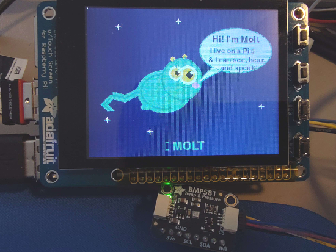](https://www.circuitpython.org/)

**Scott**

This week I've switched off of Yoto hacking. (Though there is [a PR open](https://github.com/adafruit/circuitpython/pull/10783) for it.) I'm now back to working on CircuitPython on Zephyr. I've been learning a lot about how to setup an LLM friendly task and tests tend to be a crucial part. So, I'm spending time setting up Zephyr's native simulator, which runs natively in Linux. There is also BabbleSim built on top of it to simulate multiple devices talking over BLE or 802.15.4 (used by Thread). Establishing a way to test with this will help LLMs implement more in the Zephyr port and ensure things stay working as expected. 

**Liz**

This week I've been documenting the [MIDI Bass Synth Stomp Box guide](https://learn.adafruit.com/midi-bass-synth-stomp-box). It's based on the [basyn project](https://www.worthpoint.com/worthopedia/basyn-midi-adapter-one-octave-bass-159882954), which is a small adapter board that lets folks wire up vintage organ pedals to use as MIDI controllers. This build uses a Pico 2 and a Terminal Block PiCowbell with foot switches arranged like a piano keyboard to achieve the same functionality.

## Upcoming Events

The next MicroPython Meetup in Melbourne will be on January 28th – [Luma](https://luma.com/r0rq9pl4). You can see recordings of previous meetings on [YouTube](https://www.youtube.com/@MicroPythonOfficial). 

PyCascades 2026 will be 20 March 2026 – 21 March 2026 in Vancouver, British Columbia, Canada - [PyCascades 2026](https://2026.pycascades.com/).

**Other Events This Year**
* PyCon DE & PyData 2026 will be 13 April 2026 – 17 April 2026 in Darmstadt, Germany
* The Open Source Hardware Association Open Hardware Summit is coming to Berlin, Germany on May 23rd and 24th, 2026.
* PyCon AU 2026 will be 26 Aug. 2026 – 30 Aug. 2026 in Brisbane, Australia

**Send Your Events In**

If you know of virtual events or upcoming events, please let us know via email to cpnews(at)adafruit(dot)com.

## Latest Releases

CircuitPython's stable release is [#.#.#](https://github.com/adafruit/circuitpython/releases/latest) and its unstable release is [#.#.#-##.#](https://github.com/adafruit/circuitpython/releases). New to CircuitPython? Start with our [Welcome to CircuitPython Guide](https://learn.adafruit.com/welcome-to-circuitpython).

[2026####](https://github.com/adafruit/Adafruit_CircuitPython_Bundle/releases/latest) is the latest Adafruit CircuitPython library bundle.

[2026####](https://github.com/adafruit/CircuitPython_Community_Bundle/releases/latest) is the latest CircuitPython Community library bundle.

[v#.#.#](https://micropython.org/download) is the latest MicroPython release. Documentation for it is [here](http://docs.micropython.org/en/latest/pyboard/).

[#.#.#](https://www.python.org/downloads/) is the latest Python release. The latest pre-release version is [#.#.#](https://www.python.org/download/pre-releases/).

[#,### Stars](https://github.com/adafruit/circuitpython/stargazers) Like CircuitPython? [Star it on GitHub!](https://github.com/adafruit/circuitpython)

## Call for Help -- Translating CircuitPython is now easier than ever

[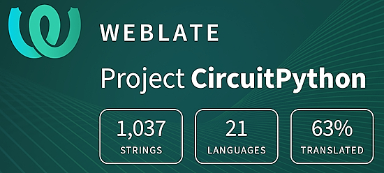](https://hosted.weblate.org/engage/circuitpython/)

One important feature of CircuitPython is translated control and error messages. With the help of fellow open source project [Weblate](https://weblate.org/), we're making it even easier to add or improve translations. 

Sign in with an existing account such as GitHub, Google or Facebook and start contributing through a simple web interface. No forks or pull requests needed! As always, if you run into trouble join us on [Discord](https://adafru.it/discord), we're here to help.

## NUMBER Thanks

The Adafruit Discord community, where we do all our CircuitPython development in the open, reached over NUMBER humans - thank you! Adafruit believes Discord offers a unique way for Python on hardware folks to connect. Join today at [https://adafru.it/discord](https://adafru.it/discord).

## ICYMI - In case you missed it

Python on hardware is the Adafruit Python video-newsletter-podcast! The news comes from the Python community, Discord, Adafruit communities and more and is broadcast on ASK an ENGINEER Wednesdays. The complete Python on Hardware weekly videocast [playlist is here](https://www.youtube.com/playlist?list=PLjF7R1fz_OOXRMjM7Sm0J2Xt6H81TdDev). The video podcast is on [iTunes](https://itunes.apple.com/us/podcast/python-on-hardware/id1451685192?mt=2), [YouTube](http://adafru.it/pohepisodes), [Instagram](https://www.instagram.com/adafruit/channel/)), and [XML](https://itunes.apple.com/us/podcast/python-on-hardware/id1451685192?mt=2).

[The weekly community chat on Adafruit Discord server CircuitPython channel - Audio / Podcast edition](https://itunes.apple.com/us/podcast/circuitpython-weekly-meeting/id1451685016) - Audio from the Discord chat space for CircuitPython, meetings are usually Mondays at 2pm ET, this is the audio version on [iTunes](https://itunes.apple.com/us/podcast/circuitpython-weekly-meeting/id1451685016), Pocket Casts, [Spotify](https://adafru.it/spotify), and [XML feed](https://adafruit-podcasts.s3.amazonaws.com/circuitpython_weekly_meeting/audio-podcast.xml).

## Contribute

The CircuitPython Weekly Newsletter is a CircuitPython community-run newsletter emailed every Monday. To contribute your content, please email your news to cpnews (at) adafruit (dot) com with information and link(s) to your content. 

Join the Adafruit [Discord](https://adafru.it/discord) or [post to the forum](https://forums.adafruit.com/viewforum.php?f=60) if you have questions.
