View this email in your browser. **Warning: Flashing Imagery**

Welcome to the latest Python on Microcontrollers newsletter! News this week skewed a bit Raspberry Pi and other single board computers (SBC) as they are being hit most from the chip shortages. They've become quite handy with AI, with [OpenClaw running on a Pi 5](https://learn.adafruit.com/openclaw-on-raspberry-pi) being a much cheaper solution compared to a mac Mini (which are becoming scarce due to demand). Raspberry Pi even reacted to make a dual RAM chip variant for the Pi 4 to use smaller RAM chips. This is not to say traditional Python on hardware is trailing, quite the opposite, with folks making more projects than ever. A MicroPython OS is gaining traction and there are so many very good projects. I'm even making an RP2350 project myself. Whether it's rejuvenating old hardware with new chips or making new cutting edge designs, there are so many advantages to using Python. - *Anne Barela, Editor*

We're on [Discord](https://discord.gg/HYqvREz), [Twitter/X](https://twitter.com/search?q=circuitpython&src=typed_query&f=live), [BlueSky](https://bsky.app/profile/circuitpython.org) and for past newsletters - [view them all here](https://www.adafruitdaily.com/category/circuitpython/). If you're reading this on the web, please [subscribe here](https://www.adafruitdaily.com/). Here's the news this week:

## MicroPython OS

MicroPython OS is a lightweight, fast, and versatile operating system designed to run on microcontrollers like the ESP32 and desktop systems. With a modern Android-like touch screen UI, App Store, and Over-The-Air updates, it’s an OS for innovators and developers. Now with a professional website - [micropythonos.com](https://micropythonos.com/) and [GitHub](https://github.com/MicroPythonOS). Via [CNX](https://www.cnx-software.com/2026/01/29/micropythonos-graphical-operating-system-delivers-android-like-user-experience-on-microcontrollers/).

## Raspberry Pi Announces Additional Price Hikes Across Its Single-Board Computers

[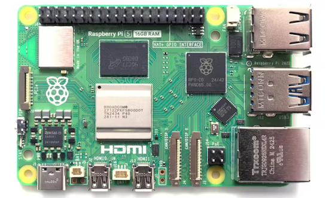](https://www.hackster.io/news/the-ai-bubble-hits-again-raspberry-pi-announces-up-to-60-price-hikes-across-its-most-popular-sbcs-5a7d883479de)

Demand from the artificial intelligence (AI) market for storage, compute, and memory has once again led Raspberry Pi to announce price hikes across its most popular single-board computer models — this time increasing its top-end parts by a whopping $60, on top of a $25 increase announced just two months ago - [hackster.io](https://www.hackster.io/news/the-ai-bubble-hits-again-raspberry-pi-announces-up-to-60-price-hikes-across-its-most-popular-sbcs-5a7d883479de).

> ""Two months ago, we announced increases to the prices of some Raspberry Pi 4 and 5 products. These were driven by an unprecedented rise in the cost of LPDDR4 memory, thanks to competition for memory fab capacity from the AI infrastructure roll-out," Raspberry Pi's Eben Upton says."

## circfirm - A CLI Tool for Updating the Firmware for CircuitPython Boards

circfirm v5 is now out, now officially supporting Python 3.14. This version updated the dependencies and added Dependabot to that end. You can easily manage and install CircuitPython firmware versions onto your development boards from command line. Open source under an MIT license - [GitHub](https://github.com/tekktrik/circfirm) and [Mastodon](https://mastodon.social/@tekktrik@techhub.social/116021203126292711).

## Raspberry Pi 4 Dual RAM Variant Launches

[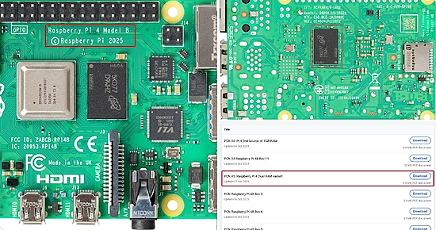](https://www.cnx-software.com/2026/02/05/raspberry-pi-4-dual-ram-variant-introduced-to-mitigate-ram-price-increases-and-supply-challenges/)

Desperate times call for desperate measures. Raspberry Pi has decided to introduce a dual RAM variant of the Raspberry Pi 4 V1.5 (one chip on front, one on back) to allow DRAM supply chain flexibility along with manufacturing process improvement using intrusive reflow soldering - [CNX](https://www.cnx-software.com/2026/02/05/raspberry-pi-4-dual-ram-variant-introduced-to-mitigate-ram-price-increases-and-supply-challenges/). Via [X](https://x.com/cnxsoft/status/2019318725812601004).

## The Ultimate Fusion 360 Controller

[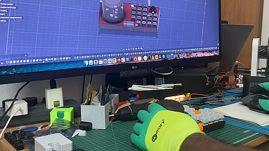](https://www.youtube.com/watch?v=AjmmTDKetks)

A DIY Macro Pad and Space Mouse using a Raspberry Pi Pico and CircuitPython. It’s a complete productivity station for Fusion 360, Blender, and coding. It features a custom 5x5 mechanical key matrix, two rotary encoders for scrolling and volume, and a custom-built 6-DOF Space Mouse (magnetometer-based) that lets you orbit, pan, and zoom in 3D space - [YouTube](https://www.youtube.com/watch?v=AjmmTDKetks) and [GitHub](https://github.com/jeevan8232/macrokeyboard).

## Using MicroPython with Pycharm as an Alternate to Thonny

[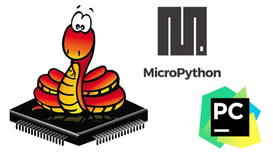](https://kevin-williams.net/blog/micropython-and-pycharm/)

Kevin Williams ditches Thonny and shows how to use PyCharm and the [MicroPython Tools](https://plugins.jetbrains.com/plugin/26227-micropython-tools) plugin to work with MicroPython - [Kevin Williams](https://kevin-williams.net/blog/micropython-and-pycharm/).

## The RP2350 Hacking Challenge 2: They Really Want a Winner

[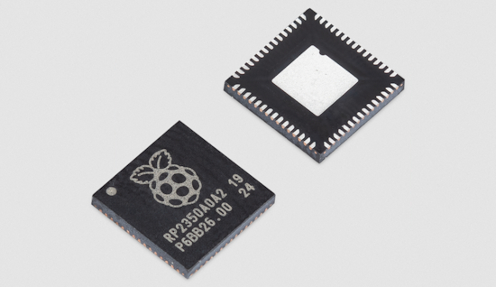](https://www.raspberrypi.com/news/rp2350-hacking-challenge-2-less-randomisation-more-correlation/)

There still isn't a winner in the [contest to hack the RP2350 Secure Boot](https://www.raspberrypi.com/news/rp2350-a4-rp2354-and-a-new-hacking-challenge/). To break the stalemate, Raspberry Pi has loosened the rules to allow turning off randomisation of memory accesses, in hopes of a winner - [Raspberry Pi News](https://www.raspberrypi.com/news/rp2350-hacking-challenge-2-less-randomisation-more-correlation/).

## This Week's Python Streams

Python on Hardware is all about building a cooperative ecosphere which allows contributions to be valued and to grow knowledge. Below are the streams within the last week focusing on the community.

**CircuitPython Deep Dive Stream**

[Last Friday](https://youtube.com/live/iqcNcdsrOgA), Scott streamed work on LLM Agents + CircuitPython.

You can see the latest video and past videos on the Adafruit YouTube channel under the Deep Dive playlist - [YouTube](https://www.youtube.com/playlist?list=PLjF7R1fz_OOXBHlu9msoXq2jQN4JpCk8A).

**CircuitPython Parsec**

John Park’s CircuitPython Parsec this week is on NeoPixel Starburst on Trellis - [Adafruit Blog](https://blog.adafruit.com/2026/02/06/john-parks-circuitpython-parsec-neopixel-starburst-on-trellis/) and [YouTube](https://www.youtube.com/watch?v=rfSV7Vy3rY8).

Catch all the episodes in the [YouTube playlist](https://www.youtube.com/playlist?list=PLjF7R1fz_OOWFqZfqW9jlvQSIUmwn9lWr).

In the kickoff episode of season 7, Paul welcomes John Ellis to the show. John shares his MacroPad projects, the TallyCircuitPy project, and more - [The CircuitPython Show](https://www.circuitpythonshow.com/@circuitpythonshow).

**CircuitPython Weekly Meeting**

CircuitPython Weekly Meeting for February 2nd, 2026 ([notes](https://github.com/adafruit/adafruit-circuitpython-weekly-meeting/blob/main/2026/2026-02-02.md)) [on YouTube](https://youtu.be/3b7ZhhTR6NY).

## Project of the Week: Reviving a Classic Vector Display

[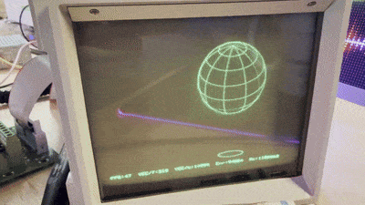](https://x.com/davepl1968/status/2019478447798775952)

Dave W Plummer bought one of the Vector displays from the movie WAR GAMES, and brought it back to life and got it drawing again using  ESP32, C++, and Python - [X](https://x.com/davepl1968/status/2019478447798775952), [YouTube](youtube.com/watch?v=JrwvIKK3D2o&feature=youtu.be) and [GitHub](https://github.com/davepl/vector).

## Popular Last Week

[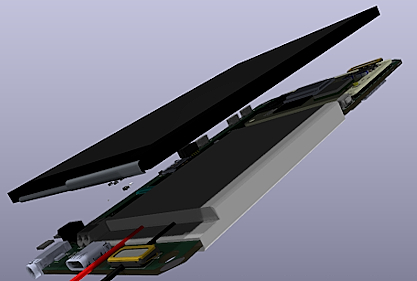](https://github.com/V3lectronics/SPIRIT/wiki)

What was the most popular, most clicked link, in [last week's newsletter](https://www.adafruitdaily.com/2026/02/02/python-on-microcontrollers-newsletter-raspberry-pi-in-consumer-products-software-updates-and-much-more-circuitpython-python-micropython-thepsf-raspberry_pi/)? [An Open Source Smartphone Uses a Raspberry Pi Compute Module 5](https://github.com/V3lectronics/SPIRIT/wiki).

Did you know you can read past issues of this newsletter in the Adafruit Daily Archive? [Check it out](https://www.adafruitdaily.com/category/circuitpython/).

## New Notes from Adafruit Playground

[Adafruit Playground](https://adafruit-playground.com/) is a new place for the community to post their projects and other making tips/tricks/techniques. Ad-free, it's an easy way to publish your work in a safe space for free.

Screensaver Bundle for Fruit Jam OS - [Adafruit Playground](https://adafruit-playground.com/u/DanCogliano/pages/screensaver-bundle-for-fruit-jam-os).

## News From Around the Web

[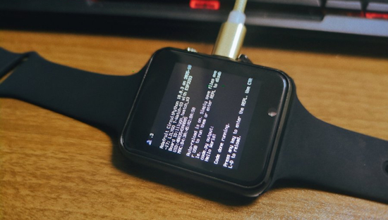](https://gist.github.com/sugarflower/2cf766b95485c9290da944ff06b4c65e)

Sugarflower is porting CircuitPython to the LILYGO T-Watch-S3 - [GitHub](https://gist.github.com/sugarflower/2cf766b95485c9290da944ff06b4c65e).

CharlieBoard is an open-source LED display system for the Boston MBTA that runs on Raspberry Pi Zero 2W with WS2812B LEDs. It features real-time transit data visualization, a web control interface, and geographically accurate station mapping. PCBs for the Blue, Orange, and Green Lines are in progress - [hackster.io](https://www.hackster.io/news/using-a-custom-pcb-as-a-live-transit-display-83bf1440e22f) and [GitHub](https://github.com/tomunderwood99/CharlieBoard).

[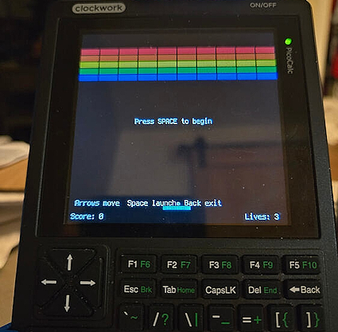](https://forum.clockworkpi.com/t/circuitpython-code-portability/21085)

Neusse on the Clockwork Pi forum ported your editor's [CircuitPython Breakout](https://learn.adafruit.com/breakout-game-on-metro-rp2350-and-fruit-jam/overview) game, using OpenAI Codex, to the Clockwork calculator. Given the original Metro RP2350 version was written in three successive AI steps, this is a four step conversion. They ported Zork and Minesweeper using the same method - [clockworkpi.com](https://forum.clockworkpi.com/t/circuitpython-code-portability/21085).

Get Started With PicoCalc CircuitPython - [YouTube](https://www.youtube.com/watch?v=fkOSQjKK7zk).

[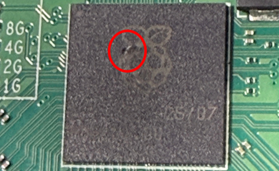](https://www.theregister.com/2026/02/04/microsoft_manager_pi_smoke/)

Steve Syfuhs, a Principal Engineering Manager Microsoft, managed to release the magic smoke from a Raspberry Pi 5 instantly by inserting a Pi HAT upside down with the power on - [The Register](https://www.theregister.com/2026/02/04/microsoft_manager_pi_smoke/) and [BlueSky](https://bsky.app/profile/syfuhs.net/post/3mdy7yxgbak27).

[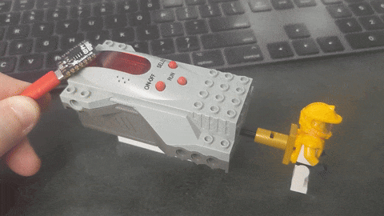](https://www.youtube.com/watch?v=fhiI_LGCMwM)

A Lego Visual Light Link (VLL) is demonstrated using an Adafruit QT Py M0 and CircuitPython - [YouTube](https://www.youtube.com/watch?v=fhiI_LGCMwM).

SentientTesla on X asked Grok: "Think Hard and Do deep research. I want to build a 15 keys keyboard exclusively for Python programmers. Every key is a prompt to Claude. Design me a keyboard and provide detailed instructions along with what prompt you would put for each of the 15 keys." Grok recommended CircuitPython and prompts for each of the 15 keys - [X](https://x.com/SentientMY/status/2017597236486475910).

[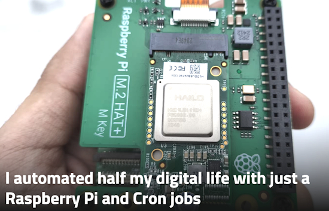](https://www.xda-developers.com/automated-half-digital-life-raspberry-pi-cron-jobs/)

I automated half my digital life with just a Raspberry Pi and Cron jobs - [XDA](https://www.xda-developers.com/automated-half-digital-life-raspberry-pi-cron-jobs/).

> "Cron jobs on a Raspberry Pi keep automation grounded, because they only do what you can explain clearly and repeat reliably."

[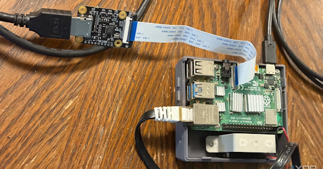](https://www.xda-developers.com/why-still-using-raspberry-pi-4-2026/)

Why I’m sticking with the Raspberry Pi 4 instead of the Pi 5 - [XDA](https://www.xda-developers.com/why-still-using-raspberry-pi-4-2026/).

[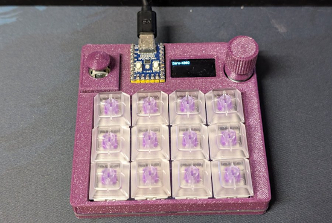](https://x.com/JoseTomasTocino/status/2019175620056408357)

José Tomás Tocino decided to install CircuitPython on a Zero KB02 - "it's fantastic. I couldn't get the hang of Go, but Python is a whole different ballgame" - [X](https://x.com/JoseTomasTocino/status/2019175620056408357).

[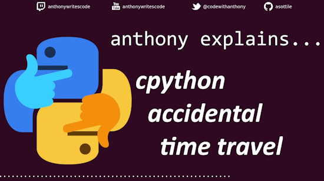](https://www.youtube.com/watch?v=KyIUJFYmN-8)

CPython release 3.15 alpha 4 went backwards, and how it was caught - [YouTube](https://www.youtube.com/watch?v=KyIUJFYmN-8).

[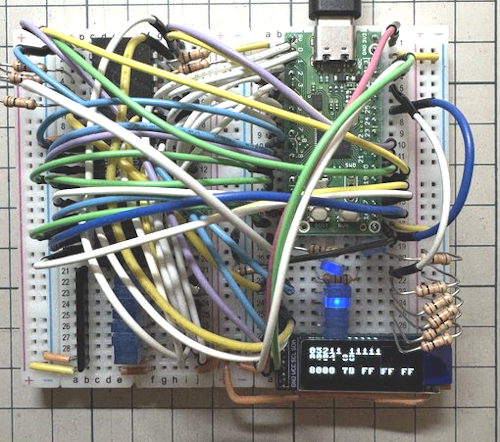](https://x.com/DragonBallEZ/status/2019380528273846590)

Using RP2xxx microcontrollers to emulate Z80 peripherals - [X](https://x.com/DragonBallEZ/status/2019380528273846590).

[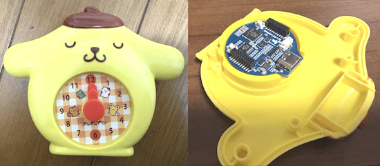](https://x.com/tawasee/status/2017856238152019992)

Tawasee on X converted a toy clock from McDonalds into an LCD clock with an RP2040-LCD-1.28 board and MicroPython - [X](https://x.com/tawasee/status/2017856238152019992).

A tech stack for vibe coding modern applications - [KDnuggets](https://www.kdnuggets.com/tech-stack-for-vibe-coding-modern-applications).

[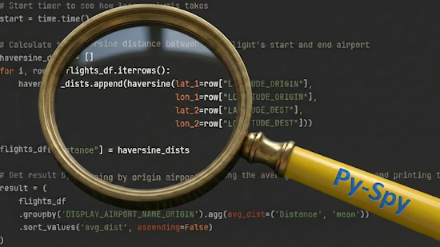](https://towardsdatascience.com/why-is-my-code-so-slow-a-guide-to-py-spy-python-profiling/)

Why is my code so slow? A guide to Py-Spy Python profiling - [Towards Data Science](https://towardsdatascience.com/why-is-my-code-so-slow-a-guide-to-py-spy-python-profiling/).

[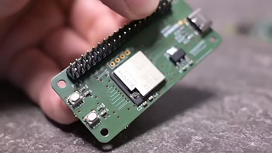](https://www.hackster.io/news/give-any-computer-raspberry-pi-style-gpio-pins-1e12f919feb4)

Give any computer Raspberry Pi-style GPIO pins with the GimmeGPIO project - [hackster.io](https://www.hackster.io/news/give-any-computer-raspberry-pi-style-gpio-pins-1e12f919feb4).

[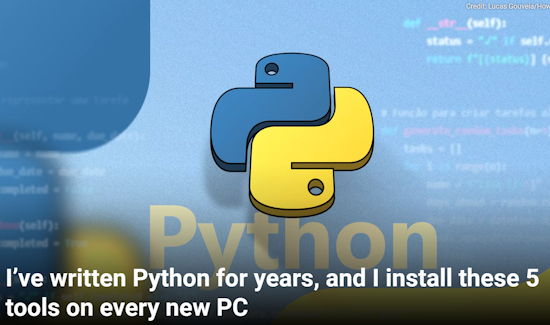](https://www.howtogeek.com/5-small-python-tools-i-install-on-every-machine/)

I’ve written Python for years, and I install these 5 tools on every new PC - [How-To Geek](https://www.howtogeek.com/5-small-python-tools-i-install-on-every-machine/).

GitHub now lets you pick your agent: use Claude and Codex on Agent HQ  - [GitHub Blog](https://github.blog/news-insights/company-news/pick-your-agent-use-claude-and-codex-on-agent-hq/).

[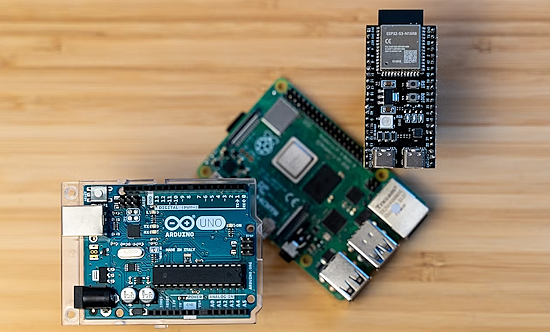](https://www.howtogeek.com/raspberry-pi-alternatives-better-for-simple-projects-and-cheaper/)

Don't buy a Raspberry Pi — these alternatives are cheaper and better - [How-To Geek](https://www.howtogeek.com/raspberry-pi-alternatives-better-for-simple-projects-and-cheaper/).

[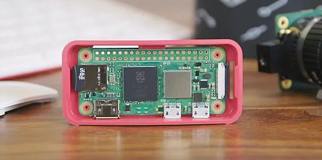](https://www.bgr.com/2084396/uses-for-your-old-raspberry-pi-travel-companion/)

Five clever ways to use your old Raspberry Pi as a travel companion - [BGR](https://www.bgr.com/2084396/uses-for-your-old-raspberry-pi-travel-companion/).

## New

[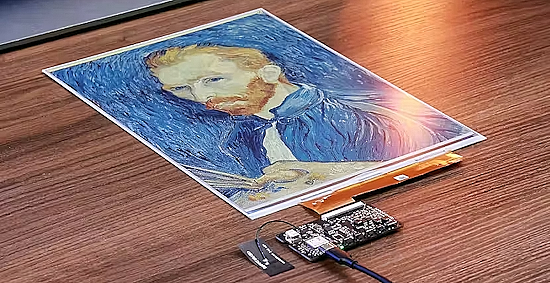](https://www.hackster.io/news/seeed-packs-its-13-3-color-epaper-display-an-espressif-esp32-and-battery-into-the-reterminal-e1004-dcc5ed526bfb)

Seeed packs its 13.3" color ePaper display, an Espressif ESP32 and battery into the reTerminal E1004 - [hackster.io](https://www.hackster.io/news/seeed-packs-its-13-3-color-epaper-display-an-espressif-esp32-and-battery-into-the-reterminal-e1004-dcc5ed526bfb).

[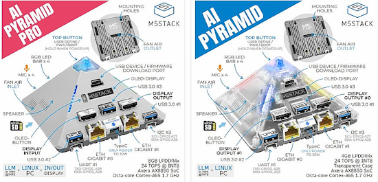](https://x.com/M5Stack/status/2019362357072593038)

M5Stack announced two single board systems with octa-core A55 processors, the AI Pyramid and Pyramid Pro - [X](https://x.com/M5Stack/status/2019689205119742069), [CNX](https://www.cnx-software.com/2026/02/06/199-m5stack-ai-pyramid-computing-box-linux-ai-mini-pc-is-based-on-axera-ax8850-soc/) and [M5Stack](https://docs.m5stack.com/en/stackflow/ai_pyramid/getting_started).

## New Boards Supported by CircuitPython

The number of supported microcontrollers and Single Board Computers (SBC) grows every week. This section outlines which boards have been included in CircuitPython or added to [CircuitPython.org](https://circuitpython.org/).

This week there were two new boards added:

- [CoreS3 SE ESP32S3 IoT by M5Stack](https://circuitpython.org/board/m5stack_cores3_se/)
- [Pimoroni Explorer (RP2350) by Pimoroni](https://circuitpython.org/board/pimoroni_explorer2350/)

*Note: For non-Adafruit boards, please use the support forums of the board manufacturer for assistance, as Adafruit does not have the hardware to assist in troubleshooting.*

Looking to add a new board to CircuitPython? It's highly encouraged! Adafruit has four guides to help you do so:

- [How to Add a New Board to CircuitPython](https://learn.adafruit.com/how-to-add-a-new-board-to-circuitpython/overview)
- [How to add a New Board to the circuitpython.org website](https://learn.adafruit.com/how-to-add-a-new-board-to-the-circuitpython-org-website)
- [Adding a Single Board Computer to PlatformDetect for Blinka](https://learn.adafruit.com/adding-a-single-board-computer-to-platformdetect-for-blinka)
- [Adding a Single Board Computer to Blinka](https://learn.adafruit.com/adding-a-single-board-computer-to-blinka)

## New Learn Guides

[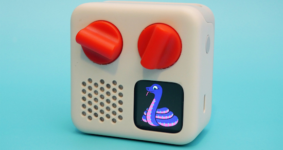](https://learn.adafruit.com/guides/latest)

The Adafruit Learning System has over 3,200 free guides for learning skills and building projects including using Python.

[Hacking Yoto Music Players](https://learn.adafruit.com/hacking-the-yoto-music-players/overview) from Liz Clark and Scott Shawcroft

## CircuitPython Libraries

The CircuitPython library numbers are continually increasing, while existing ones continue to be updated. Here we provide library numbers and updates!

To get the latest Adafruit libraries, download the [Adafruit CircuitPython Library Bundle](https://circuitpython.org/libraries). To get the latest community contributed libraries, download the [CircuitPython Community Bundle](https://circuitpython.org/libraries).

If you'd like to contribute to the CircuitPython project on the Python side of things, the libraries are a great place to start. Check out the [CircuitPython.org Contributing page](https://circuitpython.org/contributing). If you're interested in reviewing, check out Open Pull Requests. If you'd like to contribute code or documentation, check out Open Issues. We have a guide on [contributing to CircuitPython with Git and GitHub](https://learn.adafruit.com/contribute-to-circuitpython-with-git-and-github), and you can find us in the #help-with-circuitpython and #circuitpython-dev channels on the [Adafruit Discord](https://adafru.it/discord).

You can check out this [list of all the Adafruit CircuitPython libraries and drivers available](https://github.com/adafruit/Adafruit_CircuitPython_Bundle/blob/master/circuitpython_library_list.md). 

The current number of CircuitPython libraries is **553**!

**New Libraries**

Here are this week's new CircuitPython libraries:

  * [adafruit/Adafruit_CircuitPython_YotoPlayer](https://github.com/adafruit/Adafruit_CircuitPython_YotoPlayer)

**Updated Libraries**

Here are this week's updated CircuitPython libraries:

  * [buildwithpiper/PiperBlocklyLibrary](https://github.com/buildwithpiper/PiperBlocklyLibrary)

## What’s the CircuitPython team up to this week?

What is the team up to this week? Let’s check in:

**Dan**

I made a draft pull request for the AirLift WiFi implementation. I had only turned on a few boards initially, but now it's turned on for all non-CYW43 RP2xxx boards, and all boards with an on-board AirLift co-processor. There is some problem with HTTP fetching on RP2xxx that needs to be debugged.

**Tim**

I wrapped up the OpenClaw on Raspberry Pi 5 guide this week, [it's published now](https://learn.adafruit.com/openclaw-on-raspberry-pi). I also reviewed some PRs for Circup and tested some new enhancements to the bundle handling. Now I am working on updating the Bluefruit Connect V2 Android app to target the latest version of Android SDK, so that it can be re-published for downloading from the Play Store.

**Scott**

This week I'm continuing on my Zephyr work. I've had Codex and Claude implement BLE scanning and advertising and test it in the `native_sim`. It seems to work there but doesn't on a real device. So, I'm mainly debugging why that is.

The basic `native_sim` tests will be merged in any minute now. Once they are, I've got other, simpler functionality to PR including digitalio input testing and `rotaryio` and tracing memory use during `native_sim`.

**Liz**

[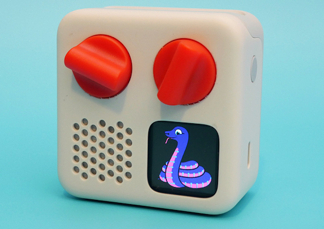](https://learn.adafruit.com/hacking-the-yoto-music-players)

This week I've been documenting the work that Scott and I did with the [Yoto Music Players](https://learn.adafruit.com/hacking-the-yoto-music-players). The guide goes through how to open up the hardware, how to load CircuitPython onto the player, the processes that Scott and I did to reverse engineer them and some CircuitPython examples. I wrote a [PortalBase compatible helper library](https://github.com/adafruit/Adafruit_CircuitPython_YotoPlayer) for the players to make interfacing with all of the peripherals easy. This has been a really fun project.

## Upcoming Events

The next MicroPython Meetup in Melbourne will be on February 25th – [Luma](https://luma.com/r0rq9pl4). You can see recordings of previous meetings on [YouTube](https://www.youtube.com/@MicroPythonOfficial). 

PyCascades 2026 will be 20 March 2026 – 21 March 2026 in Vancouver, British Columbia, Canada - [PyCascades 2026](https://2026.pycascades.com/).

**Other Events This Year**
* PyCon DE & PyData 2026 will be 13 April 2026 – 17 April 2026 in Darmstadt, Germany
* The Open Source Hardware Association Open Hardware Summit is coming to Berlin, Germany on May 23rd and 24th, 2026.
* PyCon AU 2026 will be 26 Aug. 2026 – 30 Aug. 2026 in Brisbane, Australia

**Send Your Events In**

If you know of virtual events or upcoming events, please let us know via email to cpnews(at)adafruit(dot)com.

## Latest Releases

CircuitPython's stable release is [10.0.3](https://github.com/adafruit/circuitpython/releases/latest) and its unstable release is [10.1.0-beta.1](https://github.com/adafruit/circuitpython/releases). New to CircuitPython? Start with our [Welcome to CircuitPython Guide](https://learn.adafruit.com/welcome-to-circuitpython).

[20260204](https://github.com/adafruit/Adafruit_CircuitPython_Bundle/releases/latest) is the latest Adafruit CircuitPython library bundle.

[20260131](https://github.com/adafruit/CircuitPython_Community_Bundle/releases/latest) is the latest CircuitPython Community library bundle.

[v1.27.0](https://micropython.org/download) is the latest MicroPython release. Documentation for it is [here](http://docs.micropython.org/en/latest/pyboard/).

[3.14.3](https://www.python.org/downloads/) is the latest Python release. The latest pre-release version is [3.15.0a5](https://www.python.org/download/pre-releases/).

[4,469 Stars](https://github.com/adafruit/circuitpython/stargazers) Like CircuitPython? [Star it on GitHub!](https://github.com/adafruit/circuitpython)

## Call for Help -- Translating CircuitPython is now easier than ever

[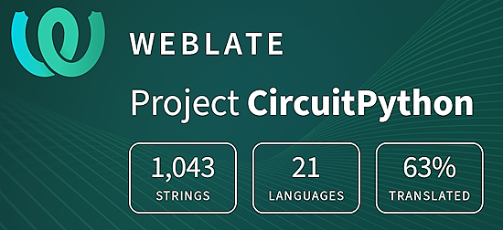](https://hosted.weblate.org/engage/circuitpython/)

One important feature of CircuitPython is translated control and error messages. With the help of fellow open source project [Weblate](https://weblate.org/), we're making it even easier to add or improve translations. 

Sign in with an existing account such as GitHub, Google or Facebook and start contributing through a simple web interface. No forks or pull requests needed! As always, if you run into trouble join us on [Discord](https://adafru.it/discord), we're here to help.

## 39,137 Thanks

The Adafruit Discord community, where we do all our CircuitPython development in the open, reached over 39,137 humans - thank you! Adafruit believes Discord offers a unique way for Python on hardware folks to connect. Join today at [https://adafru.it/discord](https://adafru.it/discord).

## ICYMI - In case you missed it

Python on hardware is the Adafruit Python video-newsletter-podcast! The news comes from the Python community, Discord, Adafruit communities and more and is broadcast on ASK an ENGINEER Wednesdays. The complete Python on Hardware weekly videocast [playlist is here](https://www.youtube.com/playlist?list=PLjF7R1fz_OOXRMjM7Sm0J2Xt6H81TdDev). The video podcast is on [iTunes](https://itunes.apple.com/us/podcast/python-on-hardware/id1451685192?mt=2), [YouTube](http://adafru.it/pohepisodes), [Instagram](https://www.instagram.com/adafruit/channel/)), and [XML](https://itunes.apple.com/us/podcast/python-on-hardware/id1451685192?mt=2).

[The weekly community chat on Adafruit Discord server CircuitPython channel - Audio / Podcast edition](https://itunes.apple.com/us/podcast/circuitpython-weekly-meeting/id1451685016) - Audio from the Discord chat space for CircuitPython, meetings are usually Mondays at 2pm ET, this is the audio version on [iTunes](https://itunes.apple.com/us/podcast/circuitpython-weekly-meeting/id1451685016), Pocket Casts, [Spotify](https://adafru.it/spotify), and [XML feed](https://adafruit-podcasts.s3.amazonaws.com/circuitpython_weekly_meeting/audio-podcast.xml).

## Contribute

The CircuitPython Weekly Newsletter is a CircuitPython community-run newsletter emailed every Monday. To contribute your content, please email your news to cpnews (at) adafruit (dot) com with information and link(s) to your content. 

Join the Adafruit [Discord](https://adafru.it/discord) or [post to the forum](https://forums.adafruit.com/viewforum.php?f=60) if you have questions.
