- [ ] Library and info updates
- [ ] change date
- [ ] update title
- [ ] Feature story
- [ ] Update  for images
- [ ] Update ICYDNCI
- [ ] All images 550w max only
- [ ] Link "View this email in your browser."

News Sources

- [Adafruit Playground](https://adafruit-playground.com/)
- Twitter: [CircuitPython](https://twitter.com/search?q=circuitpython&src=typed_query&f=live), [MicroPython](https://twitter.com/search?q=micropython&src=typed_query&f=live) and [Python](https://twitter.com/search?q=python&src=typed_query)
- [Raspberry Pi News](https://www.raspberrypi.com/news/), [Pi Foundation](https://www.raspberrypi.org/blog/)
- Mastodon [CircuitPython](https://mastodon.social/tags/CircuitPython) and [MicroPython](https://mastodon.social/tags/MicroPython)
- BlueSky [CircuitPython](https://bsky.app/search?q=circuitpython), [MicroPython](https://bsky.app/search?q=micropython), [Raspberry Pi](https://bsky.app/search?q=raspberry+pi)
- [Google News Python](https://news.google.com/topics/CAAqIQgKIhtDQkFTRGdvSUwyMHZNRFY2TVY4U0FtVnVLQUFQAQ?hl=en-US&gl=US&ceid=US%3Aen)
- YouTube: [CircuitPython](https://www.youtube.com/results?search_query=circuitpython&sp=CAI%253D), [MicroPython](https://www.youtube.com/results?search_query=micropython&sp=CAI%253D), [Prof Gallaugher](https://www.youtube.com/@BuildWithProfG/videos)
- [maker.io Python](https://www.digikey.com/en/maker/search-results?s=createdDate&t=python)
- [hackster.io CircuitPython](https://www.hackster.io/search?q=circuitpython&i=projects&sort_by=most_recent) and [MicroPython](https://www.hackster.io/search?q=micropython&i=projects&sort_by=most_recent)
- Instructables: [CircuitPython](https://www.instructables.com/search/?q=circuitpython&projects=all&sort=Newest), [MicroPython](https://www.instructables.com/search/?q=micropython&projects=all&sort=Newest), [Raspberry Pi Python](https://www.instructables.com/search/?q=raspberry+pi+python&projects=all&sort=Newest)
- [hackaday CircuitPython](https://hackaday.com/blog/?s=circuitpython) and [MicroPython](https://hackaday.com/blog/?s=micropython)
- [python.org](https://www.python.org/)
- [Python Insider - dev team blog](https://pythoninsider.blogspot.com/)
- Individuals: [bret.dk](https://bret.dk/), [Jeff Geerling](https://www.jeffgeerling.com/blog), [Yakroo](https://x.com/Yakroo5077)
- Tom's Hardware: [CircuitPython](https://www.tomshardware.com/search?searchTerm=circuitpython&articleType=all&sortBy=publishedDate) and [MicroPython](https://www.tomshardware.com/search?searchTerm=micropython&articleType=all&sortBy=publishedDate) and [Raspberry Pi](https://www.tomshardware.com/search?searchTerm=raspberry%20pi&articleType=all&sortBy=publishedDate)
- [hackaday.io newest projects MicroPython](https://hackaday.io/projects?tag=micropython&sort=date) and [CircuitPython](https://hackaday.io/projects?tag=circuitpython&sort=date)
- hackaday.io - [CircuitPython](https://hackaday.io/search?term=circuitpython) and [MicroPython](https://hackaday.io/search?term=micropython)
- [MicroPython Meeting](https://luma.com/micropython?k=c)

View this email in your browser. **Warning: Flashing Imagery**

Welcome to the latest Python on Microcontrollers newsletter! *insert 2-3 sentences from editor (what's in overview, banter)* - *Anne Barela, Editor*

We're on [Discord](https://discord.gg/HYqvREz), [Twitter/X](https://twitter.com/search?q=circuitpython&src=typed_query&f=live), [BlueSky](https://bsky.app/profile/circuitpython.org) and for past newsletters - [view them all here](https://www.adafruitdaily.com/category/circuitpython/). If you're reading this on the web, please [subscribe here](https://www.adafruitdaily.com/). Here's the news this week:

## CircuitPython 10.1.0 Release Candidate 1 Released

The latest release since November" CircuitPython 10.1.0-rc.1 is a release candidate for 10.1.0 final. This release is believed to be stable, and is meant for testing before the final release of 10.1.0 - [Adafruit Blog](https://blog.adafruit.com/2026/02/11/circuitpython-10-1-0-rc-1-released/) and release notes - [GitHub](https://github.com/adafruit/circuitpython/releases/tag/10.1.0-rc.1).

**Notable changes in 10.1.0 from 10.0.x**

* Add `mipidsi` module to support MIPI DSI displays. Currently enabled for ESP32-P4.
* Fix problems with presenting user-mounted SD cards over USB.
* Update Espressif ESP-IDF to v5.5.1 and support ESP32-C61.
* Fix long-standing Thonny disconnect issues.
* Add `hashlib.new("sha256")`.
* Add `bitmaptools.replace_color()`.

## Feature

text - [site](url).

## Python with UV is ULTRA Fast

[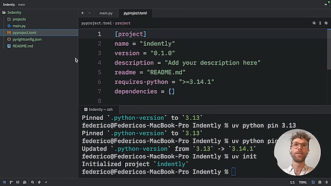](https://www.youtube.com/watch?v=5nw_H7oqrIk)

Previously we've posted about [uv](https://github.com/astral-sh/uv), a drop-in replacement for common `pip`, `pip-tools`, and `virtualenv` commands. This video shows how using uv in your desktop Python workflow can speed things up and handle slippery tasks like setting which version of Python you want to use on the fly - [YouTube](https://www.youtube.com/watch?v=5nw_H7oqrIk).

## Python is Slipping in Popularity

The world’s most popular programming language is losing market share to more specialized languages such as R and Perl, [Tiobe says in their latest poll](https://www.tiobe.com/tiobe-index/). Python still holds the top ranking of programming language popularity, leading by more than 10 percentage points over second-place C. But Python’s lead actually has declined over the past six months, from a high market share of 26.98% last July to 21.81% - [InfoWorld](https://www.infoworld.com/article/4129615/python-is-slipping-in-popularity-tiobe.html).

## MyMiniFactory Has Acquired Thingiverse

When looking for 3D models for projects, professional and prototype, often makers have gone to Thingiverse. Originally a site by MakerBot Industries in 2013, Makerbot and Thingiverse were acquired by Stratasys and the community has been under shadow. It is hoped that under MyMiniFactory ownership things may florish. MyMiniFactory has adopted a zero-tolerance stance on AI generated content on their platforms - [MyMiniFactory](https://www.myminifactory.com/blog/myminifactory-has-acquired-thingiverse).

## Linus Torvalds Confirms The Next Kernel Is Linux 7.0, Out Mid-April

Following Linus Torvalds [releasing Linux 6.19 stable](https://www.phoronix.com/news/Linux-6.19-Released), Linus Torvalds is now out with his customary release announcement. Notably he officially confirmed that the next kernel version is Linux 7.0 as the successor to Linux 6.19 - [Phoronix](https://www.phoronix.com/news/Linux-7.0-Is-Next).

>"I have more than three dozen pull requests for when the merge window opens tomorrow - thank you to all the early maintainers. And as people have mostly figured out, I'm getting to the point where I'm being confused by large numbers (almost running out of fingers and toes again), so the next kernel is going to be called 7.0."

## This Week's Python Streams

Python on Hardware is all about building a cooperative ecosphere which allows contributions to be valued and to grow knowledge. Below are the streams within the last week focusing on the community.

**CircuitPython Deep Dive Stream**

[Last Friday](link), Scott streamed work on {subject}.

You can see the latest video and past videos on the Adafruit YouTube channel under the Deep Dive playlist - [YouTube](https://www.youtube.com/playlist?list=PLjF7R1fz_OOXBHlu9msoXq2jQN4JpCk8A).

**CircuitPython Parsec**

John Park’s CircuitPython Parsec this week is on {subject} - [Adafruit Blog](link) and [YouTube](link).

Catch all the episodes in the [YouTube playlist](https://www.youtube.com/playlist?list=PLjF7R1fz_OOWFqZfqW9jlvQSIUmwn9lWr).

**CircuitPython Weekly Meeting**

CircuitPython Weekly Meeting for February 9, 2026 ([notes](https://github.com/adafruit/adafruit-circuitpython-weekly-meeting/blob/main/2026/2026-02-09.md)) [on YouTube](https://youtu.be/ERnoE0ISLTc).

## Project of the Week: 8 Track MIDI Sequencer on Adafruit PyGamer

[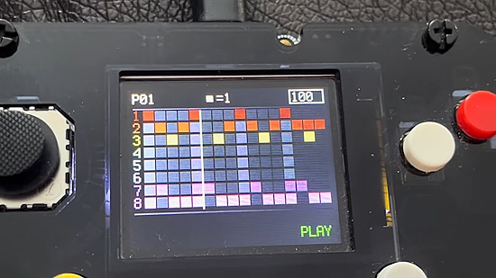](https://blog.adafruit.com/2026/02/09/8-track-midi-sequencer-on-adafruit-pygamer/)

Paul Cunningham develops an 8 track MIDI sequencer on an Adafruit PyGamer in CircuitPython - [Adafruit Blog](https://blog.adafruit.com/2026/02/09/8-track-midi-sequencer-on-adafruit-pygamer/) and [YouTube](https://www.youtube.com/watch?v=Gee9U38JJTE).

> "Excited to be working on this project while snowed in for the past few weeks. It’s all using CircuitPython and has been a lot of fun to
build. Looking forward to the new PyGamer Advanced as a project like mine really pushes the limitations of the SAM51 and an interpreted language. Thanks for such an excellent platform!"

## Popular Last Week: MicroPython OS

What was the most popular, most clicked link, in [last week's newsletter](https://www.adafruitdaily.com/2026/02/09/python-on-microcontrollers-newsletter-micropython-os-more-price-hikes-hack-that-pi-and-more-circuitpython-python-micropython-thepsf-raspberry_pi/)? [MicroPython OS](https://micropythonos.com/).

Did you know you can read past issues of this newsletter in the Adafruit Daily Archive? [Check it out](https://www.adafruitdaily.com/category/circuitpython/).

## New Notes from Adafruit Playground

[Adafruit Playground](https://adafruit-playground.com/) is a new place for the community to post their projects and other making tips/tricks/techniques. Ad-free, it's an easy way to publish your work in a safe space for free.

[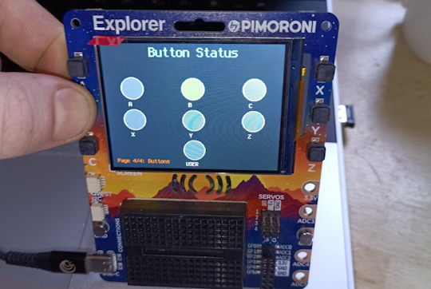](https://adafruit-playground.com/u/tyeth/pages/circuitpython-on-the-pimoroni-explorer)

CircuitPython on the PiMoRoNi Explorer - [Adafruit Playground](https://adafruit-playground.com/u/tyeth/pages/circuitpython-on-the-pimoroni-explorer).

No Solder eInk Calendar - [Adafruit Playground](https://adafruit-playground.com/u/scenography/pages/no-solder-eink-calendar).

## News From Around the Web

[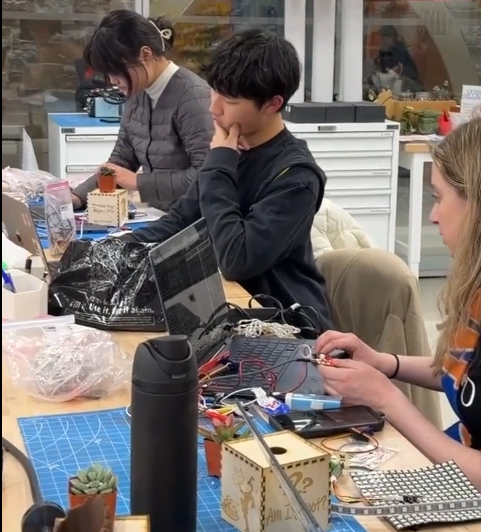](https://bsky.app/profile/gallaugher.bsky.social/post/3memtpnh5es25)

Students making a “Talking Groot”. Tap the leaves of a real plant to hear Groot cycle through various catch phrases using CircuitPython and Circuit Playground Express - [BlueSky](https://bsky.app/profile/gallaugher.bsky.social/post/3memtpnh5es25).

Microsoft warns that Python-based infostealers are increasingly targeting macOS, harvesting sensitive data and challenging assumptions about Apple's malware immunity - [technobezz](https://www.technobezz.com/news/microsoft-warns-that-python-infostealers-now-target-macos-at-scale).

[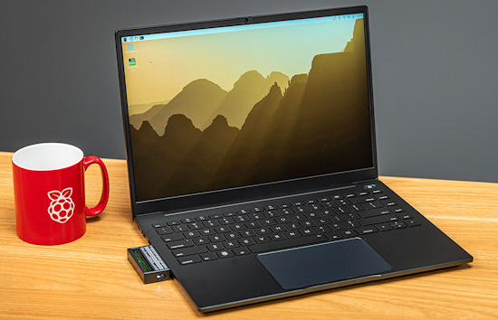](https://www.jeffgeerling.com/blog/2026/the-first-good-raspberry-pi-laptop/)

Argon40 just launched the ONE UP, a laptop that can be used with a Raspberry Pi CM5 module and NVMe flash storage. Ideal? A fully kitted out version is about $600 andn a ChromeBook, N150 mini PC or others costs less. Jeff states the pros and cons. - [Jeff Geerling](https://www.jeffgeerling.com/blog/2026/the-first-good-raspberry-pi-laptop/), [Hackaday](https://hackaday.com/2026/02/12/argon-one-up-test-tasting-a-raspberry-pi-cm5-based-laptop/) and [YouTube](https://youtu.be/Ef70x0izkFU).

Monty - a minimal, secure Python interpreter written in Rust for use by AI. MIT License - [GitHub](https://github.com/pydantic/monty).

[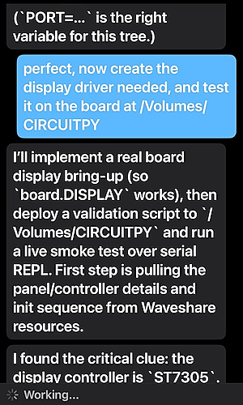](https://x.com/CosminDolha/status/2021508927096062354)

Cosmin Dolha posts "At 9:39 I received the Waveshare ESP32-S3 4.2inch RLCD Development Board from the delivery company. At 10:50 I had a working CircuitPython port made by Codex, and now it is building the display drivers, and yeah that is my iOS app that I can use to monitor and talk to my at home Codex instance (also made by Codex)" - [X](https://x.com/CosminDolha/status/2021508927096062354).

Tutorial - MicroPython: An Intro to Programming Hardware in Python - [Real Python](https://realpython.com/micropython/#setting-up-micropython-on-your-board).

[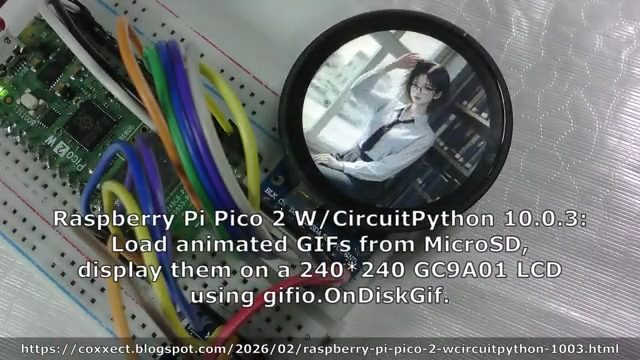](https://coxxect.blogspot.com/2026/02/raspberry-pi-pico-2-wcircuitpython-1003.html)

Load animated GIFs from MicroSD, display them on a 240*240 GC9A01 LCD using a Raspberry Pi Pico 2 with CircuitPython 10.0.3 - [coXXect](https://coxxect.blogspot.com/2026/02/raspberry-pi-pico-2-wcircuitpython-1003.html).

[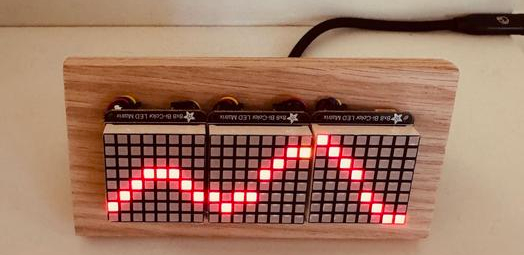](https://mastodon.social/@MigsterTech@hachyderm.io/116030084924727327)

Miguel Corteguera created a tide clock using 3 8x8 LED bi-color panels and an ESP32 FeatherWing running CircuitPython. Each hour of the day is represented horizontally with the LED representing the current hour in yellow. Just after midnight it refreshes with the new chart for the day from NOAA - [Mastodon](https://mastodon.social/@MigsterTech@hachyderm.io/116030084924727327) and [GitHub](https://github.com/migster/TideClock).

[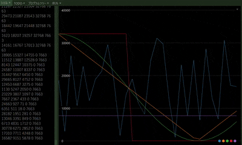](https://bsky.app/profile/comyama.bsky.social/post/3mdiixq4ufk2i)

A homemade SH-101-style Raspberry Pico 2 synth with LFO progress, generating five types of waves: square, triangle, sine, noise, and random using MicroPython - [BlueSky](https://bsky.app/profile/comyama.bsky.social/post/3mdiixq4ufk2i).

12 Python libraries you need to try in 2026 - [KDnuggets](https://www.kdnuggets.com/12-python-libraries-you-need-to-try-in-2026).

[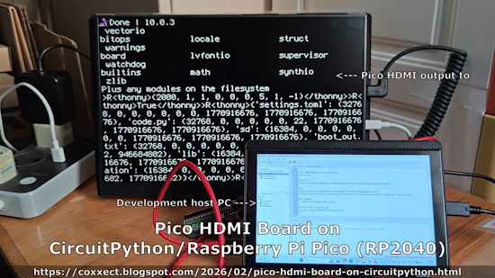](https://www.youtube.com/watch?v=bPNQ3Dz76Xc)

Using the Raspberry Pi Pico HDMI Board add on with CircuitPython - [YouTube](https://www.youtube.com/watch?v=bPNQ3Dz76Xc) and [Blog](https://coxxect.blogspot.com/2026/02/pico-hdmi-board-on-circuitpython.html).

text - [site](url).

text - [site](url).

text - [site](url).

text - [site](url).

text - [site](url).

text - [site](url).

text - [site](url).

## New

[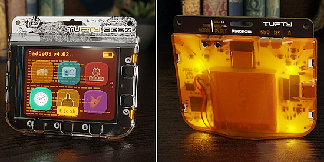](https://x.com/pimoroni/status/2020734118607143323)

Pimoroni Tufty2350 - A smart interactive badge powered by Raspberry Pi RP2350. 16MB flash, 8MB PSRAM, WiFi+BT, 1000mAh battery, and a 2.8" IPS display - [X](https://x.com/pimoroni/status/2020734118607143323) and [Pimoroni](https://shop.pimoroni.com/products/tufty-2350).

text - [site](url).

## New Boards Supported by CircuitPython

The number of supported microcontrollers and Single Board Computers (SBC) grows every week. This section outlines which boards have been included in CircuitPython or added to [CircuitPython.org](https://circuitpython.org/).

This week there were (#/no) new boards added:

- [Board name](url)
- [Board name](url)
- [Board name](url)

*Note: For non-Adafruit boards, please use the support forums of the board manufacturer for assistance, as Adafruit does not have the hardware to assist in troubleshooting.*

Looking to add a new board to CircuitPython? It's highly encouraged! Adafruit has four guides to help you do so:

- [How to Add a New Board to CircuitPython](https://learn.adafruit.com/how-to-add-a-new-board-to-circuitpython/overview)
- [How to add a New Board to the circuitpython.org website](https://learn.adafruit.com/how-to-add-a-new-board-to-the-circuitpython-org-website)
- [Adding a Single Board Computer to PlatformDetect for Blinka](https://learn.adafruit.com/adding-a-single-board-computer-to-platformdetect-for-blinka)
- [Adding a Single Board Computer to Blinka](https://learn.adafruit.com/adding-a-single-board-computer-to-blinka)

## Adafruit Learning System Guides

The [Adafruit Learning System](https://learn.adafruit.com/) has over 3,200 free guides for learning skills and building projects including using Python.

## CircuitPython Libraries

The CircuitPython library numbers are continually increasing, while existing ones continue to be updated. Here we provide library numbers and updates!

To get the latest Adafruit libraries, download the [Adafruit CircuitPython Library Bundle](https://circuitpython.org/libraries). To get the latest community contributed libraries, download the [CircuitPython Community Bundle](https://circuitpython.org/libraries).

If you'd like to contribute to the CircuitPython project on the Python side of things, the libraries are a great place to start. Check out the [CircuitPython.org Contributing page](https://circuitpython.org/contributing). If you're interested in reviewing, check out Open Pull Requests. If you'd like to contribute code or documentation, check out Open Issues. We have a guide on [contributing to CircuitPython with Git and GitHub](https://learn.adafruit.com/contribute-to-circuitpython-with-git-and-github), and you can find us in the #help-with-circuitpython and #circuitpython-dev channels on the [Adafruit Discord](https://adafru.it/discord).

You can check out this [list of all the Adafruit CircuitPython libraries and drivers available](https://github.com/adafruit/Adafruit_CircuitPython_Bundle/blob/master/circuitpython_library_list.md). 

The current number of CircuitPython libraries is **###**!

**New Libraries**

Here are this week's new CircuitPython libraries:

* [library](url)

**Updated Libraries**

Here are this week's updated CircuitPython libraries:

* [library](url)

## What’s the CircuitPython team up to this week?

What is the team up to this week? Let’s check in:

**Dan**

I released CircuitPython 10.1.0.-rc.1 last Wednesday. This release includes about fifty fixes and updates, including a long-standing problem with Thonny disconnects. If no new problems show up, this release will become 10.1.0 final.

**Tim**

I worked some mroe on the Bluefruit Connect LE Android app this week. I am moving the app into a new Android Studio project so that we can publish the new version under a new listing on the Play store. I've also been trying out `pi-coding-agent` this week and refining my environment and workflow with it. I've ported a MicroPython Tiny Wiki project to CircuitPython and extended its functionality a little. The guide for that project is in the works now.

**Scott**

This week I've continued my shift into ["agentic engineering"](https://addyosmani.com/blog/agentic-engineering/) where I spend more time reviewing, testing and validating over typing. I've got three of four big tasks going for the Zephyr port: `rotaryio`, BLE scanning and advertising, socket support in `native_sim` and display support. The first two are getting close. I'm getting CircuitPython on Zephyr going for `rotaryio` testing and will likely do the Feather too. BLE is reviewed by me and needs testing on one more new board. The last two are more experimental at the moment.

**Liz**

This week I started working on a MIDI breath controller project. It uses the BMP585, which has a ported sensor, to get pressure readings with a tube attached to the sensor. I'm mapping the pressure reading range to MIDI CC message value range (0-127). This allows me to control things like volume, modulation and sustain by breathing. This guide will likely be published next week.

## Upcoming Events

The next MicroPython Meetup in Melbourne will be on February 25th – [Luma](https://luma.com/r0rq9pl4). You can see recordings of previous meetings on [YouTube](https://www.youtube.com/@MicroPythonOfficial). 

PyCascades 2026 will be 20 March 2026 – 21 March 2026 in Vancouver, British Columbia, Canada - [PyCascades 2026](https://2026.pycascades.com/).

**Other Events This Year**
* PyCon DE & PyData 2026 will be 13 April 2026 – 17 April 2026 in Darmstadt, Germany
* The Open Source Hardware Association Open Hardware Summit is coming to Berlin, Germany on May 23rd and 24th, 2026.
* PyCon AU 2026 will be 26 Aug. 2026 – 30 Aug. 2026 in Brisbane, Australia

**Send Your Events In**

If you know of virtual events or upcoming events, please let us know via email to cpnews(at)adafruit(dot)com.

## Latest Releases

CircuitPython's stable release is [#.#.#](https://github.com/adafruit/circuitpython/releases/latest) and its unstable release is [#.#.#-##.#](https://github.com/adafruit/circuitpython/releases). New to CircuitPython? Start with our [Welcome to CircuitPython Guide](https://learn.adafruit.com/welcome-to-circuitpython).

[2026####](https://github.com/adafruit/Adafruit_CircuitPython_Bundle/releases/latest) is the latest Adafruit CircuitPython library bundle.

[2026####](https://github.com/adafruit/CircuitPython_Community_Bundle/releases/latest) is the latest CircuitPython Community library bundle.

[v#.#.#](https://micropython.org/download) is the latest MicroPython release. Documentation for it is [here](http://docs.micropython.org/en/latest/pyboard/).

[#.#.#](https://www.python.org/downloads/) is the latest Python release. The latest pre-release version is [#.#.#](https://www.python.org/download/pre-releases/).

[#,### Stars](https://github.com/adafruit/circuitpython/stargazers) Like CircuitPython? [Star it on GitHub!](https://github.com/adafruit/circuitpython)

## Call for Help -- Translating CircuitPython is now easier than ever

[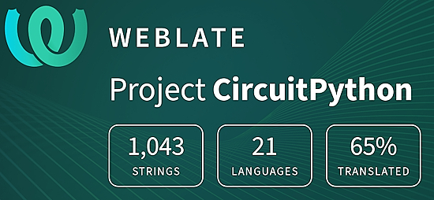](https://hosted.weblate.org/engage/circuitpython/)

One important feature of CircuitPython is translated control and error messages. With the help of fellow open source project [Weblate](https://weblate.org/), we're making it even easier to add or improve translations. 

Sign in with an existing account such as GitHub, Google or Facebook and start contributing through a simple web interface. No forks or pull requests needed! As always, if you run into trouble join us on [Discord](https://adafru.it/discord), we're here to help.

## NUMBER Thanks

The Adafruit Discord community, where we do all our CircuitPython development in the open, reached over NUMBER humans - thank you! Adafruit believes Discord offers a unique way for Python on hardware folks to connect. Join today at [https://adafru.it/discord](https://adafru.it/discord).

## ICYMI - In case you missed it

Python on hardware is the Adafruit Python video-newsletter-podcast! The news comes from the Python community, Discord, Adafruit communities and more and is broadcast on ASK an ENGINEER Wednesdays. The complete Python on Hardware weekly videocast [playlist is here](https://www.youtube.com/playlist?list=PLjF7R1fz_OOXRMjM7Sm0J2Xt6H81TdDev). The video podcast is on [iTunes](https://itunes.apple.com/us/podcast/python-on-hardware/id1451685192?mt=2), [YouTube](http://adafru.it/pohepisodes), [Instagram](https://www.instagram.com/adafruit/channel/)), and [XML](https://itunes.apple.com/us/podcast/python-on-hardware/id1451685192?mt=2).

[The weekly community chat on Adafruit Discord server CircuitPython channel - Audio / Podcast edition](https://itunes.apple.com/us/podcast/circuitpython-weekly-meeting/id1451685016) - Audio from the Discord chat space for CircuitPython, meetings are usually Mondays at 2pm ET, this is the audio version on [iTunes](https://itunes.apple.com/us/podcast/circuitpython-weekly-meeting/id1451685016), Pocket Casts, [Spotify](https://adafru.it/spotify), and [XML feed](https://adafruit-podcasts.s3.amazonaws.com/circuitpython_weekly_meeting/audio-podcast.xml).

## Contribute

The CircuitPython Weekly Newsletter is a CircuitPython community-run newsletter emailed every Monday. To contribute your content, please email your news to cpnews (at) adafruit (dot) com with information and link(s) to your content. 

Join the Adafruit [Discord](https://adafru.it/discord) or [post to the forum](https://forums.adafruit.com/viewforum.php?f=60) if you have questions.
