View this email in your browser. **Warning: Flashing Imagery**

Welcome to the latest Python on Microcontrollers newsletter! The sound of the AI whirlpool is growing as we progress through 2026. First memory prices increased, then Flash storage, then hard drives, and now efficient computers like mac Mini. With all the articles about running OpenClaw on Pi 5, there is more focus on Pi 4 and Pi 5.  If PicoClaw takes off, it could be ESP32-S3 next. Also AI code pull requests are heating up.

Beyond all that, there are some fabulous projects in this issue you shouldn't miss. A history of Teensy and where it is now, overclocking Pico 2 and much more. I hope you like this latest issue. - *Anne Barela, Editor*

We're on [Discord](https://discord.gg/HYqvREz), [Twitter/X](https://twitter.com/search?q=circuitpython&src=typed_query&f=live), [BlueSky](https://bsky.app/profile/circuitpython.org) and for past newsletters - [view them all here](https://www.adafruitdaily.com/category/circuitpython/). If you're reading this on the web, please [subscribe here](https://www.adafruitdaily.com/). Here's the news this week:

## MicroPython Now Requires AI Disclosure on Every Pull Request

MicroPython has added a [Generative AI Policy](https://github.com/micropython/micropython/wiki/ContributorGuidelines#generative-ai-policy) into their Contributor Guidelines, and [PR #18842](https://github.com/micropython/micropython/pull/18842) adds a matching declaration into the GitHub PR template. Every contributor now picks one: “I did not use Generative AI tools” or “I used them, but a human has checked the code.” They didn’t go full Zig and ban AI outright. Angus Gratton says he hopes they won’t have to - [Adafruit Blog](https://blog.adafruit.com/2026/02/19/micropython-now-requires-ai-disclosure-on-every-pull-request/).

## CircuitPython 10.1.1 Released

CircuitPython 10.1.1 is the latest minor revision of CircuitPython, and is a new stable release. CircuitPython 10.1.0 was withdrawn due to a show-stopper performance problem on Espressif -[Adafruit Blog](https://blog.adafruit.com/2026/02/17/circuitpython-10-1-1-released/) and Release Notes - [GitHub](https://github.com/adafruit/circuitpython/releases/tag/10.1.1).

**Notable changes in 10.1.1 from 10.0.x**

* Add `mipidsi` module to support MIPI DSI displays. Currently enabled for ESP32-P4.
* Fix problems with presenting user-mounted SD cards over USB.
* Update `espressif` ESP-IDF to v5.5.1 and support ESP32-C61.
* Fix long-standing Thonny disconnect issues.
* Add `hashlib.new("sha256")`.
* Add `bitmaptools.replace_color()`.

## Overclocking a Raspberry Pi Pico 2

[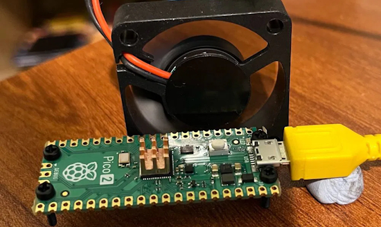](https://learn.pimoroni.com/article/overclocking-the-pico-2)

Using a MicroPython script, Pimoroni was able to request different voltages from the Raspberry Pi Pico 2 regulator to find out how fast the RP2350 would clock at a given voltage - [Pimoroni](https://learn.pimoroni.com/article/overclocking-the-pico-2). Via [X](https://x.com/geerlingguy/status/2024862821566107657).

## The Story of Teensy: From PJRC to a SparkFun Partnership

[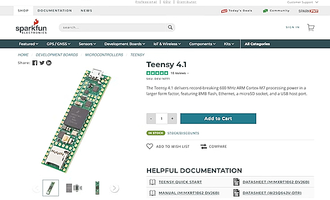](https://www.youtube.com/watch?v=OwPKwA0Q8wQ)

SparkFun has released a video discussing Teensy microcontroller boards. Created by Paul Stoffregen, they are now a SparkFun exclusive - [YouTube](https://www.youtube.com/watch?v=OwPKwA0Q8wQ). More on the partnership - [SparkFun](https://news.sparkfun.com/15783).

## Raspberry Pi Soars 40% as CEO Buys Stock, AI Chatter Builds

Shares in Raspberry Pi, rose as much as 42% last week in a record two‑day rally after CEO Eben Upton bought stock in the beaten‑down UK firm, halting a months‑long slide, as chatter grew that its products could benefit from low‑cost artificial‑intelligence projects. Posts from [Adafruit](https://blog.adafruit.com/2026/02/04/before-you-run-openclaw-on-anything-try-a-raspberry-pi-first-sensors-openclaw/) and [Kevin McAleer](https://www.youtube.com/watch?v=7JtSxb7wB8c) suggest that Raspberry 5 may be a good host for projects like OpenClaw vs. the expense of devices like a mac Mini which are in short supply due to demand - [Reuters](https://www.reuters.com/technology/raspberry-pi-soars-40-ceo-buys-stock-ai-chatter-builds-2026-02-17/) and [Semafor](https://www.semafor.com/article/02/17/2026/ai-agents-drive-buzz-for-raspberry-pi-mini-computers).

[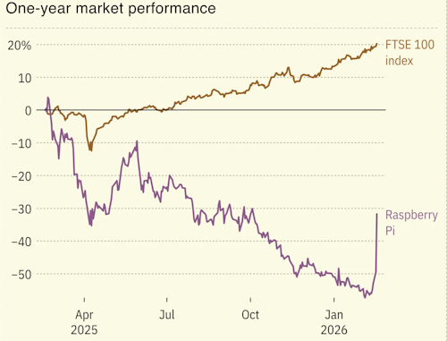](https://www.semafor.com/article/02/17/2026/ai-agents-drive-buzz-for-raspberry-pi-mini-computers)

## A Real-Time Operating System for Raspberry Pi RP2350 Microcontrollers

FRANK OS is a FreeRTOS-based operating system for the RP2350 microcontroller, featuring a windowed desktop environment with PS/2 keyboard and mouse input, DVI display output via HSTX, SD card filesystem support, and the ability to load and run ELF binaries. Compatible with Murmulator OS 2 applications - [GitHub](https://github.com/rh1tech/frankos).

## AI is Destroying Open Source, and It's Not Even Good Yet

Jeff Geering discusses AI and says it is destroying open source (and it's not even good yet). Will crap pull requests overwhelm software development? - [YouTube](https://www.youtube.com/watch?v=bZJ7A1QoUEI).

## The Raspberry Pi and Python-Powered Sensea Underwater Drone

[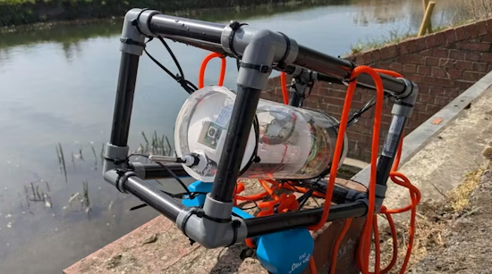](https://www.instructables.com/Sensea-DIY-Underwater-Explorer-With-Raspberry-Pi-C/)

Sensea is a DIY underwater explorer built with a Raspberry Pi, Python, a camera, and simple modular sensors that brings citizen science within reach of any STEM club or classroom. It captures underwater video and logs time-stamped water temperature data, even in remote locations without internet access - [Instructables](https://www.instructables.com/Sensea-DIY-Underwater-Explorer-With-Raspberry-Pi-C/). Via [hackster.io](https://www.hackster.io/news/the-raspberry-pi-powered-sensea-delivers-color-imagery-and-temperature-readings-from-under-the-waves-969582e3040b).

## Single-Board Computers Taught Me What I Actually Need, and It's Less Than I Thought

[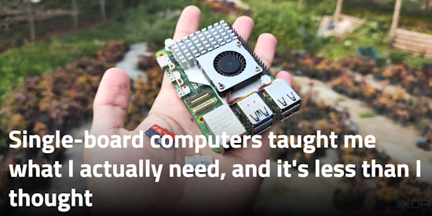](https://www.xda-developers.com/single-board-computers-taught-me-what-i-actually-need/)

Single-Board Computers (SBC) can often do what you have larger computers doing - [XDA](https://www.xda-developers.com/single-board-computers-taught-me-what-i-actually-need/).

*Ed. Microcontrollers can also do some of the tasks folks use SBCs for. Rightsizing a project is important.*

## This Week's Python Streams

Python on Hardware is all about building a cooperative ecosphere which allows contributions to be valued and to grow knowledge. Below are the streams within the last week focusing on the community.

**CircuitPython Deep Dive Stream**

[Last Friday](https://youtube.com/live/zJ5uq4hlrPA), Scott streamed work on CircuitPython in Zephyr native simulator.

You can see the latest video and past videos on the Adafruit YouTube channel under the Deep Dive playlist - [YouTube](https://www.youtube.com/playlist?list=PLjF7R1fz_OOXBHlu9msoXq2jQN4JpCk8A).

**CircuitPython Parsec**

John Park’s CircuitPython Parsec this week is a Trellis Wordle Scoreboard - [Adafruit Blog](https://blog.adafruit.com/2026/02/20/john-parks-circuitpython-parsec-trellis-wordle-scoreboard/) and [YouTube](https://youtu.be/jzVwdW0K86g).

Catch all the episodes in the [YouTube playlist](https://www.youtube.com/playlist?list=PLjF7R1fz_OOWFqZfqW9jlvQSIUmwn9lWr).

Paul welcomes Sean Carolan to the show. Sean shares how he used Claude to code a Pac-Man clone in CircuitPython in just one day. Sean discusses what worked well when using AI and some of the challenges he had to overcome - [The CircuitPython Show](https://www.circuitpythonshow.com/@circuitpythonshow).

**CircuitPython Weekly Meeting**

CircuitPython Weekly Meeting for February 17, 2026 ([notes](https://github.com/adafruit/adafruit-circuitpython-weekly-meeting/blob/main/2026/2026-02-17.md)) [on YouTube](https://youtu.be/fH3ZQO0_eiE).

## Project of the Week: A Raspberry Pi As A Studio Camera

[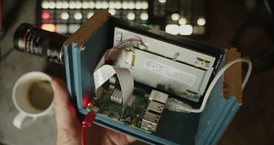](https://hackaday.com/2026/02/18/the-raspberry-pi-as-a-studio-camera/)

Martijn Braam had made a Raspberry Pi studio camera featuring a Pi 5 and touchscreen with the HD camera module. The interesting part comes in the software (using Python), in which he’s written a low-latency GUI over an HDMI output camera application. It’s designed to plug into video mixing hardware, and one of the HDMI outputs carries the GUI while the other carries the unadulterated video. Great with, for example, OBS Studio - [Hackaday](https://hackaday.com/2026/02/18/the-raspberry-pi-as-a-studio-camera/), [GitHub](https://github.com/MartijnBraam/picam) and [YouTube](https://youtu.be/otN7aUJbgck).

## Popular Last Week: 12 Python Libraries You Need to Try in 2026

What was the most popular, most clicked link, in [last week's newsletter](https://www.adafruitdaily.com/2026/02/16/python-on-microcontrollers-newsletter-circuitpython-10-1-release-candidate-ai-on-microcontrollers-and-much-more-circuitpython-python-micropython-thepsf-raspberry_pi/)? [12 Python Libraries You Need to Try in 2026](https://www.kdnuggets.com/12-python-libraries-you-need-to-try-in-2026).

Did you know you can read past issues of this newsletter in the Adafruit Daily Archive? [Check it out](https://www.adafruitdaily.com/category/circuitpython/).

## New Notes from Adafruit Playground

[Adafruit Playground](https://adafruit-playground.com/) is a new place for the community to post their projects and other making tips/tricks/techniques. Ad-free, it's an easy way to publish your work in a safe space for free.

CircuitPython Functions to Pretty Up Strings - [Adafruit Playground](https://adafruit-playground.com/u/danak/pages/circuitpython-functions-to-pretty-up-strings).

Project Starflight - coding in PyBasic and CircuitPython - [Adafruit Playground](https://adafruit-playground.com/u/mrklingon/pages/project-starflight-coding-in-pybasic-and-circuitpython).

## News From Around the Web

[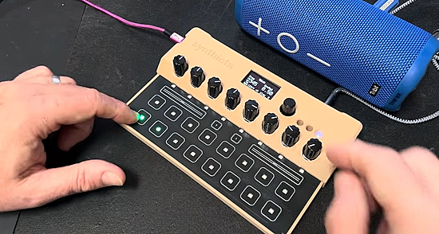](https://www.youtube.com/watch?v=MjE2wdevc3M)

Todbot has had some time to work on "tbish" TB-303 emulator in CircuitPython. This video shows some of the updates - [YouTube](https://www.youtube.com/watch?v=MjE2wdevc3M) and [GitHub](https://github.com/todbot/synthiota).

**The updates include:**
* New `mapped_pot_controller` to allow the pots to have different modes
* Sequencer has separate lane for slides so that accent & slide can happen on same step
* `tbish_synth` now has 4 different waveforms to choose from
* Can edit the sequence steps, both notes and accents/slides/mutes
* Can switch between sequences
* Can adjust `bpm` & `steps_per_beat`
* Actually using the LEDs

[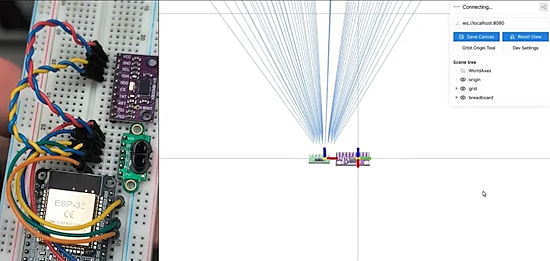](https://hackaday.com/2026/02/14/real-time-3d-room-mapping-with-esp32-vl53l5cx-sensor-and-imu/)

A low cost, real-time 3D room mapping with ESP32, VL53L5CX sensor and IMU, viewable with Python - [Hackaday](https://hackaday.com/2026/02/14/real-time-3d-room-mapping-with-esp32-vl53l5cx-sensor-and-imu/) and [GitHub](https://github.com/ferrolho/VL53L5CX-BNO08X-viewer).

[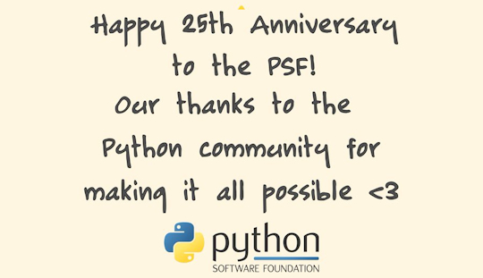](https://x.com/ThePSF/status/2024778624050593925)

Happy 25th anniversary to the PSF! 🎉 That's a quarter century of the PSF supporting Python and its community to grow, build, & change the world - [X](https://x.com/ThePSF/status/2024778624050593925).

[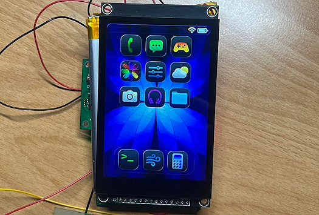](https://www.reddit.com/r/esp32/comments/1r9bvzq/i_made_a_4g_esp32_smartphone/)

A 4G ESP32-based smartphone - [Reddit](https://www.reddit.com/r/esp32/comments/1r9bvzq/i_made_a_4g_esp32_smartphone/). Via [XDA](https://www.xda-developers.com/someone-made-a-4g-esp32-smartphone-and-its-as-impressive-as-it-sounds/).

[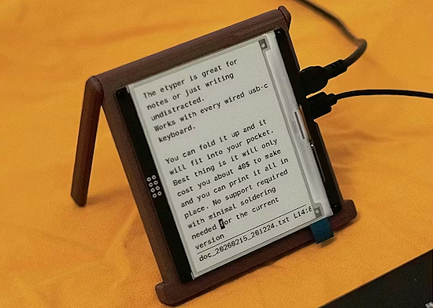](https://www.hackster.io/news/a-weekend-project-for-writers-the-40-digital-typewriter-5c7a617bb761)

Hardware hacker Quackieduckie has built a new e-typewriter. Called the etyper, this DIY device provides a pleasant typing experience with an e-ink display for just $40 using an Orange Pi Zero 2W and Python - [hackster.io](https://www.hackster.io/news/a-weekend-project-for-writers-the-40-digital-typewriter-5c7a617bb761) and [GitHub](https://github.com/Quackieduckie/etyper).

[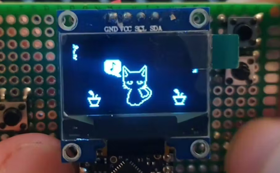](https://www.hackster.io/news/how-to-create-your-own-handheld-virtual-pet-5378c7050d3c)

Build a retro virtual pet in an afternoon with Moonbench’s ESP32 MicroPython project - [hackster.io](https://www.hackster.io/news/how-to-create-your-own-handheld-virtual-pet-5378c7050d3c).

[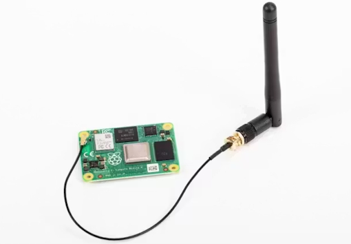](https://www.hackster.io/news/raspberry-pi-promises-assistance-with-certifying-third-party-antennas-for-use-with-compute-modules-def3ced2e7fe)

Raspberry Pi promises assistance with certifying third-party antennas for use with Compute Modules - [hackster.io](https://www.hackster.io/news/raspberry-pi-promises-assistance-with-certifying-third-party-antennas-for-use-with-compute-modules-def3ced2e7fe).

[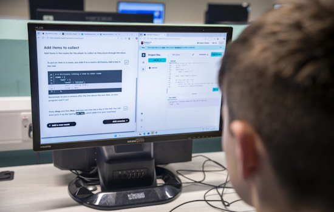](https://www.raspberrypi.org/blog/levelling-up-with-python-create-with-data/)

Education: Levelling up with Python - create with data - [Raspberry Pi Foundation](https://www.raspberrypi.org/blog/levelling-up-with-python-create-with-data/).

Six microcontroller projects that no longer require a full SBC running Linux - [XDA](https://www.xda-developers.com/microcontroller-projects-used-require-full-sbc-running-linux/).

How we enabled secure boot on Raspberry Pi 4 - [hackster.io](https://www.hackster.io/the-embedded-kit/how-we-enabled-secure-boot-on-raspberry-pi-4-a52abc).

[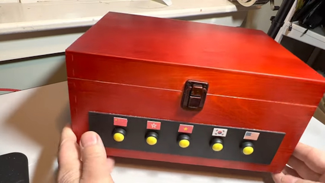](https://www.youtube.com/watch?v=2Al0q0eAXpM)

Build a Lunar New Year box: talking, portable, and multi-lingual with Feather RP2040 and CircuitPython - [YouTube](https://www.youtube.com/watch?v=2Al0q0eAXpM) and [Instructables](https://www.instructables.com/Build-a-Lunar-New-Year-Box-Talking-Portable-and-Mu/). Via [Mastodon](https://mastodon.social/@gallaugher@mastodon.world/116086373008129458).

[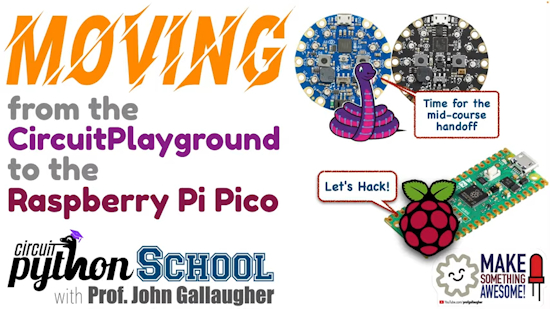](https://www.youtube.com/watch?v=RPI10l3vCWk)

Moving from the Circuit Playground to the Raspberry Pi Pico (CircuitPython School) - [YouTube]([url](https://www.youtube.com/watch?v=RPI10l3vCWk)).

[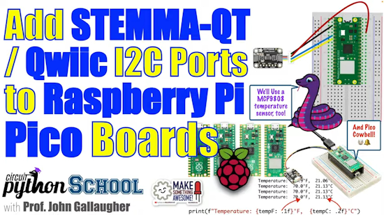](https://www.youtube.com/watch?v=TmNrhaeMJ0Q)

Raspberry Pi Pico & STEMMA-QT/Qwiic + MCP9808 Temp Sensor, Print Formatting, & Cowbell (2026) - [YouTube](https://www.youtube.com/watch?v=TmNrhaeMJ0Q).

[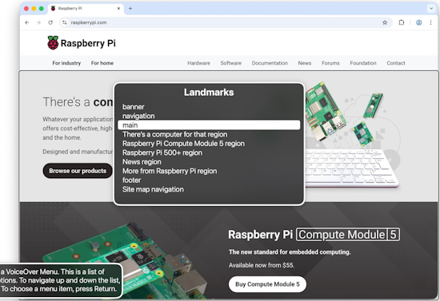](https://www.raspberrypi.com/news/screen-reader-accessibility-improvements/)

Accessibility improvements for screen readers on raspberrypi.com - [Raspberry Pi News](https://www.raspberrypi.com/news/screen-reader-accessibility-improvements/).

Critical flaws found in four VS Code extensions with over 125 million installs - [The Hacker News](https://thehackernews.com/2026/02/critical-flaws-found-in-four-vs-code.html).

[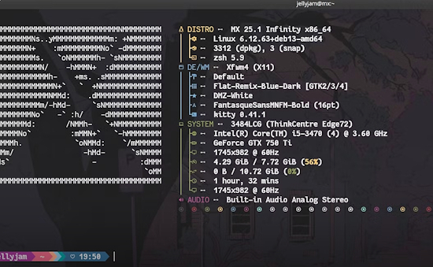](https://www.howtogeek.com/how-to-make-your-linux-terminal-look-stunning/)

Four Linux commands that will make your terminal look incredible - [How-To Geek](https://www.howtogeek.com/how-to-make-your-linux-terminal-look-stunning/).

[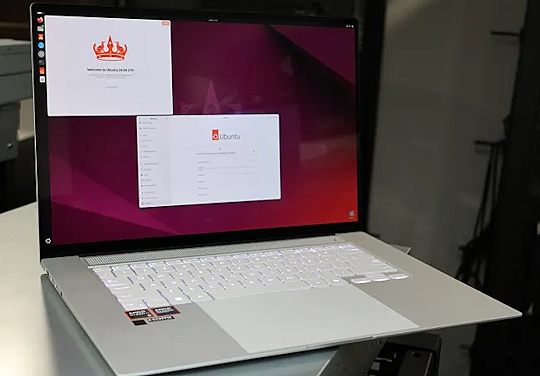](https://www.phoronix.com/news/Ubuntu-24.04.4-LTS)

Ubuntu 24.04.4 LTS is now available with the Linux 6.17 HWE kernel - [Phoronix](https://www.phoronix.com/news/Ubuntu-24.04.4-LTS).

Beyond vibe coding: the case for spec-driven AI development - [The New Stack](https://thenewstack.io/vibe-coding-spec-driven/).

## New

Olimex introduces their new open source hardware board. It’s built around the dual-core ESP32-P4 RISC-V system on a chip. Dual-core 400 MHz RISC-V processor, 768 KB internal RAM + 32 MB PSRAM, Native Ethernet, CSI camera + MIPI DSI display support, HDMI output, and more. Fully open-source hardware — schematics and KiCad files available - [Olimex](https://olimex.wordpress.com/2026/02/17/esp32-p4-pc-open-source-hardware-board-the-most-comprehensive-and-feature-rich-esp32-p4-board-on-the-market/).

## New Boards Supported by CircuitPython

The number of supported microcontrollers and Single Board Computers (SBC) grows every week. This section outlines which boards have been included in CircuitPython or added to [CircuitPython.org](https://circuitpython.org/).

This week there was one new board added:

- [µGame S3 by Radomir Dopieralski](https://circuitpython.org/board/ugame_s3/)

*Note: For non-Adafruit boards, please use the support forums of the board manufacturer for assistance, as Adafruit does not have the hardware to assist in troubleshooting.*

Looking to add a new board to CircuitPython? It's highly encouraged! Adafruit has four guides to help you do so:

- [How to Add a New Board to CircuitPython](https://learn.adafruit.com/how-to-add-a-new-board-to-circuitpython/overview)
- [How to add a New Board to the circuitpython.org website](https://learn.adafruit.com/how-to-add-a-new-board-to-the-circuitpython-org-website)
- [Adding a Single Board Computer to PlatformDetect for Blinka](https://learn.adafruit.com/adding-a-single-board-computer-to-platformdetect-for-blinka)
- [Adding a Single Board Computer to Blinka](https://learn.adafruit.com/adding-a-single-board-computer-to-blinka)

## New Adafruit Learning System Guides

The [Adafruit Learning System](https://learn.adafruit.com/) has over 3,200 free guides for learning skills and building projects including using Python.

[Professor Bubbleton’s Breathing Head in a Jar](https://learn.adafruit.com/professor-bubbleton-s-breathing-head-in-a-jar/overview) from [Erin St Blaine](https://learn.adafruit.com/u/firepixie)

[Stained Glass Lamp](https://learn.adafruit.com/stained-glass-lamp) from [Ruiz Brothers](https://learn.adafruit.com/u/pixil3d)

[Tiny Wiki for CircuitPython](https://learn.adafruit.com/tiny-wiki-for-circuitpython) from [Tim C](https://learn.adafruit.com/u/Foamyguy)

## CircuitPython Libraries

The CircuitPython library numbers are continually increasing, while existing ones continue to be updated. Here we provide library numbers and updates!

To get the latest Adafruit libraries, download the [Adafruit CircuitPython Library Bundle](https://circuitpython.org/libraries). To get the latest community contributed libraries, download the [CircuitPython Community Bundle](https://circuitpython.org/libraries).

If you'd like to contribute to the CircuitPython project on the Python side of things, the libraries are a great place to start. Check out the [CircuitPython.org Contributing page](https://circuitpython.org/contributing). If you're interested in reviewing, check out Open Pull Requests. If you'd like to contribute code or documentation, check out Open Issues. We have a guide on [contributing to CircuitPython with Git and GitHub](https://learn.adafruit.com/contribute-to-circuitpython-with-git-and-github), and you can find us in the #help-with-circuitpython and #circuitpython-dev channels on the [Adafruit Discord](https://adafru.it/discord).

You can check out this [list of all the Adafruit CircuitPython libraries and drivers available](https://github.com/adafruit/Adafruit_CircuitPython_Bundle/blob/master/circuitpython_library_list.md). 

The current number of CircuitPython libraries is **555**!

**New Libraries**

Here are this week's new CircuitPython libraries:

  * [adafruit/Adafruit_CircuitPython_SGP41](https://github.com/adafruit/Adafruit_CircuitPython_SGP41)
  * [relic-se/CircuitPython_Synthiota](https://github.com/relic-se/CircuitPython_Synthiota)

**Updated Libraries**

Here are this week's updated CircuitPython libraries:

  * [tekktrik/CircuitPython_functools](https://github.com/tekktrik/CircuitPython_functools)

## What’s the CircuitPython team up to this week?

What is the team up to this week? Let’s check in:

**Dan**

I did multiple CircuitPython releases last week. I released CircuitPython 10.1.0 final, but it had a severe performance regression on Espressif boards. I pulled that release, and released 10.1.1 with a fix. Also I released 10.2.0-alpha.1, which starts the development release chain for 10.2.0.

In 10.2.0-alpha.1, I updated our builds to use ARM gcc 15.2Rel1. I also added a new API to fetch typed values from `settings.toml`. Now you can retrieve strings, integers, and boolean values.

**Tim**

The Tiny Wiki for CircuitPython Learn Guide was published this week. I've continued work on the Bluefruit Connect LE app. The new V4 Play store listing is nearly ready to publish. The next project I'm working on is using Moonshine voice to set up voice commands to control NeoPixels on a Raspberry Pi.

**Scott**

This week I got my initial [Zephyr BLE PR out as a draft](https://github.com/adafruit/circuitpython/pull/10833), waiting to confirm CI passes. I'm learning new balance of getting this out for PR when using agents for the coding part. I've got quite the backlog to get to reviewing and PRing.

**Liz**

This week I documented the new [SGP41 Multi-Pixel Gas Sensor Breakout](https://learn.adafruit.com/adafruit-sgp41-multi-pixel-gas-sensor-breakout). This breakout measures VOC and NOx to give you an idea of the air quality. I also wrote a CircuitPython driver to interface with the breakout.

## Upcoming Events

The next MicroPython Meetup in Melbourne will be on February 25th – [Luma](https://luma.com/r0rq9pl4). You can see recordings of previous meetings on [YouTube](https://www.youtube.com/@MicroPythonOfficial). 

PyCascades 2026 will be 20 March 2026 – 21 March 2026 in Vancouver, British Columbia, Canada - [PyCascades 2026](https://2026.pycascades.com/).

**Other Events This Year**
* PyCon DE & PyData 2026 will be 13 April 2026 – 17 April 2026 in Darmstadt, Germany
* The Open Source Hardware Association Open Hardware Summit is coming to Berlin, Germany on May 23rd and 24th, 2026.
* PyCon AU 2026 will be 26 Aug. 2026 – 30 Aug. 2026 in Brisbane, Australia

**Send Your Events In**

If you know of virtual events or upcoming events, please let us know via email to cpnews(at)adafruit(dot)com.

## Latest Releases

CircuitPython's stable release is [10.1.1](https://github.com/adafruit/circuitpython/releases/latest) and its unstable release is [10.2.0-alpha.1](https://github.com/adafruit/circuitpython/releases). New to CircuitPython? Start with our [Welcome to CircuitPython Guide](https://learn.adafruit.com/welcome-to-circuitpython).

[20260214](https://github.com/adafruit/Adafruit_CircuitPython_Bundle/releases/latest) is the latest Adafruit CircuitPython library bundle.

[20260210](https://github.com/adafruit/CircuitPython_Community_Bundle/releases/latest) is the latest CircuitPython Community library bundle.

[v1.27.0](https://micropython.org/download) is the latest MicroPython release. Documentation for it is [here](http://docs.micropython.org/en/latest/pyboard/).

[3.14.3](https://www.python.org/downloads/) is the latest Python release. The latest pre-release version is [3.15.0a6](https://www.python.org/download/pre-releases/).

[4,476 Stars](https://github.com/adafruit/circuitpython/stargazers) Like CircuitPython? [Star it on GitHub!](https://github.com/adafruit/circuitpython)

## Call for Help -- Translating CircuitPython is Now Easier Than Ever

One important feature of CircuitPython is translated control and error messages. With the help of fellow open source project [Weblate](https://weblate.org/), we're making it even easier to add or improve translations. 

Sign in with an existing account such as GitHub, Google or Facebook and start contributing through a simple web interface. No forks or pull requests needed! As always, if you run into trouble join us on [Discord](https://adafru.it/discord), we're here to help.

## 39,144 Thanks

The Adafruit Discord community, where we do all our CircuitPython development in the open, reached over 39,144 humans - thank you! Adafruit believes Discord offers a unique way for Python on hardware folks to connect. Join today at [https://adafru.it/discord](https://adafru.it/discord).

## ICYMI - In case you missed it

Python on hardware is the Adafruit Python video-newsletter-podcast! The news comes from the Python community, Discord, Adafruit communities and more and is broadcast on ASK an ENGINEER Wednesdays. The complete Python on Hardware weekly videocast [playlist is here](https://www.youtube.com/playlist?list=PLjF7R1fz_OOXRMjM7Sm0J2Xt6H81TdDev). The video podcast is on [iTunes](https://itunes.apple.com/us/podcast/python-on-hardware/id1451685192?mt=2), [YouTube](http://adafru.it/pohepisodes), [Instagram](https://www.instagram.com/adafruit/channel/)), and [XML](https://itunes.apple.com/us/podcast/python-on-hardware/id1451685192?mt=2).

[The weekly community chat on Adafruit Discord server CircuitPython channel - Audio / Podcast edition](https://itunes.apple.com/us/podcast/circuitpython-weekly-meeting/id1451685016) - Audio from the Discord chat space for CircuitPython, meetings are usually Mondays at 2pm ET, this is the audio version on [iTunes](https://itunes.apple.com/us/podcast/circuitpython-weekly-meeting/id1451685016), Pocket Casts, [Spotify](https://adafru.it/spotify), and [XML feed](https://adafruit-podcasts.s3.amazonaws.com/circuitpython_weekly_meeting/audio-podcast.xml).

## Contribute

The CircuitPython Weekly Newsletter is a CircuitPython community-run newsletter emailed every Monday. To contribute your content, please email your news to cpnews (at) adafruit (dot) com with information and link(s) to your content. 

Join the Adafruit [Discord](https://adafru.it/discord) or [post to the forum](https://forums.adafruit.com/viewforum.php?f=60) if you have questions.
