- [ ] Library and info updates
- [ ] change date
- [ ] update title
- [ ] Feature story
- [ ] Update  for images
- [ ] Update ICYDNCI
- [ ] All images 550w max only
- [ ] Link "View this email in your browser."

News Sources

- [Adafruit Playground](https://adafruit-playground.com/)
- Twitter: [CircuitPython](https://twitter.com/search?q=circuitpython&src=typed_query&f=live), [MicroPython](https://twitter.com/search?q=micropython&src=typed_query&f=live) and [Python](https://twitter.com/search?q=python&src=typed_query)
- [Raspberry Pi News](https://www.raspberrypi.com/news/), [Pi Foundation](https://www.raspberrypi.org/blog/)
- Mastodon [CircuitPython](https://mastodon.social/tags/CircuitPython) and [MicroPython](https://mastodon.social/tags/MicroPython)
- BlueSky [CircuitPython](https://bsky.app/search?q=circuitpython), [MicroPython](https://bsky.app/search?q=micropython), [Raspberry Pi](https://bsky.app/search?q=raspberry+pi)
- [Google News Python](https://news.google.com/topics/CAAqIQgKIhtDQkFTRGdvSUwyMHZNRFY2TVY4U0FtVnVLQUFQAQ?hl=en-US&gl=US&ceid=US%3Aen)
- YouTube: [CircuitPython](https://www.youtube.com/results?search_query=circuitpython&sp=CAI%253D), [MicroPython](https://www.youtube.com/results?search_query=micropython&sp=CAI%253D), [Prof Gallaugher](https://www.youtube.com/@BuildWithProfG/videos)
- [maker.io Python](https://www.digikey.com/en/maker/search-results?s=createdDate&t=python)
- [hackster.io CircuitPython](https://www.hackster.io/search?q=circuitpython&i=projects&sort_by=most_recent) and [MicroPython](https://www.hackster.io/search?q=micropython&i=projects&sort_by=most_recent)
- Instructables: [CircuitPython](https://www.instructables.com/search/?q=circuitpython&projects=all&sort=Newest), [MicroPython](https://www.instructables.com/search/?q=micropython&projects=all&sort=Newest), [Raspberry Pi Python](https://www.instructables.com/search/?q=raspberry+pi+python&projects=all&sort=Newest)
- [hackaday CircuitPython](https://hackaday.com/blog/?s=circuitpython) and [MicroPython](https://hackaday.com/blog/?s=micropython)
- [python.org](https://www.python.org/)
- [Python Insider - dev team blog](https://pythoninsider.blogspot.com/)
- Individuals: [bret.dk](https://bret.dk/), [Jeff Geerling](https://www.jeffgeerling.com/blog), [Yakroo](https://x.com/Yakroo5077), [coXXect](https://coxxect.blogspot.com/)
- Tom's Hardware: [CircuitPython](https://www.tomshardware.com/search?searchTerm=circuitpython&articleType=all&sortBy=publishedDate) and [MicroPython](https://www.tomshardware.com/search?searchTerm=micropython&articleType=all&sortBy=publishedDate) and [Raspberry Pi](https://www.tomshardware.com/search?searchTerm=raspberry%20pi&articleType=all&sortBy=publishedDate)
- [hackaday.io newest projects MicroPython](https://hackaday.io/projects?tag=micropython&sort=date) and [CircuitPython](https://hackaday.io/projects?tag=circuitpython&sort=date)
- hackaday.io - [CircuitPython](https://hackaday.io/search?term=circuitpython) and [MicroPython](https://hackaday.io/search?term=micropython)
- [MicroPython Meeting](https://luma.com/micropython?k=c)

View this email in your browser. **Warning: Flashing Imagery**

Welcome to the latest Python on Microcontrollers newsletter! *insert 2-3 sentences from editor (what's in overview, banter)* - *Anne Barela, Editor*

We're on [Discord](https://discord.gg/HYqvREz), [Twitter/X](https://twitter.com/search?q=circuitpython&src=typed_query&f=live), [BlueSky](https://bsky.app/profile/circuitpython.org) and for past newsletters - [view them all here](https://www.adafruitdaily.com/category/circuitpython/). If you're reading this on the web, please [subscribe here](https://www.adafruitdaily.com/). Here's the news this week:

## Headline

text - [site](url).

## Feature

text - [site](url).

## microclawup, an AI-powered ESP32 GPIO Controller Written in MicroPython

[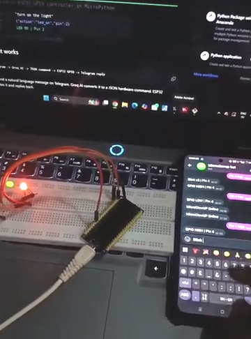](https://www.reddit.com/r/circuitpython/comments/1rds4c9/hey_everyone_i_built_microclawup_an_aipowered/)

OneDot6374 has debued microclawup to control ESP32 GPIO with natural language via Telegram (MicroPython + Groq AI). You send a natural language message on Telegram, Groq AI converts it to a hardware command, and your ESP32 executes it. Inspired by zclaw (which is in C). Tested on ESP32-C3, S3, and C6 - [Reddit](https://www.reddit.com/r/circuitpython/comments/1rds4c9/hey_everyone_i_built_microclawup_an_aipowered/) and [GitHub](https://github.com/kritishmohapatra/microclawup).

Features:

- Natural language GPIO control
- Groq AI — completely free
- Persistent memory across reboots
- WiFi auto-reconnect
- /status and /help commands
- Easy setup with Python via setup.py

## Ten AI Learning Repositories on GitHub Where Jupyter Notebooks (.ipynb) is the Primary Format

Srishti analyzed the top GitHub repositories where Python Jupyter Notebooks (.ipynb) are the primary format and filtered out pure hype, keeping only the most practical, structured learning resources. Here are the ten repositories he states will make you better at AI - [X](https://x.com/srishticodes/status/2025448247767302428).

1. [microsoft/generative-ai-for-beginners](https://github.com/microsoft/generative-ai-for-beginners) — Full repo for Microsoft's Generative AI course with Jupyter notebooks and lessons on building GenAI apps. ⭐ ~105k
2. [rasbt/LLMs-from-scratch](https://github.com/rasbt/LLMs-from-scratch) — Educational implementation of GPT-style LLMs from scratch (code + notebooks). ⭐ ~83k
3. [microsoft/ai-agents-for-beginners](https://github.com/microsoft/ai-agents-for-beginners) — Course on building agentic AI systems, tools, memory, planning, and workflows. ⭐ ~49k
4. [microsoft/ML-For-Beginners](https://github.com/microsoft/ML-For-Beginners) — Classic machine learning fundamentals curriculum (26 lessons). ⭐ ~83k
5. [openai/openai-cookbook](https://github.com/openai/openai-cookbook) — Official OpenAI API examples, production-ready patterns, recipes, and demos in notebooks. ⭐ ~71k
6. [jackfrued/Python-100-Days](https://github.com/jackfrued/Python-100-Days) — Intensive Python learning roadmap with 100 days of exercises/notebooks. ⭐ ~177k
7. [pathwaycom/llm-app](https://github.com/pathwaycom/llm-app) — RAG templates and real-world deployable LLM apps (prod-ready pipelines). ⭐ ~54k
8. [jakevdp/PythonDataScienceHandbook](https://github.com/jakevdp/PythonDataScienceHandbook) — Foundational data science notebook collection (NumPy, Pandas, Matplotlib, Scikit-Learn). ⭐ ~46k
9. [CompVis/stable-diffusion](https://github.com/CompVis/stable-diffusion) — Original Stable Diffusion text-to-image model code (excellent learning material). ⭐ ~72k
10. [facebookresearch/segment-anything](https://github.com/facebookresearch/segment-anything) — Meta's Segment Anything Model (SAM) for interactive image segmentation. ⭐ ~53k

## Feature

text - [site](url).

## Free eBooks on Python

[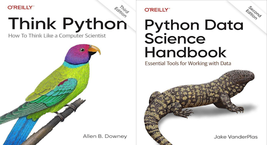](https://x.com/swapnakpanda/status/2025627635729215924)

A list of nine (unpirated) e-books on Python that provide information about Python and it's use from Swapna Kumar Panda - [X](https://x.com/swapnakpanda/status/2025627635729215924).

1. [Think Python (O'Reilly)](https://greenteapress.com/thinkpython2/thinkpython2.pdf)
2. [The Big Book of Small Python Projects](https://inventwithpython.com/bigbookpython/)
3. [Data Structures](https://opendatastructures.org/ods-python.pdf)
4. [Data Science Handbook](https://jakevdp.github.io/PythonDataScienceHandbook/)
5. [Data Analysis](https://wesmckinney.com/book/)
6. [Data Science](https://allendowney.github.io/ElementsOfDataScience/)
7. [Machine Learning](https://python-course.eu/books/bernd_klein_python_and_machine_learning_a4.pdf)
8. [Statistics](https://greenteapress.com/thinkstats2/thinkstats2.pdf)
9. [Clean Code in Python (Packt)](https://packtpub.com/free-ebook/clean-code-in-python/9781788835831)

## This Week's Python Streams

Python on Hardware is all about building a cooperative ecosphere which allows contributions to be valued and to grow knowledge. Below are the streams within the last week focusing on the community.

**CircuitPython Deep Dive Stream**

[Last Friday](link), Scott streamed work on {subject}.

You can see the latest video and past videos on the Adafruit YouTube channel under the Deep Dive playlist - [YouTube](https://www.youtube.com/playlist?list=PLjF7R1fz_OOXBHlu9msoXq2jQN4JpCk8A).

**CircuitPython Parsec**

John Park’s CircuitPython Parsec this week is on {subject} - [Adafruit Blog](link) and [YouTube](link).

Catch all the episodes in the [YouTube playlist](https://www.youtube.com/playlist?list=PLjF7R1fz_OOWFqZfqW9jlvQSIUmwn9lWr).

**CircuitPython Weekly Meeting**

CircuitPython Weekly Meeting for February 23, 2026 ([notes](https://github. com/adafruit/adafruit-circuitpython-weekly-meeting/blob/main/2026/2026-02-23.md)) [on YouTube](https://youtu.be/WrnkoKyc4z8).

## Project of the Week: Curated Children's YouTube with MicroPython

[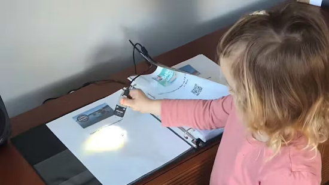](https://guydupont.leaflet.pub/3mfimqfm3a22x)

Guy Dupont designed a system to provide a three-year-old with limited access to the streaming service. The setup turns curated videos into printed codes. It uses an M5Stack Atomic QR code scanner linked to an Atom Light microcontroller host, programmed in MicroPython - [Blog](https://guydupont.leaflet.pub/3mfimqfm3a22x) and [YouTube](https://youtu.be/xAKTeA6J8d8). Via [hackster.io](https://www.hackster.io/news/guy-dupont-makes-an-irl-youtube-with-home-assisant-automation-and-a-qr-code-scanner-42feb6cc2ae9.amp).

## Popular Last Week

[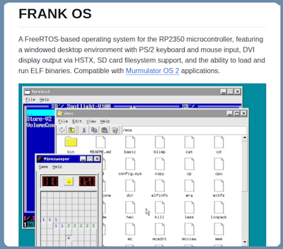](https://github.com/rh1tech/frankos)

What was the most popular, most clicked link, in [last week's newsletter](https://www.adafruitdaily.com/2026/02/23/python-on-microcontrollers-newsletter-micropython-ai-disclosure-overclocking-teensys-story-and-more-circuitpython-python-micropython-thepsf-raspberry_pi/)? [A Real-Time Operating System for Raspberry Pi RP2350 Microcontrollers](https://github.com/rh1tech/frankos).

Did you know you can read past issues of this newsletter in the Adafruit Daily Archive? [Check it out](https://www.adafruitdaily.com/category/circuitpython/).

## New Notes from Adafruit Playground

[Adafruit Playground](https://adafruit-playground.com/) is a new place for the community to post their projects and other making tips/tricks/techniques. Ad-free, it's an easy way to publish your work in a safe space for free.

[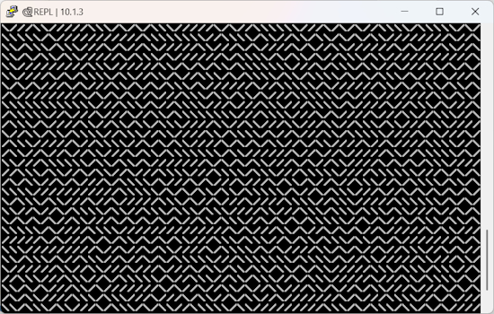](https://adafruit-playground.com/u/DanCogliano/pages/can-you-write-a-one-line-circuitpython-program-to-create-a-maze)

Can You Write a One Line CircuitPython Program to Create a Maze? - [Adafruit Playground](https://adafruit-playground.com/u/DanCogliano/pages/can-you-write-a-one-line-circuitpython-program-to-create-a-maze). Via [BlueSky](https://bsky.app/profile/cogliano.bsky.social/post/3mfldm6qku22f).

[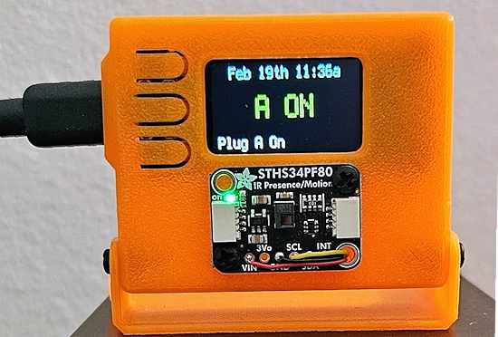](https://adafruit-playground.com/u/dwetchells/pages/ir-motion-sensor-for-govee-smart-plug)

IR-Motion Sensor for Govee Smart Plug - [Adafruit Playground](https://adafruit-playground.com/u/dwetchells/pages/ir-motion-sensor-for-govee-smart-plug).

text - [Adafruit Playground](url).

## News From Around the Web

text - [site](url).

text - [site](url).

How to install Python on your system: a guide for mac, Windows, and Linux - [Real Python](https://realpython.com/installing-python/).

Properly Installing Python from The Hitchhiker's Guide to Python - [python-guide.org](https://docs.python-guide.org/starting/installation/).

[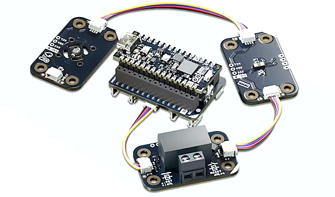](https://www.hackster.io/news/arduino-says-matter-education-matters-launches-the-arduino-matter-discovery-bundle-b18d74bf64df)

Arduino says Matter education matters. They launch an Arduino Matter Discovery Bundle - [hackster.io](https://www.hackster.io/news/arduino-says-matter-education-matters-launches-the-arduino-matter-discovery-bundle-b18d74bf64df) and [Arduino Store](https://store-usa.arduino.cc/products/matter-discovery-bundle).

Build a Talking Baby Groot - A Maker Code Challenge/Solution (CircuitPython School) - [YouTube](https://www.youtube.com/watch?v=gEmyZ7ZWMIo).

[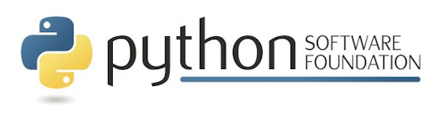](https://jobs.pyfound.org/apply/DNzZlBUqFn/Infrastructure-Engineer)

The Python Software Foundation (PSF) is hiring a full-time Infrastructure Engineer, reporting to the PSF's Director of Engineering to maintain the infrastructure that runs PyPI, python.org, docs.python.org, mail.python.org, and the services that support PyCon US - [PSF Blog](https://jobs.pyfound.org/apply/DNzZlBUqFn/Infrastructure-Engineer).

[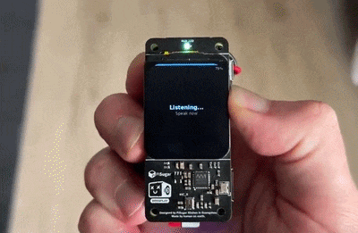](https://github.com/sebastianvkl/pizero-openclaw)

A pocket-sized AI assistant with OpenClaw on Raspberry Pi Zero 2W and Python. Push-to-talk → OpenAI transcription → OpenClaw on VPS → streaming text on tiny LCD (+TTS) - [GitHub](https://github.com/sebastianvkl/pizero-openclaw) and [X](https://x.com/IlirAliu_/status/2026372342276837861).

text - [site](url).

text - [site](url).

text - [site](url).

text - [site](url).

[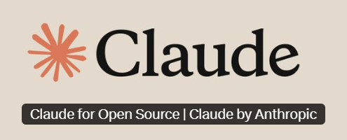](https://claude.com/contact-sales/claude-for-oss)

The Claude for Open Source Program provides open-source maintainers and contributors with 6 months of free Claude Max 20x, though the requirements are quite a bit - [Claude](https://claude.com/contact-sales/claude-for-oss). Via [X](https://x.com/lydiahallie/status/2027129030571634721).

text - [site](url).

text - [site](url).

[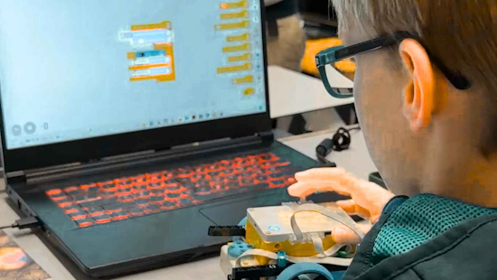]https://www.ecoticias.com/en/a-10-year-old-boy-from-rostock-is-already-programming-his-own-browser-in-python-with-a-history-limit-and-everything-while-others-are-still-learning-how-to-browse-safely/27766/)

A 10-year-old boy from Rostock is programming his own browser in Python - [EcoNews](https://www.ecoticias.com/en/a-10-year-old-boy-from-rostock-is-already-programming-his-own-browser-in-python-with-a-history-limit-and-everything-while-others-are-still-learning-how-to-browse-safely/27766/).

text - [site](url).

text - [site](url).

text - [site](url).

## New

[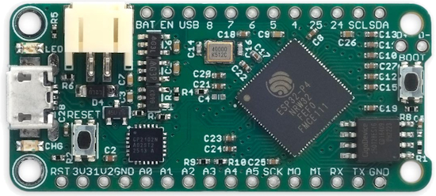](http://www.technoblogy.com/show?5AII)

David Johnson-Davies, aka Technoblogy, has designed an ESP32-P4 board in the Feather format. The ESP32-P4 is a dual-core RISC-V processor running at up to 400MHz, with 768KB of on-chip SRAM, 32Mbytes of on-chip PSRAM, and up to 32Mbytes of external flash - [Technoblogy](http://www.technoblogy.com/show?5AII), [GitHub](https://github.com/technoblogy/esp32-p4-feather),and  [OSHpark](https://oshpark.com/shared_projects/djTl6qP2). Via [Hackster.io](https://www.hackster.io/news/david-johnson-davies-brings-espressif-s-powerful-esp32-p4-to-the-feather-form-factor-8c18207e43a5).

[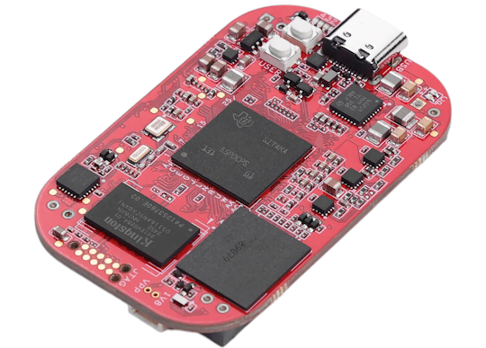](https://www.cnx-software.com/2026/02/24/pocketbeagle-2-sbc-gets-industrial-version-with-1gb-ram-64gb-emmc-flash/)

The PocketBeagle 2 Industrial is an update to the PocketBeagle 2 Rev A1 SBC featuring 1GB DDR4 RAM, a 64GB eMMC flash, and industrial temperature range support. The original board only comes with 512MB DDR4 memory, an eMMC flash footprint (unpopulated), and commercial temperature range support - [CNX](https://www.cnx-software.com/2026/02/24/pocketbeagle-2-sbc-gets-industrial-version-with-1gb-ram-64gb-emmc-flash/).

## New Boards Supported by CircuitPython

The number of supported microcontrollers and Single Board Computers (SBC) grows every week. This section outlines which boards have been included in CircuitPython or added to [CircuitPython.org](https://circuitpython.org/).

This week there were (#/no) new boards added:

- [Board name](url)
- [Board name](url)
- [Board name](url)

*Note: For non-Adafruit boards, please use the support forums of the board manufacturer for assistance, as Adafruit does not have the hardware to assist in troubleshooting.*

Looking to add a new board to CircuitPython? It's highly encouraged! Adafruit has four guides to help you do so:

- [How to Add a New Board to CircuitPython](https://learn.adafruit.com/how-to-add-a-new-board-to-circuitpython/overview)
- [How to add a New Board to the circuitpython.org website](https://learn.adafruit.com/how-to-add-a-new-board-to-the-circuitpython-org-website)
- [Adding a Single Board Computer to PlatformDetect for Blinka](https://learn.adafruit.com/adding-a-single-board-computer-to-platformdetect-for-blinka)
- [Adding a Single Board Computer to Blinka](https://learn.adafruit.com/adding-a-single-board-computer-to-blinka)

## New Adafruit Learning System Guides

[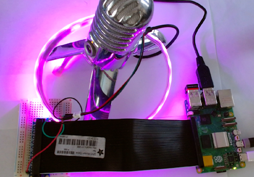](https://learn.adafruit.com/guides/latest)

The [Adafruit Learning System](https://learn.adafruit.com/) has over 3,200 free guides for learning skills and building projects including using Python.

[title](url) from [name](url)

[title](url) from [name](url)

[title](url) from [name](url)

## Updated Learn Guides

[title](url)

## CircuitPython Libraries

The CircuitPython library numbers are continually increasing, while existing ones continue to be updated. Here we provide library numbers and updates!

To get the latest Adafruit libraries, download the [Adafruit CircuitPython Library Bundle](https://circuitpython.org/libraries). To get the latest community contributed libraries, download the [CircuitPython Community Bundle](https://circuitpython.org/libraries).

If you'd like to contribute to the CircuitPython project on the Python side of things, the libraries are a great place to start. Check out the [CircuitPython.org Contributing page](https://circuitpython.org/contributing). If you're interested in reviewing, check out Open Pull Requests. If you'd like to contribute code or documentation, check out Open Issues. We have a guide on [contributing to CircuitPython with Git and GitHub](https://learn.adafruit.com/contribute-to-circuitpython-with-git-and-github), and you can find us in the #help-with-circuitpython and #circuitpython-dev channels on the [Adafruit Discord](https://adafru.it/discord).

You can check out this [list of all the Adafruit CircuitPython libraries and drivers available](https://github.com/adafruit/Adafruit_CircuitPython_Bundle/blob/master/circuitpython_library_list.md). 

The current number of CircuitPython libraries is **556**!

**New Libraries**

Here are this week's new CircuitPython libraries:

* [thingsboard/CircuitPython_thingsboard-client-sdk](https://github.com/thingsboard/CircuitPython_thingsboard-client-sdk)
* [relic-se/CircuitPython_Synthiota](https://github.com/relic-se/CircuitPython_Synthiota)

**Updated Libraries**

Here are this week's updated CircuitPython libraries:

* [adafruit/Adafruit_CircuitPython_Logging](https://github.com/adafruit/Adafruit_CircuitPython_Logging)
* [adafruit/Adafruit_CircuitPython_YotoPlayer](https://github.com/adafruit/Adafruit_CircuitPython_YotoPlayer)
* [adafruit/Adafruit_CircuitPython_Display_Text](https://github.com/adafruit/Adafruit_CircuitPython_Display_Text)
* [relic-se/CircuitPython_SynthVoice](https://github.com/relic-se/CircuitPython_SynthVoice)

## What’s the CircuitPython team up to this week?

What is the team up to this week? Let’s check in:

**Dan**

text.

**Tim**

The new Bluefruit Connect V4 Android app play store listing is now live. I also finished the Moonshine voice control on Raspberry Pi guide and it is now published. Aside from those, I've been looking into font anti-aliasing support with `lvfont` files. The lvgl font converter supports 1, 2, 4, and 8 bits per pixel when converting fonts. Up to now we've always used 1 bpp fonts for CircuitPython. I've made some tweaks in the Bitmap Font and Display Text libraries to allow higher bitdepth fonts to be able to render and I am looking into the core `lvfontio` module next to support anti-aliased fonts for the serial console `terminalio` instance shown by default on devices with displays attached.

**Scott**

This week I merged in Zephyr BLE scanning and advertising support. I also merged in host networking support so our `native_sim` tests can test the web workflow. I've got a few things getting close too: gpio input, `rotaryio`, display support and BLE central support. I updated the ESP-IDF to 5.5.3 but it seems to have broken ESPs on absolute latest. Will fix it shortly.

**Liz**

I was out of a portion of the previous week sick. Coming back this week, I finally able to wrap up the [MIDI Breath Control Learn Guide](https://learn.adafruit.com/midi-breath-controller). This project uses a BMP585 ported pressure sensor with an attached tube to send MIDI CC messages. It was fun experimenting with different CC message types to see which ones were most effective with breath control. There aren't a ton of examples of breath control with MIDI, so I hope that this inspires some new project types.

## Upcoming Events

The next MicroPython Meetup in Melbourne will be on March 25th – [Luma](https://luma.com/micropython?period=past). You can see recordings of previous meetings on [YouTube](https://www.youtube.com/@MicroPythonOfficial). 

Embedded World returns March 10 - 12, 2026 to Nuremburg, Germany - [Embedded World](https://www.embedded-world.de/en).

PyCascades 2026 will be 20 March 2026 – 21 March 2026 in Vancouver, British Columbia, Canada - [PyCascades 2026](https://2026.pycascades.com/).

**Other Events This Year**
* PyCon DE & PyData 2026 will be 13 April 2026 – 17 April 2026 in Darmstadt, Germany
* The Open Source Hardware Association Open Hardware Summit is coming to Berlin, Germany on May 23rd and 24th, 2026.
* PyCon AU 2026 will be 26 Aug. 2026 – 30 Aug. 2026 in Brisbane, Australia

**Send Your Events In**

If you know of virtual events or upcoming events, please let us know via email to cpnews(at)adafruit(dot)com.

## Latest Releases

## Latest Releases

CircuitPython's stable release is [10.1.3](https://github.com/adafruit/circuitpython/releases/latest) and its unstable release is [10.1.0-beta.1](https://github.com/adafruit/circuitpython/releases). New to CircuitPython? Start with our [Welcome to CircuitPython Guide](https://learn.adafruit.com/welcome-to-circuitpython).

[20260226](https://github.com/adafruit/Adafruit_CircuitPython_Bundle/releases/latest) is the latest Adafruit CircuitPython library bundle.

[20260226](https://github.com/adafruit/CircuitPython_Community_Bundle/releases/latest) is the latest CircuitPython Community library bundle.

[v1.27.0](https://micropython.org/download) is the latest MicroPython release. Documentation for it is [here](http://docs.micropython.org/en/latest/pyboard/).

[3.14.3](https://www.python.org/downloads/) is the latest Python release. The latest pre-release version is [3.15.0a6](https://www.python.org/download/pre-releases/).

[4,477 Stars](https://github.com/adafruit/circuitpython/stargazers) Like CircuitPython? [Star it on GitHub!](https://github.com/adafruit/circuitpython)

## Call for Help -- Translating CircuitPython is now easier than ever

[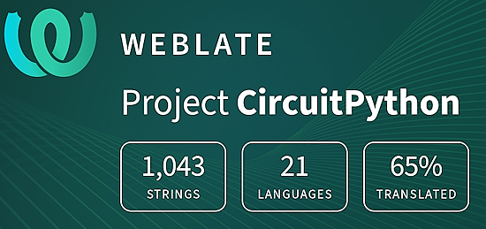](https://hosted.weblate.org/engage/circuitpython/)

One important feature of CircuitPython is translated control and error messages. With the help of fellow open source project [Weblate](https://weblate.org/), we're making it even easier to add or improve translations. 

Sign in with an existing account such as GitHub, Google or Facebook and start contributing through a simple web interface. No forks or pull requests needed! As always, if you run into trouble join us on [Discord](https://adafru.it/discord), we're here to help.

## 39,134 Thanks

The Adafruit Discord community, where we do all our CircuitPython development in the open, reached over 39,134 humans - thank you! Adafruit believes Discord offers a unique way for Python on hardware folks to connect. Join today at [https://adafru.it/discord](https://adafru.it/discord).

## ICYMI - In case you missed it

Python on hardware is the Adafruit Python video-newsletter-podcast! The news comes from the Python community, Discord, Adafruit communities and more and is broadcast on ASK an ENGINEER Wednesdays. The complete Python on Hardware weekly videocast [playlist is here](https://www.youtube.com/playlist?list=PLjF7R1fz_OOXRMjM7Sm0J2Xt6H81TdDev). The video podcast is on [iTunes](https://itunes.apple.com/us/podcast/python-on-hardware/id1451685192?mt=2), [YouTube](http://adafru.it/pohepisodes), [Instagram](https://www.instagram.com/adafruit/channel/)), and [XML](https://itunes.apple.com/us/podcast/python-on-hardware/id1451685192?mt=2).

[The weekly community chat on Adafruit Discord server CircuitPython channel - Audio / Podcast edition](https://itunes.apple.com/us/podcast/circuitpython-weekly-meeting/id1451685016) - Audio from the Discord chat space for CircuitPython, meetings are usually Mondays at 2pm ET, this is the audio version on [iTunes](https://itunes.apple.com/us/podcast/circuitpython-weekly-meeting/id1451685016), Pocket Casts, [Spotify](https://adafru.it/spotify), and [XML feed](https://adafruit-podcasts.s3.amazonaws.com/circuitpython_weekly_meeting/audio-podcast.xml).

## Contribute

The CircuitPython Weekly Newsletter is a CircuitPython community-run newsletter emailed every Monday. To contribute your content, please email your news to cpnews (at) adafruit (dot) com with information and link(s) to your content. 

Join the Adafruit [Discord](https://adafru.it/discord) or [post to the forum](https://forums.adafruit.com/viewforum.php?f=60) if you have questions.
