- [ ] Library and info updates
- [ ] change date
- [ ] update title
- [ ] Feature story
- [ ] Update  for images
- [ ] Update ICYDNCI
- [ ] All images 550w max only
- [ ] Link "View this email in your browser."

News Sources

- [Adafruit Playground](https://adafruit-playground.com/)
- Twitter: [CircuitPython](https://twitter.com/search?q=circuitpython&src=typed_query&f=live), [MicroPython](https://twitter.com/search?q=micropython&src=typed_query&f=live) and [Python](https://twitter.com/search?q=python&src=typed_query)
- [Raspberry Pi News](https://www.raspberrypi.com/news/), [Pi Foundation](https://www.raspberrypi.org/blog/)
- Mastodon [CircuitPython](https://mastodon.social/tags/CircuitPython) and [MicroPython](https://mastodon.social/tags/MicroPython)
- BlueSky [CircuitPython](https://bsky.app/search?q=circuitpython), [MicroPython](https://bsky.app/search?q=micropython), [Raspberry Pi](https://bsky.app/search?q=raspberry+pi)
- [Google News Python](https://news.google.com/topics/CAAqIQgKIhtDQkFTRGdvSUwyMHZNRFY2TVY4U0FtVnVLQUFQAQ?hl=en-US&gl=US&ceid=US%3Aen)
- YouTube: [CircuitPython](https://www.youtube.com/results?search_query=circuitpython&sp=CAI%253D), [MicroPython](https://www.youtube.com/results?search_query=micropython&sp=CAI%253D), [Prof Gallaugher](https://www.youtube.com/@BuildWithProfG/videos)
- [maker.io Python](https://www.digikey.com/en/maker/search-results?s=createdDate&t=python)
- [hackster.io CircuitPython](https://www.hackster.io/search?q=circuitpython&i=projects&sort_by=most_recent) and [MicroPython](https://www.hackster.io/search?q=micropython&i=projects&sort_by=most_recent)
- Instructables: [CircuitPython](https://www.instructables.com/search/?q=circuitpython&projects=all&sort=Newest), [MicroPython](https://www.instructables.com/search/?q=micropython&projects=all&sort=Newest), [Raspberry Pi Python](https://www.instructables.com/search/?q=raspberry+pi+python&projects=all&sort=Newest)
- [hackaday CircuitPython](https://hackaday.com/blog/?s=circuitpython) and [MicroPython](https://hackaday.com/blog/?s=micropython)
- [python.org](https://www.python.org/)
- [Python Insider - dev team blog](https://pythoninsider.blogspot.com/)
- Individuals: [bret.dk](https://bret.dk/), [Jeff Geerling](https://www.jeffgeerling.com/blog), [Yakroo](https://x.com/Yakroo5077), [coXXect](https://coxxect.blogspot.com/)
- Tom's Hardware: [CircuitPython](https://www.tomshardware.com/search?searchTerm=circuitpython&articleType=all&sortBy=publishedDate) and [MicroPython](https://www.tomshardware.com/search?searchTerm=micropython&articleType=all&sortBy=publishedDate) and [Raspberry Pi](https://www.tomshardware.com/search?searchTerm=raspberry%20pi&articleType=all&sortBy=publishedDate)
- [hackaday.io newest projects MicroPython](https://hackaday.io/projects?tag=micropython&sort=date) and [CircuitPython](https://hackaday.io/projects?tag=circuitpython&sort=date)
- hackaday.io - [CircuitPython](https://hackaday.io/search?term=circuitpython) and [MicroPython](https://hackaday.io/search?term=micropython)
- [MicroPython Meeting](https://luma.com/micropython?k=c)

View this email in your browser. **Warning: Flashing Imagery**

Welcome to the latest Python on Microcontrollers newsletter! *insert 2-3 sentences from editor (what's in overview, banter)* - *Anne Barela, Editor*

We're on [Discord](https://discord.gg/HYqvREz), [Twitter/X](https://twitter.com/search?q=circuitpython&src=typed_query&f=live), [BlueSky](https://bsky.app/profile/circuitpython.org) and for past newsletters - [view them all here](https://www.adafruitdaily.com/category/circuitpython/). If you're reading this on the web, please [subscribe here](https://www.adafruitdaily.com/). Here's the news this week:

## Rovari Circuit Studio: New CircuitPython IDE

Rovari Circuit Studio a free and open source CircuitPython IDE built as part of the Rovari Embeddded platforn project - [YouTube](https://www.youtube.com/watch?v=DKyTevXR5jg) and [Discord](https://discord.com/channels/327254708534116352/537365702651150357/1478891859458654258) (Join via [adafru.it/discord](https://discord.com/invite/5FBsBHU)).

> "Rovari Circuit Studio a free and open source CircuitPython IDE built as part of the Rovari Embeddded platforn project. It has everything you expect from Mu and then some more, standard stuff like auto board detection, code formatter, error line highligting with traceback, built in code snippets, library manager with automatic bundling and version matching, serial plotter with autoformat detection and safe file writes with fysnc so no more silent code.py corruption on windows and it has a safe to remove indicator so you know if its safe to unplug the board or not... Its offline desktop application currently windows but making cross platform, and adding support for BLE and WiFi for ESP boads. Supports all boards but Rovari is centered on RISC-V so RISC-V boards are first class citizens and CircuitPython is first class, not an afterthought...."

## The MicroPython Triage Team: Goals and Processes

[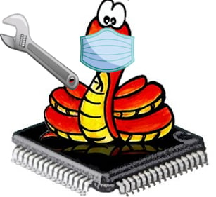](https://blog.adafruit.com/2026/03/04/the-micropython-triage-team-goals-and-processes/)

On the MicroPython forums, Anson Mansfield writes about the MicroPython Triage Team – Goals and Processes - [Adafruit Blog](https://blog.adafruit.com/2026/03/04/the-micropython-triage-team-goals-and-processes/) and [GitHub Thread](https://github.com/orgs/micropython/discussions/18878).

> "As of writing, there are 1392 open issues and 495 open PRs on micropython/micropython — including some that were opened all the way back in 2014, twelve years ago! With the creation of the new @micropython/triage-team, I’d like to propose we break this backlog into a series of more achievable short term triage goals, and to as part of that, adopt and document some specific model workflow for triaging them. MicroPython should only adopt official goals and recommendations for Triage Team that stand firmly atop the underlying norms we mean them to explain and encourage, and the principled reasons we’d have to encourage them. But for all of the above reasons, we should adopt a set of short-term goals and an accompanying 'model workflow' that’s as specific and actionable as possible within that."

## pycoClaw is a Fully Featured MicroPython Implementation of OpenClaw

[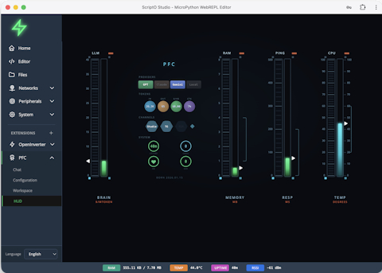](https://blog.adafruit.com/2026/03/04/pycoclaw-is-a-fully-featured-micropython-implementation-of-openclaw/)

pycoClaw is a fully featured MicroPython implementation of OpenClaw - [Adafruit Blog](https://blog.adafruit.com/2026/03/04/pycoclaw-is-a-fully-featured-micropython-implementation-of-openclaw/), [Website](https://pycoclaw.com/) and [GitHub](https://github.com/orgs/micropython/discussions/18889).

> "The short version: it’s a full AI agent running on MicroPython on a $5 ESP32-S3. Not a “send a prompt and get a response” wrapper — a proper OpenClaw-compatible agent loop with recursive tool calling, context compaction, persistent memory (hybrid TF-IDF + vector search, SD card backed), multi-model routing, background tasks, the works."

## Microsoft (Looks to) Unify Python Environments: a Review

[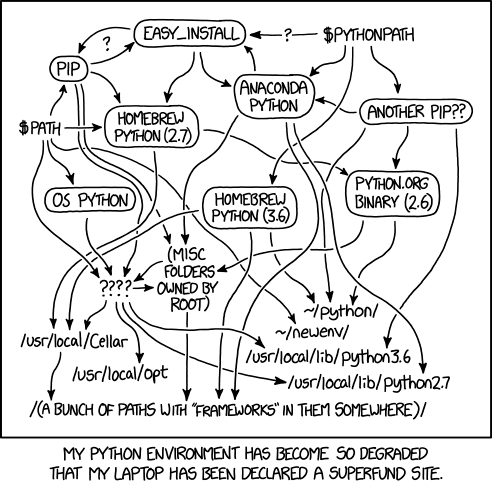](https://www.i-programmer.info/news/216-python/18680-microsoft-unifies-python-environments.html)

If you are prepared to use VS Code, which isn't a bad Python IDE, the new Microsoft Python Environments extension attempts to tame the mess that is illustrated in the xkcd cartoon - [i-programmer](https://www.i-programmer.info/news/216-python/18680-microsoft-unifies-python-environments.html) and [Microsoft Blog](https://devblogs.microsoft.com/python/python-in-visual-studio-code-february-2026-release/).

> "Is this the end of the Python package mess? Clearly the answer has to be 'no' a because the mess still exists - it's just hidden beneath a layer of code. It is still the part of Python I dislike the most, but at least I might be able to forget about it for a while longer."

## How to Build Your Own MCP Server with Python

A free guide on how to build an LLM [MCP](https://en.wikipedia.org/wiki/Model_Context_Protocol) Server with Python - [Free Code Camp](https://www.freecodecamp.org/news/how-to-build-your-own-mcp-server-with-python/).

> "Building an MCP server gives you control and flexibility. You can connect AI models directly to your databases or internal systems, automate repetitive actions, and decide exactly what data an AI model can access. It also allows you to experiment quickly. You can start small with a few simple tools and expand later into complex workflows. By creating your own MCP server, you’re not just writing code – you’re defining how intelligent systems interact with the real world through your logic and data."

## Fault Injection Attacks Bypassing Secure Boot on the Raspberry Pi RP2350

[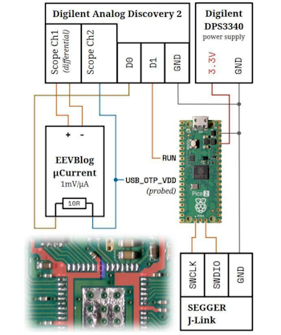](https://x.com/0xor0ne/status/2029950734293168494)

0xor0ne on X posts about accomplishing fault injection attacks bypassing secure boot on the Raspberry Pi RP2350 in a paper - [X](https://x.com/0xor0ne/status/2029950734293168494) and [Paper (PDF)](https://www.usenix.org/system/files/woot25-muench.pdf0).

## Feature

text - [site](url).

## This Week's Python Streams

Python on Hardware is all about building a cooperative ecosphere which allows contributions to be valued and to grow knowledge. Below are the streams within the last week focusing on the community.

**CircuitPython Deep Dive Stream**

[Last Friday](https://youtube.com/live/m879n3APfdQ), Tim steped in for Scott to talk light sensor drivers and guides.

You can see the latest video and past videos on the Adafruit YouTube channel under the Deep Dive playlist - [YouTube](https://www.youtube.com/playlist?list=PLjF7R1fz_OOXBHlu9msoXq2jQN4JpCk8A).

**CircuitPython Parsec**

John Park’s CircuitPython Parsec this week is on hiatus as he rebuilds his streaming set-up after a crash.

Catch all the episodes in the [YouTube playlist](https://www.youtube.com/playlist?list=PLjF7R1fz_OOWFqZfqW9jlvQSIUmwn9lWr).

Paul welcomes Michelle Hui and Reitweic Shandilya to the show, both of whom are master's students at Cornell Tech. Michelle and Reitweic share the Open Pressure Sensor, an open source medical device that helps physicians assist mastectomy patients which uses CircuitPython as its firmware - [The CircuitPython Show](https://www.circuitpythonshow.com/@circuitpythonshow).

**NEW:** [Last week](https://youtube.com/live/2NQjo3aP3-8), Tim streamed work on investigating the `lvfontio` core module & looked to use the Pi Debug Probe on hard crash.

You can see the latest video and past videos on the Adafruit YouTube channel under the Deep Dive playlist - [YouTube](https://www.youtube.com/playlist?list=PLjF7R1fz_OOXBHlu9msoXq2jQN4JpCk8A).

**CircuitPython Weekly Meeting**

CircuitPython Weekly Meeting for March 2nd, 2026 ([notes](https://github.com/adafruit/adafruit-circuitpython-weekly-meeting/blob/main/2026/2026-03-02.md)) [on YouTube](https://youtu.be/pmYkWzWgjxA).

## Project of the Week: PiComputer Flip DVI

[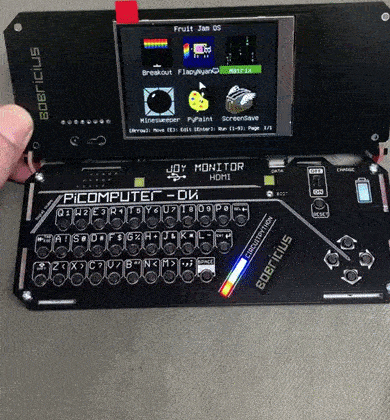](https://x.com/bobricius/status/2028508304167575688)

bobricius shows a fabulous WIP project, the PiComputer Flip DVI runs CircuitPython and Fruit Jam OS and has HDMI, Raspberry Pi Pico 2(W), a 2.8" IPS LCD, SD card, speaker, 3.5 audio with speaker switch, a Hall Effect sensor to turn off the display, perhaps retro emulation, and USB Host - [X](https://x.com/bobricius/status/2028508304167575688).

## Popular Last Week: Free eBook - The Big Book of Small Python Projects

[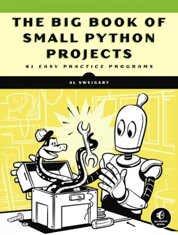](https://inventwithpython.com/bigbookpython/)

What was the most popular, most clicked link, in [last week's newsletter](https://www.adafruitdaily.com/2026/03/02/python-on-microcontrollers-newsletter-resources-for-learning-python-handy-projects-and-much-more-circuitpython-python-micropython-thepsf-raspberry_pi/)? [The Big Book of Small Python Projects](https://inventwithpython.com/bigbookpython/).

Did you know you can read past issues of this newsletter in the Adafruit Daily Archive? [Check it out](https://www.adafruitdaily.com/category/circuitpython/).

## New Notes from Adafruit Playground

[Adafruit Playground](https://adafruit-playground.com/) is a new place for the community to post their projects and other making tips/tricks/techniques. Ad-free, it's an easy way to publish your work in a safe space for free.

Project StarTraffic - [Adafruit Playground](https://adafruit-playground.com/u/mrklingon/pages/project-startraffic).

## News From Around the Web

text - [site](url).

[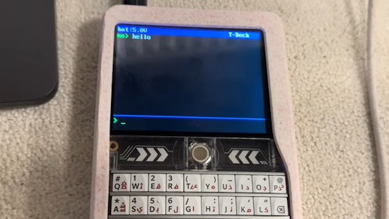](https://www.youtube.com/watch?v=yFDQxUWxRlw)

Last week's headline talked about Reticulum availability for MicroPython. YouTube user Rooster tech has created a Reticulum LXMF messenger on a LILYGO T-Deck with a basic GUI for secure communication - [YouTube](https://www.youtube.com/watch?v=yFDQxUWxRlw).

What I learned using Claude Sonnet to migrate Python to Rust - [InfoWorld](https://www.infoworld.com/article/4135218/what-i-learned-using-claude-sonnet-to-migrate-python-to-rust.html).

[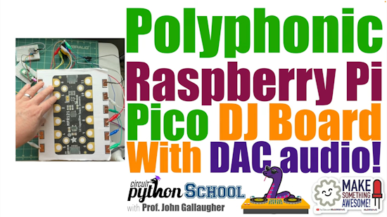](https://www.youtube.com/watch?v=UiD1pkrTvo8)

Build a Polyphonic DJ Board for Raspberry Pi Pico (CircuitPython School) - [YouTube](https://www.youtube.com/watch?v=UiD1pkrTvo8) and [GitHub](https://github.com/gallaugher/pico_12_pad_dj_board).

Pico DJ Board! Use an Adalogger CowBell to Boost Storage w/a microSD card (CircuitPython School) - [YouTube](https://www.youtube.com/watch?v=yZdR7oGbTX8).

[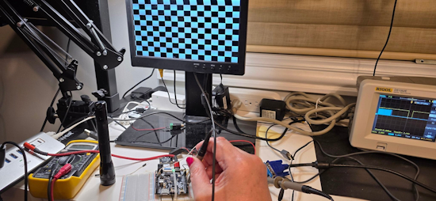](https://x.com/anne_engineer/status/2028306941747802178/photo/1)

Your editor has been working on generating VGA analog video with the RP2350B microcontroller on the Adafruit Metro RP2350 board. Hardware is no issue but software, using with CircuitPython and PIO, has it's limitations. I think CircuitPython would allow others to change things easier. But there are small PIO differences in CircuitPython and memory limitations for framebuffers. The results will be published as work progresses - [X](https://x.com/anne_engineer/status/2028306941747802178/photo/1).

text - [site](url).

"Howdy Folks, I'm Michael Pyrcz, a professor at The University of Texas at Austin, and I record all of my lectures and put them on YouTube so anyone can follow along! ...and I kept doing that, and writing a Python package, along with 2 free, online e-books, 100s of Python demonstration workflows, dozens of synthetic datasets, etc. etc." - [YouTube](https://www.youtube.com/@GeostatsGuyLectures). Via [X](https://x.com/GeostatsGuy/status/2028856248985092546).

[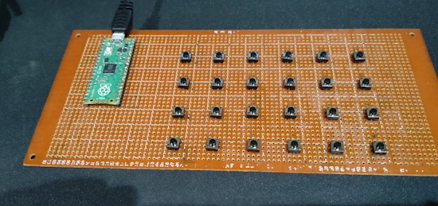](https://x.com/yosuwitter/status/2027761745012625437)

Making an input board for Minecraft with a Raspberry Pi Pico and CircuitPython - [X](https://x.com/yosuwitter/status/2027761745012625437) (Japanese).

text - [site](url).

text - [site](url).

text - [site](url).

text - [site](url).

Raspberry Pi Pico projects - [Raspberry Pi News](https://www.raspberrypi.com/news/raspberry-pi-pico-projects/).

text - [site](url).

[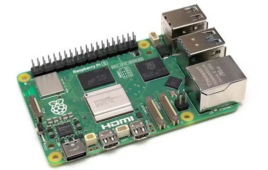](https://www.hackster.io/news/vasco-guita-gives-raspberry-pi-homelabbers-a-gift-scratch-raspberry-pi-os-docker-images-5ae595e73982)

Vasco Guita provides Raspberry Pi homelabbers a gift: scratch Raspberry Pi OS Docker images. Built from Raspberry Pi's official operating system images, these 32-bit and 64-bit images get your Docker containers up and running fast - [hackster.io](https://www.hackster.io/news/vasco-guita-gives-raspberry-pi-homelabbers-a-gift-scratch-raspberry-pi-os-docker-images-5ae595e73982).

text - [site](url).

[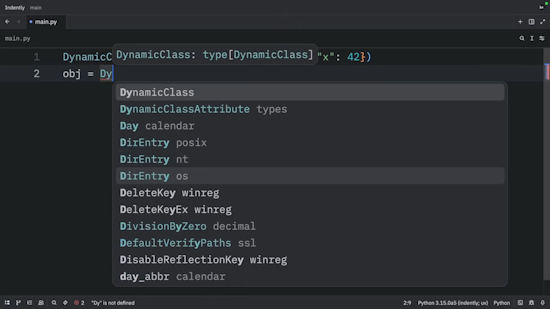](https://www.youtube.com/watch?v=gu8WI3Xs5iU)

Metaclasses in Python are awesome - [YouTube](https://www.youtube.com/watch?v=gu8WI3Xs5iU).

## New

[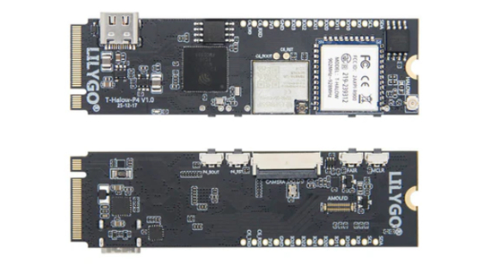](https://linuxgizmos.com/lilygo-unveils-risc-v-esp32-p4-t-halow-board-and-esp32-s3-e-paper-s3-pro-lite/)

LILYGO has released the T-Halow P4, a compact development board built around Espressif’s ESP32-P4 RISC-V SoC with integrated Wi-Fi HaLow support. The T-Halow P4 is built around the ESP32-P4, which features a dual-core 32-bit RISC-V processor running at up to 360 MHz alongside a 40 MHz low-power RISC-V coprocessor. The board includes 16MB of external NOR flash and 8MB of PSRAM - [LinuxGizmos](https://linuxgizmos.com/lilygo-unveils-risc-v-esp32-p4-t-halow-board-and-esp32-s3-e-paper-s3-pro-lite/).

[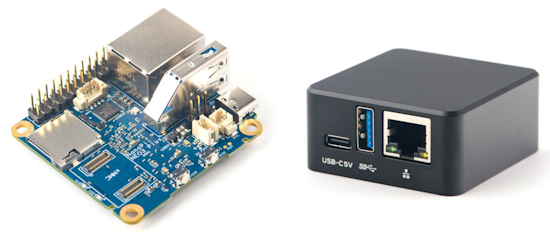](https://www.cnx-software.com/2026/03/04/nanopi-neo3-plus-a-tiny-rockchip-rk3528a-headless-sbc-with-gigabit-ethernet-usb-3-0-port-gpio-header/)

FriendlyELEC NanoPi NEO3 Plus is an ultra-compact headless SBC powered by a Rockchip RK3528A SoC paired with 1GB RAM, whose main interfaces are a Gigabit Ethernet jack, a USB 3.2 port, and a 26-pin GPIO header. Optional eMCC flash instead of SD, metal case - [CNX](https://www.cnx-software.com/2026/03/04/nanopi-neo3-plus-a-tiny-rockchip-rk3528a-headless-sbc-with-gigabit-ethernet-usb-3-0-port-gpio-header/).

## New Boards Supported by CircuitPython

The number of supported microcontrollers and Single Board Computers (SBC) grows every week. This section outlines which boards have been included in CircuitPython or added to [CircuitPython.org](https://circuitpython.org/).

This week there were (#/no) new boards added:

- [Board name](url)
- [Board name](url)
- [Board name](url)

*Note: For non-Adafruit boards, please use the support forums of the board manufacturer for assistance, as Adafruit does not have the hardware to assist in troubleshooting.*

Looking to add a new board to CircuitPython? It's highly encouraged! Adafruit has four guides to help you do so:

- [How to Add a New Board to CircuitPython](https://learn.adafruit.com/how-to-add-a-new-board-to-circuitpython/overview)
- [How to add a New Board to the circuitpython.org website](https://learn.adafruit.com/how-to-add-a-new-board-to-the-circuitpython-org-website)
- [Adding a Single Board Computer to PlatformDetect for Blinka](https://learn.adafruit.com/adding-a-single-board-computer-to-platformdetect-for-blinka)
- [Adding a Single Board Computer to Blinka](https://learn.adafruit.com/adding-a-single-board-computer-to-blinka)

## New Adafruit Learning System Guides

The [Adafruit Learning System](https://learn.adafruit.com/) has over 3,200 free guides for learning skills and building projects including using Python.

[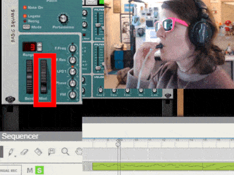](https://learn.adafruit.com/midi-breath-controller)

[MIDI Breath Controller](https://learn.adafruit.com/midi-breath-controller) from [Liz Clark](https://learn.adafruit.com/u/BlitzCityDIY)

[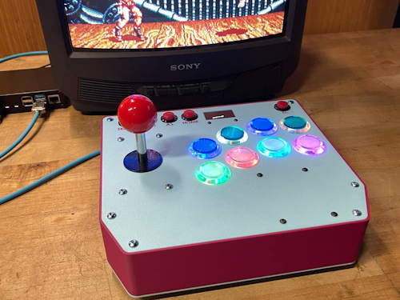](https://learn.adafruit.com/arcade-fightstick)

[Arcade Fightstick](https://learn.adafruit.com/arcade-fightstick) from [John Park](https://learn.adafruit.com/u/johnpark)

[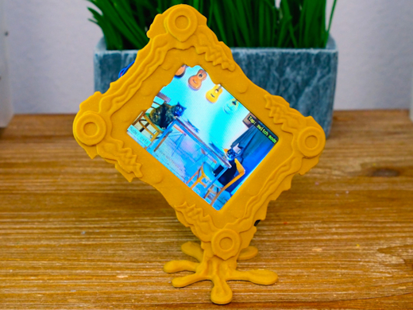](https://learn.adafruit.com/pyportal-art-display)

[Melting Picture Frame for PyPortal IoT images](https://learn.adafruit.com/pyportal-art-display) from [Ruiz Brothers](https://learn.adafruit.com/u/pixil3d)

## CircuitPython Libraries

The CircuitPython library numbers are continually increasing, while existing ones continue to be updated. Here we provide library numbers and updates!

To get the latest Adafruit libraries, download the [Adafruit CircuitPython Library Bundle](https://circuitpython.org/libraries). To get the latest community contributed libraries, download the [CircuitPython Community Bundle](https://circuitpython.org/libraries).

If you'd like to contribute to the CircuitPython project on the Python side of things, the libraries are a great place to start. Check out the [CircuitPython.org Contributing page](https://circuitpython.org/contributing). If you're interested in reviewing, check out Open Pull Requests. If you'd like to contribute code or documentation, check out Open Issues. We have a guide on [contributing to CircuitPython with Git and GitHub](https://learn.adafruit.com/contribute-to-circuitpython-with-git-and-github), and you can find us in the #help-with-circuitpython and #circuitpython-dev channels on the [Adafruit Discord](https://adafru.it/discord).

You can check out this [list of all the Adafruit CircuitPython libraries and drivers available](https://github.com/adafruit/Adafruit_CircuitPython_Bundle/blob/master/circuitpython_library_list.md). 

The current number of CircuitPython libraries is **557**!

**New Libraries**

Here are this week's new CircuitPython libraries:
* [adafruit/Adafruit_CircuitPython_Xteink_X4](https://github.com/adafruit/Adafruit_CircuitPython_Xteink_X4)

**Updated Libraries**

Here are this week's updated CircuitPython libraries:
* [adafruit/Adafruit_CircuitPython_Display_Text](https://github.com/adafruit/Adafruit_CircuitPython_Display_Text)
* [adafruit/Adafruit_CircuitPython_MatrixPortal](https://github.com/adafruit/Adafruit_CircuitPython_MatrixPortal)
* [tekktrik/CircuitPython_functools](https://github.com/tekktrik/CircuitPython_functools)

## What’s the CircuitPython team up to this week?

What is the team up to this week? Let’s check in:

**Dan**

This week I've continued to work on SD card problems. I am also fixing an issue with managing the `SPI` object used for a user-created display.

**Tim**

This week I've been digging further into a few things in `lvfontio` core module. I found that using certain fonts as the terminal font causes a hard crash and I've been learning how to use GDB and the Pico debug probe to get core stack traces and investigate variable values at the time of the crash. A different issue is causing only the half of full-width glyphs to show in the CircuitPython terminal and I've figured out the root cause of that and submitted a fix. I started a new weekly stream on the Adafruit channels at 11am Eastern on Tuesdays, this week was the first episode. During the stream I discovered the full-width glyph issue.

**Scott**

This week I'm continuing to push the Zephyr port forward on a number of fronts. First, I updated the Zephyr version we're based on to something more current. I've made progress on display support. Testing now covers different color modes of the display and passes locally. On GitHub Actions it is having trouble with SDL installation. BLE connection support is close to ready for merging. I've also just made a PR for adding memory usage to the native_sim's perfetto trace for tracking how much memory is used by CircuitPython. I've got lots of balls in the air and am doing my best to get them each across the finish line.

**Liz**

This week I've been working on adding Arduino and CircuitPython support for the Xteink X4 eReader. This eReader uses an 800x480 display and uses an ESP32-C3. The USB port allows for JTAG over USB access which makes it easy for access. Arduino support is complete with a driver for the display added to the `Adafruit_EPD` library and I have the built-in display working in CircuitPython with the init added to the board.c file. For this project I finally got CircuitPython building locally with a Docker container. I run Windows and was never able to get CircuitPython building locally before.

## Upcoming Events

PyCascades 2026 will be 20 March 2026 – 21 March 2026 in Vancouver, British Columbia, Canada - [PyCascades 2026](https://2026.pycascades.com/).

The next MicroPython Meetup in Melbourne will be on March 25th – [Luma](https://luma.com/r0rq9pl4). You can see recordings of previous meetings on [YouTube](https://www.youtube.com/@MicroPythonOfficial). 

**Other Events This Year**
* PyCon DE & PyData 2026 will be 13 April 2026 – 17 April 2026 in Darmstadt, Germany
* [PyCon US 2026](https://us.pycon.org/2026/) is May 13 - May 19, 2026 in Long Beach, California
* The Open Source Hardware Association Open Hardware Summit is coming to Berlin, Germany on May 23rd and 24th, 2026.
* EuroPython 2026 is coming to Kraków, Poland 13-19 July, 2026.
* PyOhio 2026 is from 25 July through 26 July, 2026 this year in Cleveland, USA.
* PyCon AU 2026 will be 26 Aug. 2026 – 30 Aug. 2026 in Brisbane, Australia

If you know of virtual events or upcoming events, please let us know via email to cpnews(at)adafruit(dot)com.

## Latest Releases

CircuitPython's stable release is [10.1.3](https://github.com/adafruit/circuitpython/releases/latest) and its unstable release is [10.1.0-beta.1](https://github.com/adafruit/circuitpython/releases). New to CircuitPython? Start with our [Welcome to CircuitPython Guide](https://learn.adafruit.com/welcome-to-circuitpython).

[20260305](https://github.com/adafruit/Adafruit_CircuitPython_Bundle/releases/latest) is the latest Adafruit CircuitPython library bundle.

[20260228](https://github.com/adafruit/CircuitPython_Community_Bundle/releases/latest) is the latest CircuitPython Community library bundle.

[v1.27.0](https://micropython.org/download) is the latest MicroPython release. Documentation for it is [here](http://docs.micropython.org/en/latest/pyboard/).

[3.14.3](https://www.python.org/downloads/) is the latest Python release. The latest pre-release version is [3.15.0a6](https://www.python.org/download/pre-releases/).

[4,477 Stars](https://github.com/adafruit/circuitpython/stargazers) Like CircuitPython? [Star it on GitHub!](https://github.com/adafruit/circuitpython)

## Call for Help -- Translating CircuitPython is now easier than ever

[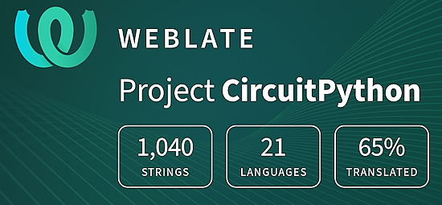](https://hosted.weblate.org/engage/circuitpython/)

One important feature of CircuitPython is translated control and error messages. With the help of fellow open source project [Weblate](https://weblate.org/), we're making it even easier to add or improve translations. 

Sign in with an existing account such as GitHub, Google or Facebook and start contributing through a simple web interface. No forks or pull requests needed! As always, if you run into trouble join us on [Discord](https://adafru.it/discord), we're here to help.

## NUMBER Thanks

The Adafruit Discord community, where we do all our CircuitPython development in the open, reached over NUMBER humans - thank you! Adafruit believes Discord offers a unique way for Python on hardware folks to connect. Join today at [https://adafru.it/discord](https://adafru.it/discord).

## ICYMI - In case you missed it

Python on hardware is the Adafruit Python video-newsletter-podcast! The news comes from the Python community, Discord, Adafruit communities and more and is broadcast on ASK an ENGINEER Wednesdays. The complete Python on Hardware weekly videocast [playlist is here](https://www.youtube.com/playlist?list=PLjF7R1fz_OOXRMjM7Sm0J2Xt6H81TdDev). The video podcast is on [iTunes](https://itunes.apple.com/us/podcast/python-on-hardware/id1451685192?mt=2), [YouTube](http://adafru.it/pohepisodes), [Instagram](https://www.instagram.com/adafruit/channel/)), and [XML](https://itunes.apple.com/us/podcast/python-on-hardware/id1451685192?mt=2).

[The weekly community chat on Adafruit Discord server CircuitPython channel - Audio / Podcast edition](https://itunes.apple.com/us/podcast/circuitpython-weekly-meeting/id1451685016) - Audio from the Discord chat space for CircuitPython, meetings are usually Mondays at 2pm ET, this is the audio version on [iTunes](https://itunes.apple.com/us/podcast/circuitpython-weekly-meeting/id1451685016), Pocket Casts, [Spotify](https://adafru.it/spotify), and [XML feed](https://adafruit-podcasts.s3.amazonaws.com/circuitpython_weekly_meeting/audio-podcast.xml).

## Contribute

The CircuitPython Weekly Newsletter is a CircuitPython community-run newsletter emailed every Monday. To contribute your content, please email your news to cpnews (at) adafruit (dot) com with information and link(s) to your content. 

Join the Adafruit [Discord](https://adafru.it/discord) or [post to the forum](https://forums.adafruit.com/viewforum.php?f=60) if you have questions.
