- [ ] Library and info updates
- [ ] change date
- [ ] update title
- [ ] Feature story
- [ ] Update  for images
- [ ] Update ICYDNCI
- [ ] All images 550w max only
- [ ] Link "View this email in your browser."

News Sources

- [Adafruit Playground](https://adafruit-playground.com/)
- Twitter: [CircuitPython](https://twitter.com/search?q=circuitpython&src=typed_query&f=live), [MicroPython](https://twitter.com/search?q=micropython&src=typed_query&f=live) and [Python](https://twitter.com/search?q=python&src=typed_query)
- [Raspberry Pi News](https://www.raspberrypi.com/news/), [Pi Foundation](https://www.raspberrypi.org/blog/)
- Mastodon [CircuitPython](https://mastodon.social/tags/CircuitPython) and [MicroPython](https://mastodon.social/tags/MicroPython)
- BlueSky [CircuitPython](https://bsky.app/search?q=circuitpython), [MicroPython](https://bsky.app/search?q=micropython), [Raspberry Pi](https://bsky.app/search?q=raspberry+pi)
- [Google News Python](https://news.google.com/topics/CAAqIQgKIhtDQkFTRGdvSUwyMHZNRFY2TVY4U0FtVnVLQUFQAQ?hl=en-US&gl=US&ceid=US%3Aen)
- YouTube: [CircuitPython](https://www.youtube.com/results?search_query=circuitpython&sp=CAI%253D), [MicroPython](https://www.youtube.com/results?search_query=micropython&sp=CAI%253D), [Prof Gallaugher](https://www.youtube.com/@BuildWithProfG/videos)
- [maker.io Python](https://www.digikey.com/en/maker/search-results?s=createdDate&t=python)
- [hackster.io CircuitPython](https://www.hackster.io/search?q=circuitpython&i=projects&sort_by=most_recent) and [MicroPython](https://www.hackster.io/search?q=micropython&i=projects&sort_by=most_recent)
- Instructables: [CircuitPython](https://www.instructables.com/search/?q=circuitpython&projects=all&sort=Newest), [MicroPython](https://www.instructables.com/search/?q=micropython&projects=all&sort=Newest), [Raspberry Pi Python](https://www.instructables.com/search/?q=raspberry+pi+python&projects=all&sort=Newest)
- [hackaday CircuitPython](https://hackaday.com/blog/?s=circuitpython) and [MicroPython](https://hackaday.com/blog/?s=micropython)
- [python.org](https://www.python.org/)
- [Python Insider - dev team blog](https://pythoninsider.blogspot.com/)
- Individuals: [bret.dk](https://bret.dk/), [Jeff Geerling](https://www.jeffgeerling.com/blog), [Yakroo](https://x.com/Yakroo5077), [coXXect](https://coxxect.blogspot.com/)
- Tom's Hardware: [CircuitPython](https://www.tomshardware.com/search?searchTerm=circuitpython&articleType=all&sortBy=publishedDate) and [MicroPython](https://www.tomshardware.com/search?searchTerm=micropython&articleType=all&sortBy=publishedDate) and [Raspberry Pi](https://www.tomshardware.com/search?searchTerm=raspberry%20pi&articleType=all&sortBy=publishedDate)
- [hackaday.io newest projects MicroPython](https://hackaday.io/projects?tag=micropython&sort=date) and [CircuitPython](https://hackaday.io/projects?tag=circuitpython&sort=date)
- hackaday.io - [CircuitPython](https://hackaday.io/search?term=circuitpython) and [MicroPython](https://hackaday.io/search?term=micropython)
- [MicroPython Meeting](https://luma.com/micropython?k=c)

View this email in your browser. **Warning: Flashing Imagery**

Welcome to the latest Python on Microcontrollers newsletter! *insert 2-3 sentences from editor (what's in overview, banter)* - *Anne Barela, Editor*

We're on [Discord](https://discord.gg/HYqvREz), [Twitter/X](https://twitter.com/search?q=circuitpython&src=typed_query&f=live), [BlueSky](https://bsky.app/profile/circuitpython.org) and for past newsletters - [view them all here](https://www.adafruitdaily.com/category/circuitpython/). If you're reading this on the web, please [subscribe here](https://www.adafruitdaily.com/). Here's the news this week:

## CircuitPython 10.1.4 Released

CircuitPython 10.1.4 is the latest bugfix revision of CircuitPython and is a new stable release - [Adafruit Blog](https://blog.adafruit.com/2026/03/09/circuitpython-10-1-4-released/) and [Release Notes](https://github.com/adafruit/circuitpython/releases/tag/10.1.4).

**Highlights of this Release**

* Fix pin-reset regression which caused display problems on some boards.
* Fix object creation and deinitialization problems, most notably when SPI was used for displays on SAMD.

## The Raspberry Pi CM0 module Is Seen in New Products

The mysterious Raspberry Pi CM0 module, only available to Chinese manufacturers, is showing up in some new products being announced or shipped.

[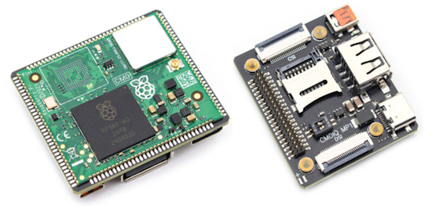](https://linuxgizmos.com/tiny-cm0iq-board-runs-raspberry-pi-cm0-module-with-hdmi-and-csi/)

The Makerfabs CM0IQ is a compact carrier board designed for the Raspberry Pi CM0 compute module and measures a petite 42 × 36 mm. It has a micro-HDMI connector plus camera and display expansion via four-lane MIPI-CSI and four-lane MIPI-DSI connectors. The board also includes a USB-A host port, a USB-C connector for power and gadget mode, and a microSD card slot for storage - [LinuixGizmos](https://linuxgizmos.com/tiny-cm0iq-board-runs-raspberry-pi-cm0-module-with-hdmi-and-csi/) and [CNX](https://www.cnx-software.com/2026/03/10/makerfabs-cm0iq-ultra-compact-42x36mm-raspberry-pi-cm0-lite-board/).

[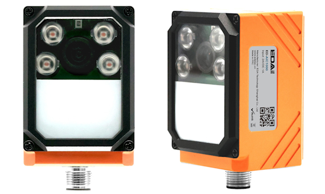](https://www.cnx-software.com/2026/03/11/raspberry-pi-cm0-based-industrial-ai-camera-features-motorized-auto-focus-system-12-pin-ethernet-rs-232-do-aviation-connector/)

EDATEC launched the ED-AIC1000, a compact industrial AI camera built around the Raspberry Pi CM0 and designed for machine vision and industrial automation applications, such as quality inspection, object detection, and production-line monitoring. It has a 1.3 MP global-shutter camera with a 120 FPS sampling, motorized autofocus M12 lenses, and three independent lighting zones. The camera also integrates a 12-pin M12 industrial connector with 24 V power input, 100 Mbps Ethernet, RS-232, a trigger input, and an isolated digital output. The system supports H.264 encoding/decoding up to 1080p - [CNX](https://www.cnx-software.com/2026/03/11/raspberry-pi-cm0-based-industrial-ai-camera-features-motorized-auto-focus-system-12-pin-ethernet-rs-232-do-aviation-connector/).

## uPyPi: A PyPI-like MicroPython Package Repository

uPyPi is a dedicated package management hub for the MicroPython ecosystem, designed to simplify the discovery, sharing, and deployment of MicroPython libraries and drivers - [MicroPython GitHub](https://github.com/orgs/micropython/discussions/18904).

**Core Features**

1. Package Management: A PyPI-inspired repository where you can upload, browse, download, and manage your MicroPython packages.
1. JSON Metadata Parsing: All packages require a package.json file to define essential metadata (e.g., name, version), ensuring consistency and compatibility.
1. Bilingual Support: Full Chinese/English interface toggle for global accessibility.
1. Chip & Firmware Filtering: Discover packages tailored to specific hardware (e.g., RP2040) and firmware environments.
1. Personal Dashboard: Track and manage all your uploaded packages in one place, with a clear overview of your contributions.

## Ruby Sinking in Popularity, Buried by Python

The Ruby language has been around since 1995 and still gets regular releases. But the language has dropped to 30th place in this month’s [Tiobe index](https://www.tiobe.com/tiobe-index/) of language popularity, with Python cited as a reason for Ruby’s drop. “The main reason for Ruby’s drop is Python’s popularity. There is no need for Ruby anymore,” Jansen said. Ruby’s highest position was an eighth place ranking in May 2016 - [InfoWorld](https://www.infoworld.com/article/4142618/ruby-sinking-in-popularity-buried-by-python-tiobe.html).

## Arduino’s New VENTUNO Q Single Board Computer Runs Ubuntu 

[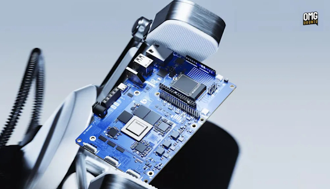](https://www.omgubuntu.co.uk/2026/03/arduino-ventuno-q-ubuntu-edge-ai-board)

Qualcomm subsidiary Arduino has announced the VENTUNO Q, a new single-board computer that ships with Ubuntu pre-installed. This is catering to the demands of AI workloads at the edge: robotics, industrial automation, computer vision. The Ventuno Q is built around Qualcomm’s Dragonwing IQ-8275 processor with CPU, GPU and NPU, which delivers 40 TOPS of AI compute to run large language models, visual language models and computer vision workloads on-device.

It comes with 16GB of LPDDR5 RAM – double what you get on the comparable Jetson Orin Nano Super – and 64GB of eMMC storage. There’s also an M.2 slot for NVMe expansion, Wi-Fi 6, Bluetooth 5.3 and 2.5Gb Ethernet - [OMGubuntu](https://www.omgubuntu.co.uk/2026/03/arduino-ventuno-q-ubuntu-edge-ai-board), [YouTube](https://www.youtube.com/watch?v=Vd0qkHzCBLQ) and [Qualcomm](https://www.qualcomm.com/news/releases/2026/03/arduino-announces-arduino-ventuno-q----powered-by-qualcomm-drago).

## The 2026 eChallengeCoin Choose Your Own Charity drive

[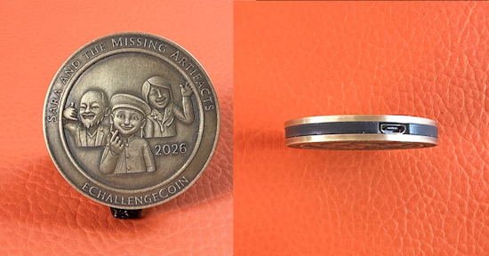](https://aosc.cc/eccn2026)

Sara Cladlow strikes again in this challenge coin manufactured by Bradán Lane Studios. Running CircuitPython, there is an Adventure game that takes the crew to the British Museum in London: 'Sara and the Missing Artifacts'. Coins can be obtained via a donation to a youth STEAM charity of your choice - [aosc.cc](https://aosc.cc/eccn2026).

## This Week's Python Streams

Python on Hardware is all about building a cooperative ecosphere which allows contributions to be valued and to grow knowledge. Below are the streams within the last week focusing on the community.

**CircuitPython Deep Dive Stream**

[Last Friday](https://youtube.com/live/qwN_OBS1KYs), Scott streamed work on Zephyr `displayio` and CI.

You can see the latest video and past videos on the Adafruit YouTube channel under the Deep Dive playlist - [YouTube](https://www.youtube.com/playlist?list=PLjF7R1fz_OOXBHlu9msoXq2jQN4JpCk8A).

**CircuitPython Parsec**

John Park’s CircuitPython Parsec this week is the Trellis MIDI Note Visualizer - [Adafruit Blog](https://blog.adafruit.com/2026/03/13/john-parks-circuitpython-parsec-trellis-midi-note-visualizer/) and [YouTube](https://youtu.be/4-zGlP0UESg).

Catch all the episodes in the [YouTube playlist](https://www.youtube.com/playlist?list=PLjF7R1fz_OOWFqZfqW9jlvQSIUmwn9lWr).

## The CircuitPython Show

Paul welcomes Michelle Hui and Reitweic Shandilya to the show, both of whom are master’s students at Cornell Tech. Michelle and Reitweic share the Open Pressure Sensor, an open source medical device that helps physicians assist mastectomy patients which uses CircuitPython as its firmware – [The CircuitPython Show](https://www.circuitpythonshow.com/@circuitpythonshow).

**CircuitPython Weekly Meeting**

CircuitPython Weekly Meeting for March 9, 2026 ([notes](https://github.com/adafruit/adafruit-circuitpython-weekly-meeting/blob/main/2026/2026-03-09.md)) [on YouTube](https://youtu.be/pSYocIK_oT4).

## Project of the Week: Orbigator - An Open Source, Physical Satellite Tracker

The Orbigator is an open-source, physical satellite tracker that turns complex orbital mechanics into a desk-side companion. It is powered by the Raspberry Pi Pico 2 and precision DYNAMIXEL servos running MicroPython. It physically points to the ISS (or any satellite) in real-time with zero drift - [GitHub](https://github.com/wyolum/orbigator) and [Hackaday](https://hackaday.com/2026/03/09/real-time-iss-tracker-shows-off-the-goods/). Via [Adafruit Blog](https://blog.adafruit.com/2026/03/09/orbigator-is-an-open-source-physical-satellite-tracker/).

## Popular Last Week

What was the most popular, most clicked link, in [last week's newsletter](https://www.adafruitdaily.com/2026/03/09/python-on-microcontrollers-newsletter-triaging-micropython-a-new-circuitpython-ide-micropython-openclaw-and-more-circuitpython-python-micropython-thepsf-raspberry_pi/)? [The Big Book of Small Python Projects](https://inventwithpython.com/bigbookpython/).

Did you know you can read past issues of this newsletter in the Adafruit Daily Archive? [Check it out](https://www.adafruitdaily.com/category/circuitpython/).

## Publish Your Project as Notes on Adafruit Playground

[Adafruit Playground](https://adafruit-playground.com/) is a place for the community to post their projects and other making tips/tricks/techniques. Ad-free, it's an easy way to publish your work in a safe space for free.

## News From Around the Web

[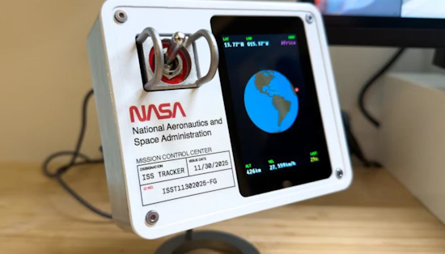](https://www.xda-developers.com/you-too-can-build-this-awesome-iss-tracker-with-a-raspberry-pi/)

A Raspberry Pi 3B coded in Python is at the heart of a real time tracker for the International Space Station. Tracker shows the station’s real-time position on a globe and, with a flip of a toggle switch, displays who’s currently in space. The whole thing is designed to look like a module you’d find on a NASA control panel - [Project Page](https://filbot.com/international-space-station-tracker/), [Reddit](https://www.reddit.com/r/raspberry_pi/comments/1rr89t0/tracking_the_iss_on_an_old_pi/), [XDA](https://www.xda-developers.com/you-too-can-build-this-awesome-iss-tracker-with-a-raspberry-pi/) and [GitHub](https://github.com/filbot/iss-tracker).

[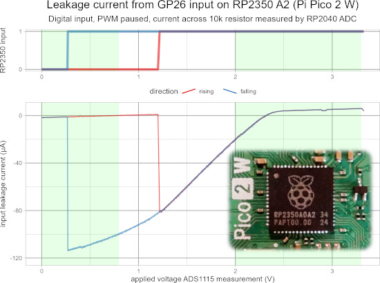](https://www.instructables.com/RP2350-Input-Leakage-Current-Testing-Pi-Pico-2/)

Using a Pi Pico W with the Kitronik Inventor's Kit and a simple CircuitPython program to measure the RP2350 A2 Erratum 9 input current leakage on a Pi Pico 2 W ([fixed in A3/A4](https://www.raspberrypi.com/news/rp2350-a4-rp2354-and-a-new-hacking-challenge)), includes comparison with TI ADS1115 - [Instructables](https://www.instructables.com/RP2350-Input-Leakage-Current-Testing-Pi-Pico-2/).

[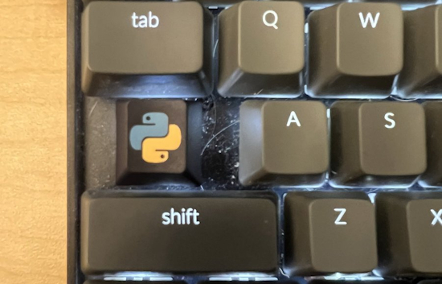](https://x.com/tpotasuka/status/2031831344964149258)

The inventor of Python, Guido van Rossum, posts a keyboard modified to have a dedicated Python button - [X](https://x.com/tpotasuka/status/2031831344964149258).

[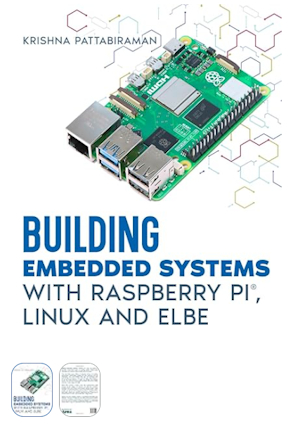](https://www.linkedin.com/posts/krishna-pattabiraman-94726b55_embeddedlinux-embeddedsystems-linux-share-7436702769887215616-EcMX/)

A new book is out: *Building Embedded Systems with Linux, Raspberry Pi and ELBE*. The book focuses on practical ways to build reproducible embedded Linux systems using Raspberry Pi, Debian and the ELBE build environment. It’s written for engineers, developers, and anyone interested in embedded Linux development - [LinkedIn](https://www.linkedin.com/posts/krishna-pattabiraman-94726b55_embeddedlinux-embeddedsystems-linux-share-7436702769887215616-EcMX/) and [Amazon](https://www.amazon.com/dp/3982834406).

[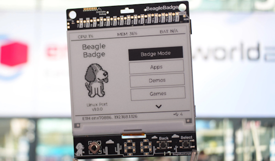](https://www.cnx-software.com/2026/03/10/beaglebadge-a-linux-powered-4-2-inch-epaper-badge-based-on-ti-sitara-am62l32-soc/)

BeagleBadge – a Linux-powered 4.2-inch ePaper badge based on TI Sitara AM62L32 SoC. It supports Linux and Zephyr base ports with mainline roadmaps, leverages LVGL and MicroPython libraries for the interactive ePaper display, and includes an App store for programming - [CNX](https://www.cnx-software.com/2026/03/10/beaglebadge-a-linux-powered-4-2-inch-epaper-badge-based-on-ti-sitara-am62l32-soc/).

[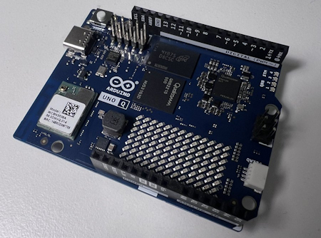](https://blog.adafruit.com/2026/03/09/every-single-board-computer-sbc-bret-tested-in-2025/)

Every single board computer (SBC) Bret.dk tested in 2025 - [bret.dk](https://bret.dk/every-single-board-computer-i-tested-in-2025/) and [sbc.compare](https://sbc.compare/). Via [Adafruit Blog](https://blog.adafruit.com/2026/03/09/every-single-board-computer-sbc-bret-tested-in-2025/).

[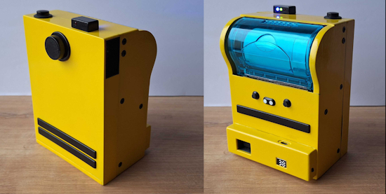](https://blog.adafruit.com/2026/03/09/making-a-poor-mans-polaroid-raspberry_pi/)

The Poor Man’s Polaroid project: this is an instant camera that uses thermal printer to print photos, the same one that prints your receipts at the store. Photos aren’t the same quality as the self developing film that polaroid uses, but they do have charm to them. It uses a Raspberry Pi Zero and camera with a small thermal printer. Parts are 3D printed and the code is in Python - [boxart.it](https://boxart.lt/blog/poor_mans_polaroid?locale=en). Via [Adafruit Blog](https://blog.adafruit.com/2026/03/09/making-a-poor-mans-polaroid-raspberry_pi/).

[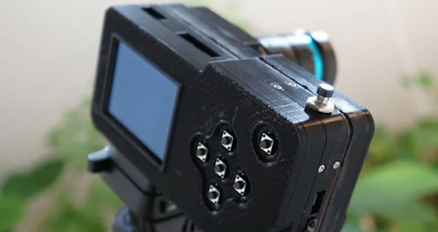](https://hackaday.com/2026/03/08/experiment-with-the-pi-camera-the-modular-way/)

Experiment with a Raspberry Pi camera the modular way, with Python - [Hackaday](https://hackaday.com/2026/03/08/experiment-with-the-pi-camera-the-modular-way/), [YouTube](https://youtu.be/CjwxFNUQzx0) and [GitHub](https://github.com/jdc-cunningham/modular-pi-cam).

[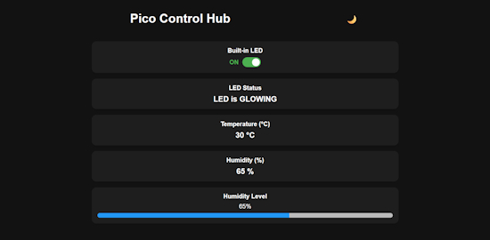](https://github.com/kritishmohapatra/micropidash)

micropidash, by Kritish Mohapatra, is a high-performance, asynchronous MicroPython web dashboard library specifically designed for microcontrollers like the Raspberry Pi Pico 2W (RP2350/RP2040) and ESP32. It enables the creation of real-time, responsive web interfaces for IoT projects using minimal MicroPython code - [GitHub](https://github.com/kritishmohapatra/micropidash). Via [X](https://x.com/0D_KR/status/2032407340226691264).

Cooper Dalrymple (relic-se) has created CircuitPython [software](https://github.com/relic-se/CircuitPython_Synthiota_Drone) for Tod Kurt's (todbot) [Synthiota](https://github.com/todbot/synthiota) music synth - [MatrixSynth](https://www.matrixsynth.com/2026/03/synthiota-circuitpython-drone.html). Via [X](https://x.com/matrixsynth/status/2032154305147650104) and [YouTube](https://youtu.be/6BZpOSAVj14).

KiCad Version 10.0.0 Release Candidate 2 available - [KiCad](https://www.kicad.org/blog/2026/03/KiCad-Version-10.0.0-Release-Candidate-2-Available/).

[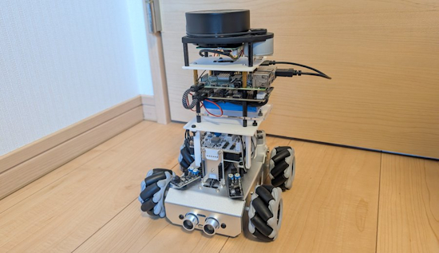](https://x.com/murasametech/status/2030116237250789575)

A new robot with Raspberry Pi. It's to the point where it automatically generates a room map using LiDAR. It is using Python on ROS2 (Robot Operating System 2) and SLAM. When the robot moves and scansa with LiDAR, slam_toolbox estimates the positions of walls and obstacles and generates a 2D map. Visualizing it in RViz2, you can see your room's layout being drawn in real-time - [X](https://x.com/murasametech/status/2030116237250789575)

**Configuration**

* Raspberry Pi 4 → The robot's brain (ROS2 Jazzy)
* SLAMTEC A1M8 LiDAR → 360-degree distance measurement
* ICM42688-P IMU → Detection of orientation and acceleration
* DC motor × 2 + L298N → Drive control
* Battery-powered → Cable-free movement

[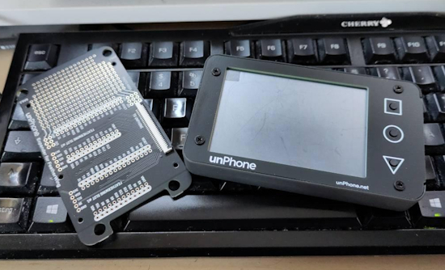](https://github.com/MicroPythonOS/MicroPythonOS/pull/74)

MicroPythonOS  adds preliminary support for the unPhone 9 - [GitHub](https://github.com/MicroPythonOS/MicroPythonOS/pull/74). Via [Mastodon](https://mastodon.social/@jedie@chaos.social/116186758787439710) (German).

text - [site](url).

text - [site](url).

Python essentials for AI Agents, a tutorial - [YouTube](https://youtu.be/UsfpzxZNsPo?si=72s6GrU0_xbQM0e3). Via [X](https://x.com/PythonHub/status/2030059643947319583).

The best Python libraries for Cybersecurity: 2026 Edition - [Analytics Insight](https://www.analyticsinsight.net/cybersecurity/best-python-libraries-for-cybersecurity-2026-edition).

## New

[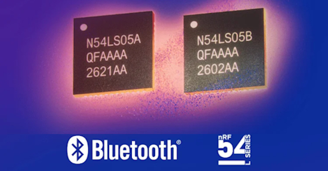](https://www.nordicsemi.com/Nordic-news/2026/03/Nordic-Semiconductor-expands-nRF54L-Series-with-entry-level-Bluetooth-LE-SoCs)

Nordic Semiconductor expands the nRF54L series microcontrollers with two entry-level Bluetooth LE systems-on-chip (SoC), the ultra-low-power Bluetooth® Low Energy (LE) nRF54LS05A and nRF54LS05B. Both can serve as the main wireless SoC in single-chip systems, or operate as Bluetooth LE companion devices in multi-chip systems. They offer 128 MHz Arm® Cortex® M33 cores with robust Bluetooth LE connectivity, ultra-low-power consumption, and easy-to-use software - [Nordic](https://www.nordicsemi.com/Nordic-news/2026/03/Nordic-Semiconductor-expands-nRF54L-Series-with-entry-level-Bluetooth-LE-SoCs). Via [Adafruit Blog](https://blog.adafruit.com/2026/03/10/nordic-semiconductor-expands-nrf54l-series-with-entry-level-bluetooth-le-socs/)

[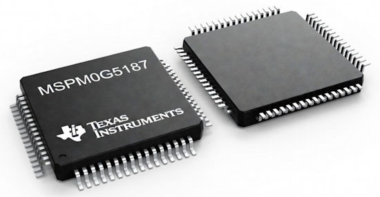](https://www.cnx-software.com/2026/03/11/texas-instruments-mspm0g5187-and-am13ex-mcus-integrate-tinyengine-npu-for-edge-ai-applications/)

Texas Instruments MSPM0G5187 and AM13Ex are two new microcontroller (MCU) families featuring the company’s  TinyEngine neural processing unit (NPU) to enable low-latency, high-efficiency Edge AI/Machine Learning inference. The MSPM0G5187 is a general-purpose, low-power Arm Cortex-M0+ MCU, while the AM13Ex Arm Cortex-M33 microcontroller targets real-time motor control, starting with the AM13E23019 - [CNX](https://www.cnx-software.com/2026/03/11/texas-instruments-mspm0g5187-and-am13ex-mcus-integrate-tinyengine-npu-for-edge-ai-applications/).

[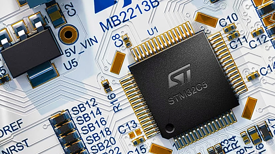](https://www.cnx-software.com/2026/03/09/stmicro-stm32c5-entry-level-144-mhz-cortex-m33-mcu-features-up-to-1mb-flash-256kb-sram-ethernet-can-bus/)

The entry-level STM32C5 Arm Cortex-M33 MCU family is designed for industrial sensors, smart home devices, electronic locks, thermostats, wearables, robotic actuators, and computer peripherals. The MCUs are manufactured using ST’s 40 nm flash process, clocked at up to 144 MHz, and feature 128 KB to 1 MB of flash and up to 256 KB of SRAM, with a dynamic power consumption of <80 µA/MHz. They include Ethernet, USB, OctoSPI, CAN bus, DMA, and various peripherals, including ADCs, comparators, and an op-amp - [CNX](https://www.cnx-software.com/2026/03/09/stmicro-stm32c5-entry-level-144-mhz-cortex-m33-mcu-features-up-to-1mb-flash-256kb-sram-ethernet-can-bus/). Via [X](https://x.com/cnxsoft/status/2030865823779410079).

## New Boards Supported by CircuitPython

The number of supported microcontrollers and Single Board Computers (SBC) grows every week. This section outlines which boards have been included in CircuitPython or added to [CircuitPython.org](https://circuitpython.org/).

This week there were four new boards added:

- [cezerio mini dev ESP32C6 by cezerio](https://circuitpython.org/board/cezerio_mini_dev_esp32c6/)
- [Pimoroni Explorer (RP2350) by Pimoroni](https://circuitpython.org/board/pimoroni_explorer2350/)
- [Thumby by TinyCircuit](https://circuitpython.org/board/tinycircuits_thumby/)
- [Thumby Color by TinyCircuits](https://circuitpython.org/board/tinycircuits_thumby_color/)

*Note: For non-Adafruit boards, please use the support forums of the board manufacturer for assistance, as Adafruit does not have the hardware to assist in troubleshooting.*

Looking to add a new board to CircuitPython? It's highly encouraged! Adafruit has four guides to help you do so:

- [How to Add a New Board to CircuitPython](https://learn.adafruit.com/how-to-add-a-new-board-to-circuitpython/overview)
- [How to add a New Board to the circuitpython.org website](https://learn.adafruit.com/how-to-add-a-new-board-to-the-circuitpython-org-website)
- [Adding a Single Board Computer to PlatformDetect for Blinka](https://learn.adafruit.com/adding-a-single-board-computer-to-platformdetect-for-blinka)
- [Adding a Single Board Computer to Blinka](https://learn.adafruit.com/adding-a-single-board-computer-to-blinka)

## New Adafruit Learning System Guides

The [Adafruit Learning System](https://learn.adafruit.com/) has over 3,200 free guides for learning skills and building projects including using Python.

[title](url) from [name](url)

[title](url) from [name](url)

[title](url) from [name](url)

## Updated Learn Guides

[title](url)

## CircuitPython Libraries

The CircuitPython library numbers are continually increasing, while existing ones continue to be updated. Here we provide library numbers and updates!

To get the latest Adafruit libraries, download the [Adafruit CircuitPython Library Bundle](https://circuitpython.org/libraries). To get the latest community contributed libraries, download the [CircuitPython Community Bundle](https://circuitpython.org/libraries).

If you'd like to contribute to the CircuitPython project on the Python side of things, the libraries are a great place to start. Check out the [CircuitPython.org Contributing page](https://circuitpython.org/contributing). If you're interested in reviewing, check out Open Pull Requests. If you'd like to contribute code or documentation, check out Open Issues. We have a guide on [contributing to CircuitPython with Git and GitHub](https://learn.adafruit.com/contribute-to-circuitpython-with-git-and-github), and you can find us in the #help-with-circuitpython and #circuitpython-dev channels on the [Adafruit Discord](https://adafru.it/discord).

You can check out this [list of all the Adafruit CircuitPython libraries and drivers available](https://github.com/adafruit/Adafruit_CircuitPython_Bundle/blob/master/circuitpython_library_list.md). 

The current number of CircuitPython libraries is **560**!

**New Libraries**

Here are this week's new CircuitPython libraries:

* [adafruit/Adafruit_CircuitPython_Xteink_X4](https://github.com/adafruit/Adafruit_CircuitPython_Xteink_X4)
* [adafruit/Adafruit_CircuitPython_AS7331](https://github.com/adafruit/Adafruit_CircuitPython_AS7331)
* [adafruit/Adafruit_CircuitPython_SSD1677](https://github.com/adafruit/Adafruit_CircuitPython_SSD1677)

**Updated Libraries**

Here is this week's updated CircuitPython library:

* [adafruit/Adafruit_CircuitPython_APDS9999](https://github.com/adafruit/Adafruit_CircuitPython_APDS9999)

## What’s the CircuitPython team up to this week?

What is the team up to this week? Let’s check in:

**Dan**

I released CircuitPython 10.1.4 last week, with some important fixes for specific problems. I'm finishing up a PR that redoes aspects of SD card support to make it share time better with other tasks that are running. I've also started merging MicroPython v1.27 into CircuitPython.

**Tim**

I've been working on CircuitPython drivers and Adafruit Learning System guides for new sensor breakouts this week. The APDS9999 guide is published now, and I am working on the AS7343 next. While working on these I have been continuing to experiment and enhance a circuitpython-runner agent skill for allowing LLM agents to run code on a connected CircuitPython device and see the results. This runner skill makes it easy to run an array of tests to validate that the driver is behaving as expected.

**Scott**

This week I haven't gotten a ton done due to illness. Mainly I've been working to finish the Zephyr `displayio` support. I had the tests working locally but the old Ubuntu on GitHub actions didn't work due to different SDL versions. So, I've been experimenting with containers for running Zephyr builds and CI. This allows us to use a newer Ubuntu at the cost of container complexity.

**Liz**

This week I worked on a guide for the [Adafruit AS7331 UV / UVA / UVB / UVC Sensor](https://learn.adafruit.com/adafruit-as7331-uv-uva-uvb-uvc-sensor). This sensor is able to read all three bands of UV light. I also wrote a CircuitPython driver for the breakout based on the Arduino driver.

The other thing I've been working on is getting CircuitPython running on an Xteink X4 eReader. This device uses an ESP32-C3 and has a built-in eInk display. I was able to get the display to init via the board.c file in the board def. It was the first time I had worked on a more involved board.c file and when I saw the REPL show up on the display after loading the CircuitPython .BIN file I felt really accomplished.

## Upcoming Events

PyCascades 2026 will be 20 March 2026 – 21 March 2026 in Vancouver, British Columbia, Canada - [PyCascades 2026](https://2026.pycascades.com/).

The next MicroPython Meetup in Melbourne will be on March 25th – [Luma](https://luma.com/r0rq9pl4). You can see recordings of previous meetings on [YouTube](https://www.youtube.com/@MicroPythonOfficial). 

**Other Events This Year**
* [PyCon DE & PyData 2026](https://2026.pycon.de/) will be 13 April 2026 – 17 April 2026 in Darmstadt, Germany
* [PyCon US](https://us.pycon.org/2026/) is May 13 - May 19, 2026 in Long Beach, California
* [The Open Source Hardware Association Open Hardware Summit](https://oshwa.org/announcements/the-2026-open-hardware-summit-schedule-is-out/) is coming to Berlin, Germany on May 23rd and 24th, 2026.
* [EuroPython 2026](https://ep2026.europython.eu/) is coming to Kraków, Poland 13-19 July, 2026.
* [PyOhio 2026](https://www.pyohio.org/2026/) is from 25 July through 26 July, 2026 this year in Cleveland, USA.
* [PyCon AU 2026](https://2026.pycon.org.au/) will be 26 Aug. 2026 – 30 Aug. 2026 in Brisbane, Australia

If you know of virtual events or upcoming events, please let us know via email to cpnews(at)adafruit(dot)com.

## Latest Releases

CircuitPython's stable release is [10.1.4](https://github.com/adafruit/circuitpython/releases/latest) and its unstable release is [10.2.0-alpha.1](https://github.com/adafruit/circuitpython/releases). New to CircuitPython? Start with our [Welcome to CircuitPython Guide](https://learn.adafruit.com/welcome-to-circuitpython).

[20260311](https://github.com/adafruit/Adafruit_CircuitPython_Bundle/releases/latest) is the latest Adafruit CircuitPython library bundle.

[20260228](https://github.com/adafruit/CircuitPython_Community_Bundle/releases/latest) is the latest CircuitPython Community library bundle.

[v1.27.0](https://micropython.org/download) is the latest MicroPython release. Documentation for it is [here](http://docs.micropython.org/en/latest/pyboard/).

[3.14.3](https://www.python.org/downloads/) is the latest Python release. The latest pre-release version is [3.15.0a7](https://www.python.org/download/pre-releases/).

[4,477 Stars](https://github.com/adafruit/circuitpython/stargazers) Like CircuitPython? [Star it on GitHub!](https://github.com/adafruit/circuitpython

## Call for Help -- Translating CircuitPython is now easier than ever

[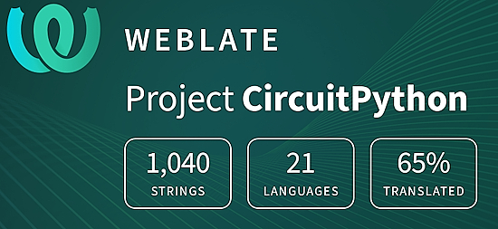](https://hosted.weblate.org/engage/circuitpython/)

One important feature of CircuitPython is translated control and error messages. With the help of fellow open source project [Weblate](https://weblate.org/), we're making it even easier to add or improve translations. 

Sign in with an existing account such as GitHub, Google or Facebook and start contributing through a simple web interface. No forks or pull requests needed! As always, if you run into trouble join us on [Discord](https://adafru.it/discord), we're here to help.

## 39,080 Thanks

The Adafruit Discord community, where we do all our CircuitPython development in the open, reached over 39,080 humans - thank you! Adafruit believes Discord offers a unique way for Python on hardware folks to connect. Join today at [https://adafru.it/discord](https://adafru.it/discord).

## ICYMI - In case you missed it

Python on hardware is the Adafruit Python video-newsletter-podcast! The news comes from the Python community, Discord, Adafruit communities and more and is broadcast on ASK an ENGINEER Wednesdays. The complete Python on Hardware weekly videocast [playlist is here](https://www.youtube.com/playlist?list=PLjF7R1fz_OOXRMjM7Sm0J2Xt6H81TdDev). The video podcast is on [iTunes](https://itunes.apple.com/us/podcast/python-on-hardware/id1451685192?mt=2), [YouTube](http://adafru.it/pohepisodes), [Instagram](https://www.instagram.com/adafruit/channel/)), and [XML](https://itunes.apple.com/us/podcast/python-on-hardware/id1451685192?mt=2).

[The weekly community chat on Adafruit Discord server CircuitPython channel - Audio / Podcast edition](https://itunes.apple.com/us/podcast/circuitpython-weekly-meeting/id1451685016) - Audio from the Discord chat space for CircuitPython, meetings are usually Mondays at 2pm ET, this is the audio version on [iTunes](https://itunes.apple.com/us/podcast/circuitpython-weekly-meeting/id1451685016), Pocket Casts, [Spotify](https://adafru.it/spotify), and [XML feed](https://adafruit-podcasts.s3.amazonaws.com/circuitpython_weekly_meeting/audio-podcast.xml).

## Contribute

The CircuitPython Weekly Newsletter is a CircuitPython community-run newsletter emailed every Monday. To contribute your content, please email your news to cpnews (at) adafruit (dot) com with information and link(s) to your content. 

Join the Adafruit [Discord](https://adafru.it/discord) or [post to the forum](https://forums.adafruit.com/viewforum.php?f=60) if you have questions.
