- [ ] Library and info updates
- [ ] change date
- [ ] update title
- [ ] Feature story
- [ ] Update  for images
- [ ] Update ICYDNCI
- [ ] All images 550w max only
- [ ] Link "View this email in your browser."

News Sources

- [Adafruit Playground](https://adafruit-playground.com/)
- Twitter: [CircuitPython](https://twitter.com/search?q=circuitpython&src=typed_query&f=live), [MicroPython](https://twitter.com/search?q=micropython&src=typed_query&f=live) and [Python](https://twitter.com/search?q=python&src=typed_query)
- [Raspberry Pi News](https://www.raspberrypi.com/news/), [Pi Foundation](https://www.raspberrypi.org/blog/)
- Mastodon [CircuitPython](https://mastodon.social/tags/CircuitPython) and [MicroPython](https://mastodon.social/tags/MicroPython)
- BlueSky [CircuitPython](https://bsky.app/search?q=circuitpython), [MicroPython](https://bsky.app/search?q=micropython), [Raspberry Pi](https://bsky.app/search?q=raspberry+pi)
- [Google News Python](https://news.google.com/topics/CAAqIQgKIhtDQkFTRGdvSUwyMHZNRFY2TVY4U0FtVnVLQUFQAQ?hl=en-US&gl=US&ceid=US%3Aen)
- YouTube: [CircuitPython](https://www.youtube.com/results?search_query=circuitpython&sp=CAISBAgDEAE%253D), [MicroPython](https://www.youtube.com/results?search_query=micropython&sp=CAISBAgDEAE%253D), [Prof Gallaugher](https://www.youtube.com/@BuildWithProfG/videos)
- [maker.io Python](https://www.digikey.com/en/maker/search-results?s=createdDate&t=python)
- [hackster.io CircuitPython](https://www.hackster.io/search?q=circuitpython&i=projects&sort_by=most_recent) and [MicroPython](https://www.hackster.io/search?q=micropython&i=projects&sort_by=most_recent)
- Instructables: [CircuitPython](https://www.instructables.com/search/?q=circuitpython&projects=all&sort=Newest), [MicroPython](https://www.instructables.com/search/?q=micropython&projects=all&sort=Newest), [Raspberry Pi Python](https://www.instructables.com/search/?q=raspberry+pi+python&projects=all&sort=Newest)
- [hackaday CircuitPython](https://hackaday.com/blog/?s=circuitpython) and [MicroPython](https://hackaday.com/blog/?s=micropython)
- [python.org](https://www.python.org/)
- [Python Insider - dev team blog](https://pythoninsider.blogspot.com/)
- Individuals: [bret.dk](https://bret.dk/), [Jeff Geerling](https://www.jeffgeerling.com/blog), [Yakroo](https://x.com/Yakroo5077), [coXXect](https://coxxect.blogspot.com/)
- Tom's Hardware: [CircuitPython](https://www.tomshardware.com/search?searchTerm=circuitpython&articleType=all&sortBy=publishedDate) and [MicroPython](https://www.tomshardware.com/search?searchTerm=micropython&articleType=all&sortBy=publishedDate) and [Raspberry Pi](https://www.tomshardware.com/search?searchTerm=raspberry%20pi&articleType=all&sortBy=publishedDate)
- [hackaday.io newest projects MicroPython](https://hackaday.io/projects?tag=micropython&sort=date) and [CircuitPython](https://hackaday.io/projects?tag=circuitpython&sort=date)
- hackaday.io - [CircuitPython](https://hackaday.io/search?term=circuitpython) and [MicroPython](https://hackaday.io/search?term=micropython)
- [MicroPython Meeting](https://luma.com/micropython?k=c)

View this email in your browser. **Warning: Flashing Imagery**

Welcome to the latest Python on Microcontrollers newsletter! The last issue was rather traditional in respect to the news. This week there appears a bounty of content where Python intersects AI and LLMs. Not in an evil "AI will write all code" but in a benevolent "LLMs can help you do things better" approach. Examples: GitHub scans to ensure your private secrets.txt or settings.toml are not uploaded. Or connecting your oscilloscope to your computer so Claude Code can see I2C timings in MicroPython. And AI can review your project and help with the documentation. You're still in the loop, AI is helping. Beyond all that is the usual cornucopia of Python/MicroPython/CircuitPython goodness you have ccome to expect each week, hand curated by your editor. - *Anne Barela, Editor*

We're on [Discord](https://discord.gg/HYqvREz), [Twitter/X](https://twitter.com/search?q=circuitpython&src=typed_query&f=live), [BlueSky](https://bsky.app/profile/circuitpython.org) and for past newsletters - [view them all here](https://www.adafruitdaily.com/category/circuitpython/). If you're reading this on the web, please [subscribe here](https://www.adafruitdaily.com/). Here's the news this week:

## Scanning Your GitHub Uploads for Data Loss Via the GitHub MCP Server

[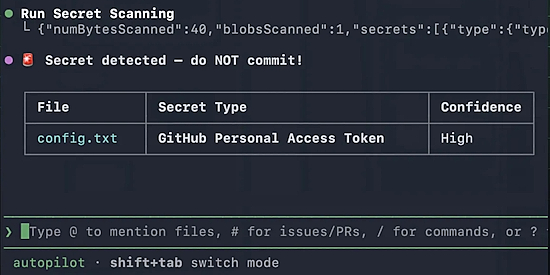](https://github.blog/changelog/2026-03-17-secret-scanning-in-ai-coding-agents-via-the-github-mcp-server/)

It can happen to any of us. We're posting our MicroPython/CircuitPython/Python code to GitHub. And there is one file, settings.coml, secrets.py, etc. that we put our password in to a weather API, Adafruit IO, Wifi, etc. It should have been posted generically but wasn't and now your credentials are on GitHub forever. What to do? A new feature of GitHub Copilot allows a search for such files in a commit and warns you. It could save heartache - [GitHub Blog](https://github.blog/changelog/2026-03-17-secret-scanning-in-ai-coding-agents-via-the-github-mcp-server/).

## Arduino GitHub Repository Now Requires a Huge Contributor License Agreement

[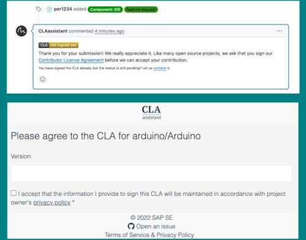](https://blog.adafruit.com/2026/03/18/want-to-fix-a-bug-in-arduino-first-agree-to-qualcomms-6000-word-privacy-policy/)

If you submit a pull request to an Arduino repository on GitHub, a bot called CLA Assistant pops up and asks you to sign a Contributor License Agreement before your code can be merged - [Adafruit Blog](https://blog.adafruit.com/2026/03/18/want-to-fix-a-bug-in-arduino-first-agree-to-qualcomms-6000-word-privacy-policy/). Via [LinkedIn](https://www.linkedin.com/posts/adafruit_want-to-fix-a-bug-in-arduino-first-agree-activity-7440151194976600064-3kk6/).

Standard stuff for open-source projects. But look at the checkbox at the bottom of the signing page:

> “I accept that the information I provide to sign this CLA will be maintained in accordance with project owner’s privacy policy.”

That link goes to Arduino’s privacy policy, which was secretly rewritten on November 1, 2025... the same period when Qualcomm Technologies acquisition of Arduino S.r.l. happened.

The privacy policy you’re now agreeing to goes beyond the lightweight data-handling notice you’d expect for a code contribution: a 6,000+ word Qualcomm-grade corporate privacy policy covering the full Arduino product ecosystem (accounts, cloud services, e-commerce, IoT apps, education products, social media interactions, and minors’ data). 

## OpenAI to Acquire Astral

OpenAI will acquire Astral⁠(opens in a new window), bringing open source developer tools into the Codex ecosystem. Astral has built some of the most widely used open source Python tools, helping developers move faster with modern tooling like uv, Ruff, and ty. Codex can handle the full workflow, not just the code - [OpenAI](https://openai.com/index/openai-to-acquire-astral/) and [Ars Technica](https://arstechnica.com/ai/2026/03/openai-is-acquiring-open-source-python-tool-maker-astral/).

Simon Willison’s thoughts on OpenAI acquiring Astral and uv/ruff/ty - [Simon Willison’s Weblog](https://simonwillison.net/2026/Mar/19/openai-acquiring-astral/).

## Claude + Oscilloscope: Agentic Hardware Testing for MicroPython

By connecting Claude to a Keysight oscilloscope via a custom MCP server and PyVISA, the AI has insight to the test bench. The implementation includes verifying I2C timing and PWM signals for a MicroPython port on a DUT Hub, ensuring code performs correctly on physical hardware - [YouTube](https://www.youtube.com/watch?v=9oMwjWW3wsg) and [GitHub](https://github.com/Netlist-Studio/scope-mcp). Via [Reddit](https://www.reddit.com/r/NetlistStudio/comments/1rp3iq5/claude_oscilloscope_agentic_hardware_testing/).

*Editor Note: I'd love to do the same with CircuitPython and my modest scope, as Agilent's are rather pricey.*

## Raspberry Pi 500+ Launches

[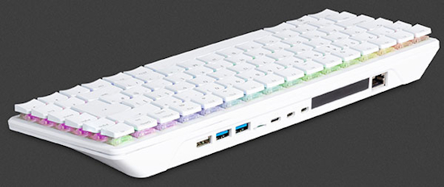](https://www.digikey.com/en/maker/blogs/2025/raspberry-pi-500-launches-with-256gb-nvme-ssd-and-16gb-ram)

Raspberry Pi released the Pi 500+ with an M.2 slot that fits the common 2230, 2242, 2260, and 2280 size M.2 SSDs. The Pi 500+ has several other new features. The key switches used are custom Gateron KS-33 switches, which have a similar clicky sound and feel to that of Cherry Blue switches. Also, each switch has an independent RGB LED, with tons of glowing awesomeness. They have increased the size of the SDRAM to 16GB from the 8GB included with the Original Pi 500. They have also included a 256GB SSD, which is pre-loaded with Raspberry Pi OS - [DigiKey](https://www.digikey.com/en/maker/blogs/2025/raspberry-pi-500-launches-with-256gb-nvme-ssd-and-16gb-ram).

In other Pi News, Tim Mamtora joins Eben Upton and team full-time as Raspberry Pi's new Chief Operating Officer - [LinkedIn](https://www.linkedin.com/posts/tmamtora_computing-innovation-learning-share-7434330585872994304-MfzU/).

## Raspberry Pi Connect Adds Remote Update

[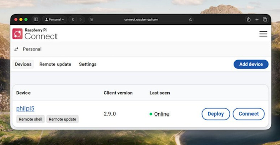](https://www.raspberrypi.com/news/new-remote-updates-on-raspberry-pi-connect/)

Raspberry Pi has added remote update to their Raspberry Pi Connect software - [Raspberry Pi News](https://www.raspberrypi.com/news/new-remote-updates-on-raspberry-pi-connect/) and [Project Page](https://www.raspberrypi.com/software/connect/).

## Markdown is Now a First-Class Coding Language: Deal with It (Opinion)

Nick Hodges in InfoWorld wrote an artticle by that name. Up until a few months ago, most Python folks used Markdown text as a way to format README and LICENSE files in their code repositories. Now X/Twitter feeds are clogged with posts that start with "🚨 BREAKING: Someone just open-sourced a tool that ...". They typically lead to a set of Markdown files for instructing an AI, most often Claude, to learn new skills. And the wave is not about to crest anytime soon. And when one asks Claude Cowork to do some data crunching, it often codes in Python. And when you save the project to use it again, it'll remember what to do via a Markdown file. Python and Markdown were just thrown in the fast lane. And folks are keeping an eye out - [InfoWorld](https://www.infoworld.com/article/4146579/markdown-is-now-a-first-class-coding-language-deal-with-it.html).

That said, when you need to generate documentation for your project:

## OpenDocs

OpenDocs converts GitHub READMEs, Markdown files, and Jupyter Notebooks into structured, multi-format documentation. Written in Python and under an open MIT license - [GitHub](https://github.com/ioteverythin/OpenDocs).

## This Week's Python Streams

Python on Hardware is all about building a cooperative ecosphere which allows contributions to be valued and to grow knowledge. Below are the streams within the last week focusing on the community.

**CircuitPython Deep Dive Stream**

[Last Friday](https://youtube.com/live/8PC28PA-xXI), Scott streamed work on CircuitPython for the nRF54LM20A.

BONUS: Scott streams about Zephyr `displayio` and CI - [YouTube](https://youtube.com/live/qwN_OBS1KYs).

You can see the latest video and past videos on the Adafruit YouTube channel under the Deep Dive playlist - [YouTube](https://www.youtube.com/playlist?list=PLjF7R1fz_OOXBHlu9msoXq2jQN4JpCk8A).

**CircuitPython Parsec**

John Park’s CircuitPython Parsec this week is a Trellis MIDI Velocity Meter - [Adafruit Blog](https://blog.adafruit.com/2026/03/20/john-parks-circuitpython-parsec-trellis-midi-velocity-meter/) and [YouTube](https://youtu.be/6jLKaW0RIis).

Catch all the episodes in the [YouTube playlist](https://www.youtube.com/playlist?list=PLjF7R1fz_OOWFqZfqW9jlvQSIUmwn9lWr).

Adafruit's John Park joins the show and shares a behind the scenes look at his weekly shows, some of his favorite CircuitPython memories, favorite projects, and more - [The CircuitPython Show](https://www.circuitpythonshow.com/@circuitpythonshow).

**CircuitPython Weekly Meeting**

CircuitPython Weekly Meeting for March 16, 2026 ([notes](https://github.com/adafruit/adafruit-circuitpython-weekly-meeting/blob/main/2026/2026-03-16.md)) [on YouTube](https://youtu.be/I8pGLOQZi4A).

## Project of the Week: Upcycling a 1992 Brick Phone

[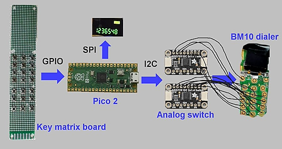](url)

Alan Boris took a 1992 Motorola 1G brick-style cell phone, removed the insides, and rebuilt it from scratch using modern parts, centered around a Pi Pico 2 microcontroller programmed in CircuitPython - [YouTube](https://www.youtube.com/watch?v=6bUMHgfxNoo) and [GitHub](https://github.com/alanb128/brick-phone). Via [Adafruit Blog](https://blog.adafruit.com/2026/03/16/upcycling-a-1992-brick-phone-with-raspberry-pi-pico-2-and-circuitpython/).

## Popular Last Week

What was the most popular, most clicked link, in [last week's newsletter](https://www.adafruitdaily.com/2026/03/16/python-on-microcontrollers-newsletter-raspberry-pi-cm0-modules-in-products-new-circuitpython-a-new-arduino-and-more-circuitpython-python-micropython-thepsf-raspberry_pi/)? [Free eBook: The Big Book of Small Python Projects](https://inventwithpython.com/bigbookpython/).

Did you know you can read past issues of this newsletter in the Adafruit Daily Archive? [Check it out](https://www.adafruitdaily.com/category/circuitpython/).

## New Notes from Adafruit Playground

[Adafruit Playground](https://adafruit-playground.com/) is a new place for the community to post their projects and other making tips/tricks/techniques. Ad-free, it's an easy way to publish your work in a safe space for free.

[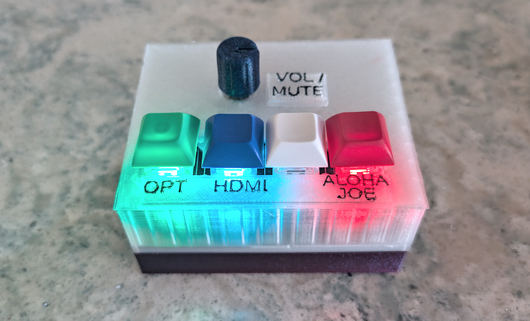](https://adafruit-playground.com/u/ntynen/pages/bluesound-node-controller)

Bluesound Node Companion - [Adafruit Playground](https://adafruit-playground.com/u/ntynen/pages/bluesound-node-controller).

## News From Around the Web

Turning the Circuit Playground Express (CPX) into an infrared remote control for a Sony NEX camera, includes an example of making stop motion animations, showing why the [adafruit_irremote library](https://docs.circuitpython.org/projects/irremote/en/latest/index.html) needed a minor enhancement for the Sony Infrared Remote Code (SIRC) protocol and an attempt at seeing the infrared beam spread - [Instructables](https://www.instructables.com/Sony-IR-Remote-Control-Shutter-Adafruit-CPX/).

[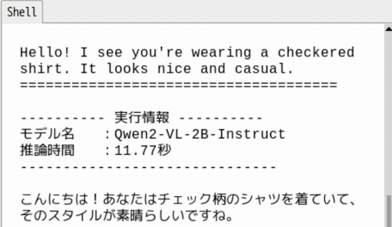](https://x.com/sozoraemon/status/2033855341084217773)

Generating text from video captured by a camera using the Raspberry Pi AI HAT+ 2. Running the entire process, from "translating the English output from the local VLM into Japanese using the local LLM", with Python - [X](https://x.com/sozoraemon/status/2033855341084217773).

SK Group chairman says memory chip shortage will last until 2030 — wafer supply trails demand by 20%. Their CEO is expected to announce price stabilization measures soon - [Tom's Hardware](https://www.tomshardware.com/pc-components/dram/sk-group-chairman-says-memory-chip-shortage-will-last-until-2030).

[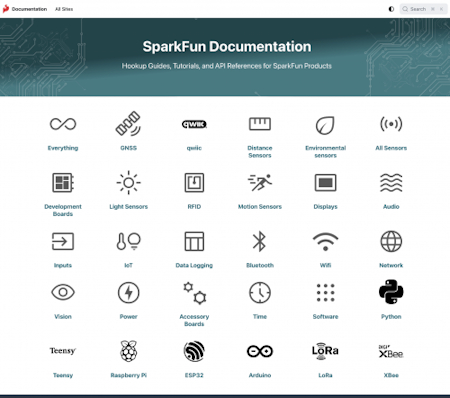](https://news.sparkfun.com/15948)

SparkFun adds beta documentation AI integration and updated organization. CircuitPython and MicroPython show up appoximately 17,500 times each in a search - [SparkFun News](https://news.sparkfun.com/15948). Via [X](https://x.com/sparkfun/status/2034359685764014228).

The KiCad project is proud to announce the latest major stable version 10.0.0 release - [KiCad](https://www.kicad.org/blog/2026/03/Version-10.0.0-Released/).

[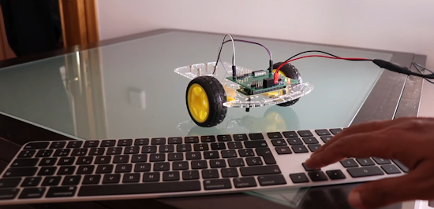](https://www.youtube.com/watch?v=pYhcad-iLz0)

Control your first LED with Python - Raspberry Pi projects - [YouTube](https://www.youtube.com/watch?v=pYhcad-iLz0).

[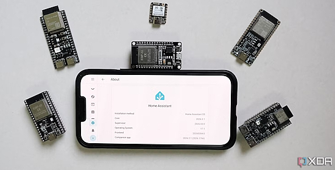](https://www.xda-developers.com/why-keep-buying-esp32-boards-instead-more-smart-home-gadgets/)

This is why I keep buying ESP32 boards instead of more smart home gadgets - [XDA](https://www.xda-developers.com/why-keep-buying-esp32-boards-instead-more-smart-home-gadgets/).

[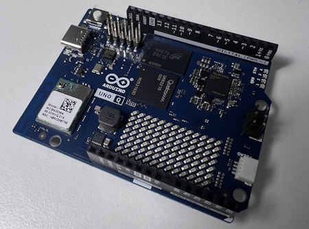](https://github.com/orgs/micropython/discussions/18937)

Adding Arduino Uno Q board support to MicroPython by using Zephyr - [GitHub](https://github.com/orgs/micropython/discussions/18937). Via [Adafruit Blog](https://blog.adafruit.com/2026/03/18/adding-arduino-uno-q-board-support-to-micropython/).

[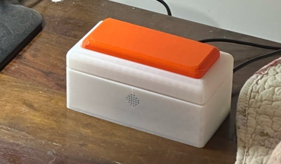](https://www.raspberrypi.com/news/phone-free-thought-catcher/)

A phone-free thought catcher using Raspberry Pi and Python - [Raspberry Pi News](https://www.raspberrypi.com/news/phone-free-thought-catcher/).

Visual Studio Code has switched to weekly updates, so new features and bug fixes are now arriving at a rapid pace. The new version 1.112 update is now available, with a significant upgrade for web development and a few more AI coding features - [How-To Geek](https://www.howtogeek.com/visual-studio-codes-latest-update-is-a-big-deal-for-web-development/).

[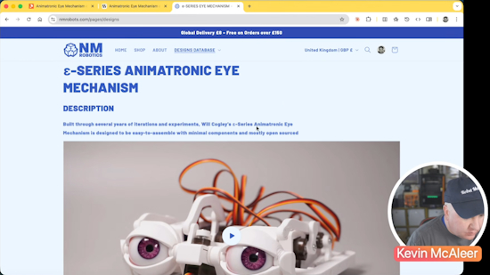](https://www.youtube.com/watch?v=XpKnyTx_1mQ)

Kevin McAleer builds [Will Cogley's](https://nmrobots.com/) incredible animatronic eye mechanism. Kevin walks through the build, the problems encountered, and how this connects to his own robot eye projects - [YouTube](https://www.youtube.com/watch?v=XpKnyTx_1mQ).

text - [site](url).

text - [site](url).

[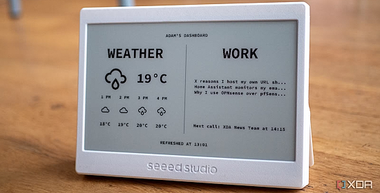](https://www.xda-developers.com/6-e-ink-raspberry-pi-projects-that-look-amazing/)

Six e-ink Raspberry Pi projects that look amazing - [XDA](https://www.xda-developers.com/6-e-ink-raspberry-pi-projects-that-look-amazing/).

Project Detroit, bridging Java, Python, JavaScript, moves forward - [InfoWorld](https://www.infoworld.com/article/4145953/project-detroit-bridging-java-python-javascript-moves-forward.html).

[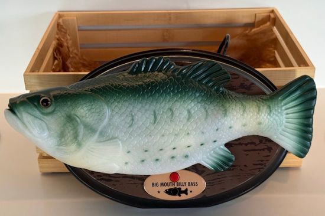](https://www.raspberrypi.com/news/powered-by-raspberry-pi-singing-fish-educational-synths-and-agile-robots/)

Powered by Raspberry Pi: singing fish, educational synths, and agile robots - [Raspberry Pi News](https://www.raspberrypi.com/news/powered-by-raspberry-pi-singing-fish-educational-synths-and-agile-robots/).

Four ways to practice Python without following a tutorial - [How-to Geek](https://www.howtogeek.com/4-ways-to-practice-python-without-following-a-tutorial/).

## New

[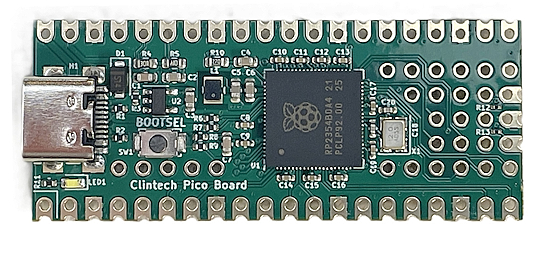](https://www.cnx-software.com/2026/03/19/clintech-pico-raspberry-pi-rp2354b-board-raspberry-pi-pico-form-factor/)

The Clintech Pico Board appears to be the first development board based on the Raspberry Pi RP2354B chip, which has 2MB on-chip flash. It retains the same form factor as a Raspberry Pi Pico 2 but adds extra GPIOs to make use of the 48 general-purpose GPIOs provided by the RP2354B chip - [CNX](https://www.cnx-software.com/2026/03/19/clintech-pico-raspberry-pi-rp2354b-board-raspberry-pi-pico-form-factor/).

Seeed Studio has announced a new 8" smart display, built around the Espressif ESP32-P4: the reTerminal D1001. The ESP32-P4 doesn't include any wireless connectivity — so Seeed's design includes an ESP32-C6 acting as a communications coprocessor for single-band Wi-Fi 6 and Bluetooth 5 Low Energy (BLE). There's a mini-PCI Express (mPCIe) slot for an optional cellular modem. There's an integrated speaker, two microphones, a real-time clock, six-axis inertial measurement unit (IMU), and a 1600×1200 camera capable of 30 frames per second (FPS) video. Everything is powered by an internal 2.5Ah battery, charged via a USB Type-C connection - [hackster.io](https://www.hackster.io/news/seeed-studio-targets-next-gen-hmi-with-the-espressif-esp32-p4-powered-reterminal-d1001-cd9cf0005a86).

[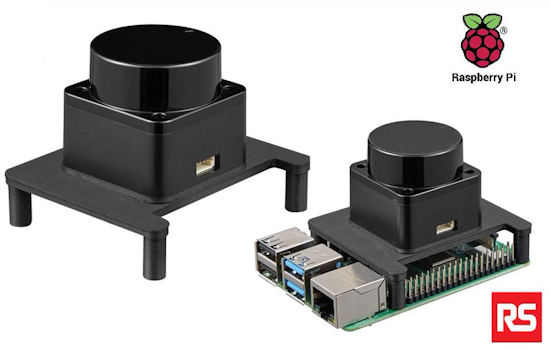](https://jp.rs-online.com/web/p/sensor-development-tools/2037609)

The Okdo budget-friendly LiDAR (Infrared Distance Sensor) module for Raspberry Pi is an infrared distance sensor module capable of measuring distances to objects in the range of 0.02 to 12m. It can detect objects and create maps with 360-degree scanning. It mounts on Raspberry Pi 4 and is ROS compatible - [RS Japan](https://jp.rs-online.com/web/p/sensor-development-tools/2037609). Via [X](https://x.com/RSJapanMK/status/2033373945722716556).

## New Boards Supported by CircuitPython

The number of supported microcontrollers and Single Board Computers (SBC) grows every week. This section outlines which boards have been included in CircuitPython or added to [CircuitPython.org](https://circuitpython.org/).

This week there were (#/no) new boards added:

- [Board name](url)
- [Board name](url)
- [Board name](url)

*Note: For non-Adafruit boards, please use the support forums of the board manufacturer for assistance, as Adafruit does not have the hardware to assist in troubleshooting.*

Looking to add a new board to CircuitPython? It's highly encouraged! Adafruit has four guides to help you do so:

- [How to Add a New Board to CircuitPython](https://learn.adafruit.com/how-to-add-a-new-board-to-circuitpython/overview)
- [How to add a New Board to the circuitpython.org website](https://learn.adafruit.com/how-to-add-a-new-board-to-the-circuitpython-org-website)
- [Adding a Single Board Computer to PlatformDetect for Blinka](https://learn.adafruit.com/adding-a-single-board-computer-to-platformdetect-for-blinka)
- [Adding a Single Board Computer to Blinka](https://learn.adafruit.com/adding-a-single-board-computer-to-blinka)

## New Adafruit Learning System Guides

The [Adafruit Learning System](https://learn.adafruit.com/) has over 3,200 free guides for learning skills and building projects including using Python.

[Blurry Analog Clock](https://learn.adafruit.com/blurry-analog-clock) from [Ruiz Brothers](https://learn.adafruit.com/u/pixil3d)

[title](url) from [name](url)

[title](url) from [name](url)

## Updated Learn Guides

[Adding a Single Board Computer to Blinka](https://blog.adafruit.com/2026/03/16/updated-guide-adding-a-single-board-computer-to-blinka-adafruitlearningsystem-blinka-adafruit-circuitpython-raspberrypi-makermelissa/)

## CircuitPython Libraries

The CircuitPython library numbers are continually increasing, while existing ones continue to be updated. Here we provide library numbers and updates!

To get the latest Adafruit libraries, download the [Adafruit CircuitPython Library Bundle](https://circuitpython.org/libraries). To get the latest community contributed libraries, download the [CircuitPython Community Bundle](https://circuitpython.org/libraries).

If you'd like to contribute to the CircuitPython project on the Python side of things, the libraries are a great place to start. Check out the [CircuitPython.org Contributing page](https://circuitpython.org/contributing). If you're interested in reviewing, check out Open Pull Requests. If you'd like to contribute code or documentation, check out Open Issues. We have a guide on [contributing to CircuitPython with Git and GitHub](https://learn.adafruit.com/contribute-to-circuitpython-with-git-and-github), and you can find us in the #help-with-circuitpython and #circuitpython-dev channels on the [Adafruit Discord](https://adafru.it/discord).

You can check out this [list of all the Adafruit CircuitPython libraries and drivers available](https://github.com/adafruit/Adafruit_CircuitPython_Bundle/blob/master/circuitpython_library_list.md). 

The current number of CircuitPython libraries is **563**!

**New Libraries**

Here are this week's new CircuitPython libraries:

* [adafruit/Adafruit_CircuitPython_TCS3430](https://github.com/adafruit/Adafruit_CircuitPython_TCS3430)

**Updated Libraries**

Here are this week's updated CircuitPython libraries:

* [adafruit/Adafruit_CircuitPython_TM](https://github.com/adafruit/Adafruit_CircuitPython_TM)
* [adafruit/Adafruit_CircuitPython_USB_Host_Mouse](https://github.com/adafruit/Adafruit_CircuitPython_USB_Host_Mouse)

## What’s the CircuitPython team up to this week?

What is the team up to this week? Let’s check in:

**Tim**

This week I worked on CircuitPython drivers and guides for the AS7343 and TCS3430 breakouts. While working on these I've been expanding my knowledge of Arduino CLI to be able to compare the CircuitPython driver functionality with the Arduino driver during development. I'm working on validation test scripts that enable low level I2C debugging prints and then compare the raw I2C data being read/written between the Arduino and CircuitPython drivers. These tools increase our automated testing capability for driver development.

**Scott**

This week I've continued to poke GitHub actions to get the Zephyr display changes merged in. Thanks to the two GitHub folks who [suggested](https://github.com/actions/runner-images/issues/13803) a working workaround, I'm finally unblocked. I've gotten BLE GATT basics working in the `native_sim` and need to test on real hardware. I'm continuing to work on bringing UF2 bootloading to Zephyr via `mcuboot`. That way folks will only need to do a complicated flash once.

**Liz**

This week I published the [CircuitPython on Xteink X4 guide](https://learn.adafruit.com/circuitpython-on-the-xteink-x4-ereader). This guide goes through the peripherals available on the Xteink X4, how to install CircuitPython and gives a few examples to try out. My favorite is a weather display that uses the OpenMeteo API

## Upcoming Events

The next MicroPython Meetup in Melbourne will be on March 25th – [Luma](https://luma.com/r0rq9pl4). You can see recordings of previous meetings on [YouTube](https://www.youtube.com/@MicroPythonOfficial). 

* [PyCon DE & PyData 2026](https://2026.pycon.de/) will be 13 April 2026 – 17 April 2026 in Darmstadt, Germany

**Other Events This Year**

* [PyCon US](https://us.pycon.org/2026/) is May 13 - May 19, 2026 in Long Beach, California
* [The Open Source Hardware Association Open Hardware Summit](https://oshwa.org/announcements/the-2026-open-hardware-summit-schedule-is-out/) is coming to Berlin, Germany on May 23rd and 24th, 2026.
* [EuroPython 2026](https://ep2026.europython.eu/) is coming to Kraków, Poland 13-19 July, 2026.
* [PyOhio 2026](https://www.pyohio.org/2026/) is from 25 July through 26 July, 2026 this year in Cleveland, USA.
* [PyCon AU 2026](https://2026.pycon.org.au/) will be 26 Aug. 2026 – 30 Aug. 2026 in Brisbane, Australia

If you know of virtual events or upcoming events, please let us know via email to cpnews(at)adafruit(dot)com.

## Latest Releases

CircuitPython's stable release is [10.1.4](https://github.com/adafruit/circuitpython/releases/latest) and its unstable release is [10.2.0-alpha.1](https://github.com/adafruit/circuitpython/releases). New to CircuitPython? Start with our [Welcome to CircuitPython Guide](https://learn.adafruit.com/welcome-to-circuitpython).

[20260311](https://github.com/adafruit/Adafruit_CircuitPython_Bundle/releases/latest) is the latest Adafruit CircuitPython library bundle.

[20260319](https://github.com/adafruit/CircuitPython_Community_Bundle/releases/latest) is the latest CircuitPython Community library bundle.

[v1.27.0](https://micropython.org/download) is the latest MicroPython release. Documentation for it is [here](http://docs.micropython.org/en/latest/pyboard/).

[3.14.3](https://www.python.org/downloads/) is the latest Python release. The latest pre-release version is [3.15.0a7](https://www.python.org/download/pre-releases/).

[4,477 Stars](https://github.com/adafruit/circuitpython/stargazers) Like CircuitPython? [Star it on GitHub!](https://github.com/adafruit/circuitpython)

## Call for Help -- Translating CircuitPython is now easier than ever

[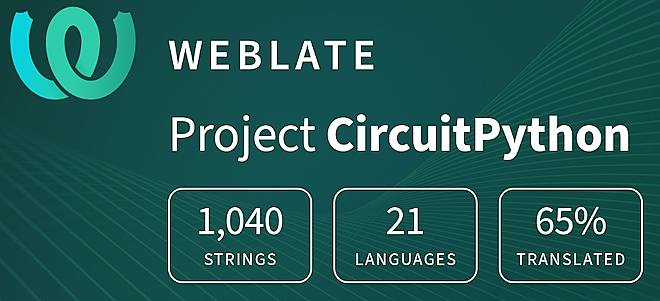](https://hosted.weblate.org/engage/circuitpython/)

One important feature of CircuitPython is translated control and error messages. With the help of fellow open source project [Weblate](https://weblate.org/), we're making it even easier to add or improve translations. 

Sign in with an existing account such as GitHub, Google or Facebook and start contributing through a simple web interface. No forks or pull requests needed! As always, if you run into trouble join us on [Discord](https://adafru.it/discord), we're here to help.

## 39,077 Thanks

The Adafruit Discord community, where we do all our CircuitPython development in the open, reached over 39,077 humans - thank you! Adafruit believes Discord offers a unique way for Python on hardware folks to connect. Join today at [https://adafru.it/discord](https://adafru.it/discord).

## ICYMI - In case you missed it

Python on hardware is the Adafruit Python video-newsletter-podcast! The news comes from the Python community, Discord, Adafruit communities and more and is broadcast on ASK an ENGINEER Wednesdays. The complete Python on Hardware weekly videocast [playlist is here](https://www.youtube.com/playlist?list=PLjF7R1fz_OOXRMjM7Sm0J2Xt6H81TdDev). The video podcast is on [iTunes](https://itunes.apple.com/us/podcast/python-on-hardware/id1451685192?mt=2), [YouTube](http://adafru.it/pohepisodes), [Instagram](https://www.instagram.com/adafruit/channel/)), and [XML](https://itunes.apple.com/us/podcast/python-on-hardware/id1451685192?mt=2).

[The weekly community chat on Adafruit Discord server CircuitPython channel - Audio / Podcast edition](https://itunes.apple.com/us/podcast/circuitpython-weekly-meeting/id1451685016) - Audio from the Discord chat space for CircuitPython, meetings are usually Mondays at 2pm ET, this is the audio version on [iTunes](https://itunes.apple.com/us/podcast/circuitpython-weekly-meeting/id1451685016), Pocket Casts, [Spotify](https://adafru.it/spotify), and [XML feed](https://adafruit-podcasts.s3.amazonaws.com/circuitpython_weekly_meeting/audio-podcast.xml).

## Contribute

The CircuitPython Weekly Newsletter is a CircuitPython community-run newsletter emailed every Monday. To contribute your content, please email your news to cpnews (at) adafruit (dot) com with information and link(s) to your content. 

Join the Adafruit [Discord](https://adafru.it/discord) or [post to the forum](https://forums.adafruit.com/viewforum.php?f=60) if you have questions.
