- [ ] Library and info updates
- [ ] change date
- [ ] update title
- [ ] Feature story
- [ ] Update  for images
- [ ] Update ICYDNCI
- [ ] All images 550w max only
- [ ] Link "View this email in your browser."

News Sources

- [Adafruit Playground](https://adafruit-playground.com/)
- Twitter: [CircuitPython](https://twitter.com/search?q=circuitpython&src=typed_query&f=live), [MicroPython](https://twitter.com/search?q=micropython&src=typed_query&f=live) and [Python](https://twitter.com/search?q=python&src=typed_query)
- [Raspberry Pi News](https://www.raspberrypi.com/news/), [Pi Foundation](https://www.raspberrypi.org/blog/)
- Mastodon [CircuitPython](https://mastodon.social/tags/CircuitPython) and [MicroPython](https://mastodon.social/tags/MicroPython)
- BlueSky [CircuitPython](https://bsky.app/search?q=circuitpython), [MicroPython](https://bsky.app/search?q=micropython), [Raspberry Pi](https://bsky.app/search?q=raspberry+pi)
- [Google News Python](https://news.google.com/topics/CAAqIQgKIhtDQkFTRGdvSUwyMHZNRFY2TVY4U0FtVnVLQUFQAQ?hl=en-US&gl=US&ceid=US%3Aen)
- YouTube: [CircuitPython](https://www.youtube.com/results?search_query=circuitpython&sp=CAISBAgDEAE%253D), [MicroPython](https://www.youtube.com/results?search_query=micropython&sp=CAISBAgDEAE%253D), [Prof Gallaugher](https://www.youtube.com/@BuildWithProfG/videos)
- [maker.io Python](https://www.digikey.com/en/maker/search-results?s=createdDate&t=python)
- [hackster.io CircuitPython](https://www.hackster.io/search?q=circuitpython&i=projects&sort_by=most_recent) and [MicroPython](https://www.hackster.io/search?q=micropython&i=projects&sort_by=most_recent)
- Instructables: [CircuitPython](https://www.instructables.com/search/?q=circuitpython&projects=all&sort=Newest), [MicroPython](https://www.instructables.com/search/?q=micropython&projects=all&sort=Newest), [Raspberry Pi Python](https://www.instructables.com/search/?q=raspberry+pi+python&projects=all&sort=Newest)
- [hackaday CircuitPython](https://hackaday.com/blog/?s=circuitpython) and [MicroPython](https://hackaday.com/blog/?s=micropython)
- [python.org](https://www.python.org/)
- [Python Insider - dev team blog](https://pythoninsider.blogspot.com/)
- Individuals: [bret.dk](https://bret.dk/), [Jeff Geerling](https://www.jeffgeerling.com/blog), [Yakroo](https://x.com/Yakroo5077), [coXXect](https://coxxect.blogspot.com/)
- Tom's Hardware: [CircuitPython](https://www.tomshardware.com/search?searchTerm=circuitpython&articleType=all&sortBy=publishedDate) and [MicroPython](https://www.tomshardware.com/search?searchTerm=micropython&articleType=all&sortBy=publishedDate) and [Raspberry Pi](https://www.tomshardware.com/search?searchTerm=raspberry%20pi&articleType=all&sortBy=publishedDate)
- [hackaday.io newest projects MicroPython](https://hackaday.io/projects?tag=micropython&sort=date) and [CircuitPython](https://hackaday.io/projects?tag=circuitpython&sort=date)
- hackaday.io - [CircuitPython](https://hackaday.io/search?term=circuitpython) and [MicroPython](https://hackaday.io/search?term=micropython)
- [MicroPython Meeting](https://luma.com/micropython?k=c)

View this email in your browser. **Warning: Flashing Imagery**

Welcome to the latest Python on Microcontrollers newsletter! *insert 2-3 sentences from editor (what's in overview, banter)* - *Anne Barela, Editor*

We're on [Discord](https://discord.gg/HYqvREz), [Twitter/X](https://twitter.com/search?q=circuitpython&src=typed_query&f=live), [BlueSky](https://bsky.app/profile/circuitpython.org) and for past newsletters - [view them all here](https://www.adafruitdaily.com/category/circuitpython/). If you're reading this on the web, please [subscribe here](https://www.adafruitdaily.com/). Here's the news this week:

## Headline

text - [site](url).

## The 2026 Python Developers Survey

The ninth iteration of the official Python Developers Survey is out. Its goal is to show how the world of Python development looks today and how it compares to last year. It's rather important, especially for showing Python use in microcontroller and single board computer use (select "Embedded Development") - [JetBrains.com](https://surveys.jetbrains.com/s3/python-developers-survey-2026). Via [BlueSky](https://bsky.app/profile/python.org/post/3mhv5hentjf24).

## Espressif News

[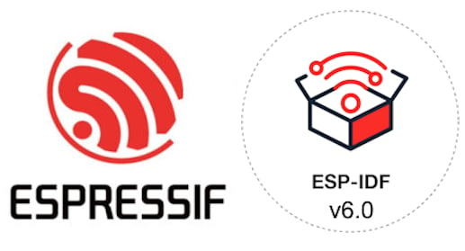](https://blog.adafruit.com/2026/03/24/the-espressif-esp-idf-v6-0-is-released-supporting-new-chips/)

The Espressif ESP-IDF v6.0 is released, adding stable support for ESP32-C5 and ESP32-C61 RISC-V SoCs and preview support for ESP32-H21 and ESP32-H4 low-power wireless microcontrollers - [Espressif](https://release-notes.espressif.tools/release/6.0) and [CNX](https://www.cnx-software.com/2026/03/24/esp-idf-v6-0-framework-adds-support-for-esp32-c5-and-esp32-c61-preview-for-esp32-h21-and-esp32-h4/). Via [Adafruit Blog](https://blog.adafruit.com/2026/03/24/the-espressif-esp-idf-v6-0-is-released-supporting-new-chips/).

The ESP32-P4 microcontroller revision 3.0 gains a new power rail and requires PCB & firmware changes - [CNX](https://www.cnx-software.com/2026/03/23/esp32-p4-revision-3-0-gains-new-power-rail-requires-new-pcb-design-and-firmware/). Via [Adafruit Blog](https://blog.adafruit.com/2026/03/24/esp32-p4-revision-3-0-gains-a-new-power-rail-and-requires-pcb-firmware-changes/).

## ‘Cool Stuff’ That Makes a Difference

A new article on Associate Professor John Gallaugher and his students at Boston College, focusing on their work with assistive technology, which includes using CircuitPython - [Boston College](https://www.bc.edu/content/bc-web/sites/bc-news/articles/2026/spring/the-class-that-makes-a-difference-.html).

> "'Tech for Good' is open to students from across the University, with no prerequisites. Last fall’s cohort included several graduate students from the Lynch School, an MBA student, and undergraduates majoring in computer science, marketing, and human-centered engineering. Every week, they gathered in the prototyping studio at the Hatchery, BC’s state-of-the-art makerspace. For many, it was their first time writing code or even hearing the word “accelerometer” (a device that measures movement)."

## Python 3.15’s Just-In-Time (JIT) Compiler is Now Back on Track

[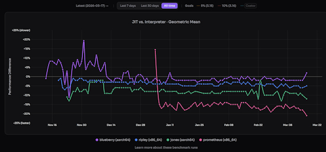](https://fidget-spinner.github.io/posts/jit-on-track.html)

A goal for Python 3.15 is a Just-In-Time (JIT) compiler to speed up code execution. Early efforts have resulted in a 20% slowdown but now the latest revisions show a 100% increase in speed - [Ken Jin's Blog](https://fidget-spinner.github.io/posts/jit-on-track.html).

## A Popular Python Library Became a Backdoor to Malware

[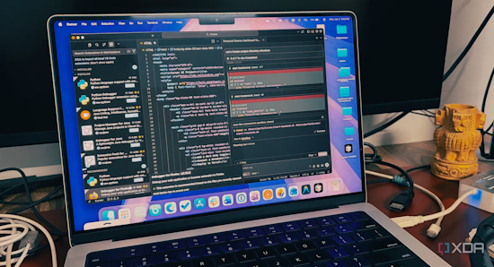](https://www.xda-developers.com/popular-python-library-backdoor-machine/)

LiteLLM is one of the most popular Python libraries for interacting with large language models (LLM), offering a single unified interface to forward requests to OpenAI compatible endpoints, Anthropic, Google, and dozens of other providers through a single wrapper. It has over 40,000 stars on GitHub, and it's an important dependency in a lot of AI tooling. It's also been compromised on PyPI, and the malicious versions are stealing everything they can find on your machine. On March 24, 2026, version 1.82.8 of LiteLLM was pushed to PyPI containing a malicious .pth file called "litellm_init.pth". That file executes automatically on every Python process startup, meaning you don't even need to import the library for it to run. What's more, version 1.82.7 has also been compromised - [XDA](https://www.xda-developers.com/popular-python-library-backdoor-machine/).

## A New Port of MicroPython to Amiga

It's been 18 months since [reporting last](https://github.com/jyoberle/micropython-amiga) on an AmigaOS port of MicroPython. Fabrice has a new port of MicroPython v1.27.0 for Motorola 68020+ processors. It runs on classic Amiga hardware (A1200, A3000, A4000) and emulators (WinUAE, FS-UAE) - [GitHub](https://github.com/OoZe1911/micropython-amiga-port) and [Aminet](). Via [Ganeration Amiga](https://www.generationamiga.com/2026/03/26/micropython-in-development-for-the-commodore-amiga-a-modern-language-on-classic-hardware/).

## The SPOKE Board Gains a New IDE and Distributor

[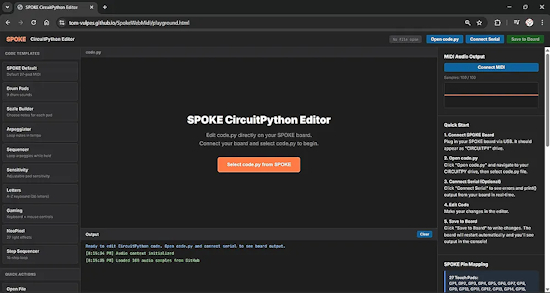](https://bsky.app/profile/vulpeslabs.bsky.social/post/3mhbskjtwks2y)

The [SPOKE CircuitPython multifunction board](https://www.spokeboard.com/) now has a new [web-based development environment](https://tom-vulpes.github.io/SpokeWebMidi/playground.html). After a successful Kickstarter, it is being manufactured in the UK and will be available from Pimoroni in coming weeks - [BlueSky](https://bsky.app/profile/vulpeslabs.bsky.social/post/3mhbskjtwks2y).

## This Week's Python Streams

Python on Hardware is all about building a cooperative ecosphere which allows contributions to be valued and to grow knowledge. Below are the streams within the last week focusing on the community.

**Deep Dive with Tim**

[Last week](https://youtube.com/live/KbmfR4atOc4), Tim streamed work on automated proximity sensor testing with a servo.

BONUS: [Last Friday](https://youtube.com/live/FpByNMwomhU), Tim looked into a proximity sensor interrupt issue.

You can see the latest video and past videos on the Adafruit YouTube channel under the Deep Dive playlist - [YouTube](https://www.youtube.com/playlist?list=PLjF7R1fz_OOXBHlu9msoXq2jQN4JpCk8A).

**CircuitPython Parsec**

John Park’s CircuitPython Parsec this week is on modulo pixel wrap - [Adafruit Blog](https://blog.adafruit.com/2026/03/27/john-parks-circuitpython-parsec-modulo-pixel-wrap/) and [YouTube](https://youtu.be/SE2gjf86UcY?si=cWOgPX-p1V0j2uUc).

Catch all the episodes in the [YouTube playlist](https://www.youtube.com/playlist?list=PLjF7R1fz_OOWFqZfqW9jlvQSIUmwn9lWr).

**CircuitPython Weekly Meeting**

CircuitPython Weekly Meeting for March 23, 2026 ([notes](https://github.com/adafruit/adafruit-circuitpython-weekly-meeting/blob/main/2026/2026-03-23.md)) [on YouTube](https://youtu.be/O-4PsB8x7wo).

## Project of the Week: A Vintage Tube-Style Internet Radio

This project successfully merges the nostalgic charm of a vintage tube radio with the power of modern internet streaming using a Raspberry Pi CM4 board programmed in Python - [Instructables](https://www.instructables.com/Building-a-Vintage-Tube-Style-Internet-Radio-With-/) and [GitHub](https://github.com/mircemk/retro-internet-radio-crowpanel). Via [Adafruit Blog](https://blog.adafruit.com/2026/03/20/vintage-tube-style-internet-radio/).

## Popular Last Week

What was the most popular, most clicked link, in [last week's newsletter](https://www.adafruitdaily.com/2026/03/23/python-on-microcontrollers-newsletter-ai-helping-your-development-while-arduino-tcs-grow-onerous-and-more-circuitpython-python-micropython-thepsf-raspberry_pi/)? [Raspberry Pi 500+ Launches with 256GB NVME SSD and 16GB RAM](https://www.digikey.com/en/maker/blogs/2025/raspberry-pi-500-launches-with-256gb-nvme-ssd-and-16gb-ram).

Did you know you can read past issues of this newsletter in the Adafruit Daily Archive? [Check it out](https://www.adafruitdaily.com/category/circuitpython/).

## New Notes from Adafruit Playground

[Adafruit Playground](https://adafruit-playground.com/) is a new place for the community to post their projects and other making tips/tricks/techniques. Ad-free, it's an easy way to publish your work in a safe space for free.

[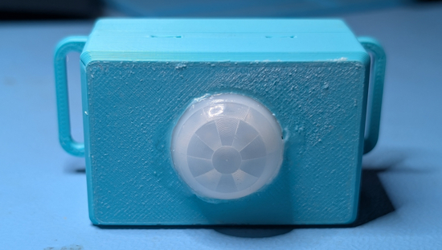](https://adafruit-playground.com/u/ntynen/pages/home-hub-motion-detector)

Home Hub - Motion Detector - [Adafruit Playground](https://adafruit-playground.com/u/ntynen/pages/home-hub-motion-detector).

[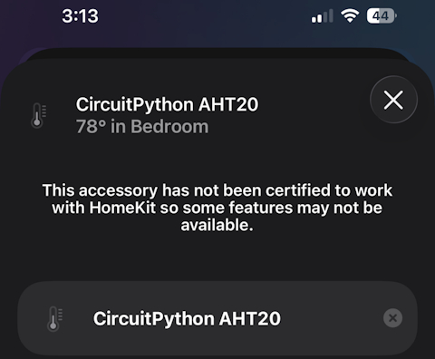](https://adafruit-playground.com/u/BlitzCityDIY/pages/homebridge-plugin-for-adafruit-io-feeds)

Homebridge Plugin for Adafruit IO Feeds - [Adafruit Playground](https://adafruit-playground.com/u/BlitzCityDIY/pages/homebridge-plugin-for-adafruit-io-feeds).

## News From Around the Web

[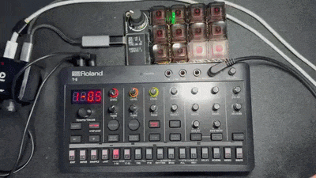](https://x.com/mugenkidou/status/2036451939685376371)

Adding a pattern chain function to the Roland AIRA Compact synth. It allows for 8 chains, with 2 fill-ins set per chain. Built using the Adafruit MacroPad RP2040 + CircuitPython. This lets it do pattern operations, allowing a user to focus on controlling the 303 - [X](https://x.com/mugenkidou/status/2036451939685376371).

[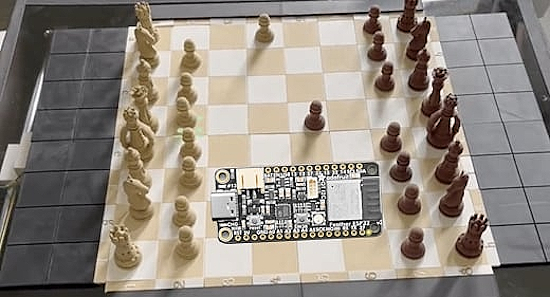](https://github.com/fizban99/micropython-usunfish)

The MicroPython uSunfish chess engine is an unofficial MicroPython port/derivative of Sunfish Chess Engine. It is tested with MicroPython V1.27.0 on ESP32-S3, but it is not memory-intensive so it should work on a plain ESP32 - [GitHub](https://github.com/fizban99/micropython-usunfish).

[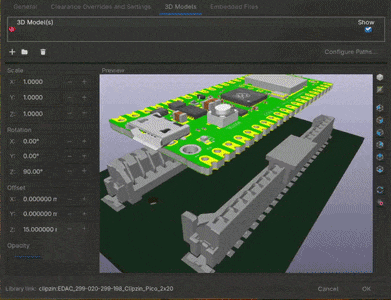](https://x.com/byte_thrasher/status/2037582722583949617)

SMD connectors (EDAC 299-020-299D198) for castellated edge Raspberry Pi Pico sized boards allow for insertion and removal without soldering - [EDAC](https://edac.net/series/299) and [KiCad footprint discussion](https://x.com/byte_thrasher/status/2037582722583949617).

[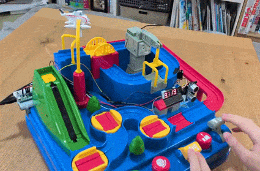](https://x.com/foka22ok/status/2037450355332776032)

A 12-year-old boy created a time attack feature for a toy where Thomas the Tank Engine goes around in a circle while operating a lever, using electronics tinkering. From the setup and wiring to the program using MicroPython, he assembled everything himself, with a mechanism that counts it as a goal when it reacts to the ultrasonic distance sensor near the finish line - [X](https://x.com/foka22ok/status/2037450355332776032) (Japanese).

A devilish version of an interactive desk pet using CircuitPython and an RP2040 Zero - [Reddit](https://www.reddit.com/r/circuitpython/comments/1ru0005/i_made_a_new_devilish_version_of_my_interactive/) and [GitLab](https://gitlab.com/desk-pets/lil-devil).

[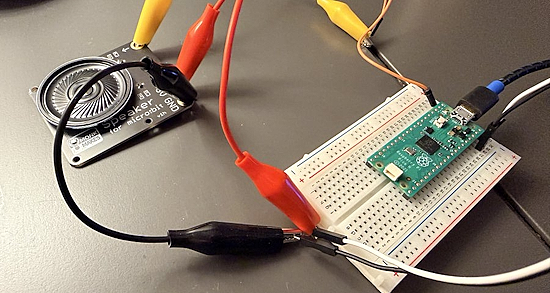](https://github.com/kevinmcaleer/sam)

A MicroPython port of SAM (Software Automatic Mouth), the classic text-to-speech engine originally created for the Commodore 64 in 1982. SAM runs on a Raspberry Pi Pico with just a speaker and a resistor. It uses PIO-driven PWM with DMA for jitter-free audio output at 22050 Hz - [GitHub](https://github.com/kevinmcaleer/sam). Via [X](https://x.com/kevsmac/status/2037282827033583789).

[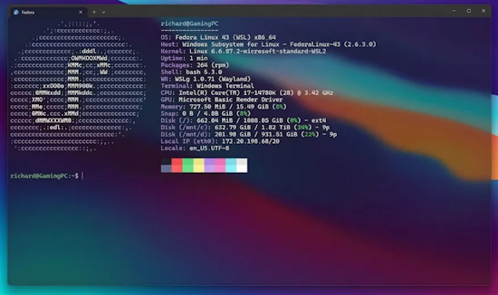](https://www.windowscentral.com/microsoft/windows-11/microsoft-quietly-announced-upcoming-wsl-upgrades-including-a-more-streamlined-first-time-setup-and-onboarding)

Microsoft quietly announced upcoming WSL upgrades, including a "more streamlined first-time setup and onboarding" - [Windows Central](https://www.windowscentral.com/microsoft/windows-11/microsoft-quietly-announced-upcoming-wsl-upgrades-including-a-more-streamlined-first-time-setup-and-onboarding).

Rewriting a 20-year-old Python library - [James Bennett](https://www.b-list.org/weblog/2026/mar/23/20-year-library/).

SATURNIX is an open-source digital camera with film simulation, using a Raspberry Pi Zero 2W and Python - [XDA](https://www.xda-developers.com/this-open-source-digital-camera-runs-on-a-raspberry-pi-and-looks-like-its-from-alien/) and [GitHub](https://github.com/Yutani140x/saturnix-camera?tab=readme-ov-file).

[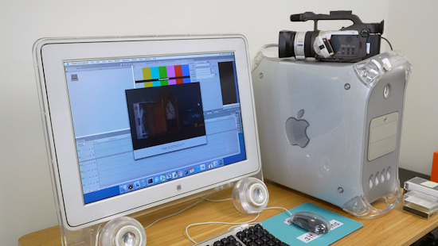](https://www.jeffgeerling.com/blog/2026/firewire-on-a-raspberry-pi/)

Using FireWire on a Raspberry Pi - [Jeff Geerling](https://www.jeffgeerling.com/blog/2026/firewire-on-a-raspberry-pi/).

[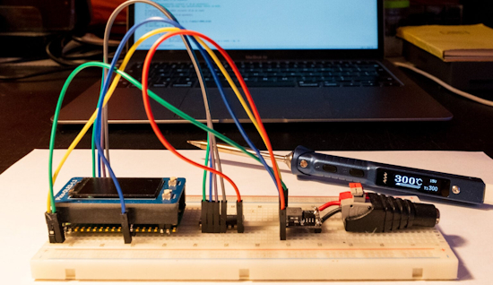](https://www.raspberrypi.com/news/raspberry-pi-pico-powered-sunrise-alarm-clock/)

A Raspberry Pi Pico 2W + MicroPython sunrise alarm clock - [Raspberry Pi News](https://www.raspberrypi.com/news/raspberry-pi-pico-powered-sunrise-alarm-clock/).

Python Is Dead? The Data Says Otherwise - [YouTube](https://www.youtube.com/watch?v=dO5hLngNbZI).

text - [site](url).

text - [site](url).

text - [site](url).

text - [site](url).

Four actually useful Python programs I use on my phone - [XDA](https://www.xda-developers.com/actually-useful-python-programs-i-use-on-my-phone/?shem=dsdf,sharefoc,agadiscoversdl,,sh/x/discover/m1/4).

Speed boost your Python programs with Python 3.15’s new lazy imports - [InfoWorld](https://www.infoworld.com/article/4145854/speed-boost-your-python-programs-with-new-lazy-imports.html).

## New

[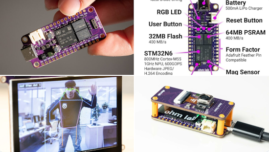](https://www.cnx-software.com/2026/03/23/ohm-lab-neuro-n6-modular-stm32n6-ai-vision-devkit-support-rolling-shutter-global-shutter-or-thermal-camera/)

Ohm Lab Neuro N6 is a compact, modular Edge AI/AI Vision development board powered by an STMicro STM32N6 Arm Cortex-M55 microcontroller with a 600 GOPS Neural-ART accelerator. The Adafruit Feather-sized board features 64MB PSRAM, 32MB flash, a built-in microphone, a 6-axis IMU and magnetometer, a USB-C port for power and programming, and takes power from USB-C (5V) or a LiPo battery. The bottom side of the board features 40-pin and 30-pin high-density connectors for expansion boards, adding a camera (rolling shutter, global shutter, or thermal), a microSD card slot, Ethernet, WiFi, a TFT display, and more - [CNX](https://www.cnx-software.com/2026/03/23/ohm-lab-neuro-n6-modular-stm32n6-ai-vision-devkit-support-rolling-shutter-global-shutter-or-thermal-camera/).

[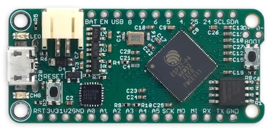](https://blog.adafruit.com/2026/03/24/an-esp32-p4-board-in-the-feather-form-factor/)

An ESP32-P4 board in the Feather form factor - [Adafruit Blog](https://blog.adafruit.com/2026/03/24/an-esp32-p4-board-in-the-feather-form-factor/).

## New Boards Supported by CircuitPython

The number of supported microcontrollers and Single Board Computers (SBC) grows every week. This section outlines which boards have been included in CircuitPython or added to [CircuitPython.org](https://circuitpython.org/).

This week there were (#/no) new boards added:

- [Board name](url)
- [Board name](url)
- [Board name](url)

*Note: For non-Adafruit boards, please use the support forums of the board manufacturer for assistance, as Adafruit does not have the hardware to assist in troubleshooting.*

Looking to add a new board to CircuitPython? It's highly encouraged! Adafruit has four guides to help you do so:

- [How to Add a New Board to CircuitPython](https://learn.adafruit.com/how-to-add-a-new-board-to-circuitpython/overview)
- [How to add a New Board to the circuitpython.org website](https://learn.adafruit.com/how-to-add-a-new-board-to-the-circuitpython-org-website)
- [Adding a Single Board Computer to PlatformDetect for Blinka](https://learn.adafruit.com/adding-a-single-board-computer-to-platformdetect-for-blinka)
- [Adding a Single Board Computer to Blinka](https://learn.adafruit.com/adding-a-single-board-computer-to-blinka)

## New Adafruit Learning System Guides

The [Adafruit Learning System](https://learn.adafruit.com/) has over 3,200 free guides for learning skills and building projects including using Python.

[title](url) from [name](url)

[title](url) from [name](url)

[title](url) from [name](url)

## Updated Learn Guides

[title](url)

## CircuitPython Libraries

The CircuitPython library numbers are continually increasing, while existing ones continue to be updated. Here we provide library numbers and updates!

To get the latest Adafruit libraries, download the [Adafruit CircuitPython Library Bundle](https://circuitpython.org/libraries). To get the latest community contributed libraries, download the [CircuitPython Community Bundle](https://circuitpython.org/libraries).

If you'd like to contribute to the CircuitPython project on the Python side of things, the libraries are a great place to start. Check out the [CircuitPython.org Contributing page](https://circuitpython.org/contributing). If you're interested in reviewing, check out Open Pull Requests. If you'd like to contribute code or documentation, check out Open Issues. We have a guide on [contributing to CircuitPython with Git and GitHub](https://learn.adafruit.com/contribute-to-circuitpython-with-git-and-github), and you can find us in the #help-with-circuitpython and #circuitpython-dev channels on the [Adafruit Discord](https://adafru.it/discord).

You can check out this [list of all the Adafruit CircuitPython libraries and drivers available](https://github.com/adafruit/Adafruit_CircuitPython_Bundle/blob/master/circuitpython_library_list.md). 

The current number of CircuitPython libraries is **568**!

**New Libraries**

Here are this week's new CircuitPython libraries:

* [adafruit/Adafruit_CircuitPython_TMAG5273](https://github.com/adafruit/Adafruit_CircuitPython_TMAG5273)
* [adafruit/Adafruit_CircuitPython_VCNL4030](https://github.com/adafruit/Adafruit_CircuitPython_VCNL4030)
* [tekktrik/CircuitPython_Nitroclass](https://github.com/tekktrik/CircuitPython_Nitroclass)

**Updated Libraries**

Here are this week's updated CircuitPython libraries:

* [adafruit/Adafruit_CircuitPython_ST7735R](https://github.com/adafruit/Adafruit_CircuitPython_ST7735R)
* [adafruit/Adafruit_CircuitPython_NeoPixel](https://github.com/adafruit/Adafruit_CircuitPython_NeoPixel)
* [adafruit/Adafruit_CircuitPython_USB_Host_Mouse](https://github.com/adafruit/Adafruit_CircuitPython_USB_Host_Mouse)
* [adafruit/Adafruit_CircuitPython_VCNL4030](https://github.com/adafruit/Adafruit_CircuitPython_VCNL4030)
* [tekktrik/CircuitPython_functools](https://github.com/tekktrik/CircuitPython_functools)

## What’s the CircuitPython team up to this week?

What is the team up to this week? Let’s check in:

**Dan**

I was on vacation the week before last. I'm now working on merging MicroPython v1.27 into CircuitPython. In the past, we've merged one version at at time, but I'm skipping a separate merge for v1.26 and going directly to v1.27.

**Tim**

This week I worked on the CircuitPython driver and Adafruit Learning System guide for the VCNL4030 breakout. While working on this, and the last few I2C based drivers, I've been building out a set of test scripts and agent SKILL.md files that make it possible to do automated hardware testing of the breakout. I built a rig out of KNex that has a stepper motor, NeoPixels and a little shelf to hold the breakout. The components get used by various hardware tests to validate that the light and proximity sensing are behaving as expected. I demonstrated the setup, and tests that it enables, on Show & Tell.

**Scott**

text.

**Liz**

This week I worked on two new product guides. The first is the [TMAG5273 magnetometer](https://learn.adafruit.com/adafruit-tmag5273-3d-hall-effect-magnetometer-breakout). This magnetometer a 3D hall effect sensor, making it good for magnetic rotary encoders or joysticks. I also worked on the [ADS122C04 ADC](https://learn.adafruit.com/adafruit-ads122c04-24-bit-adc). This ADC is a 24-bit ADC with four inputs, which is really high resolution. 

I also started making a new weekly video short. It's a [Learn Guide Recap video](https://youtube.com/shorts/FcLN-i9nQgI). Each week I'll compile all of the new guides that went live. I'm excited about this and hope it can grow to be a collaborative video with folks on the team as it progresses.

## Upcoming Events

The next MicroPython Meetup in Melbourne will be on March 25th – [Luma](https://luma.com/yx0k7u69). You can see recordings of previous meetings on [YouTube](https://www.youtube.com/@MicroPythonOfficial). 

[PyCon DE & PyData 2026](https://2026.pycon.de/) will be 13 April 2026 – 17 April 2026 in Darmstadt, Germany

**Other Events This Year**

* [PyCon US](https://us.pycon.org/2026/) is May 13 - May 19, 2026 in Long Beach, California
* [The Open Source Hardware Association Open Hardware Summit](https://oshwa.org/announcements/the-2026-open-hardware-summit-schedule-is-out/) is coming to Berlin, Germany on May 23rd and 24th, 2026.
* [EuroPython 2026](https://ep2026.europython.eu/) is coming to Kraków, Poland 13-19 July, 2026.
* [PyOhio 2026](https://www.pyohio.org/2026/) is from 25 July through 26 July, 2026 this year in Cleveland, USA.
* [HOPE 26 Conference](https://store.2600.com/products/tickets-to-hope-26) is from August 14th through 16th at the New Yorker Hotel, NY, NY.
* [PyCon AU 2026](https://2026.pycon.org.au/) will be 26 Aug. 2026 – 30 Aug. 2026 in Brisbane, Australia

If you know of virtual events or upcoming events, please let us know via email to cpnews(at)adafruit(dot)com.

## Latest Releases

CircuitPython's stable release is [10.1.4](https://github.com/adafruit/circuitpython/releases/latest) and its unstable release is [10.2.0-alpha.1](https://github.com/adafruit/circuitpython/releases). New to CircuitPython? Start with our [Welcome to CircuitPython Guide](https://learn.adafruit.com/welcome-to-circuitpython).

[20260326](https://github.com/adafruit/Adafruit_CircuitPython_Bundle/releases/latest) is the latest Adafruit CircuitPython library bundle.

[20260319](https://github.com/adafruit/CircuitPython_Community_Bundle/releases/latest) is the latest CircuitPython Community library bundle.

[v1.27.0](https://micropython.org/download) is the latest MicroPython release. Documentation for it is [here](http://docs.micropython.org/en/latest/pyboard/).

[3.14.3](https://www.python.org/downloads/) is the latest Python release. The latest pre-release version is [3.15.0a7](https://www.python.org/download/pre-releases/).

[4,477 Stars](https://github.com/adafruit/circuitpython/stargazers) Like CircuitPython? [Star it on GitHub!](https://github.com/adafruit/circuitpython)

## Call for Help -- Translating CircuitPython is now easier than ever

[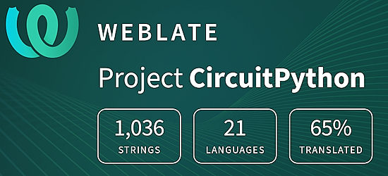](https://hosted.weblate.org/engage/circuitpython/)

One important feature of CircuitPython is translated control and error messages. With the help of fellow open source project [Weblate](https://weblate.org/), we're making it even easier to add or improve translations. 

Sign in with an existing account such as GitHub, Google or Facebook and start contributing through a simple web interface. No forks or pull requests needed! As always, if you run into trouble join us on [Discord](https://adafru.it/discord), we're here to help.

## 39,051 Thanks

The Adafruit Discord community, where we do all our CircuitPython development in the open, reached over 39,051 humans - thank you! Adafruit believes Discord offers a unique way for Python on hardware folks to connect. Join today at [https://adafru.it/discord](https://adafru.it/discord).

## ICYMI - In case you missed it

Python on hardware is the Adafruit Python video-newsletter-podcast! The news comes from the Python community, Discord, Adafruit communities and more and is broadcast on ASK an ENGINEER Wednesdays. The complete Python on Hardware weekly videocast [playlist is here](https://www.youtube.com/playlist?list=PLjF7R1fz_OOXRMjM7Sm0J2Xt6H81TdDev). The video podcast is on [iTunes](https://itunes.apple.com/us/podcast/python-on-hardware/id1451685192?mt=2), [YouTube](http://adafru.it/pohepisodes), [Instagram](https://www.instagram.com/adafruit/channel/)), and [XML](https://itunes.apple.com/us/podcast/python-on-hardware/id1451685192?mt=2).

[The weekly community chat on Adafruit Discord server CircuitPython channel - Audio / Podcast edition](https://itunes.apple.com/us/podcast/circuitpython-weekly-meeting/id1451685016) - Audio from the Discord chat space for CircuitPython, meetings are usually Mondays at 2pm ET, this is the audio version on [iTunes](https://itunes.apple.com/us/podcast/circuitpython-weekly-meeting/id1451685016), Pocket Casts, [Spotify](https://adafru.it/spotify), and [XML feed](https://adafruit-podcasts.s3.amazonaws.com/circuitpython_weekly_meeting/audio-podcast.xml).

## Contribute

The CircuitPython Weekly Newsletter is a CircuitPython community-run newsletter emailed every Monday. To contribute your content, please email your news to cpnews (at) adafruit (dot) com with information and link(s) to your content. 

Join the Adafruit [Discord](https://adafru.it/discord) or [post to the forum](https://forums.adafruit.com/viewforum.php?f=60) if you have questions.
