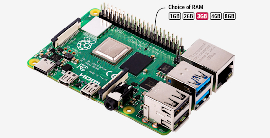
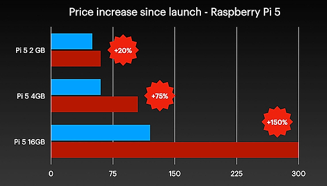
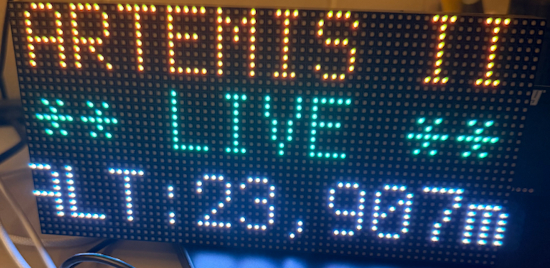
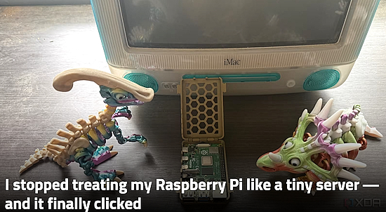
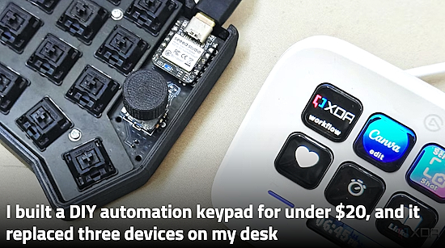
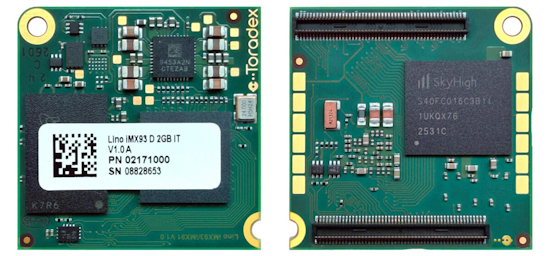
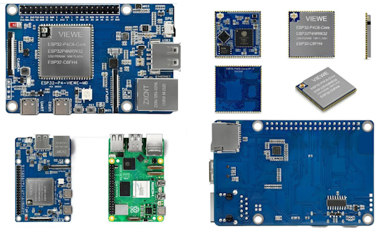
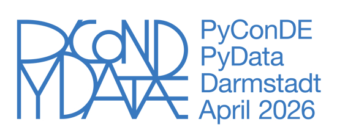
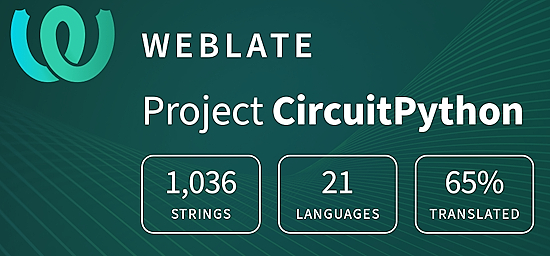

- [ ] Library and info updates
- [ ] change date
- [ ] update title
- [ ] Feature story
- [ ] Update  for images
- [ ] Update ICYDNCI
- [ ] All images 550w max only
- [ ] Link "View this email in your browser."

News Sources

- [Adafruit Playground](https://adafruit-playground.com/)
- Twitter: [CircuitPython](https://twitter.com/search?q=circuitpython&src=typed_query&f=live), [MicroPython](https://twitter.com/search?q=micropython&src=typed_query&f=live) and [Python](https://twitter.com/search?q=python&src=typed_query)
- [Raspberry Pi News](https://www.raspberrypi.com/news/), [Pi Foundation](https://www.raspberrypi.org/blog/)
- Mastodon [CircuitPython](https://mastodon.social/tags/CircuitPython) and [MicroPython](https://mastodon.social/tags/MicroPython)
- BlueSky [CircuitPython](https://bsky.app/search?q=circuitpython), [MicroPython](https://bsky.app/search?q=micropython), [Raspberry Pi](https://bsky.app/search?q=raspberry+pi)
- [Google News Python](https://news.google.com/topics/CAAqIQgKIhtDQkFTRGdvSUwyMHZNRFY2TVY4U0FtVnVLQUFQAQ?hl=en-US&gl=US&ceid=US%3Aen)
- YouTube: [CircuitPython](https://www.youtube.com/results?search_query=circuitpython&sp=CAISBAgDEAE%253D), [MicroPython](https://www.youtube.com/results?search_query=micropython&sp=CAISBAgDEAE%253D), [Prof Gallaugher](https://www.youtube.com/@BuildWithProfG/videos)
- [maker.io Python](https://www.digikey.com/en/maker/search-results?s=createdDate&t=python)
- [hackster.io CircuitPython](https://www.hackster.io/search?q=circuitpython&i=projects&sort_by=most_recent) and [MicroPython](https://www.hackster.io/search?q=micropython&i=projects&sort_by=most_recent)
- Instructables: [CircuitPython](https://www.instructables.com/search/?q=circuitpython&projects=all&sort=Newest), [MicroPython](https://www.instructables.com/search/?q=micropython&projects=all&sort=Newest), [Raspberry Pi Python](https://www.instructables.com/search/?q=raspberry+pi+python&projects=all&sort=Newest)
- [hackaday CircuitPython](https://hackaday.com/blog/?s=circuitpython) and [MicroPython](https://hackaday.com/blog/?s=micropython)
- [python.org](https://www.python.org/)
- [Python Insider - dev team blog](https://pythoninsider.blogspot.com/)
- Individuals: [bret.dk](https://bret.dk/), [Jeff Geerling](https://www.jeffgeerling.com/blog), [Yakroo](https://x.com/Yakroo5077), [coXXect](https://coxxect.blogspot.com/)
- Tom's Hardware: [CircuitPython](https://www.tomshardware.com/search?searchTerm=circuitpython&articleType=all&sortBy=publishedDate) and [MicroPython](https://www.tomshardware.com/search?searchTerm=micropython&articleType=all&sortBy=publishedDate) and [Raspberry Pi](https://www.tomshardware.com/search?searchTerm=raspberry%20pi&articleType=all&sortBy=publishedDate)
- [hackaday.io newest projects MicroPython](https://hackaday.io/projects?tag=micropython&sort=date) and [CircuitPython](https://hackaday.io/projects?tag=circuitpython&sort=date)
- hackaday.io - [CircuitPython](https://hackaday.io/search?term=circuitpython) and [MicroPython](https://hackaday.io/search?term=micropython)
- [MicroPython Meeting](https://luma.com/micropython?k=c)

View this email in your browser. **Warning: Flashing Imagery**

Welcome to the latest Python on Microcontrollers newsletter! *insert 2-3 sentences from editor (what's in overview, banter)* - *Anne Barela, Editor*

We're on [Discord](https://discord.gg/HYqvREz), [Twitter/X](https://twitter.com/search?q=circuitpython&src=typed_query&f=live), [BlueSky](https://bsky.app/profile/circuitpython.org) and for past newsletters - [view them all here](https://www.adafruitdaily.com/category/circuitpython/). If you're reading this on the web, please [subscribe here](https://www.adafruitdaily.com/). Here's the news this week:

## Headline

text - [site](url).

## Feature

text - [site](url).

## Feature

text - [site](url).

## Raspberry Pi 4 3GB launched for $83.75, further price increases announced across the board for 4GB+ RAM hardware

This may sound like an April Fool’s joke, but the Raspberry Pi 4 with 3GB RAM is real and now offered for $83.75. Raspberry Pi also announced another round of price increase for Raspberry Pi 4/5/CM4/CM5 due to a “seven-fold increase over the last year in the price of LPDDR4 DRAM“ - [CNX](https://www.cnx-software.com/2026/04/01/raspberry-pi-4-3gb-launched-for-83-75-further-price-increases-announced-across-the-board-for-4gb-ram-hardware/) and [Raspberry Pi News](https://www.raspberrypi.com/news/a-new-3gb-raspberry-pi-4-for-83-75-and-more-memory-driven-price-increases/).

> "We’ve said a number of times now that memory prices won’t remain at their current very high level indefinitely; the circumstances in which we find ourselves are challenging, but in the future they will abate. When they do, we will reverse our price increases, and until they do, we will continue to work hard to limit their impact in every way we can." - Raspberry Pi

## DRAM Pricing is Killing the Hobbyist SBC Market

"Unless the DRAM pricing situation changes radically, I think the hobbyist SBC market is dying—or at least on life support. And I don't just mean Raspberry Pis, but all SBC vendors. LPDDR chips now account for the majority of board cost from the vendors I've checked with." - [Jeff Geerling](https://www.jeffgeerling.com/blog/2026/dram-pricing-is-killing-the-hobbyist-sbc-market/) and [YouTube](https://youtu.be/HeX22LnKdFY?si=5pofmIJhZ2Ony0wk).

## New Report Shows the Memory Crisis May be Subsiding as 'DDR5 Retail Prices Pullback'

After months of devastating price hikes, the cost of RAM is starting to fall. Trendforce reports that U.S. DDR5 RAM prices have dropped by over 20% in the last month — with similar reductions being seen across the world. They note three reasons: The OpenAI “rug pull”,
Google’s recently announced TurboQuant - able to compress AI’s working memory by at least 6x and make it 8x faster, and people don’t want to pay absurd prices - [Tom's Guide](https://www.tomsguide.com/computing/hardware/ram-prices-are-finally-dropping-but-i-wouldnt-celebrate-just-yet) and [TechRadar](https://www.techradar.com/computing/memory/ddr5-retail-prices-pullback-amid-market-correction-trendforce-report-sparks-hope-that-we-might-be-turning-a-corner-in-the-ram-crisis).

*Ed. Note: The demand for personal AI/LLM assistants, like OpenClaw machines, will likely put pressure on memory price decreases.*

## Velxio – an Arduino and Embedded Board Emulator

David Montero Crespo has released Velxio, a fully local, open-source multi-board emulator. Write Arduino, C++ or Python, compile it, and simulate it with real CPU emulation and 48+ interactive electronic components — all running in a browser - [Velxio](https://velxio.dev/) and [GitHub](https://github.com/davidmonterocrespo24/velxio?tab=readme-ov-file).

## Feature

text - [site](url).

## This Week's Python Streams

Python on Hardware is all about building a cooperative ecosphere which allows contributions to be valued and to grow knowledge. Below are the streams within the last week focusing on the community.

**CircuitPython Deep Dive Stream**

[Last Friday](link), Scott streamed work on {subject}.

You can see the latest video and past videos on the Adafruit YouTube channel under the Deep Dive playlist - [YouTube](https://www.youtube.com/playlist?list=PLjF7R1fz_OOXBHlu9msoXq2jQN4JpCk8A).

**CircuitPython Parsec**

John Park’s CircuitPython Parsec this week is on {subject} - [Adafruit Blog](link) and [YouTube](link).

Catch all the episodes in the [YouTube playlist](https://www.youtube.com/playlist?list=PLjF7R1fz_OOWFqZfqW9jlvQSIUmwn9lWr).

**Deep Dive with Tim**

[Last week](), Tim streamed work on .

You can see the latest video and past videos on the Adafruit YouTube channel under the Deep Dive playlist - [YouTube](https://www.youtube.com/playlist?list=PLjF7R1fz_OOWFqZfqW9jlvQSIUmwn9lWr).

**CircuitPython Weekly Meeting**

CircuitPython Weekly Meeting for {date} ([notes](file)) [on YouTube](link).

## Project of the Week: Artemis II Live Tracker on Matrix Portal M4

The Artemis II Live Tracker is a CircuitPython project for the Adafruit Matrix Portal M4 + 64×32 RGB LED matrix that displays real-time Artemis II mission status. The display automatically transitions through mission phases: Pre-launch countdown, Live in-flight telemetry (AROW data), and Post-mission splashdown messages - [Adafruit Forums](https://forums.adafruit.com/viewtopic.php?t=223262) and [GitHub](https://github.com/jeffg38/artemis-ii-matrix-portal).

## Popular Last Week

What was the most popular, most clicked link, in [last week's newsletter](https://www.adafruitdaily.com/2026/03/30/python-on-microcontrollers-newsletter-the-python-developers-survey-espressif-news-malware-and-more-circuitpython-python-micropython-thepsf-raspberry_pi/)? [Four actually useful Python programs I use on my phone](https://www.xda-developers.com/actually-useful-python-programs-i-use-on-my-phone/).

Did you know you can read past issues of this newsletter in the Adafruit Daily Archive? [Check it out](https://www.adafruitdaily.com/category/circuitpython/).

## New Notes from Adafruit Playground

[Adafruit Playground](https://adafruit-playground.com/) is a new place for the community to post their projects and other making tips/tricks/techniques. Ad-free, it's an easy way to publish your work in a safe space for free.

text - [Adafruit Playground](url).

text - [Adafruit Playground](url).

text - [Adafruit Playground](url).

## News From Around the Web

Mario Cruz created an interactive art installation for the O, Miami Poetry Festival. Dial a number on a real phone keypad, hear ringing, then listen to a poem through the earpiece. Every number leads to a poem — but some numbers hide surprises. Built with a Raspberry Pi Pico, DFPlayer Mini MP3 module, CircuitPPython and a salvaged phone handset - [MarioTheMaker](https://mariothemaker.com/posts/poetry-phone-part-1.html).

text - [site](url).

text - [site](url).

text - [site](url).

text - [site](url).

text - [site](url).

I stopped treating my Raspberry Pi like a tiny server — and it finally clicked - [XDA](https://www.xda-developers.com/stopped-treating-raspberry-pi-tiny-server-clicked/).

I built a DIY automation keypad for under $20, and it replaced three devices on my desk (shows you can use CircuitPython) - [XDA](https://www.xda-developers.com/built-automation-keypad-under-20-replaced-devices-on-desk/).

text - [site](url).

text - [site](url).

text - [site](url).

text - [site](url).

text - [site](url).

text - [site](url).

text - [site](url).

text - [site](url).

text - [site](url).

text - [site](url).

## New

Toradex has launched two new ultra-compact (30x30mm) System-on-Module (SoM) families: OSM and Lino, powered by NXP i.MX 91 or i.MX 93 Arm Cortex-A55 SoC for Edge industrial and IoT applications - [CNX](https://www.cnx-software.com/2026/03/31/toradex-osm-and-lino-soms-30x30mm-nxp-i-mx-93-i-mx-91-modules-with-solder-down-or-b2b-connector-designs/).

Stamp-P4 is a high-performance embedded module based on the ESP32-P4NRW32 chip. Stamp-AddOn C6 For P4 is a Wi-Fi expansion module based on the ESP32-C6-MINI-1-N4, supporting 2.4GHz Wi-Fi 6 - [M5Stack Shop](https://shop.m5stack.com/products/m5stamp-esp32p4-module). Via [X](https://x.com/M5Stack/status/2037433012263194951?s=20).

The ESP32-P4-Pi-VIEWE is a Raspberry Pi-inspired development board equipped with a VIEWE ESP32-P4C6-Core module, combining a 400 MHz ESP32-P4 dual-core RISC-V MCU with an ESP32-C6 chip for Wi-Fi 6 and Bluetooth 5.0 wireless connectivity, as well as 32MB PSRAM and 16MB NOR flash.

The board also offers 10/100Mbps Ethernet connectivity, MIPI DSI, and CSI connectors for display and/or camera, two onboard microphones, a speaker output, a USB 2.0 port, a micro SD card slot, and the usual 40-pin GPIO header, all in a familiar 85 x 56 mm (Pi-sized) form factor - [CNX](https://www.cnx-software.com/2026/03/27/esp32-p4-pi-viewe-raspberry-pi-esp32-p4-esp32-c6-board/).

## New Boards Supported by CircuitPython

The number of supported microcontrollers and Single Board Computers (SBC) grows every week. This section outlines which boards have been included in CircuitPython or added to [CircuitPython.org](https://circuitpython.org/).

This week there were (#/no) new boards added:

- [Board name](url)
- [Board name](url)
- [Board name](url)

*Note: For non-Adafruit boards, please use the support forums of the board manufacturer for assistance, as Adafruit does not have the hardware to assist in troubleshooting.*

Looking to add a new board to CircuitPython? It's highly encouraged! Adafruit has four guides to help you do so:

- [How to Add a New Board to CircuitPython](https://learn.adafruit.com/how-to-add-a-new-board-to-circuitpython/overview)
- [How to add a New Board to the circuitpython.org website](https://learn.adafruit.com/how-to-add-a-new-board-to-the-circuitpython-org-website)
- [Adding a Single Board Computer to PlatformDetect for Blinka](https://learn.adafruit.com/adding-a-single-board-computer-to-platformdetect-for-blinka)
- [Adding a Single Board Computer to Blinka](https://learn.adafruit.com/adding-a-single-board-computer-to-blinka)

## New Adafruit Learning System Guides

The [Adafruit Learning System](https://learn.adafruit.com/) has over 3,200 free guides for learning skills and building projects including using Python.

[title](url) from [name](url)

[title](url) from [name](url)

[title](url) from [name](url)

## Updated Learn Guides

[title](url)

## CircuitPython Libraries

The CircuitPython library numbers are continually increasing, while existing ones continue to be updated. Here we provide library numbers and updates!

To get the latest Adafruit libraries, download the [Adafruit CircuitPython Library Bundle](https://circuitpython.org/libraries). To get the latest community contributed libraries, download the [CircuitPython Community Bundle](https://circuitpython.org/libraries).

If you'd like to contribute to the CircuitPython project on the Python side of things, the libraries are a great place to start. Check out the [CircuitPython.org Contributing page](https://circuitpython.org/contributing). If you're interested in reviewing, check out Open Pull Requests. If you'd like to contribute code or documentation, check out Open Issues. We have a guide on [contributing to CircuitPython with Git and GitHub](https://learn.adafruit.com/contribute-to-circuitpython-with-git-and-github), and you can find us in the #help-with-circuitpython and #circuitpython-dev channels on the [Adafruit Discord](https://adafru.it/discord).

You can check out this [list of all the Adafruit CircuitPython libraries and drivers available](https://github.com/adafruit/Adafruit_CircuitPython_Bundle/blob/master/circuitpython_library_list.md). 

The current number of CircuitPython libraries is **###**!

**New Libraries**

Here are this week's new CircuitPython libraries:

* [library](url)

**Updated Libraries**

Here are this week's updated CircuitPython libraries:

* [library](url)

## What’s the CircuitPython team up to this week?

What is the team up to this week? Let’s check in:

**Dan**

text.

**Tim**

This week I wrote a guide for an egg hunt maze game on the Fruit Jam. I also ran some infrastructure patches on the CircuitPython libraries. I converted the Arduino hardware tests for the APDS9999 breakout to CircuitPython and worked through testing them on hardware and tweaking some parts of the driver library based on the results. My next guide will cover using a Raspberry Pi as a network router. I've done lots of experimenting and begun writing pages for it.

**Scott**

This week I'm back after a short vacation and churning through testing and reviewing piles of LLM generated code. Dan approved and merged in some flash logic fixes for the Zephyr port. It was blocking some other changes (because the bugs made it hard to test.) So, now I've got a few more PRs out for review: adding I2S support, builds for the variety of Picos and adding the Feather nRF52840 Sense. 

The testing time needed after prompting for the code has me thinking about automating on device testing. Limor and Tim have started to play with this too. Getting hardware "in the loop" of an LLM will be super helpful.

**Liz**

This week I wrote up a [Playground note](https://adafruit-playground.com/u/BlitzCityDIY/pages/homebridge-plugin-for-adafruit-io-feeds) documenting an experiment I did with Homebridge. I wrote a plugin that lets your Adafruit IO feeds send data to Apple Home. I set it up so that each feed can be seen as a HomeKit service type. This means that if you were using, for example, an AHT20 temperature and humidity sensor, you could setup a feed for each parameter and then with the plugin have a Temperature Sensor and Humidity Sensor appear in your Apple Home.
I've also started researching and prototyping my next project guide which will involve ESP-NOW and audio.

## Upcoming Events

The next MicroPython Meetup in Melbourne will be on March 25th – [Luma](https://luma.com/r0rq9pl4). You can see recordings of previous meetings on [YouTube](https://www.youtube.com/@MicroPythonOfficial). 

[PyCon DE & PyData 2026](https://2026.pycon.de/) will be 13 April 2026 – 17 April 2026 in Darmstadt, Germany

**Other Events This Year**

* [PyCon US](https://us.pycon.org/2026/) is May 13 - May 19, 2026 in Long Beach, California
* [The Open Source Hardware Association Open Hardware Summit](https://oshwa.org/announcements/the-2026-open-hardware-summit-schedule-is-out/) is coming to Berlin, Germany on May 23rd and 24th, 2026.
* [EuroPython 2026](https://ep2026.europython.eu/) is coming to Kraków, Poland 13-19 July, 2026.
* [PyOhio 2026](https://www.pyohio.org/2026/) is from 25 July through 26 July, 2026 this year in Cleveland, USA.
* [HOPE 26 Conference](https://store.2600.com/products/tickets-to-hope-26) is from August 14th through 16th at the New Yorker Hotel, NY, NY.
* [PyCon AU 2026](https://2026.pycon.org.au/) will be 26 Aug. 2026 – 30 Aug. 2026 in Brisbane, Australia

If you know of virtual events or upcoming events, please let us know via email to cpnews(at)adafruit(dot)com.

## Latest Releases

CircuitPython's stable release is [#.#.#](https://github.com/adafruit/circuitpython/releases/latest) and its unstable release is [#.#.#-##.#](https://github.com/adafruit/circuitpython/releases). New to CircuitPython? Start with our [Welcome to CircuitPython Guide](https://learn.adafruit.com/welcome-to-circuitpython).

[2026####](https://github.com/adafruit/Adafruit_CircuitPython_Bundle/releases/latest) is the latest Adafruit CircuitPython library bundle.

[2026####](https://github.com/adafruit/CircuitPython_Community_Bundle/releases/latest) is the latest CircuitPython Community library bundle.

[v#.#.#](https://micropython.org/download) is the latest MicroPython release. Documentation for it is [here](http://docs.micropython.org/en/latest/pyboard/).

[#.#.#](https://www.python.org/downloads/) is the latest Python release. The latest pre-release version is [#.#.#](https://www.python.org/download/pre-releases/).

[#,### Stars](https://github.com/adafruit/circuitpython/stargazers) Like CircuitPython? [Star it on GitHub!](https://github.com/adafruit/circuitpython)

## Call for Help -- Translating CircuitPython is now easier than ever

One important feature of CircuitPython is translated control and error messages. With the help of fellow open source project [Weblate](https://weblate.org/), we're making it even easier to add or improve translations. 

Sign in with an existing account such as GitHub, Google or Facebook and start contributing through a simple web interface. No forks or pull requests needed! As always, if you run into trouble join us on [Discord](https://adafru.it/discord), we're here to help.

## NUMBER Thanks

The Adafruit Discord community, where we do all our CircuitPython development in the open, reached over NUMBER humans - thank you! Adafruit believes Discord offers a unique way for Python on hardware folks to connect. Join today at [https://adafru.it/discord](https://adafru.it/discord).

## ICYMI - In case you missed it

Python on hardware is the Adafruit Python video-newsletter-podcast! The news comes from the Python community, Discord, Adafruit communities and more and is broadcast on ASK an ENGINEER Wednesdays. The complete Python on Hardware weekly videocast [playlist is here](https://www.youtube.com/playlist?list=PLjF7R1fz_OOXRMjM7Sm0J2Xt6H81TdDev). The video podcast is on [iTunes](https://itunes.apple.com/us/podcast/python-on-hardware/id1451685192?mt=2), [YouTube](http://adafru.it/pohepisodes), [Instagram](https://www.instagram.com/adafruit/channel/)), and [XML](https://itunes.apple.com/us/podcast/python-on-hardware/id1451685192?mt=2).

[The weekly community chat on Adafruit Discord server CircuitPython channel - Audio / Podcast edition](https://itunes.apple.com/us/podcast/circuitpython-weekly-meeting/id1451685016) - Audio from the Discord chat space for CircuitPython, meetings are usually Mondays at 2pm ET, this is the audio version on [iTunes](https://itunes.apple.com/us/podcast/circuitpython-weekly-meeting/id1451685016), Pocket Casts, [Spotify](https://adafru.it/spotify), and [XML feed](https://adafruit-podcasts.s3.amazonaws.com/circuitpython_weekly_meeting/audio-podcast.xml).

## Contribute

The CircuitPython Weekly Newsletter is a CircuitPython community-run newsletter emailed every Monday. To contribute your content, please email your news to cpnews (at) adafruit (dot) com with information and link(s) to your content. 

Join the Adafruit [Discord](https://adafru.it/discord) or [post to the forum](https://forums.adafruit.com/viewforum.php?f=60) if you have questions.
